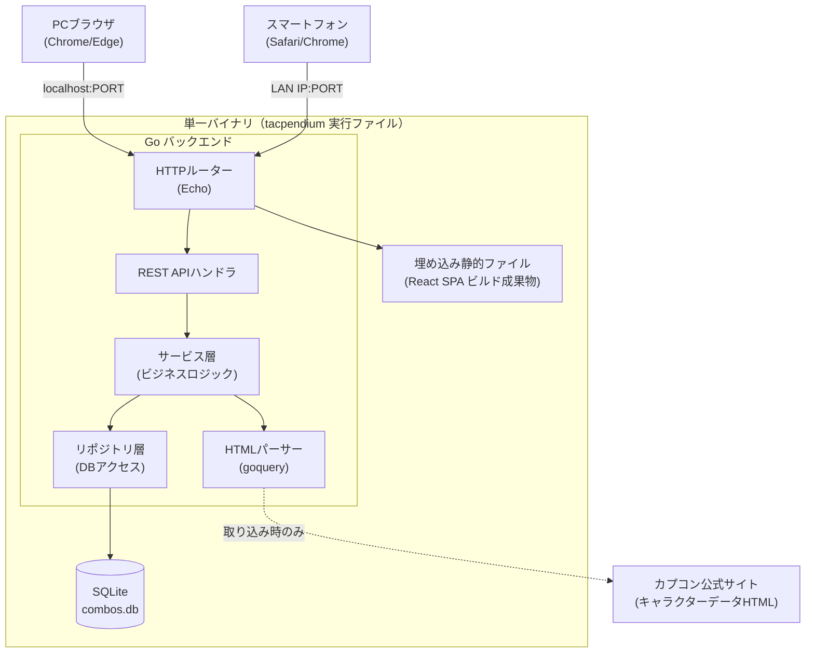
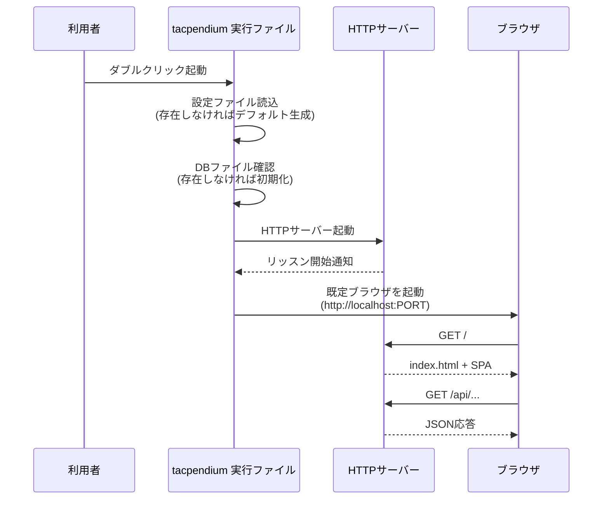

# アーキテクチャ設計書

| 項目 | 内容 |
|------|------|
| 文書ID | DES-002 |
| バージョン | **1.100.0** |
| 作成日 | 2026-04-10 |
| ステータス | **★★★2026-09-20 改訂（`CHANGE-233` / `CHANGE-234` 反映・`M36-02`・`D-914`）**：**★★★§11.3 の CI が「2 本立て」から「3 本立て」になった**〔リリース区分の新設。**公開リポジトリでのみ走る**〕**。⇒ `CHANGE-129` §4 の「Releases への自動添付＝作らない」を*明示的に撤回*した。★安全性の根拠はゲートではなく*構造*である**〔リポジトリ分割 ＋ public 限定ガード〕**。★契約 9**〔タグ署名は鍵未登録なら明示的に落ちる〕**を足した。★§11.2 へ来歴の as-built**〔attestation / SBOM / タグ署名 / 検証手順の正本〕**を足した。★実装の変更は 0 行。** 以下は前版の記述： **★★2026-09-19 改訂（`CHANGE-220` 反映・`M38-03`・`D-901`）**：**★★★§11.2 の macOS のアーカイブ名を `tacpendium-macos-arm64.tar.gz` → `tacpendium-darwin-arm64.tar.gz` へ**〔開発者裁定・案 (a)＝`D-893`〕**。⇒ あわせて「3 つとも GOOS 名で揃える ／ 正本は `scripts/release-targets.sh` の 1 行 ／ 名前を写しているのは配布 `README.txt` の 1 行だけ」を明文化した。** **★★同節の旧値を 2 つ是正＝「全 22 章」→「全 21 章」**〔`M38-02` が技編集の章を削除〕**／「27 枚の PNG」→「29 枚」**〔`M38-03` 着地時の実測＝本編 28 ＋ QS 1〕**。** **★実装の変更は 0 行**（**`M38-03` が実装済み。本 CHANGE は設計書側の反映である**）**。★§11.1 との amd64 の食い違いは据え置き。** 以下は前版の記述： **★★2026-09-17 改訂②（`CHANGE-213` 反映・`M36-01`・`D-890`）**：**★★★§11.2 の「zip / tar.gz を組む仕組みは存在しない」が失効した。⇒ `make release-archives` が実在する。** **★構成の正本は `scripts/release-targets.sh` の 1 か所**〔`Makefile` には名前を書かない。**3 か所目を作らない**〕**。★出力先は `dist/release/` でコミットしない。** **★★★配布物へライセンス関係 7 件を同梱した**〔2026-09-16 開発者判断。`LICENSE` / `DATA-LICENSE.md` / `NOTICE` / `REUSE.toml` ＋ `LICENSES/` 配下 3 本〕**。⇒ `LICENSES/` はディレクトリ名ごと保つ。★平坦化すると同梱した `NOTICE` の参照先が消える。** **★★SHA-256 は「壊れていないこと」だけを示す。⇒ 来歴の署名ではない**〔attestation は `M36-02`〕**。★「CI は組まない」は真のまま。** **★図数の断定を 22 → 27 へ是正**〔章数 22 と図数 27 の混同〕**。★スキーマ変更 0・マイグレ消費 0。** 以下は前版の記述： **★★2026-09-17 改訂（`CHANGE-212` 反映・`M32-03`・`D-889`）**：**★★§11.2 の配布アーカイブ構成へ `tacpendium-quickstart.html` を足した。⇒ `manual/` が 2 ファイルになった。** **★本編は縮めず別文書を足した**〔読者が 2 人いて要求が正反対であるため〕**。★`README.txt` が名指しするのは本編だけであり、クイックスタートへは前付けのリンク経由で送る。** **★スキーマ変更 0・マイグレ消費 0。** 以下は前版の記述： **★★2026-09-14 改訂②（`CHANGE-209` 反映・`M37-07`・`D-881`）**：**★★§4.2 の `combos` 経路が `starterMeaty` を運ぶ**〔`ComboResponse` と `DuplicateInfoResponse` の両方〕**。★★★`PATCH` には受け口を作らない**〔識別キーだからである〕**。⇒ この欄を変える編集は `PUT` へ行く。** **★新しいエラーコードは 1 つも増えていない。★一覧クエリの値域外は 400 で落とす**〔倒すと typo が全件返却に見える〕**。★重複判定の母集団は不変であり、足したのは述語 1 本だけ。** **★★§7 CSV 契約が 36 → 37 列**〔任意列・列末尾。**必須 22 は不変**〕**。** 以下は前版の記述： **★★2026-09-13 改訂③（`CHANGE-200` 反映・`M37-05`・`D-871`）**：**★★§4.2 の `PATCH /api/combos/{id}` がマス数を補完するようになった。⇒ `PUT` との食い違い**〔`P-60`〕**は解消した。★要求 DTO・応答 DTO・エラー契約は 1 バイトも変わっていない。** **★★★不変条件は*片方向*である**——**「区分あり ⇒ マス数あり」は 3 経路で成り立つが、逆向きは成り立たない。⇒ `PATCH` が `position` を書かず、かつ新しい拒否も足さないためである。★「3 経路で成り立つ」と無限定に書かないこと**（計測点 `M-177`）**。** **★持たせなかった分岐は 5 つ。★スキーマ変更 0・マイグレ消費 0。** 以下は前版の記述： **★★2026-09-13 改訂②（`CHANGE-197` 反映・`M37-03`・`D-866`）**：**★★§4.2 の `GET /api/combos` の `sort` が `deleted_at` を受理する。⇒ `only_deleted=true` の既定が `deleted_at DESC, id DESC` になった。** **★★★持たせなかった分岐を 3 つ明記した**〔通常一覧で `sort=deleted_at` を送っても拒否しない ／ **`sort=default` は「明示指定」でありゴミ箱でも始動状況順へ戻る** ／ セットプレイ側は 1 行も変えていない〕**。** **★通常一覧の既定は不変。★スキーマ変更 0・マイグレ消費 0。** 以下は前版の記述： **★★2026-09-13 改訂（`CHANGE-195` 反映・`M37-01`・`D-863`）**：**★★§4.2 の `PATCH /api/combos/{id}` がマス数 2 欄を運ぶ**〔`Optional[int]` のトライステート ＋ `VAL-RANGE` 400〕**。★着手前は両欄が無く、編集モードでマス数・運び量だけを直すと値が黙って落ちていた。** **★★★持たせなかった分岐を 3 つ明記した**〔`position` は載らない＝`normalizePositionAndMass` を呼ばない ／ 区分またぎの検出は無い ／ 整合検証は無い〕**。⇒ 振り分けはフロントが行う。** **★申し送り 2 件＝`VAL-C16` / `VAL-RANGE` の食い違いの影響範囲が 3 経路から 4 経路へ ／ `PATCH` と `PUT` で「マス数を空にする」の結果が食い違う**〔`P-60`〕**。** **★スキーマ変更 0・マイグレ消費 0・応答 DTO 不変。** 以下は前版の記述： **★★2026-09-12 改訂④（CHANGE-187 反映・`M34-02`・`D-834`）**：**★★★§3.1 へ常駐化の as-built を 6 ブロック新設した**〔起動オプションの契約 ／ `config.toml` 不在の WARN ／ 二重起動の判別 ／ **起動失敗時の表示** ／ トレイのメニュー 6 項目 ／ 終了の経路〕**。** **★★黒窓が消えた。⇒ 利用者に残る手掛かりはトレイのアイコンと `MessageBox` だけである。★起動失敗の 15 契機のうち 8 種が `config.toml` に帰着するため、パスを添えて置き場を開く。** **★★★画面側の終了ボタンは作らない**（`D-834`）**＝停止用の HTTP ルートを新設すると、LAN の他端末から認証なしで止められる口ができる。⇒ 公開ゲート `A` に逆行する。** **★ブラウザで開く URL の綴りは `localhost` に揃える**（`D-790` の文面を as-built へ補正。**理由は origin＝綴りを変えるとブラウザストレージの 9 キーが見えなくなる**）**。** **★★§8 へ簡易パスワードの復旧導線を書いた＝トレイから `config.toml` の置き場を開く。★API 経路の新設 0・スキーマ変更 0。** 以下は前版の記述： **★★2026-09-12 改訂③（CHANGE-186 反映・`M26-05`・`D-833`）**：**★★§8 の「経路を問わない」を as-built として確定した＝ウィザード側にも警告と同意が入った。** **★★★あわせて限界を明記した＝ゲートは画面の中で閉じており、`PUT /api/config` を直接叩けば同意なしで LAN 化できる。⇒ 割り切りの範囲だが記録する。** **★API 経路の新設 0・スキーマ変更 0**（`M26-05` の `internal/` 差分は 0 バイト）**。** 以下は前版の記述： **★★2026-09-12 改訂②（CHANGE-185 反映・`M26-05`・`D-826`）**：**★★§8 の警告・同意の要件へ「経路を問わない」を明記した**〔設定画面と初回起動ウィザードの*両方*〕**。** **★★★経路を書いていなかったために実際に片方だけ実装された。⇒ 明記は事後の補強である。** **★API 経路の新設 0・スキーマ変更 0。** 以下は前版の記述： **★★2026-09-12 改訂（CHANGE-184 反映・`M30-04`・`D-825`）**：**★★§4.2 の `GET /api/moves` へ `isDerived: boolean` を書いた**〔`omitempty` 無し ⇒ false でも必ず出る〕**。★増えたのは 1 キーだけ・母集団の述語もエラー契約も不変。** **★`GET /api/moves/:id` は 1 バイトも動いていない**（意図的な非露出。**ただし `getByIDSQL` には列を足してある**）**。★スキーマ変更 0・API 経路の新設 0。** 以下は前版の記述： **★★第80版（2026-09-10・CHANGE-176 反映：`M31-04`・`D-810`）**：**★★§4 のドライブリバーサルの注記へ「実装された」を追記した**〔31 行 ／ 持ち場はマイグレ ／ 入れるが走査から外す ／ **★「列に入れなければ出ない」は成り立たない**〕**。★スキーマ変更 0・API 経路の新設 0。** 以下は前版の記述： **★★第79版（2026-09-09・CHANGE-172 反映：`M35-01`・`D-794`）**：**★★§4.2 へタグの経路 4 本を新規記載した。⇒ タグの API 契約は、これまで本書に 1 行も無かった。** **★`DELETE /api/tags/{id}` のエラー契約の全行 ＋ `409 tag_in_use` の `details` 2 キー**（`usageCount` / `forceDeleteQuery`。**旧 snake_case から改名**）**＋ 持たせなかった分岐 3 つ**（**403 なし ／ 他人には 409 を返さない ／ `existing_tag_id` 廃止**）**。** **★★`PATCH /api/tags/{id}` の `category` / `color` は未設定へ戻せない**（**`null` でも同じ。理由＝`encoding/json` がキーの省略と `null` を区別できない**）**。★これは欠陥ではなく仕様である。** **★スキーマ変更 0・マイグレ消費 0・新規依存 0・実装差分 0**（**as-built の書き写しである**）**。** 以下は前版の記述： **第78版（2026-09-08・CHANGE-168 反映：`M31-01`・`D-781`）**：**★★§4.2 の `VAL-C15` 経路表で `Materialize` を「走らない」→「通る」へ書き換えた。⇒ 必須 4 欄が空のまま本登録コンボが生まれる抜け穴が塞がった。** **★母集団の述語＝生成物が本登録になるときだけ**（`gen.IsDraft == false`）**。★判定は書き込み Tx の内側・`INSERT` の前**（`VAL-C02` と同じ位置）**。** **★★持たせなかった分岐が 2 つある**——**FR301 の既存一致は `VAL-C15` の手前で返る**〔**意図。新しい行を作らないため。塞ぐと既存の確定反撃版へ到達できなくなる**〕**／ 既存の生成物の編集・保存は 1 文字も変えていない。** **★materialize の異常応答へ `400 validation_failed` を追加。★(1-a) の経路列挙を 5 → 6 へ。** **★★`DELETE /api/setups/{id}` にクエリ `unlinkFrom` が増えた。⇒ 副作用「2 つだけ」が失効した。★省略時は着手前と 1 バイトも変わらない。★消すのは指定された 1 組だけである**（**全消しは `D-484` が撤回した案 P1 に戻る**）**。** **★スキーマ変更 0・マイグレ消費 0・新規依存 0。** 以下は前版の記述： **第77版（2026-09-07・CHANGE-165 反映：`M29-02`〔入出力〕・`D-770`）**：**★★§4.2 へ `GET /api/export/csv` の応答ヘッダ 4 本**〔切り捨ては 200 ＋ ヘッダで伝える〕**と `GET /api/combos` の `total` 欄を書いた。★`total > count` が「切り捨てた」の唯一の観測である。★§7.6 へ「列の不在と値の不在は別である」を明記した。** 以下は前版の記述： **★★第76版（2026-09-07・CHANGE-164 反映：`M28-02c`〔`FR702` のバックエンドと影響コンボ画面〕・`D-769`）**：**★★§4.2 の経路 3 本から「未実装」を外し as-built を書いた**〔`affectedMoves` は空でも `[]` ／ 載る面はコンボを返す全経路 ／ 告知 API と延期 API のエラー契約の全行 ／ **持たせなかった分岐**〕**。★`COUNT` は判定式を持たず、`List` の絞り込みの組み立てを共有する。** 以下は前版の記述： **★★第75版（2026-09-06・CHANGE-162 反映：`M28-02b`〔影響コンボの画面・設計まで〕・`D-758`）**：**★★§4.2 へ経路 2 本を新設**〔`GET /api/notices/game-update` ／ `POST /api/notices/game-update/postpone`〕**＋ `ComboResponse.affectedMoves` を新設。★★3 つとも未実装であり `M28-02c` が作る。⇒ 各行へ明記した。** **★★`affectedMoves` が無いと「影響がある」としか言えず、`FR702` の目的が未達のまま画面だけが出来る。** **★告知の延期はサーバ側ファイルが持ち、LAN で全員に効く。★ただし抑止するのはバナーだけでありボタンは抑止しない**〔**分水嶺**〕**。** **★`acknowledge-version` の画面ラベルは「問題なし」である**〔API 名は変えていない〕**。** 以下は前版の記述： **★★第74版（2026-09-06・CHANGE-159 反映：`M28-02a`〔`FR702` 追従のスキーマとバックエンド〕・`D-748`）**：**★★§4.2 へ経路 2 本を新設**〔`POST /api/combos/{id}/acknowledge-version`＝「確認した」／ `GET /api/combos?affected_by_game_update=`〕**。** **★★「確認した」が持たない分岐 5 つを明記した**——**とくに (2) 楽観的排他を要求せず 409 が無いこと と (3) 一括操作が無いこと。⇒ `M28-02b` が一括を採るなら経路の追加が要る。** **★`ComboResponse` へ 4 欄。`affectedByGameUpdate` だけ `omitempty` を付けていない**〔**`false` は情報であり、キーが消えると「判定していない」と区別が付かない**〕**。** **★★`PATCH` は基準を進めない**——**`PUT` との非対称であり意図した設計ではない**（`followup` 行あり）**。** **★§7.6 へ CSV 2 列**〔`start_position_mass` / `carry_distance_mass`。**`baseline_version` は載せない**〕**。★必須列 22 は不変。** 以下は前版の記述： **第73版（2026-09-05・CHANGE-153 反映：M27-02b〔入力仕様の 3 状態〕・`D-704`）**：**★★§4.2 へ `VAL-C15`（本登録の必須 4 欄・ERROR）の経路表を追記した。★最重要＝`PATCH` は「更新後の姿」を見るため、4 欄が空の既存本登録コンボは必須欄に触らない `PATCH` でも咎められる。★`Materialize` は本 VAL を通らない（抜け穴）。** **★§7.6 へ CSV の `oki_verified` 列（任意列・列末尾）を追記。必須列 22 と起き攻め 12 列は不変。** 以下は前版の記述： **第72版（2026-09-03・CHANGE-152 反映：M27-02a〔届かないものを届かせる〕・`D-694`）**：**★★§4.2「Details.validations の典型構造」へ `validation_failed` の 3 系統の表を新設した**〔**(1-a) 5 経路＝400・`message` 固定・`details.validations` ／ (1-b) `PUT /api/config`＝422・英語・`issues[]` 手組み ／ (1-c) `PATCH /api/moves/{id}`＝`details.field` 形**〕。**★★(1-b)(1-c) は統一漏れではなく別系統であることを明記した**——**書かないと、1 系統だけを見た担当が欠陥として起票して揃えに行く。** **★`omitempty` の非対称を明記**〔**`issues[].field` は消える ／ `error.message` は `""` として出る。⇒ 書き忘れが応答に現れる**〕。**★500 `internal_error` は必ず非空の `message` を持つ**（実測 53/53）。**★スキーマ変更 0・マイグレ 0。** 以下は前版の記述： **第71版（2026-08-31・CHANGE-148 反映②：M24-08 の手交後追記・D-629）**：**★★§11.3 へ契約 8 を新設した**〔**summary の件数抽出は ANSI を落としてから行う。空のときは「読めなかった」と名乗らせる**。**★`web test (Vitest)` の summary は `M24-09a` の新設以来、件数を 1 度も記録できていなかった**〕。 以下は前版の記述： **第70版（2026-08-31・CHANGE-148 反映：M24-08〔`queryKey` の統一 ＋ M24 の繰越 4 件〕・D-620 / D-623）**：**★★§4.2 の経路表へ `POST /api/presets/:id/recipe-cache/rebuild` を 1 行新設した**〔**★組み込みプリセットでも `403` にしない。所有者検査も持たない。理由は同行に逐語で置いた**〕。 **★★§11.3 の PR 検査へ `gofmt` が載った**〔**★`gofmt -l` は非適合を列挙しても exit 0 で終わるため、出力の非空で判定する。★あわせて契約 2 の既存違反 1 件を是正した**——`web-test` の `tee` に `set -o pipefail` が無く、Vitest の失敗が PR を止めていなかった〕。 以下は前版の記述： **第69版（2026-08-30・CHANGE-147 反映：M24-07〔用語・i18n・内部値露出の最終 sweep〕・D-618）**：**★★§4.2 へ `ComboResponse.starterMoveNameJa` を追記した**〔**★省略されうる。★エラー契約は 1 行も増えていない**〕。**★★§7.6 へ「往復テストは列名の契約を守らない。契約は `column_contract_test.go` が守る」を追記した**〔**★既存の往復テストは両側が同じ定数を読むため、列名を変えても対称に変わって緑のまま通る。★破壊確認 3 で実証された**〕。 以下は前版の記述： **第68版（2026-08-30・errata・D-617。★CHANGE 消費なし）**：**★★§4.2 のゴミ箱一覧の注記を是正した**〔**旧記述「ゴミ箱画面はキャラクターを固定して呼ぶ。`DES-005` §5.15」は、実態**〔`DEFAULT_CHARACTER_ID = 1` のハードコード ＋ `TODO(M3+)`〕**を設計判断の言葉で書いたものであり、しかも参照先に記述が無かった**〕。**★事実の是正であり設計変更ではないため errata とした**（先例＝`DES-001` 1.4.0 の errata ／ `D-144`）。 以下は前版の記述： **第67版（2026-08-30・CHANGE-145 / CHANGE-144 反映：M24-09d〔テスト実行基盤の高速化〕・M24-06〔取込・出力の UX〕・D-605 / D-606）**：**★★§11.3 の契約 (4)「E2E は CI に載せない」を撤回し、「E2E は nightly で回す。`pr-checks.yml` には載せない」へ改訂した**〔**★撤回の根拠＝同契約が挙げていた 2 つの理由がどちらも消えた。★経緯も残した＝`CHANGE-145` の影響設計書欄が `DES-002` を含まず、契約が 1 度も参照されなかった＝`M-99`**〕。**★§11.3 の表の nightly 行と §12 の E2E の段を as-built へ。** **★★§7.6 へ「往復対称は本登録について成立し、仮登録については成立しない」を追記した**〔`SM-071` の帰結〕。 以下は前版の記述： **第66版（2026-08-29・CHANGE-139 反映：M24-13〔仮登録のレシピ必須化 ＋ `VAL-S04` の是正〕・D-593）**：**★★§4.2 へ「仮登録の `POST` / `PUT` が `400` を返しうる」を明記した**〔**★経路表の行そのものは不変。新しいエラーコードは 1 件も足していない**〕。 **★★あわせて `POST /api/combos` の同梱セットプレイが `400`（`VAL-S04`）を返しうるようになったことを明記した**〔**着手前は同一リクエスト内の 2 本目が 1 本目を見られていなかった**〕。 **★`PUT` の応答の `message` が空文字である非対称は既存であり、本サブでは触れていない。** **★スキーマ変更 0・マイグレ消費 0。** 以下は前版の記述： | ステータス | **第65版（2026-08-28・CHANGE-136 反映：M24-11〔`VAL-C02` の check-then-act 競合〕・D-579）**：**★★§6.4 へ 2 ブロックを新設した**——**(1) 書き込みトランザクションは `BEGIN IMMEDIATE` で開く**〔**発行は接続文字列の `_txlock=immediate`。★`_pragma` は接続単位・`_txlock` はトランザクション単位で粒度が違う。読み取り専用はドライバが除外する。並行度は実質変わらない**〕 **／ (2) `SQLITE_BUSY` の応答＝503 `database_busy`**〔**★重複エラー 400 とも版不一致 409 とも区別する第 3 の区別。`Retry-After` は付けない。自動リトライは積まない**〕。 **★§4.2 のコンボ書き込み経路へエラー契約の全行と `database_busy` の DTO を逐語で載せた。** **★★あわせて起票時の見立てを訂正した**——**「潜在的な自己デッドロックの顕在化」を最大のリスクと見ていたが、実測では該当 1 件だけだった**〔**内側から走る非 tx の呼び出しは 9 本ですべて読みであり、WAL では読みは writer と競合しない**〕。 **★スキーマ変更 0・マイグレ消費 0・新規依存 0。** 以下は前版の記述： **第64版（2026-08-24・CHANGE-142 反映：M23-10〔`P-04` の根治〕）**：**§4.2 の「FK 強制は接続単位であり、接続プール全体には効いていない」を as-built へ全面改訂**〔**★★根治済みである。「根治は未着手」は失効した** ／ **★射程は FK だけではなかった**——**実測で `busy_timeout` と `synchronous` も同じ 15/16 本で失効していた**。**`journal_mode` だけは DB 単位のため 16/16 で有効** ／ **★接続の as-built＝`file:` URI ＋ パーセントエンコードしたパス ＋ `_pragma` 4 種** ／ **★★マイグレーション接続が FK=OFF であることは意図である**——**揃えると表の作り直しが壊れる** ／ **★既存の明示削除・明示再ポイントは撤去していない。二重の保険として残す。ただし理由は「FK が効かないから」ではなくなった**〕。**★スキーマ変更 0・マイグレ消費 0。** 以下は前版の記述： **第63版（2026-08-24・CHANGE-141 追補反映：保存前チェックの逐語）**：**§4.2 へ「保存前の重複チェックの応答」を新設**〔**★実 DTO の逐語・母集団 4 種・エラー契約 7 行**。**完了報告 §5 が正本**〕。**★落としやすい 3 点**〔**削除済み側の母集団に `superseded_by_combo_id IS NULL` が入る**——**`PUT` が積んだ旧行はダイアログに出ない** ／ **生きた側のコンボの母集団は `M2-02` から 1 バイトも変えていない** ／ **セットプレイの `comboId` パース失敗だけが `invalid_combo_id` である**〕。**★第62版が保留にしていた 2 件のうち 1 件が埋まった。** 以下は前版の記述： **第62版（2026-08-24・CHANGE-141 反映：M23-09〔登録前の重複ダイアログ〕）**：**§4.2 へ保存前チェック 2 経路を載せた**〔**★★既存の `POST /api/combos/check-duplicate` は本書に無かった**——**走査ヒット 0 件。`M23-01` と同じ「実装が在るのに経路表に無い」形である。⇒ 新設分だけでなく既存分も同時に載せた** ／ **★0 件でもキーを出し空配列を返す**〔**`warnings` と規則が違う。`warnings` は 0 件ならキー自体が出ない**〕 ／ **★★404 分岐を持たない**〔存在しない親コンボは `200` ＋ 空配列。**返らない `404` を実装に残すと、読む側が「存在確認をしている」と誤読する**〕 ／ **★要求に名前を含めない**〔重複判定は名前非依存＝`DES-006` §3〕 ／ **★`stepOrder` は配列順に 1 起算でサーバが採番する**〔違えるとハッシュが変わり、保存前と保存後で判定がずれる〕〕**／ §4.3 の `details` の規則へ「件数上限は警告 `details` にのみ掛かる」を明記**〔**保存前チェックは「選ばせる」ため全件が要る**〕。**★応答フィールドの逐語とエラー契約 7 行は完了報告 §5 の到着待ちである**（**D-532**）。**★スキーマ変更 0・マイグレ消費 0。** 以下は前版の記述： **第61版（2026-08-23・CHANGE-128 反映：M23-07〔ゴミ箱の未達の導線〕）**：**§4.2 へ `GET /api/combos/{id}/deleted` を新設**〔**★読み取り専用の詳細取得。既存の `GET /api/combos/{id}` にフラグを足していない** ／ **★母集団は `deleted_at` の述語を持たず、生存行も返す。画面は `deletedAt` で見分ける** ／ **★応答型は既存の `ComboResponse` を流用し、フィールドを 1 つも増やしていない。差は値域と載らないものだけである**〕**／ `GET /api/combos/{id}` の行へ「削除済みは返さない・フラグを足していない」を明記** ／ **`DELETE /api/setups/{id}/permanent` の `409 setup_in_use` の画面挙動を as-built 化**〔**★★`D-485`〔画面は専用の一覧を出さない〕を撤回した**——**拒否された利用者が紐付けを解除する導線を持たず詰んでいたため。応答が既に持っている `details.combos` だけを使い、新しい API もデータ取得も足していない**〕。**★スキーマ変更 0・マイグレ消費 0。** 以下は前版の記述： **第60版（2026-08-23・CHANGE-126 反映：M23-08〔削除・完全削除のサーバ側の是正〕）**：**§4.2 の削除・復元の契約表を 3 箇所改訂**〔**コンボ列の 2 セル**＝削除日時は最初の値のまま ／ 前チェックはトランザクションの内 ／ **★表の直後の散文「上表の非対称 2 件は揃えずに残してある」をまるごと撤回**——**`M23-08` が 2 件とも解消したため、表だけ直すと散文と矛盾する**〕**／ `setupCarryOptions` の値域を明記**〔**★`unlink_all` / `individual` とも「生きたセットプレイの紐付けだけを解除する」**。**★機序は「読みが除外している」ではなく「読みが除外しているものを、書きが除外せずに消していた」だった** ／ **`PUT` の `unlink_all` でも、解除しなかった紐付けは新コンボへ移る**〕。**★セットプレイ列は 1 セルも変えていない。** **★スキーマ変更 0・マイグレ消費 0。** 以下は前版の記述： **第59版（2026-08-23・CHANGE-127 反映：M23-06〔ゴミ箱の列と見せ方〕）**：**§4.2 の削除済みセットプレイ一覧へ 3 点を追記**〔**★フィールドは増えていない。既存の `defaultRecipe` が削除済み行でも非空になる**——**値域が変わる契約変更である** ／ **解決元は `setups.recipe_cache` ではなく `setup_steps`** ／ **★★読み取りは `recipe_cache` へ書き戻さない**〕。**★★新設＝「表示用の派生値の解決失敗は、一覧そのものを落とさない」**〔1 件の失敗で一覧全体を落とすと、ゴミ箱が開けず復元も完全削除もできなくなる〕。**★スキーマ変更 0・マイグレ消費 0。** 以下は前版の記述： **第58版（2026-08-23・CHANGE-125 反映：M23-05〔削除済み行と再登録の衝突〕）**：**§4.2 の登録 2 経路へ `warnings` を追記**〔`POST /api/combos` の `201` ／ `POST /api/combos/{comboId}/setups` の `200`。**★`M23-04` が復元 2 経路に作った器を広げた**〕**／ §4.3 の `details` の規則へ `totalCount` を追記**〔**★上限で切ったときにのみ載る任意キー**〕。**★落としやすい 2 点**〔**★登録応答では `validations` と `warnings` の両方に警告が載りうる**——**同じ種別の警告が 2 経路に分かれている。復元応答に `validations` は載らない** ／ **★`VAL-C14` は `POST` の経路でのみ実行する**——**`PUT` で実行するとキーを変えない編集のたびに発火する。印による除外だけでは足りない**〕。**★スキーマ変更 0・マイグレ消費 0。** 以下は前版の記述： **第57版（2026-08-22・CHANGE-124 反映：M23-04〔復元時のバリデーション〕）**：**§4.2 の復元 2 経路へ `warnings` の as-built を追記**〔**★変更系の成功応答が警告を載せる最初の実装である**——**既存の `warnings` は取込プレビューと技一覧の取得系 2 件だけで、形も違った**〕**／ §4.3 のエラー応答共通形へ `ValidationIssue.details` を明文化**〔**★復元専用の型を作らず共有型を広げた。wire format は不変**〕。**★落としやすい 3 点を明記**〔**警告 0 件のとき `warnings` キー自体が出ない**——**空配列を返さない** ／ **`severity` を落とさず載せる**——**復元経路は ERROR も警告として返すため、種別を落とすと区別が応答から消える** ／ **`warnings` と `validations` は別フィールドであり、復元応答に `validations` は載らない**〕。**★`superseded_by_combo_id` の持ち越しを決着**〔**`M23-04` で判断し、検証を作らないと決めた**〕。**★スキーマ変更 0・マイグレ消費 0。** 以下は前版の記述： **第56版（2026-08-22・CHANGE-123 反映：M23-03〔参照側の除外の穴〕）**：**§4.2 へ削除・復元の契約を追記**〔**★コンボ側とセットプレイ側で挙動が違い「同じ」と書けない**——**2 度目の論理削除が冪等か否か ／ 削除日時を上書きするか ／ 完全削除の前チェックがトランザクションの内か外か**〕**／ 参照側の除外についての注記 3 件**〔**除外の要否は経路ごとに決まる** ／ **意図的に除外しない経路が 1 つ在る** ／ **`parentComboIds` の値域が変わった**〕。 以下は前版の記述： **第55版（2026-08-20・CHANGE-122 反映：M23-02〔セットプレイの復元と完全削除〕）**：**§4.2 の経路表へセットプレイのゴミ箱系 4 経路を追記**〔**復元 ／ 完全削除 ／ ★挙動を変えた論理削除 ／ 削除済み一覧**〕。**★落としやすい 3 点を明記**〔**完全削除は生きたコンボから参照されている間は拒否する**——**判定は中間表の件数ではなく親への結合で行う** ／ **論理削除が中間表を消さなくなった**——**共有していた他のコンボの紐付けが壊れなくなる** ／ **一覧の引数は camelCase**——**コンボ側の snake_case と揃っていない**〕。 以下は前版の記述： **第54版（2026-08-20・CHANGE-129 反映：M24-09a〔CI の新設〕）**：**§11.3 を全面改訂**〔**「3 OS のクロスビルドを毎回実行する」を撤回し、PR 検査と nightly クロスビルドの 2 本立てへ** ／ **落とすと検査が意味を失う契約 5 点を明文化** ／ **必須 check の登録と初回起動の扱いは設定側に属する旨**〕**／ §11.2 へ 2 つの注記**〔**CI の artifact は配布物ではない** ／ **§11.1 と macOS の対象が食い違っている**〕。 以下は前版の記述： **第53版（2026-08-20・CHANGE-121 反映：M23-01〔ゴミ箱の実態を仕様へ揃える〕）**：**§4.2 の経路表へゴミ箱系 4 経路の as-built を追記した**〔`PUT /api/combos/{id}` ／ 復元 ／ 完全削除 ／ ゴミ箱一覧。**4 本とも実在するのに 1 本も載っていなかった**——**仕様変更ではなく、経路表が実態に追いついていなかった分の是正である**〕。**★落としやすい 4 点を明記**〔**`PUT` は `201` で新 id を返す** ／ **復元は削除済みでない行にも `404`** ／ **完全削除は CASCADE に委ねず 2 表を明示削除する** ／ **`count` は総件数ではなく返した件数**〕。 以下は前版の記述： **第52版（2026-08-17・CHANGE-116 反映：M22-05〔CORS/CSRF の境界〕）**：**§4.4 を全面改訂**——**CORS の as-built**〔許可 Origin は `local` 2 本 / `lan` 3 本・**起動時に 1 回だけ構築しリクエスト時に NIC を再列挙しない**・完全一致・実ポートに追従 ／ 応答ヘッダとプリフライトの実値 ／ **OPTIONS は 204 で早期 return し `next` を呼ばない**〕**／ ★許可外 Origin をサーバ側でブロックしないこと、およびそれが意図であること**〔**`curl` 相当の経路と Vite dev proxy 経由の開発・E2E を守っている**〕**／ ★本アプリの主経路はクロスオリジンではないこと ／ ★境界を守っているのはバインドアドレスであって CORS ではないこと ／ ★補助対策〔`X-Requested-With`〕は「要らないと判断した」として撤回**〔理由 3 点を併記〕。**★脅威モデル「LAN 内は信頼する」は不変。** **★スキーマ変更 0・マイグレ消費 0・新規依存 0。** 以下は前版の記述： **第51版（2026-08-16・CHANGE-119 反映：M22-08〔入場まわりの仕上げ〕）**：**§8.2 を新設**——**検査は「決めるとき」だけに掛け、照合には掛けない**〔**恒久の規則**。掛けると既存の利用者が詰む〕**／ 印字可能な ASCII のみ ／ 前後の空白の除去と長さの上下限 ／ 認証経路の要求本文は 8KiB・`/api/auth/*` の 4 経路のみ・経路単位のミドルウェア**〔`Group.Use` は経路表を変えるため使えない〕。**★あわせて「画面は入力段階で非 ASCII を落とす」を入力補助として明記し、歯止め 4 点を置いた**〔文字種以外に連動させない ／ **`curl` 相当が唯一の復旧経路であり、サーバ側に検査を足すと詰みが復活する** ／ 文字種の規則を狭めるときは入力段階の除去も同時に見直す ／ この前提は「LAN 内の数人・管理者が開発者本人」に依存する〕。**★スキーマ変更 0・マイグレ消費 0・新規依存 0。** 以下は前版の記述： **第50版（2026-08-16・CHANGE-114 反映：M22-03〔楽観排他の実効化〕）**：**§4.2 へ「版不一致時の応答」を新設**——**409 ＋ `version_conflict`（資源によらず 1 つ） ／ 本文は `details` を持たない ／ メッセージは資源ごとに異なる ／ 409 は他に 10 コードで使われており、ステータスだけで分岐してはならない。** **★`PUT /api/combos/:id` に負けた側は 409 ではなく 404 であることを契約の例外として明記した**〔旧行を論理削除して新 id で採番し直すため。実装として正しい〕。**§6.4 を全面改訂**——**対象は `combos` / `setups` の 2 表のみ ／ 粒度は集約 ／ タグだけを変えても版が上がる ／ `version` の増え方は 3 通り〔`+1` ／ `1` で採番し直す ／ 据え置き〕 ／ 「集約の外」5 種とその理由 ／ タグ削除の連鎖削除は集約の外である。** **★スキーマ変更 0・マイグレ消費 0。** **★あわせて本セルの記載漏れを是正した**——**第48版（CHANGE-112）と第49版（CHANGE-113）の記載が落ちており、`バージョン` 欄だけが 1.50.0 / 1.51.0 へ進んでいた。本文の反映自体は行われている。** 以下は前版の記述： **第47版（2026-08-14・CHANGE-109 反映：M21-06〔コマンド技入力モード＝必殺技の方向連続入力〕）**：**§4.2 へ `GET /api/characters/{characterId}/motion-commands` を追加**。**★既存の `command-index` とは別ルートであることを明記した**——**同表は単方向 ＋ ボタンに絞り込んだ段階2 の解決表であり、絞り込みを広げて共用すると仮想側の一様フォールバックが変わる。** **★応答が配列であって写像ではない理由まで書いた**〔**同じ方向列を複数の技が持つ組が実在するため、写像にすると「同長で複数なら解決しない」がそもそも実装できなくなる**。**⇒ 「重複しているから畳もう」としないこと**〕。**前方一致・最長一致・ボタン具体度の同点判定はいずれも FE が行い、BE は表を返すだけである**〔規則の正本は `DES-005` §6.4.4〕。**★`command-index` の応答は 1 バイトも変わっていない。** **スキーマ変更なし・マイグレ 0 本。** 以下は前版の記述： **第46版（2026-08-14・CHANGE-104 反映：M20-07〔取込の逆引き活用 ＋ 多候補ハッジの分割 ＋ 逆引き前段の正規化〕）**：**§4.2 `POST /api/intake/resolve` から実装の識別子の名指しを外した**（`D-380`）——**「トークン照合と別名照合の 2 系統で解決する」まで書き、どの関数が引くかは書かない。** **★本表が定めるのは req / res の形・ステータス・振る舞いである**〔**旧記述が特定のパッケージ名・メソッド名を名指ししていたため、実装がそれを撤去したときに「契約が変わったのか」という問い合わせを生んだ**〕。**別名照合の規約の正本は `DES-004` §5.0。** **★req / res の形・ステータス・振る舞いはいずれも不変**〔**多候補は既存の `candidates` を再利用しており、フィールドの増減が無い**〕。**スキーマ変更なし・マイグレ 0 本。** 以下は前版の記述： **第45版（2026-08-14・CHANGE-102 反映：M20-05〔`recipe_cache` 再計算の配線 ＋ 既定プリセットへの追随〕）**：**§4.2 のプリセット書き込み 3 本へ副作用を明記**〔`POST`＝作成・コピーの成功時に再計算 ／ `PUT`＝エイリアス更新の成功時に再計算＝**旧来は stale なまま残っていた** ／ `DELETE`＝当該 `preset_id` のエントリを削除＝**旧来は孤児として JSON 内に残っていた**〕。**★再計算は書き込みのコミット後に別のトランザクションで走る**——**⇒ 「作成は成功したが再計算に失敗した」応答がありうる**〔**理由＝再計算の読み経路がトランザクションを見ないため、書き込みの内側で呼ぶとコミット前のエイリアスを読み、古い表記を silent に書く**。ボード **D-360**〕。**§4.2 `PUT /api/config` へ 2 点**〔**(1) `defaults.preset_id` の変更が読み出しキーへ効く ／ 切替先の再計算が走る** ／ **(2) 実在しないプリセットを指す更新を 422 `validation_failed` で拒否する**〕。**★(1) と (2) は不可分である**——**追随だけを入れると、実在しない ID を指した状態でレシピ行が黙って消える**〔キー不在は空文字を返しエラーにならない〕。**起動時に検出した場合は拒否ではなく組み込み既定へ倒し `WARN` を残す**〔起動は止めない＝**D-358**〕。**プリセット系エラー表へ 1 行追加**〔**`config` が実在しないプリセットを指す＝422**。**既存の `preset_in_use_by_config`〔409〕とは向きが逆の別の事象である**——**前者は「使われているものを消させない」、本行は「無いものを指させない」**〕。**非スキーマ・マイグレ 0 本。** M20-05）。 以下は前版の記述： **第44版（2026-08-13・CHANGE-101 反映：M20-04〔プリセット管理 UI ＋ カスタムプリセット作成〕）**：**§4.2 のプリセット系 API を as-built へ**——**`POST /api/presets` の契約を具体化**〔ボディ・201・コピー元は組み込みに限る・**上限検査は作成と同じトランザクション内で数える**〕、**`PUT` / `DELETE` を新設**〔部分更新 ／ 204 ／ **組み込みは 403** ／ **子行を明示削除**＝P-04〕、**`GET /api/presets/{id}/aliases` を新設**〔**`character_id` 必須**＝1 プリセット 1,653 行を全件返さない ／ **`officialAliasText` が要る理由**＝`moves` に表示名カラムが無く、記法プリセットの編集画面で技を判別する唯一の手掛かり〕、**既存の読み取り 2 本は応答の形もキー集合も不変であることを明記**。**あわせてプリセット系のエラーの流儀を表で明文化**〔**一意制約違反を 500 で返さない**＝**D-275** の同型。409 は既存 `tag` 系の流儀に合わせた〕。 以下は前版の記述： **2026-08-10 errata（版据置）**：**§4.2 の性能実測から、適用者が独断で足したハーネスのファイル名を撤去した**〔**パッチの `new` は設計卓が確定した文言であり、適用側が足す対象ではない**。クリーンルームレビューの指摘〕。／**2026-08-10 第 2 便（CHANGE-094 の反映を完了：§4.2 の性能実測をモード別・測定条件つきの形へ書き換えた〔CN-02〕——**測定版 M19-05 完了時点・commit `4dc6205`／ハーネス `SETPLAY_PERF=1`／対象 juri・KA40**。**meaty 全種別 1215 件 / 6.1ms** ／ **gap 全種別 955 件 / 4.3ms**。**最大負荷は meaty 全種別**〔両モードを同一版・同一ハーネス・同一対象で測ったうえで判定〕。**第 1 便で「gap 側の再測定待ち」として除外していたが、値は `m19-05-completion-report.md` §3.2 に既に存在していた**＝**D-280**）**。 **2026-08-10（CHANGE-094 反映：§4.2 `setplay-suggestions` の 3 定数の根拠文を更新し `SuggestionDTO` の `steps` に表記用親が入ることを明記／CHANGE-095 反映：`GET /api/combos` に成立条件による絞り込みのクエリ 3 本と判定の単位・3 値の関係／CHANGE-096 反映：`POST /api/combos` の `setups[]` に `verifiedConditions`・値域外 400 の契約と既知の乖離・`PUT /api/combos/:id` が `setups` 全体を読まないこと）**。**★CHANGE-094 の CN-02〔性能実測のモード別・測定条件つきへの書き換え〕は当てていない**——**開発者の再測定待ち**（適用指示 2026-08-10 §2）。 **2026-07-31 既存欠陥の修復（CHANGE とは無関係・版据置）**：**本書のテーブル崩れ 4 件を修復**〔(1) §4.2 `GET /api/punish-list` 行の**行頭プレフィックス二重出力**＝3 列テーブルに 6 セルが入り**用途列が描画されず、CHANGE-088 の反映項目そのものが読めない状態だった**〔`/api/punish-finder` 行は先に同型修復済〕 (2) **本ステータス行に含まれる値域表記の生パイプ 2 箇所をエスケープ**＝GFM は**セル分割をインライン解析より先に行うためバッククォートでは保護されず**、**版ログが最初の生パイプ以降まるごと描画されていなかった** (3) §7.5 の 2 行の**列数を是正**〔両行とも失効記述で 3 列目の内容が周囲から読み取れないため、**推測で埋めず `（失効・詳細不明）` と明示**した。**空セルのままにすると「書き忘れ」と区別がつかない**ため〕〕。**いずれも反映作業前から存在した既存欠陥**であり、**CHANGE-087／088／089／090 のいずれとも無関係**。／**2026-07-31 errata（CHANGE-088 の反映漏れの補填・版据置）**：**第39版の版ログに記録があるのに §4.2 本文に入っていなかった 3 件を補填**した＝(1) **`GET /api/punish-finder` が `registeredCombos` を返す**〔**成立ツリーの `ComboNode` とは別型**＝**採否トグルの状態を持たないため畳まない**・**後方互換**〕 (2) **`DELETE /api/combo-punishes` は採用の解除時に同一コンボ・同一相手技の curation も連動削除する**〔**リポジトリ層でトランザクション化＝呼び出し経路に依らず孤児 curation を作らない**・**公開シグネチャは不変**〕 (3) **query 名の流儀の方針**〔`punish-finder` 系と `punish-list` 系で流儀が割れているが**既存は現状維持**・**punish 系の新規 endpoint は冗長形に揃える**〕。**本件は CHANGE-088〔M18-03a〕のスコープであり、087／089／090 のいずれでもない**（`change-report-090` の errata 一覧 E-1〜E-4 には**含めない**）。**版番号据置＝errata・新たな設計変更ではない**。**13 件中 4 件が本文に無かった**（CHANGE-089 は 8 件中 4 件＝**同比率**）。／第43版（**CHANGE-087 反映：M19-03〔セットプレイ成立条件の記録〕実装反映**。**★本書への反映は起票時の網羅宣言からの「範囲の拡張」であり、開発者承認済み〔2026-07-31〕**〔起票時 §5 は DES-002 を「変更なし予定」としていたが、一次受け §4-2／§4-5 が反映を要求し実装も API を 3 本追加していたため。**番号を増やさず 087 の範囲を広げた**＝先例 CHANGE-083／085。**黙って広げず registry と change-report §3 に明記**＝playbook §4.18〕。**§4.2 に endpoint 3 本**＝`PUT /api/combos/{comboId}/setups/{setupId}/results`〔**成立条件の検証結果を保存**。**`note` は全置換であり部分更新ではない**＝後続が部分更新と誤解するとメモが消える〕／`DELETE .../results?techType=&inCorner=`〔**削除＝「未検証」へ戻す**・成功時 **204**〕／`POST /api/combos/{comboId}/setups` に **`verifiedConditions`** を追加〔**既存コンボへ紐づける経路専用**＝**コンボ新規登録では使えない**〔`comboId` 未発番〕。新規登録時の入力は後続サブでコンボ作成 API 側に足す〕。**★§4.2 末尾に FK 強制の接続単位問題を明文化**〔SQLite の FK は**接続単位**だが `*sql.DB.Exec` の `PRAGMA foreign_keys = ON` は**プール中の 1 接続にしか適用されない**。`SetMaxOpenConns` が無くプールが無制限に増えるため**後から張られた接続は OFF のまま**。**影響は `ON DELETE CASCADE` 依存の既存テーブルすべて**〔`combo_punishes`／`combo_punish_curations`／`combo_punish_prunings`／`combo_steps`／`setup_steps` 等・M18-01 系を含む〕。**方針＝新しい関連テーブルは CASCADE に依存せず `ON UPDATE CASCADE` と明示削除／明示再ポイントを併用**〔`combo_setup_results`＝DES-003 §3.19 はこの方針で実装済〕。**根治は未着手**＝対応候補はいずれも全テーブルの FK 強制挙動を変え FK=OFF 前提で通っていた既存の削除順序を壊し得るため**独立調査＋全テーブルの回帰ゲートが要る**〔followup `fk-enforcement-per-connection`〕。**本書に `internal/infra/db` 等の DB アクセス節が存在しないため、パッチ指定の代替先である §4.2 末尾へ置いた**〕。**マイグレ 000042 消費**。M19-03）／第42版（**CHANGE-090 反映：M18-03c〔導線整備ほか〕実装反映**。**§4.2 `POST /api/combos/{id}/materialize` の `damageSkipReason` に `starter_move_not_pc_scaled` を追加**〔始動技が Super Arts / Critical Arts＝**パニッシュカウンター補正が等倍のため加算しない**。判別は `starter_move.category` による機械判定・根拠は DES-003 §3.3 の 2026-07-27 errata〕。**あわせて未知の理由コードに対する表示側フォールバック方針を注記**〔**API が未知コードを返す契約を増やすものではない**＝BE / FE の版ずれ・同期漏れを silent にしないための**表示側の防御**。FE は**未知コードを既知理由へ丸めず理由コードを添えて表示する**〕。**応答型・endpoint・走査述語はいずれも不変**。**スキーマ変更なし・マイグレ 0 本**。M18-03c）／**★同梱 errata（CHANGE-089 の反映漏れの補填・版は第42版に含む）**：**第40版の版ログが「`GET /api/punish-finder` の孫 `ComboNode` に `hitType` を追加」と記録していたが §4.2 本文に入っていなかった**ため補填した〔**FE が確定反撃版への変換導線を出すかの判定に使う**・PC 系 `hit_type` には出さない〔DES-005 §5.20〕・**出力専用の追加であり走査述語・フレーム／レーン判定・除外規則には関与しない**＝候補集合は追加前後で不変〕。**本件は CHANGE-089 のスコープであり CHANGE-090 の変更ではない**。**あわせて同行のテーブル崩れを是正**〔行頭の「メソッド列＋パス列」が**二重に出力されており、3 列テーブルの 1 行に 6 セルが入っていた**ため、**用途列が描画されず CHANGE-083 の API 仕様が読めない状態だった**。**反映作業前から存在した既存欠陥**で本 CHANGE とは無関係〕。**版ログは「何をしたか」の記録であって本文が存在することの証明ではない**（ボード D-58）。第41版（**CHANGE-086 反映：M19-02〔提案の改良〕実装反映**。§4.2 の `setplay-suggestions` を全面更新＝**`mode`（`meaty`\|`gap`）／`n_max`／`g_min`／`g_max`／`limit` を追加**・**`totalFound`／`reason` を追加**・**★`truncated` の意味を狭義化**〔M19-01 の「`MaxResults` 到達等で打ち切ったか」→ **「エンジンの安全上限 `engineSafetyCap`=6000 に到達し数え切れていないときのみ true」**。`limit` で切っただけは **false**＝件数の乖離は `totalFound > len(items)` で表現。**型・フィールド名は不変だが解釈が変わった＝M19-01 からの変更**〕・**負 KA は 200 ＋ `knockdown_advantage_negative` ＋ items 空**〔KA NULL の 400 `knockdown_advantage_required` とは**別コード**〕・**gap モードの定義**〔target の**最終 active** が起き上がり〔`KA+1`〕の `G` フレーム前＝**技を丸ごと空振り**。`G = N − active`・受理帯 `[active+Gmin, active+Gmax]`＝**target ごとの `active` に依存**・`G≥1 ⇔ N>active` ⇔ **meaty と完全に排他**〕・**gap の `sort=n` は `G` 昇順**〔`active` が target ごとに異なるため **`N` で並べても `G` 順にならない**〕・**明示 `target_move_id` 指定時も `category=system` は BE で除外**〔多層防御〕。M19-02）。第40版（**CHANGE-089 反映：M18-03b〔materialize コア〕実装反映**。§4.2 に **`POST /api/combos/{id}/materialize`** を追加〔応答＝`{ comboId, alreadyExisted, damageAdded, damageSkipReason? }`・**生成でも既存一致でも 200**〔非エラー〕・**対象外 `hit_type` は 400 ＋ `hit_type_not_materializable`**〕。**`GET /api/punish-finder` の孫 `ComboNode` に `hitType` を追加**〔出力専用・後方互換・FE の変換ボタン表示条件用。**走査述語・フレーム/レーン判定・除外規則は不変**〕。M18-03b）。／第39版（**CHANGE-088 反映：M18-03a〔確定反撃マイリスト〕実装反映**。**§4.2 に endpoint 3 本**＝`GET /api/punish-list`／`POST`・`DELETE /api/combo-punish-curations`。**既存 2 本の挙動を追記**＝(1) `DELETE /api/combo-punishes` は**採用の削除時に対応する curation も連動削除**する〔**リポジトリ層でトランザクション化＝呼び出し経路に依らず孤児を作らない**・**シグネチャ不変**〕(2) `GET /api/punish-finder` が **`registeredCombos`** を返す〔**成立ツリーの `ComboNode` とは別型**＝採否トグルの状態〔`adopted`〕を持たないため畳まない・後方互換〕。**★query 名の方針を明記**＝既存 2 本は流儀が割れている〔`punish-finder`＝`self_character_id`／`opponent_character_id`／`guard_type`・`punish-list`＝`self`／`opp`／`guard`〕が**現状維持**とし、**punish 系の新規 endpoint は冗長形〔`self_character_id` 形式〕に揃える**〔統一は既存 FE の書き換えを伴う破壊的変更で、得られるのは一貫性のみ＝費用対効果に見合わない。中央裁定 2026-07-26〕。M18-03a）。第38版（**CHANGE-085 反映：M19-01〔セットプレイ自動提案〕実装反映**。**§4.2 に `GET /api/combos/:comboId/setplay-suggestions` を追加**＝コンボの `knockdown_advantage` から**成立するセットプレイのレシピを算出して返す**。**副作用なし・結果は非永続**。query＝`n_min`／`sort`（**`n`\|`target`**）／`target_types`／`include_zero_damage`／`target_move_id`。**KA 未設定は 400 `knockdown_advantage_required`**（UI が理由表示できる専用コード）。**既存 FR011 候補 API〔`/api/setups/candidates`・`/api/combos/:comboId/setup-candidates`〕とは別系統**でシグネチャ・挙動とも不変。中核ロジックは別リポの導出エンジンを本体 `internal/service/setplay` へ**移植**〔**stdlib のみ＝外部依存を増やさない**＝NFR303/304 維持・DES-001 不変〕。**受理条件は受理帯〔窓〕方式**〔等値にしない〕。**スキーマ変更・マイグレなし**。M19-01）。第37版（**CHANGE-083 反映：M18-02〔確定反撃サーチ〕実装反映**。**§4.2 に確定反撃サーチの API 7 本を追加**＝`GET /api/punish-finder`〔走査結果のツリーを返す・**副作用なし**〕／`POST`・`DELETE /api/combo-punish-starters`〔始動技レベルの採否＝`combo_punish_starters`〕／`POST`・`DELETE /api/combo-punishes`〔確定反撃の採用＝`combo_punishes`〕／`POST`・`DELETE /api/combo-punish-prunings`〔相手技を隠す＝`combo_punish_prunings`〕。**DELETE はいずれもキー項目をボディで受ける**〔サロゲート id ではなく UNIQUE キーで指定＝トグル解除の実装形〕。**技編集は走査結果を変えるため FE は `PATCH /api/moves/{id}` 成功時に `["punish-finder"]` を無効化する**〔`command-index`〔CHANGE-070〕と同型の依存関係＝§4.16 の「導出データの契約には導出元を書く」〕。**M18-01 の CHANGE-078／080 は紐づけ／materialize endpoint の反映先を「§7」と記したが、正は §4.2**〔§7 は公式データ取り込み〔別ツール〕の節＝**§7 には API を追加しない**。本版で反映先を是正〕。**materialize endpoint は M18-03 で追加**〔本版では未追加＝候補のまま〕。M18-02）。第36版（CHANGE-071反映：M17-04〔取込ヘルパー〕実装反映。**§4.2 に新規 API 2 本**＝`POST /api/intake/resolve`〔候補トークン列 → `move_code` の厳密照合。**キャラ不明・未投入でも 200**〔全行未解決〕・**未解決はエラーにせず返す**〕／`POST /api/intake/csv`〔解決済みコンボ → **`combos.csv` 生成**。**空 move_code／空ステップ／空コンボは 400**＝決定論・不完全は通さない〕。**§7.6 は不変**（取込ヘルパーは**同契約の生成側消費者**として加わっただけ＝生成は `csvcore.ExportCSV` を再利用）。M17-04）。第35版（CHANGE-070反映：M17-03〔段階2 UI〕実装反映。**§4.2 の解決表配信 API に「解決表が何に依存して畳まれるか」の注記を追加**＝**BE は fold 時に `moves.is_aerial` と `category` を読む**ため、**技編集（`PATCH /api/moves/{id}` で `is_aerial` を変更）は解決表の内容を変える**。したがって **FE は技編集の成功時に解決表のキャッシュを無効化する必要がある**（`useUpdateMove` → `["command-index", characterId]` を invalidate）。**ラッシュ版生成は invalidate 不要**（生成行は `is_derived=true`＝索引対象外）。M17-03）。第34版（CHANGE-069反映：M17-02〔G-k〕実装反映。**§4.2 に解決表配信 API を 1 本追加**〔`GET /api/characters/{id}/command-index`＝**BE が畳んだ解決表を返す**・FE は引くだけで規則を持たない・**キャラ存在チェックをせず未 seed／不存在 ID は 200＋空**＝「壊れない」優先〕。**§7.6 に索引 IF（`internal/moveindex`）を正典化**＝**取込ヘルパーと段階2 解決サービスの共通基盤**〔「二度作らない」〕。**§7.5 の失効記述 2 件を是正**＝(1) dash＝modifiers.type〔M16-04・CHANGE-064 で失効。正は DES-004 §2.1/§2.3 の system move〕・(2) command／condition_ja／condition_en の `raw_data` 退避〔CHANGE-054・M14-01 で除去済み＝失効〕。M17-02）。第33版（CHANGE-068反映：M17-01〔G-j〕実装反映。§7.6 コンボ CSV に**メディア 3 列 `link`／`video_path`／`image_path` を任意列として列末尾追加**〔CHANGE-061/063 で正典化した「任意列末尾追加」標準の踏襲・旧 CSV 後方互換・`requiredImportColumns` に含めない〕。**意味単位の往復不変＝verbatim**〔パス/URL の解決・正規化・書換をしない〕。ただし**セルレベルでは `memo` と同様に VAL-I10〔式注入無害化〕を対称適用**〔export で `'` 付与・import で対称剥がし〕＝sanitize→desanitize が完全往復するため意味単位の verbatim は不変。§4.2 `PATCH /api/combos/{id}` の presence-detection 単一トライステート〔CHANGE-043〕対象に 3 列を加算し、**PUT〔識別キー変更を伴う編集〕でも 3 列が新コンボへ引き継がれる**ことを明記。M17-01）。2026-07-06 errata（前提文書欄追従）：前提文書欄を現行版（REQ-001 v2.16.0 / DES-001 v1.4.0）へ追従。版番号据置=errata・本文内容の変更なし・CHANGE 通知書不要。CHANGE-063反映：M16-03 起き攻め正規化の反映。§7.6 コンボ CSV に起き攻め新 6 列（`oki_shimmy_*_dr`×2・`oki_strike_meaty_*`×4）を任意列末尾追加（既存 6 列は必須列のまま・12 変種を CSV へフラット化・旧 CSV 後方互換）、§4.2 `PATCH /api/combos/{id}` の起き攻めを replace-set（`okiOptions *[]OkiOptionDTO`：nil=不変更 / 非 nil〔空配列含む〕=全置換。`TagIDs` と同方式）へ明記し per-field トライステート対象列挙から「起き攻め6 BOOLEAN」を除外（`RecomputeComboCache` 非呼出＝recipe_hash 不変）。M16-03。CHANGE-061反映：M16-02 ゲージ消費列の反映。§7.6 に消費 2 列（`sa_gauge_consumed` INTEGER・`drive_gauge_consumed` REAL 0.5 刻み）を任意列末尾追加、CSV 列契約を「必須列（欠けたら VAL-I04）／任意列（`requiredImportColumns`＝全列−任意列・後方互換の新列）」の 2 種に正典化（以後の列追加は任意列末尾追加を標準）。M16-02。CHANGE-055反映：M14-02 取込パイプライン段階削除の反映。§4.2 取込エンドポイント（`POST /api/import/moves`・`/preview`）を削除（未登録=404）・GET/PATCH /api/moves〔技編集〕は不変、§4.2 warnings 再導出ロジックを中立パッケージ `internal/service/movewarning` へ移設（取込からの逆依存解消＝`WarningCode`/`StoredMove`/`DeriveStoredWarnings`）、§7.5 FR704 CSV 契約を dev/test 検証および別ツール（FR701／moves-input-tool）責務へ降格（本体に取込・正規化を持たない）。配布 seed は SQL マイグレ経路で moves/preset_aliases を投入（取込非依存）。M14-02。CHANGE-054反映：§4.2 = M14-01 実装反映。`GET/PATCH /api/moves` のフィールドから削除6列（properties/combo_scaling/drive_gauge_increase/drive_gauge_decrease_guard/drive_gauge_decrease_punish/super_art_gauge_increase）を除去・`recovery` を追加（一覧 MoveResponse にも露出）、warnings 再導出を total_null/extra_throw のみに縮小（unknown_properties/unknown_combo_scaling_key を撤去＝CHANGE-035 脚注も無効化）。§7.5 取込 CSV 契約（recovery 非永続・削除列マッピング）は FR704 降格＝M14-02 で降格・改訂（本 CHANGE 対象外＝既知の一時不整合）。M14-01。CHANGE-051反映：§7.6 に M13-01 実装で確定した明確化を追加＝セットプレイ CSV の正準カラム（`parent_combo_local_id`/`name`/`description`/`recipe` の 4 列）を確定列挙、配送コンテナ＝コンボ CSV＋セットプレイ CSV を ZIP 1 個に同梱（in-memory・サーバ FS 非書込）・import は ZIP も受理（往復対称・契約上の「別ファイル」は ZIP 内で維持）。M13-01。CHANGE-050反映：§7.6「コンボ CSV エクスポート/インポート フォーマット（FR401/405）」を新設＝ユーザデータの export/import 契約（FR704 公式データ取込 §7.5 とは別系統）。意味単位（code ベース・DB 管理列除外）でスキーマ変更に頑健、コンボ CSV `local_id` ＋ セットプレイ CSV `parent_combo_local_id` の別ファイル紐付け、`drive_damage` REAL（小数 -6〜6）・起き攻め 6 列 NULL 可（空=NULL／true/false 明示）、`starter_move_id` は非出力＝import 時にレシピ先頭から再導出（VAL-C02/C03 整合）、tags 名前埋込、無害化/検証は DES-006 §6（VAL-I01〜I10）・画面は DES-005 §5.13/§5.14。M13-01。CHANGE-049反映：§（アーキテクチャ「DBファイル配置」L304 付近）の「配置先は設定で変更可能」を **アプリ既定データディレクトリ／実行時カレントディレクトリ配下に限る**（`..` トラバーサルおよび管轄外絶対パスを拒否）へ狭める。設定経由（`config.toml` / `PUT /api/config`）の `database.path` / `logging.file` がアプリ管轄外の既存ファイルを上書き・破損させる隙を封止（知人先行リリース前の安全監査で発見。LAN モードの未認証 `PUT /api/config` 経由の破壊的パス植え込みも、認証問題に依存せず封止）。CHANGE-043反映：§4.2 `PATCH /api/combos/{id}` の nullable メタデータのクリア規約を **presence-detection 単一トライステート**（キー不在=不変更 / null=NULL クリア / 値=更新）へ一般化（memo/damage/drive_damage/ゲージ/knockdown_advantage/situation/起き攻め6）。部分 PATCH（昇格）は不在=不変更で温存、編集経路は null=クリア。situation も本規約へ統一し CHANGE-042 の空文字 `""` センチネルを置換（成果 NULL は不変）。is_draft は非 nullable でクリア対象外（M11-02）。CHANGE-042反映：§4.2 `PATCH /api/combos/{id}` の situation にトライステートを明文化（未指定／null=不変更・**空文字 ""=NULL クリア**・非空=更新）。custom_states「あり→なし」のクリア不能バグ修正＝空文字センチネルで NULL クリアを表現し CHANGE-041 の nil=不変更を保ったまま CREATE/PUT と3経路対称化（M11-01 事後修正、開発者 E2E 確認済）。CHANGE-041反映：§4.2 `PATCH /api/combos/{id}` のメタデータ編集にキャラ固有状態（custom_states／situation JSON）を追加（custom_states は重複判定キーでない＝DES-006 §2.4 のためメタデータ PATCH で編集。UpdateMetadataRequest に situation を nil=不変更で加算、*string 素通し・検証なし。CREATE/PUT と3経路対称化。M11-01 Plan Mode 案1）。CHANGE-038反映：§7.5 取込スコープを是正し、共通システムに drive_parry（ドライブパリィ）を取込対象として追加（旧 CHANGE-023/026 の「drive_parry 取込対象外」方針を転換。空ぶりパリィ等のステップ参照に必要）+ drive_parry（move）と parry_drive_rush（modifiers.type）の役割分担注記を追加。CHANGE-035反映：§4.2 warnings 説明に unknown_properties 非パリティ性の脚注（取込 normalizeProperties が未知主属性を退避し列 NULL 化＝取込済み行では再導出ほぼ発火せず、実質 PATCH 値域外の防御検出）を追加（M9-04 レビュー低#2）。CHANGE-034反映：§4.2 `GET /api/moves` の MoveResponse に `warnings: WarningCode[]`（要確認の読取時再導出・後方互換加算・combo_scaling 非露出）を追加（M9-04）。CHANGE-032反映：§4.2 に `GET /api/moves/:id`（単一フル取得）追加 + `PATCH`/`rush-variant` のフル move 返却・rush-variant 重複時 409 + 既存 id・楽観ロックなし（last-write-wins）を確定（M9-03 Plan Mode 決定）。CHANGE-031反映：§4.2 に `PATCH /api/moves/:id`（フィールド部分更新）+ `POST /api/moves/:id/rush-variant`（ラッシュ版生成、category∈{normal,unique}∧is_aerial=false 強制）を追加（FR703 手動修正）。CHANGE-030反映：§4.2 preview/commit のリクエスト形状（preview=multipart file、commit=multipart file + selected[{characterCode,moveCode}]）を追記 + §7.5 に FR701/FR704 正規化責務分担注記（ツール一次正規化＋本体防御二重化）を追加。CHANGE-029反映：§4.2 に `POST /api/import/moves/preview`（dry-run・DB書込なし）を追加 + 既存 `POST /api/import/moves` を commit（依存順 upsert）と補足（取込プレビューを別経路化）。CHANGE-026/027反映：§7.5 取込対象をキャラセグメント全行へ訂正（判別を位置+名称へ・ダメージ判別撤回）+ ターゲットコンボ実態化 + 通常投げ 3 件目以降 + on_hit/on_block 値書式 + notes 付記書式 + recovery 入力パターン + CSV に command/condition 3 列追加（raw_data 退避）。CHANGE-023反映：§7.5 技名正規化・取込対象節新設・通常投げ位置自動採番。CHANGE-022反映：§4 取込エンドポイント是正・§7.5 CSV契約新設。※§12 の Playwright 前倒し（CHANGE-024）は基盤着手時に別途反映 |
| 前提文書 | REQ-001 要件定義書 / DES-001 技術スタック選定書（**★版数は書かない。各文書の「バージョン」セルが正本である**＝2026-08-25 是正） |

---

## 1. 概要

本アプリはGo製のHTTPサーバーをバックエンドとし、React製のSPA（Single Page Application）をフロントエンドとする構成である。両者はGoバイナリに `embed` で同梱され、シングルバイナリとして配布される。起動時にローカルHTTPサーバーが立ち上がり、PCからはブラウザで、LAN内のスマートフォンからは同一サーバーへWi-Fi経由でアクセスする。

---

## 2. 全体構成

### 2.1 構成図



### 2.2 レイヤー構成

バックエンドは以下の4層構成とする。関心の分離により、保守性・テスト容易性を確保する。

| 層 | 役割 | 主な責務 |
|----|------|----------|
| ルーター層 | HTTPリクエストの受付・ルーティング | URLパターンとハンドラの紐付け、ミドルウェア適用 |
| ハンドラ層（API層） | リクエスト/レスポンスの変換 | JSON⇔構造体変換、HTTPステータス決定、入力バリデーション |
| サービス層 | ビジネスロジック | コンボの登録・検証・比較ロジック、トランザクション境界 |
| リポジトリ層 | データ永続化 | SQLクエリ発行、DB固有の処理の隠蔽 |

依存方向は上から下への一方向とし、下位層は上位層を参照しない。

---

## 3. 起動とネットワーク

### 3.1 起動フロー

**★★【2026-09-06・`CHANGE-156`・`M28-01`】名前は確定した＝`Tacpendium`。** **⇒ コマンドは `cmd/tacpendium/` である。** **★★★2026-09-12 是正＝`CHANGE-191`・`M32-01`。旧記述「本書内のバイナリ名は `tacpendium.exe`」は失効した。** **⇒ `tacpendium.exe` という名の成果物はビルドに存在しない**（実査＝`Makefile` の出力は `dist/tacpendium-windows-amd64.exe`。`.github/workflows/nightly-crossbuild.yml` も `make build-all` 経由で同じ名前を出す）**。** **★配布物のファイル名の正本は §11.2 である。⇒ 本書の図が書く「tacpendium 実行ファイル」は「単一バイナリである」ことを示す抽象であり、ファイル名ではない。★図に OS 固有名を入れない**（macOS / Linux も同じ図で表される）**。** **★旧記述「以下の図および本書内の `combomgr.exe` / `combomgr` は仮称である。プロジェクト名は完成時に確定させる。」は失効した。★★この注記を残すと、後任が「名前はまだ仮」を前提に複製する。** **★★ただし `combomgr-importer`（§FR701 の別リポジトリ）は本アプリの名前ではない。⇒ 置換しない。**



**★★★常駐化の as-built**（**2026-09-12 新設＝`CHANGE-187`・`M34-02`**）——**黒窓が消えた。⇒ 利用者に残る手掛かりは、トレイのアイコンと `MessageBox` だけである。**

**(a) 起動オプションの契約——引数なしが唯一の正規形**

| 入力 | 挙動 |
|---|---|
| 引数なし | 常駐モードで起動（**唯一の正規形**） |
| 未知のフラグ・位置引数・`-h` / `--help` | **すべて `exit 1`**。文面「本アプリは起動オプションを取りません。引数なしで起動してください。」 |

**★フラグは 1 つも定義していない。⇒ `flag` は「引数なしが唯一の起動形」を機械で固定するためだけに使う。★`-h` を `exit 0` にしないのは、致命の出口を 1 本に保つほうが `-H=windowsgui` 下で確実に伝わるためである。**

> **★これは仕様変更である。⇒ 着手前は `flag` も `os.Args` も無く、余分な引数を黙って無視していた**（`M34-01` 実査 1）**。**

**(b) `config.toml` 不在時——既定値で続行し、黙らせない**

**不在は今までどおり既定値で続行する。⇒ ただし解決後のパス付きで起動ログへ WARN を 1 行出す。**

```
{"level":"WARN","msg":"config file not found; started with built-in defaults","path":"…/exe-dir/config.toml"}
```

**★黒窓が消えた後は、「利用者の設定が黙って無視される」ことの唯一の手掛かりがこの 1 行である。**

**(c) ★★二重起動の判別——`/api/health` の厳密一致**

| 項目 | 内容 |
|---|---|
| 呼ぶ先 | `http://127.0.0.1:<config の port>/api/health`（**待ち受けが `0.0.0.0` でも loopback で届く**） |
| 上限 | **700ms**（起動のたびに必ず通る経路のため） |
| 「同一アプリ」の条件 | **3 つすべて**＝`200` ／ `healthapi.Response` へ**未知のキーを許さず**デコードできる ／ `status == "ok"` かつ `version` が空でない |
| 真のとき | **既存インスタンスの URL を開いて `exit 0`。★`MessageBox` は出さない**（画面が開くこと自体がフィードバック）**。開けなかったときだけ通知する** |
| 偽のとき | 従来どおりポート探索へ進む |
| **★持たせなかった分岐** | **アプリ識別子による判定は無い**——`/api/health` の応答は `{status, version}` の 2 キーだけであり、**同じ 2 キーだけを返す別ソフトがそのポートに居た場合は区別できない**（`followup` の `health-endpoint-has-no-app-identifier`） |

> **★★`GET /api/health` の応答形が、起動経路の契約になった。⇒ 同エンドポイントの応答を変えると起動の挙動が変わる。★デコード先は `healthapi.Response` そのものであり、フィールドを足しても判別は壊れない**（手書きの匿名構造体で写すと、フィールド追加で自分自身を認識できなくなる）**。**

**(d) ★★★起動失敗時の表示——エラー ＋ 設定ファイルのパス ＋ 設定由来なら置き場を開く**

| 項目 | 挙動 |
|---|---|
| 本文 | エラー文 ＋ **設定ファイルの絶対パスを常に添える**。**★設定由来でないときは `(参考)` と断る**（**原因だと読ませないため**） |
| 自動で開く | **設定ファイル由来のときだけ**、ダイアログを閉じた後にその置き場を開く |
| 分類 | `configProblem` の目印。**付けるのは 3 か所**＝`config.Load` ／ `log.Init` ／ `buildAllowedOrigins` |
| **開かない場合** | **DB の破損・ポートの枯渇・配布物の異常**（直す先が違う） ／ **引数エラー**（設定を読む前に落ちるためパスが判らない） |
| 失敗しても致命にしない | ファイラを開けない環境では警告 1 行で続行する |

**★★根拠＝`run()` の失敗契機は 15 種あり、そのうち 8 種が「`config.toml` を直せば直る」ものである**〔TOML 構文エラー ／ `mode` 不正 ／ `port` 範囲外 ／ `defaults.*` が 1 未満 ／ `database.path`・`logging.file` が管轄外 ／ `logging.level` のタイポ ／ `logging.file` が空 ／ LAN モードで IP 未検出〕**。⇒ 半分以上が同じ 1 ファイルに帰着する。**

**★黒窓を消した以上、これが利用者に残る唯一の導線である**（2026-09-12・Windows 実機で確認済み）。

**(e) 通知領域アイコンのメニュー——6 項目**

| # | ラベル | 開く先 |
|---|---|---|
| 1 | ブラウザで開く（**左ダブルクリックでも走る**） | `http://localhost:<port>/` |
| 2 | 設定画面をブラウザで開く | `…/settings?qr=1` |
| **3** | **設定ファイルのフォルダを開く** | **いま読んでいる `config.toml` の置き場**（`TACPENDIUM_CONFIG_PATH` で差し替えていてもずれない） |
| 4 | ログフォルダを開く | `<AppBaseDir>/logs/` |
| 5 | DB のフォルダを開く | `%APPDATA%/tacpendium/`（**ログと重ならないので別項目にした**） |
| 6 | 終了 | 確認 → `Shutdown(5s)` → アイコン削除 |

**★ツールチップは `Tacpendium 稼働中\n<URL>`**（**「動いているか」の唯一の表示である**）**。**

**★★「exe のフォルダを開く」は作らない。⇒ 項目 3 が配布では同じ場所を開く。★同じ場所を指す項目を 2 つ出さないことをテストが検査している。**

**(f) 終了の経路——トレイのみ**

**共通の終了処理**（`Shutdown(5s)` → アイコン削除。冪等）**は在るが、呼び手はトレイの「終了」1 つだけである。⇒ 画面側の終了ボタンは作らない**（`D-834`）**。**

> **★★★作らない理由＝停止用の HTTP ルートを新設すると、LAN の他端末から認証なしでアプリを止められる口ができる。⇒ 公開ゲート `A` に逆行する**（`followup` の `lan-consent-gate-is-ui-only` と同じ層の話）**。★トレイに常駐している以上、終了導線は常に手元にある。**

**★★ブラウザで開く URL の綴りは `localhost` に揃える**（**3 導線＝起動時の自動起動 ／ トレイ ／ 二重起動時。★`D-790` は「`127.0.0.1` にする」と書いていたが、2026-09-12 に開発者が `localhost` 維持を裁定した**）**。⇒ 理由は origin である**——**`localStorage` は origin 単位であり、綴りを変えると `web/CLAUDE.md` §1 台帳の実装済み 9 キーが丸ごと見えなくなる**〔**★`keyboard-bindings-v1`（17 件）と `gamepad-profiles-v1`（14 件）は既定を持たず、全件が利用者の登録である**〕**。★待ち受け**（`determineBindHost` / `determineBindAddr`）**は無改変であり、LAN 共有は壊れていない。**

### 3.2 バインドアドレスの制御

NFR105（ポートが開いていても公開されない）および LAN対応要件を両立させるため、起動モードを2種類用意する。

| モード | バインド | 用途 |
|--------|----------|------|
| ローカルモード（既定） | `127.0.0.1:PORT` | 自機からのみアクセス可。初回起動時のデフォルト |
| LAN共有モード | `0.0.0.0:PORT` | LAN内の他端末からアクセス可。設定画面で明示的に有効化する |

起動時のモードは設定ファイルに保存し、ユーザーが画面から切り替え可能とする。LAN共有モード有効化時には画面上で警告を表示し、意図しない公開を防止する。**★★【2026-09-12 明記＝CHANGE-185・`M26-05`】本項の「警告」と、下の「明示的な同意」は経路を問わない。⇒ 設定画面と初回起動ウィザードの*両方*に要る。** **★★★経路を書いていなかったために、実際に片方だけ実装された**——**設定画面には警告・誘導・同意の 3 つが在り、ウィザードには誘導しか無かった**（`M26-04` の `A6` 実査・2026-09-11）**。⇒ 新規ユーザーが通るのはウィザードのほうである。★以後、LAN を有効にできる経路を足すときは本項が付いてくる。** **★★【2026-09-12・`CHANGE-186`】`M26-05` が完了し、ウィザード側にも警告と同意が入った。⇒ 両経路とも as-built である**（`D-833`）**。★ただしゲートは画面の中で閉じている**——**`PUT /api/config` を直接叩けば同意なしで LAN 化できる。⇒ 欠陥ではなく割り切りの範囲だが、「抜けられない」を UI 層だけで担保している事実は記録する**（`followup` の `lan-consent-gate-is-ui-only`）**。**

### 3.3 ポート番号

既定ポートは `47318` を選定する。IANA未登録の高位ポート領域（49152〜65535は完全な未登録領域だが、47318も事実上他アプリと衝突しにくい範囲）から選んだ。深い根拠はなく、ユーザーが設定ファイルから変更可能。起動時に当該ポートが使用中の場合は、次の空きポートを自動的に探索する。使用ポートは起動ログと設定ファイルに記録し、同一PCからブラウザで接続する際の案内に使用する。

### 3.4 公開状態の明示と警告

NFR105（ポートが開いていても公開されない／警告を発する）への対応として、以下を実装する。警告の常時表示は通常利用の妨げとなるため行わず、重要な判断が必要なタイミングでのみ明示的な確認を求める方針とする。

- 起動時にバインドアドレス（localhost / 0.0.0.0）を判定し、標準出力ログに明示する
- 現在のモードは設定画面または画面の目立たない位置に小さく情報表示する（常時警告は行わない）
- LAN共有モードへの切替操作時にのみ、確認ダイアログを表示して明示的な同意を得る。ダイアログには以下を記載する（**★2026-08-16 改訂＝CHANGE-113・M22-02**）
  - **同じ Wi-Fi につないだ機器から開けるようになること、開いた人が追加・変更・削除をできること**
  - **パスワードが設定されていない場合は、その状態であること**（`VAL-N02`）
  - **外の回線からは開けないこと**（**★接続 URL のホスト部はプライベート IP である**）
  - 確認ボタンと取り消しボタン
  - **★同意は明示的な操作で得る**（チェックボックス等。**押すだけで通さない**）

> **★2026-08-16 改訂の趣旨**（`CHANGE-113`）——**旧記述は「接続可能になるIPアドレスとポート番号」と「このポートが外部に公開されていないことを念のためご確認ください」の記載を求めていた。** **⇒ どちらも外した。**
>
> **理由**——**開発者の指摘（2026-08-16）**「『ルーターでポートを外部公開しないでください』は仕組みを理解していない人には分からない」。**⇒ 「ポート」を説明なしに使わない方針が確定した**（`CHANGE-113` §6.1）。
>
> **★ただし `NFR105` の目的は落としていない。** **「外から入れるようにしている場合は、この限りではありません。心当たりがなければ、その設定はされていません」という注記が、設定画面のネットワーク欄で目的を引き受ける。** **⇒ 禁止を言う代わりに状態を述べ、心当たりの無い人の不安を残さない形にした。**
>
> **★IP とポートの表示そのものは失われていない**——**上の「現在のモードは設定画面……に情報表示する」の項が担っており、設定画面のネットワーク欄に従来どおり出る。** **⇒ ダイアログから外しただけである。**
>
> **★「モバイル通信のスマートフォンから接続できるか試す」を確認手順として案内しないこと**——**接続 URL のホスト部はプライベート IP であり、外部公開の有無に関わらず同じように失敗する。** **⇒ 誤った安心を与える。**
- 切替後は静かに動作する。警告バナーは表示しない

---

## 4. API設計方針

### 4.1 スタイル

REST風のHTTP APIとする。リソース指向でURLを設計し、HTTPメソッド（GET/POST/PUT/DELETE）で操作を表現する。すべてのリクエスト・レスポンスのボディはJSON形式とする。

### 4.2 主要エンドポイント（概要）

詳細なスキーマはデータモデル設計書（DES-003）および別途API仕様として定義する。ここでは代表的なエンドポイントのみ示す。

| メソッド | パス | 用途 |
|----------|------|------|
| GET | `/api/games` | ゲーム一覧取得 |
| GET | `/api/games/{id}/characters` | キャラクター一覧取得 |
| GET | `/api/moves?character_id={id}` | 技データ一覧取得（クエリパラメータで絞り込み。コンボ一覧と同方式）。※ errata 2026-06-12: 旧表記 `/api/characters/{id}/moves` は §4.2「代表例のみ・詳細は別途」の表記誤りで、実装は当初よりクエリ方式。M8-01 検収で発覚し実装に整合。応答（MoveResponse）に `warnings: WarningCode[]`（空配列可）を**後方互換で加算**（要確認の読取時再導出。種別 **total_null〔recovery_word を吸収〕/ extra_throw〔キャラ内算出〕**）（CHANGE-034。**CHANGE-054 で unknown_properties / unknown_combo_scaling_key を撤去＝properties/combo_scaling 列削除に伴い、CHANGE-035 の unknown_properties 脚注も無効化**）。**一覧 MoveResponse に `recovery` を露出**（技編集グリッドが一覧型で recovery を直接編集するため＝narrow はグリッド編集対象のフレーム最小集合。CHANGE-054・M14-01）。warnings 再導出ロジックは中立パッケージ `internal/service/movewarning`（`WarningCode`/`StoredMove`/`DeriveStoredWarnings`）に置き、取込（旧 movesimport）からの逆依存を解消（CHANGE-055・M14-02）。**★★【2026-09-12・`CHANGE-184`・`M30-04` の as-built】応答へ `isDerived: boolean` が 1 キー増えた**〔**`omitempty` 無し ⇒ false でも必ず出る**。`isAerial` / `setupOnly` と同じ扱い〕**。★増えたのはこの 1 キーだけであり、他は 1 つも動いていない。** **★母集団の述語は不変**（`WHERE m.character_id = ? ORDER BY m.id`。**`is_derived` で 1 行も絞っていない**）**／ エラー契約も不変**〔`character_id` 未指定・不正値 → **400** ／ 存在しない `character_id` → **200 ＋ 空 `items`**〕**。** **★★`GET /api/moves/:id`**（`MoveDetailResponse`）**は 1 バイトも動いていない。⇒ 書き忘れではなく、編集グリッドが本列を読まないための意図的な非露出である。★ただしリポジトリ側の `getByIDSQL` には列を足してある**（**足さないと `MoveDetail.IsDerived` が常に false になり、型でも実行時でも検出されない**）**。** |
| GET | `/api/moves/:id` | 単一 move の**全フィールド取得**（FR703 編集グリッドの編集時取得）。narrow 一覧（`GET /api/moves`）が返さない damage / raw_data を含む全列 + 表示用 name_ja を返す（combo_scaling / drive_gauge 系 / super_art_gauge_increase / properties は CHANGE-054 で削除。recovery は一覧 MoveResponse に露出）。一覧契約（MoveResponse）は別物（CHANGE-032・CHANGE-054） |
| PATCH | `/api/moves/:id` | 取込済み move のフィールド部分更新（FR703）。対象: total / startup / active / **recovery** / on_hit / on_block / damage / is_aerial / raw_data（notes 付記）（drive_gauge 系 / super_art_gauge_increase / properties / combo_scaling は CHANGE-054 で削除）。リクエストは各フィールドのポインタ（nil は不変更、`PATCH /api/combos/:id` と同方式）。保存時に型・制約検証（DES-006）。total は手動入力値を保存（取込時の自動算術と別系統）（CHANGE-031）。**更新後のフル move を返す**（編集グリッドの in-place 同期用）。楽観ロックは設けない（MVP は last-write-wins、version 列なし）（CHANGE-032・CHANGE-054） |
| POST | `/api/moves/:id/rush-variant` | 対象 move からラッシュ版 move を派生生成（FR703、フェーズ2）。**生成行は `is_derived = true`**（ドライブラッシュ状態でのみ出る＝定数で立てる。元技からのコピーではない。CHANGE-069）。**対象は `category ∈ {normal, unique}` かつ `is_aerial = false`**（DES-003 §3.3）。違反は 400 + 理由。生成: `code = rush_<元技code>`・`category = rush_variant`・`original_move_id = :id`、フレーム・補正値は元技からコピー（利用者が `PATCH` で編集）（CHANGE-031）。**生成後のフル move を返す。同一 original_move_id の rush_variant（= `rush_<元技code>`）が既存なら 409 Conflict + 既存 id を返す**（重複生成拒否・UI は既存行へ誘導。`(character_id, code)` 一意制約と整合）（CHANGE-032） |
| POST | `/api/intake/resolve` | **取込ヘルパー: 候補トークン列 → `move_code` の厳密照合**（CHANGE-071・M17-04）。req＝`{characterCode, text}`（**`text` は ① アプリ外プロンプトの Markdown パイプ表出力を丸ごと**）。BE がパースし（**タブ／パイプ両対応・先頭が半角数字の行のみ拾い・ヘッダ／区切り線／散文／空行／装飾を無視**）、**トークン照合と別名照合の 2 系統で解決**する（**別名照合の規約は DES-004 §5.0 が正本**）。**★本表は実装の識別子を名指ししない**（**2026-08-14 改訂＝`D-380`**。**本表が定めるのは req / res の形・ステータス・振る舞いであり、どの関数が引くかは実装の手番である**）。**フォールバックを持たない**（未解決は未解決のまま＝**段階2〔DES-004 §2.4.5〕とは挙動が違う**）。**キャラ不明・moves 未投入でも 200**（全行未解決・`movesAvailable=false`）＝**「壊れない」優先**。**未解決はエラーにせず `resolved=false` で返す**（**未解決は正常な結果**＝DES-006 §2.6）。**本体から LLM を呼ばない**（① はアプリ外） |
| POST | `/api/intake/csv` | **取込ヘルパー: 解決済みコンボ → `combos.csv` 生成**（CHANGE-071・M17-04）。req＝`{characterCode, combos:[{memo, isDraft, steps:[{moveCode}]}]}`。**空 `move_code`／空ステップ／空コンボは 400**（**決定論・不完全は通さない**）。**生成は `csvcore.ExportCSV` の再利用＝CSV 契約（§7.6）は不変**。**`setups.csv` は生成しない**（① プロンプトはコンボのレシピだけを産出するため。**セットプレイの取込は既存 import の setup CSV 動線が担う**）。生成した CSV は**既存の import プレビューへ渡す**（DES-005 §5.14＝**検証・重複判定を迂回しない**） |
| GET | `/api/characters/{id}/command-index` | **段階2 の解決表配信（CHANGE-069・M17-02）**。**BE が畳んだ解決表**（`token_key → move_code` が既に 1 対 1・**非派生のみ／`is_aerial=false`／地上・単方向＋ボタン／category ガード／特殊技優先／id 最小タイブレーク／曖昧は非掲載**＝DES-004 §2.4.4）を**キャラ 1 体分**返す。**FE は引くだけ＝正規化・優先・タイブレークの規則を持たない**（規則は Go に一元化＝二重実装しない）。**キャラ選択時に 1 回取得**（入力ごとの往復を作らない＝仮想コントローラの入力テンポを損なわない）。**`{id}` は数値の character_id**（既存 FE が moves を `?character_id=N` で引くのに合わせる）。**キャラ存在チェックをしない**＝**未 seed キャラ・存在しない ID とも 200 ＋ 空 entries**（404 を返さないのは仕様＝**「壊れない」優先**。段階1 だけが動く状態の BE 側表現）。不正 ID（非数値）は 400。レスポンス＝`{"characterId": N, "entries": {"2MP": "crouching_medium_punch", …}}`。**FE のキー構築契約＝「方向テンキー数字＋ボタン名・ニュートラルは数字なし」**（§7.5.1・DES-004 §2.4.3）。**【重要】解決表は `moves.is_aerial` と `category` に依存して畳まれる**（DES-004 §2.4.4）＝**技編集（`PATCH /api/moves/{id}` で `is_aerial` を変更）は解決表の内容を変える**。**FE は技編集の成功時に解決表のキャッシュを無効化すること**（queryKey `["command-index", characterId]`。staleTime は moves と同値）。**ラッシュ版生成（`POST /api/moves/:id/rush-variant`）は無効化不要**（生成行は `is_derived=true`＝索引対象外）。CHANGE-070／M17-03 |
| GET | `/api/characters/{characterId}/motion-commands` | **★コマンド技入力モード用の索引配信**（**CHANGE-109・M21-06・2026-08-14**）。**上の `command-index` とは別ルートである**——**同表は単方向 ＋ ボタンに絞り込んだ段階2 の解決表であり、多方向コマンドを全て落とす。** **★絞り込みを広げて共用しない**〔広げると仮想側の一様フォールバックが変わる＝DES-004 §2.4.4〕。**本経路は畳み込みも絞り込みもしない素通しの表を返す。** **★応答は配列であって写像ではない**〔`{characterId, commands:[{tokenKey, moveCode}]}`〕——**同じ方向列を複数の技が持つ組が実在するため、写像にすると「同長で複数なら解決しない」という規則がそもそも実装できなくなる。** **⇒ 「重複しているから畳もう」としないこと。** **前方一致・最長一致・ボタン具体度の同点判定はいずれも FE が行う**〔規則は DES-005 §6.4.4 が正本。**BE は表を返すだけ**〕。**キャラ選択時に 1 回取得**（入力ごとの往復を作らない＝`command-index` と同じ流儀）。**読み取りのみ。** **★取得に失敗しても入力は壊れない**（モードを畳む＝閉じ込めを作らない）。**★本経路の追加によって `command-index` の応答は 1 バイトも変わっていない** |
| **GET** | **`/api/notices/data-migration`** | **★★【`CHANGE-156`・`M28-01`】未読の移行告知を 1 件返す。** **★応答＝`status`**〔`migrated` / `failed` / `skipped`。常に出る〕**／ `reason`**〔`status` を細分する機械可読コード。画面が文面を出し分ける。omitempty〕**／ `message`**〔利用者向けの 1 文。常に出る〕**／ `from` / `to` / `retiredTo`**〔**絶対パス**。omitempty〕**／ `retireFailed`**〔bool。常に出る〕**／ `at`**〔RFC3339。omitempty〕**／ `acknowledged`**〔bool。**応答に載るのは常に `false`**〕**。JSON タグは camelCase。** **★エラー契約＝告知が無い → 204 ／ `acknowledged=true` → 204 ／ 読み取り失敗 → 500 ／ データディレクトリを解決できなかった起動 → 204。** **★★母集団の述語＝告知が作られるのは 4 通りだけである**〔`migrated`（1 度だけ）／ `failed`（**毎起動**）／ `skipped`＋`new_db_exists`（1 度だけ）／ `skipped`＋`old_data_stranded`（**毎起動・赤**）〕**。★それ以外の `skipped`**〔`no_legacy_dir` / `no_legacy_db` / `explicit_db_path` / `legacy_dir_symlink`〕**は告知を作らない。** **★★持たせなかった分岐**——**(1) 一覧も履歴も無い**〔常に 0 件か 1 件。`.migration-notice.json` 1 ファイルが正本。`id` を持たず `GET /api/notices` のような親経路も無い〕**／ (2) 404 は無い**〔「無い」は 204 で表す。フロントは `undefined` を受けてバナーを出さないだけ〕**／ (3) 既読の告知を読み返す手段は無い**〔`GET` が 204 に化ける。**「もう一度見せて」の要求が来たら経路の新設が要る**〕**／ (4) DB を触らない**〔マイグレを 1 本も消費していない〕**／ (5) ブラウザストレージを使わない**〔既読の状態はサーバ側のファイルが持つ〕**。** **★★露出について**——**本ルートは `/api` 配下で `mw.Auth` を通るが、`mw.Auth` は `password_enabled = false` のとき素通しであり、それが既定である。`lan` モードなら LAN 内の任意の端末から読め、応答に絶対パスが載る。★★設計卓は載せたままでよいと判断した**（`D-734`）**——(1) 同条件で `GET /api/config` が既に `database.path` を返しており露出の種類が増えない (2) 利用者が「移行前のデータがどこに残っているか」を知らないと消してよいか判断できない (3) 実質的な利用者は現在 1 人である**（`D-664`）**。★★ただし公開後に利用者が増えたら判断が変わりうる。⇒ `M26`（公開ゲート）で再検討する**（`followup` `migration-notice-exposes-absolute-paths`）**。** |
| **POST** | **`/api/notices/data-migration/ack`** | **★★【`CHANGE-156`・`M28-01`】告知を既読にする。** **★正常 → 204 ／ 書き込み失敗 → 500 ／ 告知が無い → 204**〔**冪等。作らない**〕**。★取り消せない**（逆操作を持たない）**。** |
| GET | `/api/combos` | コンボ一覧取得（クエリパラメータで絞り込み）。**★★【`CHANGE-165`・`M29-02`・2026-09-07 as-built】応答へ `total` を足した**〔`count`＝items の件数（**不変**）／ `total`＝絞り込みに一致する総数（`LIMIT` / `OFFSET` を掛けない数）〕**。** **★★理由＝一覧は既定 100 件・上限 1000 件に黙ってクランプされる。⇒ `count` だけでは「ちょうど 100 件だった」と「100 件で切り捨てた」を区別できない。★`total > count` が「切り捨てた」の唯一の観測である。** **★★母集団の述語は `List` と同一の WHERE を共有する**〔組み立てを抽出して両者が読む〕**。⇒ 条件を 2 か所に書かない。★片方だけ直すと「一覧に出る件数」と「総数」が静かにずれ、ずれても両方とも正常に見える。** **★★持たせなかった分岐 3 件＝`count` の意味を変えていない ／ `total` が数えられなくても一覧は返す**〔`total = len(items)` に倒し WARN を残す。**⇒ 数えられないことを理由に一覧を落とさず、嘘の「切り捨てました」も出さない**〕**／ ★★ページングは実装していない**〔**⇒ 一覧は依然として 100 件で黙って切れる**。`followup` `combo-list-silent-100-clamp-remains`〕**。** **★★あわせて記録する＝「たまたま効いていたリポジトリ既定」と「設計上の上限」が違う値だったこと自体が、静かな切り捨ての根っこである**〔書出は `limit` を送っておらず既定 100 が効いていたが、設計上の上限は 1000 で一貫していた〕**。⇒ 既定に頼ると、意図した上限が効いているかを誰も確かめない。** **【★★`CHANGE-155`・`M27-03`】始動技による絞り込みのクエリ 1 本を追加した**——**`starter_move_id`**〔**省略可 ／ 値域＝正の整数のみ ／ 母集団＝`combos.starter_move_id` が指定値と一致する行。論理削除・仮登録の扱いは既存の他軸と同一で、本軸は独自の述語を持たない**〕**。★★応答形は 1 バイトも変えていない**〔`ListResponse{Items, Count}` にフィールドを足していない〕**。** **★エラー契約＝パース失敗 → 400 `invalid_query`**〔メッセージ「`starter_move_id` は整数」〕**／ 値不正（`id <= 0`）→ 400 `invalid_query_param`**〔メッセージ「`starter_move_id` の値が不正です」〕**／ 指定なし → フィルタを掛けない。★2 系統に割れているのは既存の状態であり、本軸は 3 つ目を持ち込んでいない**〔`character_id` ＝ `invalid_query` ／ `setup_result` ＝ `invalid_query_param` の各前例へ合わせた。**`starter_move_id` は 2 系統の両方を使う最初の軸である**＝`followup` `combos-query-error-code-split`〕**。** **★★持たせなかった分岐**〔**読む側が誤読しないために書く**〕**——(1) 404 は無い。実在しない `move_id` を指定しても 200 ＋ 空一覧である**（存在検証をしない）**／ (2) カンマ区切りの複数値は受けない**〔リポジトリ層は `IN` 句で複数値を表現でき `ListFilter.StarterMoveIDs` は `[]int64` だが、**HTTP の受け口は単一値だけ**。画面の絞り込みが単一選択のため〕**／ (3) キャラとの整合は検証しない。別キャラの `move_id` を渡しても 400 にはならず 0 件になる。** **【CHANGE-095・M19-06】成立条件による絞り込みのクエリ 3 本を追加した**——`setup_result`（**`ok` / `ng` / `unverified`**）／`setup_tech_type`（`OKI_TECH_TYPES` の値域）／`setup_in_corner`（真偽値）。**いずれも省略可。** **`setup_result` を指定しないときは軸 2 本を読まない**（軸だけでは絞り込みにならない）。**値域外・パース失敗は 400**（**★既存のエラーコードが 2 系統に割れているため、それぞれの前例へ合わせている**——値不正系とパース失敗系。**統一は followup `combos-query-error-code-split`**）。**新項目を指定しないときの結果は変更前と一致する。** **★判定の単位は「セル」である**〔`tech_type` × `in_corner` の組。**開発者裁定 2026-08-09**〕——**(a) 軸の「全て」は、対象セルそれぞれで問うた答えの OR である**〔セルを問わず 1 回だけ問う形ではない〕／**(b) `unverified` は「未記録のセルが 1 つ以上残っている」である**〔**「1 セルも記録が無い」ではない**〕／**(c) ★3 値は排他ではない**〔画面端では成立し画面中央では不成立のコンボは `ok` にも `ng` にも該当する〕／**(d) ★`ng` の「`ok` が 1 つも無い」はセル内に限定される**〔コンボ全体ではない〕。 **★不変条件は単調性である**——**個別指定の結果 ⊆ 「全て」の結果。** **「3 値の合計＝セットプレイを持つコンボ数」は成立しない**〔(c) による〕。**軸を両方指定したときの結果は、上記の裁定前と完全に一致する**〔対象セルが 1 つに定まるため〕。 **★セットプレイを 1 つも持たないコンボは 3 値のどれにも該当しない**〔「該当なし」と「未検証」を混ぜない〕。 |
| POST | `/api/combos` | コンボ新規登録 **【CHANGE-096・M19-07】`setups[]` に `verifiedConditions` を追加した**——**省略可・空配列可**。要素は **`techType` / `inCorner` のみ**（**`result` は成立で固定、note は扱わない**）。**`POST /api/combos/{comboId}/setups`（単独作成）の同名フィールドと完全に同じ形である**〔型を 1 つに保つ〕。記録先は `combo_setup_results` で、**コンボ作成と同一トランザクション**で書かれ、**コンボ作成が失敗すれば `combo_setups` ごと巻き戻る**。**追加のみの後方互換**——**渡さない既存の呼び出しは結果が変更前と一致する。** **★成立のみ・note なしの非対称は意図的である**〔単独作成経路と同じ〕——**不成立とメモは、コンボ詳細の 2×2 と成立条件の更新 API という既存経路が扱う。** **【CHANGE-096・M19-07】★値域外の受け身種別は 400 とする**〔`verifiedConditions` を受け取る全経路に共通の契約〕。**ただし単独作成経路は現状 500 を返す既知の取りこぼしがある**〔M19-03 由来。**エラー写像を通っていない**〕——**500 は「サーバの不具合」を意味するが実際は利用者の入力誤りであり、監視の側から見ると偽の障害として上がる。** **契約は 400 とし、揃える作業は followup `setup-create-invalid-value-status` が持つ**〔**契約に現状の取りこぼしを正として書くと、揃える作業に収束先が無くなるため**〕。 **【CHANGE-096・M19-07】★`PUT /api/combos/:id`（キー変更編集）は、`POST /api/combos` と同じリクエストボディを取るが `setups` 全体を読まない**——**エラーにも警告にもならず、単に無視される。** **本 CHANGE が作った挙動ではなく、`setups` 自体が以前から同じ扱いである**〔画面は編集時に `setups` を送らないため実害は無い〕。**★`verifiedConditions` に限定して読まないこと**——**無視されるのは `setups` 全体である。** **弾く実装は followup `combo-put-ignores-setups`。** **★★成功応答（`201`）に `warnings` が載りうる**（**CHANGE-125**・**M23-05**）——**`VAL-C14`**〔ゴミ箱に同じ判定キー ＋ 同じレシピのコンボが在る〕。**詳細は下の「復元経路の `warnings`」を見ること**〔**★同じ器であり、名前だけが復元経路のままである**〕。 **★★`validations` と `warnings` の両方に警告が載りうる**——**`VAL-C03` / `VAL-C08` / `VAL-C10` / `VAL-C11`〔いずれも WARNING〕は従来どおり `validations` に載り、`VAL-C14` は `warnings` に載る。** **⇒ 同じ種別の警告が 2 経路に分かれている。実害は無いが、どちらを見るかで迷わないこと。** **★`VAL-C14` は本経路でのみ実行する**——**`PUT` / `PATCH` / materialize / CSV 取込では実行しない**〔理由は `DES-006` §2.3 の末尾〕。 |
| POST | `/api/combos/check-duplicate` | **保存前の重複チェック（コンボ）**。**★★経路自体は `M2-02` から実在したが、本書に記載が無かった**（**as-built を CHANGE-141・M23-09 で追記**。**`M23-01` と同じ「実装が在るのに経路表に無い」形である**）。**用途**＝登録フォームのリアルタイム重複検知 ／ CSV 取込 ／ **★保存前ダイアログ**（`M23-09` で 3 つ目の利用者が付いた）。**入力**＝重複判定キー（`DES-006` §2.1）。**★名前・メモを含めない**〔重複判定は名前非依存＝`DES-006` §3〕。 **成功応答**＝`200 OK` ＋ `duplicates`（生きた重複） ＋ **`deletedDuplicates`**（**論理削除された重複。CHANGE-141 で新設**）。**★★0 件でもキーを出し、空配列を返す**——**`warnings` と規則が違う**〔`warnings` は 0 件ならキー自体が出ない〕。**既存の `duplicates` が当初からこの形であり、画面は要素数で分岐する。** **★`duplicates` の判定キー相当の各値は要求値のエコーバックであり、一致した行から読んだ値ではない**〔行から来るのは識別子・ステップ数・メモの 3 つだけ。**既存挙動**〕。 **★★削除済み側の母集団は `VAL-C14` と同一実装を共有する**（`DES-006`。**★「同じ条件にする」ではなく「同じ 1 本を呼ぶ」**）。**★仮登録では走らない**（同）。 **副作用なし（読み取りのみ）** |
| POST | `/api/combos/{comboId}/setups/check-duplicate` | **保存前の重複チェック（セットプレイ）**（**新設。CHANGE-141・M23-09**）。**登録経路 `POST /api/combos/{comboId}/setups` の直下に置き、コンボ側と対称の位置にした。** **入力**＝レシピのステップ列。**★名前を含めない**（同上）。**★★`stepOrder` は配列順に 1 起算でサーバが採番する**——**違えるとレシピのハッシュが変わり、保存前と保存後で判定がずれる。** **成功応答**＝`200 OK` ＋ `duplicates` ／ `deletedDuplicates`（コンボ側と同形・**0 件でも空配列**）。**異常応答**＝**★親コンボの識別子のパース失敗は `400 invalid_combo_id`**〔`invalid_request` ではない〕。 **★★`404` 分岐を持たない**——**存在しない親コンボは `200` ＋ 空配列で返る。** **理由＝親の存在確認はこの経路の役目ではなく、存在しなければ双方 0 件になるだけである。** **★「チェックの失敗で登録という主目的を巻き添えにしない」規律と整合する。** **★返らない `404` を実装に残すと、読む側が「存在確認をしている」と誤読する。** **★削除済み側の母集団は `VAL-S07` と同一実装を共有する**（`DES-006`）。**★仮登録では走らない**（同）。 **副作用なし（読み取りのみ）** |

> **★★★【`CHANGE-197`・`M37-03`・2026-09-13】`GET /api/combos` の `sort` が `deleted_at` を受理する。**
>
> **★受理する値の全数＝`default` / `updated_at` / `damage` / `step_count` / `starter_move_id` / `deleted_at`**〔新規〕**。★whitelist に無い値は拒否されず既定へ落ちる**〔従来どおり。400 は返さない〕**。**
>
> | 要求 | 並び |
> |---|---|
> | `only_deleted=true` ＋ `sort` 未指定 | **`deleted_at DESC, id DESC`**〔新〕 |
> | `only_deleted=true` ＋ `sort=deleted_at`〔＋`order=asc`〕 | `deleted_at` の指定方向 ＋ `id` の同方向 |
> | **`only_deleted=true` ＋ `sort=default`** | **始動状況順 ＋ `id ASC`**〔★下記の分岐 2〕 |
> | `only_deleted` 無し〔通常一覧〕 | **★従来どおり不変。⇒ `sort` 未指定なら始動状況順 ＋ `id ASC`** |
>
> **★★★持たせなかった分岐が 3 つある**（**誤読を防ぐため明記する**）**。**
>
> **(1) `sort=deleted_at` を通常一覧で送っても拒否しない。⇒ `deleted_at` が全行 NULL なので実質 `id` 順になるだけである。**
>
> **(2) ★★`sort=default` は「明示指定」として扱う。⇒ ゴミ箱で送ると始動状況順へ戻る。★これは意図どおりである**——**`default` は whitelist の 1 エントリであり「始動状況順で並べてくれ」という明示の要求だからである**〔一覧の並び替えで「始動状況順」を選ぶと同じ値が飛ぶ〕**。★★将来ゴミ箱へ並び替え UI を足すときの落とし穴になる。**
>
> **(3) セットプレイ側**（`GET /api/setups`）**は 1 行も変えていない。⇒ 既に削除日時降順であり、`sort` パラメータも持たせていない。**
>
> **★画面側の規定は `DES-005` §5.15。⇒ 副次キー `id` 降順が要る理由**〔`deleted_at` の秒精度〕**もそちらに在る。**

> **★応答の逐語・母集団・エラー契約は、下の「保存前の重複チェックの応答」に在る**（**2026-08-24 反映＝D-533**）。

| GET | `/api/combos/{id}` | コンボ詳細取得。**★論理削除された行は返さない**〔`404`〕。 **★★本経路にフラグを足していない**（**CHANGE-128・M23-07**）——**削除済みの詳細は別経路 `GET /api/combos/{id}/deleted` が担う。** **★「1 本にまとめられる」と読んで統合しないこと**〔`M23-06` の `ResolveSetupRecipe` と同型の判断であり、**既存経路の母集団を緩めるとゴミ箱の行が通常の詳細画面に出る**〕。 **★退行防止のテストが在る**〔`TestService_Get_StillExcludesSoftDeletedCombo`〕 |
> **【★★2026-08-29・CHANGE-139・M24-13】仮登録の `POST` / `PUT` が `400` を返しうるようになった。**
>
> **★★経路表の行そのものは変わらない。新しいエラーコードも 1 件も足していない。** **`VAL-C09`（レシピが空）が仮登録でも適用されるようになり、既存の `400 validation_failed` が新しい入力集合で出るようになっただけである**（`DES-006` §2.2）。
>
> **★`field` は添字を持たない `"steps"` である**（**★前方一致 `steps[` ではない**）。
>
> **★★`POST` と `PUT` で非対称が残っている**——**`PUT` の応答は `message` が空文字である**（**★本サブでは触れていない。既存の非対称**）。
>
> **★★あわせて `POST /api/combos` の同梱セットプレイが `400` を返しうるようになった**（`VAL-S04`。`field` は `setups[1]` の形）——**着手前は同一リクエスト内の 2 本目が 1 本目を見られておらず、名前だけ違う同一レシピが 2 本とも通っていた**（`DES-006` §3）。

> **【★★2026-08-28・CHANGE-136・M24-11】コンボの書き込み経路に共通するエラー契約。**
>
> | 状況 | ステータス | コード |
> |---|---|---|
> | 入力が不正（**`VAL-C02` の重複を含む**） | **400** | `validation_failed`（`details.validations` に `issues[]`） |
> | 対象が無い | 404 | `not_found` |
> | 版が古い（楽観排他） | 409 | `version_conflict` |
> | 存在しないタグ ID | 400 | `invalid_tag_id` |
> | 識別キー変更時にセットプレイ引き継ぎ指定が無い | 400 | `missing_setup_carry_options` |
> | **write lock を取れなかった** | **503** | **`database_busy`** |
> | 上記以外のサーバ側エラー | 500 | `internal_error` |
>
> **★`database_busy` の DTO（逐語）:**
>
> ```json
> {
>   "error": {
>     "code": "database_busy",
>     "message": "データベースが混み合っています。少し時間をおいて再度お試しください"
>   }
> }
> ```
>
> **★★`VAL-C02` の判定は 4 経路すべてで書き込みトランザクションの内側で行う**（`DES-006` §2.3。**`POST` ／ ★`PATCH` の仮登録→本登録昇格 ／ `PUT` ／ materialize**）。

| PATCH | `/api/combos/{id}` | コンボのメタデータ編集（ダメージ、ゲージ消費、起き攻め情報、knockdown_advantage、タグ、メモ、**キャラ固有状態（custom_states／`situation` JSON）**、**メディア 3 列（`link`／`video_path`／`image_path`）**など）。重複判定キーに該当する項目（レシピ本体・始動技・position・opponent_stance・hit_type・opponent_size）を変更する場合は本APIではなくPOST（新規登録＋旧論理削除）を使う。custom_states は重複判定キーではない（DES-006 §2.4）ため、その編集は識別変更ではなく本APIで行う。**nullable メタデータのクリア規約（presence-detection 単一トライステート）**: 各項目について **キー不在（送信なし）＝不変更 / `null`＝NULL クリア / 値あり＝更新**。対象＝memo・damage・drive_damage・drive_available_at_start・sa_available_at_start・knockdown_advantage・situation・**`link`／`video_path`／`image_path`（メディア 3 列。CHANGE-068／M17-01）**。これにより部分 PATCH（昇格 `{version, isDraft}` 等）は不在=不変更で他フィールドを温存し、編集経路は `null`=クリアでクリアが効く。`situation` も本規約に統一（CHANGE-042 の空文字 `""` センチネルを本トライステートへ置換。クリア成果＝NULL 保存は不変。custom_states に対する検証は行わない）。`is_draft` は非 nullable のためクリア対象外（不在=不変更 / 値=更新）。**メディア 3 列は識別キーでないため本 API で編集する**（空入力＝`null` 送信＝クリア）。なお **PUT（識別キー変更を伴う編集＝旧コンボ論理削除＋新規作成）でもメディア 3 列は新コンボへ引き継がれる**（`PutRequest` が `CreateRequest` を embed するため。CHANGE-068／M17-01）。実装上は DTO が presence（キーが来たか）を検出し、不在/null/値の3状態を repository へ伝える（CHANGE-043／M11-02。CHANGE-041 の `nil=不変更` は「不在=不変更」として本規約に包含）。**起き攻め（`combo_oki_options`）は上記トライステート対象外＝replace-set（子集合の全置換）**：`okiOptions *[]OkiOptionDTO` の **nil＝不変更 / 非 nil（空配列を含む）＝全置換**（`TagIDs` と同方式）。起き攻めは正規化された子集合（12 変種の presence）であり、per-field トライステート（`Optional[bool]`）では更新できない＝「他メタデータと同じく per-field 更新できる」誤解を防ぐ（CHANGE-063／M16-03）。置換後に `RecomputeComboCache` は呼ばない（起き攻めは dup/recipe 非対象＝recipe_hash 不変）。FR004参照 |

> **★★★【`CHANGE-209`・`M37-07`・2026-09-14】`combos` の経路が `starterMeaty` を運ぶ。**
>
> **★新キーは `starterMeaty` の 1 つだけである。⇒ `ComboResponse`**〔`POST` 201 / `GET` 200 / `PATCH` 200 / `PUT` 201〕**と `DuplicateInfoResponse`**〔`POST /api/combos/check-duplicate` の `duplicates[]`〕**の両方に出る。**
>
> **★★`DuplicateInfoResponse` に*キーごと出ている*ことが要点である。⇒ 重複判定キーの 8 つ目であり、どの値で重複したかが呼び出し側から見えないと意味が無い。**
>
> **★★★`PATCH /api/combos/:id` には受け口を作らない**——**識別キーだからである**（`CHANGE-195` §2.4＝「本経路が触るのは識別キーが変わらない編集だけ」）**。⇒ この欄を変える編集は `PUT` へ行く。★`UpdateMetadataRequest` に `starterMeaty` のフィールドは存在しない。**
>
> **★★新しいエラーコードは 1 つも増えていない。⇒ `starter_meaty` 固有の値域検証が存在しないためである**〔`NOT NULL` の bool であり、JSON の型検査以外に検査すべき値域が無い〕**。**
>
> | 経路 | 状況 | 応答 |
> |---|---|---|
> | `POST` / `PUT /api/combos` | **`starterMeaty` まで一致する重複**（`VAL-C02`） | **400 `validation_failed`**（**★409 ではない**＝`DES-006` §11.2 (3)） |
> | `GET /api/combos` | **`starter_meaty` が真偽値として読めない** | **400 `invalid_query_param`**（先例＝`affected_by_game_update` / `setup_in_corner`） |
>
> **★★一覧クエリの値域外を「絞り込まない」に倒していない。⇒ 倒すと typo が全件返却に見える。★`starter_meaty` は指定したときだけ効き、未指定なら両方返る。**
>
> **★★重複判定の母集団は 1 文字も変えていない**〔生きた側＝`is_draft = 0` ＋ `deleted_at IS NULL` ／ ゴミ箱側＝`deleted_at IS NOT NULL` ＋ `superseded_by_combo_id IS NULL`〕**。⇒ 足したのは絞り込みの述語 1 本**（`starter_meaty = ?`）**だけである。★他の 5 列と違い `col IS NULL` の分岐を持たない。**
>
> **★★★CSV 契約は全 36 → 37 列**〔**任意列として列末尾へ追加。必須は 22 のまま不変**〕**。⇒ 必須列が動いていないことが「旧 CSV の取込を壊していない」ことの観測である。★欠損セルは `false`**（通常始動）**として読む**〔`oki_verified` と同じ扱い〕**。**
>
> **★DB へ UNIQUE 索引は新設していない。⇒ 判定はアプリ層である**（`VAL-C02`）**。**

> **★★★【`CHANGE-195`・`M37-01`・2026-09-13】`PATCH /api/combos/{id}` がマス数 2 欄を運ぶ。**
> 
> **★着手前は `UpdateMetadataRequest` に両欄が無く、編集モードでマス数・運び量だけを直すと値が黙って落ちていた**〔`POST` と `PUT` にはあった〕**。**
> 
> | 項目 | 内容 |
> |---|---|
> | **足した欄** | **`startPositionMass` / `carryDistanceMass`**（**★`Optional[int]` の presence-detection トライステート＝§4.2 の nullable クリア規約と同方式**。キー不在＝不変更 ／ 値＝更新 ／ `null`＝NULL クリア） |
> | **エラー契約に増えた行** | **マス数が 0〜160 の外 → 400 `VAL-RANGE`**（`validations` 配列。`field` は `startPositionMass` / `carryDistanceMass`） |
> | **応答 DTO** | **★変わらない。⇒ `ComboResponse` は着手前から両欄を持っていた**〔`*int` ／ `omitempty`〕 |
> 
> **★★★持たせなかった分岐が 3 つある**（**誤読を防ぐため明記する**）**。**
> 
> **(1) `position` は本経路に載らない。⇒ 本経路は `normalizePositionAndMass` を呼ばない。★マス数だけが更新され、`position` は DB の値のまま残る。これは仕様である。**
> 
> **(2) マス数が「区分をまたぐ」ことを検出する分岐は無い。⇒ 振り分けはフロントが行う**〔区分内は `PATCH`、区分をまたぐと `PUT`〕**。**
> 
> **(3) `startPositionMass` と `position` の整合検証は無い。⇒ 本経路では両者が食い違いうるが、フロントの振り分けにより実際には起きない。**
> 
> **★★母集団の述語＝本経路が触るのは*識別キーが変わらない編集*だけである。⇒ マス数 2 欄はキーではないため本経路に載る。**
> 
> **★★申し送り 2 件。⇒ (a) `VAL-C16` / `VAL-RANGE` の食い違いは直していない。★影響範囲が `POST` / `PUT` / CSV の 3 経路から 4 経路へ広がった。 (b) `PATCH` と `PUT` で「マス数を空にする」の永続結果が食い違う**〔保留 `P-60`〕**。**

> **★★★【`CHANGE-200`・`M37-05`・2026-09-13】上の申し送り (b) は解消した。⇒ `PATCH` もマス数を補完するようになり、`PUT` との食い違いは消えた。**
>
> **★★「持たせなかった分岐 1」が変わった。⇒ 着手前の `PATCH` はマス数を送られたとおりに保存していた。**
>
> | 要求本文 | DB の現在値 | DB の `position` | 保存される `start_position_mass` |
> |---|---|---|---|
> | `"startPositionMass": 80` | 何でも | 何でも | **80**（**★埋めない。利用者の値が勝つ**） |
> | `"startPositionMass": null` | 何でも | **区分** | **★区分の代表値** |
> | `"startPositionMass": null` | 何でも | **不問** | **NULL のまま** |
> | **キーが無い** | **NULL** | **区分** | **★★区分の代表値**（**★メモだけの `PATCH` でも入る**） |
> | **キーが無い** | 値あり | 何でも | **DB の値のまま**（**★埋めない**） |
> | **キーが無い** | NULL | **不問** | **NULL のまま** |
>
> **★★要求 DTO ／ 応答 DTO ／ エラー契約 ／ 母集団の述語は 1 バイトも変わっていない。⇒ 補完で入る値は必ず 0〜160 であり、新しいエラーを返さない。**
>
> **★★★持たせなかった分岐は 5 つに増えた。**
>
> **(1) `position` を書く分岐——★構造的に不可能である**〔更新の入力に `Position` 欄が無く、SET 句にも現れない〕**。**
>
> **(2) マス数から `position` を導出する分岐——★★`normalizePositionAndMass` を*そのまま*呼んでいない。⇒ *補完の半分だけ*を切り出して使う。★区分をまたぐマス数を `PATCH` へ直接投げても `position` は動かない。**
>
> **(3) `carry_distance_mass` を埋める分岐——★運び量は区分を持たず代表値の概念が無い**（`D-731` 不変条件 2）**。**
>
> **(4) 不問の行を埋める分岐——★代表値が定義されていない。**
>
> **(5) CSV / API へ新しい拒否——★開発者が「想定しなくていい」と述べている**（`D-864`）**。**
>
> **★★★不変条件は*片方向*である。⇒ 「区分あり ⇒ マス数あり」は 3 経路で成り立つが、逆向きは成り立たない。★詳細と理由は `DES-003` §3.3。⇒ 本行を「3 経路で成り立つ」と無限定に読まないこと。**

| DELETE | `/api/combos/{id}` | コンボ削除 |
| PUT | `/api/combos/{id}` | **識別キーを変える編集**（**CHANGE-114** / **D-413**。**as-built を CHANGE-121・M23-01 で追記**）。**重複判定キーに該当する項目**〔レシピ本体・始動技・position・opponent_stance・hit_type・opponent_size〕**を変える編集は本経路を使う**（`PATCH` では変えられない＝§3.4 の同表）。**入力**＝`{ version }` ＋ `POST /api/combos` と同じ全項目（body に `version` 必須）。**クエリ引数なし。** **★成功応答は `201 Created` ＋ コンボ表現であり、返る `id` は新しく採番された id である**（旧 id ではない）。**★`200` ではない。落とさないこと。** **異常応答**＝`400 invalid_id` ／ `400 invalid_request` ／ `400 validation_failed`〔`details.validations` に VAL 結果〕 ／ `404 not_found` ／ **`409 version_conflict`** ／ `400 invalid_tag_id` ／ `400 invalid_setup_carry_mode` ／ `400 missing_setup_carry_options` ／ `500 internal_error`。**★版不一致で負けた側が受け取るのは 409 ではなく 404 である**——例外の理由は §4.2 の後段が持つ。 **副作用（as-built）**＝旧行を論理削除する ／ 新しい id で行を作り直す ／ `combo_setups` を `setupCarryOptions` に従って付け替える ／ `combo_setup_results` を追従させる ／ `combo_punishes`・`combo_punish_curations` を付け替える ／ 旧行の `recipe_cache` を削除し新行の分を再計算する ／ **旧行へ `superseded_by_combo_id = 新 id` を書く**〔**CHANGE-121**。**同一トランザクション内の 2 文目である**——論理削除の時点では新行 id が存在しないため 1 文にできない。`DES-003` §3.4〕。 **★`setups` を読まない**（`POST` と同じ body を取るが無視される。followup `combo-put-ignores-setups`） |
| POST | `/api/combos/{id}/restore` | **ゴミ箱から復元**（**as-built を CHANGE-121・M23-01 で追記**。**経路自体は以前から実在した**）。**入力なし**（body 不要）。**★楽観排他を持たない**〔`DELETE /api/combos/{id}` と同じ扱い。**版を突き合わせる更新経路 3 本には含まれない**〕。**成功応答**＝`200 OK` ＋ 復元後に取得し直したコンボ表現。**異常応答**＝`400 invalid_id` ／ `404 not_found` ／ `500 internal_error`。**★削除済みでない行に対しても `404` を返す**〔更新が `deleted_at IS NOT NULL` を条件にしており 0 行になるため。**「存在しない」ではなく「ゴミ箱に無い」場合も同じ応答になる**〕。 **副作用**＝`deleted_at = NULL` ／ `updated_at` 更新 ／ `recipe_cache` の再計算。**★子には何もしない**〔`combo_setups` 等は論理削除で消えておらず繋がったまま残っている＝`architecture-patterns` §11 ／ `DES-003` §5〕。**★`version` に触れない。** **★`superseded_by_combo_id` にも触れない**〔印を持つ旧行でも id を直接叩けば復元できる。**画面から到達できないため利用者操作では起こらない**〕。 **★★成功応答に `warnings` が載りうる**（**CHANGE-124**・**M23-04**）——**`VAL-C08`**〔レシピの技がキャラに存在するか〕**／ `VAL-R01`**〔紐付けているセットプレイに論理削除されたものが 1 件でも含まれる〕。**詳細は下の「復元経路の `warnings`」を見ること。** **★★`superseded_by_combo_id` を持つ旧行の復元は、`M23-04` で判断して検証を作らないと決めた**（**CHANGE-124**。**旧行はゴミ箱の一覧に出ず一括復元でも選べない ／ `PUT` はキーを変える操作なので旧行と新行が両方生きても重複にならない**＝`DES-006` §13.4-3）。**持ち越しは解消済みである。** |
| DELETE | `/api/combos/{id}/permanent` | **完全削除（物理削除）**（**as-built を CHANGE-121・M23-01 で追記**。**経路自体は以前から実在した**）。**入力なし。★楽観排他を持たない。** **成功応答**＝`204 No Content`。**異常応答**＝`400 invalid_id` ／ `404 not_found` ／ **`409`**〔ゴミ箱に無い行への完全削除。**論理削除を経ない物理削除の経路を作らないため**〕 ／ `500 internal_error`。 **副作用**＝`combo_setup_results` → `combo_setups` を**明示削除**したうえで `combos` の行を物理削除する。**★CASCADE に委ねていない**〔`PRAGMA foreign_keys` は接続単位であり発火が保証されないため＝ボード `P-04`。M19-03 の措置〕。**★残る 5 表**〔`combo_steps` / `combo_tags` / `combo_oki_options` / `combo_punishes` / `combo_punish_curations`〕**は現状 CASCADE に依存しており、それを守るテストが無い**（followup `permanent-delete-cascade-untested`。**`M23-06` の担当**） |
| GET | `/api/combos/{id}/deleted` | **削除済みコンボの読み取り専用取得**（**新設。CHANGE-128・M23-07**）。**用途**＝ゴミ箱の行から開く読み取り専用のコンボ詳細（`DES-005` §5.15 の「行クリック → 詳細表示」）。**入力なし。★楽観排他を持たない。** **成功応答**＝`200 OK` ＋ **既存の `ComboResponse`**〔**★新しい DTO を作っていない**〕。**異常応答**＝`400 invalid_id` ／ `404 not_found`。 **★★母集団は `deleted_at` の述語を持たない**——**削除済み行も、削除済みでない行も返す。** **★★ただし画面は `deletedAt` で見分けること**〔**「返るのだから出してよい」と読まない**。到達経路＝読み取り専用詳細から復元した直後にブラウザバックで同じ URL へ戻ると、コンボはもう生きている。**データは壊れない**〔復元も完全削除もサーバ側で弾かれる〕**が、文面が事実と食い違う**。**⇒ `deletedAt == null` のときはゴミ箱の文面と 2 ボタンを出さず、通常詳細への導線へ落とす**〕。 **★応答のフィールドは 1 つも増えていない。差は値域と、載らないものである**——**`deletedAt`** は非 nil になりうる〔`GET /api/combos/{id}` は常に nil〕 ／ **`defaultRecipe`** は **`combo_steps` から組み立てる**〔削除済み行の `recipe_cache` は NULL であるため。**解決失敗時は空文字**。**★`recipe_cache` へ書き戻さない**＝`CHANGE-127` の規律と同じ〕 ／ **`steps` / `tags` / `okiOptions` / `starterMoveCode`** はロードする〔`attachComboChildren` を共用〕 ／ **★`setups` は載らない**〔空配列。`CHANGE-123` の参照側の除外の帰結〕 ／ **`validations` / `warnings` は載らない**。 **★画面ルートは `/trash/combos/:id` であり API の形とわざと別にしてある**〔画面 URL は利用者が見るため「ゴミ箱の中のもの」と読める形を優先し、API はコンボのサブリソース群〔`/restore`・`/permanent`・`/recipe`〕と揃えた〕 |

> **【★★2026-09-05・`CHANGE-153`・`M27-02b`】`VAL-C15`（本登録の必須 4 欄）の経路ごとの効き方。** **★ERROR＝保存中止であり、`REQ-001` `FR305` の 3 つ目の例外である。★対象 4 欄＝`damage` / `knockdown_advantage` / `drive_gauge_consumed` / `sa_gauge_consumed`。**
>
> | 経路 | 走るか | 効き方 |
> |---|---|---|
> | `POST /api/combos` | **走る** | 本登録で 4 欄が空なら `400` |
> | **`PATCH /api/combos/{id}`** | **走る** | **★★編集画面の保存はこちらである**（識別キー 7 項目が変わらない限り）。**★見るのは「更新後の姿」**。**⇒ 4 欄が空の既存本登録コンボは、必須欄に触らない `PATCH`**〔メモだけ直す等〕**でも咎められる**。★仮登録のままなら掛からない |
> | `PUT /api/combos/{id}` | **走る** | **識別キーが変わったときだけ通る経路**であり、編集画面の既定ではない |
> | **本登録への昇格**（draft→final） | **走る** | 4 欄が空の仮登録は昇格できない |
> | `POST /api/combos/import`（CSV 取込） | **走る** | **行単位で `status: "failed"`。バッチは止まらない** |
> | **`Materialize`**（確定反撃からの生成） | **★★通る**（**CHANGE-168・M31-01・2026-09-08**） | **★母集団の述語＝生成物が本登録になるときだけ**（`gen.IsDraft == false`）**。⇒ `gen.IsDraft` は基底からの複製であるため、仮登録の基底から生成した物は仮登録であり必須 4 欄を要求しない。** **★判定は書き込みトランザクションの内側・`INSERT` の前**（`VAL-C02` と同じ位置＝`CHANGE-136`）**。** **★★持たせなかった分岐 (1)＝FR301 の既存一致**（`alreadyExisted:true`）**は本 VAL の手前で返る。⇒ 必須 4 欄が空の基底でも 200 で通る。★これは意図である**——**新しい行を作らないため。塞ぐと、既に在る確定反撃版へ到達する手段が消える。** **★持たせなかった分岐 (2)＝既存の生成物**（4 欄が空のまま在る行）**の編集・保存は 1 文字も変えていない。★`PATCH` は着手前から本 VAL で弾いていた。** **★移行は不要**（2026-09-08 開発者裁定＝「そもそも今はもう空のデータは入らないはず。移行等は考えなくていい」）**。** **★以下は失効した記述：** `ValidateComboForCreate` を呼ばない。⇒ 必須 4 欄が空のまま本登録コンボが生まれうる〔`followup` §BI〕 |
> | seed（マイグレの直 INSERT） | 走らない | — |
> | 一覧・詳細・比較・出力・ゴミ箱 | 走らない | **既存データが読めなくなることはない** |
>
> **★実データでの効き方**（2026-09-03 開発者実測・本登録 83 件）：**再保存できなくなるのは 68 件**〔ダメージ空 50 / 有利フレーム空 63 / ドライブ消費空 68 / SA 消費空 68〕**。仮登録で昇格できなくなるものは 0 件。** **⇒ 移行の負担として `followup` §BI `required-fields-migration-burden` に記録した。**
> **★★あわせて `ComboResponse` に `okiVerified`（`bool`・常に非 undefined）を 1 つ足した。★`OkiOption`（起き攻め 1 件の DTO）は不変＝3 フィールドのままである。**

> **【★★2026-08-30 追記＝`CHANGE-147` / `M24-07`】`ComboResponse` に `starterMoveNameJa` を足した**（`string`・**★`omitempty` で省略されうる**）。
>
> **★新設した経路は無い。`ComboResponse` を返す経路すべて**〔作成 ／ 更新 ／ 取得 ／ 一覧 ／ ゴミ箱系〕**の応答が同じ形で増えた。**
>
> **★母集団の述語＝`official_ja_move` プリセットの `preset_aliases.alias_text` を `LEFT JOIN` で解決した値である**（**★`internal/repository/punish` と同じ経路を使い、名前解決を二重実装していない**）。
>
> **★★返らない場合が実在する。⇒ 「必ず入る」と読まないこと**——**`alias_text` は `moves` の列ではなく `preset_aliases` 由来であり、ラッシュ版**（`rush_variant`）**は `preset_aliases` へ書かない。**
>
> **★★【`CHANGE-164`・`M28-02c`・2026-09-07 as-built】実装された。⇒ `CHANGE-162` の「未実装」は失効した。**
>
> **★★空でも `[]` を返す**〔`omitempty` を付けない〕**。★`nameJa` は `omitempty` であり、サーバ側では `code` へ落とさない**〔落とすのは画面側の 1 関数。**先例＝`starterMoveNameJa`**〕**。**
>
> **★同じ技を 2 回使うコンボでも 1 行だけ出す**（`DISTINCT`）**。並びは `ORDER BY cs.combo_id, m.id`。**
>
> **★★載る面は「コンボを返す全経路」である**——**注入は `List` の末尾と `attachComboChildren` の 2 か所であり、書き込み系**（Create / PUT / PATCH / Restore / acknowledge）**はいずれも最後に `FindByID` を通る。⇒ 応答から落ちる経路は無い。**
>
> **★母集団の述語＝そのコンボの `combo_steps` のうち `move_id` が非 NULL のもの**〔`JOIN moves` で非技ステップは構造的に落ちる〕**で、基準より後に変わった技だけ。**
>
> **★★持たせなかった分岐＝`affectedMoves` から真偽を導く経路を 1 つも作っていない。⇒ 真偽の正本は `affectedByGameUpdate` の 1 本である**（`CHANGE-162` §1.2-4）**。**
>
> 以下は前回更新時の記述： **★★【`CHANGE-162`・`M28-02b`・2026-09-06・未実装】`ComboResponse` へ `affectedMoves` を足す。⇒ `M28-02c` が作る。**
>
> ```json
> "affectedMoves": [
>   { "moveId": 123, "code": "2MK", "nameJa": "しゃがみ中キック",
>     "lastChangedGameVersion": "2026.09.10.01" }
> ]
> ```
>
> **★★なぜ要るか＝「どの技が変わったか」を出すことが `FR702` の目的そのものだからである。★現行 API では原理的に取れない**〔**`GET /api/moves` の応答 DTO にマーカーの欄が無い ／ `games.current_data_version` を返す経路が無い ／ `ComboSummary` に `steps` が無い ／ 行ごとに詳細を引いても答が入っていない**〕**。**
>
> **★★FE で自前比較してはならない**——**判定条件が 2 か所に割れ、しかも `CHANGE-159` §2.1 の「2 種類の NULL は向きが逆」を画面側で再現することになる。**
>
> | # | 条件 |
> |---|---|
> | **★★1** | **判定式**（`DES-003` §3.4 の `EXISTS`）**と同じ 1 か所から導出する。★式を書き写さない** |
> | 2 | **一覧の N 件ぶんはバッチ取得で作る**（先例＝`ListSetupsByComboIDs`） |
> | 3 | **`nameJa` は NULL 可。⇒ 引けないときは `code` へ落ちる**（先例＝`starterMoveNameJa`） |
> | **★★4** | **`affectedMoves.length > 0` で影響の有無を判定させない。⇒ 画面は `affectedByGameUpdate` を見る。長さで判定すると真偽が 2 か所で表せてしまう** |
> | **★5** | **空のときは `[]` を明示する** |
>
> **★★`affectedByGameUpdate` は FE 型でも必須にする**（`ComboSummary` / `ComboDetail` / `Combo` の 3 つすべて＝`web/CLAUDE.md` §2）**。★画面側で `?? false` を書かないこと**——**`omitempty` を付けなかったのは「キーが無い＝判定していない」を `false` と区別するためであり、FE で既定値へ倒すとその区別が 1 段下で潰れる。**

> **★★【`CHANGE-159`・`M28-02a`・2026-09-06】`ComboResponse` へ 4 欄を足した。**
>
> | JSON | 型 | 備考 |
> |---|---|---|
> | `baselineVersion` | `string?` | `omitempty` あり |
> | `affectedByGameUpdate` | `bool` | **★★`omitempty` を付けていない**——**`false` は「影響なし」という情報であり、キーが消えると「判定していない」と区別が付かない** |
> | `startPositionMass` | `int?` | 0〜160 |
> | `carryDistanceMass` | `int?` | 0〜160 |
>
> **★`POST` / `PUT` が受けるのは `startPositionMass` / `carryDistanceMass` の 2 欄だけである。⇒ `baselineVersion` / `affectedByGameUpdate` は受けない**（サーバが入れる／導出する）**。**
>
> **★★`PATCH`（`UpdateMetadataRequest`）には 4 欄とも無い。⇒ `PATCH` は基準を進めない。★これは `PUT`**（キー変更＝新規 INSERT で基準が入る）**との非対称であり、意図した設計ではない**（`followup` `combo-baseline-not-advanced-on-patch`。**割付＝`M28-02b`**）**。**

> **★★エラー契約は 1 行も増えていない。** **名前が引けないことはエラーではなく、フィールドが省略されるだけである。★新しいステータス・エラーコードは無い。404 も増えていない**〔存在しない始動技という状態は、既存の `starterMoveId` が nil という形で既に表現されている〕。
>
> **★画面側は 3 段で落ちる**——**(1) `starterMoveNameJa` ／ (2) `starterMoveCode`**〔**★内部コードをそのまま出す。既存規約どおり「未知はコードをそのまま返す＝隠さない。それ自体が手がかり」**〕**／ (3) `始動技#<id>`。**

| **POST** | **`/api/combos/{id}/acknowledge-version`** | **★★【`CHANGE-159`・`M28-02a`】`FR702` の「確認した」。** **★★【`CHANGE-162`・`M28-02b`】画面のラベルは「問題なし」である**〔2026-09-06 開発者確定。逐語＝「『確認した』ボタンには違和感。『問題なし』の方がしっくりくる」〕**。★API 名は変えていない。⇒ ラベルと経路名がずれることを承知のうえで併記する。** **基準**（`combos.baseline_version`）**を `games.current_data_version` へ進める。応答は `ComboResponse`（200）。** **★エラー契約＝`:id` が整数でない → 400 `invalid_id` ／ 対象が無い・論理削除済み → 404 `not_found` ／ write lock を取れない → 503 `database_busy` ／ それ以外 → 500 `internal_error`。** **★母集団の述語＝`WHERE id = ? AND deleted_at IS NULL`。⇒ ゴミ箱の行は「確認した」にできない。★仮登録は対象に含む**（下書きも基準を持つ）**。** **★★持たせなかった分岐 5 つ**〔**(1) 要求本文を取らない**——版数をクライアントから受けないため、任意の版へ「進めた」ことにできない ／ **(2) 楽観的排他を要求しない**——**409 は無い**。基準の前進はコンボの内容の変更ではなく「利用者が見た」ことの記録であり、他端末で編集中の版を無効にしない ／ **(3) 一括操作は無い。1 件ずつだけである**——部分消化。**★一括を出すなら経路の追加が要る** ／ (4) 冪等ではないが安定である ／ **(5) `updated_at` を進める**——据え置くと「いつ確認したか」がどこにも残らない〕**。** |
| **GET** | **`/api/notices/game-update`** | **★★【`CHANGE-164`・`M28-02c`・2026-09-07 as-built】実装された。★エラー契約の全行＝成功 200 ／ write lock を取れない 503 `database_busy` ／ それ以外**〔DB エラー・告知ファイルの IO 失敗〕**は 500 `internal_error`**〔**非空の `message` を持つ**〕**。** **★母集団の述語＝`affectedCount` は `deleted_at IS NULL` かつ影響可能性ありのコンボの総数**（全キャラ合計）**。⇒ ゴミ箱の行は数えない。** **★★持たせなかった分岐 4 件＝204 は無い**〔0 件でも 200〕**／ `postponedForVersion` は現在版と一致するときだけ載る**〔版が上がれば消え、抑止が外れる〕**／ ★★壊れた JSON はエラーにしない**〔「延期していない」として扱い、告知そのものは 200 を返す。**安全側＝告知が出るほう**〕**／ キャラ別の内訳は返さない。** **★★`COUNT` は判定式を持たない**——**`List` の絞り込みの組み立て**（`buildListWhere`）**をそのまま共有する。⇒ 「式が 2 本」自体が起こらない。★`deleted_at IS NULL` も同じ述語を通る。** 以下は前回更新時の記述： **★★【`CHANGE-162`・`M28-02b`・未実装。`M28-02c` が作る】ゲーム更新の告知。** **★`{currentDataVersion, affectedCount, postponedForVersion?}` を常に 200 で返す。** **★★204 の作法から意図して外れている**——**返すのは「有無」ではなく件数と現在版であり、204 では表現できない。★一覧のボタンは延期中でも件数が要るため、告知の有無と件数を同じ 1 本から取って出どころを 1 つに保つ。** **★★代替は原理的に不可能である**〔`GET /api/combos?affected_by_game_update=true&limit=1` の `count` はそのページの件数であり、`limit` は丸められる〕**。⇒ 判定式を共有した `COUNT` の新設が要る。★式を書き写さないこと。** **★`games.current_data_version` の初の HTTP 露出である。** |
| **POST** | **`/api/notices/game-update/postpone`** | **★★【`CHANGE-164`・`M28-02c`・2026-09-07 as-built】実装された。★エラー契約の全行＝成功 204 ／ ★★データディレクトリが未設定は 500 `internal_error` ／ write lock を取れない 503 `database_busy` ／ それ以外 500 `internal_error`。** **★★「データディレクトリが未設定 → 500」は当初 204 だった**（保存せずに成功を返していた）**。⇒ レビューで改めた。★理由＝「保存できないのに成功を返す」は、「延期したのに次も出る」を利用者が説明できない形になる。** **★★持たせなかった分岐 4 件＝要求本文を取らない ／ 404 が無い**〔延期はアプリ全体で 1 つであり、対象を指す ID が無い〕**／ 409 が無い**〔楽観的排他を要求しない。延期は内容の変更ではない〕**／ ★★「延期の解除」の経路を本番に作っていない**〔版が上がれば自然に外れるため。**⇒ 解除は debug ビルドにだけ在る**＝`SUPP-001` §4.4〕**。** 以下は前回更新時の記述： **★★【`CHANGE-162`・`M28-02b`・未実装】次の版まで告知を延期する。** **★要求本文を取らない。サーバが `games.current_data_version` を読んで書く**（`acknowledge-version` が「版数をクライアントから受けない」を選んだのと同型）**。** **★語を `/ack` ではなく `/postpone` にした**〔「永久に既読」と「次の版まで延期」は意味が違う〕**。** **★保存先＝`filepath.Dir(dbPath)` 直下の `.game-update-notice.json`**（移行告知と同じ場所）**。⇒ マイグレもブラウザストレージ台帳も消費しない。** **★★決め手＝コンボは利用者ごとの所有物ではない**〔`combos` に `user_id` が無い〕**。⇒ 影響コンボの集合はアプリ全体で 1 つであり、その告知の延期もアプリ全体が素直である。** **★★LAN で 1 人の延期が全員に効くことを許容する。★ただし延期が抑止するのはバナーだけであり、一覧のボタンは抑止しない。⇒ ここが分水嶺である。ボタンまで消すと LAN では許容できない。** |
| **GET** | **`/api/combos?affected_by_game_update=true|false`** | **★★【`CHANGE-159`・`M28-02a`】影響可能性による絞り込み。** **`true`＝影響可能性ありのみ ／ `false`＝影響なしのみ ／ 省略＝絞り込まない ／ ★それ以外＝400 `invalid_query_param`。** **★値域外を 400 に落としたのは既存の `setup_in_corner` と同じ扱いである**——**「絞り込まない」に倒すと typo が全件返却に見える。** **★既存の `position` / `hit_type` / `opponent_stance` は値域を見ない**（既存挙動）**。本フィルタだけが bool のため厳密に見る。** **★判定式は `SELECT` の派生列と同じ 1 本を共有する**（`DES-003` §3.4）**。⇒ 表示と絞り込みがずれない。** |
| GET | `/api/combos?only_deleted=true` | **ゴミ箱の一覧**（**as-built を CHANGE-121・M23-01 で追記**）。**★専用の経路は存在しない**——一覧 API のクエリ引数で切り替える。**`only_deleted` は `include_deleted` より優先される**〔true のとき `include_deleted` を読まない〕。**絞り込み（as-built）**＝`deleted_at IS NOT NULL` **AND `superseded_by_combo_id IS NULL`** ＋ 一覧 API の各引数。**★述語を足したのは本分岐だけである**〔通常一覧は `deleted_at IS NULL` で既に旧行を除外しており、足すと同じ事実を 2 か所で判定することになる〕。**★`include_deleted=true` を単独で指定した場合は `deleted_at` の絞り込み自体が掛からないため、`PUT` が積んだ旧行も返る**〔本経路の変更は `only_deleted` の分岐に限られる。**落とさないこと**〕。 **応答**＝`200 OK` ＋ `{ items, count }`。**★`count` は総件数ではなく返した件数である**〔ページング後の `len(items)`。**件数専用のクエリは存在しない**〕。**⇒ 一覧・件数・一括操作の 3 つは同じ集合に揃う**〔一括操作も画面に出ている行の id に対して復元／完全削除を並べるだけで、別のクエリを通らない〕。**★★【2026-08-30 errata＝`D-617`】画面は `character_id` を伴って呼ぶが、その値は定数である**〔`DEFAULT_CHARACTER_ID = 1`。**`// TODO(M3+): 複数キャラ対応時に `CharacterSelector` コンポーネントに差し替える`** が付いている〕。**⇒ ゴミ箱はキャラクターを選べない。★これは設計判断ではなく、M3 期の未対応が残ったものである。** **★★旧記述**〔~~ゴミ箱画面はキャラクターを固定して呼ぶ。`DES-005` §5.15~~〕**を撤回する。理由 2 つ**——**(1)「固定して呼ぶ」は設計判断として読めるが、実態は未対応である。★同じ事実を、意図の言葉で書いてしまった ／ (2) 参照先の `DES-005` §5.15 にキャラクターの記述は 1 文字も無い。★根拠を引きに行っても何も無いのに「§5.15 に書いてある」と読める形になっていた。** **★★サーバは既に対応している**〔`character_id` は変数であり、画面が定数を渡しているだけである〕。**⇒ 複数キャラ対応は FE 側の修正で足りる見込みである**（`M24-08`。`D-611` / `D-617`）。**★★セットプレイ側のゴミ箱も同じ画面である。コンボ表だけ直してセットプレイ表を忘れる形になりやすい。** |
| POST | `/api/setups/{id}/restore` | **セットプレイをゴミ箱から復元**（**新設。CHANGE-122・M23-02**）。**入力なし**（ボディ不要）。**★楽観排他を持たない**〔コンボ側の削除・復元と揃える〕。**成功応答**＝`200 OK` ＋ 復元後に取得し直したセットプレイ表現〔コンボ側の復元と同型〕。**異常応答**＝`404 not_found`。**★存在しない場合と、既に生きている場合が同じ応答になる**〔コンボ側の復元と同じ扱い〕。 **副作用**＝`setups.deleted_at` を NULL に戻す ／ `recipe_cache` を同一トランザクションで作り直す。**★`version` に触れない。** **★子（紐付け）には何もしない**——**論理削除で消さなくなったため、繋がったまま残っている**〔下の `DELETE /api/setups/{id}` を参照〕。 **★★成功応答に `warnings` が載りうる**（**CHANGE-124**・**M23-04**）——**`VAL-S03`** ／ **`VAL-R02`**〔親コンボが 1 件以上あり、かつそのすべてが論理削除されている〕。**詳細は下の「復元経路の `warnings`」を見ること。** |
| DELETE | `/api/setups/{id}/permanent` | **セットプレイの完全削除**（**新設。CHANGE-122・M23-02**）。**入力なし。★楽観排他を持たない。** **成功応答**＝`204 No Content`。**異常応答**＝`404 not_found` ／ **`409 setup_not_in_trash`**〔ゴミ箱を経由しない物理削除の経路を作らないため〕 ／ **`409 setup_in_use`**〔下記〕。 **★★生きたコンボから参照されている間は完全削除できない**（**開発者要求**）——**判定は `combo_setups` を `combos` へ結合し `combos.deleted_at IS NULL` を見る。** **★中間表の件数だけを数えないこと**〔ゴミ箱に居るコンボからの参照まで数えてしまい、利用者が完全削除できなくなる〕。**応答の本体には参照元コンボの id と、利用者が付けた自由記述（`combos` に名前の列が無いため、これを名前に充てる）を含める。** **★★画面はこの一覧を表示する**（**as-built。CHANGE-128・M23-07 で `D-485` を撤回した**）——**拒否されたとき `details.combos` の `{id, memo}` を列挙し、各行から紐付けを解除できる。** **★`D-485`〔画面は専用の一覧を出さない＝2026-08-20〕は `M23-02` 時点の判断であり、本 CHANGE が上書きした。** **撤回の理由＝拒否されたあとに紐付けを解除する導線が画面に無く、拒否された利用者は詰んでいた**〔解除そのものは既存の経路で行えるが、ゴミ箱の拒否からそこへ至る道が無かった〕。 **★新しい API もデータ取得も足していない**——**拒否応答が既に持っている `details.combos` だけを使う。** **★解除は「そのコンボからの紐付けを外す」であって「そのコンボを消す」ではない。文言でその区別が伝わること。** **★解除した後に完全削除を自動で再実行しない**〔利用者にもう一度押させる。解除の結果を見てから決められるようにするため〕。 **★★ただし一括操作バーの経路は未解消である**〔「1 件失敗: 〈名前〉」しか出ず、理由も列挙も解除の導線も出ない＝followup `trash-bulk-permanent-delete-reason-hidden`〕。 **★★列挙されたコンボの識別性には既知の限界が在る**〔材料が `{id, memo}` だけであり、memo が空・雑・重複のとき人が区別できない＝followup `setup-in-use-combo-identification-weak`。**解くには応答に載る情報を増やす必要があり、契約変更である**〕。 **★ゴミ箱に居るコンボからの参照は拒否の理由にしない**〔広げると「両方ゴミ箱に居るとどちらも完全削除できない」状態が生まれる。**帰結として、参照元がすべてゴミ箱に居る状態で完全削除すると、後でそのコンボを復元しても紐付けは戻らない**——**セットプレイ自体が消えている以上それが正しい状態であり、失われるのは事前警告の機会だけである**〕。 **副作用**＝`combo_setup_results` → `combo_setups` → `setup_steps` → `setups` の順で**明示削除**する（1 トランザクション）。**★CASCADE に委ねていない**〔`PRAGMA foreign_keys` は接続単位であり発火が保証されないため＝ボード `P-04`〕 |
| DELETE | `/api/setups/{id}` | **セットプレイの論理削除**（**経路は既存。★挙動を変えた＝CHANGE-122・M23-02**）。**成功応答**＝`204 No Content`（**変更なし**）。 **★★副作用が変わった**——**変更前**＝`deleted_at` の設定 ＋ **`combo_setups` の物理削除** ＋ **`combo_setup_results` の物理削除** ＋ `recipe_cache` の物理削除。**変更後**＝`deleted_at` の設定 ＋ `recipe_cache` の物理削除 の **2 つだけ**。 **★利用者から見た差**——**同一のセットプレイが複数のコンボに紐付いていても、他のコンボの紐付けが壊れなくなり、復元すると紐付いていた全コンボへ一斉に戻る。** **★これはフェーズ1 の意図的判断の撤回である**〔当時は復元の経路が無く、紐付けを保つ意味が無かった。**前任の誤りではなく前提の変化である**〕。**除外は参照側に委ねる**——`setups` を読む SQL の大半が既に `deleted_at IS NULL` を持つため、紐付けを残してもゴミ箱のセットプレイは生きたコンボの画面に出ない。 **★★【2026-09-08・CHANGE-168・M31-01】クエリパラメータ `unlinkFrom` が増えた。⇒ 「変更後の副作用は 2 つだけ」は失効した。** **★形＝`DELETE /api/setups/{id}?unlinkFrom=<comboId>`。** **★★省略時は着手前と 1 バイトも変わらない**（`combo_setups` を残す）**。⇒ 既定の挙動は不変である。** **★指定時＝削除と同一トランザクションで `DeleteComboSetup(comboID, setupID)` を呼ぶ。⇒ 副作用は 3 つになる。** **★不正値**（`abc` / `0` / 負数）**＝`400 invalid_request`**（サービスを呼ばない）**／ 既に外れている＝冪等**（`ErrNotFound` を無視）**。** **★★消す範囲は指定された 1 組だけである。⇒ 全消し**（`DeleteComboSetupsBySetupID`）**は呼ばない**——**`D-484` が撤回した案 P1 に戻ることになるため。** **★画面側の入口は削除ダイアログの任意チェックであり、既定 OFF である。** |
| GET | `/api/setups?onlyDeleted=true` | **削除済みセットプレイの一覧**（**新設。CHANGE-122・M23-02**）。**★専用の経路を作らず、既存のセットプレイ一覧へ絞り込みの引数を足した**〔ゴミ箱側の形はコンボ側と同じ考え方〕。**引数**＝`characterId`（必須・正の整数） ／ `onlyDeleted`（任意。真のときだけゴミ箱を返す）。**省略時は従来どおり生きた一覧を返す**（既存の挙動を変えていない）。 **★★引数の綴りは camelCase である**——**コンボ側の一覧は snake_case（`character_id` / `only_deleted`）であり、経路をまたぐと綴りが揃わない。** **同一経路内での分裂を避けるほうを採った**〔`GET /api/setups` は既に camelCase を使っていた〕。**★経路表を読むときにここで取り違えないこと。** **応答**＝`200 OK` ＋ 一覧。**各要素に削除日時が入る**〔`DES-005` §5.15 が表示項目として明記しているため〕。**並びは削除日時の新しい順**（直近に消したものから）  **★★成功応答の `defaultRecipe` が、削除済み行でも非空になる**（**CHANGE-127**・**M23-06**）。**★フィールドは増えていない**〔`SetupResponse` は無変更〕**が、値域が変わる**——**従来、削除済み行の `defaultRecipe` は必ず空文字だった。** **★解決元は `setups.recipe_cache` ではなく `setup_steps` である**〔キャッシュは論理削除で NULL 化済みのため〕。 **★★読み取りは `recipe_cache` へ書き戻さない。削除済み行の `recipe_cache` は NULL のままである**——**`M23-03` が as-built で固定した削除の副作用を、読み取り経路から静かに動かさないための不変であり、テストで固定してある。** **★次に「一覧が遅いからキャッシュに載せよう」と考えた担当がここを踏む。** |

> **★★削除・復元の契約**（**CHANGE-123・M23-03・2026-08-22**）。**★コンボ側とセットプレイ側で挙動が違う。「同じ」と書けない。**
>
> | 観点 | コンボ | セットプレイ |
> |---|---|---|
> | **論理削除を 2 度行ったとき** | **成功する**（冪等）。**★★削除日時は最初の値のまま**（**CHANGE-126**・**M23-08**。**★2 度目の `UPDATE` は 0 行になるが成功を返す**——**応答は `204` のまま。「行が無い」だけが `404`**） | **「見つからない」を返す**。上書きしない |
> | **論理削除の楽観排他** | **行わない**（版を突き合わせない） | **行わない**（同じ） |
> | **完全削除の前チェックの位置** | **★★トランザクションの内**（**CHANGE-126**・**M23-08**。**判定と削除の間に復元が割り込めない**） | **トランザクションの内**。**★新しい経路に既知の欠陥まで揃えなかった** |
> | **復元** | 削除済みでない行にも **「見つからない」を返す**。**版に触れない** | **同一** |
>
> **★論理削除が楽観排他を行わないことは、契約として固定する。** **削除は「消す」意図であり、版が違っても消したいことに変わりはない。** **逆に排他を入れると「消したいのに消せない」経路が生まれる。**
>
> **★復元の応答は「存在しない」と「ゴミ箱に無い」を区別しない。** どちらも同じ「見つからない」になる。
>
> **★★【2026-08-23 撤回】上表の非対称 2 件は解消した**（**CHANGE-126**・**M23-08**）。**⇒ コンボ側とセットプレイ側は、削除日時がずれないことと前チェックが Tx 内にあることの 2 点で揃った。** **★ただし「2 度目の論理削除の応答」の非対称は残る**〔コンボは成功・セットプレイは「見つからない」〕——**揃えるべきなのは実装ではなく性質であり、守りたい性質「削除日時がずれないこと」は両者が違う実装で満たしている。** 以下は撤回前の記述： **★上表の非対称 2 件**〔削除日時の上書き ／ 前チェックの位置〕**は、揃えずに残してある。** **削除日時の見せ方と、前チェックの移設は、ゴミ箱の利用者体験を扱うサブが持つ。**

> **★★`setupCarryOptions` は、生きたセットプレイの紐付けだけを解除する**（**CHANGE-126**・**M23-08**・2026-08-23）。
>
> | 値 | 解除の範囲 |
> |---|---|
> | `unlink_all` | **★利用者に見えている（＝生きた）セットプレイの紐付けだけを解除する。論理削除済みセットプレイの紐付けは解除しない** |
> | `individual` | **★`carrySetupIds` に無い、かつ生きたセットプレイの紐付けだけを解除する** |
> | `carry_all` | 変更なし |
>
> **★`PUT`（識別キーを変える編集）のとき、`unlink_all` でも、解除しなかった（＝削除済みセットプレイの）紐付けは新コンボへ移る。**
>
> **★★機序は「読みが除外している」ではなく「読みが除外しているものを、書きが除外せずに消していた」である。** **引き継ぎの選択肢を作る読み取り 3 か所はいずれも `s.deleted_at IS NULL` を持ち、削除済みセットプレイを利用者に見せない。** **解除側にだけ述語が無く、利用者が選びようのなかった紐付けが黙って落ちていた。**
>
> **⇒ 直したのは書く側であり、読む側は 1 か所も触っていない。** **★読む側を緩めるとゴミ箱のセットプレイがコンボ詳細画面に出る**——`CHANGE-122` / `CHANGE-123` が意図して入れた除外を壊す。
>
> **★★既知の限界**——**削除済みセットプレイとの紐付けを解除する手段は、どの画面にも API にも無い。** **⇒ そのセットプレイを復元しない限り解除できない。** **★これは意図した選択である**（見えないものを黙って落とさないため）。**導線を作るかは画面の判断であり、未決である。**

> **★★参照側の除外は、経路ごとに決まる**（**CHANGE-123**）。
>
> **「論理削除された行を出すか出さないか」は、表の設計で 1 回決まる話ではなく、参照する機能を足すたびに決める話である。** **⇒ 恒久のチェックは `docs/handover/architecture-patterns.md` §11 が持つ。** 新しく `combos` / `setups` を参照する読み取りを書くときは同節を先に読むこと。
>
> **★意図的に除外しない経路が 1 つ在る**——**完全削除の前チェックが使う経路は、削除済みの行を引くことが目的である。** **⇒ 「穴が 1 つ残っている」と読んで塞がないこと。** **塞いだ瞬間に壊れるのは完全削除であり、通常操作のテストには出ない**（実測で確認済み）。
>
> **★`parentComboIds` の値域が変わった**（**CHANGE-123**）——**「紐付く全コンボ」から「紐付く生存コンボ」へ。** **型・フィールド名・空配列で返す下限は不変であり、変わったのは中身の集合だけである。** 露出先は `GET /api/setups` 系の 4 経路と、`GET /api/combos/{id}` に埋め込まれる `setups[]`。
| GET | `/api/combos/:comboId/setplay-suggestions` | **セットプレイ自動提案（CHANGE-085・M19-01）**。当該コンボの `knockdown_advantage`（KA）から、**相手の起き上がりに重なるセットプレイのレシピ**を算出して返す。**副作用なし＝結果は非永続**（保存されるのは利用者が採用したものだけ＝既存の `setups`＋`setup_steps`＋`combo_setups` 経由）。**query（CHANGE-086・M19-02 で拡張）**＝**`mode`**（`meaty`〔既定〕／`gap`。**未知値は 400 `invalid_query_parameter`**）／`n_min`（int・既定 1・**meaty のみ**）／**`n_max`**（int・既定 0＝上限なし・**meaty のみ**。`n_max < n_min` は**空結果**＝エラーにしない・gap では無視）／**`g_min`**（既定 1・**gap のみ**・`<1 → 1`）／**`g_max`**（既定 13・**gap のみ**・`>13 → 13`。`g_min > g_max` は**空結果**）／**`limit`**（既定 **200**・`≤0 → 200`・**`>3000 → 3000`**＝いずれもエラーにしない）／`sort`（**`n`／`target`**。**それ以外は 400**）／`target_types`（カンマ列・省略時 `normal,unique,special_projectile`。定義済み＝`normal`／`unique`／`special_projectile`／`special`／`throw`／`normal_rush`／`unique_rush`）／`include_zero_damage`（bool・省略時 false）／`target_move_id`（int64・省略可。**指定時は種別・ダメージ・派生・空中の除外をバイパス**）。**エラー**＝400 `invalid_combo_id`／400 `invalid_query_parameter`／404 `not_found`／**400 `knockdown_advantage_required`**（KA 未設定＝UI が理由を表示できる専用コード）／500 `internal_error`。**レスポンス**＝`SuggestionDTO` に **`mode`／`g`** を追加（追加のみ・後方互換。既存 `steps`／`s`／`n`／`landing`／`targetActive`／`alreadyAdopted` は型・意味とも不変）。**`totalFound`**＝**ランキング対象となった総解数**。**★`truncated` は意味が狭義化**（**エンジンの安全上限 `engineSafetyCap`=6000 到達時のみ true**。`limit` で切っただけは false）。**`reason`**＝負 KA のとき **200 ＋ `knockdown_advantage_negative` ＋ items 空**（KA NULL の 400 とは**別コード**）。 **【CHANGE-094・M19-05】`steps` に「表記用親」のステップが入る**——`startup_basis='through'` の技が target のとき、その**親技を 1 ステップとして前置**する。**親はフレームを消費しない**（費用ゼロ＝`M19-DESIGN-07` §2-1 の分類 1）が、**ステップとしては実在する**（プレイヤーが実際に入力する手である）。**★JSON スキーマは変わっていない**——**ステップの役割の値域と計上フラグは M19-02 の時点で定義済みであり、本 CHANGE で初めて実際に出力されるようになった**（**「値域を増やした」のではない**）。**したがって後方互換であり、既存の `s`／`n`／`landing`／`targetActive`／`alreadyAdopted` は型・意味とも不変。** **★項目名と値は実装を実査して転記すること**（設計卓は DTO の逐語を保持していない）。 **★「定義済みだが未出力」と「出力される」を書き分けること**——**書かないと、後任が「M19-02 から出ていた」と読む**（実際、実装側に「本サブでは未出力」と述べたコメントが 3 か所残っていた＝M19-05 完了報告 §9-3）。 **★あわせて、チェーンキャンセルで繋がる技列が 1 つの繋ぎ単位として `steps` に並ぶ**（合成 filler 単位）。**単位の内部の費用は `chain_cancel_total` で計上される**（同 §2-1 の分類 2）。**定数**＝`engineSafetyCap` **6000**（**後段防御。実データでは非発火**。**★根拠の測定値は CHANGE-094／M19-05 で失効した**——旧根拠「実測 TotalFound 最大 4884 が多数 target へ分散」は **gap の定義が確定する前の実装での測定値**であり、かつ M19-05 が候補集合を増やしている。**現行値は §4.2 の性能実測を見ること**）／`defaultLimit` **200**（**meaty 既定種別で 2 ページ目に収まらなくなった**＝**CHANGE-094／M19-05**。旧根拠「meaty 既定種別は最大 323＝2 ページ目で全件到達」は失効し、現行は 550 件で**3 ページ目**に到達する。**定数は据え置く**——「さらに表示」の増分導線があり、初期表示を重くしないほうが利用者の体験に合うため）／`maxLimit` **3000**（**現行の meaty 全種別 1215 件を包含する**＝**CHANGE-094／M19-05**。旧根拠の「meaty 全種別 677」は失効。**gap 側の現行値は §4.2 の性能実測を見ること**）。**性能実測**（**★測定条件を同じ場所に書く**＝**CHANGE-094／M19-05**。**正典側だけを読む人がいる前提で書く**）——**測定版＝M19-05 完了時点**〔commit `4dc6205`（段階 B）〕／**ハーネス＝`SETPLAY_PERF=1`**／**対象＝juri・KA40**。**meaty 全種別＝1215 件 / 6.1ms**／**gap 全種別＝955 件 / 4.3ms**（**いずれも NFR001 の 100ms に対して余裕がある**）。 **★最大負荷は meaty 全種別である**——**両モードを同じ版・同じハーネス・同じ対象で測ったうえで判定した。** **★旧値「gap 全種別＝4884 件 / 25.6ms」は現行値と比較できない**——**gap の定義が確定する前の実装での測定値**であり（一次源＝`M19-02` 完了報告）、**定義が変わった後の値と大小を比べても意味が無い。** **★「最大負荷はどちらのモードか」は、両モードを同じ版で測ったうえで書くこと**（`E-84`＝**「見つかった件数」だけでなく「検査した件数」も出す**）。**判定の意味論は DES-003 §3.4 が正**（`S = Σ(filler.total) + target.startup`・`N = KA + 2 − S`・成立 `n_min ≤ N ≤ target.active`）。**受理帯（窓）方式**＝完全一致（等値）にしない。**`is_derived`／`is_projectile`／`original_move_id` は BE の SELECT でのみ参照**（moves API には露出しない＝§2.3 例外の最小適用）。**スキーマ変更・マイグレなし**。**既存 FR011 候補 API（`/api/setups/candidates`・`/api/combos/:comboId/setup-candidates`）とは別系統**で挙動不変（同一画面に並ぶが目的が異なる＝転用 vs フレーム計算） |
| POST | `/api/combos/{id}/materialize` | **確定反撃版の materialize（生成）**（CHANGE-089・M18-03b）。基底コンボから確定反撃版を**別コンボとして生成**する。**応答**＝`{ comboId, alreadyExisted, damageAdded, damageSkipReason? }`。**生成でも既存一致（FR301）でも 200**（**既存一致はエラーではない**＝`alreadyExisted=true` で既存の id を返す）。**対象外の `hit_type` は 400 ＋ `hit_type_not_materializable`**（FE で出さないだけでなく **BE でも弾く**＝多層防御）。**ダメージ加算のスキップ理由コード**＝`base_damage_null`／`starter_move_not_set`／`starter_move_damage_null`／**`starter_move_not_pc_scaled`**〔**CHANGE-090・M18-03c で追加**＝始動技が Super Arts / Critical Arts であり、**パニッシュカウンター補正が等倍のため加算しない**。判別は `starter_move.category` による機械判定。根拠は DES-003 §3.3 の 2026-07-27 errata〔PC 補正の乗り方〕〕。**未知の理由コードに対する方針**（CHANGE-090）＝**本項は API が未知コードを返す契約を増やすものではない**。BE / FE の版ずれや将来の同期漏れを silent にしないための**表示側の防御**であり、FE は**未知の理由コードを既知理由へ丸めず、理由コードを添えて表示する**。**★副作用として基底コンボの採用を解除する**（`combo_punishes`(基底, 相手技) と同キー curation を削除。**基底コンボ自体は独立フォークとして残る**。**未採用の基底からの変換では何も消さない＝冪等・no-op**）。**スキーマ変更なし**（`combos.materialized_from_combo_id` は 000038 で作成済）。 **★★【2026-09-08・CHANGE-168・M31-01】異常応答が 1 行増えた＝`400 validation_failed` ＋ `details.validations`。** **★条件＝生成物が本登録になり**（`gen.IsDraft == false`）**、必須 4 欄**（`damage` / `knockdownAdvantage` / `driveGaugeConsumed` / `saGaugeConsumed`）**のいずれかが空のとき。⇒ `VAL-C15` である。** **★★FR301 の既存一致**（`alreadyExisted:true`）**は本検査の手前で返るため、4 欄が空の基底でも 200 で通る。⇒ 意図した分岐である。** **★仮登録の基底から生成した物は仮登録であり、本検査は掛からない。** |
| GET | `/api/punish-list` | **確定反撃マイリスト（CHANGE-088・M18-03a）**。query＝`self`／`opp`／`guard`。**採用済みの確定反撃**（`combo_punishes`）を `相手技 → コンボ` の 2 階層で返す。あわせて**隠したもの**（`hiddenPrunings`＝`combo_punish_prunings`／`hiddenCurations`＝`combo_punish_curations`）と、**区分を判定できない採用**（`hit_type` が `normal`／`counter`／NULL）を返す。**隠したものは `opp` で絞り `guard` では絞らない**（タブに依らず同じ集合）。**`hiddenCurations` は論理削除済みコンボを除外**（`ON DELETE CASCADE` は物理削除にしか効かないため明示除外が要る）。**タブ絞りは SQL でなくサービス層で行う**（SQL を 2 回引くと「どちらのタブにも出ない採用」を数え漏らすため、1 回の取得結果から 3 分岐する） |
| POST / DELETE | `/api/combo-punish-curations` | **curation（個別コンボ単位で隠す）の登録・解除（CHANGE-088・M18-03a）**。body＝`comboId`／`opponentMoveId`／`note`。`combo_punish_curations`（DES-003 §3.17）へ保存する。**DELETE も同じキー項目をボディで受ける**（UNIQUE 2 列）。**★POST を呼ぶ UI 導線は現状存在しない**（マイリスト本体からの「使わないので隠す」は誤操作の事故を避けるため開発者裁定で撤去。**登録 UI は M18-03b** の第3セクションに置く）。**BE・除外ロジック・解除導線は完成済み** |
| GET | `/api/punish-finder` | **確定反撃サーチの走査（CHANGE-083・M18-02）**。query＝`self_character_id`／`opponent_character_id`／`guard_type`（`block`／`just_parry`）。**副作用なし（読み取りのみ・結果は非永続）**。相手技ごとの有利フレーム（ガード時 `-(on_block)`／ジャストパリィ時 `recovery`）を算出し、**成立する始動技を 3 レーン**（`ground`／`dash`／`jump`＝移動 system move の `total` を消費）で列挙して、`相手技 → 始動技 → コンボ` の**ツリー**を返す。あわせて**判定不能な相手技**を `manualReviewNodes`（理由コード付き＝`distance_dependent`／`data_missing`／`unknown_damage`／`zero_recovery`）で返す。**走査対象外**＝移動 system move 9 種・空中攻撃（`is_aerial=1`）は**ツリーにも手動確認にも出さない**（DES-005 §5.20）。飛び道具（`is_projectile=1`）と `on_block`／`recovery` が NULL の技は**自動走査から外すが手動確認には出す**（DES-004 §2.5）。**キャラ非依存＝seed 実データ駆動**（キャラ別の分岐を実装に持たない）。**孫（コンボ）ノードは `hitType` を返す**（CHANGE-089・M18-03b）＝**FE が確定反撃版への変換導線を出すかどうかの判定に使う**〔PC 系の `hit_type`（`punish_counter` / `just_parry_punish_counter`）には導線を出さない。DES-005 §5.20〕。**本フィールドは出力専用の追加である。走査述語・フレーム／レーン判定・除外規則のいずれにも関与しない**（候補集合は本フィールドの追加前後で不変）。**本 endpoint は、成立ツリーとは別に `registeredCombos` を返す**（CHANGE-088・M18-03a）＝**成立ツリーの `ComboNode` とは別型**であり、**採否トグルの状態を持たないため畳まない**。**後方互換**（既存の応答フィールドは不変） |
| POST / DELETE | `/api/combo-punish-starters` | **始動技レベルの検証結果の記録・解除（CHANGE-083・M18-02）**。body＝`selfCharacterId`／`opponentMoveId`／`starterMoveId`／`verdict`（`adopted`／`unreachable`）／`note`。`combo_punish_starters`（DES-003 §3.18）へ保存する。**DELETE も同じキー項目をボディで受ける**（UNIQUE 3 列で行を特定＝UI のトグル解除に対応。サロゲート id を UI が保持しない設計）。**`verdict` はレーン非依存**（同一始動技の不採否は全レーン一括） |
| POST / DELETE | `/api/combo-punishes` | **確定反撃の採用・解除（CHANGE-078・M18-01／導線は M18-02）**。body＝`comboId`／`opponentMoveId`／`note`。`combo_punishes`（DES-003 §3.15）へ保存する＝**採用の正**。DELETE も同キーをボディで受ける（UNIQUE 2 列）。採用を解除するとき、**同一コンボ・同一相手技の curation も連動して削除する**（CHANGE-088・M18-03a）。**連動削除はリポジトリ層でトランザクション化する**ため、**呼び出し経路に依らず孤児 curation を作らない**。**公開シグネチャは不変。** |
| POST / DELETE | `/api/combo-punish-prunings` | **相手技の pruning（隠す）・解除（CHANGE-079・M18-01／導線は M18-02）**。body＝`selfCharacterId`／`opponentMoveId`／`note`。`combo_punish_prunings`（DES-003 §3.16）へ保存する（マッチアップ単位）。**DELETE（解除）API は実装済みだが FE 導線は M18-02 で未スコープ**＝「隠したもの管理」は M18-03 で設ける（DES-005 §5.20 既知の限界 1） |
| GET | `/api/presets` | 表記プリセット一覧取得。**応答の形は不変**（CHANGE-101・M20-04 で 1 バイトも変えていない） |
| GET | `/api/presets/{id}` | プリセットのメタ情報取得（`id` / `code` / `name` / `basePresetCode` / `isBuiltin` / `userId`）。**応答の形は不変**（同上） |
| **GET** | **`/api/presets/{id}/aliases`** | **エイリアス一覧取得（CHANGE-101・M20-04 で新設）**。query＝**`character_id`（必須）** ／ `limit`（任意）。**★キャラ絞り込みを必須にする**——**1 プリセットのエイリアスは 1,653 行あり、全件を 1 応答で返さない。** 欠落・不正は 400。応答は `moveId` / `moveCode` / `moveCategory` / `characterId` / `aliasText` / `aliasTextEn?` / **`officialAliasText?`**。**★`officialAliasText`（`official_ja_move` の同 move のエイリアス＝公式技名）が要る理由**——**`moves` に技の表示名カラムが無いため**（`SUPP-001` §7.3）、**記法プリセット（`numeric` / `srk`）の編集画面で「どの技の欄か」を判別する唯一の手掛かりになる** |
| POST | `/api/presets` | **カスタムプリセット作成（CHANGE-101・M20-04 の as-built）**。ボディ＝`{ basePresetCode, name }`。成功＝**201** ＋ プリセット。**ベースから全エイリアスを複製する**（`DES-004` §6.1）。**コピー元は組み込みに限る**（カスタムからのコピーは設計されていない＝400）。**★上限検査は作成と同じトランザクション内で数える**——**検査と INSERT を分けると、同時作成で 9 件目が通りうる。** **★成功時、当該プリセットの `recipe_cache` を再計算する**（**CHANGE-102・M20-05**。eager＝`SUPP-001` §7）。**★再計算は書き込みのコミット後に、別のトランザクションで走る**——**⇒ 「作成は成功したが再計算に失敗した」応答がありうる**（理由は下の注記） |
| **PUT** | **`/api/presets/{id}`** | **名前とエイリアスの更新（CHANGE-101・M20-04 で新設）**。ボディ＝`{ name?, aliases?: [{ moveId, aliasText }] }`（**部分更新。変更のあった行だけを送る**）。成功＝**200**。**★組み込みは 403。** **★成功時、当該プリセットの `recipe_cache` を再計算する**（**CHANGE-102・M20-05**）。**⇒ エイリアスを編集すると、既存コンボ・セットプレイの表示が同じ手番で追従する**（**旧来は stale なまま残っていた**） |
| **DELETE** | **`/api/presets/{id}`** | **削除（CHANGE-101・M20-04 で新設）**。成功＝**204**。**★組み込みは 403。** **★子行（`preset_aliases`）を明示的に消す**——**`ON DELETE CASCADE` は接続によって発火しない**（`SUPP-001` §7.3 の P-04）。**`config` が参照中なら拒否する。** **★成功時、当該 `preset_id` のエントリを `recipe_cache` から削除する**（**CHANGE-102・M20-05**。**旧来は孤児として JSON 内に残っていた**） |
| **POST** | **`/api/presets/{id}/recipe-cache/rebuild`** | **そのプリセット 1 枚ぶんの `recipe_cache` を作り直す**（**新設。CHANGE-148・M24-08・2026-08-31**）。**入力なし**（body 不要）。**成功＝`200` ＋ `{"presetId": N}`。** **異常＝`400 invalid_id`**〔`:id` が整数として読めない〕**／ `404 not_found`**〔そのプリセットが無い〕**／ `500 internal_error`**〔取得の失敗・再構築そのものの失敗〕**／ `501 not_implemented`**〔再構築関数が注入されていない〕。 **★母集団は `:id` の 1 枚ぶんである。** 真実（`preset_aliases`）から表示文字列を作り直すだけで、**プリセットの中身は 1 バイトも変えない。** **★件数を返さない**〔`internal/service/notation` 側が対象件数を返す形になっておらず、返させると同パッケージの契約変更を伴う〕。 **★全プリセットを一括で再構築する経路は無い**〔設定画面が本ルートを枚数分呼ぶ形である＝`DES-005` §5.16〕。 **★★組み込みプリセットでも `403` にしない**（**`authorizeMutation` を通さない**）——**`VAL-P01` は「組み込みは編集も削除もできない」の門番であり、本ルートは編集ではない。** **★むしろ組み込みでこそ必要になる**〔`M24-08` が是正した `official_ja_move` がまさにそれである〕。**同じ組み込みへの `PUT` は `403 builtin_protected` のままである**〔実サーバで確認済み。`VAL-P01` を緩めていない〕。 **★★所有者検査も持たない**（**`VAL-P07` の射程外＝`DES-006` §4**）——**中身を変えない／応答は `presetId` だけで他ユーザーのプリセットの中身は 1 つも漏れない／作り直しても見えるものは変わらない。** **★入れると詰む**〔既定プリセットが他ユーザーの作ったカスタムであるとき、作り直せなくなる〕 |

> **★★★【`CHANGE-205`・`M37-04`・2026-09-14】`nodes[].starters[].startup` の意味が変わった。**
>
> | 項目 | 内容 |
> |---|---|
> | **旧の意味** | `moves.startup` をそのまま転送 |
> | **★新の意味** | **判定に使った発生。⇒ 群 B**〔`category='target_combo'` ∧ `is_derived` ∧ `startup_basis='standalone'`〕**の行では `moves.first_hit_startup`、それ以外では `moves.startup`** |
> | **持たせなかった分岐** | **★`null` は「発生が不明」だけを意味する。⇒ 群 B で NULL の行は*そもそも候補に出ない*ため、`startup=null` の始動技ノードが群 B 由来で現れることはない** |
> | **エラー契約** | **★変更なし。⇒ 本サブは走査の述語だけを変えている** |
>
> **★★★技一覧の「発生」とは食い違って見える。⇒ 画面側の扱いは `DES-005` §5.20。★2026-09-14 に 106 行が投入されたため、この食い違いは既に起きている。**

> **★未認証時の応答**（**CHANGE-112・M22-01・2026-08-15**）
>
> **`401` ＋ `{"error":{"code":"unauthorized","message":...}}`。** **★リダイレクトしない**——**API はデータを返す層であり、遷移は画面が決めるためである。**
>
> **★ログイン失敗は別のコードである**（`invalid_password`）。**理由を区別しない**（§8.1）。
>
> **★楽観排他の 409 については本節にまだ規定が無い**（`M22-RESEARCH-01` §9-B-5 が「照合対象が無い」と報告した箇所）。**`M22-03` / `M22-04` で書き足す。**

> **★プリセット系のエラーの流儀**（CHANGE-101・M20-04 の as-built）
>
> | 状況 | HTTP | code |
> |---|---|---|
> | 組み込みの編集・削除 | **403** | `builtin_protected` |
> | 他ユーザーのカスタム | 403 | `forbidden` |
> | 上限超過（8 件） | **409** | `preset_limit_exceeded`（`details.limit`） |
> | 名前重複 | 409 | `preset_name_duplicate` |
> | **表記衝突（一意制約違反）** | **409** | `alias_conflict`（**`details.aliasText` に衝突表記**） |
> | `config` が参照中 | 409 | `preset_in_use_by_config`（**削除側の拒否**） |
> | **`config` が実在しないプリセットを指す** | **422** | **`validation_failed`**（`issues[]` に `field: "defaults.presetId"`）。**★CHANGE-102・M20-05 で新設。** **`PUT /api/config` 側の拒否であり、上行とは向きが逆の別の事象である**——**上行は「使われているものを消させない」、本行は「無いものを指させない」** |
> | 入力不正（名前が空 / ベース不正 / エイリアス空 / 当該プリセットに無い move） | 400 | `preset_name_empty` / `invalid_base_preset` / `alias_text_empty` / `alias_move_not_found` |
> | 存在しない `id` | 404 | `not_found` |
>
> **★一意制約違反を 500 で返さない**——**利用者の入力誤りであり、監視から見ると偽の障害として上がる**（**D-275** の同型）。**409 は既存 `tag` 系（`tag_name_duplicate` / `tag_in_use`）の流儀に合わせたものである。**
| ~~POST~~ | ~~`/api/import/moves/preview` / `/api/import/moves`~~ | **削除（CHANGE-055・M14-02。FR704 降格）**。moves 取込の dry-run プレビュー／commit エンドポイントは本体から削除（ルート未登録＝404）。配布 DB は手入力 seed を SQL マイグレ経路で投入（取込非依存）。公式データの CSV 化は別ツール（FR701）の責務。技編集（`GET/PATCH /api/moves`）は不変 |
| POST | `/api/import/csv` | コンボCSVインポート（FR405、フェーズ3。moves取込〔`/api/import/moves`〕とは別系統） |
| GET | `/api/export/csv` | コンボCSVエクスポート（FR401、フェーズ3）。**★★【`CHANGE-165`・`M29-02`・2026-09-07 as-built】応答ヘッダ 4 本で切り捨てを観測する**〔`X-Export-Total`＝対象範囲の総数（上限を掛けない数）／ `X-Export-Included`＝実際に zip へ載った件数 ／ `X-Export-Truncated`＝`Total > Included` か ／ `X-Export-Reimport-Blocked`＝**この出力を取込に掛けると上限で弾かれるか**〕**。** **★★本体は zip のバイト列であり、JSON の警告欄を混ぜられない。⇒ 観測をヘッダで運ぶ。** **★★`Access-Control-Expose-Headers` に 4 本とも載せる**——**`fetch` は CORS セーフリスト外のヘッダを既定で読めない。⇒ 明示しないと LAN 共有時に観測が静かに読めなくなる。** **★★持たせなかった分岐 3 件＝切り捨てを 4xx にしていない**〔上限を超えても 200 で zip を返し、ヘッダで知らせる〕**／ ★切り捨てが無くてもヘッダを出す**〔4 本とも常に付く。**⇒ 「ヘッダが無い」と「切り捨てていない」を呼び出し元が区別できるようにするため**〕**／ `X-Export-Reimport-Blocked` は警告であって拒否ではない**〔true でも出力は成功する〕**。** **★エラー契約＝成功 200 ／ `range` やクエリが不正 400 `invalid_request` ／ 対象コンボの取得に失敗 400 `invalid_request`。** |
| **POST** | **`/api/auth/login`** | **入場ゲートの通過**（**★CHANGE-112・M22-01・2026-08-15 で新設**）。**成功＝セッション Cookie を発行**（§8.1）。**失敗＝`invalid_password`。★理由を区別しない**——**「未設定」「不一致」「ゲート無効」がすべて同じ応答になる。** **★保護対象から外す**（これが無いとログインできない） |
| **POST** | **`/api/auth/logout`** | **セッションの破棄**（同上で新設）。**冪等。情報を返さない。保護対象から外す** |
| **GET** | **`/api/auth/status`** | **★未認証の画面が状態を知る唯一の経路**（同上で新設。**保護対象から外す**）。応答＝**`{passwordRequired, passwordSet, authenticated}`**。**★検証子・セッションIDは含めない。** **★`passwordRequired` は実効値であり、`GET /api/config` の `security.passwordEnabled`（`config.toml` の生値）とは別物である**——**有効かつ検証子が未設定のとき、両者は割れる**（§8.1 の 7）。**⇒ 画面が「ログイン画面を出すか」を判断するときに見るのは `passwordRequired` の方である。** **★同名にしないために名前を分けてある** |
| **POST** | **`/api/auth/password`** | **パスワードの設定・変更**（同上で新設）。**変更時は現在のパスワードを要求する。未設定からの初回設定では要求しない**（§8.1 の 13）。**★成功したら既存のセッションを全て破棄する**（同 14）。**★保護対象から外す**——**初回設定を通すため。設定済みの保護は「現在のパスワードを要求する」ことで成立する** |
| GET | `/api/config` | 設定取得 |
| PUT | `/api/config` | 設定更新（LAN共有モード切替等）。**★`defaults.preset_id` について 2 点が加わった**（**CHANGE-102・M20-05**）——**(1) 変更が `recipe_cache` の読み出しキーへ効く**〔**旧来は別の固定値から取っており、設定を変えても表示が変わらなかった**〕**／切替先のプリセット分を再計算する**〔**一度もエイリアスを触っていないプリセットへ切り替えるとキーが存在しないため**〕。**(2) 実在しないプリセットを指す更新を拒否する**——**422 `validation_failed`**（`issues[]` に `field: "defaults.presetId"`）。**★(1) と (2) は不可分である**——**追随だけを入れると、実在しない ID を指した状態でレシピ行が黙って消える**（キー不在は空文字を返しエラーにならない）。**★起動時に実在しない値を検出した場合は拒否ではなく組み込み既定へ倒し、`WARN` を残す**（起動は止めない） |
| PUT | `/api/combos/{comboId}/setups/{setupId}/results` | **成立条件の検証結果を保存**（CHANGE-087・M19-03）。**`note` は全置換であり部分更新ではない**——後続が部分更新と誤解するとメモが消える |
| DELETE | `/api/combos/{comboId}/setups/{setupId}/results?techType=&inCorner=` | **検証結果の削除＝「未検証」へ戻す**（行を消す）。成功時 **204** |
| POST | `/api/combos/{comboId}/setups` | 既存 endpoint に **`verifiedConditions`** を追加（CHANGE-087・M19-03）。**既存コンボへ紐づける経路専用**であり、**コンボ新規登録では使えない**（`comboId` が未発番のため。新規登録時の入力は後続サブでコンボ作成 API 側に足す）  **★★成功応答（`200`）に `warnings` が載りうる**（**CHANGE-125**・**M23-05**）——**`VAL-S07`**〔同じ親コンボに同一レシピの論理削除済みセットプレイが在る〕。**★`VAL-S04` の重複は別物である**——**そちらは `409 duplicate_setup` であり、`400 validation_failed` でも `warnings` でもない。** **★コンボ同時登録（`POST /api/combos` の `setups` 配列）では `VAL-S07` を実行しない**〔既知の非対称。`DES-006` §3〕。 |
| GET | `/api/tags` | **タグ一覧取得**（**★★【`CHANGE-172`・`M35-01`・2026-09-09】本行を含むタグ 4 経路は、これまで `DES-002` に 1 行も無かった。⇒ 新規記載である**）**。★母集団は要求者のタグだけである** |
| POST | `/api/tags` | **タグ作成**（**`CHANGE-172`**）**。★作られる行は要求者のものになる** |
| PATCH | `/api/tags/{id}` | **タグの部分更新**（**`CHANGE-172`**）**。** **★★`category` / `color` は「省略＝変更なし」であり、未設定へ戻す表現を持たない。⇒ `null` を送っても同じである**（**理由＝Go の `encoding/json` は `null` をポインタの nil へ落とすため、キーの省略と明示的な `null` を区別できない**）**。★これは欠陥ではなく仕様である**（2026-09-08 開発者判断）**。★詳細は `CHANGE-172` §2** |
| DELETE | `/api/tags/{id}[?force=true]` | **タグ削除**（**`CHANGE-172`**）**。** **★★エラー契約の全行**〔`400 invalid_id`（ID が正の整数でない）／ **`404 not_found`**（**他人のタグ ／ 存在しないタグ。★どちらも同じ応答である**）／ `409 tag_in_use`（使用中を `force` 無しで削除。**`details` 有り**）／ `500 internal_error` ／ 成功は **`204`・本体無し**〕**。** **★★`409` の `details` は 2 キー**〔`usageCount`（number。**そのタグを付けたコンボの件数**）／ `forceDeleteQuery`（string。**値は常に `"?force=true"`**）〕**。★旧キーは `usage_count` / `force_delete_query` であった**（`CLAUDE.md` §4 に従い camelCase へ改名）**。** **★★持たせなかった分岐 3 つ＝他人のタグへの `403` は無い**（`404` を返し、存在そのものを明かさない）**／ 他人のタグへの `409` は無い**（**試験で固定**）**／ `details.existing_tag_id` は廃止した**（**元から 1 か所も返していない死んだ項目であった**）**。** **★★`409 tag_in_use` は UI から通らない**（`DES-005` §5.12）**。⇒ API の契約としてのみ存在する** |

> **query 名の流儀について**（CHANGE-088・M18-03a）: `punish-finder` 系と `punish-list` 系で query 名の流儀が割れているが、**既存は現状維持とする**（改名は利用側の同時改修を要し、得るものが命名の統一だけであるため）。**punish 系に新しい endpoint を追加するときは、冗長形（省略しない形）に揃える。**

> **【★★2026-08-24・CHANGE-142・M23-10】接続単位の PRAGMA は DSN で入れる（**根治済み**）。**
>
> **SQLite の `PRAGMA` の多くは接続単位の設定である。** `*sql.DB.Exec` で流すと**プール中の 1 接続にしか適用されない。** **本番コードに `SetMaxOpenConns` が無くプールが無制限に増えるため、後から張られた接続は既定値のままになる。**
>
> **★★実測（2026-08-23・現行実装のまま 16 接続を同時に張って読んだ値）。** **射程は `foreign_keys` だけではなかった。**
>
> | PRAGMA | 効いていた接続 | 効いていないときの状態 |
> |---|---:|---|
> | `foreign_keys` | **1 / 16** | **`ON DELETE CASCADE` が発火しない** |
> | **`busy_timeout`** | **1 / 16** | **`0`**＝**書き込み競合で即座にビジーを返す** |
> | **`synchronous`** | **1 / 16** | **`FULL`**＝**想定より遅い** |
> | `journal_mode` | **16 / 16** | （**DB 単位で永続化される設定であり、接続単位ではない**） |
>
> **★とくに後 2 者は `foreign_keys` と違って「壊れている」と気づく契機が無い。** 症状が出にくく、出ても原因に結びつかない。
>
> **★★as-built（`M23-10`）**——**接続文字列で指定する形へ移した。**
>
> - **形**＝**`file:` ＋ パーセントエンコードしたパス ＋ `_pragma` 4 種**（`busy_timeout` / `foreign_keys` / `journal_mode` / `synchronous`）。
> - **なぜ効くのか**——**使用しているドライバは、接続を生成する関数の中で DSN のパラメータを適用する。** **⇒ プール中の全接続へ効く。**
> - **★なぜ `file:` 形式なのか**——**同ドライバは DSN を最初の `?` でパスとクエリに割る。** **`file:` 接頭辞が無いと、`?` を含むパスが切り詰められる。** **★利用者は設定ファイルで任意のパスを与えられるため、これは実際に起こりうる。**
> - **★DSN の並び順は結果に影響しない**（ドライバ側が並べ替えてから実行する）。
> - **★プール確立後に `Exec` で PRAGMA を流す形は撤去した。** **残すと「どちらが効いているのか」が読めなくなる。**
>
> **★★それを守り続けるテストが在る。** **プールへ複数の接続を同時に保持したうえで、1 本ずつ 4 種すべての値を読む。** **★接続を 1 本ずつ取って返す形にしてはいけない**——**プールが同じ接続を使い回すため、壊れていても緑になる。** **★FK だけを検査すると、同じ形で戻された残り 3 つを取り逃がす。**
>
> **★★マイグレーション接続が FK=OFF であることは、欠けではなく意図である。** **マイグレーション実行側は接続を独自に開いており、上記の経路を通らない。** **表を作り直すマイグレーションを FK=ON で走らせないための構造でもある。** **⇒ 「揃っていない」と読んで揃えにいかないこと**（**`D-494`**）。
>
> **★既存の明示削除・明示再ポイントは 1 行も撤去していない**（`combos` / `setups` / `presets`。`combo_setup_results` を含む）。**二重の保険として残す。** **★★ただし「FK が効かないから CASCADE に依存しない」はもう理由ではない**——**理由は「保険」であり、その代償は「新しい子表が増えたときに書き忘れる」ことである**（`architecture-patterns` §11）。
>
> **★`tags` の削除だけが CASCADE 依存のままである。** **これは揃えない**（**D-535**）。理由は同節。
>
> **★旧記述「根治は未着手」は失効した**（2026-07-31・`CHANGE-087` 期の記述）。**★根治しても、既に溜まっていた orphan は消えない**——**実 DB の 19 件は 2026-08-24 に開発者が別手番で掃除した。** **供給を止めたのが `M23-10`、溜まった分を消したのが掃除であり、2 つは別の作業である。**

#### 版不一致時の応答（楽観排他）（★CHANGE-114・M22-03・2026-08-16）

**★版を突き合わせる更新経路は 3 本である**——`PATCH /api/combos/:id` ／ `PUT /api/combos/:id` ／ `PATCH /api/setups/:id`。**いずれも要求に `version` を含め、DB の現在値と突き合わせる。**

| 項目 | 契約 |
|---|---|
| ステータス | **409 Conflict** |
| エラーコード | **`version_conflict`**（**★資源によらず 1 つ**。`combos` も `setups` も同じ） |
| 本文 | **`{"error":{"code":"version_conflict","message":"…"}}`**。**`details` は持たない** |
| メッセージ | **★資源ごとに異なる**（統一するのはコードだけである） |

**★総称の `conflict` を版不一致に割り当ててはならない。** **409 は一意制約違反でも返しており**（`DES-005` §5.11 ／ 実測で他に 10 コード——`alias_conflict` ／ `combo_not_in_trash` ／ `duplicate_setup` ／ `preset_in_use_by_config` ／ `preset_limit_exceeded` ／ `preset_name_duplicate` ／ `rush_variant_exists` ／ `tag_in_use` ／ `tag_name_duplicate` ／ `user_name_duplicate`）、**総称を当てると区別できなくなる。**

**★受け手はステータスで分岐してはならない。エラーコードで分岐すること。** **⇒ ステータスだけで判定すると、プリセット別名の重複が「ほかの人が変更しました」と表示される。**

**★契約の例外——`PUT /api/combos/:id` に負けた側は 409 ではなく 404 を受け取る。**

**同経路（キー変更を伴う編集）は旧行を論理削除して新しい id で採番し直す。** **⇒ 旧 id と旧 `version` を握っていた別の文脈がその後 `PATCH` を撃つと、行がもう存在しないため `404` になり、`version_conflict` は返らない。**

**★これは実装の欠陥ではない。旧行はもう無いのだから 404 が正しい。** **⇒ しかし「版不一致は必ず 409」と読むと、キー変更編集に負けた利用者へ何も案内が出ない状態を作る。** **受け手側の設計はこの経路を別に扱うこと。**

### 4.3 エラーハンドリング

エラーレスポンスは共通フォーマットとする。

```json
{
  "error": {
    "code": "VALIDATION_ERROR",
    "message": "コンボに同一レシピが既に登録されています",
    "details": { "existing_combo_id": 42 }
  }
}
```

HTTPステータスコードは慣例に従う（4xx：クライアント起因、5xx：サーバー起因）。バリデーション警告はエラーではなく `200 OK` のレスポンスボディに `warnings` フィールドとして含める。

#### 共通 Go 型

上記 JSON フォーマットに対応する Go 共通型を `internal/model/api_error.go` に定義する。全 HTTP ハンドラはこの共通型を使用し、ハンドラ独自のエラーレスポンス型を定義しない。

```go
package model

// APIError は API エラーレスポンスのエラー詳細部分の共通型。
// §4.3 の JSON フォーマット例の "error" フィールドに対応する。
type APIError struct {
    Code    string         `json:"code"`
    Message string         `json:"message"`
    Details map[string]any `json:"details,omitempty"`
}

// APIErrorResponse は APIError をラップした共通レスポンス型。
// §4.3 の JSON フォーマット例のトップレベルに対応する。
type APIErrorResponse struct {
    Error APIError `json:"error"`
}
```

`Details` は `map[string]any` で任意のキー・値を許容し、ハンドラごとの追加情報（`existing_combo_id` 等）を柔軟に表現できる。`Details` が空の場合は JSON 出力時に省略される（`omitempty`）。

全ハンドラはエラーレスポンス送信時に以下のパターンを使う:

```go
return c.JSON(http.StatusBadRequest, model.APIErrorResponse{
    Error: model.APIError{
        Code:    "INVALID_GAME_ID",
        Message: "game_id must be a positive integer",
    },
})
```

`details` を含める場合:

```go
return c.JSON(http.StatusConflict, model.APIErrorResponse{
    Error: model.APIError{
        Code:    "DUPLICATE_COMBO",
        Message: "同一レシピのコンボが既に存在します",
        Details: map[string]any{"existing_combo_id": 42},
    },
})
```

#### Details.validations の典型構造

**★★【2026-09-03・CHANGE-152・M27-02a】`validation_failed` を返す形は 3 系統ある。★下記 (1-a) だけを契約として読まないこと。**

| # | 経路 | ステータス | `error.message` | `error.details` | 実体 |
|---|---|---:|---|---|---|
| **(1-a)** | `POST /api/combos` ／ `PUT /api/combos/{id}` ／ `PATCH /api/combos/{id}` ／ `POST /api/combos/{comboId}/setups` ／ `PATCH /api/setups/{id}`（**5 経路**） | **400** | **`"バリデーションエラーがあります"` 固定** | `{"validations": {"issues": [...]}}` | `model.NewValidationFailedError`（**組み立てはこの 1 本のみ**） |
| **(1-b)** | `PUT /api/config` | **422** | **`"configuration validation failed"`**（英語・直書き） | `{"validations": {"issues": [...]}}`。**★`issues[]` は手組みで `code` / `severity` を持たない** | `internal/api/config/handler.go` |
| **(1-c)** | `PATCH /api/moves/{id}` | **400** | **動的・個別** | **`{"field": ...}`**（**`validations` ではない**） | `internal/api/move/handler.go` |

> **★★(1-b) と (1-c) は統一漏れではなく別系統である。⇒ 「漏れだから揃える」と読まないこと。** (1-b) は 422・別文言・別スキーマ、(1-c) は `details` の形自体が違う。**揃えるかどうかは別途の判断であり、`M27-02a` は (1-a) の 5 経路だけを寄せて (1-b)(1-c) の応答の値を 1 バイトも変えていない。** **★★【2026-09-08・CHANGE-168・M31-01】(1-a) は 6 経路になった。⇒ `POST /api/combos/{id}/materialize` が加わった。★実測＝`grep -rn NewValidationFailedError internal/api/` が 6 件。★上の「5 経路だけを寄せて」は `M27-02a` 当時の記述であり、そのまま歴史として読むこと。**
>
> **★★書いておく理由＝以下の「推奨形式」は (1-a) の形である。1 系統だけを見た担当が (1-b)(1-c) を欠陥として起票するのを防ぐ。**

**★★`omitempty` の非対称**（読む側が誤読しないために要る）:

- **`issues[].field` は `omitempty` を持つ。⇒ `VAL-C02` のように `field` を持たない issue では、空文字ではなく「キーごと存在しない」。フロントは `undefined` として受け、どのタブにも計上しない。**
- **`error.message` は `omitempty` を持たない。⇒ 書き忘れはキーの消失ではなく `"message":""` として応答に出る。★これが `M27-02a` が直した欠陥の形である**（`PUT` / `PATCH /api/combos/{id}` が空文字を返していた）。

**★★500 `internal_error` は必ず非空の `message` を持つ**（**2026-09-03 実測＝`internal/api` 配下の応答サイト 53 件すべて**）。**⇒ 次に 500 を足す担当は空のまま置かないこと。★着手前は 1 件だけ空だった**（`GET /api/moves` 失敗時）。

以下は (1-a) の形の詳細である。バリデーションエラー時の `details` フィールドは、`validations` キーの下に `issues` 配列を持つ構造を **推奨形式** とする。各 issue は `field`（フィールドパス文字列）と `message`（エラーメッセージ）を持つ。

```json
{
  "error": {
    "code": "validation_failed",
    "message": "バリデーションエラーがあります",
    "details": {
      "validations": {
        "issues": [
          {"field": "name", "message": "コンボ名は必須です"},
          {"field": "damage", "message": "ダメージは 0 以上の整数で指定してください"}
        ]
      }
    }
  }
}
```

Go 側では `internal/validation/` 配下の `ValidationResult` 型（`Issues []Issue` フィールドを持つ）を `Details: map[string]any{"validations": result}` で渡す形が標準パターン。ハンドラ独自のフィールド構造を新設する場合は、本パターンと整合する形（配列構造の入れ子）を維持する。

バリデーション以外のエラー詳細情報（例: 重複コンボの ID 等）は、`details` 直下に任意キーで配置してよい（前述の `existing_combo_id` の例を参照）。

上記 2 パターン（`details.validations.issues` 形式 / `details.<任意キー>` 形式）はいずれも共通型 `model.APIErrorResponse` の範囲内で表現可能であり、`Details: map[string]any` の柔軟性を活かした使い分けとなる。新規ハンドラは本形式を踏襲すること。

**★★`ValidationIssue` は任意の `details` を持ちうる**（**CHANGE-124**・**M23-04**。**★復元専用の型を作らず、共有型 `validation.ValidationIssue` を広げる形を採った**）。

```go
type ValidationIssue struct {
    Code     string         `json:"code"`
    Severity Severity       `json:"severity"`
    Field    string         `json:"field,omitempty"`
    Message  string         `json:"message"`
    Details  map[string]any `json:"details,omitempty"`   // ★CHANGE-124 で追加
}
```

**★★共有型を広げた理由は「変換層を作らないため」である。** 復元経路は既存検証の `ValidationResult` をそのまま `warnings` へ流しており、**変換が無いことが「既に在る検証を復元経路でも走らせている」ことの実装上の担保になっている。** **⇒ 復元専用の型へ切り出すと変換層が要り、そこは「既存の検証を走らせている」が静かに成り立たなくなりうる場所になる。**

**★`details` の使い方の規則 3 点**（**書かないと、この欄は模倣で広がる**）。

| # | 規則 |
|---|---|
| **1′** | **★★件数の上限は、警告の `details` にのみ掛かる**（**CHANGE-141・M23-09**）。**保存前チェックの応答には掛からない。** **★理由＝`details` は「どの行が該当したか」を知らせるものであり、多いときは総数を伝えれば足りる。** **一方、保存前ダイアログは「該当が複数のとき、そのどれを復元するかを選ばせる」ため、切ると選べない行が生まれる。** **⇒ 上限を共有しないのは、揃っていないのではなく用途が違うからである** |
| **1** | **`details` は「どの行が該当したか」を返すためのものである。** 画面が利用者へ見せる文字列を組み立てる材料であり、**id だけでなく人が読める文字列を併せて載せる**（`{id, name}` ／ `{id, memo}`）。 **★★該当が多数のときは件数の上限で切ってよい。切った場合は `totalCount`（総数）を併せて返す**（**CHANGE-125**・**M23-05**。**★上限を切ると配列長が総数と一致しなくなるため、総数を返す口が要る**）。**★上限で切っていないときは `totalCount` を出さない**——**画面は `totalCount ?? 配列長` で読む。** **⇒ 上限を持たない既存の警告**〔`VAL-R01` / `VAL-R02`〕**はフォールバックで従来どおり動く。** **★これは「任意のキーを足してよい」という意味ではない**——**`details` に載せてよいのは「どの行か」と「何件か」だけである** |
| **2** | **★`message` の一部を `details` へ逃がさない。** **`details` を読まないと `message` が意味をなさない形にしないこと**——`message` は単体で成立させる |
| **3** | **★新しい経路で `details` を設定するときは、その経路の応答形が本書に在ることを先に確かめる。** **`400 validation_failed` の経路で設定すると `details.validations.issues[].details` の 2 段入れ子になる**——**表現できるが読みにくい。設定してよいかを経路ごとに判断すること** |

**★2026-08-22 時点で `details` を設定しているのは復元 2 経路だけであり、他の全経路の wire format は 1 バイトも変わっていない**（`omitempty`）。

#### 表示用の派生値の解決に失敗したときの縮退（CHANGE-127／M23-06）

**★一覧の応答に載せる「表示用の派生値」の解決が 1 件失敗しても、一覧そのものを落とさないこと。**

- **当該行の値だけを空にし、行は返す。** **失敗はログに残す。**
- **★理由**——**ゴミ箱が開けないと、復元も完全削除もできなくなる。** **「識別手段がゼロだと取り違える」を防ぐために足した値のせいで、ゴミ箱ごと使えなくなるのは最悪の縮退である。**
- **★画面側は空値を受けてフォールバックへ落ちるだけで、行は出る。**

**★初出は削除済みセットプレイ一覧のレシピ文字列**（`GET /api/setups?onlyDeleted=true` の `defaultRecipe`）**だが、規則は一覧経路一般に当てはまる。** **★同じ形はコンボ側の一覧にも将来効く。**


#### 保存前の重複チェックの応答（CHANGE-141／M23-09・2026-08-24）

**★2 経路とも同じ形である**（`POST /api/combos/check-duplicate` ／ `POST /api/combos/{comboId}/setups/check-duplicate`）。

```json
{
  "duplicates": [
    {
      "id": 17,
      "characterId": 1,
      "starterMoveId": 12,
      "position": "mid_screen",
      "opponentStance": "standing",
      "hitType": "normal",
      "opponentSize": "medium",
      "stepCount": 5,
      "memo": "生きているほう"
    }
  ],
  "deletedDuplicates": [
    { "id": 91, "memo": "画面端 中央運び" }
  ]
}
```

**セットプレイ側は要素の形だけが違う**（`{ "id": 11, "name": "生きている重ね" }` ／ `{ "id": 22, "name": "投げ後の重ね" }`）。**要求は `{ "characterId": …, "steps": [{ "moveId": … }, …] }` であり、名前を送らない。**

**★0 件のときは `{"duplicates":[],"deletedDuplicates":[]}`。** **キーを消さない**——**`omitempty` にすると、画面が「キーが無い」と「0 件」の 2 通りを扱うことになる。** 既存の `duplicates` が `M2-02` からこの形である。

**★`duplicates` の判定キー相当の各値は要求値のエコーバックである。** **一致した行から来るのは `id` / `stepCount` / `memo` の 3 つだけ**（既存挙動）。

**★★母集団 4 種**（**どれも別々に書き起こしたものではなく、既存の検証と同じ 1 本を呼んでいる**）。

| キー | 母集団 |
|---|---|
| `duplicates`（コンボ） | `character_id` 一致 ＋ `is_draft = 0` ＋ **`deleted_at IS NULL`** ＋ 判定キー 5 項（NULL は NULL と一致する）→ レシピのハッシュ比較。**★`M2-02` から不変** |
| **`deletedDuplicates`（コンボ）** | **`VAL-C14` と同一**＝`deleted_at IS NOT NULL` ＋ `is_draft = 0` ＋ **`superseded_by_combo_id IS NULL`** ＋ 判定キー 6 項 → ハッシュ比較 |
| `duplicates`（セットプレイ） | **`VAL-S04` と同一**＝同一親コンボ（中間表経由・親側に述語なし）＋ 同一キャラ ＋ `deleted_at IS NULL` → ハッシュ比較 |
| **`deletedDuplicates`（セットプレイ）** | **`VAL-S07` と同一**＝同上 ＋ `deleted_at IS NOT NULL` |

**★★`superseded_by_combo_id IS NULL` が入っていることを落とさないこと。** **`PUT`（識別キーを変える編集）が積んだ旧行は、保存前ダイアログに出ない。** **⇒ ゴミ箱の既定の一覧から旧行を外した判断**（**D-460** ／ `DES-005` §5.15）**と揃っている。** **★外すと、キーを変える編集をするたびに「ゴミ箱に同じものがあります」が出る。**

**★★エラー契約 7 行**（**ハンドラのテストがコードまで主張している**）。

| 経路 | 状況 | 応答 |
|---|---|---|
| コンボ | 本文が JSON として不正 | **`400 invalid_request`** |
| コンボ | `characterId` が 0 / 未指定 | **`400 invalid_request`** |
| コンボ | サービス層のエラー | **`500 internal_error`** |
| **セットプレイ** | **`comboId` がパースできない** | **★`400 invalid_combo_id`**（**`invalid_request` ではない**） |
| セットプレイ | 本文が JSON として不正 | **`400 invalid_request`** |
| セットプレイ | `characterId` が 0 / 未指定 | **`400 invalid_request`** |
| セットプレイ | サービス層のエラー | **`500 internal_error`** |

**★★`404` は無い。** 存在しない親コンボを渡すと **`200` ＋ 空配列**が返る。**返らない分岐を実装に持たせていない**——**読む側が「存在確認をしている」と誤読するためである。**

**★画面はこの経路のエラーを保存の中止に使わない。** **チェックの失敗で、登録という主目的を巻き添えにしない。**

#### 登録・復元経路の `warnings`（CHANGE-124／M23-04 ＋ CHANGE-125／M23-05）

**★本書 §4.2 の一般規定「バリデーション警告はエラーではなく `200 OK` のレスポンスボディに `warnings` フィールドとして含める」の、最初の具体化である。**

**★★2026-08-22 実測——変更系の応答が `warnings` を持っていた先例は無かった。** 既存の `warnings` は 2 件だけで、どちらも形が違う〔CSV 取込プレビュー＝`[]string` で常に空配列化 ／ 技一覧＝`[]WarningCode`〕。**⇒ どちらも取得・プレビュー系であり、変更系の成功応答が警告を返す形は本経路が最初である。**

**対象は 4 経路である**（**★`CHANGE-124` の時点では復元 2 経路のみだった。`CHANGE-125` が登録 2 経路へ広げた**）。

| 経路 | ステータス | 載りうる VAL |
|---|---|---|
| `POST /api/combos/{id}/restore` | `200` | `VAL-C08` ／ `VAL-R01` ／ `VAL-R03` |
| `POST /api/setups/{id}/restore` | `200` | `VAL-S03` ／ `VAL-R02` ／ `VAL-R04` |
| **`POST /api/combos`** | **`201`** | **`VAL-C14`** |
| **`POST /api/combos/{comboId}/setups`** | **`200`** | **`VAL-S07`** |

**★★上の 4 経路以外は `warnings` を持たない。** **`PUT` / `PATCH` / materialize / CSV 取込には載らない。**

```jsonc
// 200 応答（復元後に取得し直した表現 ＋ warnings）
{
  "id": 42,
  "...": "（既存のコンボ／セットプレイ表現。変更なし）",
  "warnings": [
    {
      "code": "VAL-R01",
      "severity": "warning",
      "message": "（サーバ側の診断文。画面は表示しない）",
      "details": { "setups": [ { "id": 7, "name": "起き攻めA" } ] }
    }
  ]
}
```

**★落としやすい 3 点。**

| # | 内容 |
|---|---|
| **1** | **★警告 0 件のときは `warnings` キー自体が出ない**（`omitempty` ＋ ハンドラ側の件数判定の二重）。**★空配列は返らない**——返すと画面側が「警告があった」と誤って分岐する |
| **2** | **★`severity` を落とさず載せている。** 現在の 4 件〔`VAL-C08` / `VAL-S03` / `VAL-R01` / `VAL-R02`〕はいずれも WARNING だが、**復元経路は ERROR 種別でも復元を止めない**（`DES-006` §13.1）**ため、種別を落とすとその区別が応答から消える** |
| **3** | **★`warnings` と `validations` は別フィールドである。** 前者は「復元は成功した上での注意」、後者は「登録・更新時の検証結果」（`400 validation_failed` の `details.validations` と対）。**★復元応答に `validations` は載らない** |

**`details` の構造**（**★どちらも人が読める文字列を持つ。画面が「どの件か」を出すときの材料である**）:

| VAL | キー | 要素 | 備考 |
|---|---|---|---|
| **`VAL-R01`** | `setups` | **`{ id, name }`** | `setups` は `name` 列を持つ |
| **`VAL-R02`** | `combos` | **`{ id, memo }`** | **`combos` は `name` 列を持たないため `memo` を名前に相当するものとして使う**（`CHANGE-122`／`M23-02` の `409 setup_in_use` と同じ形。**★新しい見せ方を作らない**） |

**★`message` はサーバ側の診断文であり、画面は表示しない。** 画面は `code` から翻訳キーで文面を組み立てる（`DES-006` §11.3 ／ §6 の先例）。**サーバ側に文言を残しているのは、API を単体で叩いたときに何の警告か分かるようにするためである。**


### 4.4 CORS・CSRF

> **★本節は `CHANGE-116`（`M22-05`・2026-08-17）で全面改訂した。** **旧記述は「CORS を適切に設定する」「Origin は同一ホストのみ許可する」「補助対策として `X-Requested-With` を要求する」であり、いずれも as-built と食い違っていた。**

#### CORS の as-built

**許可 Origin は起動時に 1 回だけ構築し、以後は凍結する。** **リクエストのたびに NIC を再列挙しない。**

| モード | 許可 Origin | 本数 |
|---|---|---|
| `local`（既定） | `http://localhost:{port}` ／ `http://127.0.0.1:{port}` | **2 本** |
| `lan` | 上記 2 本 ＋ `http://{代表 LAN IP}:{port}` | **3 本** |

- **すべて `http://`**（平文 HTTP が前提＝§3・契約 F-3）。**ワイルドカードは使わない。スキーム＋ホスト＋ポートの完全一致。** **空リストは全拒否を意味する。**
- **★実ポートに追従する**——**listener を確保して実ポートを確定させた後に構築する。** ⇒ ポート競合でフォールバックしても Origin が外れない。
- **★`lan` で代表 LAN IP が見つからないと、起動を中止する**（fatal）。**⇒ 代表 LAN IP を要する機能は、私用アドレス（RFC1918）を持たない環境では実測できない**（followup `cloud-env-cannot-start-lan-mode`）。
- **★「同一ホストのみ」ではない。** **`localhost` という名前も許可する**（自機のブラウザから使うため）。**逆に、複数 NIC のうち代表 1 本しか許可しない。** **⇒ 差は両方向にあるが、下記の理由でいずれも実害を持たない。**

| 項目 | 実値 |
|---|---|
| 許可メソッド | `GET, POST, PUT, DELETE, PATCH, OPTIONS`（**プリフライト応答時のみ**） |
| 許可ヘッダ | **`Access-Control-Request-Headers` が来ればそれを逐語エコーする。** 既定の一覧は ACRH が空のときのフォールバックにすぎない。**★この一覧を「送ってよいヘッダの正本」として読まないこと** |
| `Access-Control-Allow-Credentials` | **`true`。ただし許可 Origin のときだけ。** **`AllowOrigins` に `*` を使っていないため組み合わせは成立する** |
| `Vary: Origin` | **許可 Origin のときだけ付与。** **★これはキャッシュのヒントであって境界ではない** |
| `Access-Control-Max-Age` | `600` |
| `OPTIONS` | **すべて 204 で早期 return し、後続のミドルウェアを呼ばない** |

**★OPTIONS の早期 return が、入場ゲートを有効にしてもプリフライトが 401 にならない理由である。** **⇒ CORS を認証ミドルウェアより前に置く順序が、この性質を守っている。順序を変えると壊れる。**

#### ★許可外 Origin を、サーバ側では拒否しない（**これは意図である**）

**許可外の Origin から来た要求には CORS 応答ヘッダを付けないだけで、要求そのものは処理する。** **止めているのはブラウザであって、サーバではない。**

**★これは実装漏れではない。** **締めると次の 2 つが壊れる。**

| 壊れるもの | 理由 |
|---|---|
| **`curl` 相当の復旧経路** | **§8.2 の歯止め b。** **`Origin` を送らない経路**であり、**パスワードを非 ASCII で決めてしまった利用者の唯一の帰り道である** |
| **Vite dev proxy 経由の開発と E2E** | **dev サーバは `changeOrigin: false` でクライアントの `Origin` を逐語転送する。** **⇒ backend には dev / E2E の Vite ポートの Origin が届くが、許可リストはそれを生成しない。** **★いま開発と E2E が動いているのは、この「通す」実装のおかげである** |

**★書き換えるときは、この 2 つを先に実測すること。** **締めた結果は `localhost` で操作している限り 1 度も現れない。**

#### ★本アプリの主経路はクロスオリジンではない

| 経路 | Origin 関係 |
|---|---|
| 本番（単一バイナリ） | **同一オリジン**（SPA を Go が embed 配信し、API は同じ host:port） |
| 開発（Vite dev） | **同一オリジン**（`/api` を proxy し、API のベース URL は空） |
| E2E（Playwright） | **同一オリジン**（同上） |
| スマートフォン | **同一オリジン**（`http://<LAN IP>:{port}` を開き、同じ host:port の `/api` を叩く） |

**⇒ ブラウザは同一オリジン要求に CORS を適用せず、プリフライトも飛ばない。** **⇒ `AllowCredentials` / `Vary` / `Max-Age` は実運用では評価されない経路にある。**

**★「LAN IP は 1 つとは限らない」は実害を持たない。** **副 NIC の IP・mDNS 名・ポート転送のいずれで開いても、その端末から見れば同一オリジンであり CORS は発動しない。**

#### ★境界を守っているのはバインドアドレスである

**ミドルウェアの登録本数・順序・構成は `local` / `lan` で同一である。** **モードが変えるのは許可 Origin が 2 本か 3 本かだけである。**

**⇒ 外から届かないようにしているのはバインドアドレス**（`local`＝`127.0.0.1` ／ `lan`＝`0.0.0.0`。§3.2）**であって CORS ではない。**

**★`server.mode` で CORS/CSRF の構成を変えないこと。** **「ローカルだから緩めてよい」と読んで分岐を作ると、切替のたびに挙動が変わる面が 1 つ増える。**

#### CSRF 対策

**`SameSite=Strict` Cookie の 1 本立てとする**（`tacpendium_session; Path=/; HttpOnly; SameSite=Strict`。§8.1）。**★`Secure` は付けない**——**平文 HTTP が前提であり、付けると Cookie が送られなくなる。**

**外部サイトから本アプリへの要求では Cookie が送られないため、CSRF が成立しない。**

**★独自ヘッダ（`X-Requested-With`）の要求は、要らないと判断した**（2026-08-16 開発者裁定）。**「未実装」ではない。** 理由——

| # | 理由 |
|---|---|
| 1 | **`SameSite=Strict` で目的は達成されている。** **本アプリが対応する範囲のブラウザはすべて `SameSite` を解する** |
| 2 | **★2 つの層は独立していない。** **`SameSite` を守っているのはブラウザであり、独自ヘッダを付けさせないのもブラウザである**（CORS preflight）。**⇒ 1 層目が破れる状況では 2 層目も一緒に破れる。** **多層防御に見えて、同じ 1 つの前提〔ブラウザが仕様どおりに動く〕に両方が乗っている** |
| 3 | **★全経路へ要求すると `curl` 相当の経路が消える**（§8.2 の歯止め b）。**`NFR102`「過剰でない対策」と釣り合わない** |

**★この判断を覆すときは、上記 3 点をそのまま反証すること。** **「設計書に書いてあるのに実装されていない」という読み方で掛けに行かないこと。**

**LAN共有モードの脅威モデル**：「LAN内は信頼する」という割り切りを採用する。WPA2/WPA3で守られた信頼できるLAN内環境を前提とし、同一LAN内の悪意あるデバイスからの攻撃は本アプリではなくWi-Fi認証等のネットワーク側の防御責任とする（§8の防御責任の整理を参照）。これによりセキュリティ実装をシンプルに保ち、性能・実装コストとのバランスを取る。

---

## 5. フロントエンド構成

### 5.1 構成方針

React + TypeScript によるSPAとする。Viteでビルドし、成果物（`dist/`）をGoバイナリに `embed` で同梱する。ルーティングはクライアントサイドで完結させ、バックエンドは全ての未知パスを `index.html` にフォールバックさせる。

### 5.2 状態管理

外部ライブラリを最小限に抑える方針で、以下を採用する。

- サーバー状態：TanStack Query（React Query）。API応答のキャッシュ・再取得を担う
- クライアント状態：React標準の `useState` / `useReducer` / Context API。複雑化したら軽量ライブラリ（Zustand等）の導入を検討
- フォーム：React Hook Form。複雑なレシピ入力フォームで有用

### 5.3 スタイリング

Tailwind CSS + shadcn/ui。レスポンシブ対応（NFR306）はTailwindのブレークポイント機能で実現する。PC・タブレット・スマートフォンの3段階のレイアウト切替を基本とする。

### 5.4 多言語対応（i18n）

画面表示を日本語・英語の2言語に対応させる。ライブラリは `react-i18next`（MIT）を採用する。以下の方針で実装する。

- UIテキストはすべて翻訳キー経由で参照し、ハードコードしない
- 言語設定はユーザーごとに設定ファイルに保存し、画面から切り替え可能
- 初期言語はブラウザの言語設定から推定し、未対応言語の場合は英語にフォールバック
- 技名のエイリアス（プリセット経由）は本機能とは独立しており、別途管理される
- DB内に保存されるユーザー入力データ（コンボのメモ等）は翻訳対象外

### 5.5 コンポーネント階層

```
App
├── Layout（共通ヘッダ・ナビゲーション）
│   ├── HomePage
│   ├── CombosPage（コンボ一覧・検索・比較）
│   ├── ComboEditorPage（登録・編集）
│   │   ├── VirtualController（仮想コントローラ）
│   │   └── RecipeBuilder（レシピ組み立て）
│   ├── PresetsPage（プリセット管理）
│   └── SettingsPage（設定・LAN共有モード切替）
```

---

## 6. データ永続化

### 6.1 データベース

SQLite（ファイル形式）を採用する。ドライバは `modernc.org/sqlite`（純Go実装、CGO不要）を使用する。DBファイルは実行ファイルと同じディレクトリ、または OS ごとのアプリデータディレクトリ（例：Windows `%APPDATA%\tacpendium\`。**★★2026-09-06・`CHANGE-156` で `combomgr` から改称**）

> **【★★2026-09-06・`CHANGE-156`・`M28-01`】既定データディレクトリの自動移行。**
>
> **★名前は 2 段で変わった。ディレクトリだけではない**——**ディレクトリ `combomgr` → `tacpendium` ／ DB ファイル `combomgr.db` → `tacpendium.db` ／ ログ既定 `logs/combomgr.log` → `logs/tacpendium.log` ／ Cookie `combomgr_session` → `tacpendium_session` ／ 環境変数 4 本 `COMBOMGR_*` → `TACPENDIUM_*`。**
>
> **★★移行の不変条件は「旧を 1 バイトも動かさない」ではない。正しくは「検証が通るまで、旧ディレクトリの中身は失われない」である。** **★検証より前に旧へ 2 つの書き込みが起きる**——**(1) ロックファイル `.migrating.lock` の作成 ／ (2) `PRAGMA wal_checkpoint(TRUNCATE)` による移行元 DB への書き戻し。⇒ 破壊ではないが、「1 バイトも動かさない」と書くと実装より強い。**
>
> **★★移行の判定は「新 DB ファイルが在り非空か」で行う。「移行先ディレクトリが空でなければ skip」ではない。** **★理由＝`applog.Init` / `migration.Run` / `db.Open` はいずれも書き込み先の親を `MkdirAll` するため、どれかが移行判定より先に走ると「ディレクトリはあるが DB は無い」状態になり、経路が黙って化ける。**
>
> **★検証に失敗しても、アプリは旧データディレクトリで起動する。⇒ 止めるのは移行であってアプリではない。★起動を止めるのは「別プロセスが移行中」の 1 件だけである**（**2026-09-05 設計卓裁定＝`D-724`。指示書 §2.3-2 の逐語「何も動かさずに止まり」の解釈**）**。**
>
> **★`config.toml` は移行の対象ではない**——**アプリ実行ディレクトリ直下であり、データディレクトリの中に無い。⇒ 実際にやることは中の絶対パスの書き換えだけである**（**同裁定。指示書 §2.3-4 の逐語「`config.toml` も移す」の解釈**）**。**
>
> **★`GET /api/config` の `database.path` の契約は不変である**——**移行後に値は変わるが、キーも型も意味も変えていない。**
に配置する。配置先は設定で変更可能とするが、**アプリ既定データディレクトリ、または実行時カレントディレクトリの配下に限る**（`..` によるディレクトリトラバーサル、および管轄外の絶対パスは拒否する）。これは設定経由（`config.toml` / `PUT /api/config`）で指定されたパスが、アプリ管轄外の既存ファイルを上書き・破損させることを防ぐための制約である（CHANGE-049）。同制約は `logging.file` にも適用する。

### 6.2 マイグレーション

スキーマ変更に備え、`golang-migrate` または同等のマイグレーションツールを採用する。マイグレーションSQLはバイナリに同梱し、起動時に自動適用する。

### 6.3 データ消失防止

NFR201（データ消失防止）への対応方針は以下とする。日次フルバックアップのような大がかりな仕組みは、PC上の他プロセスへの影響や設計の複雑化を招くため採用しない。代わりに「誤操作を起こしにくいUI」と「危険操作時のスナップショット」を中心に据える。

- **デフォルト配置の安全化**：DBファイルを実行ファイルと同ディレクトリに置かず、OSごとのアプリデータディレクトリ（Windows: `%APPDATA%\<アプリ名>\`、macOS: `~/Library/Application Support/<アプリ名>/`、Linux: `~/.local/share/<アプリ名>/`）に配置する。これにより、ユーザーがexeのフォルダを削除・移動してもDBは失われない
- **危険操作時の確認ダイアログ**：全削除・一括インポート（既存データ上書き）等の操作には、必ず確認ダイアログを表示し、誤操作を防ぐ
- **危険操作前のスナップショット**：全削除・インポート・マイグレーション等の破壊的操作の直前にDBのスナップショットを作成し、`snapshots/` ディレクトリに日時付きで保存する。WALモード運用下ではメインDBファイルの単純コピーはデータ欠落・不整合のリスクがあるため、SQLiteの`VACUUM INTO`を第一選択として採用する（SQL標準で確実に動作、実行時に断片化解消も兼ねる）。大規模DB運用に発展した場合の選択肢としてOnline Backup APIを実装時検討する。本アプリの想定規模（コンボ1000件・セットプレイ3000件上限）ではVACUUM INTOが要件に十分合致する。世代は直近10件まで保持し、古いものから自動削除
- **手動バックアップ・リストア機能**：設定画面からユーザーが任意のタイミングでバックアップ作成・リストアを実行可能（同じくVACUUM INTO方式を使用）
- **削除操作のソフトデリート化**：コンボの削除は物理削除ではなく論理削除（削除済みフラグ）とし、ゴミ箱機能から復元可能にする（フェーズ3のFR601「バージョン管理」の一部として実装）

### 6.4 同時実行制御

SQLiteは同時書き込みに弱いが、本アプリの規模（数人以下の同時利用）ではWALモード（Write-Ahead Logging）を有効化すれば十分に対応できる。書き込み処理はサービス層でトランザクション境界を設け、楽観的排他制御（更新時のバージョン番号チェック）を導入して上書き事故を防ぐ。

#### ★★書き込みトランザクションは `BEGIN IMMEDIATE` で開く（2026-08-28・CHANGE-136・M24-11）

**★理由＝「検査してから書く」形を守るため。** **SQLite の既定の `BEGIN`（DEFERRED）は最初の読みで read lock を、最初の書きで write lock を取る。⇒ 2 つのトランザクションが両方「重複なし」を見たあと、順に書ける**（check-then-act）。**`BEGIN IMMEDIATE` なら 2 本目は 1 本目の commit を待ち、その後の読みは commit 済みの行を見る。**

| 項目 | as-built |
|---|---|
| **発行方法** | **接続文字列の `_txlock=immediate`**。`_pragma` 4 種と同じ DSN に載せる |
| **★★`_pragma` との粒度の違い** | **`_pragma` は「接続を作るとき 1 回」効く接続単位の設定。`_txlock` は `BeginTx` のたびに参照される既定の begin モードでトランザクション単位である。** **★同じ DSN に載るが粒度が違う。`M23-10`（`CHANGE-142`）の型と混同しないこと** |
| **適用範囲** | **書き込みトランザクション全部。★呼び出し側は 1 行も変えない** |
| **読み取り専用トランザクション** | **★除外される**——**ドライバが `sql.TxOptions{ReadOnly: true}` を見て begin モードを外すため。★アプリ側で分岐を書く必要は無い** |
| **マイグレーション接続** | **及ばない**（意図どおり。マイグレーション実行側は接続を独自に開き、DSN 構築を通らない） |
| **並行度への影響** | **★実質変わらない。SQLite は WAL でも writer を元来 1 本に直列化している。** **⇒ 新たな悲観ロックの導入ではなく、ロックを取る時刻を早めているだけである**（`NFR203` の「悲観ロックは採用しない」と抵触しない） |

> **★★`BEGIN IMMEDIATE` にすると「開いている書き込み tx の内側から非 tx の書き込みを撃つ」形が確実に踏まれるようになる**（`SUPP-001` §7.1.1）。**★ただし「読み」は WAL では writer と競合しないため踏まない**（`M24-11` の実測＝内側から走る非 tx の呼び出しは 9 本ですべて読みであり、`SQLITE_BUSY` にならない）。
>
> **★★起票時は「潜在的な自己デッドロックの顕在化」を最大のリスクと見ていたが、実測では該当が 1 件だけだった**（`Materialize` が自前で `BeginTx` する関数を、自分の tx の内側から呼んでいた形）。**⇒ 方向は正しかったが量を大きく見誤った。**

#### ★`SQLITE_BUSY` の応答（2026-08-28・CHANGE-136・M24-11）

**`BEGIN IMMEDIATE` は開始時点で write lock を取りにいき、`busy_timeout` 待っても取れなければ `SQLITE_BUSY` を返す。**

| 項目 | 決めたこと |
|---|---|
| **応答** | **`503 Service Unavailable` ＋ エラーコード `database_busy`** |
| **★区別** | **重複エラー（400 `validation_failed`）とも、版不一致（409 `version_conflict`）とも区別する。★第 3 の区別である** |
| **★`Retry-After`** | **付けない**——**待つべき時間を算出する根拠が無く、付けると「その時間待てば通る」と読まれる** |
| **★サーバ側の自動リトライ** | **実装しない**——**`busy_timeout` が既にドライバ層の待ちであり、その上に積むと応答が最大 2 倍級になる** |
| **★画面の専用分岐** | **作らない。汎用のエラー表示に載せる** |
| **★翻訳の適用範囲** | **`VAL-C02` の適用面 4 経路 ＋ materialize の 2 本目のトランザクション。** **★同パッケージの削除・復元・完全削除、および他パッケージは未翻訳（500 のまま）であり、同じ「混雑」が経路によって 503 と 500 に割れる**（followup `sqlite-busy-translation-remaining-paths`）。**★退行ではない**——**DEFERRED でも最初の書き込み文で `SQLITE_BUSY` は出ていた** |

#### 楽観排他の対象と粒度（★CHANGE-114・M22-03・2026-08-16）

**★対象は `combos` と `setups` の 2 表のみである。** **`version` 列を持つ表は他に無い。**

**★粒度は「集約」である。** **利用者から見た編集の単位が「そのコンボ」だからであり、実装も当初からこの粒度で動いている。**

| # | 帰結 |
|---|---|
| 1 | **★タグだけを変えても `combos.version` が上がる。** **`SET` 対象の有無にかかわらず `version = version + 1` を必ず付ける。** **★これは副作用ではなく、集約を選んだことの帰結である** |
| 2 | **★同じコンボを別々の面から同時に編集すると、後から保存した側が拒否される。** **これが意図した挙動である**（`FR501`＝**他の利用者の編集を誤って上書きすることを防ぐ**） |

**★`version` の増え方は 3 通りある。**

| # | 増え方 | 経路 |
|---|---|---|
| (i) | **`+1`** | **`PATCH /api/combos/:id` ／ `PATCH /api/setups/:id`** の 2 本のみ |
| (ii) | **`1` で採番し直す** | **`PUT /api/combos/:id`。** **旧行を論理削除し新行を作るため、`+1` の SQL を持たない。** **★版は照合に使うが加算しない** |
| (iii) | **据え置き** | **論理削除 ／ 復元 ／ `recipe_cache` の更新** |

**★「楽観排他＝`+1`」と読むと (ii) が抜ける。**

#### 集約の外（★意図的に対象としないもの）

| # | 対象 | 対象としない理由 |
|---|---|---|
| 1 | **セットプレイの成立条件**（検証結果） | **衝突が起きる単位が本体と違う。** **★集約に含めると、検証記録を 1 行足すたびに本体編集と衝突する** |
| 2 | **コンボ ⇄ セットプレイの紐付け** | 同上。**紐付けは本体の内容ではない** |
| 3 | **確定反撃系 4 表** | 同上。**取り込み・キュレーションの単位が別である** |
| 4 | **タグ ／ プリセット** | **個人スコープであり、他の利用者と奪い合わない**（`DES-003` §3.7） |
| 5 | **`recipe_cache`** | **表示用キャッシュであり、利用者の編集ではない**（下記） |
| 6 | **タグ削除の連鎖削除**（`DELETE /api/tags/:id`） | **DDL の `ON DELETE CASCADE` で `combo_tags` が消えるため、「コンボに付いているタグ」が `combos.version` を上げずに変わる。** **★塞がない。** **塞ぐとタグ 1 件の削除が、そのタグの付いた全コンボの版を上げ、無関係な編集を全部弾く。** **タグ削除は作成者のみが行えるため実害の窓は狭い**（`FR013`） |

**★上表は「穴」ではなく設計である。** **良かれと思って塞ぐと、塞いだ側は緑のまま、利用者が「保存できない」としか分からない状態を作る。**

#### `recipe_cache` と `updated_at` の非同期

**`recipe_cache` の更新は `updated_at` を進めることがあるが、`version` は進めない。**

- **非 tx 版**（`UpdateRecipeCache`）は **`updated_at` を進める**
- **tx 版**（`UpdateRecipeCacheTx`）と**無効化**（`SetRecipeCacheNullTx`）は `recipe_cache` 列だけを書き、**`updated_at` も進めない**
- **★経路は `combos` 側 3 本 ＋ `setups` 側 3 本の計 6 本である**

**⇒ `updated_at` が進んでいても `version` が同じ状態が正常に起こりうる。** **★`updated_at` で競合を判定してはならない。**

#### 突き合わせを行う層

**3 経路のうち 2 本**（`PATCH /api/combos/:id` ／ `PATCH /api/setups/:id`）**はリポジトリ層の UPDATE 文で突き合わせる。** **`PUT /api/combos/:id` だけはサービス層で突き合わせる**（旧行を論理削除してから新行を作る手順のため）。**★いずれもサービス層のトランザクション境界の内側で行う。**

---

## 7. HTMLパーサー（公式データ取り込み／別ツール）

フェーズ2で実装する公式データ取り込み機能は、本体アプリとは**独立した別ツール**として提供する。一般ユーザーには触らせず、開発者または上級者のみが使用することを想定する。

### 7.1 別ツール化の理由

- カプコン公式サイトへの自動アクセスは規約・負荷・改変リスクなど複数の問題を抱えており、本体アプリに組み込むべきではない
- データ取り込みは頻繁に行う操作ではなく、ゲームのアップデート時（数か月に一度）のみ実施すれば十分
- 取り込み処理の失敗や不正データの混入を本体アプリの安定性から切り離す
- 一般ユーザーが誤って実行することを物理的に防ぐ

### 7.2 別ツールの動作方針

- 別バイナリ（例：`combomgr-importer`、仮称）として配布する
- **自動クローリングは行わない**。取り込み実施者がブラウザで直接カプコン公式のキャラクターデータページを開き、「名前を付けて保存」で取得したHTMLファイルを入力とする
- 入力HTMLファイルをパースし、技データを **CSV 形式で出力する**（出力フォーマットは §7.5 を正本とする。CHANGE-022）。日本語版・英語版の両ページを行対応でマージし、1キャラ分を1つのCSVとして出力する
- 本ツールはCSV出力までを担う。**DBへの反映は本体アプリの取込機能（FR704、`/api/import/moves`）が担う**。`total`（全体硬直）の算出も本体側で行う（CHANGE-022。旧記述「JSON/SQL出力・ツール経由でDB適用」を是正）

### 7.3 対応言語

カプコン公式サイトのフレームデータページは多言語対応しているが、本ツールがサポートする入力言語は以下の2言語とする。

- 日本語版ページ
- 英語版ページ

その他の言語（中国語、スペイン語、ロシア語等）は対応しない。理由は、HTMLの構造は言語版によって差異がある可能性があり、全言語の保守は非現実的であるため。

### 7.4 データ検証（責務分割：ツール／本体）

NFR104（改ざんデータの混入防止）対応として、検証責務を取込ツールと本体に分割する（CHANGE-022）。NFR103（インターネットとの接点であるCSVインポート）はローカルファイル入力である本取込とは文脈が異なるため引用しない。

**ツール側（FR701、CSV生成まで）**：

- 入力HTMLファイルの形式検証（期待するタグ構造・カラム構成の確認）
- 入力HTMLのキャラクター同定（ページタイトル照合。誤ったキャラのページ混入を検知）
- 数値データの妥当性チェック（負の値、極端な値の検出）

**本体側（FR704 取込／FR703 手動修正）**：

- 取込プレビューは寛容とする。正しさのバリデーションを課さず、エラーを含む状態でも画面に表示して利用者に手動修正させる。表示はセキュリティ無害化のみ行う（セル値を式・コマンドとして解釈・実行しない、描画時にエスケープする）。
- DB取込時に `total` を算出のうえ、行単位の型チェック + スキーマ制約（NOT NULL／FK／UNIQUE／enum値域）を実施する。SQLはパラメータ化する。
- 取込は行単位とし、全体ロールバックは行わない。失敗行はスルーして次行へ進み、結果を行単位でレポートし、失敗行のみ再編集に回す。依存順は characters → moves とし、親キャラ取込に失敗した行に紐づく moves はスキップする。

> サイズ上限等の取込制限は M9 設計（m9-overview / SUPP-001）で定める。DES-001 の CSV 一括 1000 行はコンボ CSV（FR405）の値であり、本取込（FR704）へ流用しない。
>
> **正規化の責務分担（FR701 / FR704、CHANGE-030）**：on_hit/on_block の値退避（`D`→空欄+付記、`※N`→数値+付記、範囲→空欄+原文退避）・properties のコード値正規化・category 写像は、実運用では **FR701 取込ツール側で一次完了**している（実 CSV で確認済み）。本体 FR704 はこれらを**防御的に再正規化・退避**する（不正・想定外 CSV に備える二重防御）。したがって上記の本体側退避規則は「ツール出力が想定どおりなら発火しない防御層」であり、本書と TOOL-002（ツール側設計書）の責務記述はこの前提で整合させる。

### 7.5 FR704 CSVフォーマット仕様

> **【降格（CHANGE-055・M14-02）】** FR704（公式データ取込）は本体ユーザー機能から降格した。本体は取込画面・取込エンドポイント・取込時正規化（`computeTotal`/`normalizeProperties` 等）を**持たない**。本節の CSV 契約は、**別ツール（FR701 `combomgr-importer` / `moves-input-tool`）の出力契約および dev/test 検証**の参照として残す（本体機能の仕様ではない）。列のセマンティクスは M14-01 後の **DES-003 §3.3 を正**とする（recovery は moves の手入力列・削除6列は非存在＝本節中の旧記述〔recovery 非永続・削除列マッピング〕は DES-003 §3.3 に読み替え）。配布 DB は手入力 seed を SQL マイグレ経路で投入する（M14-03・取込非依存）。

取込ツール（FR701）の出力 = 本体取込（FR704）の入力となるCSV契約を以下に定める（CHANGE-022）。列のセマンティクスは DES-003 §3.3 を相互参照する。

**取込対象（CHANGE-023）**：

取込の判別は公式 HTML のカテゴリ見出し（セグメント）と、共通システム内では**位置+名称**で行う（ダメージ値では判別しない。CHANGE-026）。

- **キャラセグメント（通常技 normal／特殊技 unique／必殺技 special／スーパーアーツ super_art／通常投げ throw）は、非攻撃エントリを含めセグメント内の全行を取り込む**（非攻撃エントリもコンボレシピ・セットプレイに使用するため。開発者決定 2026-06-09）。各行は所属セグメントの category へ写像する。クリティカルアーツ（CA）は SA3 と別行で出現し `category = critical_art`（CHANGE-025）。
- **共通システムセグメントはドライブインパクト（drive_impact）とドライブパリィ（drive_parry）を取り込む**（CHANGE-038。旧方針＝drive_impact のみ・drive_parry 除外は CHANGE-023/026 で確定していたが、ドライブパリィを空ぶるセットプレイ等でステップ参照に用いるため取込対象へ方針転換）。ドライブインパクトは名称 `ドライブインパクト` の前方一致 + 位置で判別。ドライブパリィは名称 `ドライブパリィ` + 位置で判別し、非攻撃（発生1・ダメージ0・属性なし）だが moves 化する（`category = system`、`code = drive_parry`、全キャラ統一。詳細は DES-003 §3.3「ドライブパリィの扱い」）。ドライブリバーサルはダメージ 500>0 のためダメージ値では非攻撃と判別できず、名称・位置で除外する。
- 取込対象外（moves 化しない）：
  - 前方ステップ／後方ステップ … **【失効・CHANGE-069 で是正】** 旧記述は「modifiers.type（`dash_forward`/`dash_back`）で表現」だったが、**M16-04（CHANGE-064・マイグレ 000022）で modifier.type 方向別 dash は廃止・移行済み**。**正は DES-004 §2.1/§2.3 の system move**（`dash_forward` / `dash_back` を moves 行として持つ＝1 入力 = 1 move）。`parry_drive_rush` / `cancel_drive_rush` は modifier.type のまま正。
  - パリィドライブラッシュ／キャンセルドライブラッシュ … modifiers.type（`parry_drive_rush` / `cancel_drive_rush`）で表現
  - ジャストパリィ（打撃・飛び道具）… 名称・位置で除外（ドライブパリィは上記のとおり取込対象＝CHANGE-038）
  - ドライブリバーサル（ガード時・起き上がり時）… 防御リバーサルでコンボ部品でないため、名称・位置で除外（必要が生じれば別途追加。スキーマ変更不要）

> **★★【2026-09-08・CHANGE-169・M31-01】「必要が生じた」。⇒ `SM-098`**（確定反撃での D リバの扱い）**の開発者裁定により、確定反撃の走査対象へ入れることが決まった。**
>
> **★開発者の逐語＝「ドライブリバーサルは一律ガードフレームが-6になる。ジャストパリィは27F（特殊な技のため、他の技と算出法が違う可能性があるため記載。ただこの技をジャストパリィすることはないので取り扱わなくてもいい）」。**
>
> **★★上の「取込からの除外」そのものは当面続く。⇒ 取込の面と、確定反撃の走査対象の面は別である。★混同しないこと。**
>
> **★★`SM-098` を実装するサブが決めることが 2 つある。⇒ 本 CHANGE では決めていない。**
>
> **★(1)「一律」であることと「1 行で持てる」ことは別である。⇒ 既存の system move は `CROSS JOIN characters` で全キャラ行として投入している**（`migrations/000025_seed_movement_system_moves_all.up.sql`）**。★同じ形なら 31 行になる。**
>
> **★(2) ジャストパリィ側を「取り扱わない」ことをどう表現するか**（列に入れないのか、入れるが走査から外すのか）**。**
>
> **★実測＝`M18`**（確定反撃）**の指示書・完了報告に「リバーサル」の記載は 0 件であった。⇒ 設計が一度も扱っていない。**
>
> **★★★【2026-09-10・`CHANGE-176`・`M31-04`】実装された。⇒ 上の 2 つはどちらも決着した。**
>
> **★(1) の答え＝31 行である。⇒ マイグレ `000109` が全キャラ 1 行ずつ投入した。★持ち場は `character_data/*.csv` ではなくマイグレ側である**（`DES-003` §3.3）**。**
>
> **★(2) の答え＝入れるが走査から外す**（開発者判断 2026-09-10）**。⇒ `recovery=27` を投入したうえで、ジャストパリィタブから `code` 単位で明示除外する。★成立レーンにも手動確認レーンにも出さない。**
>
> **★★★ここで設計卓が 1 件外していた＝「列に入れなければ走査に出ない」は成り立たない。⇒ `recovery` が NULL のとき、ジャストパリィタブの走査は手動確認レーン**（`data_missing`）**へ出す。★詳細は `DES-005` §5.20 の「4 つのふるい」。**
>
> **★★取込からの除外は変えていない。⇒ 取込の面と、確定反撃の走査対象の面は引き続き別である。**

> **drive_parry（move）と parry_drive_rush（modifiers.type）の役割分担（CHANGE-038）**：ドライブパリィの動作自体は move（`category = system`、`code = drive_parry`）として登録し `combo_steps.move_id` から参照する。一方、パリィから派生するドライブラッシュは move ではなく `combo_steps.modifiers.type = "parry_drive_rush"` で表現する。両者は表現対象（パリィ動作そのもの／パリィ派生のラッシュ）が異なり、二重定義ではない。

**ターゲットコンボの扱い（CHANGE-026）**：公式 HTML に独立したターゲットコンボのセグメントは存在しない。ターゲットコンボ相当は通常技・特殊技セグメント内の**段数付き行**（日本語 `（N段目）`／英語 `(N)`）として出現する。**段ごとに別 move として取り込み**（公式粒度）、所属セグメントの category（normal／unique）を付与する。**target_combo の機械判別は行わない**（category enum の `target_combo` は自動採番の対象外とし、FR703 手動分類に用いる）。

**基本方針**：

- 日本語版ページと英語版ページの両HTMLを行対応でマージし、1キャラ分を1つのCSVとして出力する。**英語版は属性のコード値正規化（High→`high` が素直）と行マージ整合・code 検証に内部利用し、英語公式技名はフェーズ2 ではエイリアスとして取り込まない**（英語公式技名用プリセットが DES-004 に存在せず、FR202 / NFR307「言語別エイリアスを持たず多言語は UI ラベルのみ」、英語ロケール整備はフェーズ3以降）。英語技名の格納は英語ロケール着手時に当該プリセット新設と併せて再取込で対応する。
- 文字コードは UTF-8、1行目をヘッダ行とする。
- `move_code` / `character_code`（統一内部識別子）はツール側が決定論的に採番する。本体は受領した code を信頼する。再取込での冪等性（upsert）は、ツールが同一入力に対し同一 code を出力することで担保する。
- CSVは公式の**発生・持続・硬直**を保持する（**total は持たない**）。`total` は本体が取込時に発生・持続・硬直から算出して格納する。`recovery`（硬直）はCSVのみに存在し、DBへは永続化しない。

**CSV列（契約）**：

| CSV列 | 反映先 | 備考 |
|-------|--------|------|
| character_code | characters.code（upsertキー `(game_id, code)`） | |
| move_code | moves.code（upsertキー `(character_id, code)`） | ツール採番 |
| category | moves.category | 公式カテゴリ区切り（通常技／特殊技／必殺技／スーパーアーツ／通常投げ／共通システム）をenumへ写像 |
| name_ja | preset_aliases（preset=official_ja_move, move_id, alias_text） | **正規化した技名**（キャラ固有フレーバーの除去・共通技の汎用名化。DES-004 §3.2、CHANGE-023）。末尾フレーバー `（…）` / `: …` の除去はツールが自動。通常投げは下記参照 |
| startup / active | moves 同名列 | |
| recovery | （moves 非永続） | 公式原文の文字列。本体が startup・active・recovery から `total` を算出して moves.total へ格納（recovery 自体はDB保存しない）。取り得るパターン: 整数 / `全体 N` / `着地後N` / `N+着地後M` / `N-着地まで` / `[※2] 1-12` / 空欄。**発生・硬直とも空欄で算出不能の場合は total = NULL**（CHANGE-025）。解釈ロジックは M9-02。プレビュー表示・total確認用（CHANGE-026） |
| on_hit / on_block | moves 同名列 | 整数。`D`（ヒット時ダウン、実測 1,012 件）は空欄（→NULL）+ notes 付記、`※N` は数値 N + notes 付記、範囲・複合値・`ー` は空欄 + notes 原文（下記「値退避・notes 付記書式」、CHANGE-026） |
| drive_gauge_increase / drive_gauge_decrease_guard / drive_gauge_decrease_punish / super_art_gauge_increase | moves 同名列 | |
| damage | moves.damage | |
| combo_scaling | moves.combo_scaling（JSON文字列セル） | 始動／コンボ／即時／乗算補正 |
| properties | moves.properties | 公式属性を**コード値へ正規化**して格納（上 / High→`high` 等） |
| is_aerial | moves.is_aerial | ツールが公式名「ジャンプ／（ジャンプ中に）」を含む技を true。接頭辞の付かない空中技は FR703 で手動 true 化 |
| setup_only | moves.setup_only | 既定 false。手動付与を想定 |
| notes | moves.raw_data | 公式「備考」+ ツール付記。取込プレビューの要確認強調の元データ、total手修正の参照元 |
| command | **【失効・CHANGE-069 で是正】** 旧記述は「moves.raw_data（キー `command`）」。**CHANGE-054（M14-01）で `raw_data` の退避キーは除去済み**。**正＝本体 DB は `command` を保持しない（index-only）**。コマンドトークン列（語彙・シリアライズは TOOL-002 §9.9 が正）は**手入力 CSV にのみ存在**し、本体は**そこから `move_commands` 索引を構築する**（DES-003 §3.14・DES-004 §2.4） | （失効・詳細不明） |
| condition_ja / condition_en | **【失効・CHANGE-069 で是正】** 旧記述は「moves.raw_data（キー `condition_ja`/`condition_en`）」。**CHANGE-054（M14-01）で除去済み**。**正＝本体 DB は保持しない**（先頭前提条件の原文は**手入力 CSV にのみ存在**する） | （失効・詳細不明） |

> moves に技の表示名カラムは無い（code のみ）。表示名は preset_aliases がプリセット別に保持するため、name_ja は moves ではなく preset_aliases（official_ja_move）行として取り込む。
>
> **name_en 列は CSV に含めない**（フェーズ2）。英語公式技名の格納先プリセットが無く、英語ロケールはフェーズ3以降のため。英語版 HTML はツールが属性正規化・整合検証に内部利用する。
>
> ラッシュ版（rush_variant + original_move_id）は本 CSV のスコープ外。公式 HTML に独立カテゴリが無いため、FR703 編集器で対象の通常技・特殊技（`category ∈ {normal, unique}` かつ `is_aerial = false`）を元に生成する（M9-03）。
>
> **通常投げの正規化（CHANGE-023 / 026）**：通常投げセグメントは全件取り込む。
> - **1・2 件目**：official_ja_move のエイリアスを出現順で `前投げ`（1件目）/ `後ろ投げ`（2件目）に自動採番（全キャラで成立。開発者確認 2026-06-10。例：リュウ 背負い投げ → 前投げ、巴投げ → 後ろ投げ）。`move.code` は `throw_forward` / `throw_back` 固定。元の公式名は notes に `公式名: …` として退避。
> - **3 件目以降**：汎用名を付けず正規化済みの公式名を official_ja_move エイリアスに保持し、**要確認扱い**（3 件目は空中投げとは限らない＝アレックス地上特殊投げ、ガイル前後の空中投げ 2 種）。`move.code` は英語表示名の機械変換で採番（CHANGE-025）。
> - 名称・前提条件に `（ジャンプ中に）` 等を含む投げは `is_aerial = true`。
> - キャラ別のダメージ・フレームは保持（固定値化しない）。並び順が想定外のキャラは FR703 で補正。実測分布: 2 件=18キャラ / 3 件=10 / 4 件=ガイル / 6 件=ザンギエフ。
> - 英語汎用名（フェーズ3以降）：`前投げ`=`Forward Throw`、`後ろ投げ`=`Back Throw`。
>
> **値退避・notes 付記書式（CHANGE-026 / 027）**：ツールが付与する注記は `【ツール付記】{内容}` の形式とし、複数は `;` で連結する（例 `【ツール付記】ヒット時ダウン(D)`）。本体の取込プレビューと FR703 編集器はこの書式を共有してパース・表示する。通常投げ 1・2 件目の公式名退避（`公式名: …`）も notes に格納する。**【失効・CHANGE-069 で是正】** 旧記述は「command / condition_ja / condition_en は moves に専用列を設けず `raw_data` へ同名キーで退避する」だったが、**CHANGE-054（M14-01）で当該退避キーは `raw_data` から除去済み**（現行の `raw_data` は `notes` / `notes_tool` のみ＝DES-003 §3.3）。**正＝本体 DB は command / condition_* を保持しない**。command は **index-only** で `move_commands` へ索引化する（DES-003 §3.14・DES-004 §2.4）。

> **取込ヘルパー（M17-04・CHANGE-071）は §7.6 の CSV 契約の「生成側消費者」として加わった**（生成は `csvcore.ExportCSV` の再利用）。**契約自体は不変**。**`combos.csv` のみ生成**（`setups.csv` は対象外）。

#### 7.5.1 索引 IF（`internal/moveindex`）＝取込ヘルパーと段階2 の共通基盤（CHANGE-069）

「クリーンなトークン → キャラ別 `move_code`」の引き当ては、**(a) コントローラ入力の解決（段階2）** と **(b) 取込ヘルパーの表記解決（`236LP` → `hadoken_light`）** で**同一のエンジンを使う**（**「二度作らない」**）。

- **IF**: `Lookup(charKey, token) → (move_code, ok)`（**非派生技のみ**・`moves.id` 最小タイブレークで単一返却）／`LookupAll`（id 昇順の候補一覧＝デバッグ・人レビュー用）／`Skipped`（索引非搭載の記録）／`CharKeys`／`Entries`（決定論順序＝CharKey → TokenKey → ID）。
- **`Lookup` はクエリを常に正規化する**。一方、runtime の再構築経路（`AddIndexed`）は正規化を通さない。**空白なしの `token_key` は再正規化しても不変（冪等）**という性質で両経路が噛み合う（DES-003 §3.14）。
- **skip 判定の順序**: `is_derived` → `command` 空 → `raw{` を含む → `cond{` を含む → 語彙外トークン。**`raw{` / `cond{` は部分文字列で判定する**（`cond{…}` の中身に空白が入り得るため、**トークン単位の判定に置き換えてはならない**）。
- **消費者側の責務**（索引モジュールは候補返却のみ）: **スコープの絞り込み・特殊技優先・フォールバック**は消費者が持つ（段階2＝DES-004 §2.4.4／取込ヘルパー＝**フォールバック不要**＝未解決を人レビューへ返す）。
- **取込ヘルパー（M17-04・CHANGE-071）は `internal/moveindex` の消費者拡張**であり、**索引モジュール本体は不変**（`git diff` 差分ゼロで「二度作らない」を証明）。**段階2 の解決サービス（`internal/service/inputresolve`）とは別の消費者**（**取込側はフォールバックを持たない**ため流用できない）。**トークンで引けない行は別名照合**（DES-003 §3.9・DES-004 §5）へ回す。

### 7.6 コンボ CSV エクスポート/インポート フォーマット（FR401/405）

利用者自身のコンボ/セットプレイデータを CSV でバックアップ・移行するための export（FR401）/ import（FR405）フォーマット。**公式データ取込（FR704・§7.5）とは別系統**（こちらはユーザデータの可搬化）。エンドポイントは §4.2（`GET /api/export/csv` / `POST /api/import/csv` ＋ `POST /api/import/csv/preview`）、画面は DES-005 §5.13/§5.14、検証・無害化は DES-006 §6（VAL-I01〜I10）。

**意味単位（code ベース）**：物理列を直書きせず、`character_code` / `move_code` 等の意味コードで出力・取込する。DB 管理列（`id` / `version` / `created_at` / `updated_at` / `deleted_at` / `step_count` / `recipe_cache`）は出力しない（取込時に本体が再生成）。これによりスキーマ変更（moves 列の増減等）に対し CSV が頑健になる。

**コンボ CSV のカラム**（DES-003 `combos` モデルに対応・意味単位）：

- `local_id`：export バッチ内の一時 ID。セットプレイ CSV の `parent_combo_local_id` が参照する。
- `character_code`：`characters.code`。import で `character_id` へ解決（VAL-I06）。
- レシピ：`recipe`（`default_recipe` 相当を `move_code` 系列で表現。combo_steps の技ステップは move_code、非技ステップは別表記。import で `move_code`→`move_id` 解決＝VAL-I07）。
- メタデータ（DES-003 `combos` 列に対応・意味単位）：`is_draft` / `damage` / `drive_available_at_start`（REAL・0〜6・0.5 刻み。CHANGE-060） / `sa_available_at_start` / **`drive_damage`（REAL・小数 -6〜6。DES-003・VAL-C13）** / `knockdown_advantage` / `position` / `opponent_stance` / `hit_type` / `opponent_size` / `memo` / `situation`（custom_states JSON）。
- **ゲージ消費 2 列（任意列＝列末尾追加・CHANGE-061／M16-02）**：`sa_gauge_consumed`（INTEGER・0〜6） / `drive_gauge_consumed`（REAL・0〜20・0.5 刻み）。NULL 可（空セル＝NULL）。旧 CSV（消費列なし）を後方互換で受理するため必須列としない（下記「必須列/任意列」参照）。
  - **★★【`CHANGE-165`・`M29-02`・2026-09-07 as-built】★★列の不在と値の不在は別である。**
    - **★本項が約束しているのは「列の互換」だけである**〔旧 CSV を受理する＝列を必須にしない〕**。⇒ 「値の必須性」については何も約束していない。**
    - **★★値の必須性は `VAL-C15` の持ち場である**（`M27-02b` 以降）**。⇒ 消費ゲージが空の本登録行は、確定で必ず落ちる。★仮登録なら通る。**
    - **★★したがって「旧 CSV は取り込める」と読んだ担当が、実際には取り込めない行を作りうる。⇒ 本登録として取り込むには消費ゲージ欄を埋める必要がある。**
    - **★これは `M29-02` が作った状態ではない**（`M27-02b` 以降そうだった）**。⇒ 同サブはプレビューでも見えるようにしただけである。★`followup` `old-csv-published-import-requires-gauge-values`。**
- **起き攻め 12 列（`combo_oki_options` の 12 変種を CSV へフラット化・CHANGE-063／M16-03）**：既存 6 列＝`oki_meaty_neutral_tech_throw` / `oki_meaty_neutral_tech_throw_dr` / `oki_meaty_back_tech_throw` / `oki_meaty_back_tech_throw_dr` / `oki_shimmy_neutral_tech` / `oki_shimmy_back_tech`（**必須列のまま**）。**新 6 列＝任意列として列末尾追加**：`oki_shimmy_neutral_tech_dr` / `oki_shimmy_back_tech_dr`（シミー ドライブラッシュ）／ `oki_strike_meaty_neutral_tech` / `oki_strike_meaty_neutral_tech_dr` / `oki_strike_meaty_back_tech` / `oki_strike_meaty_back_tech_dr`（打撃重ね）。export＝行あり→`"true"` / 行なし→空セル、import＝`"true"`→行生成 / `"false"`・空→行なし（sparse・旧 CSV 後方互換）。
- **メディア 3 列（任意列＝列末尾追加・CHANGE-068／M17-01）**：`link`（外部リンク URL） / `video_path`（動画の相対パス） / `image_path`（画像の相対パス）。いずれも自由文字列・NULL 可（空セル＝NULL）。**export 列順は既存列の末尾に `link` → `video_path` → `image_path`**。旧 CSV（3 列なし）を後方互換で受理するため必須列としない（下記「必須列/任意列」参照）。**verbatim 往復**＝パス/URL の解決・正規化・書換を行わない（意味単位の値がそのまま往復する）。**ただしセルレベルでは `memo` と同様に VAL-I10（式注入無害化）を対称適用する**（export で先頭 `=` `+` `-` `@` 等のセルに `'` を付与・import で対称に剥がす）＝sanitize→desanitize が完全往復するため**意味単位の verbatim 往復は不変**（式トリガ開頭値を含めてテストで担保）。3 列は **dup 判定（VAL-C02）・`recipe_hash` の対象外**（DES-003 §3.4）。
- **起き攻めの「調べたか」1 列（任意列＝列末尾追加・`CHANGE-153`／`M27-02b`・2026-09-05）**：`oki_verified`（`*bool`。**空セル＝`nil`＝未検証**として読む）。**★必須列 22 は不変であり、起き攻め 12 列の規則**〔export＝行あり→`"true"` / 行なし→空セル、import＝`"true"`→行生成〕**も不変である。⇒ 旧版が出力したファイルの取込を壊していない。** **★★表示の指示は「詳細画面のみ」だが CSV には載せている**——**CSV は往復の器であり、載せないと出力 → 取込でフラグが消える**〔利用者から見ると「調べた」が失われる〕**。**
- **★★始動位置と運び量の 2 列（任意列＝列末尾追加・`CHANGE-159`／`M28-02a`・2026-09-06）**：`start_position_mass` / `carry_distance_mass`（**いずれも INTEGER・0〜160・NULL 可**）。**★★`baseline_version` は載せない**——**DB 管理列であって利用者の入力ではない**（先例＝`materialized_from_combo_id` / `superseded_by_combo_id`）**。** **★載せた理由＝載せないと出力 → 取込で値が消える。⇒ 始動位置は `position` の代表値へ丸め戻され**（73 が 80 になる）**、運び量は `position` から逆算できないため完全に失われる。** **★後方互換＝旧 CSV（2 列なし）の取込は通る**（**必須列 22 は不変**）**／ 新 CSV を旧版へ食わせると unknown 列の警告であり取込は止まらない**（2 列の値は捨てられる）**。**
- `tags`：タグの `name`（＋任意で `category` / `color`）を埋め込む。import で name 解決し、無ければ新規作成する。
- **`starter_move_id` は出力しない**：import 時に**レシピ先頭ステップから再導出**する（DES-006 VAL-C03 ＝ starter＝レシピ先頭、重複判定キー VAL-C02 と整合）。レガシーな「保存 starter ≠ レシピ先頭」のコンボは再 import で先頭へ正規化される（データ破壊ではなく正規化）。

**セットプレイ CSV のカラム**（DES-003 `setups` モデルに対応・意味単位）：

- `parent_combo_local_id`：コンボ CSV の `local_id` を参照（同時アップロード時）。既存コンボへ紐付ける場合は実 ID を指定する（DES-006 §6 紐付け方式）。
- 正準カラム＝**`parent_combo_local_id` / `name` / `description` / `recipe`（`move_code` 系列）の 4 列**（DES-003 `setups` モデル＝name/description/steps に整合。setups は situation を持たない）。

> **【★★★2026-08-30 追記＝`CHANGE-147` / `M24-07`】往復テストは列名の契約を守らない。契約は `internal/service/comboio/csvcore/column_contract_test.go` が守る。**
>
> **★機序＝既存の Go 往復テスト 7 本は `ExportCSV` と `ParseAndValidate` が同じ `CSVColumns` 定数を読むため、列名を変えても両側が対称に変わって緑のまま通る**（`M24-07` の破壊確認 3 で実証。`ColRecipe` を書き換えても Go は緑、E2E だけ赤）。
>
> **★★検出できる唯一の観測は `web/e2e/support/combo-io.ts` の 22 列逐語だったが、E2E は nightly であり PR に載らない**（`CHANGE-145` / `M24-09d`）。**⇒ `M24-07` が PR 側へ観測を移した。**
>
> **★★この 1 行を残す理由＝残さないと、次に列を足す担当が `column_contract_test.go` を「ただの重複」と見て消しうる。**

> **【★★2026-08-30 追記＝`CHANGE-144` / `M24-06` / `D-605`】往復対称は本登録について成立し、仮登録については成立しない。**
>
> **★機序＝エクスポートした CSV は `is_draft=true` を保持するが、取込側が `SM-071` で仮登録の行を除外するため取り込み直せない。**
>
> **★`SM-071` の直接の帰結であり欠陥ではない**（**取込で仮登録が混ざるのを防ぐのが目的**）。**★書かないと後任が「往復が壊れている」と起票する。**
>
> **★★ZIP エントリ名の定数が 2 パッケージに独立して定義されている**（export 側 `internal/service/comboio` ／ import 側 `internal/api/comboio`）。**★片方だけ変えれば Go テストも E2E も赤くなるが、両方を同時に変えると緑のまま本契約が壊れる。⇒ 一本化は別サブの手番**（followup `zip-entry-name-constants-duplicated`）。

**配送コンテナ（CHANGE-051）**：export はコンボ CSV（`combos.csv`）+ セットプレイ CSV（`setups.csv`）の 2 ファイルを **ZIP 1 個に同梱**して配送する（`archive/zip`・**in-memory 生成でサーバ側ディスク一時ファイルを作らない**）。import は 2 CSV の個別アップロードに加え、**export した ZIP をそのまま受理して自動展開**する（往復対称）。契約上の「別ファイル（2 CSV）」は ZIP 内で維持される（ZIP は配送コンテナであって CSV 統合ではない）。

**型・NULL 表現**：`drive_damage` / `drive_available_at_start` / `drive_gauge_consumed` は REAL（小数を欠落させない）。`sa_gauge_consumed` は INTEGER。起き攻め列（12 変種）は sparse な真偽値（空セル＝行なし／`true`＝行あり。旧 6 列は `false` も明示値として往復するが、正規化後の import では `false`・空とも「行なし」に縮約）。空セル＝NULL、値あり＝その値とする。

**必須列と任意列（後方互換の正典化・CHANGE-061／M16-02）**：CSV 列契約を 2 種に分ける。**必須列**＝欠けたら import を弾く（VAL-I04）。**任意列**＝往復するが欠けても可（後方互換で追加された新列）。import の必須列判定は `requiredImportColumns`（＝全列 − 任意列）で行う。**以後 combos に列を足す際は「任意列として列末尾追加」を標準**とし、旧 CSV の import を壊さない運用を確立する。ゲージ消費 2 列（CHANGE-061）・起き攻め新 6 列（CHANGE-063）はいずれも任意列＝列末尾追加。任意列が JSON blob 列（tags 等）より後ろに並ぶのは後方互換のための意図的順序。

**重複動作**：import で既存コンボと重複（VAL-C02 ＝ DuplicateKey：character / starter / position / opponent_stance / hit_type / opponent_size）した場合の スキップ／上書き／新規追加 はユーザ選択（DES-005 §5.14）。

**無害化・検証**：import は DES-006 §6（VAL-I01〜I10）に従う。とくに行数 1000（VAL-I03）・型（VAL-I05）・code 存在（VAL-I06/I07）・URL 非リンク化（VAL-I08）・**式注入無害化（VAL-I10）**。コンボ CSV（FR405）は NFR103（インターネット接点）の文脈であり、FR704 取込（§7.4・ローカルファイル文脈）とは検証文脈が異なる。

---

## 8. 認証・ユーザー管理

> **★★★【2026-09-12・`CHANGE-187`・`M34-02`】簡易パスワードを忘れたときの復旧導線＝トレイの「設定ファイルのフォルダを開く」。**
>
> **★アプリからは復旧できない。⇒ 復旧手段は `config.toml` の手編集だけである**（`config.toml.example` のコメントが唯一の手順）**。**
>
> **★★従来はそこへ辿り着く手段が書かれていなかった。⇒ 黒窓が消えた以上、トレイのメニューが唯一の導線である。★開発者の逐語＝「パスワードリセット等の時に直接いじるので、ないと困ることがわかりました」。**

FR501・FR502に基づき、以下の方針とする。

- 利用者が1人の場合：認証を行わず即座に操作可能
- 利用者が2人以上の場合：起動時にユーザー選択画面を表示（パスワードなし、単なる「誰として操作するか」の選択）
- LAN共有モードON時：簡易パスワード（全ユーザー共通の1パスワード）を要求可能とする

セッション管理はサーバーサイドセッション（メモリ保持）で十分。厳格な認証ではなく「他人の編集を誤って上書きしない」ためのラベル付け程度の位置づけである。監査ログ（誰がいつ編集したか）は実装しない（FR013参照、コンボ・セットプレイは匿名運用）。

**LAN共有モード時の認証ポリシー**：LAN共有モードONの状態でパスワード未設定は「自宅LAN内のスマホ利用」という想定外の第三者（家族・ゲストなど）からのアクセスを許してしまう。このため以下の運用を推奨する。

- LAN共有モードONに切り替える際、パスワード未設定の場合は「パスワード保護を強く推奨します」と警告し、パスワード設定へ誘導する
- ユーザーがパスワード設定せずに続行を選んだ場合は明示的な同意ダイアログ（「パスワードなしでLAN公開します。よろしいですか」）で承認を得る
- 必須化はしない：自宅LAN内は信頼するという割り切りを許容

**防御責任の整理**：LANの電波が届く位置からの悪意あるアクセス（近隣からの不正侵入）は、ルーターのWi-Fi認証（WPA2/WPA3）・ファイアウォール等の本アプリ外での防御が主たる責任範囲。WPA2等で守られた信頼できるLAN内環境を前提とし、そこに悪意ある第三者が侵入できた時点で、本アプリ以前にLAN内の他機器・情報が危険に晒される。本アプリのパスワード保護は、「正規のLAN内部ユーザー（家族・ゲスト等）による意図しない閲覧・編集を防ぐ」位置づけとする。万一の被害時はバックアップからの復元で対応する。

**セッションタイムアウト**：**★設けない**（**CHANGE-112・M22-01・2026-08-15。開発者判断**）。**旧記述は「最低12時間以上に設定する」だったが、同段落が挙げる目的は「編集画面を長時間開いたまま放置されるケース（例：コンボ検証でゲーム側にフォーカスしている間）を考慮し、放置後の入力継続を支援する」ことであり、長いタイムアウトはその手段であった。** **⇒ 設けないことは目的に反しない。むしろ目的に対してより素直である。** FR603の下書き自動保存と組み合わせて、放置後の入力継続を支援するという方針そのものは維持する。**★セッションはプロセスのメモリに保持し、永続化しない。⇒ 再起動で失効する。**

**ユーザー選択の as-built**（**★CHANGE-113・M22-02・2026-08-16**）——上記「利用者が2人以上の場合：起動時にユーザー選択画面を表示」の実装の性質。

| # | 内容 |
|---|---|
| 1 | **選んだ利用者は、タグ・プリセットのスコープを決める。** **コンボ・セットプレイのスコープは決めない**（`FR013` 前半）。**⇒ ユーザー選択は認証ではない** |
| 2 | **★選んだ利用者は保持しない。** **画面を再読み込みすると選択画面へ戻る。** **★これは「起動時に表示する」を最も素直に満たす形である**——**ブラウザストレージにもサーバのセッションにも置かない** |
| 3 | **★利用者の指定が無いときの既定は `users.id` の最小値である。** **⇒ 指定しない呼び出し元〔利用者が 1 人で選択画面を出さない場合・外部からの疎通確認など〕は、いままでと 1 バイトも変わらない。** **★「認証ではない」ことの帰結として、無指定を拒否しない** |
| 4 | **★指定の解決に失敗しても要求を止めない。** **止めると、利用者の面と無関係な全 API が巻き添えで落ちる** |
| 5 | **★利用者の指定は要求ヘッダで運ぶ。** **★詐称は脅威モデルに入っていない**——**ユーザー選択は認証ではないためである。** **⇒ 署名や検証を足さないこと** |
| 6 | **★ふだん見る画面に「いま誰として操作しているか」を出す**（`DES-005` §2）。**利用者が 2 人以上のときだけ。** **⇒ 保存したあとで「別人として保存していた」と気づく形にしない** |

**パスワードの初回設定と復旧の補足**（**★CHANGE-113・M22-02・2026-08-16**）——

| # | 内容 |
|---|---|
| 1 | **★初回設定は「有効化」まで行う。** **検証子の保存と有効化は API が 2 本に分かれているが、利用者から見れば 1 操作である。** **★順序が要る**——**検証子が未設定のまま有効化すると `VAL-N03` が 422 で拒否する。** **★有効化に失敗したら完了扱いにしない** |
| 2 | **★忘れたときの復旧には、有効化フラグを戻すだけでなく検証子の削除も要る**（§8.1 の 15 を補う）。**⇒ `password_enabled = false` に戻すだけでは新しいパスワードを決められない**——**検証子が残っていると、変更フォームが「忘れた当のパスワード」を要求するためである。** **★`config.toml` の `[security]` から 2 行とも消す** |

### 8.1 簡易パスワードの as-built（★CHANGE-112・M22-01・2026-08-15）

**本節は `M22-01` で実装された骨格を記述する。** **★上の方針を変えるものではなく、方針が実装としてどう成立したかを定めるものである。**

#### 保管と既定

| # | 内容 |
|---|---|
| 1 | **パスワードの検証子は `config.toml` の `[security] password_hash` に保管する**（全ユーザー共通の 1 本＝上記方針）。**★`users.password_hash` 列は使用しない** |
| 2 | **`[security] password_enabled` の既定は `false`。** **⇒ 一人で使う間は何も増えない**（`FR502`） |
| 3 | **検証子は自己記述形式である**——**方式とパラメータは値そのものの中にあり、本書は方式名を固定しない。** **⇒ 将来パラメータを強めても既存の検証子を照合できる。** 形式の具体は `SUPP-001` §5.8 |
| 4 | **★検証子は API へ出さない・API から書けない。** `GET /api/config` の応答に載せず、`PUT /api/config` からも受け取らない。**設定は専用の経路で行う** |

#### 入場ゲートの成立条件

| # | 内容 |
|---|---|
| 5 | **保護は `/api/*` に掛け、静的配信には掛けない。** **★シェルが読めないとログイン画面を出せないためである** |
| 6 | **★保護が無効な間はログインできない**（**`password_enabled = false` なら、正しいパスワードでもセッションを発行しない**）。**理由＝セッションが何も守らないため。** **★この状態は例外ではない**——**ゲートを外しても検証子は残るため、「無効かつ設定済み」は外したあとの通常状態である。** **⇒ 画面は「ログイン画面を出すか」をこの実効値で判断する**（§4.2 の `GET /api/auth/status`） |
| 7 | **`password_enabled = true` かつ検証子が未設定のとき**——**API 経由で有効化しようとする要求は拒否する**（`DES-006` **VAL-N03**）。**ファイルを手で書いた場合は起動を止めず、起動時に一度警告を出して無効として扱う**（同 **VAL-N04**）。**★設定を手で書いた利用者が必ず作る状態である** |
| 8 | **`password_enabled` を無効化する操作は保護対象に含める**（`CHANGE-112`）。**⇒ 認証を通らずにゲートを外せる形にしない** |

#### セッションの運び方

| # | 内容 |
|---|---|
| 9 | **セッションは Cookie で運ぶ**。**`HttpOnly` ／ `SameSite=Strict` ／ `Path=/`** |
| 10 | **★`Secure` を付けない。** **理由＝LAN 構成は平文 HTTP であり**（§3・契約 F-3）**、付けると Cookie が保存されず入場できなくなる。** **★これを書かないと、次の担当が「安全側に倒す」つもりで付けて入場できなくする。** **⇒ 将来 HTTPS で公開する形へ改めるなら、そのときに足す 1 属性である** |
| 11 | **`SameSite=Strict` は §4.4 の CSRF 第一対策が前提にしている形である。** **⇒ 同節の対策は Cookie が発行されるようになって初めて成立可能になった** |
| 12 | **有効期限を持たせない**（上記のタイムアウトを設けない決定に対応） |

#### パスワードの変更・復旧

| # | 内容 |
|---|---|
| 13 | **変更はアプリの設定画面から行い、現在のパスワードを要求する**（**未設定からの初回設定では要求しない**） |
| 14 | **★変更が通ったら既存のセッションを全て破棄する。** **⇒ 変更した端末自身も入り直す。** **★画面は「変更後にログインへ戻る」導線を持つ必要がある** |
| 15 | **★忘れたときの復旧は `config.toml` の直接編集のみ**（`password_enabled` を `false` へ戻す）。**アプリからの復旧手段は用意しない。** **★これは不便ではなく設計である**——**アプリから「知らないまま無効化」できると、ゲートの意味がその場で消える。** **⇒ 信頼の根を「そのマシンのファイルを編集できること」に置く。上記の防御責任の整理と同じ層の割り切りである** |
| **17** | **★画面が見るのは実効値である**（**CHANGE-113・M22-02・2026-08-16**）——**`GET /api/auth/status` の `passwordRequired` を見る。`GET /api/config` の `security.passwordEnabled`（生値）を見ない。** **理由は 2 つ**——**(a) `GET /api/config` 自体が保護対象であり、未認証では読めない** ／ **(b) 両者は割れる**〔上記 7 のとおり、有効かつ検証子が未設定のとき生値は真・実効値は偽〕。**★これは 7 の帰結だが、7 を読んだだけでは画面側の作り方が決まらない。** **⇒ 独立した 1 項目として書く。** **★破っても通常の操作では再現しないため、テストでしか固定できない** |
| 16 | **`password_enabled` は LAN 共有モードの前提条件にしない**（「必須化はしない」の帰結）。**⇒ パスワードを忘れても LAN 共有そのものは使い続けられ、詰みが原理的に起きない** |

> **★「認証の根が無い状態では誰も止められない」という帰結を明記する**（`M22-01` as-built）——**無効かつ未設定の間は、LAN 上の任意の相手が初回パスワードを設定して有効化できる。** **これは欠陥ではなく、上記「自宅LAN内は信頼するという割り切りを許容」と整合する原理的な帰結である。** **⇒ 初回設定を促す導線の設計に効く。**


### 8.2 パスワードの入力の検査（★CHANGE-119・M22-08・2026-08-16）

**★検査は「決めるとき」だけに掛ける。照合には掛けない。**

| # | 規則 |
|---|---|
| 1 | **★サーバ側の照合には、文字種検査も長さ検査も掛けない。** **これは恒久の規則である**——**掛けると、既に非 ASCII や短いパスワードで決めた利用者が入れなくなり、しかも変更もできなくなる。** **⇒ 詰みが生まれる。** **★検査の内容を将来変えたときも同じ問題が起きる** |
| 2 | **決めるとき（`SetPassword` の新しい値）だけを検査する。** **サービス層に置く**——**ハンドラを経由しない呼び出しでも破れないため** |
| 3 | **★印字可能な ASCII のみを受け付ける**（`U+0020`〜`U+007E`。半角スペースを含む）。**目的は安全性ではなく「入力できること」である**——**正規化のゆれ（NFC / NFD）／全角・半角の取り違え／マスク欄で IME が使えないことをまとめて消す。** **⇒ 複雑さ要件・試行回数制限・辞書照合は作らない**（`NFR102`「過剰でない対策」） |
| 4 | **前後の空白を除去する ／ 長さの下限と上限を設ける** |
| 5 | **認証経路の要求本文には上限がある**——**8KiB ／ `/api/auth/*` の 4 経路のみ。** **★経路単位のミドルウェアで掛ける**——**`Group.Use` は `/api` と `/api/*` へ `NotFoundHandler` を副作用で登録し、経路表が変わるため使えない。** **⇒ 全経路へ掛けないこと。取り込み（CSV）が壊れる** |

**★画面のパスワード欄は、入力段階で非 ASCII を落とす**（**2026-08-16 開発者裁定＝`M22-08` の as-built**）。**これは照合の検査ではなく入力補助であり、1 と矛盾しない。**

| # | 入力補助の規則 |
|---|---|
| a | **落としてよいのは「印字可能な ASCII 以外」だけである。** **長さその他の規則に連動させてはならない**（**連動させると、上記 1 の理由が復活する**） |
| b | **★`curl` 相当の経路からは従来どおり非 ASCII のパスワードで入れる。** **これが唯一の復旧経路である。** **⇒ サーバ側に検査を足すとこの経路が消え、詰みが復活する** |
| c | **★文字種の規則そのものを将来狭めるときは、入力段階の除去も同時に見直すこと。** **a が守っているのは「文字種以外の規則」であって、文字種自体の変更は守っていない** |
| d | **★b は一般の利用者には使えない経路である。** **LAN 内の数人で使い、管理する人が開発者本人であるため実用上は成立する。** **⇒ この前提が変わったら 1〜5 と a〜d を見直すこと** |

**★入力補助で画面から到達しなくなった検査と文言も、消さずに残す**——**`curl` 相当の経路と、将来 入力補助を外したときのために要る。**

---

## 9. ロギング

標準ライブラリの `log/slog` を採用する。ログは以下の2系統とする。

- 標準出力：起動メッセージ、致命的エラー
- ファイル：詳細ログ（設定で有効化、既定はINFOレベル）

ログファイルは `logs/` ディレクトリに日次ローテーションで保存する。NFR106（危険な挙動の防止）対応として、ファイル削除・パス操作を伴う処理は全てログ記録する。

---

## 10. セキュリティ

セキュリティ要件（NFR101〜NFR106）への対応を以下にまとめる。

| 要件 | 対応方針 |
|------|----------|
| NFR101 公開範囲LAN内 | バインドアドレス制御（3.2）で対応 |
| NFR102 過剰でない対策 | パフォーマンスを損なう暗号化等は行わない |
| NFR103 CSVインポート検証 | 取り込み前にスキーマ検証、行単位の型チェック、サイズ上限、外部URL参照の無効化 |
| NFR104 公式データ検証 | ホワイトリスト、形式検証、差分確認（7節参照） |
| NFR105 ポート公開の制御 | 既定でローカルモード、明示的切替時に警告表示 |
| NFR106 危険挙動の防止 | ファイル操作は専用ディレクトリ配下に限定、パス検証、パストラバーサル対策 |

---

## 11. 対応OSとパッケージング・配布

### 11.1 対応OS

| OS | 位置づけ | 備考 |
|----|----------|------|
| Windows（amd64） | 公式サポート対象 | 主要な動作検証環境。リリース時にテスト実施 |
| macOS（amd64 / arm64） | 非公式対応 | コード上は動作するはずだが、公式サポートは行わない。ユーザーが自己責任で利用可能 |
| Linux（amd64） | 非公式対応 | 同上 |

Goはクロスコンパイルが容易で、全OS向けバイナリの生成コストはほぼゼロである。しかし動作検証と問い合わせ対応のリソースは限られるため、公式サポートはWindowsのみに絞る。README等のドキュメントには「Windowsを公式サポートとし、macOS・Linuxは非公式対応」と明記し、期待値のずれを防ぐ。

OS依存処理（ブラウザ自動起動、アプリデータディレクトリのパス解決等）はクロスプラットフォーム対応のGoライブラリ（例：`github.com/pkg/browser`）を利用し、将来的にサポートOSを拡張する際の障壁を下げておく。

### 11.2 パッケージング・配布

`go build` のクロスコンパイルで各OS向けバイナリを生成する。配布物は以下の構成とする。

```
tacpendium-windows-amd64.zip    （公式サポート）
├── tacpendium-windows-amd64.exe
├── README.txt（起動方法・注意事項）
├── manual/
│   ├── tacpendium-readme.html      （操作説明書・全 21 章。★`M38-02` で技編集の章を削除）
│   ├── tacpendium-quickstart.html  （クイックスタート・★CHANGE-212 / M32-03）
│   └── images/                      （章ごとのスクリーンショット ＋ `qs-` 接頭辞の図）
├── LICENSE                          （★CHANGE-213 / M36-01。アプリ本体＝AGPL-3.0-or-later）
├── DATA-LICENSE.md                  （★同上。ゲームデータ層の説明）
├── NOTICE                           （★同上。帰属・撤退ポリシー）
├── REUSE.toml                       （★同上。どのファイルがどの層かの正本）
└── LICENSES/                        （★同上。★ディレクトリ名ごと保つ。平坦化しない）
    ├── AGPL-3.0-or-later.txt
    ├── CC-BY-SA-4.0.txt
    └── MIT.txt

tacpendium-darwin-arm64.tar.gz   （非公式）
tacpendium-linux-amd64.tar.gz   （非公式）
```

> **★★★【`CHANGE-220`・`M38-03`・`D-901`・2026-09-19】アーカイブ名は 3 つとも `Makefile` の出す GOOS 名で揃える。**
>
> | 形式 | アーカイブ名 |
> |---|---|
> | Windows | `tacpendium-windows-amd64.zip` |
> | **★macOS** | **`tacpendium-darwin-arm64.tar.gz`**（**★★`macos` ではない**） |
> | Linux | `tacpendium-linux-amd64.tar.gz` |
>
> **★開発者裁定＝案 (a)**（2026-09-17・`D-893`）**。⇒ 2 案のうち、アーカイブ名を `darwin` 側へ寄せるほうを採った。★案 (b)**〔バイナリ名を `macos` へ〕**は `CHANGE-191` で固めた面と `windows_gui_link_test.go` と nightly の 3 つに触るため採らなかった。**
>
> **★★★正本は `scripts/release-targets.sh` の 1 行である。⇒ 名前を変えるときはそこだけを直す**（`CHANGE-213` の「正本は 1 か所」の帰結）**。★`check-release-archive.sh` の自己検査も同じ配列から名前を引く。⇒ 検査自身が 2 か所目を持っていた状態は `M38-03` で解消した。**
>
> **★★名前を*写している*のは、配布 `README.txt` の SHA-256 の案内 1 行だけである**〔正本＝`docs/usermanual/dist-readme.txt`〕**。⇒ ここは機械で結ばれていない。★次にアーカイブ名を動かすと、`check-dist-readme.sh` も `check-release-archive.sh` も気づかない**（`followup` の `dist-readme-archive-name-unlinked`）**。**
>
> **★§11.1 と本節の amd64 の食い違い**（`followup` の `des002-macos-arch-mismatch`）**は据え置きである。⇒ 本 CHANGE は arm64 の 1 点の改名だけを扱う。**


> **★★★【`CHANGE-212`・`M32-03`・2026-09-17】`manual/` が 2 ファイルになった。⇒ `tacpendium-quickstart.html` を足した。**
>
> **★新設の理由＝開発者所見**（2026-09-15・逐語）**＝「非エンジニアや気軽に使いたい初心者が読むには文章量が多く感じました」。⇒ 本編は縮めず、別文書を足した**（`D-885`）**。**
>
> **★★★本編を縮める案は採らなかった。⇒ 読者が 2 人いて要求が正反対だからである**〔初めて開いた人＝時系列・短い ／ 画面の前で詰まった人＝画面順・網羅〕**。★縮めると後者を壊す。**
>
> **★★配布 `README.txt` が名指しするのは `tacpendium-readme.html` だけである。⇒ クイックスタートへは*本編の前付けからのリンク経由*で送る。★構成図が古いまま Releases を切っても dead reference は生じない。**
>
> **★命名は `tacpendium-<種別>.html`**（`M32-01` の流儀）**。★図の接頭辞は `qs-`**〔本編の `ch<NN>-<slug>-<n>.png` と衝突させない〕**。**
>
> **★★`.github/workflows/nightly-crossbuild.yml` のコメントが `CHANGE-192` 以後の構成と食い違っている**〔逐語＝「中身 = tacpendium.exe + README.txt」〕**。⇒ 実装 / CI 側の是正であり `followup` へ登録した。**

> **★★★操作説明書を同梱する（2026-09-12・`CHANGE-192`・保留 `P-57` の決着）。⇒ 開発者裁定＝「zip 同梱」。**
>
> **★★なぜ同梱するか＝同梱しないと、利用者が操作説明書に辿り着く経路が 1 つも無い。** **★塞がっていた 3 経路＝URL が書けない**〔公開リポジトリの所在が `P-46` 待ち〕**／ zip に入っていない ／ GitHub 上の `.html` はソース表示になる。**
>
> **★★★`manual/` フォルダの形を採る。⇒ 単一 HTML へ画像を data URI で埋め込む案は採らない。** **★理由 2 つ＝(1) 29 枚の PNG〔★`CHANGE-220`・`M38-03`・2026-09-19 の着地時実測＝本編 28 枚 ＋ クイックスタート 1 枚。★旧記述「27 枚」は `CHANGE-213` 時点の見込みであった〕〔★`CHANGE-213` 実測是正。章数 22 と図数 27 の混同であった〕 を base64 で抱えると HTML が数 MB になり、`git` の差分が毎回巨大になって査読できなくなる ／ (2) 正本は `docs/usermanual/` に画像を別ファイルで持つ形で既に確定している**（`M32-01`）**。⇒ 配布形だけ変えると 2 通りの持ち方が生まれる。**
>
> **★同梱するのは Windows の zip だけではない。⇒ macOS / Linux の tar.gz にも同じ `manual/` を入れる**（**★非公式対応でも説明書は要る**）**。**
>
> **★★★【`CHANGE-213`・`M36-01`・2026-09-17】組む仕組みが実在するようになった。⇒ 下の 1 行は失効した。**
>
> **★失効した逐語＝「zip / tar.gz を組む仕組みは存在しない。⇒ 本節が定める配布物の構成は、いまだ一度も実現されていない」**〔2026-09-12 開発者回答。歴史記録として残す〕**。**
>
> **★★入口は 2 つ＝`make release-archives`**〔`build-all` を前提に持つ〕**／ `bash scripts/build-release-archives.sh`**〔`dist/` の既存バイナリから組む。**CI 用であり `M36-02` が呼ぶ**〕**。★出力先は `dist/release/`**〔`.gitignore` の `/dist/` がカバー済み。**成果物はコミットしない**〕**。**
>
> **★★★構成の正本は `scripts/release-targets.sh` の 1 か所である**〔アーカイブ名 ／ 中の実行ファイル名 ／ 形式 ／ `dist/` 内のソース〕**。⇒ 組み立てと検査の両方が `source` する。★`Makefile` には名前を書いていない**——**書くと 3 か所目になり必ずドリフトする**（`E-76`）**。**
>
> **★★チェックサムは `<アーカイブ名>.sha256` を各アーカイブの隣に 1 本ずつ。⇒ 中身は `sha256sum` 互換の 1 行で、パスは basename。★そのディレクトリで `sha256sum -c` がそのまま通る。**
>
> **★★★SHA-256 が示すのは「壊れていないこと」だけである。⇒ 「このバイナリがこのコミットから作られたこと」ではない**〔attestation は射程 3＝`M36-02`〕**。★この区別は配布物の `README.txt` にも書いてある。**
>
> **★★★【2026-09-20 追加＝`CHANGE-234`・`M36-02`・`D-914`】配布物に来歴が付いた。⇒ 直下の「持たせていないもの」は*リリースを実際に打つこと*を除いてすべて失効した。**
>
> | 面 | as-built |
> |---|---|
> | **ビルド来歴** | **`actions/attest@v4` が配布アーカイブ 3 本へ SLSA provenance を付ける** |
> | **SBOM** | **`anchore/sbom-action@v0`**（syft・Apache-2.0）**が `spdx-json` を出し、同じ `actions/attest@v4` で attest する。★リリース資産としても添付する** |
> | **利用者側の検証** | **`gh attestation verify <archive> --repo <owner>/<repo>`** |
> | **タグ署名** | **`git verify-tag` ＋ `.github/allowed_signers`**（**★2026-09-20 時点で鍵は未登録であり、現状では明示的に落ちる**＝§11.3 の契約 9） |
>
> **★★★検証手順は 2 か所に出るが、正本は 1 つである。⇒ アーカイブ内の `README.txt` と、リリースページ本文。★`scripts/generate-release-notes.sh` が `docs/usermanual/dist-readme.txt` の SHA-256 の節を*抽出*する**（手で 2 か所に書かない＝`E-76`）**。**
>
> **★★★SBOM の母集団は*ソースツリー全体*であり、配布物ではない。⇒ 本体は `-tags=embed_web` でフロントのビルド成果物をバイナリへ embed するため、出来上がった実行ファイルを走査しても拾えるのは Go モジュールだけである。★したがって本 SBOM は配布物より*広い***〔devDependencies ／ `web/e2e` ／ 開発用スクリプトも入る〕**。⇒ 「入っていないものまで載る」側の誤差であり、「入っているのに載らない」側ではない。★供給網の確認という用途では安全側に倒れる。**
>
> **★★★限界として残るもの＝コード署名**（`B1`）**は付いていない。⇒ SmartScreen の警告は消えない。★attestation が代替するのは「出どころ」であって「OS が警告を出さないこと」ではない。**
>
> **★★書き分けの注意＝下の「`CI は組まない`」は nightly について依然として真である。⇒ 変わったのは「*リリースという別の契機*が組むようになった」ことである。★混ぜて書くと `CHANGE-129` の境界が消える。**
>
> **★★以下は失効した記述：** **★持たせていないもの＝CI からリリースを打つ経路 ／ attestation ／ SBOM ／ タグ署名**〔いずれも `M36-02`〕**／ リリースを実際に打つこと**〔開発者の手番。**★この 1 つだけは今も真である**〕**。**
>
> **★CI は組まない**（§11.3 ＋ `CHANGE-129`＝**CI の artifact は配布物ではない。nightly が残すのは素のバイナリ**）**。★★★「`Makefile` にも zip ターゲットは無い見込み」は失効した**（`CHANGE-213`）**＝`make release-archives` が在る。⇒ ただし「CI は組まない」は真のままである。★nightly は 1 バイトも変わっていない。**
>
> **★★★⇒ 配布物を組む仕組みそのものを新設する必要がある。⇒ 未起票である**（2026-09-12・`D-851`。**★`followup` の `release-packaging-does-not-exist`**）**。★あわせて `B1`（コード署名）の代替として採る来歴・チェックサム・SBOM・タグ署名も同じ面に載る。**

> **★★★`README.txt` は生成物である（2026-09-12・`CHANGE-191`・`M32-01`）。⇒ 直接編集しないこと。**
>
> | 役割 | パス |
> |---|---|
> | **正本** | **`docs/usermanual/dist-readme.txt`**（プレーンテキスト） |
> | **生成物** | **`README.txt`**（リポジトリのルート。**★`docs/usermanual/` へ移していない**——**本節が配布物の必須成果物と定めているため**） |
> | **生成・照合** | **`scripts/check-dist-readme.sh`**（**引数なし＝照合 ／ `--write`＝生成 ／ `--self-test`＝陽性・陰性対照**） |
>
> **★生成規則＝正本の全文 ＋ 末尾の生成注記ブロック。★注記に日付・コミットハッシュを含めない**（**含めると照合が毎回赤になり、赤が常態化して検出力を失う**）**。**
>
> **★★★書いておく理由＝次に `README.txt` を直す担当が、生成物のほうを編集する。⇒ 次の `--write` で黙って巻き戻る。**

GitHub Releasesで配布する。非公式ビルドは「動作保証なし」と明記したうえで同一ページに掲載する。インストーラは初期リリースでは作らず、アーカイブを展開して実行ファイルを起動する形式とする。


> **★★CI の artifact は配布物ではない**（**CHANGE-129・2026-08-20**）。**nightly のクロスビルドが残すのは素のバイナリであり、本節が定めるアーカイブ構成ではない。** **⇒ artifact をそのまま公開へ回すと、同梱すべき `README.txt` を欠いた配布物が出る。** **★その `README.txt` は、LAN 接続時のファイアウォール・ウイルス対策ソフトのトラブルシューティングの本体である**——欠けると、利用者が最初につまずく箇所の説明が丸ごと消える。**アーカイブ化と同梱は公開時の人の手番であり、CI は行わない。**

> **★★§11.1 と本節で macOS の対象が食い違っている**（2026-08-20 実査）。**§11.1 は amd64 / arm64 の両方を「非公式対応」と書いているが、本節の配布物構成は arm64 の 1 点しか挙げていない。** **⇒ Intel Mac 向けの成果物は nightly でも出ない。** **★どちらへ寄せるかは未決である**——**意図的（Apple Silicon のみ）なら §11.1 を狭め、そうでなければ本節へ amd64 を足す。** **followup `des002-macos-arch-mismatch`。** **★「非公式対応」と書いてあるものが実際には作られてもいない、という状態を放置しない。**

### 11.3 CI運用方針

GitHub Actions を用いる。**★★★3 本立てとする**（**2026-09-20 改訂＝`CHANGE-233`・`M36-02`・`D-914`**。**⇒ 旧記述「★2 本立てとする」**〔`CHANGE-129`・`M24-09a`・2026-08-20〕**は失効した**）**。**

> **★★★リリース区分は*公開リポジトリでのみ*走る**（`if: github.event.repository.private == false`）**。⇒ 理由は 2 つある。**
>
> | # | 理由 |
> |---|---|
> | **★★1** | **attestation は private / internal リポジトリでは取れない**（GitHub Enterprise Cloud を除く。`actions/attest` の README）**。⇒ 非公開の開発リポでは原理的に走らせられない** |
> | **★★2** | **開発リポへのタグは公開スナップショット生成の正規の契機である**（`D-637`）**。⇒ ガードが無いと、スナップショットを生成するたびリリース区分が赤くなる** |
>
> **★★★`CHANGE-129` §4 の「Releases への自動添付＝作らない。公開の手番は人が持つ」を*明示的に撤回する*。⇒ 黙って上書きされた状態にしない。**
>
> **★★★ただし `CHANGE-129` が守りたかったものは形を変えて保たれている。⇒ 安全性の根拠は*ゲート*ではなく*構造*である。**
>
> **★「CI からの自動公開を許すが、それは*公開リポジトリでのみ*であり、公開リポへ内容が渡るのは*開発者が同期を実行したときだけ*である」**（`D-637` の一方向生成）**。⇒ 自動化されたのは「公開リポにタグが入った後」だけであり、*何を公開リポへ入れるか*は依然として人の判断である。**
>
> **★★人の手番が消えたわけではない＝タグを打つのは人であり、署名するのも人である。⇒ 自動になったのはタグ以降の組み立てと添付だけである。**
>
> **★★★あわせて 2 つの記述が失効した＝(1) `CHANGE-213` §1 の「両ワークフローとも `contents: read` でありリリースを作る権限すら持っていなかった」**〔`release.yml` の job だけが `contents: write` を持つ〕**／ (2) 本節の目的欄「他OS向けのビルド成果物はCIでビルド成功したものをGitHub Releasesに添付する（無保証）」は本サブで真になった。⇒ `CHANGE-129` が「撤回しない」と決めた記述が、ようやく as-built に追いついた。**


| 区分 | 契機 | 内容 |
|---|---|---|
| **PR 検査** | プルリクエストと、既定ブランチへの push | **`go vet` ／ ★`gofmt` ／ `go build` ／ `go test` ／ フロントの単体テスト**（**`gofmt` は 2026-08-31 追加＝`CHANGE-148` / `M24-08`**。**`go-vet-build` job へ相乗り**） |
| **nightly** | 1 日 1 回の定時 | **Windows / macOS / Linux 3 OS 向けのクロスビルド ＋ ★E2E**（**2026-08-30 追加＝`CHANGE-145` / `M24-09d`**。**★job 名は `Nightly`**〔**旧 `Nightly cross-build`。job が 2 本になったため改名した**〕。**★必須 check ではない**） |
| **★★★リリース**（**2026-09-20 新設＝`CHANGE-233`・`M36-02`**） | **タグ `v*` の push**（＋ 公開しない `workflow_dispatch` の dry-run）**。★★公開リポジトリでのみ走る** | **タグ署名の検証 → 門**〔説明書の図が全数在ること〕**→ `make build-all` → 配布アーカイブ → SBOM → attestation → リリース本文 → `gh release create`** |

**★旧記述「3OS向けのクロスビルドを毎回実行する」は撤回した。** 理由は 2 つ。**(1)** テストの所要が支配項であり、PR ごとに 3 OS のクロスビルドまで回すと現実的な待ち時間に収まらない。**(2)** クロスビルドの目的は下に挙げる「ビルドが通らなくなった時点で気づける体制」の維持であって、**毎コミットで確かめる必要が無い。**

目的は以下（**変えていない**）。

- macOS・Linuxが非公式対応とはいえ、ビルドが通らなくなった時点で気づける体制を維持する
- 動作検証はWindowsのみ公式に行うが、他OS向けのビルド成果物はCIでビルド成功したものをGitHub Releasesに添付する（無保証）
- Claude Codeが主な開発者であり、macOS/Linuxでの動作検証が行われないリスクをカバーする

#### 契約（**★落とすと検査が意味を失うもの**）

1. **★`go test` には結果キャッシュを無効にする指定を必ず付ける。** **付けないと、実行していないのに緑になる。** 実測では、キャッシュが効いた状態と効かない状態で**所要が 3 桁違い、終了コードはどちらも 0** だった。**⇒ 「テストが速く終わった」は「速い」ではなく「走っていない」ことがある。**
2. **★ログを保存するために出力をパイプへ流す場合は、パイプ全体の終了コードが最後のコマンドのものにならないよう明示すること。** **実測で、テスト本体が失敗しているのに検査が緑で完走した**（`CHANGE-129` の受入確認）。**ランナーの既定シェルに期待しない。**
3. **★受入は「変更を出してから緑になるまで 10 分以内」のみを見る。** **それより短い目標値を契約へ書かない**（達成できない数字を契約に書くと、以後その検査は常に未達として扱われる）。
4. **★★E2E は nightly で回す。`pr-checks.yml` には載せない**（**2026-08-30 改訂＝`CHANGE-145` / `M24-09d` / `D-606`**）。 **★nightly でも `workers: 1` を維持し、ローカルの `make e2e` と同一設定で回す。** **★判定は `passed` / `failed` / `flaky` の 3 つを見る。`flaky > 0` は緑ではない扱いにする**〔**★`retries: 1` のままローカルと同条件で回すため、1 回目赤・retry 緑は `flaky` として別に数えられる。⇒ 情報は失われない**〕。 **★★PR ごとには載せない。理由＝所要 4.4 分を PR ごとに足すかは別の判断である。** **★★受入は「緑であること」ではなく「テスト件数がローカルと一致すること」で見る**〔**`E-125`＝「緑だが 1 件も走っていない」の排除**。**実測 215 passed で一致**〕。 以下は旧記述（**2026-08-30 に撤回した**）： ~~**★E2E は CI に載せない。** 載せる前提の設定が未適用であり、受入条件も未達である。**★否定形で書いておかないと、次の担当が再実行で緑にして載せる。**~~ **★★撤回の経緯を残す**——**本契約は「次の担当が再実行で緑にして載せる」と予告していた。★実際に起きたのはそれではない。** **設計卓が `D-594` / `CHANGE-145` で nightly への追加を明示的に命じ、しかも `CHANGE-145` の影響設計書欄が `DES-002` を含まなかったため、起票時に本契約が 1 度も参照されなかった**（計測点 `M-99`）。 **⇒ 予告つきの否定形契約でさえ、参照経路が無ければ機能しない。★契約を書くことと、契約が読まれることは別である。** **★撤回してよいと判断した根拠＝本契約が挙げていた 2 つの理由がどちらも消えた。** **(i)「載せる前提の設定が未適用」——`workers: 1` は `CHANGE-135` / `M24-09c` で適用済み。`reporter` / `retries` は「調整しない」が積極的な判断として立った**〔上記〕。 **(ii)「受入条件も未達」——CI 実機で緑、かつ件数がローカルと一致した**（2026-08-30 実測）。
6. **★★`gofmt` は、出力が空であることで判定する**（**2026-08-31 追加＝`CHANGE-148` / `M24-08`**）。**`gofmt -l` は非適合ファイルを列挙しても終了コード 0 で終わる。** **⇒ 素直に書くと、整形が崩れていても検査は常に緑になる。** **★この契約は上の契約 1**〔結果キャッシュ〕**・契約 2**〔パイプの終了コード〕**と同じ型である**——**「走ったが何も見ていない」「失敗したのに緑」を作る道が 3 本目に見つかったということである。**
7. **★★契約 2 の既存の違反が 1 件在り、2026-08-31 に是正した**（`CHANGE-148` / `M24-08`）。**`web-test` の `tee` に `set -o pipefail` が無く、Vitest が失敗しても PR が止まっていなかった**〔**実測＝pipefail なしで exit 0 ／ ありで exit 1**〕。 **⇒ 契約 2 は `tee` を使う 3 step すべてで成立する状態になった。** **★契約を書いたことと、契約が全箇所で成立していることは別である**——**同契約は `CHANGE-129` の受入確認で 1 度実測されているが、その時に確かめたのは 1 step だけだった。**

8. **★★summary へ件数を書き出すときは、抽出の前に ANSI エスケープを落とす。空になったら「読めなかった」と名乗らせる**（**2026-08-31 追加＝`CHANGE-148` / `M24-08`**）。 **★`CI=true` は「非対話だから色が付かない」を意味しない**——**Vitest が使う picocolors は `CI` を見て逆に色を有効にする。** **⇒ `tee` したログの行頭は空白ではなくエスケープになり、行頭アンカーの `grep` が 1 件も当たらない。** **★実際に `web test (Vitest)` の summary は `M24-09a` の新設以来、件数を 1 度も記録できていなかった**〔**job は緑・他の行は埋まる・テストも実際に走る。⇒ 空欄 1 つでは異常に見えない**〕。**`go test` 側が埋まっていたのは、Go のテスト出力に色が付かないからである。** **★★空欄を出す形にしてはいけない**——**「緑だが空欄」と「スイートが 1 件も走らずに緑」を区別できなくなる。** **先例＝`nightly-crossbuild.yml` の E2E summary が最初から印を持っていた。** **★行頭を見ない形**（`grep -oE '[0-9]+ passed'`）**はたまたま無傷だったが、「たまたま」に頼らないこと。** **★★本契約は契約 1・2・6 と同じ型の 4 本目である**——**「走ったが何も見ていない」「失敗したのに緑」を作る道。** **⇒ 今回はさらに一段深い。★観測そのものが壊れていたことを、誰も観測していなかった。**

9. **★★★タグ署名の検証は、鍵が未登録なら*明示的に落ちる*こと**（**2026-09-20 追加＝`CHANGE-233`・`M36-02`**）**。⇒ 素通りさせると、署名していないものを署名済みとして配ることになる。** **★★本契約は契約 1**〔結果キャッシュ〕**・契約 2**〔パイプの終了コード〕**・契約 6**〔`gofmt` の終了コード〕**・契約 8**〔ANSI エスケープ〕**と同じ型の 5 本目である**——**「走ったが何も見ていない」「失敗したのに緑」を作る道。** **★実装は `git verify-tag` ＋ `.github/allowed_signers`。⇒ 公開鍵が台帳に無ければ git は信頼度を `undefined` とし検証は失敗する**〔`git/git` の `Documentation/config/gpg.adoc`〕**。★2026-09-20 時点で鍵は未登録であり、現状では明示的に落ちる。**

5. **★3 OS 向けのクロスビルドは単一の Linux ランナーで行う。** **CGO を要する構成（`mattn/go-sqlite3` へのフォールバック）を導入すると、この形が崩れる。** 現在の SQLite ドライバが純 Go で CGO を要さないことが前提であり、**フォールバックの採否は CI の構成コストに直結する。**

#### 実行環境・設定に属する事項（**★設計書に書けないもの**）

- **★★★`release.yml` の job だけが `contents: write` を持つ**（**2026-09-20 追加＝`CHANGE-233`・`M36-02`**）**。⇒ 既存 2 本は workflow 単位で `contents: read` のままである。★リリースを作る権限をリポジトリが初めて持った。**
- **必須 check の登録は、設計書ではなくリポジトリの設定に属する。** 本節は方針を述べるだけであり、**「必須にする」と書いてあることは「設定されている」ことを意味しない。** **★as-built の確認は設定側で行うこと。**
- **★初回に限り、プルリクエストの検査が起動しないことがある**（`CHANGE-129` の受入確認で観測。**原因は特定できていない**）。**⇒ 受入は、初回に限りマージ後の実行で代替してよい。** **★「既定ブランチに載るまで拾われないため」という説明は実測で否定されているので、そう書かないこと。**

---

## 12. テスト方針

| レベル | 対象 | ツール |
|--------|------|--------|
| ユニットテスト | サービス層・リポジトリ層 | Go標準 `testing` パッケージ |
| APIテスト | ハンドラ層 | `httptest` パッケージ |
| フロントエンドユニットテスト | コンポーネント・ユーティリティ | Vitest + React Testing Library |
| E2Eテスト | 主要ユーザーフロー（機能回帰） | Playwright（フェーズ2 で前倒し導入・段階導入。CHANGE-024） |

カバレッジ目標はMVPでは設けず、重要なビジネスロジック（サービス層）を優先的にテストする。

**【★★2026-08-30 追記＝`CHANGE-145` / `M24-09d`】E2E は nightly で回る**（§11.3）。**★これが「main の E2E が緑か」を独立に知る唯一の経路である**——**それ以前は、人間が書いた完了報告の文言しか経路が無かった**（`D-594`）。**★ローカルと同一設定**〔`workers: 1` / `retries: 1` / `reporter: "list"`〕**で回す。それが観測の目的である**（`D-606`）。

E2E（Playwright）はフェーズ2（先行リリース準備）で段階導入する（CHANGE-024、M8-RESEARCH-01 の実現性調査に基づく）。基盤導入後、高価値・安定した機能フロー（コンボ登録・編集・削除・一覧フィルタ・比較・タグ・セットプレイ紐付け等）の回帰を自動化する。視覚・レスポンシブ・LAN 実機・操作感 UX の確認は手動 E2E に残す（自動化対象外）。CI は本フェーズでは構築せずローカル実行（`pnpm` スクリプト）とする。

---

## 13. ディレクトリ構成（概要）

```
tacpendium/
├── cmd/
│   └── tacpendium/
│       └── main.go            # エントリーポイント
├── internal/
│   ├── api/                    # ハンドラ層
│   ├── service/                # サービス層
│   ├── repository/             # リポジトリ層
│   ├── model/                  # ドメインモデル
│   ├── parser/                 # HTMLパーサー
│   └── config/                 # 設定管理
├── migrations/                 # DBマイグレーションSQL
├── web/                        # フロントエンド
│   ├── src/
│   ├── public/
│   ├── package.json
│   └── vite.config.ts
├── docs/                       # 設計ドキュメント
├── go.mod
├── go.sum
└── README.md
```

`web/dist/` のビルド成果物をGoの `embed` でバイナリに埋め込む。

---

## 14. 未決定事項（後続ドキュメントで決定）

- 詳細なDBスキーマ → データモデル設計書（DES-003）
- 技の内部表現とプリセット詳細 → 内部表現仕様書（DES-004）
- 画面の表示項目と遷移 → 画面設計書（DES-005）
- バリデーションロジックの詳細 → バリデーション設計書（DES-006）
- API仕様の詳細（リクエスト/レスポンス全定義） → 実装時にClaude Codeが生成する `openapi.yaml` として管理

---

*以上*
