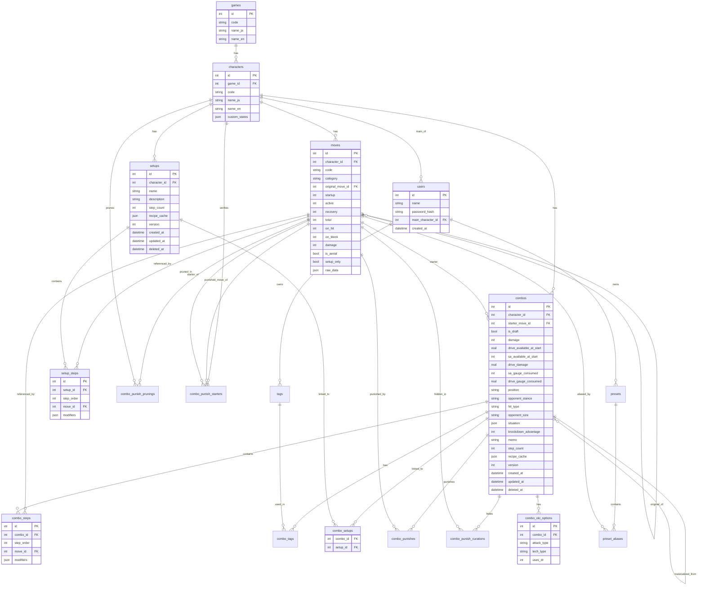

# データモデル設計書

| 項目 | 内容 |
|------|------|
| 文書ID | DES-003 |
| バージョン | **1.82.0** |
| 作成日 | 2026-04-10 |
| ステータス | **★2026-09-18 改訂（`CHANGE-215` 反映・`M38-02`・`D-895`）**：**★`setup_only` 列の説明中の画面名を「引っ越し取込」→「他から引っ越し」へ**〔**★★同改名は `DES-005` が主戦場だが、本書にも 1 件だけ在った。⇒ 製造の走査が `docs/design/` 全体を対象にして初めて見つかった**〕**。★スキーマ変更なし・マイグレ非消費。** 以下は前版の記述： **★★2026-09-14 改訂②（`CHANGE-209` 反映・`M37-07`・`D-881`）**：**★★§3.3 の `combos` へ `starter_meaty` を足した**〔始動技を持続当てしたか。bool 0/1〕**。⇒ 重複判定キーの 8 つ目である。★正本は `SUPP-001` §2.2。** **★`recipe_hash` の対象外。★`CHECK` を持たない**〔実物の bool 列 4 本がいずれも持たない流儀に揃えた〕**。★NULL を取らない。⇒ 3 値にしない。** **★スキーマ変更あり**〔`000117`＝層 A・列追加〕**。** 以下は前版の記述： **★★2026-09-14 改訂（`CHANGE-204` 反映・`M37-04`・`D-877`）**：**★★§3.3 の `moves` へ `first_hit_startup` を足した**〔その技の初段が当たるまでのフレーム〕**。⇒ `startup`**〔単独で出したときの発生〕**とは別物である。** **★★★NULL の意味は「不明」で統一する。⇒ 「1 段技だから不要」という第 2 の意味を持たせない。** **★列名の審査は `D-861` で通過済み**〔`starter_startup` は特定消費者の用途を名前へ持ち込むため却下〕**。★「NULL の間は候補から外す」は消費者側の導出規則であり列には書かない。** **★★CSV 契約が 24 → 25 列になった**〔末尾へ追加。**`parseRow` が位置引きのため途中挿入は不可**〕**。★`fastest_unreachable` の「候補は 16 行」は本サブより前に失効していた**〔実測 25 行。**第四波＝`000084` でキャラが増えた時点**〕**。** **★スキーマ変更あり**〔`000114`＝層 A の列追加〕**。★データ投入は `000116`＝層 B の 106 行。** 以下は前版の記述： **★★2026-09-13 改訂（`CHANGE-198` 反映・`M37-03`・`D-866`）**：**★★★§3.2 の `hit_type` 行が値の列挙をやめ、正本**（`SUPP-001` §3.2）**への参照になった。⇒ 同行は 3 値のまま失効しており、`CHANGE-082` の 4 値化すら届いていなかった。** **★直すのではなく列挙をやめた**——**4 書がそれぞれ列挙している限り、追加のたびに拾い切れない**〔`CHANGE-082` と `CHANGE-151` の 2 回とも漏れた〕**。★列挙が無ければ失効しようがない。** **★スキーマ変更 0・マイグレ消費 0。** 以下は前版の記述： **★★2026-09-12 改訂②（CHANGE-189 反映・`M31-06`・`D-837`）**：**★★§3.3 `setup_only` を「予約列」から as-built へ書き換えた**〔外す面 2 ／ 出す面 ／ 対象外 2 ／ 保存は禁止しない ／ **付与の口が無い**〕**。** **★★★実 DB は 0 件のままであり、画面の見え方は 1 か所も変わっていない。⇒ 本サブは「データが 0 件のうちに経路だけ作る」ものである。★付与口の設計はフェーズ5。★スキーマ変更 0。** 以下は前版の記述： **★★2026-09-12 改訂（CHANGE-184 反映・`M30-04`・`D-825`）**：**★★§3.3 `is_derived` 行の「model 非搭載＝API 非露出」を as-built へ書き換えた**〔4 点同期＝`model.Move` ／ `MoveListItem` ／ SELECT 列 ／ divergence guard〕**。★errata③**（「単独入力が不可能」と読み替えてはならない）**は失効していない。** **★用途は入力面の並び順 1 か所だけであり、可否の述語には入っていない。★スキーマ変更 0。** 以下は前版の記述： **★★2026-09-11 改訂（CHANGE-182 反映・`M35-03`・`D-822`）**：**★★§3.9 へ「`000074` 以降のマイグレでは `character_id` を明示する」を足した**〔**★`000072` / `000073` が書いていないのは歴史的事情であり模倣しない**〕**。★スキーマ変更 0。** 以下は前版の記述： **★★2026-09-10 改訂②（CHANGE-180 反映・`M31-05`・`D-816`）**：**★★★§3.2 へ `value_definition.options` と `single_value` を新設し、「設置系は `type: flag`」を是正した**〔**★①② はストック系のためのものであり、開始時の状態だけを持つ state は 1 値である** ／ **★`_set` 単独では語幹化されない**〕**。★`type` は 1 つも増えていない・スキーマ変更 0。** 以下は前版の記述： **★★2026-09-10 改訂（CHANGE-176 反映・`M31-04`・`D-810`）**：**★★§3.3 へ「ドライブリバーサルの扱い」を新設した**〔31 行 ／ `category='system'` ／ **★持ち場は CSV ではなくマイグレ** ／ 値の一次源 ／ **★キャラ追加波では追随マイグレが要る**〕**。★スキーマ変更 0。** 以下は前版の記述： **★★第72版（2026-09-08・CHANGE-169 反映：`M31-01`・`D-781`）**：**★★§3.2 へ `custom_states` の対象の選定基準を明文化した＝「始動技よりも先にやっておくムーブかどうか」**（開発者の逐語）**。⇒ 軸は技の種類ではなく時間軸である。** **★★「設置技かどうか」で選ぶと、SA を撃った後の発動中・バウンド中が丸ごと落ちる**（実例 4 件）**。★本節は `CHANGE-154` でも同型の是正を受けており、2 度とも「技の分類で決めようとして外した」である。** **★★あわせて「`custom_state` と `move` は別物であり、名前も粒度も一致させなくてよい」を書いた。⇒ `moves` から機械的に導出できない。** **★「名前が一致しても意味は一致しない」も書いた**（`shuriken_bomb_stock` は手持ちの残弾であり、設置数ではない）**。** **★スキーマ変更 0・マイグレ消費 0。** 以下は前版の記述： **第71版（2026-09-07・CHANGE-164 反映：`M28-02c`・`D-769`）**：**★★§3.4 の判定式を「SELECT と WHERE の 2 つ」から 4 経路へ改めた**〔真偽 ／ 派生列 ／ 列挙 ／ 総数〕**。★総数だけは判定式を持たない。★あわせて不変条件「削除・復元は基準に触らない」を明記した**（**崩れると、ゴミ箱へ入れて戻すだけで「確認済み」に化ける**）**。** 以下は前版の記述： **★第70版（2026-09-06・CHANGE-161 反映：`M29-01`・`D-756`）**：**★§3.4 の削除列の注記で `SA ゲージ` → `SAゲージ`**〔表記のみ。**内容は 1 文字も変えていない**〕**。** 以下は前版の記述： **★★第69版（2026-09-06・`CHANGE-159` 反映：`M28-02a`〔`FR702` 追従のスキーマ ＋ 始動位置・運び量〕・`D-748`）**：**★★新列 5 本**〔`games.current_data_version` ／ `moves.last_changed_game_version` ／ `combos.baseline_version` ／ `combos.start_position_mass` ／ `combos.carry_distance_mass`〕**。** **★★§3.4 へ「`FR702` の判定は保存せず導出する」と 2 種類の NULL の向きを新設した**〔**基準の NULL＝不明＝安全側で出す ／ マーカーの NULL＝既知の未変更＝出さない。★向きが逆であり、どちらも `NULL` という同じ値で表される**〕**。** **★★§3.4 の「CHECK 制約は使わない」方針へ例外の条件 3 つを新設した**〔**アプリ層を通らない書き込み経路が実在する ／ 壊れても実行時エラーにならない ／ 値域が固定である。★3 つすべてを満たすときに限る**〕**。★方針そのものは撤回していない。** **★`position` を 5 値 → 7 値へ。★値域と表示順は別物である**（表示順では末尾 2 値も入れ替わる）**。★`DuplicateKey` は 1 文字も変えていない。** **★マイグレ消費 2 本＝`000104` ＋ `000105`。** 以下は前版の記述： **第68版 errata（2026-09-05・`D-717`）**：**★★§3.2 から実在しない技名「JP の落とし穴」を除去した**〔開発者のレビュー＝計測点 `M-123`。**設計卓が武装中で `moves` を引けないにもかかわらず技名を例示として書き足していた**〕**。★裁定の中身は変えていない。★あわせて「技名を書くなら実物を引いた根拠を添える」を規約として足した。** 以下は前版の記述： **第68版（2026-09-05・CHANGE-154 反映：M14-03f 由来の 2 件・`D-707`）**：**★★§3.2 の `subject` の線引きを是正した**——**「設置技かどうか」ではなく「その状態が誰に付いているか」で決める。ベガ「サイコマイン付与」は `opponent`**（as-built ＝ マイグレ `000094`）**。★§3.20 へ「通常ジャンプ攻撃には親を付けない」と 3 分類を明文化した**〔**① は `is_derived=false` のため候補表に載らず、判断されないまま通過する**〕**。** 以下は前版の記述： **第67版（2026-09-05・CHANGE-153 反映：M27-02b〔起き攻めの「調べたか」〕・`D-704`）**：**★★`combos.oki_verified INTEGER NOT NULL DEFAULT 0` を新設した**（マイグレ `000096`）**。`0`＝未検証 ／ `1`＝調べた ／ `1` かつ行 0 件＝「調べたが無かった」。★★`combo_oki_options` の sparse 意味論**〔行の存在＝利用可能・`available` 列は持たない〕**は不変であり、取り戻したのはコンボ単位の区別だけである。** 以下は前版の記述： **第66版（2026-09-02・CHANGE-151 反映：M27-01〔ヒット種別 8 値化 ＋ 相手の大きさ 4 区分化〕・`D-687`）**：**★`opponent_size` 列を 4 値へ**〔`standard` / `large` / `large1` / `large2`。**旧記載「代表的な数段階」が具体値を持てるようになった**〕**／ §6 コード値の採用方針の逃がし先を「`memo`」→「タグまたは `memo`」へ**〔裁定＝`D-688`。**★タグは個人スコープであり共有先には見えない**〕**／ ★★`OPEN-001`（状況コード値マスタ）をクローズした**〔**「hit_type は将来ガード破壊系の追加を検討」も決着——候補として並べたうえで選ばれなかった。⇒ 検討済みであり未検討ではない**〕。**★マイグレ `000081` を消費**〔DML・`medium` → `standard`〕。 以下は前版の記述： **第65版（2026-08-29・CHANGE-138 反映：M24-12〔エディタの作り替え〕・D-586）**：**★★`drive_available_at_start` / `drive_gauge_consumed` の「0.5 刻みは UI（widget `step=0.5`）で担保」が失効した**〔**UI から `step=0.5` を外した。⇒ `1.3` のような値が保存されうる**〕。**★開発者が承知のうえで許容と裁定した。⇒ 「実装が緩い」ではなく「仕様である」。** **★BE の範囲検証は 1 文字も変えていない**（元から刻みを見ていない）。**★スキーマ変更 0・マイグレ消費 0。** 以下は前版の記述： | ステータス | **第64版（2026-08-25・CHANGE-131 追補反映：撤回は例外であり、キャラ固有状態は拡張方向にある）**：**§3.2 へ 2 点を足した**〔**★★「撤回は例外である。キャラ固有状態は今後増えていく見込みであり、ステータスを持つキャラの状態は撤回しない」**——**★1 件の撤回を「この仕組みは縮小方向にある」と読まれると、次の担当が新しい state の追加をためらう** ／ **★拡張の方向を 1 つ明示した＝設置技が置かれた状態から始まるコンボを `custom_states` で表現する**〔`subject: self, type: flag`。JP・ベガ・ブランカ 等。ledger `SM-102` / `SM-063`〕〕。 **★出所は 2026-08-25 の開発者回答であり、`CHANGE-131` §7-1 への応答である。新規採番はしていない**〔先例＝`D-533` の追補反映〕。 **★スキーマ変更 0・マイグレ消費 0・実装差分 0 バイト。** 以下は前版の記述： **第63版（2026-08-25・CHANGE-131 反映：マノンのメダルレベルをキャラ固有状態から外した）**：**§3.2 の `custom_states` から `medal_level` の例示を 3 か所すべて撤去し、§3.4 の `situation` 例も差し替えた**〔**★同じ code 名の写し先が 4 か所あり、片方だけ直った状態は `E-114` / `E-191` そのものになるため 1 手番で揃えた**〕。 **★★最も落としてはいけないのは (a)/(b) の区別である**——**19 キャラ中 11 キャラの `custom_states` が SQL NULL だが、撤回したのはマノンのメダルだけである**〔**(a) 開発者が「持たない」と決めた＝マノンのメダル。撤回する** ／ **(b) `M14-03d` が seed 定義の投入をスコープ外とした＝残り 10 キャラ。未実装であって不採用ではなく、残す**〕。**⇒ 「入っていない」は「扱わない」を意味しない旨を §3.2 の本文へ明記した。** **★JSON 例は「形」の例示であって実データの正本ではないことを明記し、正本が seed であることを併記した**〔第54版の規約の適用〕。 **★§3.4 の situation 例は形式も同時に現行へ揃えた**〔旧例は `CHANGE-067` / `M16-07` 以降の旧スカラ形式だった。**既存の記述を引き継ぐのと、自分で旧形式を書き起こすのは別である**〕。 **★スキーマ変更 0・マイグレ消費 0・実装差分 0 バイト。** 以下は前版の記述： **第62版（2026-08-24・CHANGE-142 反映：M23-10〔`P-04` の根治〕）**：**§5 の但し書き「宣言された `ON DELETE` は意図の記録であって実挙動の保証ではない」を、★消さずに「どの接続の話か」で 2 つに割った**〔**アプリ本体の接続＝失効。FK は全接続で有効であり `ON DELETE CASCADE` は挙動として発火する** ／ **マイグレーション接続＝今も有効。独自に接続を開いており FK=OFF のままであり、これは意図である**〕。**★★丸ごと消さない理由**——**マイグレーション内で CASCADE を当てにする実装が生まれる。** **★★丸ごと残さない理由**——**明示削除を撤去できない理由が「FK が効かないから」のままになり、実態と合わない**〔実際の理由は「二重の保険」である〕。**★実 DB の orphan 19 件は 2026-08-24 に開発者が掃除した。★供給を止めたのが `M23-10`、溜まった分を消したのが掃除であり、2 つは別の作業である。** **★スキーマ変更 0・マイグレ消費 0。** 以下は前版の記述： **第61版（2026-08-23・CHANGE-126 追補反映）**：**§5 の orphan の記述へ 2 点を足した**〔**★★`combo_tags` の orphan 1 件が生む実害の連鎖を 5 段で特定した**——**画面と API が別のクエリで「使用件数」を数えており、答えが割れている**〔一覧側は orphan を数えず 0 件と表示し、その表示値から `force` を決めて送るため、常に `force=false` でサーバの `409` を踏み続ける〕。**★UI からは抜け道が無いが「絶対に不可能」ではない**〔API を直接叩けば消せる。**「利用者の手には届かない」が正確な表現である**〕 ／ **★`P-04` 根治の実現可能性が実測で確定した**〔**現行実装は 16 接続中 15 本が FK=OFF** ／ DSN 化で 0 本 ／ **全テスト・全 E2E が 1 件も落ちない** ／ **マイグレーションは別経路で開くため影響を受けない**〕〕。**★スキーマ変更 0・マイグレ消費 0。** 以下は前版の記述： **第60版（2026-08-23・CHANGE-126 反映：M23-08〔削除・完全削除のサーバ側の是正〕）**：**§5 へ「コンボの完全削除は `ON DELETE CASCADE` に依存しない」を明記**〔**明示削除 7 表 ＋ self-FK 2 本の NULL 化 ＋ 行の削除の全 10 操作**〕。**★★宣言された `ON DELETE` 句は「意図の記録」であり、完全削除の実挙動は実装が持つ**——**`P-04` により連鎖動作の発火が保証されないためである。** **★★2026-08-23 の実 DB 計測で orphan が 19 件実在した**〔`combo_oki_options` 12 ／ `combo_steps` 6 ／ `combo_tags` 1〕。**⇒ `P-04` は「発火しないことがありうる」ではなく「実際に発火していなかった時期がある」。** **★self-FK は削除ではなく NULL 化であり、`version` / `updated_at` を動かさない。** **★スキーマは変えていない**〔SQLite は制約の `ALTER` を持たない〕。 以下は前版の記述： **第59版（2026-08-20・CHANGE-121 反映：M23-01〔ゴミ箱の実態を仕様へ揃える〕）**：**§3.4（combos）へ `superseded_by_combo_id` を追加**〔`PUT` が積む旧行から新行を指す self-FK。マイグレ `000078`。**`DuplicateKey`・`recipe_hash` 非対象・CSV 非出力・遡って埋めない・`ON DELETE SET NULL` を当てにしない**〕**／ §5（論理削除と復元）から「ゴミ箱に90日以上保持されたレコード（設定で変更可能）」を撤回**〔**D-458**＝保持は無期限。**同機構は一度も実装されていない**——`M23-01` の否定形走査が拾った 2 件目の残骸であり、**起票時の射程に無かった分を `D-487` で足した**〕。 以下は前版の記述： **第58版（2026-08-16・CHANGE-114 反映：M22-03〔楽観排他の実効化〕）**：**§3.4（combos）へ「`version` 列の読み方」を新設**——**増え方は 3 通り〔`+1` ／ `1` で採番し直す ／ 据え置き〕 ／ タグだけを変えても上がる ／ `recipe_cache` の更新は `updated_at` を進めても `version` を進めない ／ ★`updated_at` で競合を判定してはならない**。**§3.11（setups）へ同型である旨を明記**——**★片方だけ書くと「`setups` 側は違うのか」と読まれるため。** **★スキーマ定義は 1 列も変えていない。** **★あわせて本セルの記載漏れを是正した**——**第56版（CHANGE-112）と第57版（CHANGE-113）の記載が落ちており、`バージョン` 欄だけが 1.54.0 / 1.55.0 へ進んでいた。本文の反映自体は行われている。** 以下は前版の記述： **第55版（2026-08-14・CHANGE-104 反映：M20-07〔取込の逆引き活用 ＋ 多候補ハッジの分割 ＋ 逆引き前段の正規化〕）**：**§3.9 の「別名逆引きの消費者」から実装の識別子の名指しと `DISTINCT` の名指しを外した**（`D-380`）——**本書が定めるのは「どのテーブルを、どの単位で、何を根拠に引くか」までであり、どのメソッドが引くか・重複をどこで畳むかは実装の手番である**〔**旧記述が特定のメソッド名を名指ししていたため、実装がそれを撤去したときに「契約が変わったのか」という問い合わせを生んだ**〕。**照合を「`alias_text` 完全一致」から「正規化キーの一致」へ改め、規約の正本を `DES-004` §5.0 とした。** **§G-11 を「M20 への論点」から決着済みへ**——**カスタムプリセットは逆引き辞書に含める。組み込みと衝突すれば 2 件になり未解決へ倒れる。** 以下は前版の記述： **第54版（2026-08-14・CHANGE-103 反映：M20-06〔命名規則の正典化 ＋ `P-34` 13 件の投入〕）**：**§3.9 の `alias_text_en` を実測値から原則へ改めた**——**値が入るのは「記法自身が語を持たない行」だけ**〔移動系の一部 ＋ **層 C-3「何も押さずに派生する技」**〕。**★実測の行数は本書に書かない。正本は契約テストである**〔**旧記述「移動系 2 code のみ・76 行」は `M20-06` の投入で失効した**〕。**★設計書に実測値を書くときは「正本はどこか」を必ず併記する。併記できないなら書かない。** 以下は前版の記述： **第53版（2026-08-13・CHANGE-100 反映：M20-03〔`preset_aliases` の一意制約〕）**：**§3.9 へ `character_id INTEGER`（NULL 可・既定値なし・FK なし・`moves` からの非正規化）を追加**し、**UNIQUE 制約を 3 本の表として整理**（**既存 `(preset_id, move_id)`＝1 技 1 表記 ／ 新設 `(preset_id, character_id, alias_text)`＝2 技 1 表記の禁止 ／ 部分インデックス `(preset_id, character_id, alias_text_en) WHERE NOT NULL`**）。**★2・3 は索引として張る**（テーブル再構築による既存 DDL の写し落としを構造的に避けるため）。**`preset_id` が鍵に要る理由と 714 件の正体を明記。** **`NOT NULL` と FK を採らなかった理由、および nullable の代償を明記。** **逆引きの 1:N は「同一プリセット・同一キャラ内では 1:1」の一段だけが変わったことを書き分け。** 以下は前版の記述： **第52版（2026-08-13・CHANGE-099 反映：M20-02）**：**§3.9 へ `alias_text_en TEXT`（NULL 可・既定値なし・一意制約なし）を追加**し、**値域と実際の充足範囲**（値が入るのは移動系 2 code のみ・76 行）**を併記**。**§3.3 の対投入規約へ「同じ規約が `numeric` / `srk` にも掛かる。ただし成立の仕方が違う」を追記**（**移動系 9 code の投入マイグレはキャラを明示列挙しており新キャラに当たらない**。詳細は `DES-004` §5 が正本）。 |
| 前提文書 | REQ-001 要件定義書 / DES-002 アーキテクチャ設計書（**★版数は書かない。各文書の「バージョン」セルが正本である**＝2026-08-25 是正） |

---

## 1. 設計方針

### 1.1 基本方針

- **階層構造**：ゲーム → キャラクター → 技 → コンボ という階層を意識し、将来の他ゲーム対応に備える
- **柔軟性優先**：キャラ固有の例外データは JSON カラムで吸収し、スキーマ変更を最小化する
- **論理削除**：コンボの削除は物理削除ではなく論理削除とし、復元を可能にする
- **楽観的排他**：更新時はバージョン番号でチェックし、上書き事故を防ぐ
- **実装時の協同決定**：全キャラの技マスタ生成、状況コード値のマスタなど、深い知識が必要な項目は実装フェーズでClaude Codeと開発者が協同して決定する（6.1節参照）。本書は「器」の設計に徹する

### 1.2 命名規則

- テーブル名：スネークケース・複数形（例：`combos`, `characters`）
- カラム名：スネークケース・単数形（例：`character_id`, `created_at`）
- 主キー：`id`（INTEGER、AUTOINCREMENT）
- 外部キー：`<参照テーブル単数形>_id`（例：`character_id`）
- タイムスタンプ：`created_at`, `updated_at`（UTC、ISO8601形式）

---

## 2. ER図



---

## 3. テーブル定義

### 3.1 games（ゲームマスタ）

| カラム | 型 | 制約 | 説明 |
|--------|-----|------|------|
| id | INTEGER | PK, AUTOINCREMENT | 内部ID |
| code | TEXT | UNIQUE, NOT NULL | ゲーム識別子（例：`sf6`） |
| name_ja | TEXT | NOT NULL | 日本語名（例：ストリートファイター6） |
| name_en | TEXT | NOT NULL | 英語名 |
| **current_data_version** | **TEXT** | **NULL可** | **★★【`CHANGE-159`・`M28-02a`・2026-09-06】本アプリが現在前提としているゲームデータの版**（`YYYY.MM.DD.NN`。例 `2026.08.03.01`）**。★`FR702` の「基準」を書くときの出どころである。** **★★`MAX(moves.last_changed_game_version)` で代用しない**——**move を 1 行も変えないアップデート**〔入力ミスの訂正 ／ 機能追加で列が増えただけ〕**では `MAX` が動かず、版が上がったことを表せない。★後半 `NN` はまさにその型の版である。** **★★`cmd/seedgen -mode game-version` が生成するマイグレが引き上げる**（`current_data_version < ?` を条件に置き、**引き下げはしない**）**。★`CHECK` 制約あり**（§3.4 の例外条件を満たす。**GLOB で固定幅・全桁数字、`substr`+`CAST` で月 1〜12・日 1〜31**） |

初期データとしてSF6のみ登録。NFR407（他格闘ゲーム対応の余地）のため、トップレベルに配置する。

### 3.2 characters（キャラクターマスタ）

| カラム | 型 | 制約 | 説明 |
|--------|-----|------|------|
| id | INTEGER | PK, AUTOINCREMENT | 内部ID |
| game_id | INTEGER | FK(games.id), NOT NULL | 所属ゲーム |
| code | TEXT | NOT NULL | キャラクター識別子（例：`ryu`） |
| name_ja | TEXT | NOT NULL | 日本語名 |
| name_en | TEXT | NOT NULL | 英語名 |
| custom_states | JSON | NULL可 | キャラ固有状態の定義（後述） |

UNIQUE制約：`(game_id, code)`

**custom_states の構造**：キャラ固有状態の柔軟な表現を可能にする。主体（自キャラ／相手キャラ）、持続性（恒常／条件付き）、値の定義を含む包括的な構造とする。

> **★以下の JSON は「形」の例示であり、実データの正本ではない。** 実際に定義されている state の正本は seed（`migrations/`）が投入する `characters.custom_states` である。 **★設計書に実測値を書くときは正本がどこかを必ず併記する**（第54版で定めた規約）。
>
> **★`type: level` の as-built の実例は `sun_crest` である**（2026-08-25 実測。`level` 型は 1 件のみ）。**定義本体は本書へ転記しない。**

```json
{
  "states": [
    {
      "code": "poison",
      "name_ja": "毒",
      "name_en": "Poison",
      "subject": "opponent",
      "scope": "persistent",
      "type": "flag",
      "value_definition": { "kind": "boolean" }
    },
    {
      "code": "solid_puncher",
      "name_ja": "ソリッドパンチャー",
      "name_en": "Solid Puncher",
      "subject": "self",
      "scope": "conditional",
      "activation": { "trigger": "sa2_active" },
      "type": "flag",
      "value_definition": { "kind": "boolean" }
    },
    {
      "code": "drunk_level",
      "name_ja": "酔いレベル",
      "name_en": "Drunk Level",
      "subject": "self",
      "scope": "persistent",
      "type": "composite",
      "value_definition": {
        "kind": "object",
        "fields": [
          { "code": "level", "kind": "integer", "min": 0, "max": 4 },
          { "code": "unlocked_moves", "kind": "string_list" }
        ]
      }
    }
  ]
}
```

**各フィールドの意味**：
- `subject`: 状態の主体。`self`（自キャラ）、`opponent`（相手キャラ）、`stage`（場／将来拡張用の予約値、現時点では使用しない）
- `scope`: 持続性。`persistent`（恒常的）、`conditional`（発動条件付き）
- `activation`: `conditional` の場合の発動条件（例：`sa2_active`）
- `type`: 状態の種別。`level` / `flag` / `stock` / `composite` など
- `value_definition`: 値の定義。単純な整数・フラグから複数フィールドを持つオブジェクトまで表現可能
  - **★★【2026-09-10・`CHANGE-180`・`M31-05`】`options`（ラベル付き選択肢・任意）**: `[{ "value": n, "label_ja": "…", "label_en": "…" }]`。**在れば画面は数値入力ではなく選択を出す。無ければ従来どおり数値入力である。** **★★不変条件が 3 つある＝(1) `min..max` が「ちょうど」選択肢の値の集合であること**（欠けても余っても赤。**食い違うと別の選択肢へ黙って化ける**）**／ (2) `label_en` は必須**（**無いと `label_ja` へフォールバックし EN 画面に日本語が出る。★locale ファイルを見る検査はこの経路を素通りする**）**／ (3) `options` を持たない `level` は従来どおり数値入力であり 1 行も変わらない**（**as-built で唯一の `level` である `ingrid` の `sun_crest` は不変**）**。** **★★★`type` は 1 つも増えていない。⇒ 撤回済みの `composite`**（`000009` → `000017` で削除）**を復活させる形ではない。** **★★選択肢が 11 個以上になると、11 個目以降がマウス以外で選べない**（`followup` の `custom-state-options-count-unchecked`。**★型検査・単体・E2E がすべて緑のまま通る**）**。**
  - **★★★【2026-09-10・`CHANGE-180`・`M31-05`】`single_value`（任意・boolean）**: `true` のとき、画面は 1 欄・表示は 1 行・ラベルは state 名だけになる。**省略時は従来どおり ①`start_min` / ②`end` の 2 値である。** **★★★あわせて＝①② はストック系のためのものであり、開始時の状態だけを持つ state は 1 値である。⇒ 根拠は ①② が `M16-07`**（`CHANGE-067`）**で**ストック系のために**足された拡張であり、`custom_states` の原点は `CHANGE-040` の「開始時状態の付与のみを扱う。消費は一般モデル化しない」だからである。** **★★これを書かないと、次に `custom_states` を足す人が同じ取り違えをする。⇒ `M31-05` が実際に取り違え、テストもレビューも緑のまま通り、開発者が実機で見て初めて分かった。** **★格納形は `{start_min, end}` のまま両方へ同じ値を書く**（形を分岐させない）**。★既存のストック系 6 件は `single_value` を持たないため不変である。**
- `show_delta`（boolean・任意・CHANGE-067／M16-07）: int（level/stock）state の**増減（②終了−①始動最低）を表示するか**の DEF フラグ。方向可変（増える/減る両方あり）=true・一方向=false/省略。ラベルは name＋固定句で生成し DEF に 2 値項目は足さない。
- **per-combo の int state 値表現（CHANGE-067／M16-07）**: `combos.situation` の `custom_states` キーで、int state は **`{"<code>": {"start_min": n, "end": m}}`（①始動時に必要な最低ストック数／②終了時ストック数）の構造化**で保持。旧スカラ `{"<code>": n}` は後方互換で ②(end) へ写像（移行 graceful）。flag state は `{"<code>": true}` 不変。situation は opaque JSON・BE 素通し（`situation *string`）＝DDL/DTO/BE 変更なし・`DuplicateKey`/`recipe_hash` 非対象。消費セマンティクスの一般構築はしない（architecture-patterns §9.1・B-1 据え置き＝表示用 2 値＋派生増減のみ）。

**対応可能なケースの例**：
- 段階を持つ恒常状態 → subject: self, type: level（as-built の実例は `sun_crest`）
- AKIの毒 → subject: opponent, type: flag
- ジュリのストック → subject: self, type: stock
- ジェイミーの酔いレベル → type: composite（レベルと解放技を同時管理）
- ガイルのソリッドパンチャー → scope: conditional, activation: sa2_active
- **設置技が置かれた状態から始まるコンボ** → **★★`subject` は「設置技かどうか」では決まらない。「その状態が誰に付いているか」で決める**（**2026-09-05・`CHANGE-154`・`M14-03f` で是正**）。 **自分の側に立つ状態**〔ステージ上に自分が置いた物の有無 ／ 自分に付く恒常状態〕**は `subject: self`。 ★★★【2026-09-10 是正＝`CHANGE-180`・`M31-05`】`type` は `flag` に限らない。⇒ 変種を持つものは `options` 付き `level`、個数を持つものは `stock` を採る。★`flag` は「置いたかどうか」だけを持つものに使う。 ★as-built＝`M31-05` が投入した 12 件のうち `flag` は 2 件だけである**〔`saihasho_is_set` / `blanka_chan_bomb_is_set`〕**。⇒ 7 件が `options` 付き `level`、1 件が `stock`、あとの 2 件が発動中の `flag` である。 ★★本節は `CHANGE-154`**（`subject` の軸）**と `CHANGE-169`**（対象の選定基準）**で既に 2 度、同型の是正を受けている。⇒ 3 度目にしないこと。 ★★★`code` の付け方＝設置物の有無・数は `<family>_is_set`、発動中の状態は素の `<family>`。⇒ 根拠はキャラ固有状態タブの語幹照合である**（`CHANGE-170` §2.5）**。★`_set` 単独では語幹化されない**（実測 0 件）**。⇒ `<family>_set` という自然な命名を選ぶと「足したのにタブに出ない」が起き、検査は緑のままである。** **★as-built の実例＝ブランカの「ブランカちゃん人形」**〔値域 0〜3。マイグレ `000093`〕**。 ★相手に付与するものは `subject: opponent`。実例＝ベガ「サイコマイン付与」**（2026-09-02 開発者裁定。as-built ＝ マイグレ `000094`）。 **★旧記載は「JP・ベガ・ブランカ 等 → `subject: self`」とベガを名指しで `self` の例に挙げていたが、実際に投入された値は `opponent` である。2 つは矛盾していない——分類の軸が違っただけである。★先例と整合する**〔`AKI` の毒は設置技ではないが相手に付くため `opponent`。**軸は最初から「誰に付くか」だった**〕。 

**★★【2026-09-08・CHANGE-169・M31-01】対象の選定基準を明文化する。**

**★基準は「始動技よりも先にやっておくムーブかどうか」である**（開発者の逐語）**。⇒ 軸は技の種類ではなく時間軸である。**

**★★「設置技かどうか」で選ばないこと。⇒ 設置していない状態も対象に入る**〔SA を撃った後の発動中・バウンド中。**実例＝ラヴーシュカ / イウサール / サンオーダー / 花蝶扇**〕**。★「設置技かどうか」で選んでいたら、この 4 件が丸ごと落ちていた。**

**★★本節は `CHANGE-154` でも同型の是正を受けている**（`subject` を「設置技かどうか」で決めようとした）**。⇒ 2 度とも「技の分類で決めようとして外した」である。★だから判定軸そのものをここへ書く。**

**★★`custom_state` と `move` は別物である。⇒ 名前も粒度も一致させなくてよい。**

| 観点 | 実例 | 開発者の逐語 |
|---|---|---|
| **★名前を一致させない** | **ジュリ**——`move` は `[風破]歳破衝`（`fuha_saihasho`）**だが、state 名に「[風破]」は付けない**（風破なしは設置できないため冗長） | **「表記ゆれ的になることも move と custom state は別物という事で大丈夫です」** |
| **★★粒度を一致させない** | **ヤスミン**——**`moves` は OD の強度別を省略している**（`pangil_sa_likuran_od` の 1 行）**が、state は弱中強を持つ** | **「moves 上は省略していますが、custom state では弱中強を扱いたいです」** |

**⇒ `custom_states` の設計を `moves` から機械的に導出できない。★キャラごとに開発者の判断が要る。**

**★★名前が一致しても意味は一致しない。⇒ 実例＝`shuriken_bomb_stock` は「コンボ開始時に残っている手持ちの残弾」であり、「フィールドへ設置した数」ではない**（2026-09-08 開発者裁定。**同じことがブランカの `blanka_chan_bomb` にも当たる**）**。**

**★製造は名前の一致だけで「既存が該当する」と読んで外した。⇒ 実測できるのは名前と型までであり、意味は開発者にしか確かめられない。**

**★★キャラ名・技名の例示は、実物を引いた根拠がある場合にだけ書く**——**2026-09-05 に「JP の落とし穴」という実在しない技名が本節へ紛れ込み、開発者の実査で除去された**〔計測点 `M-123`。**設計卓は武装中で `moves` を引けないにもかかわらず技名を書いた**〕**。⇒ 技名を書くなら `character_data/*.csv` か `moves` を引いた根拠を添えること。** **★`custom_states` で表現する**（2026-08-25 開発者方針・`CHANGE-131` 追補）
- 将来の複雑キャラ（自他2種ずつなど） → states配列に必要なだけ定義を追加

> **★★上の例のうち、seed に定義が入っているものと入っていないものがある**（2026-08-25 実測＝19 キャラ中 11 キャラの `custom_states` が SQL NULL。`M14-03d` が定義の投入をスコープ外としたためである）。 **★★「入っていない」は「扱わない」を意味しない。** 未実装であって不採用ではなく、設計としては上記のとおり扱う。
>
> **★撤回した例が 1 件ある——マノンのメダルレベルは扱わない**（2026-08-25 開発者判断・`CHANGE-131` ／ `REQ-001` §6.4）。 付与数で変わるのはダメージだけであり、コンボの成立・分岐を変えないためである。 **本節は第62版まで「マノンのメダルLv → subject: self, type: level」を 1 行目に置いていた。撤回する。**
>
> **★★撤回は例外である。キャラ固有状態は今後増えていく見込みである**（2026-08-25 開発者方針・`CHANGE-131` 追補）。 **ステータスを持つキャラの状態は撤回しない。** **★★したがって「1 件撤回した」を「この仕組みは縮小方向にある」と読まないこと。** **拡張の方向も既に 1 つ決まっている**——**設置技が置かれた状態から始まるコンボを `custom_states` で表現する**（上の例の 6 行目。`M24-RESEARCH-01` ledger の `SM-102` / `SM-063`）。

型・発動条件の具体的な列挙値は実装時に開発者と協同で決定する（6.1節参照）。

### 3.3 moves（技マスタ）

| カラム | 型 | 制約 | 説明 |
|--------|-----|------|------|
| id | INTEGER | PK, AUTOINCREMENT | 内部ID |
| character_id | INTEGER | FK(characters.id), NOT NULL | 所属キャラ |
| code | TEXT | NOT NULL | 技の統一内部識別子。英語表示名の機械変換で採番（例：`standing_medium_punch`, `hadoken_light`。DES-004 §2.1、CHANGE-025） |
| category | TEXT | NOT NULL | 技分類（後述の列挙値） |
| original_move_id | INTEGER | FK(moves.id), NULL可 | ラッシュ版moveの場合、対応する通常技のmove_idを参照。通常技・システム技ではNULL |
| startup | INTEGER | NULL可 | 発生フレーム（公式「発生」）。公式が空欄の場合はNULL（CHANGE-025でNOT NULLを撤回。発生空欄の行が実在＝約100件・26キャラ） |
| **first_hit_startup** | **INTEGER** | **NULL可** | **★★★その技の初段が当たるまでのフレーム**（**`CHANGE-204`・`M37-04`・マイグレ `000114`**）**。★`startup` が「その技を単独で出したときの発生」であるのに対し、本列は「1 段目が当たるまで」を表す。⇒ ターゲットコンボの 2 段目以降を 1 行で表す行では両者が食い違う**〔実例＝`fuwa_triple_strike_2hits` は `startup=5` だが初段の立中P は 6F〕**。** **★★★NULL の意味は「不明」で統一する。⇒ 「1 段技だから不要」という第 2 の意味を持たせてはならない**——**2 つの意味を 1 つの NULL に畳むと後から区別できない。★判定側は*行の属性*で対象かどうかを決める。** **★`CHECK` は持たない**（既存の `startup`＝`000013` に倣った）**。★`DuplicateKey` / `recipe_hash` の対象外。★`GET /api/moves` に露出していない**（`startup_basis` と同じ扱い）**。** **★★消費者は現時点で 1 つだけ＝確定反撃サーチの候補判定。★「NULL の間は候補から外す」は*消費者側の導出規則*であり本列には書かない**（`M19-DESIGN-07` §7）**。** **★★対象は `category='target_combo'` ∧ `is_derived` ∧ `startup_basis='standalone'` の 109 行のみ。⇒ 2026-09-14 に 106 行を投入済み**〔マイグレ `000116`・層 B〕**。★残る 3 行は CSV で値が空であり投入していない**（`CHANGE-091` の F-4） |
| active | INTEGER | NULL可 | 持続フレーム数（公式「持続」の範囲表記 `4-6` を本数 `3` に正規化）。弾系等で公式が空欄の場合はNULL（CHANGE-022） |
| recovery | INTEGER | NULL可 | 硬直フレーム。観測可能（training フレームメーター）なため手入力で保持する（**CHANGE-054 で追加。CHANGE-022 の「recovery 非保持」を反転**）。`total` 算出（§3.3末尾注記）の素材。 |
| total | INTEGER | NULL可 | 全体硬直。`startup + active − 1 + recovery`（§3.3末尾注記、CHANGE-028）で算出した正準の利用値。配布 seed 投入時に確定値を格納する（既存行は据置・再計算しない。CHANGE-054）。**算出に必要な値が空欄で算出不能の場合はNULL**（CHANGE-025） |
| on_hit | INTEGER | NULL可 | 硬直差ヒット（公式「硬直差／ヒット」）。符号付き。公式が空欄の場合はNULL（CHANGE-022） |
| on_block | INTEGER | NULL可 | 硬直差ガード（公式「硬直差／ガード」）。符号付き。公式が空欄の場合はNULL（CHANGE-022） |
| damage | INTEGER | NULL可 | 基本ダメージ値 |

> **【2026-07-27 errata・パニッシュカウンター補正の乗り方（開発者インゲーム確認）】**
> **多段技の `damage` は技全体の合計値**を保持する。一方、**パニッシュカウンター補正は初段にしか乗らない**。類型は次のとおり。
> 
> | # | 類型 | PC 補正の乗り方 |
> |---|---|---|
> | ① | ターゲットコンボ | **初段のみ** |
> | ② | ターゲットコンボ的な性質を持つ多段 Special | **初段のみ** |
> | ③ | **Super Arts／Critical Arts** | **補正なし＝等倍** |
> | ④ | 多段 Special の一部（昇竜拳等の対空系・回避しながら当てる技） | **初段のみ** |
> 
> **`moves` にヒット数を表す列は存在せず**（`active` は持続フレームであってヒット数ではない）、**多段かどうかは機械判別できない**。**初段ダメージ列・ヒット数列の新設は行わない**（開発者方針）。**③ のみ `starter_move.category` で機械判別できる**ため例外化できる。
> 
> **この分類はインゲーム検証によってのみ再発見できる**ため、本注記が一次源である（基準時点 2026-07-27・出所＝開発者のインゲーム確認）。
> 
> **【materialize のダメージ加算は概算値である】** DES-005 §5.21／DES-002 §4.2 の materialize は「**始動技ダメージ × 0.2 を合計に加算**」する。この式は**始動技が単発であることを前提とした概算**であり、始動技が多段の場合は**過大**になる（①②④）。**③ は本来ゼロであるべきものを加算する**ため例外として加算しない。
> 
> **設計方針**：③ は加算しない（理由コードを 1 つ追加）。①②④ は**概算として流し**、**生成時メッセージ（多段を検出できないため無条件表示）**で「加算量は概算です」と伝えるにとどめる。**生成物への永続的な注記（`memo` 自動追記等）は行わない**（開発者裁定 2026-07-27）。前提＝**利用者は採用前に確定反撃が成立するかを自分で検証する**／materialize は「**編集可能な出発点**」であり生成後編集可（spec §2）。
> 
> **実装済み（M18-03c・CHANGE-090＝CHANGE-089 で入れたダメージ計算ロジックの訂正）。DES-002 §4.2 の理由コード `starter_move_not_pc_scaled` は反映済み。**
>
> **実測（反映時に確定）**: SA / CA が始動技候補として現れる件数は `super_art` **54 行** ／ `critical_art` **10 行** ＝ **計 64 行**（数えた対象＝当該 SQL 条件に一致した `moves` 行数。基準時点＝2026-07-28。一次源＝`m19-verify.db`）。**起票時は「0 件なら例外自体が不要」という分岐を置いていたが、実測により例外の実装が必要と確定した。** SA / CA 始動の確定反撃は例外的な状況ではなく日常的に起こる。

> **【2026-07-31 errata・ゲーム側の挙動と seed の方針】**
>
> **一部のキャラクターの、さらに限定された状況で、後ろ投げのダメージがゲーム内で +1 になる。** 発覚しているのは **kimberly と jamie の 2 体**（実測例＝kimberly のパニッシュカウンター時に `throw_back` 1839 / `throw_forward` 1838）。
>
> **全キャラクターで起きるものでも、当該キャラの全状況で起きるものでもない。** また **2 体というのは「発覚している範囲」であり、網羅調査は行っていない**。
>
> **seed は前投げを基準として前後の投げを同値で持つ**（kimberly の例では両者 1082）。**この差分はデータに反映しない**（開発者方針）。理由は、(1) **ゲーム側の挙動であり本アプリの欠陥ではない**こと、(2) 全キャラ・全状況で再現するものではなく、**条件が特定できていない事実をデータモデルに持たせても正しく表現できない**ことによる。
>
> **★将来 seed とインゲーム実測を照合したときに 1 の差が出ても、seed の誤りではない。** 「直す」判断をする前に本注記を確認すること。条件が特定でき、かつ表現する必要が生じた場合は、そのとき改めて設計判断を行う。

| is_projectile | INTEGER | NOT NULL, DEFAULT 0 | **飛び道具フラグ**（bool 0/1。CHANGE-081・M18-01・マイグレ 000039）。**役割＝確定反撃の自動走査から飛び道具を除外するための一次源**（DES-004 §2.5・M18-02 finder）。**2026-07-26 errata③**：従来「**唯一の**一次源」と断定していたが、これは**確定反撃の自動走査という文脈における**一次源の意である。セットプレイ自動提案（M19-01）が**第 2 の consumer**として本列を参照する（target 種別の `special_projectile` 判定＝BE の SELECT のみ・moves API 非露出）ため、排他的断定は実態と合わない。飛び道具は着弾までが距離で変わるため `on_block`／`recovery` の単一値が有利フレームを意味せず（実測：projectile の `recovery` は便宜値 0 が多数）、**ガード／ジャストパリィ両タブの自動走査から除外**して「距離依存・手動確認」として表示する（ユーザーが反撃始動技を手入力して登録できる）。**`on_block` の NULL 有無では判別できない**（NULL 率は projectile／非 projectile でほぼ同水準＝M18-RESEARCH-01 実測）ため本列を必須の判定源とする。**判定源は入力ツール側の人手付与＝本体は CSV 値を信頼し導出しない**（`is_derived`・`target_combo` と同型）。**初期値は backfill 専用マイグレで投入し `internal/seedgen` は非改変**（seedgen は CSV の is_projectile を保全するのみで INSERT に出力しない＝golden テストで非出力を固定）。**投入済み 10 キャラの backfill 実測＝104 件**（数えた対象＝`moves.is_projectile=1` の行数。是正前 97＋データ是正 7〔kimberly `shuriken_bomb_*` 6・juri `fuha_saihasho` 1〕）。**未 seed キャラの seed 波では seed INSERT 後に当該波の backfill が別途必要**（seedgen が出力しないため既定値 0 で入る＝followup-backlog C-1 `M14-03-is-projectile-backfill`）。`DuplicateKey`・`recipe_hash` 非対象 |
| is_derived | BOOLEAN | NOT NULL, DEFAULT false | **派生技フラグ**（CHANGE-069・M17-02・マイグレ 000032）。**主たる役割＝段階2 のコマンド入力解決の索引から除外すること**（DES-004 §2.4）。**当初の判定原理**＝**「コントローラでこの技だけをいきなり出せるか？ 出せない → true」**（前段の技で特殊状態になってからの追加入力／ターゲットコンボ 2 段目以降／必殺技の派生／特定状態でのみ出る強化版・ジャスト版＝true。ターゲットコンボ 1 段目・通常の必殺技/特殊技・空中特殊技・ホールド版/溜め版＝false）。**判定源は入力ツール側の人手付与＝本体は CSV 値を信頼し導出しない**（CHANGE-065 と同型）。**`rush_variant` は true**（ドライブラッシュ状態でのみ出る＝画面18〔FR703〕の生成時に定数で立てる）。`DuplicateKey`・`recipe_hash` 非対象。**★★【2026-09-12・`CHANGE-184`・`M30-04` の as-built】`model.Move` に搭載済みであり、`GET /api/moves` の応答に `isDerived: boolean` として出る**〔`omitempty` 無し ⇒ false でも必ず出る〕**。★同期させた 4 点＝`model.Move` ／ `MoveListItem` ／ SELECT 列**（リスト側・`getByIDSQL` の両方）**／ divergence guard。⇒ 旧記述「model の `Move` 構造体には持たせていない＝`GET /api/moves` のレスポンスに出ない」は失効した。** **★`GET /api/moves/:id`**（`MoveDetailResponse`）**へは出していない**（意図的。編集グリッドが読まない）**。** **★★用途は入力面の並び順 1 か所だけである**——**必殺技ファミリー行で `is_derived` のファミリーを末尾へ回す**（`DES-005` §6.1）**。⇒ 入力の可否の述語には 1 か所も入っていない**（`M30-01` 完了報告 §2.9 ／ `D-807`）**。★下の errata③ は失効していない** | **【2026-07-26 errata③・重要】この判定原理だけでは実データを説明できない**：`is_derived=true` の 514 行のうち**少なくとも 96 行は「単独では出せるが他技とコマンドが完全一致するため索引衝突を避ける」ことが付与理由**である（開発者確認 2026-07-26＝**「単独で出せても、他とコマンドが被る可能性があるものは true」**／M19-RESEARCH-03 の分布実測）。したがって **`is_derived=true` を「単独入力が不可能」と読み替えてはならない**。**「単独入力が不可能」と「コマンドが被る」は現行スキーマでは機械判別できない**（同一シグネチャの実例が存在する）。**消費側の含意**：本列を「入力可能性」の代理として使う設計（例＝セットプレイ提案の filler 除外）は**成立しない**。実際、セットプレイ自動提案の filler 規則は本列ではなく `category != target_combo` で定めている（M19-02）。また **`category=target_combo` と本列は 1 対 1 ではない**（`is_derived=false` の target_combo が 4 行実在）。付与は入力ツール側の人手であり、**本体は CSV 値を信頼して導出しない**（この方針は不変）。**【2026-08-02・CHANGE-091】本列を「単独入力の可否」の代理として使わない、という上記の結論は維持したうえで、その判定を担う手段が用意された**——**`startup_basis IN ('standalone', 'unknown')` かつ `move_derivations` に親参照を持つ行**が「単独では出せない（親からの派生でのみ出る）」に対応する（消費は M19-05。**【2026-08-07 改訂・CHANGE-093／D-227】述語に `'unknown'` を含めた。根拠と誤爆しないことの説明は本節の表直後の注記を見ること**）。**本列の値・ロジックは一切変更していない**（契約 F-5）。**★暫定措置としての `is_derived` ゲートは恒久依存にしない**（`M19-DESIGN-07` §9-4）。
| is_aerial | BOOLEAN | NOT NULL, DEFAULT false | 空中判定。ジャンプ攻撃・空中技は true。ラッシュ可否（`category ∈ {normal, unique}` かつ `is_aerial = false`）の判定に用いる。**さらに段階2 の解決表の除外条件として機能する**（`is_aerial = true` は解決表に載せない＝**空中特殊技は段階2 スコープ外＝直接指定**。DES-004 §2.4・CHANGE-069）。**この列の精度が段階2 解決の正しさに効く**（実例: `lily/great_spin`・`kimberly/elbow_drop` は `is_aerial=true`・command が `d plus p_h`／`d plus p_m` で、false のままだと しゃがみ強P／しゃがみ中P と索引衝突する）。**空中特殊技は true が必須**（空中必殺技の false は無害＝command が方向の列で段階2 スコープ外）。取込時は公式名に「ジャンプ／（ジャンプ中に）」を含む技を true、接頭辞の付かない空中技（ジャンプから出す特殊技等）は利用者が FR703 で手動 true 化（CHANGE-022）。**【2026-08-02・CHANGE-091】本列は「空中で出る技か」を表すのであって、「単独最速で地上の相手に当てられるか」は表さない。** 後者は **`fastest_unreachable`** が持つ（本表）。**2 つの軸が同じ列で兼ねられていたために M19 側で誤読が生じた**という経緯があり、**列を分けたことが是正である**（`M19-DESIGN-07` §7＝「名前の示す事実と中身の判断が乖離した列を作らない」）。**本列の値・ロジックは一切変更していない**（契約 F-5） |
| setup_only | BOOLEAN | NOT NULL, DEFAULT false | セットプレイ専用フラグ。true の move はコンボ登録UIの技選択から除外する（CHANGE-022）。**【2026-07-26 errata③】従来の「将来のセットプレイ自動提案機能のための予約列・利用ロジックは未実装」という記述は陳腐化した**：セットプレイ自動提案は M19-01 で実装済みだが、**本列による filler の絞り込みは行わない**と確定している。理由＝本列の実セマンティクスは**「セットプレイ専用 move の行区分」**であって**「セットプレイに有用な技」を意味するフラグではない**ため（絞り込みに使うと有効な filler を落とす）。したがって本列の役割は**コンボ登録 UI からの除外のみ**である **★★★【2026-09-12・`CHANGE-189`・`M31-06`】入力面の as-built が確定した。⇒ 「予約列」ではなくなった。** **★外す面 2**〔コンボ登録の仮想コントローラ **8 タブ**（未分類を含む）／ コンボ登録の全技一覧プルダウン（**トグル ON / OFF どちらでも**）〕**。** **★★出す面**〔**セットプレイのレシピ入力＝唯一の入り口** ／ コンボ一覧・詳細・比較・既存レシピの表示と再編集〕**。** **★対象外**〔物理入力**（パッド / キーボード）**は通す ／ 他から引っ越しは通す〕**。⇒ 塞ぎ忘れではなく、そう決めた結果である。** **★保存は禁止しない。** **★★★付与の口は無い**（`UpdateMoveRequest` に項目なし ／ CSV に列なし）**。⇒ 実 DB は 0 件のままであり、フェーズ5 の射程である。** **★★判定はフロント 1 か所**（`isInputExcluded`）**であり、サーバは値を配るだけで出し分けの分岐を持たない。⇒ 面の詳細は `DES-005` §6 / §5.9。** |
| raw_data | JSON | NULL可 | 技編集（FR703・画面18）が表示/編集する備考を、次の確定キー構造で保持する。`notes`（notes 原文ブロック・表示）/ `notes_tool`（`【ツール付記】` 以降の付記ブロック・編集）。**いずれも空なら raw_data 自体を NULL 化する**（`{}` を残さない。CHANGE-054）。取込退避キー（`command`・`condition_ja`・`condition_en`・`properties_extra`・`import_notes`）は CHANGE-054 で除去（取込廃止＝M14-02 に伴う）。FR703 手動修正器（画面18）は notes/notes_tool をパースする |
| startup_basis | TEXT | NOT NULL, DEFAULT `'unknown'` | **格納されている `startup` の由来**（CHANGE-091・M19-04）。値域＝`standalone`（その技を単独で出したときの値）／`through`（連携の中で出したときの通し値＝親の分を含む）／`unknown`（**由来を判別できない・既定**）。**★`unknown` を暗黙に単発扱いしてはならない**——本列を足した目的は「単独値と通し値が同じ列に混在し、行を見ても判別できない」状態の解消であり、`unknown` は「まだ判らない」を明示的に保持する三値目である。**機械付与**＝`is_derived = 0` → `standalone` ／ `category = 'rush_variant'` → `through`。**c_viper / dhalsim の 18 行は機械付与から除外し `unknown` のまま残す**（フレーム列が全 NULL で「その `startup` がどちらの意味か」を語る対象が無い。000041 に明示除外の前例）。**rush 生成経路（`insertRushVariantSQL`）の `startup_basis` は、元技の `startup` の有無で決まる（2026-09-20 改訂＝`CHANGE-235`・`M39-02`・`D-916`）。元技が `startup` を持つなら `'through'`〔ラッシュ版の `startup` は元技のコピーであり、その値は通し値である。`M19-04` §4.5 の設計判断は変わっていない〕、持たないなら `'unknown'`〔本節 機械付与の 3 規約 (i) の帰結＝本列は格納されている `startup` の由来を表すのであって、値が無い行に由来は無い。`D-187` の不変条件そのものである〕。どちらの場合も列は明示列挙し、値を明示的に与える。DEFAULT へ委ねない**——DEFAULT に委ねると、backfill 後に生成される rush 行だけが `unknown` のまま残り、型エラーにも実行時エラーにもならない。この理由は失効していない。★以下は失効した記述：rush 生成経路は `'through'` を明示して INSERT する。**人手付与**＝`is_derived = 1` かつ `category <> 'rush_variant'` の行（実測 **308 行**（seed 済み 11 キャラ **159 行** ＋ 第三波 6 キャラ **149 行**。**jamie 単独で 59 行**）・基準時点 2026-08-04（**★`000063` が guile 1 行の `startup_basis` を確定させ、`保留` 1 行が対象から外れた**＝ボード **D-200**）。**第三波 6 キャラ分は M19-04b で列挙済み（記入は未着手）**＝ボード D-163）。**消費は M19-05**（本 CHANGE では**エンジン・API に露出しない**）。**【★2026-08-03・機械付与の 3 規約】(i) 付与の対象は「行単位」である**——**`startup` が NULL の行は `unknown` のままとする**。本列は「格納されている `startup` の由来」を表すのであって、**値が無い行に由来は無い**。`standalone` は「単独で出したときの値が入っている」という事実の主張であり、値が無いのにそう主張してはならない（`M19-DESIGN-07` §7）。**`000050` が `c_viper` / `dhalsim` をキャラ単位で除外したのは、両キャラで偶然すべての行が該当したからにすぎない**（ボード D-187）。**(ii) `through` と `standalone` が重なったら `through` が勝つ**——`rush_variant` は「ラッシュ生成経路が作った行」であることが**確定**しており、その `startup` が通し値であることは事実である。一方 `is_derived = 0` から導く `standalone` は**推定**にすぎない。**確定した事実と推定が衝突したら、確定した事実を採る。** **実装は `standalone` 側に `AND category <> 'rush_variant'` を足して述語を排他にすること**——「`through` を先に走らせる」は**実行順への依存を残すため採らない**（ボード D-188）。**(iii) ★機械付与の規則は、seed 波ごとに再適用する責務が seed 波側にある**——**backfill マイグレは適用時点の行だけを対象とし、その後に INSERT される行を拾わない。取り残しはエラーにならず、既定値のまま静かに残る。** 実例＝`000051`（連打版 3 行）は明示投入で回避したが、`000053`〜`000059`（第三波 6 キャラ **625 行**）は取り残し、`000062` で追随した（ボード D-181）。**新しいキャラを seed する波は、自波の行に対して同じ規則を適用するマイグレを含めること。** **【CHANGE-094・M19-05】★`'through'` の行は `startup` だけでなく `total` も通し値である。** 本欄の定義は「格納されている `startup` の由来」を述べたものだが、**セットプレイ提案が `through` の技を単発の繋ぎ（filler）に使うときは `total` を費用として計上しており、その `total` も親からの通し値として解釈している**（`DES-002` §4.2 の費用規則）。**★この前提の一次源は `M19-DESIGN-02` §3 であり、現役の参照先ではない**——**本欄へ引き上げて正典化する**（**根拠が正典から辿れない状態を残さない**）。 |
| chain_cancel_total | INTEGER | NULL可 | **連打キャンセル（チェーンキャンセル）時に、その技が実際に消費するフレーム数**（CHANGE-091・M19-04）。**★非 NULL であること自体が「チェーングループ員である」ことを兼ねる**——**別フラグを作らない**（1 本でフラグと値の二役）。**値は技ごとの実測値であり、`total` からは導出できない**。「一律 `total − 4`」の普遍則は**反証済み**（同一の単発値 `5/3/8/15` が 11 / 11 / 12 / 13 と最大 3 通りに割れる。**キャラ間だけでなくキャラ内でも割れる**）。**★規則で埋めてはならない。** **値の正本は `character_data/chain-cancel-measurements.md`**（**CSV には転記しない**＝同じ値が 2 か所に存在するため）。投入は**手書き UPDATE マイグレ**（000041 と同型）。**★NULL には「グループ外だから NULL」と「未実測だから NULL」の 2 種類があり、機械条件では区別できない。区別できるのは実測資料の確定ロースターだけである。** **末端（それ以上つながない技）が自分の `total` を最後まで消費することは費用規則側で表現し、本列では表さない** |
| fastest_unreachable | BOOLEAN | NOT NULL, DEFAULT false | **単独で最速入力しても地上の相手に当てられない**＝**スカラー `S` の target にできない技**（CHANGE-091・M19-04）。**★「最速では」がこの事実の核である**——遅らせれば当たる技を含むため、**恒常的な性質と読んではならない**（命名を `air_unreachable` 等にしなかったのはこのため）。**機械付与＝`code` に `jumping_` を含む行**（**部分一致。前方一致では `neutral_jumping_heavy_kick`〔juri / ken〕を取り落とす**＝M18-03c で同じ 2 行の取り落としを是正した経緯がある）。**人手付与＝B 型**（`is_aerial = 1` かつ `code` に `jumping_` を含まない）。**候補は 16 行**（seed 済み 11 キャラ **7 行** ＋ 第三波 6 キャラ **9 行**）。**【2026-08-08 是正・D-207／D-236】人手判断は 16 行とも完了しており、内訳は 11 キャラが `true` **4 行** ／ `非攻撃技` **3 行**、第三波 6 キャラが `true` **4 行** ／ `非攻撃技` **5 行** である。**（旧記載「2026-08-02 の人手判断で 11 キャラ分の `true` は 1 行のみ」「第三波 6 キャラ分の記入は未着手」は**いずれも失効**。2026-08-02 時点では正しい実測だったが、**D-207**〔2026-08-07〕が (a) 記入値に `非攻撃技` を新設し (b) lily `great_spin` ／ zangief `flying_body_press` ／ `flying_headbutt` の 3 行を `false` → `true` へ是正したため〔開発者確定 2026-08-04「通常のジャンプ攻撃と同様に扱う技は `true`」〕。第三波の記入も Phase 2 で完了している〔**D-230**〕。）**★`非攻撃技` は DB 状態こそ `false` と同じだが意味が違う**——**そもそも攻撃判定を持たない**（移動・ジャンプ強化・壁蹴り）。**`false`〔単独最速で地上の相手に届く〕と同一視して数えないこと**（D-207／D-138）。**★件数を断定している本欄は後続の裁定で動きうる。件数固定テストの期待値を本欄から写さず、着手時に一次源と突き合わせること**（D-236）。**消費は M19-05**。**【2026-08-03】本列も `startup_basis` と同じく、seed 波ごとに再適用する責務が seed 波側にある**（上記 (iii)）。**★ただし部分一致か前方一致かを守るテストは、再適用サブ側では書けないことがある**——第三波データでは両者が同じ 38 行になり区別できなかった。**ガードは元の規則を入れたサブ（`migrate_m1904_test.go` の `m1904PrefixMissed = 2`＝`juri` / `ken` の `neutral_jumping_heavy_kick`）が持つ。そのテストを弱めてはならない**（ボード D-189） |

> **★★【`CHANGE-204`・`M37-04`・2026-09-14】本列の「候補は 16 行」という件数断定は失効している。⇒ 実測は 25 行**〔`is_aerial=1` かつ `code` に `jumping_` を含まない。うち `category='target_combo'` は 0 行〕**。★失効は第四波**〔`000084`〕**でキャラが増えた時点であり、`M37-04` が起こしたものではない。**
>
> **★★あわせて `character_data/*.csv` の列契約は 24 → 25 列になった**〔末尾へ `first_hit_startup`〕**。⇒ `M19-DESIGN-07` §8-3 の「20 → 23 列」の系列は既に 2 段ずれていた**〔`000104` で 24 列になった時点で失効〕**。★「次に列が増えたとき」の反映先が機構化されていない。**


UNIQUE制約：`(character_id, code)`

> **【★2026-08-02・CHANGE-091】`moves` へ行を足す操作は、`preset_aliases`（`official_ja_move` プリセット）への対投入を伴う。**
>
> **`moves` に `name_ja` 列は存在しない。** 表示名は `preset_aliases` の `alias_text` から解決されるため、**alias を入れないと画面に生の `move_code` がフォールバック表示される**。
>
> **★これは seedgen 経路に限った話ではない。** 手書きの INSERT マイグレでも同じである。**この規約は従来 seed 波の指示書と seedgen 生成マイグレのコメントにしか書かれておらず、手書き INSERT を指示した M19-04 §4.6 では落ちていた**（製造が実装時に検出して対投入した）。**手書き INSERT を指示する指示書は、成果物欄に alias を明記すること。**
>
> **【★2026-08-13・CHANGE-099】同じ規約が `numeric` / `srk` プリセットにも掛かる。ただし成立の仕方が違う。**
>
> **`official_ja_move` は `moves` へ行を足すたびに対投入が要る**（上記）。**`numeric` / `srk` は生成規則から作られるため、規則を再走させれば埋まる**——**ただし「再走させる」こと自体が seed 波ごとの責務である。**
>
> **★とくに移動系 9 code は、投入マイグレがキャラを明示列挙している**（`000072` / `000073`）。**⇒ 新キャラには当たらない。** **詳細と手順は `DES-004` §5 が正本。**
>
> **★落ちたときの症状が上記と同一である**——**新キャラだけエイリアスが空、フォールバックで日本語技名が出るので画面は壊れずテストも緑。** **人が見る以外に発見経路が無い。**


> **【★2026-08-07 改訂・CHANGE-093／D-227】「単独では出せない」の判定述語に `'unknown'` を含めた。** 述語の趣旨は「単独では出せない」の判定であり、**`'standalone'` ∧ 親参照あり**（＝単独値を持っているのに親がいる）と、**`'unknown'` ∧ 親参照あり**（＝値の由来が定まらず、親がいる）は、**趣旨からは同じである。**
>
> **★誤爆しない。** `'unknown'` には「保留（未判断）」も畳まれているが（**D-138**）、**親参照は `startup_basis` の人手付与と同一パスで付与される設計**であり（`internal/infra/migration/migrate_m1904b_test.go:212`）、**保留の行に親参照は付かない。`∧ 親参照あり` が保護になっている。**
>
> **★対象の実例**——m_bison `devil_reverse_od` ／ `head_press_od` は**シャドウライズ（弱/中/強/OD の 4 行）を経由しないと出せず**、かつ**派生元ごとに最速派生できる高度が変わるため `active` / `recovery` まで変わる**。`moves` 行に `active` / `recovery` は 1 つずつしか無いため 4 通りの値を 1 行では代表できず、`startup_basis` は **`'unknown'`** とした（**D-226**）。**旧述語では除外されなかった。**
>
> **★`is_derived` を「単独入力の可否」の代理として使わない、という CHANGE-091 の結論は維持する。** 変えたのは**代理の手段側の述語**だけである。

> **【★2026-08-08・`fastest_unreachable` の記入時の注意】★`true` は「単独で最速入力しても地上の相手に当てられない」である。「当たる」ではない。** 2026-08-07 の Phase 2 で、一次源（人手判断の記入欄・B 型一覧）の記入値が **5 行とも逆に書かれていた**（m_bison `devil_reverse` / `devil_reverse_od` / `head_press` / `head_press_od` ／ kimberly `elbow_drop`）。**値域が 0/1 で両方妥当なため、製造もレビューもコードからは検出できない。** 記入段階でしか防げない。

**category の列挙値**：`normal`, `special`, `unique`, `super_art`, `critical_art`（クリティカルアーツ。SA3 と別行で全キャラに存在し `super_art` と区別。ラッシュ可否導出には不参加。CHANGE-025）, `throw`, `system`（共通システム）, `target_combo`（公式に独立セグメントは無く、段数付き行は所属セグメントの category で取込。自動採番の対象外とし FR703 手動分類用に温存。CHANGE-026。**運用（CHANGE-065／M16-05）＝ target_combo は入力支援ツールで熟練入力者が人手で付与する分類。本体は取込値を信頼し、自動判定・アルゴリズム分類をしない。** 公式 HTML の自動取込では多段特殊技を `special`／所属セグメントとして扱い、target_combo として区分するのは入力ツール側の人判断。多段のように見えても target_combo でない特殊技があり得るため機械判定でなく人判断が適切。誤分類は非致命でユーザー指摘→本体編集/再取込で是正。本体側の追加ロジックはなし〔enum・ラベル・表示順は既定義・実データ 0 件〕。DES-004 §2.1 と整合）, `rush_variant`（ラッシュ版技）, `drive_impact`（キャラ別のドライブインパクト）

**ラッシュ版技と独立move化の方針**：ラッシュ＋技は性能（補正値、派生技、コンボ可能性等）が通常版と異なるため、独立した move として `moves` テーブルに登録する。命名規則は `rush_<元技code>`（例：`rush_standing_medium_punch`、`rush_crouching_heavy_kick`）。`original_move_id` で対応する通常技を参照することにより、ラッシュ版から元技を辿れる構造とする。これにより以下が実現される。

- ラッシュ版固有のダメージ・補正値・派生技を `moves` レコードに直接持たせられる
- 「この技が使える全コンボ（rush版含む）」のような検索が容易（通常版とラッシュ版の両方を検索条件に含められる）
- エイリアス自動生成の元データとして `original_move_id` を活用可能（例：「ラッシュ版のエイリアスは元技のエイリアスに `DR>` を前置」のような自動生成ルール）
- starter_move_id は常にレシピ1ステップ目のmove_idと一致するシンプルな構造を維持できる

**ドライブインパクトの扱い**：ドライブインパクトはダメージを与える技であり、共通システム技ではあるがキャラごとの性能データ（ダメージ、補正値、ゲージ増減等）が必要となる。このため `category = "drive_impact"` で各キャラの moves テーブルに個別エントリとして登録する。`code` は全キャラで `drive_impact` で統一（character_id でキャラを区別）。

**ドライブパリィの扱い（CHANGE-038）**：ドライブパリィは非攻撃（発生1・ダメージ0・属性なし）だが、セットプレイ/コンボのステップ参照に用いるため moves テーブルへ登録する。`category = "system"`、`code` は全キャラで `drive_parry` に統一（character_id でキャラを区別）。持続は公式が注釈付き範囲（`[※2] 1-12`）で記載されるため active は空とし、原文を raw_data/notes へ退避する（**2026-07-23 errata：この記述は CSV 取込〔FR701〕前提のものであり、現行の実データとは一致しない**。取込は M14-02／CHANGE-054 で廃止済みで、現在は手入力 seed により **全 10 キャラ一律 `startup=1 / active=12 / total=45 / recovery=33`・`raw_data=NULL`** が入っている。**実データが正**＝active は空ではなく 12。本記述は取込時代の経緯として残す）。なお、パリィから派生するドライブラッシュは move ではなく `combo_steps.modifiers.type = "parry_drive_rush"` で表現する別概念（二重定義ではない。DES-002 §7.5 参照）。

**★★★ドライブリバーサルの扱い（2026-09-10・`CHANGE-176`・`M31-04`）**：**確定反撃の走査対象として `moves` へ登録する**（`DES-002` §4 の「必要が生じれば別途追加」が実現した）。**全キャラ 1 行ずつ**（sf6 キャラ 31 → 31 行）、`category = "system"`（`drive_parry` の前例に揃えた）、`code = drive_reversal`。 **★★★持ち場は `character_data/*.csv` ではなくマイグレ側である**（`migrations/000109_data_seed_drive_reversal_system_move`。`000025` / `000083` と同じ扱い）。**⇒ 理由＝CSV は攻撃技の手入力データであり、全キャラ一律の system move はその母集団ではない。★`csv_db_sync_test` は CSV 行を起点に突合するため、DB 側にだけ在る行は母集団外である。** **★値＝`damage=500`**（一次源＝`DES-002` §4 の逐語「ドライブリバーサルはダメージ 500>0 のため…」）**／ `on_block=-6` ／ `recovery=27`**（開発者・2026-09-08。**★ジャストパリィ後の有利フレームは `recovery` 列そのものである**）**／ `startup` / `active` / `total` / `on_hit` は NULL**（一次源が無いため入れない。**★推測値を入れると、後から実測か推測かが分からなくなる**）。 **★★キャラ追加波では追随マイグレが要る**（`000025` → `000044` → `000054` と同じ性質）**。⇒ 打たないと、そのキャラだけ確定反撃に D リバが出ない。★動作は落ちず、テストも緑である。**

**削除列について（CHANGE-054）**：`combo_scaling`・`properties`・ドライブ/SAゲージ系4列は M14-01（CHANGE-054）で削除した（フレームデータのみ・ゲーム非観測のため配布手入力 DB では保持しない）。旧 properties 列挙値・combo_scaling 構造例・補正値日英対応表の記述は本版で除去。

**列の命名方針**：公式の英語フレームデータの表記を基本とし、スネークケースで保持する。これにより英語版フレームデータとの突合が容易になる。

**設計変更の記録**：
- 旧 `drive_lose_guard`（ガード時Dゲージ減少）は削除。ガード時はそもそもコンボが成立しないため、コンボ管理アプリとしては不要
- 旧 `correction_values` は `combo_scaling` に、旧 `drive_gain_hit` は `drive_gauge_increase` に、旧 `sa_gain` は `super_art_gauge_increase` に、それぞれ英語版フレームデータ準拠の名称へ改名
- `drive_gauge_decrease_punish`（パニッシュカウンター時Dゲージ減少）と `properties`（属性）を新規追加
- **M14-01（CHANGE-054）で削除**：`combo_scaling`・`drive_gauge_increase`・`drive_gauge_decrease_guard`・`drive_gauge_decrease_punish`・`super_art_gauge_increase`・`properties` を削除（フレームデータのみ・ゲーム非観測）。`recovery` を手入力列として追加（CHANGE-022 の「recovery 非保持」を反転）

**raw_data の位置づけ**：公式HTMLから取り込んだ情報のうち、構造化しきれなかった情報（特殊な備考、キャラ固有の効果説明等）を保持する。キャラごとの例外吸収層として機能する。

**フレームデータの取込・算出・要確認の前提（CHANGE-022）**：

- 公式「持続」は範囲表記（`4-6` 等）で、`active` には**持続フレーム数**（`4-6` なら `3`）を格納する。
- **硬直（recovery）は `moves` に手入力列として保持する**（CHANGE-054 で CHANGE-022 の非保持を反転。観測可能＝training フレームメーターで再現可）。`total`（全体硬直）は `startup + active − 1 + recovery` で算出し、配布 seed 投入時に確定値を格納する（既存行は据置・再計算しない）。取込時算出の旧フロー（CSV recovery 文字列のパース・要確認強調）は取込廃止（FR704 降格＝M14-02）に伴い降格対象。**`total` の算出式（案B、開発者定義 2026-06-10、CHANGE-028）**は次のとおり：

```
total = 発生 + 持続 − 1 + 硬直
      = startup + active − 1 + recovery_frames
```

  - `−1` は、発生の最終フレームと持続の初フレームが同一フレーム上で重複するための補正（単純合算は1フレーム過大になる）。
  - `硬直`（recovery_frames）は、CSV `recovery`（公式原文の文字列）を解釈して得た整数フレーム。recovery の取り得るパターン（整数 / `全体 N` / `着地後N` / `N+着地後M` / `N-着地まで` / `[※2] 1-12` / 空欄）は DES-002 §7.5 を正とし、文字列→整数フレームの解釈ロジックは M9-02（FR704）で設計する。
  - **算出に必要な値（発生・持続・硬直）のいずれかが空欄または解釈不能で算出できない場合は `total = NULL`**（CHANGE-025。実測で発生・硬直とも空欄の行が11件存在）。
  - 公式「備考」の「空振り時硬直 N フレーム増加」等は、取込側で式に算入しない。利用者が備考を読んで FR703 で手動微修正する（下記参照）。
- 公式「硬直」が弾系で「全体 N」表記になる場合がある。この値は `total` の算出・確認の素材として取込プレビューに表示し、`total` に反映する（具体挙動はM9設計＝m9-overview / SUPP-001）。
- 公式「備考」に「空振り時硬直 N フレーム増加」等の文言がある場合がある。`total` への反映は取込側で算術を行わず、利用者が備考を読んで手動微修正する（FR703）。取込プレビューは該当語（空振り／増加／減少／全体／変化）を含む行を要確認として強調する（M9設計、強調語リストは差し替え可能な形で保持）。
- **【移動 system move の `total` は直接保持＝算出式の検算対象外】（CHANGE-084・M18-02・マイグレ 000041）**：移動の system move（`dash_forward`／`dash_back`／`jump_neutral`／`jump_forward`／`jump_back`）は、`total` に**全体フレームそのものを直接格納**する。**`startup`／`active`／`recovery` は NULL のまま**であり、上記算出式（`startup + active − 1 + recovery`）による**検算の対象外**である（「`total` があるのに `startup` が NULL＝データ不整合では」という誤検知を避けるため明記する）。
  - **背景**：確定反撃サーチ（M18-02）がダッシュ経由・ジャンプ経由の候補を判定するのに全体フレームを要するが、実測時点で 4 code × 12 キャラ＝48 行すべてフレーム列が NULL だった（投入するマイグレが 1 本も存在しなかった）。**新列を作らず既存 `total` へ backfill する**方式を採った（`total` の語義＝「全体硬直＝正準の利用値」に反しない。先例＝`character_data/rashid.csv` の `buffed_dash_forward` は 4 列が揃い算出式と完全整合する）。
  - **投入範囲＝10 キャラ × 移動 5 code＝50 行**（内訳：`dash_forward` 10／`dash_back` 10／`jump_*` 30）。**ジャンプ 3 code は前・後ろ・垂直で値が変わらない**ため 1 キャラ 1 値を 3 行へ投入する。**c_viper／dhalsim は対象外**（仮登録キャラ・攻撃技 0 件で確定反撃の候補生成に寄与しない＝NULL のままでも走査は壊れない）。
  - **値の一次源＝CHANGE-084 v2 §3.1 の表**（開発者提供の実測値・2026-07-23 受領。DB／CSV／マイグレのいずれにも存在しないため通知書が一次源。マイグレ本体のコメントにも出所を残している）。値は画面18（moves 編集グリッド・FR703）で後から修正可能。
  - **`internal/seedgen` は非改変**（`isMovementSystem()` の drop は維持）。したがって**未 seed キャラの seed 波では `total` が NULL のまま入る**ため、seed 波ごとに backfill が要る（followup-backlog §C `M14-03-dash-total-backfill`。`M14-03-is-projectile-backfill` と同構造で 2 種を併走）。
  - **「ジャンプ攻撃で全体 +3」は保存しない**：+3 は**着地「後」**の硬直増であり、着地までのフレームは不変。確定反撃の成立は**着地前の着弾**で決まるため判定に影響しない（+3 が効くのは着地後＝セットプレイ用途）。よって**素のジャンプ全体のみを保存**し、攻撃版が要る場面では `ジャンプ全体 + 3` で導出する。
- 公式「キャンセル」列（C／SA／SA2／SA3／※）は保持しない。コンボの成立可否判定を行わない方針（REQ-001 FR306）のため、現時点で利用機能がない。パニッシュカウンター時の硬直差（on_punish_counter）も保持しない（発生・硬直差等から算出可能、利用機能が生じた時点で追加）。
- **ラッシュ可否**は新たな技種別列を設けず、既存 `category` と `is_aerial` から導出する（`category ∈ {normal, unique}` かつ `is_aerial = false` = ラッシュで性能が変わる技）。必殺技・SA・通常投げ・共通システムは category で除外され、ジャンプ攻撃は is_aerial で除外される。ラッシュ版（`category = rush_variant` + `original_move_id`）は公式 HTML に独立カテゴリが無いため CSV 取込のスコープ外とし、FR703 編集器で対象の通常技・特殊技を元に生成する（M9-03）。

> **★★【`CHANGE-159`・`M28-02a`・2026-09-06】`moves` に `last_changed_game_version` を足した。**
>
> | カラム | 型 | 制約 | 説明 |
> |--------|-----|------|------|
> | **last_changed_game_version** | **TEXT** | **NULL可** | **この技が最後に変わったゲームバージョン**（`YYYY.MM.DD.NN`）**。★立てるのは配信者（開発者）である。** **★★1 本で足りる**——**飛ばし更新で 2 回変わっていても「基準 < 最終変更」で判定できる。** **★NULL の意味は「まだ一度も変わっていない」という既知の状態であり、「不明」ではない**（§3.4 の判定表を参照）**。★`CHECK` 制約あり**（§3.4 の例外条件） |
>
> **★★立てる経路は `cmd/seedgen -mode game-version` が生成する独立したマイグレである。⇒ `moves` の seed 波の生成物には入れない。** **理由＝seed 波の生成物は golden で byte 比較されており、生成元に列を混ぜると `000026` 以降の全 golden が落ちる。しかも失敗メッセージは「適用済みマイグレであり上書き再生成してはならない」であり直し方が無い**（`D-94` / `D-99` の先例と同型）**。**
>
> **★正本は `character_data/*.csv` の 24 列目である**（`SUPP-001` §3.2）**。**

### 3.4 combos（コンボ）

| カラム | 型 | 制約 | 説明 |
|--------|-----|------|------|
| id | INTEGER | PK, AUTOINCREMENT | 内部ID |
| character_id | INTEGER | FK(characters.id), NOT NULL | 所属キャラ |
| materialized_from_combo_id | INTEGER | FK(combos.id), NULL可 | **materialize 出自参照**（self-FK。CHANGE-080・M18-01・マイグレ 000038）。**確定反撃版を別コンボとして実体化（materialize）したときの生成元＝基底コンボ**を記録する。**NULL＝通常コンボ**（手動作成・非生成物）。**生成後は独立フォーク**＝基底コンボの変更に自動追従しない（生成物は自由に編集可）。本列によりドリフト検出（基底更新後に古い生成物を検出して再生成を促す）が可能。**combos は相手技の列を持たない**（「どの相手技への確定反撃か」は `combo_punishes` 側＝§3.15）。**ガード始動／ジャストパリィ始動の別は `hit_type` で判別**（`punish_counter`／`just_parry_punish_counter`＝CHANGE-082）。`DuplicateKey`（VAL-C02）・`recipe_hash` **非対象**（出自はコンボの同一性を定義しない）＝`RecomputeComboCache` 非波及 |
| superseded_by_combo_id | INTEGER | FK(combos.id), NULL可 | **置換出自参照**（self-FK。CHANGE-121・M23-01・マイグレ 000078）。**`PUT /api/combos/{id}`（識別キーを変える編集）が旧行を論理削除して新しい id で採番し直したとき、旧行から新行を指す**（`CHANGE-114` / **D-413** の帰結）。**NULL＝手動で削除された行、または本マイグレ適用前に積まれた行。** `materialized_from_combo_id` と同型の self-FK である。**用途は 1 つだけ**——**ゴミ箱の既定の絞り込みから旧行を外すこと**（`DES-005` §5.15。**D-460**）。**`DuplicateKey`（VAL-C02）・`recipe_hash` 非対象**（**置換の関係はコンボの同一性を定義しない**。`materialized_from_combo_id` と同じ扱い）＝`RecomputeComboCache` 非波及。**CSV に出さない**（先例＝`materialized_from_combo_id`・開発者裁定 6・2026-07-26。**アプリ内部の関係であり利用者のコンボ定義ではない**）。**書き込みは `PUT` の 1 経路のみで、`PATCH /api/combos/{id}` では書かない**（同経路は行を積まない）。**★書き込みは 2 文である**——`PUT` は旧行の論理削除（楽観排他チェックを兼ねる 1 文）を先に行い、その時点では新行 id が存在しないため、**新行 id が確定したあとの 2 文目**として書く。**同一トランザクション内であり、新行の作成が失敗すれば巻き戻る。順序は実装の制約であり選択ではない**（`M23-01` as-built）。**版を動かさない**——本列の書き込みで `version` を上げない（旧行は論理削除済みであり、版を動かす経路そのものが無い）。**★`ON DELETE SET NULL` を当てにしない**——`PRAGMA foreign_keys` は接続単位であり（ボード `P-04`）、連鎖動作は保証されない。**実測では、FK が有効な接続では後継の完全削除により旧行の印が `NULL` に戻って「ゴミ箱へ再び現れ」、FK が無効な接続では連鎖せず「隠れたまま」になる**（`M23-01` 実測）。**★どちらの系でもデータは壊れない**——旧行は物理削除されず `FR601` の対象として残る。**割れるのは見え方だけである。** **★遡って埋めない**——マイグレ適用時点で既に積まれている旧行は `NULL` のままである。旧行と新行の対応は `PUT` を処理している瞬間にしか分からないため後から復元できない。**⇒ 利用者に見える形は「`M23-01` 以降に積まれた分から隠れる」であり、この非対称は仕様である。** **★応答には出るが、どの画面も読まない**——`ComboResponse` に `supersededByComboId`（`omitempty`）として載るが、**本番コードで本列を読むのはゴミ箱の絞り込みの述語 1 か所だけである**（変更履歴ビューは `M23` では作らない＝**D-460**）。**「使われていない＝消してよい」と読まないこと** |
| is_draft | BOOLEAN | NOT NULL, DEFAULT false | 仮登録フラグ（FR009） |
| damage | INTEGER | NULL可 | ダメージ値（手動入力） |
| drive_available_at_start | REAL | NULL可 | コンボ開始時点のドライブゲージ残量（0〜6・**0.5 刻み**）。旧 INTEGER から REAL へ変更（既存整数値は無損失昇格 2→2.0）。**★★2026-08-29・`CHANGE-138`・`M24-12` で 0.5 刻みの担保は消滅した**〔**UI から `step=0.5` を外し `step="any"` にした。⇒ `1.3` のような値が保存されうる。★開発者が承知のうえで許容と裁定した**〕。**★BE は範囲のみ検証**（CHECK 不使用＝L394 方針維持）**であり、この点は 1 文字も変えていない**。 以下は前版の記述： 0.5 刻みは UI（widget `step=0.5`）で担保・BE は範囲のみ検証（CHECK 不使用＝L394 方針維持）。sequence 側（小数）と粒度統一。前例 `drive_damage`（REAL・CHANGE-046）と同型・同再構築技法（テーブル再構築マイグレ 000019／CHANGE-060・M16-01） |
| sa_available_at_start | INTEGER | NULL可 | コンボ開始時点のSAゲージ残量段階（0〜3） |
| drive_damage | REAL | NULL可 | 相手に与えるDゲージ削り量。値域 -6〜6・小数許容。**★★符号の意味＝負が削り／正が回復**（**2026-09-05・`CHANGE-155`・`M27-03`**）。**★★2026-09-05 に符号の意味を反転した**——**旧＝「正が削り／負が回復」。開発者の指示は「マイナスの方を削り、プラスの方を回復に」であった。** **★★既存データはマイグレ `000103_flip_drive_damage_sign` で移行済みである**〔`UPDATE combos SET drive_damage = -drive_damage WHERE drive_damage IS NOT NULL`。**down は up と同一＝符号反転は自己逆元**。**論理削除行も含める**——除くとゴミ箱から復元したときだけ古い意味の値が混ざる〕**。⇒ ★古いデータが旧の意味で残っていることはない。** **★値域 -6〜6 は不変**〔`VAL-C13`。**対称なので反転しても範囲外にならない**〕**。★`DuplicateCheckFields` にも `recipe_hash` にも入っていないため派生値の再計算は不要**〔製造が実装で確認済み〕**。** 以下は反転前の記述：（回復で負値、1本未満の増減で小数）。範囲は BE 検証〔VAL-C13〕+ UI で担保（CHECK 制約不使用＝L394 方針維持）。旧 INTEGER から REAL へ変更（CHANGE-046／M12-03、テーブル再構築マイグレ 000016） |
| sa_gauge_consumed | INTEGER | NULL可 | コンボ中に消費するSAゲージ本数（0〜6・整数管理）。手入力メタデータ。始動 SA（0〜3）より範囲が広いのはコンボ中に SA が溜まり始動より多く使えるため。CHECK 不使用（ADD COLUMN マイグレ 000020／CHANGE-061・M16-02） |
| drive_gauge_consumed | REAL | NULL可 | コンボ中に消費するドライブゲージ本数（0〜20。**★★2026-08-29・`CHANGE-138`・`M24-12` で「0.5 刻み」は失効した**〔`step="any"`〕）。手入力メタデータ。SA 消費が整数なのに対し drive 消費は 0.5 小数。将来 SA を 0.5 本単位で消費する要望が出た場合は SA 側も再構築型変更（`drive_available_at_start` 相当）が要る。CHECK 不使用（ADD COLUMN マイグレ 000020／CHANGE-061・M16-02） |
| starter_move_id | INTEGER | FK(moves.id), NULL可 | 始動技。レシピ1ステップ目の move_id と常に一致する。ラッシュ版技（rush_変種）やドライブインパクトも独立moveとして登録されているため、これらが始動技の場合はそのままラッシュ版・インパクトのmove_idを参照する |
| position | TEXT | NULL可 | 位置関係（文字列コード値）。**★★7 値**（**2026-09-06・`CHANGE-159`・`M28-02a`。旧 5 値**）: `corner_self` / `corner_self_near` / **`mid_self`** / `mid_screen` / **`mid_opponent`** / `corner_opponent_near` / `corner_opponent`。**★値域の正典は `SUPP-001` §3.2、表示順とラベルの正典は `DES-005`。⇒ 2 つは別物である**（表示順では末尾 2 値の順序も入れ替わっている）**。** **★★`start_position_mass` との不変条件**——**マス数があればマス数が勝ち、`position` は区分表から導出して上書きする ／ マス数が無く `position` があれば代表値をマス数へ入れる ／ どちらも無ければ両方 NULL。★正規化は重複判定より前に呼ぶ**（後にすると「送られてきた区分」で重複を見る）**。** **★★本列は残した。⇒ `DuplicateKey` は 1 文字も変えていない**（重複判定キーの 1 項であり 6 か所の SQL 述語が直接比較する。導出にすると判定のたびに `CASE` の計算が要る）**。** |
| opponent_stance | TEXT | NULL可 | 相手の姿勢（文字列コード値：例 `standing`、`crouching`、`airborne`、`any`（スタンス不問） 等） |
| hit_type | TEXT | NULL可 | ヒット状況（文字列コード値）。**★★★値域の正本は `SUPP-001` §3.2 である。⇒ 本書は値を列挙しない**（**CHANGE-198・`M37-03`・2026-09-13**。**★本行は 3 値のまま失効しており、`CHANGE-082` の 4 値化すら届いていなかった。⇒ 直すのではなく列挙をやめた**——**4 書がそれぞれ列挙している限り、追加のたびに 4 か所を拾う必要があり、2 回続けて拾い切れていない**）。**★DB の `CHECK` 制約は持たない**（`DES-006` §2.7） |
| opponent_size | TEXT | NULL可 | 相手キャラの体格（文字列コード値）。**★4 値**: `standard`（標準） / `large`（大） / `large1`（大1・ザンギエフ等） / `large2`（大2・マリーザ等）（**★2026-09-02・CHANGE-151・M27-01**。**旧記載「代表的な数段階」は具体値を持てるようになった**。**★`medium` → `standard` の改名はマイグレ `000081`〔DML〕で適用済み。★値の正典は `internal/model/combo.go`**） |
| **baseline_version** | **TEXT** | **NULL可** | **★★【`CHANGE-159`・`M28-02a`】このコンボが前提としているゲームバージョン**（`YYYY.MM.DD.NN`）**。★登録・更新時に `games.current_data_version` を書く。** **★NULL の意味は「いつの前提か分からない」＝不明であり、判定では安全側（影響可能性あり）へ倒す。⇒ `moves` 側の NULL とは向きが逆である**（下の判定表）**。★`CHECK` 制約あり。★CSV には載せない**（DB 管理列。`DES-002` §7.6） |
| **start_position_mass** | **INTEGER** | **NULL可** | **★★【`CHANGE-159`・`M28-02a`】コンボを始める前の立ち位置**（**トレーニングモードの床のマス。0〜160**）**。★`position` との関係は下の不変条件を参照。★`CHECK (0〜160)` あり** |
| **carry_distance_mass** | **INTEGER** | **NULL可** | **★★【`CHANGE-159`・`M28-02a`】運び量**（同じ物差しで 0〜160）**。★★始動位置とは別の列である**——**開発者の逐語＝「そもそも運び量と今の話は別。コンボを始める前の立ち位置です。なお必ずしも画面端にぴったり送るコンボとは限らないので、運び量は別の列として欲しいです」。⇒ 始動位置を運び量から導出しない。★前方への運び量のみを表現する**〔側面入れ替え・引き寄せ系を負値で表す案は採らなかった＝2026-09-06 開発者判断〕**。★`CHECK (0〜160)` あり** |
| situation | JSON | NULL可 | その他柔軟性が必要な前提条件（キャラ固有状態など） |
| knockdown_advantage | INTEGER | NULL可 | ダウン後の有利フレーム数。**意味論（2026-07-23 errata で明確化）＝相手が起き上がるまでの「ダウン中の無敵時間」のフレーム数**であり、**相手が起き上がる（＝技が重なり得る）のは `knockdown_advantage + 1` フレーム目**である。したがってセットプレイの重ね判定では、当てたい技の**第 1 active の絶対フレーム** `S = Σ(filler.total) + target.startup` に対し、**起き上がりに重なる持続フレーム番号は `N = knockdown_advantage + 2 − S`**、成立条件は `1 ≤ N ≤ target.active` となる（M19）。**根拠**＝開発者ドメイン確認（2026-07-23）＋golden-case 実測で 1F の狂いなく成立（M19-RESEARCH-01／-02）。**注意：この値は「起き上がり後に行動できるフレーム数」ではない**（+1 のオフバイワンを取り違えると重ね判定が 1F ずれる） |
| memo | TEXT | NULL可 | 自由入力欄 |
| link | TEXT | NULL可 | 外部リンク URL（http/https 想定）。1 コンボ 1 件。**表示層で `http://`／`https://` 前方一致のときのみリンク化**（それ以外は非リンクのテキスト＝危険スキームの無害化。DES-006 §6）。本体は遷移先の内容に関与しない（CHANGE-068・M17-01。ADD COLUMN マイグレ 000031） |
| video_path | TEXT | NULL可 | 動画の相対パス文字列（カレント基準）。1 コンボ 1 件。**本体は解決・再生しない＝文字列表示のみ**（リンク化・遷移なし）。パス検証を行わない（本体が開かないため CHANGE-049 級の制限は不要）（CHANGE-068・M17-01） |
| image_path | TEXT | NULL可 | 画像の相対パス文字列（カレント基準）。1 コンボ 1 件。**本体は解決・表示読込しない＝文字列表示のみ**（CHANGE-068・M17-01） |
| step_count | INTEGER | NOT NULL, DEFAULT 0 | ステップ数（一覧表示用キャッシュ） |
| recipe_cache | JSON | NULL可 | プリセットID→表示文字列のマップ（一覧表示用キャッシュ） |
| **oki_verified** | **INTEGER** | **NOT NULL, DEFAULT 0** | **★★起き攻めを「調べたか」**（**2026-09-05・`CHANGE-153`・`M27-02b`・マイグレ `000096`**）。**`0`＝未検証 ／ `1`＝調べた。★`1` かつ `combo_oki_options` の行 0 件＝「調べたが成立するものが無かった」。★backfill は「行が 1 つでもあれば調べた」**〔`UPDATE combos SET oki_verified = 1 WHERE EXISTS (...)`〕**。★行が無いコンボは `DEFAULT 0` のまま＝未検証**〔逆にすると、調べていないコンボが「調べたが無かった」と主張することになる〕**。★★`combo_oki_options` の sparse 意味論は不変である**——**本列が取り戻したのはコンボ単位の区別だけであり、セル単位では取り戻していない。** **⇒ §3.5 の「tri-state → presence 縮約」の記述は失効していない** |
| **starter_meaty** | **INTEGER** | **NOT NULL, DEFAULT 0** | **★★始動技を持続当てしたか**（bool 0/1。**2026-09-14・`CHANGE-209`・`M37-07`・マイグレ `000117`**）**。★★★重複判定キー**（`VAL-C02`）**の 8 つ目である。⇒ `SUPP-001` §2.2 が正本。** **★`recipe_hash` の対象外である**〔**列の側であり recipe の一部ではない**〕**。⇒ 同一レシピのハッシュは 1 バイトも変わらない。** **★★`CHECK` 制約を持たない。⇒ 実物の bool 列 4 本**〔`is_draft` / `oki_verified` / `moves.is_derived` / `moves.is_projectile`〕**がいずれも持たない流儀に揃えた。★`CHECK` は値域列だけの流儀である。** **★★`NULL` を取らない**——**重複判定キーに入る列で NULL を許すと `NULL != NULL` により「不明どうし」が別コンボへ分かれる。⇒ 3 値**〔持続当て / 非持続当て / 不問〕**にしない。** **★`combo_oki_options` の打撃重ね**〔`oki_strike_meaty_*`〕**とは向きが違う**〔あちらは出る側、本列は入る側〕**。⇒ 同表は 1 バイトも変えていない。** **★`PATCH /api/combos/:id` には載せない**〔識別キーだからである〕**。★CSV は任意列として列末尾へ**〔全 36 → 37 列 ／ 必須 22 は不変〕 |
| version | INTEGER | NOT NULL, DEFAULT 1 | 楽観的排他用バージョン |
| created_at | DATETIME | NOT NULL | 作成日時 |
| updated_at | DATETIME | NOT NULL | 更新日時 |
| deleted_at | DATETIME | NULL可 | 論理削除日時 |

> **★★★【`CHANGE-200`・`M37-05`・2026-09-13】マス数と `position` の不変条件。**
>
> ```
> position が区分  ⇒  start_position_mass IS NOT NULL
> （対偶）start_position_mass IS NULL  ⇒  position = 不問
> ```
>
> **★`POST` / `PUT` / `PATCH` の 3 経路で成り立つ。⇒ `PATCH` は `M37-05` で揃った**〔着手前はマス数を送られたとおりに保存していた〕**。**
>
> **★★★NULL の意味は 1 つである＝「区分が不問である」。⇒ 「未測定」「クリア済み」といった 2 つ目の意味を持たせない**（`D-864`）**。**
>
> **★★★逆向きは成り立たない。⇒ 「マス数あり ⇒ 区分が決まっている」は保証していない。**
>
> **★理由＝3 つの制約が同時には成り立たないためである。** **(1) `PATCH` は `position` を書かない**〔`position` は重複判定キーであり、`PATCH` は「識別キーが変わらない編集」の経路である〕**。(2) `PATCH` は新しい拒否を足さない**〔開発者裁定＝「API を直接叩く経路は基本的に想定しなくていい」〕**。(3) 逆向きの不変条件を守る。⇒ 1 と 2 を守る限り 3 は `PATCH` では守れない。**
>
> **★★逆向きを実際に閉じているのは*画面*だけである。⇒ (a) 画面がマス数から区分を導出する (b) 区分が変われば `PUT` へ振り分けられ正規化が導出する。★API を直接叩く経路は射程外である。**
>
> **★★★したがって本条件を「3 経路で成り立つ」と*無限定に*書かないこと。⇒ 書くと、実装が保証していない契約が設計書へ入る**（計測点 `M-177`）**。**
>
> **★`carry_distance_mass` は本条件の対象外である。⇒ 運び量は区分を持たず代表値の概念が無い**（`D-731` 不変条件 2）**。★NULL は正常な状態である。**


**論理削除**：`deleted_at IS NULL` のレコードのみが有効データ。

**★`version` 列の読み方**（**CHANGE-114・M22-03・2026-08-16**）——**本列は楽観排他の唯一の判定材料である**（契約は `DES-002` §4.2・§6.4）。

| # | 内容 |
|---|---|
| 1 | **★増え方は 3 通りある**——**(i) `+1`**〔`PATCH /api/combos/:id`〕／ **(ii) `1` で採番し直す**〔`PUT /api/combos/:id`。**旧行を論理削除し新行を作るため `+1` の SQL を持たない。版は照合に使うが加算しない**〕／ **(iii) 据え置き**〔論理削除・復元・`recipe_cache`〕。**★「楽観排他＝`+1`」と読むと (ii) が抜ける** |
| 2 | **★タグだけを変えても上がる。** **`SET` 対象の有無にかかわらず `version = version + 1, updated_at` を必ず付ける。** **★副作用ではなく、集約を粒度に選んだことの帰結である**（`DES-002` §6.4） |
| 3 | **★`updated_at` とは同期しない。** **`recipe_cache` の更新は `updated_at` を進めることがあるが `version` は進めない**〔非 tx 版は `updated_at` を進める ／ tx 版と無効化は `updated_at` も進めない〕。**⇒ `updated_at` が進んでいても `version` が同じ状態が正常に起こりうる** |
| 4 | **★`updated_at` で競合を判定してはならない。** **判定材料は `version` だけである** |
| 5 | **★`setups.version` も同型である**（§3.11）。**`recipe_cache` の経路は `combos` 側 3 本 ＋ `setups` 側 3 本の計 6 本** |

> **【CHANGE-089・M18-03b】本列に初めての消費者が付いた。** materialize endpoint（`POST /api/combos/{id}/materialize`・DES-002 §4.2）が、生成した確定反撃版の本列へ基底コンボの ID を記録する。**生成後は独立フォークであり、基底の変更に自動追従しない。**
>
> **本列は CSV に出さない**（開発者裁定 6・2026-07-26）。出自はアプリ内部の関係であって、キャラクターの技データや利用者のコンボ定義とは性質が違うためである。**CSV export への混入が 0 件であることを実測で確認済み**（2026-07-27）。
>
> **相手技は `combos` に持たない**（確定反撃としての紐づけは `combo_punishes` 側にある）。

**メディア 3 列の扱い（`link` / `video_path` / `image_path`。CHANGE-068・M17-01）**：

- **同一性に非関与**：3 列とも重複判定キー `DuplicateKey`（DES-006 §2.4）に**含めず**、`recipe_hash` の材料にも**しない**。3 列だけが異なるコンボは**重複と判定される**。3 列の変更で `RecomputeComboCache` を呼ばない（起き攻め〔CHANGE-063〕と同型）。理由：メディアはコンボの同一性（同一キャラ・同一レシピ・同一状況）を定義しない。
- **編集経路**：`PATCH /api/combos/{id}` は presence-detection 単一トライステート（CHANGE-043）＝**キー不在=不変更 / null=NULL クリア / 値=更新**（memo・situation 等と同一機構）。空入力での保存＝クリア（null 送信）。**PUT（識別キー変更を伴う編集＝旧コンボ論理削除→新規作成）でも 3 列は新コンボへ引き継がれる**（`PutRequest` が `CreateRequest` を embed するため）。
- **スコープ＝文字列参照まで**：本体はファイルを開く／配信／再生／プレビュー／存在確認を**行わない**。**閲覧不可（リンク切れ・ファイル不在）は許容**（DES-006 §6）。動画実体の配布・容量設計はスコープ外。
- **複数持ちしない**：各 1 件（配列化しない）。
- **model／DTO**：`Combo` 構造体に `*string`（`omitempty`）で加算・DTO 素通し（memo・situation を範とする同型追加）。
- CSV 契約（任意列末尾追加・verbatim 往復・VAL-I10 対称適用）は **DES-002 §7.6** が正。画面表示は **DES-005**、検証方針は **DES-006 §6** が正。

**コード値の採用方針**：`position` / `opponent_stance` / `hit_type` / `opponent_size` は文字列コード値（例：`corner_self`, `crouching`, `punish_counter`）で管理する。代表的な数種類のみアプリ管理対象とし、細かいニュアンスはユーザーが**タグまたは `memo` 欄**で補足する運用とする（**★2026-09-02・CHANGE-151 で逃がし先に「タグ」を加えた**。**★★従来は `memo` のみを名指ししていたが、画面の注意書きは「タグかメモ」であり、タグのほうが絞り込める**。**★★ただしタグは個人スコープであり共有先には見えない**〔`REQ-001` `FR013`〕**——この非対称はタグのあらゆる用途に等しく在り、周知は共有機能側の仕事である**〔裁定＝`D-688`〕）。**★★この方針を画面へ可視化したのが `DES-005` §5.7 の info-mark である**〔文言＝「この区分で表現できない場合は、タグかメモを使ってください。」〕。文字列コード値を採用する理由は以下：

- CSVエクスポート時に人間可読（整数より意味が伝わる）
- BIツール等での分析時も意味が把握しやすい
- マスタ追加・変更時のマイグレーションが容易（整数IDのマッピング変更が不要）
- SF6の状況項目は数十種類程度でストレージへの影響は無視できる

コード値と意味の対応はアプリケーション層でマスタ定義し、画面上は選択UIで入力させる。具体的なコード値の一覧は実装時に確定する。

**データ制約の責任範囲**：`drive_available_at_start` の範囲（0〜6）、`sa_available_at_start` の範囲（0〜3）、その他コード値の妥当性は、DBのCHECK制約では設けずバックエンド/画面側で制約する方針とする。SQLiteのCHECK制約は変更時の手間が大きく、柔軟性を損なうため採用しない。

> **★★【2026-09-06 例外の新設＝`CHANGE-159`・`M28-02a`】方針そのものは維持する。ただし例外の条件を定める。**
>
> **★本スキーマ初の `CHECK` 制約が `000104` / `000105` で入った**（`games.current_data_version` ／ `moves.last_changed_game_version` ／ `combos.baseline_version` ／ `combos.start_position_mass` ／ `combos.carry_distance_mass`）**。★着手前の 103 マイグレに CHECK は 0 件だった。**
>
> **★★例外を許す条件は 3 つであり、すべてを満たすときに限る。**
>
> | # | 条件 |
> |---|---|
> | **1** | **アプリ層を通らない書き込み経路が実在すること**（DML マイグレ ／ 生 SQL ／ 外部ツール） |
> | **2** | **値が壊れても実行時エラーにならず、結果だけが静かに狂うこと** |
> | **3** | **値域が固定であり、仕様変更で動く見込みが小さいこと**（**★本節が CHECK を避けた理由「変更時の手間が大きい」に直接当たる**） |
>
> **★★「範囲を守りたい」だけでは足りない。** `drive_available_at_start` / `sa_gauge_consumed` / `drive_gauge_consumed` は**条件 1 を満たさない**ため CHECK 不使用のままである。**⇒ 本例外を根拠にこれらへ CHECK を足さないこと。**
>
> **★バージョン列が条件を満たす理由**——**マーカーを立てるのは配信者であり、その経路は DML マイグレ＝生 SQL である**（条件 1）**／ `YYYY.MM.DD.NN` は固定幅が崩れた瞬間に辞書順が壊れるが、エラーにはならない**（条件 2）**／ 形式は `D-728` で確定している**（条件 3）**。**
>
> **★実測が 1 つ**——**`ALTER TABLE ... ADD COLUMN` のインライン `CHECK` は通り、`DROP COLUMN` も CHECK 付き列に対して通る**（`modernc.org/sqlite v1.50.0`）**。⇒ テーブル再構築を伴う down は不要だった。★本節が挙げた「変更時の手間」は、少なくとも列単位の追加・削除については想定より小さい。**

> **★★【2026-09-06 新設＝`CHANGE-159`・`M28-02a`】`FR702`（ゲーム更新への追従）の判定は保存せず導出する。**
>
> **★影響コンボを持つ表は無い。⇒ SELECT のたびに導出する。**
>
> ```sql
> EXISTS (
>     SELECT 1 FROM combo_steps cs
>     JOIN moves m ON m.id = cs.move_id
>     WHERE cs.combo_id = combos.id
>       AND m.last_changed_game_version IS NOT NULL
>       AND (combos.baseline_version IS NULL
>            OR m.last_changed_game_version > combos.baseline_version)
> )
> ```
>
> **★★【`CHANGE-164`・`M28-02c`・2026-09-07 as-built】判定式は行レベルの述語 1 本であり、そこから 4 経路が組まれる。⇒ 「SELECT と WHERE の 2 つ」は実態より狭い。**
>
> | 利用者 | どこから組まれるか |
> |---|---|
> | 真偽（`EXISTS`） | 行レベルの述語を連結 |
> | SELECT の派生列 | 同上 ＋ `AS` |
> | **列挙**（`affectedMoves`） | 同上を直接連結 |
> | **総数**（`COUNT`） | **判定式を持たない。`List` と同じ絞り込みの組み立てを共有する** |
>
> **★生成される SQL は着手前と 1 文字も変わっていない**（定数連結になっただけ）**。**
>
> **★★構造での担保＝`internal/` 全体を `go/ast` で走査し、「マーカーと基準の両方に言及する文字列リテラルは 1 本だけ」を主張するテストが在る。⇒ サービス層や別のリポジトリへ書き写しても検出する。**
>
> **★★「SELECT と WHERE の 2 つ」と書いたままだと、次の担当が列挙・総数を別に書いてよいと読む。⇒ 表示と絞り込みが静かにずれる形が、また作られる。**
>
> **★★【不変条件・`CHANGE-164`】削除・復元は基準に触らない。**
>
> **★`baseline_version` を書く本番コードは 2 か所しか無い**〔登録時の `COALESCE` と `AdvanceBaselineVersion`〕**。★論理削除も復元も `deleted_at` / `updated_at` しか触らない。**
>
> **★★これが崩れると、影響コンボを 1 度ゴミ箱へ入れて戻しただけで「確認済み」に化ける**——**利用者が中身を見ていないのに警告が消える形であり、`FR307` の向きに反する。**
>
> **★ゴミ箱の行でも判定そのものは生きている**（＝印が出る）**。**
>
> 以下は前回更新時の記述： **★判定式は 1 か所しかなく、SELECT の派生列と一覧の WHERE が同じ式を共有する。⇒ 書き写すと表示と絞り込みが静かにずれる。**
>
> **★★2 種類の NULL は向きが逆である。⇒ ここが本節で最も落としやすい。**
>
> | 状態 | 判定 | 根拠 |
> |---|---|---|
> | **基準（`combos.baseline_version`）が NULL** | **影響可能性あり** | **「いつの前提か分からない」＝不明。⇒ 安全側**（`FR307` と同じ向き）**。出し漏らさない** |
> | **マーカー（`moves.last_changed_game_version`）が NULL** | **影響なし** | **★これは「不明」ではない**——**「初回公開より前は存在しない」**（`D-725`）**＝「まだ一度も変わっていない」という既知の状態** |
> | `move_id` が NULL のステップ | **判定に入らない** | `JOIN moves` で構造的に落ちる（§3.5 の taxonomy） |
> | マーカー ＝ 基準（同値） | **影響なし** | 基準より**新しい**ものだけを出す |
>
> **★★混同すると、出し漏らすか**（基準 NULL を影響なしに倒す）**、全件が出続けるか**（マーカー NULL を影響ありに倒す）**のどちらかになる。★どちらも `NULL` という同じ値で表されるため型では区別できない。⇒ 本表が唯一の防御である。**
>
> **★アプリは「影響可能性」を出すだけであり、破綻の自動断定はしない**（`FR307` 整合）**。**

**situation の使い分け**：独立カラム化した前提条件（position, opponent_stance, hit_type, opponent_size, starter_move_id）以外の、柔軟性が必要な情報を保持する。代表的には以下。

```json
{
  "custom_states": {
    "sun_crest": { "start_min": 1, "end": 3 }
  },
  "opponent_health_range": "low",
  "special_precondition": "opponent_just_woke_up"
}
```

※`custom_states` の int state は §3.2 が定める構造（`start_min` ／ `end`）で保持する。旧スカラ形式は後方互換で `end` へ写像される（`CHANGE-067` ／ `M16-07`）。**★本例は第62版まで旧スカラ形式かつ撤回済みの code（`medal_level`）で書かれていた**（`CHANGE-131`）。

※ラッシュ始動は starter_move_id が `rush_*` 独立moveを参照するためsituation内で表現する必要はない。ドライブインパクト始動も同様（starter_move_id が `drive_impact` をそのまま参照）。situation は前記のように「それ以外の柔軟性が必要な前提条件」のみを保持する。

**パフォーマンス対策（step_count, recipe_cache）**：コンボはジュリやガイルのSA2コンボのように非常に長くなり得るため、一覧表示時に `combo_steps` をJOINするとパフォーマンスが悪化する懸念がある。そのため、一覧表示に必要な情報を `combos` テーブルにキャッシュとして保持する。

- `step_count`：ステップ数。一覧表示で「何ステップのコンボか」を即座に示す
- `recipe_cache`：プリセットID別の表示文字列。一覧表示では本カラムのみ参照し、`combo_steps` をJOINしない

これらのキャッシュ値はコンボ登録・編集時に combo_steps から自動集計して保存する。

**recipe_cache の構造例**：コンボ `2LK > 2LP > 623HP > 236236HP` の場合、以下のような形で格納する。キーはプリセットID（文字列化した整数）、値は該当プリセットでの表示用文字列である。

```json
{
  "1": "しゃがみ弱K > しゃがみ弱P > 強昇龍拳 > 真空波動拳",
  "2": "2LK > 2LP > 623HP > 236236HP",
  "3": "しゃがみLK > しゃがみLP > 623HP > 236236HP",
  "4": "cr.LK > cr.LP > 623HP > 236236HP",
  "5": "2LK > 2LP > H.Shoryuken > Shinku Hadoken"
}
```

これにより、一覧表示時は「ユーザーの選択中プリセットIDで値を引く」だけで、`combo_steps` をJOINせず即座にレシピ文字列を得られる。

**再計算の方針（遅延計算方式）**：自動の一括更新は行わず、表示時に必要な分だけ個別計算する方式を採用する。理由は以下。

- コンボ数が増えると一括更新の処理時間が増大する
- 更新中のシャットダウンで `recipe_cache` が中途半端な状態になるリスクがある
- エイリアス編集やカスタムプリセット新規作成は頻繁な操作ではないが、そのたびに全件更新するコストは割に合わない

具体的な動作は以下。

1. **ステップを追加・編集・削除したとき**：該当コンボの `recipe_cache` を即座に再計算する（1件のみなので軽量）
2. **プリセットのエイリアスが編集されたとき**：該当プリセットIDのエントリを `recipe_cache` から削除するのみ。再計算は次回表示時に行う
3. **カスタムプリセットが新規作成されたとき**：即座には何もしない。一覧表示時に該当プリセットIDのエントリが存在しないコンボは都度計算し、結果を `recipe_cache` に追加保存する

**マニュアル一括再構築機能**：設定画面に「全コンボのレシピキャッシュを再構築」ボタンを用意する。進捗表示付きで、中断されても次回から続きから再開できる設計とする。ユーザーが任意のタイミングで実行できる。

**ユーザー誘導**：エイリアス変更やカスタムプリセットの新規作成は頻繁に行う操作ではないため、利用開始直後にプリセット設定を促すUI導線を用意する。これにより、大量のコンボを登録した後でプリセット変更が発生する頻度を減らす。

**起き攻め情報の正規化（combo_oki_options・CHANGE-063／M16-03）**：起き攻め情報はフレームデータから自動推定が不可能でユーザーが手動入力する前提。旧来は combos の BOOLEAN 6 カラム（`oki_meaty_*` / `oki_shimmy_*`）で保持していたが、シミーの 4 区分化（ドライブラッシュ有無）・打撃重ねの追加に伴い、**正規化テーブル `combo_oki_options` へ移行**した（決定論 backfill → 旧 6 列 DROP。マイグレ 000021）。`knockdown_advantage`（INTEGER）は combos に残置・不変（正規化対象外）。

- **DDL**：`combo_oki_options(id INTEGER PK, combo_id INTEGER FK(combos.id) ON DELETE CASCADE, attack_type TEXT, tech_type TEXT, uses_dr INTEGER, UNIQUE(combo_id, attack_type, tech_type, uses_dr))`。
- **available は sparse（列を持たず、行の存在＝利用可能）**。利用不可のオプションは行を作らない。将来の「available 列」前提の実装混乱を避けるため、旧来の将来スケッチ（下記「他ゲーム対応時の注意事項」）の `available` 列付きシグネチャは是正した。
- **語彙（正典・列挙リテラル値）**：`attack_type` ∈ {`throw_meaty` / `shimmy` / `strike_meaty`}・`tech_type` ∈ {`neutral_tech` / `back_tech`}・`uses_dr` ∈ {`false` / `true`}。**これらのリテラル文字列が DB 値・API JSON 値・CSV セル解釈・FE 定数の契約値**（`internal/model/combo.go` の `OkiAttackType*` / `OkiTechType*` ↔ FE `web/src/constants/oki.ts`）。値変更は DB/CSV/API 全層に波及するため正典値として固定する。
- **tri-state → presence 縮約**：旧 6 BOOLEAN の nullable tri-state（null/false/true）を **presence 型へ縮約**（false と null を非区別＝両方「行なし」）。backfill 仕様「false の bool は行を作らない」がこれを承認（実害小＝editor は元々 false/null を区別せず、VAL-C11 も false を nil 同等扱い）。
- 全 12 変種＝`attack_type`(3) × `tech_type`(2) × `uses_dr`(2)。詳細/比較/出力の表示方式は DES-005 §5.6/§5.8/§5.13、CSV 契約は DES-002 §7.6、整合性検証は DES-006 VAL-C11。

**他ゲーム対応時の注意事項**：SF6では受け身種類は「その場受け身／後ろ受け身」の2種類で固定されており、当面変更される可能性は低い。現状の起き攻めオプション（投げ重ね/シミー/打撃重ね × その場/後ろ受け身 × ドライブラッシュ有無の 12 変種）は十分。ただし他ゲーム対応（NFR407、フェーズ4以降）の際には、ゲームによって受け身種類・数が異なる可能性があるため、スキーマの見直しが必要となる。その際は上記 `combo_oki_options`（`combo_id, attack_type, tech_type, uses_dr`。**available 列は持たず行存在で利用可能を表す**）の語彙・区分を拡張して対応することを検討する。

### 3.5 combo_steps（コンボのステップ）

| カラム | 型 | 制約 | 説明 |
|--------|-----|------|------|
| id | INTEGER | PK, AUTOINCREMENT | 内部ID |
| combo_id | INTEGER | FK(combos.id), NOT NULL | 所属コンボ |
| step_order | INTEGER | NOT NULL | 順序（1始まり） |
| move_id | INTEGER | FK(moves.id), NULL可 | 技ID |
| modifiers | JSON | NULL可 | 修飾情報 |

UNIQUE制約：`(combo_id, step_order)`

**modifiers の構造例**：ジャスト、ディレイ、微歩き、微下がり、低空、高空などを配列で保持する。

```json
{
  "flags": ["just", "delay"],
  "notes": "2F遅らせ"
}
```

**modifiers の表記ゆれ防止**：`flags` に格納するキーワードは、combos の状況コード値と同様に、DBのCHECK制約では設けず、バックエンド/画面側で制約を担保する。フロントエンドの入力UIは固定のボタン選択式とし、自由入力を許可しない。マスタ定義は実装時に開発者と協同で決定する。

**move_id が NULL 可である理由**：仮登録時にレシピの一部が確定していないケースや、ラッシュなどの非技ステップを表現するため。非技ステップは `modifiers` 内の `type` フィールドで識別する（例：`{ "type": "parry_drive_rush" }`）。

**ステップの種類（taxonomy・CHANGE-064／M16-04）**：`combo_steps` の各行は次で区別する。**(a) 技/system move ステップ**（`move_id` あり）＝通常技・特殊技・SA/CA・投げ・ラッシュ版・ドライブインパクトに加え、**移動＝`category="system"` の move**（`dash_forward`/`dash_back`/`jump_*`/`micro_*`/`forward`/`back`。1入力=1move）。**(b) 非技ステップ**（`move_id` NULL）＝`modifiers.type` で識別し、値は `parry_drive_rush` / `cancel_drive_rush` **のみ**（技でも移動でもない、隣接ステップの出し方）。**移動（dash 等）は (b) に置かず (a) の system move とする**（方向別 modifier.type dash は M16-04〔マイグレ 000022〕で system move dash へ移行済み）。修飾は `modifiers.flags`（直近 move の出し方）。詳細は DES-004 §2.2 taxonomy 原則。

### 3.6 tags（タグマスタ）

| カラム | 型 | 制約 | 説明 |
|--------|-----|------|------|
| id | INTEGER | PK, AUTOINCREMENT | 内部ID |
| user_id | INTEGER | FK(users.id), NOT NULL | 所有ユーザー |
| name | TEXT | NOT NULL | タグ名 |
| category | TEXT | NULL可 | タグカテゴリ（例：`mycombo_status`） |
| color | TEXT | NULL可 | 表示色（HEX） |

UNIQUE制約：`(user_id, name)`

マイコンボ管理用の予約カテゴリとして `mycombo_status` を用意し、初期タグ「使用中」「練習中」「頻度低下」を自動作成する。

### 3.7 combo_tags（コンボとタグの関連）

| カラム | 型 | 制約 | 説明 |
|--------|-----|------|------|
| combo_id | INTEGER | FK(combos.id), NOT NULL | コンボID |
| tag_id | INTEGER | FK(tags.id), NOT NULL | タグID |

主キー：`(combo_id, tag_id)`

**★利用者スコープの契約**（**CHANGE-113・M22-02・2026-08-16**）——**本表は利用者の列を持たないが、利用者スコープを持つ。**

**コンボは全員が等しく扱う**（`FR013` 前半）**が、タグは個人スコープである**（`REQ-001` `FR013` 後半・`DES-002` §8）。**⇒ 紐づけの所有者は `tag_id` から `tags.user_id` へたどって決まる。**

| # | 契約 |
|---|---|
| 1 | **★コンボに紐づくタグの読み出しは、利用者で絞る。** **⇒ 他の利用者が貼ったタグは見えない** |
| 2 | **★コンボの保存は、他の利用者のタグの紐づけに触れない。** **as-built は `DELETE FROM combo_tags WHERE combo_id = ? AND tag_id IN (SELECT id FROM tags WHERE user_id = ?)` である** |

**★1 と 2 は必ず対で扱うこと。** **1 だけを入れると、編集画面の初期値が自分の分だけになり、全消し ＋ 挿入が他人の行を消す。** **⇒ 双方の画面に何も出ないまま、他の利用者のデータが静かに失われる。**

**★列を足さないこと。** **足すと `tags.user_id` と二重に持つことになり、ずれる余地が生まれる。**

**★1 の帰結**——**同じコンボでも、見る利用者によって表示されるタグが変わる。** **エクスポートも同じ読み出しを使うため、出力に載るタグは出力した利用者のものである**（`DES-005` §5.13・§5.14・§5.19）。**これは欠陥ではない**——**タグは各人がコンボの上に貼る個人の付箋である。**

### 3.8 presets（表記プリセット）

| カラム | 型 | 制約 | 説明 |
|--------|-----|------|------|
| id | INTEGER | PK, AUTOINCREMENT | 内部ID |
| user_id | INTEGER | FK(users.id), NULL可 | 所有ユーザー（NULLは組み込みプリセット） |
| code | TEXT | UNIQUE, NOT NULL | プリセット識別子。組み込みプリセットは DES-004 §3.1 で定義された値（`official_ja_move` 等）、カスタムプリセットは UUID 等の一意な値 |
| name | TEXT | NOT NULL | プリセット名（表示用） |
| base_preset_code | TEXT | NULL可 | ベースとしたプリセット識別子（カスタム時、参照先は他レコードの `code`） |
| is_builtin | BOOLEAN | NOT NULL, DEFAULT false | 組み込みプリセットフラグ |

組み込みプリセット（5種類：公式表記改善版×2、ナンバリング記法×2、SRK記法）は `is_builtin = true` で投入し、編集不可とする。`code` により、サービス層から `WHERE code = 'official_ja_move'` のような機械可読な参照が可能。`name` の変更がコード参照に影響しないため、将来の多言語対応にも耐える。詳細は内部表現仕様書（DES-004）で定義。

### 3.9 preset_aliases（プリセット内のエイリアス）

| カラム | 型 | 制約 | 説明 |
|--------|-----|------|------|
| id | INTEGER | PK, AUTOINCREMENT | 内部ID |
| preset_id | INTEGER | FK(presets.id), NOT NULL | プリセットID |
| move_id | INTEGER | FK(moves.id), NOT NULL | 技ID |
| alias_text | TEXT | NOT NULL | 表示用の文字列 |
| alias_text_en | TEXT | NULL可・既定値なし | **英語表記**（CHANGE-099・M20-02）。**記法自身が語を持たない行だけが値を持つ**（D-317）。**列単独の一意制約は無い**（下記の部分インデックスが `(preset_id, character_id, alias_text_en)` で制約する） |
| character_id | INTEGER | **NULL可・既定値なし・FK なし** | **`moves.character_id` からの非正規化**（CHANGE-100・M20-03）。**一意制約の鍵に要る**（下記）。**列位置は末尾**（`ALTER TABLE ADD COLUMN` のため） |

**UNIQUE 制約（★3 本ある。意味がそれぞれ違う）**

| # | 制約 | 実現 | 意味 |
|---|------|------|------|
| 1 | `(preset_id, move_id)` | **テーブル定義**（`sqlite_autoindex_preset_aliases_1`） | **1 技 1 表記**——同じ技に、同じプリセットで 2 つのエイリアスを持たせない |
| 2 | `(preset_id, character_id, alias_text)` | **`CREATE UNIQUE INDEX ux_preset_aliases_preset_char_alias`** | **★2 技 1 表記を禁じる**——同一プリセット・同一キャラ内で、2 つの異なる技が同じ表記にならない |
| 3 | `(preset_id, character_id, alias_text_en) WHERE alias_text_en IS NOT NULL` | **部分 UNIQUE インデックス `ux_preset_aliases_preset_char_alias_en`** | 同上を英語表記について |

**★1 と 2 は向きが逆の別制約であり、両方要る。** 1 を消すと 1 技に複数表記が付き、2 を消すと逆引きの決定論が壊れる。

**★2・3 は索引として張る**（テーブル定義へ書き足さない）。**理由**——**SQLite は `ALTER TABLE ADD CONSTRAINT` を持たず、テーブル定義へ制約を書き足すには再構築が要る。** **再構築は既存 DDL**（`id INTEGER PRIMARY KEY AUTOINCREMENT` ／ FK 2 本 ／ `UNIQUE (preset_id, move_id)` ／ `alias_text_en`）**の写し落とし事故を持ち込む。** **索引で張れば、その事故が構造的に起きない。**

**★`preset_id` が鍵に要る理由**（書かないと、次の担当が `(character_id, alias_text)` で張ろうとする）——**`(character_id, alias_text)` の重複は実測 714 件ある。** **ただしこれは「同じ技が、`numeric` と `srk` の両方で同じ表記になっている」件数であって無害である**（`srk` は通常技だけ接頭辞が変わり、必殺技は数字のままであるため＝`DES-004` §3.4）。**⇒ 鍵に `preset_id` を入れると 714 は消え、残る違反が「守りたいもの」だけになる。実測 0 件。**

**★`character_id` を `NOT NULL` にしていない**（M20-03 の as-built）——**`NOT NULL` はテーブル再構築を要し、上記の写し落としリスクを持ち込むため。** **FK も張っていない**——**FK は「`characters` に実在するか」しか見ないのに対し、`moves.character_id` との全行一致をテストで固定するほうが強い主張だからである。**

> **★★★【2026-09-11・`CHANGE-182`・`M35-03`】`000074` 以降のマイグレで `preset_aliases` へ `INSERT` するときは `character_id` を明示すること。**
> **★★`000072` / `000073` が書いていないのは歴史的事情である**——**どちらも `000074`**（`character_id` の追加）**より前のマイグレであり、`000074` が後から backfill する。⇒ その形を後発のマイグレへ写すと NULL 行が生まれる。★模倣してはならない。**
> **★★★NULL でも `INSERT` は通り、alias は画面にも出る。⇒ 動作では気づけない**（`M31-04` 教訓 §7-1 と同型）**。**
>
> **★nullable の代償**——**`character_id` を入れずに INSERT しても通り、その行は制約 2・3 に当たらない。** **落ちないため気づけない。** **⇒ 投入経路の規約は `DES-004` §5.7 が持つ。**

**`alias_text_en` の値域と実際の充足範囲（CHANGE-099・M20-02 の as-built）**

- **NULL であることは「英語表記を持たない」を意味し、「エイリアスが未定義」ではない**（D-317）。**解決順序は DES-004 §5 が持つ**——表示ロケールが en かつ非 NULL ならそれを使い、それ以外は `alias_text` を使う。
- **★値が入るのは「記法自身が語を持たない行」だけである**（**★CHANGE-103・M20-06 で原則へ改めた・2026-08-14**）。**該当するのは 2 群**——**移動系の一部**（`micro_forward` = `microwalk` / `micro_back` = `back microwalk`）**と、`DES-004` §3.4.1 の層 C-3「何も押さずに派生する技」**。**それ以外は NULL である。**
- **★実測の行数は本書に書かない。正本は契約テストである**（`internal/infra/migration/` のサブ別テスト）。**★理由＝件数は投入のたびに失効し、設計書の側だけが古くなる。** **実際に旧記述「移動系 2 code のみ・76 行」は `M20-06` の投入で失効した**（**76 → 102 行**）。**適用済みマイグレのヘッダにも同じ値が焼き込まれているが、そちらは改変できないため失効したまま残る**（`M20-03` §2.2）。
- **★設計書に実測値を書くときは「正本はどこか」を必ず併記する。併記できないなら書かない。**
- **⇒ 表示側でロケール分岐を実装する側は「英語を持たない行が大半」を前提に設計する。** **★ただしロケール分岐そのものが未実装である**（`DES-004` §5.3 の注記を参照）。
- **既存 1,653 行は無改変**（NULL 可・既定値なしのため）。

**別名逆引きの消費者（CHANGE-071・M17-04 ／ ★CHANGE-104・M20-07 で照合の実体が変わった）**: 本テーブルは本来「**内部表現 → プリセット表記**」の**表示**のための辞書（DES-004 §5）だが、**取込ヘルパーは逆方向（表記 → 内部表現）に引く**。**読み取りのみ**であり、**全プリセット横断・キャラスコープ・正規化キーの一致**で照合する。**規約の正本は `DES-004` §5.0。**

> **★本書は実装の識別子を名指ししない**（**2026-08-14 改訂＝`D-380`**）。**旧記述は特定のメソッド名と `DISTINCT` を名指ししていたため、実装がそれを撤去したときに「契約が変わったのか」という問い合わせを生んだ。** **⇒ 本書が定めるのは「どのテーブルを、どの単位で、何を根拠に引くか」までである。** **どのメソッドが引くか・重複をどこで畳むかは実装の手番である。**

- **【重要・★CHANGE-100 で一段だけ変わった】`alias_text` の 1:N は依然として成立する。** **全プリセット横断で引くためである。** **⇒ 取込側は従来どおり「返り値が 1 件のときだけ確定・0 件/複数件は未解決（人レビューへ）」として決定論を守る。** **重複を畳む必要も変わらない**（**畳まないと、同じ技を指す複数プリセットの行が「複数件」に見えて未解決へ倒れる**）。**曖昧一致・編集距離は行わない。**
  - **★変わったのは「同一プリセット・同一キャラ内では 1:1 になった」の一段だけである**（上記の制約 2）。**「制約が張られたので 1:1 になった」と短絡しないこと**——**短絡すると、取込側が返り値 1 件を前提にしうる。** **プリセットを跨いだ重複は実測 714 件、いま現にある。**
- **【★決着済み・2026-08-14＝CHANGE-104・M20-07】カスタムプリセットは逆引き辞書に含める。** **組み込みと衝突すれば 2 件になり、未解決へ倒れる**（followup §G-11）。**★「制約が張られたので逆引きが決定論になった」と読まないこと**——**制約はプリセット内の一意であり、逆引きは全プリセット横断である。** **決定論を支えているのは「1 件のときだけ確定する」という規則そのものである**（`DES-004` §5 冒頭注記）。
- スキーマは不変（read-only の消費者が増えただけ）。

### 3.10 users（ユーザー）

| カラム | 型 | 制約 | 説明 |
|--------|-----|------|------|
| id | INTEGER | PK, AUTOINCREMENT | 内部ID |
| name | TEXT | UNIQUE, NOT NULL | ユーザー名 |
| password_hash | TEXT | NULL可 | **★未使用の列である**（**CHANGE-112・M22-01・2026-08-15**）。**簡易パスワードは本列ではなく `config.toml` の `[security]` に置く**——**`DES-002` §8 が「全ユーザー共通の1パスワード」と定めており、利用者ごとのパスワードを採らないため。** **★列は削除しない**（破壊的変更のため）。**⇒ 「将来の利用者ごと認証のために予約されている」と読まないこと** |
| main_character_id | INTEGER | FK(characters.id), NULL可 | デフォルト表示キャラクター。画面初期表示のフィルタ等に使用 |
| created_at | DATETIME | NOT NULL | 作成日時 |

単一ユーザー時は初期レコード1件のみ。認証は行わず、ラベル付けのみ（DES-002の8節参照）。

**パスワード管理方針**（**★CHANGE-112・M22-01・2026-08-15 で全面改訂**）：**簡易パスワードは `users` 表ではなく `config.toml` の `[security]` に置く。** **⇒ `password_hash` 列は未使用のまま残る。**

- **旧記述は「LAN共有モードで複数ユーザーが利用する場合、設定画面からパスワードを設定できる。ハッシュ化は bcrypt を使用する」だったが、as-built と食い違うため撤回した。** **★食い違いは 2 点**——**(1) パスワードは利用者ごとではなく全体で 1 本である**（`DES-002` §8 の逐語「全ユーザー共通の1パスワード」）／**(2) 方式は `DES-002` §8.1 のとおり自己記述形式の検証子であり、本書は方式名を固定しない**（**旧記述の bcrypt は実装されていない**）。
- **★`M22-02` が足す「ユーザー選択」は認証ではない**（名前を選ぶだけ＝`DES-002` §8）。**⇒ その後も本列は使われない見込みである。**
- **平文パスワードを保存しないという原則は維持する**（置き場が変わっただけである）。

**デフォルト表示キャラについて**：`main_character_id` は画面初期表示で優先的に表示するキャラクターを示す。「メインキャラ」という呼称は「1キャラだけ使う前提」と誤解されやすいため、本アプリでは「デフォルト表示キャラ」と呼ぶ。複数キャラ利用者も多く、各画面ではプルダウン等で他キャラへ切り替えるのが基本利用方法（マイコンボ画面も含む）。本カラムはあくまで「最初に表示するのはこのキャラ」というデフォルト値であり、利用キャラを限定する制約ではない。コンボ一覧・マイコンボ画面の初期表示フィルタや、新規コンボ登録時の初期選択値として使用する。初回起動ウィザードで設定し、設定画面から変更可能。

### 3.11 setups（セットプレイ）

| カラム | 型 | 制約 | 説明 |
|--------|-----|------|------|
| id | INTEGER | PK, AUTOINCREMENT | 内部ID |
| character_id | INTEGER | FK(characters.id), NOT NULL | 所属キャラ |
| name | TEXT | NULL可 | セットプレイ名 |
| description | TEXT | NULL可 | 説明・備考 |
| step_count | INTEGER | NOT NULL, DEFAULT 0 | ステップ数キャッシュ |
| recipe_cache | JSON | NULL可 | プリセットID→表示文字列のマップ |
| version | INTEGER | NOT NULL, DEFAULT 1 | 楽観的排他用バージョン |
| created_at | DATETIME | NOT NULL | 作成日時 |
| updated_at | DATETIME | NOT NULL | 更新日時 |
| deleted_at | DATETIME | NULL可 | 論理削除日時 |

**★`version` 列の読み方**（**CHANGE-114・M22-03・2026-08-16**）——**§3.4 の 1〜4 と同型である。** **`PATCH /api/setups/:id` が `+1` する唯一の経路であり**（`setups` には `PUT` 相当のキー変更編集が無いため §3.4 の (ii) に当たる経路は存在しない）、**`recipe_cache` の更新 3 本は `version` を進めない。** **★`updated_at` で競合を判定してはならない。**

**セットプレイの性質**：コンボと異なり `situation` を持たない。セットプレイの前提はコンボ完走（ダウン奪取後）であり、状況はコンボ側に紐づくため。最速入力で起き上がった相手に最終技を当てる一連の操作を記録する。

**具体例**：
- セットプレイ1：立ち弱P → 弱波動拳（起き上がりに波動拳重ね）
- セットプレイ2：立ち弱P →（連続キャンセル）立ち弱P → 通常投げ

### 3.12 setup_steps（セットプレイのステップ）

| カラム | 型 | 制約 | 説明 |
|--------|-----|------|------|
| id | INTEGER | PK, AUTOINCREMENT | 内部ID |
| setup_id | INTEGER | FK(setups.id), NOT NULL | 所属セットプレイ |
| step_order | INTEGER | NOT NULL | 順序（1始まり） |
| move_id | INTEGER | FK(moves.id), NULL可 | 技ID |
| modifiers | JSON | NULL可 | 修飾情報（combo_stepsと同形式） |

UNIQUE制約：`(setup_id, step_order)`

構造は `combo_steps` と同様。セットプレイ独自のステップ情報もここで表現する。

### 3.13 combo_setups（コンボとセットプレイの関連）

| カラム | 型 | 制約 | 説明 |
|--------|-----|------|------|
| combo_id | INTEGER | FK(combos.id), NOT NULL | コンボID |
| setup_id | INTEGER | FK(setups.id), NOT NULL | セットプレイID |

主キー：`(combo_id, setup_id)`

1つのコンボが複数のセットプレイに紐づき得る、また同じセットプレイが複数のコンボに紐づき得る多対多の関係を表現する。セットプレイはコンボの価値を決める重要な要素であり、明示的な関連として管理する。

**位置違いによるセットプレイの変化**：同じレシピのコンボでも `position`（画面位置）が異なる場合、成立するセットプレイが変わる可能性がある。本アプリでは position 違いのコンボは別レコードとして扱われるため（重複判定基準、FR301参照）、それぞれに異なるセットプレイを紐付けることができる。

> **本表の組（コンボ × セットプレイ）に対する成立条件の検証結果は §3.19 `combo_setup_results` に記録する**（CHANGE-087・M19-03）。

---

### 3.14 move_commands（command 索引・G-k）

コマンド入力 → キャラ別 `move_code` の**決定論ルックアップ**のための索引（CHANGE-069・M17-02・マイグレ 000035）。正典は **DES-004 §2.4**（索引源・正規化・段階2 スコープ・段階1/段階2 の境界）。

| カラム | 型 | 制約 | 説明 |
|--------|-----|------|------|
| move_id | INTEGER | FK(moves.id) ON DELETE CASCADE, NOT NULL | 技ID |
| character_id | INTEGER | FK(characters.id) ON DELETE CASCADE, NOT NULL | キャラクターID（引き当ての絞り込み用に非正規化） |
| token_key | TEXT | NOT NULL | **正規化済みの索引キー**（DES-004 §2.4。方向テンキー数字＋ボタン名。例 `2MP`／`6HP`／`MP`） |

主キー：`(move_id, token_key)`（**1 技が将来複数キーを持てる形**）。
**`UNIQUE(character_id, token_key)` は意図的に設けない**（**1:N は索引段階で許容**し、絞り込み・タイブレークは消費者＝解決表が行う）。

- **索引源＝手入力 CSV の `command`**（**index-only**＝`moves.command` 列は復活させない。判断3）。索引の構築主体は `internal/moveindex`（M14-03b で確立・**取込ヘルパーと共通化＝「二度作らない」**）。
- **搭載対象＝非派生技（`is_derived = false`）のみ**。**必殺技・空中技も索引には載せる**（**M17-04 取込ヘルパーが `236LP → hadoken_light` で使う**ため索引段階で捨てない）。**段階2 スコープ〔地上・単方向＋ボタン〕への絞り込みは解決表を畳むときに行う**（DES-004 §2.4）。
- **非搭載**（記録は残すが fail しない）: `is_derived=true` ／ `command` 空 ／ `raw{` を含む ／ `cond{` を含む ／ 語彙外トークンを含む。
- **`token_key` に空白を含めてはならない**（runtime の再構築経路は正規化を通さず、`Lookup` はクエリを常に正規化する。**空白なしのキーが再正規化で不変＝冪等**という性質で両経路が噛み合う。空白入りキーは永久にヒットしない）。
- **同一性への非関与**: `DuplicateKey`（DES-006 §2.4）・`recipe_hash` の対象外・`RecomputeComboCache` 非波及。
- **索引カバレッジ（2026-07-16 実測・第一波 9 キャラ＋ryu）**: **搭載 530 件／非搭載 306 件**（`is_derived` 304・`command` 空 2）。

### 3.15 combo_punishes（コンボと相手技の確定反撃紐づけ・G-c）

コンボ ↔ 相手技の**多対多**。**キュレート分（ユーザーが採用した紐づけ）のみを保存**し、「刺さり得る」全集合は**導出（非保存）**とする（CHANGE-078・M18-01・マイグレ 000036）。

| カラム | 型 | 制約 | 説明 |
|--------|-----|------|------|
| id | INTEGER | PK, AUTOINCREMENT | 内部ID |
| combo_id | INTEGER | FK(combos.id) ON DELETE CASCADE, NOT NULL | 反撃側のコンボ |
| opponent_move_id | INTEGER | FK(moves.id), NOT NULL | 反撃対象＝**相手キャラの技** |
| note | TEXT | NULL可 | **この紐づけ固有の採用理由メモ**（なぜこの反撃を採用するか）。コンボ全体のメモは `combos.memo` を使う |
| created_at | TEXT | NOT NULL, DEFAULT (datetime('now')) | 作成日時 |
| updated_at | TEXT | NOT NULL, DEFAULT (datetime('now')) | 更新日時 |

- **UNIQUE(combo_id, opponent_move_id)** ／ **INDEX(opponent_move_id)**。
- **`guard_type` 列は持たない**。ガード始動／ジャストパリィ始動の別は**紐づくコンボの `hit_type`** で判別する（`punish_counter`／`just_parry_punish_counter`＝CHANGE-082）。両者は別コンボとして一意化されるため、同一相手技への両方の確定反撃は別行になる。
- **自キャラ id／相手キャラ id は明示列で持たない**（`combo_id → combos.character_id`／`opponent_move_id → moves.character_id` で join 導出）。
- `DuplicateKey`・`recipe_hash` **非対象**。


> **【2026-07-27・CHANGE-089】materialize は基底コンボの採用を解除する。** 確定反撃版を materialize（生成）した時点、または FR301 で既存の確定反撃版と一致した時点で、**`combo_punishes`(基底コンボ, 相手技) の行と同キーの `combo_punish_curations` 行を削除**する。**基底コンボ自体は独立フォークとして残る**（削除しない）。これにより DES-005 §5.21 の第3セクション（区分を判定できない反撃）から基底が外れ、**同セクションが「materialize の入力キュー」として機能する**。**未採用の基底からの変換（探す画面の孫ツリー経由）では何も削除しない＝冪等・no-op**。
>
> **識別キー変更を伴う編集での引き継ぎ**：旧コンボを論理削除して新コンボを作る経路で、本表と §3.17 の `combo_id` を**旧→新へ FK 再ポイント**する（同一トランザクション・原子的・`opponent_move_id`／`note` は不変）。実装方式は `setups` の `UpdateSetupReferences` と同型。**これが無いと編集のたびに確定反撃の採用が黙って消える**（followup `combo-punish-carryover-on-edit`〔§I〕の解消）。

> **【2026-07-31・CHANGE-087】再ポイントの実装形は FK 親の段数で変わる。** 本表の親は **`combos`**（1 段）であるため `combo_id` を差し替えれば足りる。一方 `combo_setup_results`（§3.19）の親は **`combo_setups`**（複合キー・1 段深い）であり、**同じ流儀では誤る**。**関連テーブルを追加するときは、親が何であるかを先に確定させること。**

> **【2026-07-31・CHANGE-090】以下は承知のうえで許容したものであり、欠陥ではない。**（後任が「バグを見つけた」と誤認して直しにかかるのを防ぐために記す）
>
> 1. **仮登録（`is_draft=1`）の PC 版でも、探す画面のノーマル版は畳まれる**（畳み判定は `is_draft` を問わないため）。一方 **FR301 の重複防止は `is_draft=0` 固定**なので、この PC 版は dup 判定では検出されない。**畳み判定と dup 判定は目的が違う**（前者は「変換済みかどうかの表示」、後者は「同一コンボの二重登録の防止」）ため、意図的に条件を揃えていない。
> 2. **ノーマル版から PC 版を作った後、同一レシピの counter 版は FR301 で弾かれて変換できず、孫に残る。** 対処には候補集合の判定に `recipe_hash` を持ち込む必要があり重すぎること、発生条件も限定的であることから許容した。

### 3.16 combo_punish_prunings（距離除外・pruning＝マッチアップ単位・G-d）

**物理的に無理（そもそも届かない）ため候補集合から外す**除外を永続化する（CHANGE-079・M18-01・マイグレ 000037）。**粒度＝マッチアップ単位**（自キャラ × 相手技）。

| カラム | 型 | 制約 | 説明 |
|--------|-----|------|------|
| id | INTEGER | PK, AUTOINCREMENT | 内部ID |
| self_character_id | INTEGER | FK(characters.id), NOT NULL | 自キャラ |
| opponent_move_id | INTEGER | FK(moves.id), NOT NULL | 除外する相手技（相手キャラは join 導出） |
| note | TEXT | NULL可 | 除外理由メモ（距離判断等） |
| created_at | TEXT | NOT NULL, DEFAULT (datetime('now')) | 作成日時 |
| updated_at | TEXT | NOT NULL, DEFAULT (datetime('now')) | 更新日時 |

- **UNIQUE(self_character_id, opponent_move_id)** ／ **INDEX(opponent_move_id)**。
- コンボ非依存（マッチアップの物理的事実）＝コンボを削除しても残る。

### 3.17 combo_punish_curations（距離除外・curation＝個別コンボ単位・G-d）

**届くが使わない（非採用）ため隠す**除外を永続化する（CHANGE-079・M18-01・マイグレ 000037）。**粒度＝個別コンボ単位**で、keep 側（§3.15 `combo_punishes`）と対称。

| カラム | 型 | 制約 | 説明 |
|--------|-----|------|------|
| id | INTEGER | PK, AUTOINCREMENT | 内部ID |
| combo_id | INTEGER | FK(combos.id) ON DELETE CASCADE, NOT NULL | 対象コンボ |
| opponent_move_id | INTEGER | FK(moves.id), NOT NULL | 隠す相手技 |
| note | TEXT | NULL可 | 除外理由メモ |
| created_at | TEXT | NOT NULL, DEFAULT (datetime('now')) | 作成日時 |
| updated_at | TEXT | NOT NULL, DEFAULT (datetime('now')) | 更新日時 |

- **UNIQUE(combo_id, opponent_move_id)** ／ **INDEX(opponent_move_id)**。
- **pruning（§3.16）と粒度が異なるのは意図的**：pruning は「マッチアップの物理的事実」、curation は「そのコンボでの取捨」（マイリストで余計な反撃を隠す＝残す単位は個別コンボ）。この非対称のため 2 表に分離している（単一表では curation の個別コンボ単位を表現できない）。

> **新表 3 つの `created_at`／`updated_at` は `TEXT`**（既存表の `DATETIME` 表記とは異なる）。SQLite の型親和性では `DATETIME` は NUMERIC アフィニティだが、`datetime('now')` の戻り値は数値literal として解釈できないため実格納・挙動は同一で**実害なし**。既存表の統一にはテーブル再構築が要りコスト過大のため**据置**とし、**今後の新表は `TEXT` に統一**する（§3.18 も本方針に従う）。


> **【2026-07-26・CHANGE-088】初めての消費者が現れた。** 本表は M18-01（マイグレ 000037／CHANGE-079）で作成されて以降、**repository／service／api／frontend の全レイヤで参照 0 件**だった（M18-RESEARCH-02 D-6 実測＝ヒットは当該マイグレ 4 件とマイグレ試験 6 件のみ）。**M18-03a（確定反撃マイリスト・DES-005 §5.21）が初めての消費者**となり、`GET /api/punish-list` の `hiddenCurations` と `POST`／`DELETE /api/combo-punish-curations` で参照される。
>
> ~~ただし**現状は「解除専用の受け皿」**である。**登録（隠す）導線は UI 上に存在しない**~~（マイリスト本体で隠せると誤操作の事故になるという開発者裁定 2026-07-26 により撤去）。
>
> **【2026-07-31・CHANGE-090】登録（隠す）導線が実装された。** 導線は **DES-005 §5.21 の第3セクション「区分を判定できない反撃」限定**であり、**マイリスト本体（PC 系タブ）には置かない**。「マイリスト上で隠せると事故になる」という 03a の開発者裁定を維持したためである。
>
> **したがって PC 系タブのコンボは curation で隠せないが、これは許容仕様であり欠陥ではない**（導線の実装漏れではない）。
>
> **参照時の注意**：`hiddenCurations` を引く際は**論理削除済みコンボ（`deleted_at` が入った `combos`）を明示的に除外**すること。`ON DELETE CASCADE` は**物理削除にしか効かない**ため、論理削除では本表の行が残り、解除画面に幽霊行が出る（**従前どおり**）。

> **識別キー変更を伴う編集での引き継ぎ**（CHANGE-089・M18-03b）: 本表の `combo_id` も、`combo_punishes` と同一の機構で旧→新へ再ポイントされる（同一トランザクション・原子的）。**規定の本文は §3.15 に置く**（二重定義を作らないため）。

> **【2026-07-31・CHANGE-087】再ポイントの実装形は FK 親の段数で変わる。** 本表の親は **`combos`**（1 段）であるため `combo_id` を差し替えれば足りる。一方 `combo_setup_results`（§3.19）の親は **`combo_setups`**（複合キー・1 段深い）であり、**同じ流儀では誤る**。**関連テーブルを追加するときは、親が何であるかを先に確定させること。**

### 3.18 combo_punish_starters（確定反撃サーチの検証結果・始動技レベル）

確定反撃サーチ（探す画面）で、ユーザーが**実践で距離を検証した結果を「始動技レベル」で保存**する（CHANGE-083・M18-02・マイグレ 000040）。**粒度＝自キャラ × 相手技 × 始動技**。

| カラム | 型 | 制約 | 説明 |
|--------|-----|------|------|
| id | INTEGER | PK, AUTOINCREMENT | 内部ID |
| self_character_id | INTEGER | FK(characters.id), NOT NULL | 反撃する側のキャラ |
| opponent_move_id | INTEGER | FK(moves.id), NOT NULL | ガード／ジャストパリィした相手技（相手キャラは join 導出） |
| starter_move_id | INTEGER | FK(moves.id), NOT NULL | 反撃の始動技。**空中技（ジャンプ攻撃）の id も入る**＝ジャンプ経由の検証結果も本表で吸収する |
| verdict | TEXT | NOT NULL | 検証結果。値域＝`adopted`（採用）／`unreachable`（不採用＝届かない）。**自由 TEXT＋VAL 担保・DB CHECK は新設しない**（CHANGE-082 で確立した現行方針の踏襲） |
| note | TEXT | NULL可 | 不採用理由等のメモ |
| created_at | TEXT | NOT NULL, DEFAULT (datetime('now')) | 作成日時 |
| updated_at | TEXT | NOT NULL, DEFAULT (datetime('now')) | 更新日時 |

- **UNIQUE(self_character_id, opponent_move_id, starter_move_id)** ／ **INDEX(opponent_move_id)**。
- **既存 3 表とは粒度が異なる**（本表を新設した理由）。`combo_punishes`（§3.15）と `combo_punish_curations`（§3.17）は**コンボ単位**、`combo_punish_prunings`（§3.16）は**相手技ごと一括（マッチアップ単位）**であり、いずれも「この始動技はこの相手技に届くか」という**始動技レベルの事実**を表現できない。
- **用途は「探す画面（M18-02）の検証作業状態」に限定する**。**確定反撃として採用したものの正は `combo_punishes`（§3.15）**であり、本表と役割を混同しない。採用確定反撃画面（M18-03・使う）は `combo_punishes` だけを引く。
- **`verdict` はレーン非依存**（`lane` 列を持たない）。したがって**同一始動技の不採用は全レーン（その場／前方ステップ／ジャンプ経由）一括**で効く。「その場では不採用だが前方ステップなら採用」を区別する需要は、実データで確認できてから `lane` 列追加＋UNIQUE 4 列化として検討する（早すぎる一般化を避ける＝**現時点では見送り確定**。M18-02 申し送り §3-3）。
- `DuplicateKey`・`recipe_hash` **非対象**。

### 3.19 combo_setup_results（セットプレイ成立条件の検証結果）

セットプレイ提案は**フレーム計算のみで候補を導出しており、間合いを一切モデル化していない**。実際に成立するかは**相手の受け身種別（その場／後ろ）と画面端の有無**で変わるため、**ユーザーが実機で検証した結果**を記録する（CHANGE-087・M19-03・マイグレ 000042）。

**粒度＝「コンボとセットプレイの組」に対する検証結果**である。`setups` は `combo_setups` を介して複数コンボに紐づき得るが、**同じセットプレイを別のコンボへ転用するとコンボの終わり際の距離が違うため成立条件も変わり得る**。したがって成立条件は**セットプレイ単体の属性ではない**（開発者回答 2026-07-26）。

| カラム | 型 | 制約 | 説明 |
|--------|-----|------|------|
| combo_id | INTEGER | NOT NULL | コンボID |
| setup_id | INTEGER | NOT NULL | セットプレイID |
| tech_type | TEXT | NOT NULL | 受け身種別。値域＝その場受け身／後ろ受け身（語彙の SSOT は `OKI_TECH_TYPE_LABELS`＝DES-005 §5.6 項目6。**第 3 の語彙を作らない**） |
| in_corner | | NOT NULL | 画面端の有無。表示語彙＝**「相手が画面端」／「画面中央」**。値域は `combos.position` と整合させる |
| result | TEXT | NOT NULL | 検証結果（成立／不成立） |
| note | TEXT | NULL可 | 検証時のメモ。**更新は全置換であり部分更新ではない**（DES-002 §4.2） |

- **主キー＝4 列複合**（`combo_id`・`setup_id`・`tech_type`・`in_corner`）。
- **`combo_setups` への複合外部キー ＋ ON DELETE CASCADE**。
- **1 組（コンボ × セットプレイ）あたり最大 4 行**（受け身 2 種 × 画面端 2 値）。
- **「未検証」は行の有無で表現する。** `result` に NULL を入れて意味を持たせない。行が無ければ未検証、行があれば `result` が成立／不成立を表す。既存行を壊さずに値を足せる（前方互換）。
- **検証日時は持たない**（バランス調整パッチへの追従は後続フェーズの範囲＝開発者判断 2026-07-26）。必要になれば NULL 可の ALTER 1 本で足せる。
- **timestamps を持たない**。「新表は TEXT で統一」という §3.17 の注記は**列自体が無いため非該当**。
- `DuplicateKey`・`recipe_hash` **非対象**。

> **★【CHANGE-095・M19-06・D-270】論理削除されたセットプレイの行は数えない。**
> **`setups` の論理削除は `deleted_at` を立てるだけで `combo_setups` の行を消さないため、`combo_setup_results` の行が残る。** 一方、**画面は `deleted_at IS NULL` で絞って見せている。**
> **⇒ 成立条件を数えるすべての述語で、論理削除された `setups` に紐づく行を除外する。** **除外しないと「画面上セットプレイが無いコンボが未検証に出る」「削除済みセットプレイの成立で拾われる」という食い違いが起きる。**
> **★これは画面固有の規則ではない**——**「何を検証結果として数えるか」の定義であるため本節に置く。** **`DES-005` §5.4 には参照だけを置く**〔将来べつの面が同じ表を引くときに辿れるようにするため〕。
> **★値が同じでも意味が違うものを同じ表現に寄せない**という、本節の既存の方針と同じ形である〔`chain_cancel_total` の NULL 2 種と同型〕。

> **【★FK 強制に依存しない実装】** 本表は **`ON DELETE CASCADE` に依存していない**。`PRAGMA foreign_keys` が接続プール全体に効いていないため（DES-002 §4.x の注記）、**`ON UPDATE CASCADE` と明示再ポイント／明示削除を併用**している。**新しい関連テーブルを作るときは同じ手当てを行うこと。**

> **【2026-08-03】「明示削除であること」の検証方法は §3.20 を参照。** **スコープ外の行を作ってから down する**（現状のデータだけでは、表を空にする誤実装と明示削除が同じ結果になり区別できない）。

> **【★FK 親の段数に注意】** 本表の FK 親は **`combo_setups`（複合キー）**であり、`combo_punishes`（親＝`combos`）とは**再ポイントの実装形が異なる**。**後続が `combo_punishes` の流儀をそのまま真似すると、親が 1 段深い表で誤る。** `move_derivations`（M19-04）が同じ形になり得る（一次受け §4-1）。

---

### 3.20 move_derivations（派生技の親子関係）

技の**派生（親子）関係**を保持する関連テーブル（CHANGE-091・M19-04）。用途は 3 つ——**(1)** 表記展開（親を前置して書く）**(2)** 「その技を単独で出せるか」の導出（`startup_basis IN ('standalone', 'unknown')` ＋ 親参照 → **単独入力不可**。**【2026-08-07 改訂・CHANGE-093／D-227】** 正本は §3.3 `is_derived` 欄と同節の注記）**(3)** 整合検査。

**列 1 本ではなく関連テーブルにした理由**: **1 つの技が複数の親を持ち得る**ため。**行を追加するだけで親を増やせる**（実例＝ガイルのソニッククロス系は弱／中／強のソニックブレイドいずれからも派生する）。`startup_from_parent` のような**通し値の列は持たない**——通し値は `moves.startup` に既に正しく入っており、その由来は `startup_basis` が示す。

| カラム | 型 | 制約 | 説明 |
|--------|-----|------|------|
| child_move_id | INTEGER | NOT NULL | 派生する側（子）の `moves.id` |
| parent_move_id | INTEGER | NOT NULL | 派生元（親）の `moves.id` |

- **主キー＝2 列複合**（`child_move_id`・`parent_move_id`）。
- **`moves` への外部キー 2 本。**
- **`DuplicateKey`・`recipe_hash` 非対象。** **`timestamps` を持たない。**

> **【★FK 強制に依存しない実装】** 本表は **`ON DELETE CASCADE` に依存していない**（`PRAGMA foreign_keys` が接続プール全体に効いていないため。§3.19 と同じ手当て）。**`ON UPDATE CASCADE` と明示削除／明示再ポイントを併用する。**

> **【★FK 親の段数】** 本表の親は **`moves`（1 段）**である。したがって **`combo_punishes`（親＝`combos`・1 段）と同じ流儀でよい**。**`combo_setup_results`（§3.19。親＝`combo_setups`・複合キー・1 段深い）の流儀を流用してはならない。**

> **【★明示削除の責務】** 本表は `ON DELETE CASCADE` を意図的に持たないため、**親 `moves` の行を物理削除する側が、対応する本表の行を明示的に削除する責務を負う**。**危険な経路は seed の再生成波**である——`DELETE` → `INSERT` で `moves.id` が再発番される型（`000029` → `000030` が実例）では、**残った行が再発番された別の技を指す**。**削除エラーにはならず、静かに壊れる。** **seed 波の指示書は「`move_derivations` の該当行を明示削除する」を手順に含めること**（followup `move-derivations-explicit-delete-on-reseed`）。**【★2026-08-03・検証方法】「明示削除であること」は、スコープ外の行を作ってから down する形で検証する。** 本表には現在 zangief の 9 行しか無いため、**`DELETE FROM move_derivations`（表を空にする誤実装）と正しい明示削除が同じ結果になり、現状のデータでは区別できない**。M19-04b は**テスト内で `ryu` の親子ペアを 1 行仕込んでから down し、それが生き残ることで明示削除であることを示した**（`TestRun_M1904b_MoveDerivationsZangief`）。**同じ問題は §3.19 `combo_setup_results` にもある。**

> **【★件数の性質】** 本表の行数は**固定ではない**。`startup_basis` の人手付与（`is_derived = 1` かつ非 `rush_variant` の 308 行。**母数の正は §3.3**）と**同一のパスで親参照が付与される**設計であるため、**人手付与が進むほど増える**。**したがって「テーブル全体の行数」を固定するテストを書いてはならない**——スコープを限った述語（例：特定キャラの特定の子に対する親の数）で固定すること。

> **【★★親を付ける対象の線引き】**（**2026-09-05・`CHANGE-154`・`M14-03f`**。開発者裁定 2026-09-04） **「ジャンプから出る技」は 3 つに分かれ、扱いが違う。**
>
> | | 中身 | 扱い |
> |---|---|---|
> | **① ジャンプ攻撃そのもの** | `jumping_{light,medium,heavy}_{punch,kick}` ＋ `neutral_jumping_heavy_kick`（全 31 キャラで **186**） | **★親を付けない** |
> | **② ジャンプ前提の必殺技・特殊技** | 空中竜巻旋風脚 ／ ドリルキック ／ コンドルダイブ 等 | **`jump_*`（移動 system move）を親にする** |
> | ③ キャラ固有の「ジャンプする技」から出る技 | `c_viper/high_jumping_*` ← `high_jump` | **その技を親にする。★`high_jump` は `category=unique`・command `d u` を持つ入力技であり、移動 system move とは別物である** |
>
> **★★明文化が要る理由＝① は `is_derived=false` のため本表の候補表に一度も載らない。** **⇒ 第四波で ② に親を付けたとき、① は判断されないまま通過していた。結果は「付けない」で正しかったが、それは偶然である。** **★同じ機序は次の波でも起きる**——**候補抽出の母数から外れた集合は、判断されないまま通り抜ける。** **⇒ 回帰ガード `TestRun_M1403f_JumpNormalsHaveNoParent` が as-built を固定している。**
> **★親を付けることは候補集合を削る操作である**——`isSoloUnavailable`（`startup_basis IN (standalone, unknown)` ∧ 親参照あり）が成立し、**セットプレイ提案の filler の先頭と target から外れる**。**★ただし連鎖の 2 番目以降ではむしろ優先される**〔連打キャンセルで繋ぐ 2 発目は単独入力できなくてよいため〕**。⇒ 投入の前後を実データで測ること。**

---

## 4. インデックス方針

性能要件（NFR001：DB操作100ms以内）を満たすため、以下にインデックスを設定する。

| テーブル | インデックス対象 | 理由 |
|----------|-----------------|------|
| combos | character_id | キャラ別一覧の高速化 |
| combo_punishes | opponent_move_id | 相手技から確定反撃コンボを引く（finder・M18-02。CHANGE-078） |
| combo_punish_prunings | opponent_move_id | 走査時の pruning 除外判定（CHANGE-079） |
| combo_punish_curations | opponent_move_id | マイリスト表示時の curation 除外判定（CHANGE-079） |
| combo_punish_starters | opponent_move_id | 探す画面で相手技配下の始動技検証結果を引く（finder・M18-02。CHANGE-083） |
| combos | deleted_at | 論理削除フィルタ |
| combos | starter_move_id | 始動技別検索 |
| combos | position, opponent_stance, hit_type | 状況別フィルタ |
| combo_steps | combo_id, step_order | レシピ取得 |
| combo_tags | tag_id | タグ逆引き |
| combo_setups | setup_id | セットプレイ逆引き |
| setups | character_id | キャラ別セットプレイ一覧 |
| setup_steps | setup_id, step_order | セットプレイレシピ取得 |
| moves | character_id, category | 技カテゴリ別取得 |
| preset_aliases | preset_id, move_id | エイリアス解決 |
| move_derivations | parent_move_id | **親から子を引く**（明示削除・明示再ポイントは親側から引くため。**PK の先頭列は `child_move_id` なので子 → 親は PK で足りる**。`combo_punishes` が非 PK 先頭の FK 列に索引を張っているのと同じ理由。CHANGE-091） |

---

## 5. 論理削除と復元

コンボおよびセットプレイの削除は `deleted_at` に日時を設定する論理削除とする。復元UIは設定画面の「ゴミ箱」から可能とする。物理削除は以下のタイミングでのみ実施する。

- ユーザーがゴミ箱から明示的に完全削除した場合

**★保持は無期限であり、期限による自動完全削除は持たない**（**CHANGE-121**・**D-458**）。**旧記載「ゴミ箱に90日以上保持されたレコード（設定で変更可能）」は撤回した。**

> **★撤回の経緯**（同じ記述を将来もう一度書かないために残す）。**同機構は一度も実装されていない**——90 日という数字は画面側の表示にだけ存在し、サーバ側に削除する経路は無かった（`M23-RESEARCH-01` 軸 A-2 の実測）。**加えて「（設定で変更可能）」という設定項目も存在しなかった。** **⇒ 本節は「作るはずだったが作られなかった機能」の記述ではなく、`DES-005` §5.15 の表示項目と対になって画面が利用者に嘘をついていた状態の片割れである。** 無期限を選んだ理由は **D-458** が持つ（単一バイナリ・LAN・数百件規模という前提では、期限で消す動機が無い）。

**★論理削除された親の子は物理的に残る**（`architecture-patterns` §11）。子の表は `deleted_at` を持たず、親の `deleted_at` によって参照側の SELECT が除外する。**⇒ 復元は親の `deleted_at` を NULL に戻すだけで、子は繋がったまま復帰する。**

**★★コンボの完全削除は `ON DELETE CASCADE` に依存しない**（**CHANGE-126**・**M23-08**・2026-08-23）。

**実装が行う全 10 操作（順序どおり）。**

| # | 操作 | 対象 |
|---|---|---|
| 1〜2 | 明示削除 | `combo_setup_results` → `combo_setups` |
| 3〜7 | 明示削除 | `combo_steps` / `combo_tags` / `combo_oki_options` / `combo_punishes` / `combo_punish_curations` |
| 8〜9 | **参照の NULL 化** | `combos.materialized_from_combo_id` / `combos.superseded_by_combo_id` |
| 10 | 行の削除 | `combos` |

**★★宣言された `ON DELETE` 句は「意図の記録」であり、完全削除の実挙動は実装が持つ。**

| 列 | スキーマの宣言 | 実装 | なぜ |
|---|---|---|---|
| `materialized_from_combo_id` | **`ON DELETE` 句なし**（既定 `NO ACTION`） | **コードで NULL 化** | **宣言のままでは FK=ON の接続で完全削除そのものが失敗する**（実測。`FOREIGN KEY constraint failed`） |
| `superseded_by_combo_id` | **`ON DELETE SET NULL`** | **コードでも NULL 化** | **宣言はあるが発火が保証されない**——**マイグレーション自身が「連鎖動作は保証されない」と書いている。** **FK=OFF の接続では印が残り、旧行はゴミ箱の一覧にも重複判定の母集団にも入らず、どの画面からも触れない行になる** |

**★どちらも「削除」ではなく「NULL 化」である。** materialize 生成物は基底とは独立した利用者のコンボであり、消すとデータが失われる。**★`version` / `updated_at` は動かさない**——**参照が外れただけで内容は変わっていない。**

**★スキーマは変えていない。** **SQLite は制約の `ALTER` を持たず表の作り直しになるため、コードで解いている。** **⇒ 宣言を読んだだけで実挙動を判断しないこと。**

**★★【2026-08-24・CHANGE-142／M23-10】上の但し書きは「どの接続の話か」で分かれた。** **`P-04` を根治したためである。**

| 経路 | 「宣言は意図の記録であって実挙動の保証ではない」は |
|---|---|
| **アプリ本体の接続**（全 API ／ テスト） | **★失効した。** **FK は全接続で有効であり、`ON DELETE CASCADE` は挙動として発火する**（テストが `tags` → `combo_tags` で実証している） |
| **マイグレーション接続** | **★今も有効。** **マイグレーション実行側は接続を独自に開いており、FK=OFF のままである。** **★これは意図である**——**表を作り直すマイグレーションを FK=ON で走らせないための構造でもある** |

**★★丸ごと消さないこと。** **消すと、マイグレーション内で CASCADE を当てにする実装が生まれる。**

**★★丸ごと残さないこと。** **残すと、明示削除を撤去できない理由が「FK が効かないから」のままになり、実態と合わない。** **★実際の理由は「二重の保険」である**——**その代償は「新しい子表が増えたときに書き忘れる」ことであり、`combos` 側はそれを検出テストで埋めている**（`architecture-patterns` §11）。

**★★2026-08-23 の実 DB 計測で orphan が 19 件実在した**（`combo_oki_options` 12 ／ `combo_steps` 6 ／ `combo_tags` 1 ／ self-FK 側は 0）。**⇒ `P-04`（`PRAGMA foreign_keys` の接続単位問題）は「発火しないことがありうる」ではなく「実際に発火していなかった時期がある」。** **★掃除はしていない**（データを消す変更であり、開発者の判断である）。

**★★orphan の供給源は 2 つあり、塞いだのは 1 つだけである。**

| 供給源 | 状態 |
|---|---|
| **コンボの完全削除**（`combos` → 子表） | **`CHANGE-126` が塞いだ** |
| **タグの削除**（`tags` → `combo_tags`） | **★塞いでいない。** 実装は `tags` の行を消すだけで、`combo_tags` を CASCADE に委ねている |

**⇒ 「今後 orphan は増えない」と読まないこと。コンボ経由の分だけである。**

**★★`combo_tags` の orphan 1 件が生んでいる実害は、5 段の連鎖である**（2026-08-23 実測）。**本体は「画面と API が別のクエリで使用件数を数えており、答えが割れている」ことである。**

| # | 起きること | 数え方 |
|---|---|---|
| 1 | タグ管理画面が **「使用 0 件」** と表示する | **一覧の使用件数は orphan を数えない** |
| 2 | 削除の確認ダイアログも警告を出さない | 画面の件数が 0 のため「使用中」と判定しない |
| 3 | **強制削除の指示が false のまま送られる** | **★画面に出ている件数から決めているためである** |
| 4 | サーバが **`409 tag_in_use`「1 件のコンボで使用中です」** を返す | **削除時の判定は orphan を数える** |
| 5 | 何度押しても 4 に戻る | 画面の表示値が変わらないため 3 も変わらない |

**⇒ 画面からは、そのタグを消す手段が無い。** **★ただし「絶対に不可能」ではない**——**削除の API を直接叩き、強制削除を指示すれば消せる。** **⇒ 正確な表現は「利用者の手には届かない」であって「消せない」ではない。**

**★★一般形＝同じ概念の件数を 2 つのクエリで数えるなら、母集団の定義を両方に書く。** **片方が「生きた親を持つ行だけ」で、もう片方が「中間表の行そのもの」だと、画面の判断がサーバの判断と食い違い、利用者は同じ操作を繰り返すことになる。**

**★★`P-04` 根治の実現可能性は 2026-08-23 に実測で確定した**（レポート＝`docs/progress/20260823-m23-08-p04-root-fix-feasibility.md`）。

| 実測 | 結果 |
|---|---|
| **現行実装で FK が効いている接続の数** | **16 本中 1 本**（**15 本が OFF**。`M19-03` 期の「16 本中 7 本 OFF」より悪い） |
| **接続文字列側で指定したときの FK=OFF の数** | **0 本**（ドライバが接続生成のたびに適用するため） |
| **FK を全接続で ON にして全テスト** | **53 パッケージ ok / FAIL 0** |
| **同じく E2E** | **168 passed / FAIL 0** |
| **マイグレーションへの影響** | **無し**（**マイグレーションは `db.Open` を使わず独自に接続を開いている**） |

**★★【2026-08-24 更新】根治は完了した**（`M23-10` / `CHANGE-142`）。**但し書きの分岐は上の表を見ること。**

**★★ただし射程は `foreign_keys` だけではなかった**——**実測で `busy_timeout`（0＝即ビジー）と `synchronous`（FULL＝想定より遅い）も同じ 15/16 本で失効していた。** **`journal_mode` だけは DB 単位のため 16/16 で有効だった。** **⇒ 回帰ゲートは 4 種すべてを検査している。**

**★★既存の orphan 19 件は、根治では消えていない。** **2026-08-24 に開発者が別手番で掃除した。** **⇒ 供給を止めたのが `M23-10`、溜まった分を消したのが掃除であり、2 つは別の作業である。** **★「根治すれば残骸も消える」と読まないこと。**

他のテーブル（moves, characters等のマスタ系）は論理削除を用いず、公式データ更新時に上書き方式で管理する。

---

## 6. 実装時に決定する項目

以下は本設計書の「器」の範囲外であり、実装フェーズでClaude Codeと開発者が協同して決定する。

- 各キャラの技マスタ全件（`moves` テーブルの中身）
- 状況コード値のマスタ（position、opponent_stance、hit_type、opponent_size の取り得る整数値と意味の対応）
- キャラ固有状態の型列挙（`custom_states.type` の値）
- プリセットのエイリアス全件（**組み込み3プリセット分**）（**CHANGE-098・2026-08-12**。**旧記載「組み込み5プリセット分」は失効**＝`DES-004` §3.1）
- 初期投入タグの具体的な色設定

### 6.1 Claude Codeと開発者の協同方針

上記の項目はストリートファイター6の深い知識、最新のアップデート情報、キャラクター固有の例外的仕様など、Claude Code単独の情報だけでは正確に決定できない要素を含む。誤った情報やハルシネーション、ナレッジカットオフ以降の情報の推論を避けるため、以下の方針で進める。

- Claude Codeは情報不足・判断迷いがあれば、無理に進めず必ず開発者に質問する
- 必要なデータ（公式HTML、フレームデータ、キャラクター固有仕様など）は気軽に開発者へ提供を依頼する
- 「おそらくこうだろう」という推測で実装を進めず、不明点は明示的に確認する
- 開発者は、Claude Codeからの質問・データ提供依頼に対して積極的に応答する
- 判断が必要な設計上の選択肢は、Claude Codeが複数案を提示して開発者がレビューする形をとる

この方針は本書の対象範囲（データモデル）に限らず、実装フェーズ全般の協同ルールとして適用する。

---

## 7. マイグレーション方針

`golang-migrate` を採用し、SQLファイル形式でマイグレーションを管理する。ファイル命名は `NNNNNN_description.up.sql` / `NNNNNN_description.down.sql` の形式とする。初期マイグレーションで本書のスキーマ全体を作成し、以降の変更は番号を増やして追加する。

マイグレーションはバイナリに `embed` で同梱し、起動時に未適用分を自動適用する。DES-002 6.2 参照。

---

## 8. 未解決事項

| ID | 内容 | 対応先 |
|----|------|--------|
| OPEN-001 | **★★クローズ**（**2026-09-02・CHANGE-151・M27-01**）。状況コード値マスタ（position、opponent_stance、hit_type、opponent_size）の具体値と意味の対応。**⇒ 正典は `SUPP-001` §3.2 の値マスタ表であり、`hit_type` 8 値・`opponent_size` 4 値が具体値と意味の対応を持つ。** **★★「hit_type は将来ガード破壊系（guard_break、crush_counter 等）の追加を検討」も決着した**——**ガードクラッシュとインパクトヒット(壁やられ無し)は 2026-09-02 に候補として並べたうえで開発者が選ばなかった。⇒ 「検討していない」ではなく「検討して入れないと決めた」である。** **★再提起は新しい根拠を伴うこと。** | **クローズ済** |
| OPEN-002 | 技カテゴリとステップ種別の最終列挙 | 実装時 |
| OPEN-003 | プリセットのエイリアス表記ルール詳細 | DES-004 内部表現仕様書 |
| OPEN-004 | セットプレイからさらに派生するコンボの記録方法（フェーズ4相当） | フェーズ4設計時 |
| OPEN-005 | 他ゲーム対応時（フェーズ4以降）に `users.main_character_id` をゲーム別保持できる構造（中間テーブル化など）へ見直しが必要 | フェーズ4設計時 |

---

*以上*
