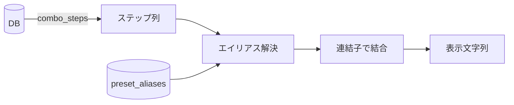

# 内部表現仕様書

| 項目 | 内容 |
|------|------|
| 文書ID | DES-004 |
| バージョン | **1.35.0** |
| 作成日 | 2026-04-10 |
| ステータス | **★★2026-09-14 改訂（`CHANGE-201` 反映・`M37-06`・`D-876`）**：**★★★§2.3 の flag 表を 14 値へ差し替えた**〔削除 3 / 追加 7 / `low_jump` の表示語を「低空」へ〕**。★分類を 4 → 5 区分へ**〔「当て方・位置系」を新設〕**。★「その他」の行は畳んだ。** **★★★「選択肢 14」と「表示語の引き当て 17」は別物である**——**同じ配列を使い回すと、選択肢に外した値が戻るか既存行が内部コードで出るかのどちらかが必ず起きる。** **★`link`**〔難易度〕**と `no_cancel`**〔接続の事実〕**の書き分け ＋ 「キャンセルの既定はキャンセルである」を明記。★§2.1 との二重化が解消。★`parry_drive_rush` の表記を「生ラッシュ」へ確定。** **★★ヘッダの「機械検査は無い」は*全体についての断言*としては失効した**〔Go ⇄ フロントは機械検査になった。**`check-enum-sync.sh` が flags を見ていないことは今も事実**〕**。★スキーマ変更 0・マイグレ消費 0。** 以下は前版の記述： **★★2026-09-13 改訂（`CHANGE-199` 反映・`M37-02`・`D-867`）**：**★★§2.3 へ「flag の表示語は 3 か所に在る」を書いた**〔Go の `flagText` ／ フロントのラベル表 ／ 本節〕**。⇒ 片側だけ直すと表示は壊れるがテストも型検査も緑のままである。** **★★★機械検査は無い＝`check-enum-sync.sh` は flags を見ていない**〔フロント側の定義が `web/src/constants/` に無いため〕**。** **★実測で食い違いが 1 件残る＝`parry_drive_rush` はサーバ「生ラッシュ」／ UI「パリィドライブラッシュ」。★スキーマ変更 0・マイグレ消費 0。** 以下は前版の記述： **★★2026-09-12 改訂（CHANGE-188 反映・`M30-05`・`D-835`）**：**★★★§2.1 へ表示名の強度語の置き場の規約を書いた＝派生元の強度は丸括弧の中、その技自身の強度は括弧の外。** **⇒ `M30-05` が実データ 372 行を 1 行ずつ見て確かめた事実であり、従来どこにも書かれていなかった。★seed の手入力に効く。** **★★あわせて `od` トークンが残るファミリーの台帳 15 件**（3 分類）**を置いた。⇒ 是正要求ではなく、次に同型が現れたときの判断材料である。** **★★【ジャスト】の命名が接頭形と接尾形に割れている件を記録した**（保留 `P-56`）**。★スキーマ変更 0。** 以下は前版の記述： **★★2026-09-11 改訂（CHANGE-182 反映・`M35-03`・`D-822`）**：**★★§3.2.1 の dangling 4 件の注記へ「0 件になった」を対で書いた**〔**★弁別そのものは残す**——**消すと次の担当がデータ補正を始める**〕**。★あわせて実害が 3 件であったことを記録した。★「272/272」の数えは触っていない。** 以下は前版の記述： **★★2026-09-10 改訂②（CHANGE-179 反映・`M30-03`・`D-813`）**：**★★★§2.1 へ「導出規則は 3 段」を追記した**〔**規則 2＝強度語が `code` の途中に在る**〕**。⇒ `CHANGE-166` の帰結文は `A1` / `A2` の両枝とも失効し、全体として置き換わった。★規則 1 が規則 2 より常に先であることが「既存の判定が 1 件も動かない」の成立条件である。** 以下は前版の記述： **★★2026-09-10 改訂（CHANGE-177 反映・`M35-02`・`D-809`）**：**★★§3.2.1 へ「`rush_<元技code>` は解決契約である」を追記した**〔**★入力面は `move_code` の文字列一致のみ。`original_move_id` へ落ちない** ／ 壊れ方は「押せないボタン」 ／ **★検出の経路が実機以外に無い**〕**。★`:320` の dangling 4 件の注記は正しく、直していない。** 以下は前版の記述： **★★2026-09-09 改訂（CHANGE-175 反映・`M30-02`・`D-799`）**：**★★★§2.1 へ「必殺技ファミリー UI が 3 軸になった」を書いた。⇒ `CHANGE-166` の帰結文は `A1` 186 件について失効した**（**`A2` 105 件については不変。★`M30-03` が扱う**）**。** **★★軸 1＝強度に `"none"` が加わり、軸 2＝変種**（`plain` / `holding` / `max_holding` / `perfect`）**が挟まった。★照合順序は `_max_holding` → `_holding` → `_perfect`**（**誤ると 1 変種が静かに消える**）**。** **★★確定するステップ・レシピ表示・保存・比較・エクスポートは 1 行も変わらない。** **★「強度の区別が無い必殺技」の実例が 2 → 3 件**（`terry` の `round_wave`。**マイグレ `000107`**）**。** 以下は前版の記述： **2026-09-07 改訂（CHANGE-166 反映・`M28-05`・`D-771`）**：**★★§2.1 の命名パターン表へ「強度の区別が無い必殺技 ＝ `<技名>` 単体」の行を足した**〔実例＝`sonic_break` / `quick_burn`〕**。★この型の誤りは 2 度入っており、表に 1 行足せば入力の時点で防げる。** 以下は前版の記述： **第27版（2026-08-30・CHANGE-147 反映：M24-07〔用語・i18n・内部値露出の最終 sweep〕・D-618）**：**★§2.2 へ「表示語をどこが持つか」の as-built を追記した**〔**正典が「定数ファイルの日本語文字列」から「値 → i18n キーの対応表 ＋ locale」へ移った**〕。**★★内部表現は 1 つも変えていない。⇒ 本節の原則の変更ではない。** 以下は前版の記述： **第26版（2026-08-18・CHANGE-120 反映：M22-07b〔SA 番号の逆引きを規則で解く＝案 E〕）**：**★★辞書に 1 行も足さずに SA 番号が解決するようになった。** **`M22-07` が制約①で 0 行に終わったのを、辞書ではなく規則で解いた形である。** **★★§5.0.2 の射程を拡張した**〔**前文の二分を「入力側／辞書側」から「入力側／照合先」へ** ／ **★規約 2 の主語を「緩められるのは辞書側だけ」から「入力側の情報を捨ててはならない。緩めてよいのは照合先だけ」へ是正**——**旧記述は「自分の段は辞書を使わない ⇒ 本規約は当たらない ⇒ 入力側を緩めてよい」と読む余地を残していた** ／ **★規約 3′ を新設＝段の順序を守る検査は実データ走査では足りないことがある**〔**実データに競合するキーが無ければ順序を入れ替えても答えが変わらず、全数走査のテストは全部緑のまま通る**。**合成した入力と対照が要る**〕〕。**★§5.0.4 を新設＝規則から導く段**〔**入力側には何も掛けない ／ 照合先は `move_code` から規則で導く ／ 多義は確定せず候補として返す** ／ **★前段がいずれも 0 件のときにだけ引く**——**as-built は早期 return の直列であり、条件式で書かない**。**⇒ 到達条件が「前段が 0 件」以外に存在せず、規約 3 の充足は測定結果ではなく論理から出る** ／ **★seed 波ごとの再適用を要しない**〕。**★§5.5.1 を新設＝投入側と照合側で多義の扱いが違う**〔投入側は両方落とす ／ 規則から導く段は候補として返す。**書き分けないと次の担当が候補提示の経路を消す**〕。**★§5.7.1 の 4 案表に決着を書いた**〔**E を採用。A / C を却下した理由も残した** ／ **B は保留**〕。**★§5.7.6 を新設＝導出規則は 1 か所に置き、seed 生成と逆引きの双方が引く**〔**2 か所に書くと片方だけ直したときに静かにずれる** ／ **seed 生成から公開して逆引きが引く形は層が逆である**。**`D-5` はこれまでコード内注記にしか存在しなかった**〕。**★§5.4 へ「規則で解いた分は本表の対象外」を追記**〔**`D-437` が警告した落ち方が SA 番号については構造的に消えた。ただし消えたのは規則で解いた分だけである**〕。**★スキーマ変更 0・マイグレ消費 0・`preset_aliases` の行の増減 0・本番コードの表示側 diff 0。** 以下は前版の記述： **第25版（2026-08-18・CHANGE-118 反映：M22-07〔取込の別名辞書の充実〕）**：**★本反映の性格が他と違う**——**`M22-07` は「辞書を増やす」ために起票されたが、行を 1 行も投入できずに終わった。** **⇒ 反映するのは「増やしたもの」ではなく「増やせなかった理由と、増やすときの作法」である。** **★§5.7.1 を新設＝別名を「増やす」ことは多くの技についてできない**〔**制約①**`UNIQUE (preset_id, move_id)`**＝1 技 1 表記と、制約②＝2 技 1 表記の禁止が向きの違う一対を成し、同義語を保持できない**。**⇒ 既に別名を持つ技へ 2 本目を足すことは構造的にできない**。**`DES-003` §3.9 は制約を正しく列挙していたが「だから同義語を持てない」という帰結を書いていなかった**。**採りうる形 4 案 A / B / C / E を代償つきで列挙した**——**★選定は未了であり、本書はまだどれも採っていない**。**★導ける別名と導けない別名で採るべき案が違い、両者は排他ではない**〕。**★§5.7.2＝SA 番号は `move_code` から導き技名から推測しない**〔**状態接頭辞つきも拾うこと**。**落とすと衝突組が衝突していないように見える**＝`D-357` の型〕。**★§5.7.3＝値の正本は散っている**〔4 層の表。**1 か所に見えると次の担当が CSV だけを直して層 C-1 が古いまま残る**〕。**★§5.7.4＝別名を増やすときの不変条件**〔**3 件数の形**。**`M21-06` の `D-381` で受理されながら本書に無かった**〕。**★§5.7.5＝逆引きの読み口は表示の読み口と別である**〔**逆引き側だけを触る改修は表示にも `recipe_cache` にも構造的に波及しない**。**書かないと次の担当が不要な凍結を自分に課す**〕。**★§5.4 へ「本表に『導けない別名』の行はまだ無い」を追記**〔**将来持つようになったら必ず別の行として足すこと**——**担い手が違う**〕。**★スキーマ変更 0・マイグレ消費 0・`preset_aliases` の行の増減 0。** 以下は前版の記述： **第24版（2026-08-14・CHANGE-109 反映：M21-06〔コマンド技入力モード〕）**：**§2.4.4 へ「本表を広げてコマンド技入力モードに使わない」を追記した**——**項目 3 が方向の列〔236/623 等〕を落としているのは欠陥ではなく、段階2 の一様フォールバックを成立させるための設計である。** **⇒ 多方向コマンドが要る消費者は、本表を広げるのではなく別の索引を持つ**〔`DES-005` §6.4.4 ／ 配信は `DES-002` §4.2〕。**★広げると仮想側の段階2 の解決結果が変わる。** 以下は前版の記述： **第23版（2026-08-14・CHANGE-104 反映：M20-07〔取込の逆引き活用 ＋ 多候補ハッジの分割 ＋ 逆引き前段の正規化〕）**：**§5 冒頭注記を改めた**＝**照合は「`alias_text` 完全一致」から「正規化キーの一致」へ** ／ **決定論を支えているのは「1 件のときだけ確定する」規則そのものであり一意制約ではない**〔`G-11` 決着〕。**§5.0 を新設**＝**§5.0.1 逆引き前段の正規化**〔**採った 3 範囲と採らなかった 3 範囲を理由つきで確定** ／ **入力側と辞書側の両方へ同じ関数を掛ける**〕・**§5.0.2 段を足すときの規約 4 点**〔**危険なのは同一視が存在することではなく、同一視されたまま確定すること** ／ **緩められるのは辞書側だけ**〕・**§5.0.3 多候補ハッジの分割**〔**区切りは前後に空白を伴う `or` のみ** ／ **分割結果は候補であって確定ではない**〕。**§5.5 へ照合側の衝突検査はキャラ単位で行うことを追記**〔**プリセット単位で数えると本物の衝突が 0 件に見える**〕。**§5.6 を 3 項へ分割**＝**5.6.1 SA / CA 注記は辞書側だけを緩めた第 2 段で解いた**〔**「前段の正規化で解いた」と書いてはならない**〕・**5.6.2 `DR > 2LP` は逆引き側の手番ではない**〔**① プロンプト側** ／ **合成形の流儀は 2 つ**〕・**5.6.3 両引きの「未実装」を解消**。 以下は前版の記述： **第22版（2026-08-14・CHANGE-103 反映：M20-06〔命名規則の正典化 ＋ `P-34` 13 件の投入〕）**：**§3.2.1 を新設**＝**`rush_variant` の命名を 2 段に書き分けた**〔**接尾辞は半角 `(ラッシュ)` の 1 形＝全数で成立** ／ **「元技エイリアス ＋」は原則で 1 件だけ外れる**〕**＋「268/272」の正体は dangling 参照であり命名の揺れではないことを明記**。**§5.3 へ 2 点**〔**表示ロケール分岐は未実装である** ／ **解決順序をどの表示経路に適用するかの書き分け**＝**レシピ表記は `preset_id` ごと・技名の同定用ラベルは公式表記を固定で引く**〕。**§5.4 へ層 C-3 の再適用責務**〔**新キャラ波では 0 行になるのが正常** ／ **固定表は値を持たない**〕。**§5.6 へ「逆引きの両引きは未実装」**。**§5.7 へ規約 5**〔**列そのものを出しているかをテストで固定する**〕。 以下は前版の記述： **第21版（2026-08-13・CHANGE-101 反映：M20-04〔プリセット管理 UI〕）**：**§5.7-2 の射程を改めた**——**旧記述「直接 INSERT する経路を増やさない」は、書かれた時点で seed 投入経路しか存在しなかったことに由来する。** **利用者編集の経路は生成器を通せないため、「経路を増やすときは DB で守れない不変条件を守る検査を同じ経路へ置く」へ改めた**（**守るべきものは経路の本数ではなく不変条件である**）。**§5.7-2′ を新設**＝**交差は「別キャラなら同じ文字列でよい」で逃げられない**（`alias_text_en` の値は全キャラ同一の汎用語）。 以下は前版の記述： **第20版（2026-08-13・CHANGE-100 反映：M20-03〔`preset_aliases` の一意制約〕）**：**§5.7 を新設＝エイリアスの投入経路の規約 4 点**（**`character_id` を必ず入れる** ／ 生成器を通し直接 INSERT を増やさない ／ **エイリアスを投入する生成器は 2 本ある** ／ **未投入の行を投入するときは事前に違反検査を回す**）。**★本番の INSERT 経路は現時点で 0 件であり、規約はまだ一度も試されていないことを明記した。** 以下は前版の記述： **第19版（2026-08-13・CHANGE-099 反映：M20-02〔エイリアス生成規則の確定と実データ投入〕）**：**§3.4 のサンプル表を as-built の実データ 6 行へ置き換え**（**`sa1` → `sa1_shinku_hadoken`** ／ **`jumping_heavy_punch` を追加＝層順の原理が可視になる** ／ **`DR` / `cDR` は非技ステップのため表外の注記へ**）。**§3.4.1 を新設＝生成規則の層順を原理で明文化**（**接頭辞で書かない**）。**§3.4.2 を新設＝SA / CA 注記の書式・抽出源・適用範囲**。**§5.3 へ `alias_text_en` の NULL の意味を追記**。**§5.4／§5.5／§5.6 を新設＝seed 波ごとの再適用責務 ／ 衝突組は両方落とす ／ 逆引きへの副作用 2 件**。 |
| 前提文書 | REQ-001 要件定義書 / DES-003 データモデル設計書（**★版数は書かない。各文書の「バージョン」セルが正本である**＝2026-08-25 是正） |

---

## 1. 目的と方針

### 1.1 目的

コンボレシピの表記ゆれ問題を解消するため、データベース上は単一の統一された内部表現で技を保持し、画面表示時にプリセット経由でユーザーの好みの表記に変換する仕組みを定義する。

### 1.2 基本方針

- **内部表現は単一**：データベースには `moves.code` を始めとする統一識別子のみを保存する
- **プリセットは変換テーブル**：内部表現 → 表示文字列の対応を定義する
- **プリセットの初期セット**：5種類を組み込みで提供
- **カスタマイズ範囲**：ユーザーは組み込みプリセットを編集できない。コピーしてカスタムプリセットを作成し、エイリアスのみ編集可能
- **細部の表記は実装時決定**：本書では方針とサンプルを示し、全技・全プリセットの表記マスタは実装時にClaude Codeと開発者が協同で作成する

### 1.3 サポートしない記法

以下の記法は、内部表現・プリセットエイリアスのいずれにおいてもサポートしない。利用者が登録時に使用しようとしても、入力UI側でブロックするか、展開しての登録を促す。

**①回数繰り返し記法**

コンボ表現を短縮するための繰り返し記法はサポートしない。

- 全体繰り返し例：`(5MP > 2MP > 236MP) x3`（このコンボを3回）
- 部分繰り返し例：`5LP x4 > 2MP > HP DP`（5LPだけ4回）
- 日本独自の表現例：「中P×3」「中P3回連打」

**②分岐／オプション記法**

1つのコンボの中に複数の選択肢を埋め込む記法はサポートしない。

- 例：`5HP : SA3 / j.H`（どちらか選択）

**サポートしない理由と運用**

- 回数繰り返しはパーサと比較機能（同一レシピ判定）が複雑化するため、利用者には繰り返し部分を**展開して登録**してもらう方針とする
- 分岐は「1コンボ＝1レシピ」の原則を崩し、マイコンボ管理やタグ付けとの整合が取れなくなるため、選択肢ごとに**別々のコンボ**として登録してもらう方針とする
- この方針は要件レベルの原則（1レシピ＝1コンボ）として要件定義書にも明記する

---

## 2. 内部表現の構造

### 2.1 技の内部識別子（move.code）

各技は `moves.code` として一意の統一識別子を持つ。**code はツールが英語表示名から機械変換して決定論的に採番する**（CHANGE-025。ピリオド等を除去し小文字スネークケースへ連結。表示名と独立＝表示名の正規化〔§3.2〕には影響しない）。命名規則は以下を機械変換の正規形とする。

- スネークケースの英数小文字
- キャラクター内で一意（同一キャラに `standing_medium_punch` が2つ存在することはない）
- 人間が見てもある程度意味が推測できる名称
- **lと1の混同を避けるため、強度は `light` / `medium` / `heavy` と省略せず記載する**
- 強度は接尾辞 `_light` / `_medium` / `_heavy` / `_od`
- キャラ slug はピリオド除去連結（`aki` / `c_viper` / `m_bison`）。`character_code` も同規約（slug は同定専用）
- code 衝突時は英語前提条件のサフィックスを付し、なお衝突する場合は `_2` フォールバック（CHANGE-025）

> **★★★【2026-09-12・`CHANGE-188`・`M30-05`】表示名（`name_ja`）における強度語の置き場の規約。**
>
> **★派生元の強度は丸括弧の中に書く。その技自身の強度は括弧の外に書く**〔接頭・末尾・先頭装飾の直後〕**。**
>
> **⇒ これは `M30-05` が実データ 372 行を 1 行ずつ見て確かめた事実であり、従来どこにも書かれていなかった。★seed を手入力で足す手番に効く**——**崩れると、ファミリー行の表示名から強度語を落とす規則**（`DES-005` §6.1）**が静かに誤爆する。**
>
> **★★★`family` 識別子に `od` トークンが残るファミリーの台帳（15 件・3 分類）**（**2026-09-12 実測・seed CSV 31 キャラ全数**）**。⇒ 是正要求ではない。★分類ごとに「表示名の `OD` を落としてよいか」が逆になるため、次に同型が現れたときの判断材料として残す。**
>
> | 分類 | 件数 | 例 | 表示名の `OD` |
> |---|---:|---|---|
> | **(i) 技名の一部** | **1** | ingrid `od_sun_shot`＝「ODサンシュート」（**行の強度は弱/中/強**） | **残す** |
> | **(ii) 派生元の強度** | **1** | elena `lynx_whirl_od_spinning_scythe`＝「リンクスワール(ODスピンサイズ派生)」 | **残す**（丸括弧の中なので上の規約で保護される） |
> | **(iii) OD のみを持つ** | **13** | cammy 10 ／ ken 2 ／ cammy `reverse_edge` | **既に落ちている**（行の中で OD を選ぶため冗長） |
>
> **★機序＝`parseSpecialCode` は末尾の強度接尾辞を先に剥がすため、途中の `od` が識別子に残る。**
>
> **★★(i) と (ii) は扱いが一致している**（どちらも `OD` を名前に残す）**。⇒ 追加の是正は要らない。**
>
> **★★★命名形の揺れは解消した**（**2026-09-12・`CHANGE-193`・`M30-07`**）**。⇒ 全数が接尾形である。**
>
> **★★以下は「揺れが在った事実と、その解消」の記録である。⇒ 削除しない**——**次に同型が現れたときの判断材料であり、同節の `od` トークン台帳 15 件と同じ趣旨である。**
>
> **★旧記述＝「同じ UI 概念に命名形が 2 通りある例が 1 件ある——【ジャスト】版。⇒ 保留 `P-56` で裁定待ちである。」**
>
> | キャラ | `move_code` | 形 | 画面での見え方 |
> |---|---|---|---|
> | luke | `flash_knuckle_perfect_light` | **接尾形** | 変種軸（通常 / ホールド / ジャスト）で選べる |
> | **guile**（**★2026-09-12 是正後**） | `sonic_boom_perfect_light` | **接尾形** | **ルークと同じ変種軸で選べる** |
> | ~~guile（是正前）~~ | ~~`perfect_timing_light_sonic_boom`~~ | ~~接頭形~~ | ~~別ファミリー 3 行として並ぶ~~ |
>
> **★原因は実装の分岐ではなく seed の命名の揺れである**——`splitSpecialVariant` の変種接尾辞（`_max_holding` / `_holding` / `_perfect`）は**接尾形しか見ない**。**⇒ 接頭形で書かれた同じ概念は畳まれない。**
>
> **★★★決着＝(a) seed 側を直した**（`D-836`・開発者の逐語＝「Seed側を修正します」）**。⇒ `M30-07` が guile の `move_code` 10 行を接尾形へ揃え、マイグレ `000112` で反映した。★実装側で接頭形を吸収する案 (b) は採らなかった**——**揺れを永続化するため。**
>
> **★命名規約そのものは変えていない。⇒ `<基底>_perfect_<強度>` は本節が既に定めている形であり、ルーク 3 件が正であった。**
>
> **★★帰結＝ファミリー総数が 372 → 369 になった**（guile の別ファミリー 3 行が変種軸へ畳まれたため）**。**
>
> **★射程＝【ジャスト】を持つのはこの 2 キャラだけである**（guile 10 行 ／ luke 3 行。**★【ホールド】/【最大ホールド】は全数が接尾形であり、同じ揺れは 1 件も無い**）**。**
>
> **★★誰も壊していないのに割れている。⇒ テストも lint も型検査も緑であり、実機で 2 キャラを並べて見る以外に気づく経路が無かった**（実際、開発者の実機確認で初めて出た）**。★「同じ概念に複数の命名形が在るか」は、seed を足す手番で `grep` して確かめる種類の問いである。**

**命名パターン例**

| 技の種類 | パターン | 例 |
|---------|---------|-----|
| 通常技（立ち） | `standing_<強度>_<ボタン>` | `standing_medium_punch`（立ち中P） |
| 通常技（しゃがみ） | `crouching_<強度>_<ボタン>` | `crouching_light_kick`（しゃがみ弱K） |
| 通常技（ジャンプ攻撃） | `jumping_<強度>_<ボタン>` | `jumping_heavy_punch`（ジャンプ強P）。移動のみのジャンプ動作（`jump_neutral` 等）は seed 管理で別系統 |
| 特殊技 | `<技名>` | `collar_bone_breaker`（鎖骨割り） |
| 必殺技 | `<技名>_<強度>` | `hadoken_light`（弱波動拳）、`shoryuken_od`（OD昇龍拳） |
| **★★必殺技（強度の区別が無いもの）** | **`<技名>` 単体** | **★★★【`CHANGE-175`・`M30-02`・2026-09-09】実例は 3 件になった。⇒ `terry` の `round_wave` が加わった**（**`round_wave_heavy` からの是正。マイグレ `000107`。★開発者のインゲーム確認 ＋ `character_data/command-correction-history.md` の「対応 dist code」欄が `round_wave` と記録していた**）**。** **★★あわせて本行の技はファミリー UI に載るようになった**（**強度 `"none"`。⇒ 上の注記**）**。** 以下は前版の記述： **★★【`CHANGE-166`・`M28-05`・2026-09-07 as-built】実例は 2 件である。** **★`sonic_break`**〔ソニックブレイク・guile〕**／ `quick_burn`**〔クイックバーン・terry〕**。★どちらも `_od` 版だけが別行で在る。** **★★強度接尾辞を持たない `move_code` は、必殺技クイック入力パネルのファミリー UI に載らない**（`DES-005`）**。⇒ 「全技一覧から選ぶ」プルダウンからの入力になる。★これは意図された設計である。** **★★この行が無かったため、単一強度の必殺技へ `_light` を付ける誤りが 2 度入った**〔`sonic_break_light`＝`M19-04c` で是正 ／ `quick_burn_light`＝`M28-05` で是正〕**。⇒ 表に 1 行足せば、入力の時点で防げる。** |
| ターゲットコンボ | 公式に独立セグメント無し。段数付き行は所属セグメント（normal/unique）の code を機械変換で採番。`tc_<番号>` は FR703 手動分類用に温存。**category=`target_combo` の付与は入力支援ツールで人が行い本体は取込値を信頼（CHANGE-065・詳細 DES-003 §3.3）** | 段数付き行＝通常技 code として採番、`tc_1`（手動）（CHANGE-026） |

> **★★★【`CHANGE-175`・`M30-02`・2026-09-09】必殺技ファミリー UI が「基底 × 変種 × 強度」の 3 軸になった。⇒ `CHANGE-166` の帰結文**（**強度接尾辞を持たない `move_code` はファミリー UI に載らない**）**は `A1` 186 件について失効した。**
>
> **★★`A2` 105 件については不変である**（**強度語が `code` の途中に在るもの**）**。⇒ そちらは `M30-03` が扱う。**
>
> **★★★【2026-09-10・`CHANGE-179`・`M30-03`】`A2` も失効した。⇒ `CHANGE-166` の帰結文は全体として置き換わる。★もはやどの枝にも当てはまらない。**
>
> **★★導出規則は 3 段である。**
>
> | 段 | 条件 | 結果 |
> |---|---|---|
> | **1** | **末尾が `_od` / `_light` / `_medium` / `_heavy`** | `{ family, strength }` |
> | **★★2**（**2026-09-10 新設**） | **強度語が `code` の途中に在る** | **`{ family, strength }`** |
> | **3** | 強度語がどこにも無い | `{ family: code, strength: "none" }` |
>
> **★★段 2＝`SPECIAL_STRENGTH_SUFFIX` の並び**（**`od` → `light` → `medium` → `heavy`**）**で最初に見つかった強度語を 1 トークンだけ抜き、残りを `_` で連結してファミリーとする。★実例＝`lightning_beast_light_rolling_attack` → ファミリー `lightning_beast_rolling_attack` ／ 強度 `light`。**
>
> **★★★規則 1 が規則 2 より常に先である。⇒ これが「既存の判定が 1 件も動かない」の成立条件である。★順序を入れ替えると、末尾接尾辞を持つ 733 件の判定が変わりうる。**
>
> **★★優先順位を `od` 先にした＝実データで位置順と結果が変わるのは 3 件だけである**〔`cammy/fatal_leg_twister_{light,medium,heavy}_od_hooligan_combination`〕**。⇒ 両側に支持する兄弟が実在するため同点ではない。★2026-09-10 の開発者の実機確認で確定した。**
>
> **★優先順位は `moveSurfacing.roster.test.ts` が名指しで固定している**（3 件の全数 ＋ 規則 1 で決まる 12 件）**。⇒ 覆すときはそのテストを書き換える。**
>
> **★★軸 1＝強度に `"none"` が加わった。⇒ 母集団は `moves` の `category='special'` 1024 行のうち 186 件**〔**末尾が `_od` / `_light` / `_medium` / `_heavy` のもの 733 ／ 強度語が途中に在るもの 105 ／ どこにも無いもの 186**〕**。★UI では強度行の先頭へ「強度なし通常版」を置く。**
>
> **★★軸 2＝変種**（`plain` / `holding` / `max_holding` / `perfect`）**。⇒ `<基底>_holding` / `_max_holding` / `_perfect` を基底へ畳む。**
>
> | 規則 | 内容 |
> |---|---|
> | **★★★照合順序** | **`_max_holding` → `_holding` → `_perfect`。⇒ `_max_holding` は `_holding` でも終わる。★順序を誤ると「最大ホールド」が「ホールド」として畳まれ、静かに 1 変種消える** |
> | **★★畳む条件** | **剥がした基底が同じキャラの必殺技ファミリーとして実在するときだけ。⇒ 実在しなければ独立ファミリーのまま残す**（**基底が消えた変種を到達不能にしない**） |
> | **★★射程** | **`category='special'` のみ。⇒ 通常技・特殊技の `_holding` 17 件には触れない** |
> | 代表名 | **plain から採る**（**変種の `name_ja` は装飾も強度語も残るため**） |
>
> **★★★確定するステップは変わらない。⇒ ホールド版は従来どおり自分の `move_id` で入り、修飾フラグは足していない。★レシピ表示・保存・比較・エクスポートは 1 行も変わらない。**

**必殺技ファミリー名の導出**（CHANGE-057・M15-03）：必殺技の直接指定 UI はファミリー（例「波動拳」）＋強度（弱/中/強/OD）の 2 段で選択し、出口は `<技名>_<強度>`（`hadoken_light` 等）。ファミリー名は `official_ja_move` から強度ラベルを機械除去して導出する。**公式 JP 名は接頭形が主**（例「**弱**波動拳」「**OD**昇龍拳」）だが末尾形（「波動拳・弱」等）も存在するため、**導出は接頭・末尾の両対応**とする（`stripStrengthLabel` 相当）。
| スーパーアーツ / CA | SA: `sa<番号>`（`sa1`〜`sa3`）。CA: `ca`（クリティカルアーツ、`category = critical_art`） | `sa1`, `sa2_lv3`, `ca`。CA は SA3 と別行で全キャラ存在（CHANGE-025） |
| 共通システム | `<名称>` | `drive_parry`（ドライブパリィ。CSV 取込〔FR701〕で moves 化＝CHANGE-038。生ラッシュ `parry_drive_rush` は move ではなく `modifiers.type`＝§2.3 参照） |
| 通常投げ | `throw_forward` / `throw_back`（1・2件目固定）、3件目以降は英語名機械変換 | `throw_forward`（前投げ）、`throw_back`（後ろ投げ）（CHANGE-023/025/026） |
| ラッシュ版技 | `rush_<元技code>` | `rush_standing_medium_punch`（ラッシュから立ち中P）、`rush_crouching_heavy_kick` |
| ドライブインパクト | `drive_impact` | キャラ別に各キャラのmovesテーブルへ個別登録（`character_id`で区別） |

**強度の命名**：`light`（弱）、`medium`（中）、`heavy`（強）、`od`（オーバードライブ）とする。短縮形の `l` / `m` / `h` は数字の `1` と混同しやすいため採用しない。OD技は既に固有用語として定着しているため `od` のまま維持する。

**ボタンの命名**：`punch`（P）、`kick`（K）とする。こちらも短縮形は避ける。

**派生の区別**：SA2のレベル違いなど、同じ技の派生は `_lv1`, `_lv2` の接尾辞で区別する。

**移動・ジャンプ動作の扱い**：微歩き・微下がり・ジャンプなど、技を出さない移動動作も `moves` テーブルに `category = "system"` として登録する。これにより `combo_steps.move_id` から他の技と同じ構造で参照でき、ステップ並び順で自然に移動タイミングが表現できる。登録する代表的な動作は以下。

| code | 意味 |
|------|------|
| `forward` | 前入力 |
| `back` | 後ろ入力 |
| `micro_forward` | 微歩き（前方向の細かい歩き） |
| `micro_back` | 微下がり（後方向の細かい下がり） |
| `dash_forward` | 前ダッシュ（前方向のダッシュ移動） |
| `dash_back` | 後ろダッシュ（後方向のダッシュ移動／バックダッシュ） |
| `jump_neutral` | 垂直ジャンプ（技を出さずにジャンプのみ） |
| `jump_forward` | 前ジャンプ（技を出さずにジャンプのみ） |
| `jump_back` | 後ろジャンプ（技を出さずにジャンプのみ） |

**「前入力」と「微歩き」を別moveとする理由**：「前入力を `forward` + `modifiers.flags=["micro_walk"]` で表現」という案も検討したが、同じ意味の状態が2通り（`forward` 単独と `forward`+flag）の表現になりデータに揺れが生じるため、採用しなかった。独立move化により1入力=1moveの原則が保たれ、検索・比較時の一意性も確保される。入力UIでも「前入力」「微歩き」は別ボタンとして提示する。

ジャンプ攻撃（**`jumping_heavy_punch`** 等）は従来どおり独立した技としての扱いであり、上記ジャンプ動作とは別レコード。**接頭辞は厳密に区別する**：**`jumping_` ＝空中攻撃技**（§2.1 正典表の `jumping_<強度>_<ボタン>`）／**`jump_` ＝移動 system move 専用**（`jump_neutral`／`jump_forward`／`jump_back`）。（2026-07-23 errata：旧記載 `jump_heavy_punch` は誤記。正典表が正・開発者確認済み。両者を取り違えると走査フィルタが移動 move を巻き込む／攻撃を取りこぼすため厳密に扱う）

**`high_jump` の扱い（CHANGE-062）**：`high_jump` は上記の移動 system move（`category="system"`）ではなく、**キャラ固有の unique 特殊技**（`category="unique"`）である。実 DB では c_viper の `high_jump_forward` / `high_jump_neutral`（category=unique）として存在する。移動 system move でも modifier flag でもない（かつて §2.3 に flag `high_jump`〔未実装〕として置かれていたのは幽霊仕様で、本 CHANGE で削除した）。将来他キャラに類似の特殊ジャンプが追加された場合も、キャラ固有の unique move として登録する。

**ラッシュ版技の独立move化**：ラッシュ＋通常技は性能（補正値、派生技、コンボ可能性等）が通常版と異なるため、`rush_<元技code>` の命名で独立moveとして登録する。例えば「ラッシュから立ち中P」は `rush_standing_medium_punch` として `moves` テーブルに登録される。レシピ表現としては、従来の `parry_drive_rush > standing_medium_punch` ではなく、`rush_standing_medium_punch` 単独のステップとして表現する。`original_move_id` で対応する通常技を参照することで、ラッシュ版から元技を辿れる構造とする（DES-003 §3.3参照）。

ラッシュからしか出せない専用技は現状存在しないため、ラッシュ版moveには必ず対応する通常版moveが存在する前提とする。バリデーションで「対応する通常版が存在しないラッシュ版」のレシピ登録を防止する（DES-006 VAL-C12参照）。

**ドライブインパクトのキャラ別登録**：ドライブインパクトは共通システム技だがダメージや補正値などキャラごとに性能が異なるため、各キャラの `moves` テーブルに `category = "drive_impact"` で個別登録する。`code` は全キャラで `drive_impact` で統一し、character_id でキャラを区別する。

**生ラッシュ（`parry_drive_rush`）との使い分け**：技を出さない生ラッシュ単独の動作は引き続き `parry_drive_rush` として扱う。ラッシュから何らかの技を出す場合は `rush_*` の独立moveを使う。混在しないように注意する。

**容量・パフォーマンスへの影響**：`moves.code` は全キャラ合計で数百行、各レコード数十バイトのため、長めの識別子を採用してもDBサイズ・性能への影響は実質ゼロ。`recipe_cache` には変換後の表示文字列が入るため、内部codeの長さは表示には無関係。可読性を最優先する。

> **【★2026-08-02・`move_code` の長さ規約】長さ上限を設けない。**
>
> **少なくとも 50 文字まで、DB／seedgen／マイグレ／API／CSV／画面18 の全経路で欠損・切り詰め・レイアウト破壊なく扱えることを実測で確認済み**（`moves.code` は `TEXT NOT NULL` で長さ制約なし。最長の実例＝jamie の `drink_level_4_ransui_haze_3_drink_while_retreating` の 50 字。40 字超は同キャラに 7 件。M14-03e で実証）。
>
> **過長な `move_code` は、表示側の overflow / truncate で扱う。** **長さだけを理由に短縮・リネーム・投入停止をしてはならない**——`move_code` は `preset_aliases` の解決キーであり、短縮すると別名・既存レシピとの対応が壊れる。正準形（英語表示名の機械変換）と dup 検査は従来どおり継続する。

> **【★2026-08-02・変種行のサフィックス一覧】同じ入力の別バリエーションを表す行は `<base>_<修飾>` 形式とする。**
>
> | サフィックス | 意味 | 実例 |
> |---|---|---|
> | `_od` | OD 版（ドライブゲージ消費版） | `sonic_break_od` |
> | `_holding` | ボタンホールド版 | `standing_heavy_punch_holding` |
> | `_1hits` / `_2hits` | 途中止め（N 発止め） | `death_crest_2hits` |
> | `_rapid` | **連打キャンセルの 2 打目以降に出る別性能の行**（CHANGE-091・ザンギエフ） | `standing_light_punch_rapid` |
>
> **新しい変種を足すときは本表に 1 行追記する。** **従来は個別の実例が散在するだけで参照先が無く、`_rapid` の採番時に前例を探し直す必要が生じた。**

### 2.2 レシピの内部表現

> **【★★2026-08-30 追記＝`CHANGE-147` / `M24-07`】表示語をどこが持つかの as-built。**
>
> **★★正典は「定数ファイルの日本語文字列」から「値 → i18n キーの対応表（`web/src/constants/`）＋ locale（`ja.json` / `en.json`）」へ移った。**
>
> **★★内部表現は 1 つも変えていない**——`steps` / `stepCount` / API の JSON キーはすべて不変である（`D-616` の制約 1）。**⇒ 本節の原則の変更ではない。「表示語をどこが持つか」の追記だけである。**
>
> **★2 段の形**——`*_LABEL_KEYS`（値 → i18n キー）と `*_LABELS`（`ja.json` から導出した日本語の写し）。**★i18n を通らない画面へは `web/src/lib/ja-label.ts` が同じ `ja.json` から日本語を配る。⇒ 源泉は `ja.json` の 1 つだけである**（`E-76` を守る）。
>
> **★この形を採った理由＝消費側に `useTranslation` が 0 の画面が在り、素直に i18n 化すると「1 画面で i18n と直書きが混ざる」になるためである**（開発者裁定・2026-08-30）。


レシピは `combo_steps` テーブルの各行が1ステップを表す。各ステップは以下を保持する。

- `move_id`：参照する技のID（NULL可）
- `modifiers`：修飾情報（JSON）
- `step_order`：順序

技ステップ以外（ラッシュ類など）は `modifiers.type` で識別し、`move_id` をNULLとする。

**レシピ要素の振り分け原則（taxonomy・CHANGE-064／M16-04）**：レシピの各要素は次の3種のいずれかに分類する。判断基準は「独立した1入力の動作か＝(a)／隣接動作の出し方の種別か＝(b)／直近moveの修飾か＝(c)」。

- **(a) moves行**（`move_id` あり）：技（通常/特殊/SA/CA/投げ/ラッシュ版/ドライブインパクト）に加え、**`category="system"` の共通システム動作**（`drive_parry`・移動＝`dash_forward`/`dash_back`/`jump_*`/`micro_*`/`forward`/`back`）。移動は「1入力=1move」で独立moveとする（§2.1）。
- **(b) 非技ステップ `modifiers.type`**（`move_id` NULL）：技でも移動でもない、隣接ステップの出し方を表す動作＝`parry_drive_rush`・`cancel_drive_rush` のみ（§2.3）。**移動（dash等）はここに置かない**（＝(a)）。
- **(c) flag（`modifiers.flags`）**：直近moveの出し方の修飾（`just`/`delay`/`link`/ジャンプ系等）。ジャンプ→攻撃は空中技＋`{neutral_jump}`/`{forward_jump}` flagで表現し、純移動でないジャンプmoveは省略する（§2.3・SUPP-001 §3.3.2）。

move と type の二重表現は不採用（§2.1 の1入力=1move原則）。この原則により、かつて `modifiers.type` の方向別dashとsystem move dashが二重に存在した揺れは、M16-04（CHANGE-064・マイグレ000022）でsystem moveへ一本化された。DES-003 §3.5（`combo_steps` の move_id/modifiers.type 区別）と整合する。

**ユーザー向け表示語彙（FB⑥・CHANGE-066／M16-06）**：新規登録/編集画面では taxonomy を user 語彙で表示する＝(a) 技系は「技」、(b) 非技 modifier.type と移動 system move は入力区分上「共通システム（移動・その他）」（M15-03/CHANGE-057 で確立）。内部の「技ステップ/非技ステップ」という生表現は rendered UI に出さない（M16-06 実査で不在を確認・fallback 2 箇所を正典ラベル SSOT へ整合）。詳細/比較/出力の表示は本 rollout の対象外。

### 2.3 修飾情報とステップ種別のコード

> **★★★【`CHANGE-199`・`M37-02`・2026-09-13】flag の表示語は 3 か所に在る。**
>
> | # | 場所 |
> |---|---|
> | 1 | **Go の `flagText`**（サーバ生成のレシピ文字列） |
> | 2 | **フロントの modifier ラベル表**（編集画面のバッジ） |
> | 3 | **本節** |
>
> **★★flag を増やすときは 3 か所を直す。⇒ 片側だけ直すと、表示は壊れるがテストも型検査も緑のままである。**
>
> **★★★機械検査は無い＝`scripts/check-enum-sync.sh` は flags を見ていない。⇒ フロント側の定義が `web/src/constants/` ではなく `features/combo/` に在るためである**〔`.claude/rules/enum-sync.md` 規則 2 に反する配置〕**。★定数の移設は波及が読めないため単独の手番が要る**（`followup` の `modifier-flag-labels-triplicated-without-check`）**。**
>
> **★★実測で 1 件の食い違いが残っている＝`parry_drive_rush` はサーバ文字列「生ラッシュ」／ UI バッジ「パリィドライブラッシュ」。⇒ 本節は両方を書いている。★どちらを正とするかは `followup` の `modifier-display-differs-editor-and-viewer` で扱う。**

`modifiers` に入るコード値は、DBの制約ではなく画面UI（固定選択式）で担保する。本書では方向性のみ定義し、列挙値の詳細は実装時に決定する。

**flags の方向性・実値**（ステップ単位の修飾。**flags マスタは固定選択式＝UI 担保・自由入力不可**。実値は CHANGE-057／M15-03 で実装に同期）

| 分類 | flag（コード・内部正典） | 表示（短縮表記・正） | 状態 |
|------|--------------------------|----------------------|------|
| タイミング系 | `delay` | ディレイ | 実装済 |
| タイミング系 | `link` | 目押し | 実装済（CHANGE-057 で追記） |
| キャンセル系 | `first_hit_cancel` | 一段目キャンセル | 実装済（M15-03） |
| キャンセル系 | **`no_cancel`** | **ノーキャン** | **実装済（M37-06）** |
| キャンセル系 | **`late_cancel`** | **遅らせキャンセル** | **実装済（M37-06）** |
| 空中・浮かせ系 | `low_jump` | **低空** | 実装済（**★M37-06 で表示語を変更。コードは不変**） |
| 空中・浮かせ系 | **`juggle_high`** | **高め当て** | **実装済（M37-06）** |
| 空中・浮かせ系 | **`juggle_low`** | **低め当て** | **実装済（M37-06）** |
| 当て方・位置系 | **`whiff`** | **空振り** | **実装済（M37-06）** |
| 当て方・位置系 | **`meaty`** | **持続当て** | **実装済（M37-06。★中途の技向け。始動技側は `combos` の列＝`M37-07`）** |
| 当て方・位置系 | **`cross_under`** | **裏回り** | **実装済（M37-06）** |
| OD ボタン組 | `od_lm` / `od_mh` / `od_lh` | OD(弱中) / OD(中強) / OD(弱強) | 実装済（M15-03） |

> **★★★【`CHANGE-201`・`M37-06`・2026-09-14】選択肢は 14 値である。⇒ 上表がその全数である。**
>
> **★「その他｜言語化が難しい技の当て方を表すコード」の行は畳んだ。⇒ 追加 7 値**〔`whiff` / `meaty` / `cross_under` / `juggle_high` / `juggle_low` / `no_cancel` / `late_cancel`〕**がその枠を実値で埋めたためである。★値の集合は開発者が全件決めた**（`D-873`）**。⇒ 置き場を残すと、決めた集合の外へ値が足される余地が残る。**
>
> **★★分類を 4 → 5 区分へ増やした。⇒ 「当て方・位置系」を新設し、「空中系」を「空中・浮かせ系」へ改めた**（`juggle_*` は空中の*技*ではなく、相手が浮いている状態への*当て方*である）**。**
>
> ---
>
> **★★★選択肢から外した 3 値**（**★表示語は残す**）
>
> | flag | 表示 | なぜ外したか |
> |---|---|---|
> | `just` | ジャスト | **技のジャスト版は move の `perfect` 変種に在る**（重複） |
> | `neutral_jump` | 垂直ジャンプ中 | **ジャンプ方向は move**〔`jump_neutral` / `jump_forward` / `jump_back`〕**で表す**（重複） |
> | `forward_jump` | 前ジャンプ中 | 同上 |
>
> **★★★「選択肢」と「表示語の引き当て」は*別物*である。⇒ 選択肢 14 ／ 引き当て 17**〔14 ＋ 外した 3〕**。★同じ配列を使い回すと、「選択肢に外した値が戻る」か「既存行が内部コードで出る」かのどちらかが必ず起きる。⇒ 次に flag を外す担当は、1 本の配列から削ってはならない。**
>
> **★★選択肢から外した flag も、既存行が持っていれば*重複判定キーの一部として効き続ける***（`SUPP-001` の重複判定キーの節）**。⇒ 「外した値だからキーから除いてよい」とは読まないこと。**
>
> ---
>
> **★★★`DES-004` §2.1 との二重化が解消した。⇒ 「ジャンプ→攻撃」の表現は move 側 1 通りになり、`back_jump` flag が無い非対称も同時に消えた。**
>
> ---
>
> **★★`link` と `no_cancel` は別の要素である**（`D-873`）**。**
>
> | コード | 何を表すか |
> |---|---|
> | `link`〔目押し〕 | **★*難易度*の注記である。⇒ 「特定のタイミングでぴったりボタンを押さないといけない」。★狙いは「難しい目押しコンボだから、失敗しているだけで、コンボ自体の正当性は揺らがない」ことを示すこと** |
> | `no_cancel`〔ノーキャン〕 | **★*接続の事実*である。⇒ 「キャンセルをせずに出した」** |
>
> **★★★両方が付く行がありうる。⇒ 排他にしないこと。**
>
> **★★★キャンセルの既定は「キャンセルである」。⇒ 何も付いていないステップは*キャンセルで繋いだ*と読む**（`D-873`。開発者の逐語＝「SF6 のコンボはキャンセルして技を出すのが大半なので区別不要」）**。★「キャンセルした」を表す flag は作らない。**
>
> ---
>
> **★★機械検査の状況が変わった**（`M37-06`）**。⇒ 表示語の 3 か所のうち、Go とフロントの 2 か所は機械検査で固定された。★残るのは (a) 本節との一致 と (b) 定数の置き場である。⇒ 「機械検査は無い」は*全体についての断言*としては失効した。★★ただし `check-enum-sync.sh` が flags を見ていないことは今も事実である。**

- **表示は短縮表記を正**とする（CHANGE-057・平易化文言は差戻し）。
- **編集ダイアログ（`ModifiersEditor`）では英語 value（`od_lm` 等）を表示しない**（一般ユーザー向け）。flag コードは内部正典として不変（CHANGE-057）。
- ※微歩き・微下がりはflagsではなく独立move（`micro_forward`, `micro_back`）として扱うため、ここには含まない（§2.1参照）。

**非技ステップの type（modifiers.type）**

| 値 | 意味 |
|----|------|
| `parry_drive_rush` | **★生ラッシュ**（**`CHANGE-201`・`M37-06` で表記を確定。⇒ 着手前はサーバ「生ラッシュ」／ UI「パリィドライブラッシュ」で割れていた。★一般語へ寄せた**） |
| `cancel_drive_rush` | キャンセルドライブラッシュ（**★★サーバ側は「キャンセルラッシュ」であり*割れたまま*である。⇒ 2026-09-14 開発者裁定＝そのままでよい。★`followup` の `modifier-cancel-drive-rush-label-split`**） |

> **dash の canonical（CHANGE-062）**：単値 `dash` の modifier.type は削除した（実コードに存在しない幽霊仕様。実装は方向別のみ）。ダッシュの canonical は §2.1 の方向別 system move `dash_forward` / `dash_back`。※方向別 modifier.type dash（`ModifiersEditor` の選択肢）の廃止・既存データの system move dash への移行は **M16-04（CHANGE-064・マイグレ 000022）で完了**した（migratable は transform／移行先 system move dash が無い行は無損失 skip）。以後、`modifiers.type` の非技種別は `parry_drive_rush` / `cancel_drive_rush` のみ（§2.2 taxonomy 原則 (b)）。

---

### 2.4 command 索引と段階2 の決定論解決（G-k・CHANGE-069）

#### 2.4.1 死守 3 契約

1. **公式表記のみ解決する**（簡易入力〔昇竜拳が 636 でも出る等〕はサポートしない）。
2. **モーション解析をしない**（方向トークンの列パターンマッチ・時間依存を実装しない）。この 2 点により、本機能は「曖昧なモーションを**認識**する」問題ではなく、**「クリーンな入力状態を `move_code` に**引く**（決定論ルックアップ）」**問題になる。**入力エンジンの再実装ではない**。
3. **出口は必ずキャラ別 `move_code`**（§2.1）。後段（比較・エクスポート・取込）と整合する。

#### 2.4.2 索引源（index-only）

- 索引源は**手入力 CSV の `command` 列**（TOOL-002 §9.9 のトークン語彙・空白区切り）。**`moves.command` 列は復活させない（index-only）**＝索引は seed／取込ヘルパーから再構築する。
- 索引の物理は **`move_commands`**（DES-003 §3.14）。構築主体は `internal/moveindex`（**取込ヘルパーと共通のエンジン＝「二度作らない」**。DES-002 §7.6）。
- **索引は広く持つ**（非派生技のすべて＝必殺技・空中技を含む）。**スコープの絞り込みは消費者側**（§2.4.4）。

#### 2.4.3 token → 索引キー正規化

- §9.9 のトークン列を **`token_key`**（**方向テンキー数字＋ボタン名**・例 `2MP`／`6HP`／`MP`）へ正規化する。**ニュートラルは `5`**（正規化側）。
- **`plus` は写像せず削除**し、**ボタン断片が隣接したときだけ `+` を挿入**する（CSV に `r plus p_l k_l` のように **plus を書かずにボタンが連続する行が実在**するため。plus の有無でキーが揺れると同じ同時押しが別キーになる）。
- 段階2 の対象外トークンは記号へ写像して**キーには残す**（`or`→`/`／`chain`→`>`／`alt_sep`→`|`／`hold`→`(hold)`／`charge_*`→`[2]/[4]/[6]`／`circle`→`360`）。**人間可読性は要件でない**（消費者はトークン化して同一関数で引く）。
- **`token_key` に空白を含めない**（DES-003 §3.14）。
- **正規化規則の変更は索引の再生成を伴う**（キーはマイグレに焼き付いている）。

#### 2.4.4 段階2 の解決表（消費者側でスコープを絞る）

**解決表**＝キャラ 1 体分の **`token_key` → `move_code`** を**あらかじめ 1 対 1 に畳んだ**表（配信は DES-002 §4.2）。索引から次の順で作る:

1. **非派生技のみ**（`is_derived = false`。DES-003 §3.3）。
2. **`is_aerial = false` で絞る**（**空中特殊技は段階2 スコープ外＝直接指定**）。
3. **形状で絞る**＝**単一方向トークン（斜めを含む）＋強度付きボタン**、またはボタンのみ。**溜め `charge_*`・一回転 `circle`・`or`・`chain`・`hold`・方向の列（236/623 等）は対象外**＝自動的に落ちる（＝**必殺技は「直接指定」**）。
4. **category ガード**＝`normal` / `unique` / `special` のみ（throw・super_art・target_combo 等は形状が合致しても**非掲載**）。
5. **特殊技優先**＝同一 `token_key` に特殊技と通常技が該当する場合は**特殊技を採る**（「前＋ボタン＝特殊技か、歩き＋通常技か」の曖昧をこれで畳む）。
6. **`moves.id` 最小でタイブレーク**（なお複数残る場合）。
7. **決めきれない組は解決表に載せない**（＝直接指定へ）。**「曖昧なら決定論解決しない」をデータ構造で強制する**。

> **★本表を広げてコマンド技入力モードに使わない**（**2026-08-14 追記＝CHANGE-109・M21-06**）。**上の項目 3 が方向の列（236/623 等）を落としているのは欠陥ではなく、段階2 の一様フォールバックを成立させるための設計である。** **⇒ 多方向コマンドが要る消費者は、本表を広げるのではなく別の索引を持つ**（`DES-005` §6.4.4 ／ 配信は `DES-002` §4.2）。**★広げると、仮想側の段階2 の解決結果が変わる。** **⇒ 本表と、モード用の索引は別物である。**

> **索引に無い move の扱い（CHANGE-071 で補正）**: `command` 空・`is_derived=true` 等で**索引に載らない move**（例: `guile/sonic_blade_od`・`lily/condor_spire_od`＝OD 強度統合で command 空）は、**段階2 では解決されない**（＝直接指定へ）。ただし**取込ヘルパー（M17-04）は別名照合を併せ持つ**ため、**`preset_aliases` に日本語技名があれば決定論で引ける**（§5）。**「索引に無い＝必ず未解決」ではない**——**トークンでは引けないが別名で引ける場合がある**。

#### 2.4.5 段階1／段階2 の境界

- **解決表を先に引き、ヒットしなければ段階1（`move_code` の構造引き＝`standing_*`／`crouching_*`／`jumping_*`・§2.1）へフォールバック**する。**方向ゾーンで経路を分けない一様規則**。
- 根拠（SF6 のドメイン事実）: **「下前＋中P」も「下後ろ＋中P」も、特殊技が設定されていれば特殊技が出る／設定されていなければ しゃがみ中P が出る**（しゃがみ技はガードしながら出す場面が多く「下後ろ＋ボタン」の入力が多い）。⇒ **特殊技優先は方向ゾーンによらず一様**。
- **段階1 は索引に依存しない**＝**未 seed キャラでも動く**（解決表が空でも壊れない）。
- **必殺技・空中特殊技・溜め・一回転は「直接指定」**（UI 形式は委譲＝技ピッカー／必殺技ボタン＋強度 等）。**物理コントローラでの実モーション入力は M21（FR105〜108）へ後送り**。
- **データ不整合時の縮退**（CHANGE-070／M17-03）: **解決表がヒットしても技一覧に該当 `move_code` が無い場合は、未解決とせず段階1 へ縮退する**。解決表（`GET /api/characters/{id}/command-index`）と技一覧（`GET /api/moves`）は**別クエリ**であり、**キャッシュ齟齬・部分障害があり得る**ため、**「壊れない」を優先する**（§2.4.4 の畳み込み規則を FE が持つわけではない＝**規則の二重実装ではない**）。

---

### 2.5 `is_projectile` と確定反撃の自動走査除外（CHANGE-081・M18-01）

`moves.is_projectile`（INTEGER 0/1・DES-003 §3.3）は、**確定反撃の自動走査から飛び道具を除外するための一次源**である（**2026-07-26 errata**＝従来「**唯一の**一次源」と断定していたが、これは**確定反撃の自動走査という文脈における**一次源の意である。DES-003 §3.3 errata③ と表現を揃える）。

- **除外する理由**: 飛び道具は着弾までが距離で変わるため、`on_block`／`recovery` の**単一値が有利フレームを意味しない**（実測＝projectile の `recovery` は便宜値 0 が多数）。したがって決定論の走査に載せられない。
- **代替判別が効かないこと**: `on_block` の NULL 有無では判別できない（NULL 率は projectile／非 projectile でほぼ同水準＝M18-RESEARCH-01 実測）。**本列を必須の判定源**とする。
- **除外の意味＝「候補から消す」ではない**: 自動走査（自動サジェスト・自動紐づけ）から外すだけで、**確定反撃管理画面には「距離依存・手動確認」として表示**し、ユーザーが反撃始動技を**手入力して登録**できる（同様に `on_block`／`recovery` が NULL の技も自動走査からはスキップするが画面には表示する）。
- **判定源**: 入力ツール側の**人手付与**を本体が信頼する（`is_derived`〔§2.4〕・`target_combo` と同型＝本体は導出しない）。
- **表記への非関与**: 内部表現・別名・command 索引・`recipe_hash`・`DuplicateKey` のいずれにも関与しない。**【2026-07-26 errata】「走査ロジック専用」は正しくない**：本列には**第 2 の consumer** がある。**セットプレイ自動提案**（M19-01・CHANGE-085）が、当てたい技の種別判定（`special_projectile`＝必殺技のうち弾）に本列を参照する。ただし**参照はバックエンドの SELECT 内に限られ、moves API には露出しない**（DES-002 §4.2）。正しくは「**表記系（内部表現・別名・索引・dup・recipe）には関与しない／消費するのは走査系と提案系のサービス層のみ**」である。

---

## 3. プリセットの設計

### 3.1 組み込みプリセット一覧

提供する**3つ**のプリセットは以下の通り。いずれも編集不可とし、カスタマイズしたい場合はコピーを作成する。

| プリセットコード | `presets.id` | 名称 | 方針 |
|----------------|---:|------|------|
| `official_ja_move` | **1** | 公式表記（日本語・技名表示）改善版 | 公式の日本語技名をベースに、一覧性向上のため不足情報を追加し、連結子を改善 |
| `numeric` | **3** | ナンバリング記法 | `2LK`（しゃがみ弱K）のような数字＋ボタン略記 |
| `srk` | **5** | SRK記法 | `cr.LK`, `st.MP`, `j.HP` などのShoryuken掲示板由来の記法 |

> **【CHANGE-098・2026-08-12】5 種から 3 種へ再整理した**（M20-01 の as-built）。**旧記載の 5 種は失効。**
>
> - **`official_ja_command`（公式のコマンド表記）は出さない**——需要を感じないため（開発者判断・ボード **D-288**）。
> - **`numeric_ja` と `numeric_en` を `numeric` 1 枚へ統合した**（**D-299**）。**両者の差分は設計書のどこにも記録されていなかった**——本節の旧「方針」欄の差分（「日本語基準（L/M/H）で統一」対「技の英語準拠」）は、**L/M/H がそれ自体英字であるため区別の軸になっていない**。§3.4 のサンプル表も 7 行すべてで同一、§4.2 の連結子も同一、エイリアスは両方とも空だった。
> - **`numeric_ja` を `numeric` へ改称した**（**D-300**）。**`presets.code` が M20-04 の管理 UI で初めて画面とフロント定数へ露出するため、参照元がほぼ無いうちに改めた。**
> - **★`presets.id` は `1` / `3` / `5` で、`2` と `4` は欠番である。** **詰めていない**——`preset_aliases.preset_id` ／ `recipe_cache` の JSON キー ／ `config` の `[defaults] preset_id` ／ `SUPP-001` §7.4.1 の 4 経路が `id` 値に依存するため。
> - **廃止による表示の変化は無い**——削除した 2 種はエイリアスが空で出荷されており、選択していても §5.3 のフォールバックで `official_ja_move` が出ていた。

### 3.2 公式表記改善版の改善点

公式表記をそのままプリセット化せず「改善版」と呼ぶ理由は以下。

- **画面端限定などの細かい情報**：公式表記はお手本映像を前提とするため、画面位置や状況を文字で記載していないことがある。本アプリでは状況をカラムで保持するため影響は少ないが、レシピ内に情報を埋め込む流派も存在するため、表記上の扱いを明確化する
- **連結子の改善**：公式表記は連結子として改行を用いる場合があるが、一覧表示には不適切。本プリセットでは `>` などの単文字連結子に統一する
- **技名の正規化**：official_ja_move のエイリアスは公式技名から、(a) キャラ固有のフレーバー名（末尾の `（…）` および `: …`）を除去し、(b) 共通的な技は汎用名を用いる。例：`立ち弱P（ジャブ）` → `立ち弱P`、`ドライブインパクト（震撃）` → `ドライブインパクト`、`背負い投げ` → `前投げ` / `巴投げ` → `後ろ投げ`。`move.code`（内部識別子）はツール採番で表示名と独立のため影響しない。フレーバー除去は取込ツールが機械的に行い、想定外の語は取込プレビューで確認・FR703 で補正する
- **公式アイコンの代替**：公式表記はパンチ・キック・方向キーを専用アイコンで表現している。このアイコンは借用できないため、本アプリでは以下のいずれかで代替する
  - 自前のアイコンを用意する
  - 言葉に置き換える（例：「中P」「しゃがみ」「弱」「前」など）

具体的な代替方法は実装時に決定する。

#### 3.2.1 `rush_variant` の命名（★CHANGE-103・M20-06 の実査で正典化・2026-08-14）

**★2 段に書き分ける。1 段で書くと、どちらかが嘘になる。**

| 主張 | 成立範囲 |
|---|---|
| **接尾辞は半角 `(ラッシュ)` の 1 形である。全角 `（ラッシュ）` は使わない** | **全数で成立**（実測 272/272・2026-08-14） |
| **表記は「元技のエイリアス ＋ `(ラッシュ)`」である** | **原則。1 件だけ外れている**（lily `rush_desert_storm_1hits`＝「デザートストーム(ラッシュ)」。規則どおりなら「デザートストーム(単発)(ラッシュ)」） |

**★件数そのものは本書の正本ではない**（`DES-003` §3.9 と同じ理由）。**上表の実測は「いつ・何を数えたか」を添えた参考値である。**

> **★かつて記録されていた「268/272」は命名の揺れではない**（**2026-08-14 に正体が判明**）。**`original_move_code` が実在しない `move_code` を指す dangling 参照であり**（`_1hits` とすべきところが `_1`。4 件）、**元技を解決できないため突合できなかっただけである。** **⇒ 「接尾辞の形」と「元技参照の解決可否」は軸が違い、両立する。** **★書き分けないと、次の担当が「揺れが 4 件ある」と読んでデータ補正を始める**（`D-305` は補正しないと定めている）。
>
> **★★★【2026-09-11 失効＝`CHANGE-182`・`M35-03`】上の「4 件」は 0 件になった**（マイグレ `000111`。実測）**。⇒ 現在形で読まないこと。**
> **★★★弁別そのものは残す**——**「接尾辞の形」と「元技参照の解決可否」は軸が違い、両立する。⇒ これが消えると、次の担当が「揺れが 4 件ある」と読んでデータ補正を始める**（`D-305` は補正しないと定めている）**。**
> **★★あわせて記録＝dangling の実害は 3 件であった**〔セットプレイ自動提案からの脱落 ／ 表記プリセットの別名が 0 行 ／ **★`VAL-C12` 経由で保存が 400**〕**。⇒ 3 件目は `M35-03` のレビューが独立に辿って見つけた。★先行資料 3 つが揃って「2 件」と書いていたが、源泉は 1 つであった。**

**★★★【2026-09-10・`CHANGE-177`・`M35-02`】`rush_<元技code>` は「表記規則」ではなく「解決契約」である。**

**★★入力面（仮想コントローラ）のラッシュ版解決は `move_code` の文字列一致のみで行い、`original_move_id` へのフォールバックを持たない。⇒ `rush_<元技code>` の対応が破れると、`original_move_id` が正しく解決していても当該技は入力面から到達できなくなる。**

| 何が | どこ（as-built・2026-09-10 実測） |
|---|---|
| タブ判定 | `web/src/features/combo/moveSurfacing.ts` の `isOnUniqueTab`（**rush の code から `rush_` を外した文字列を `unique` の中に探す**） |
| 解決 | `web/src/features/combo/inputResolution.ts` の `resolveRushByCode`（**`m.code === 'rush_' + baseCode` の一致のみ**） |
| 帰結 | `DirectSpecPanel.tsx` がデータ駆動の非活性として扱い、`disabled={targetId == null}` でボタンを不活性にする |

**★★★したがって壊れ方は「ボタンが出ない」ではなく「ボタンは並ぶが押せない」である。⇒ エラーも警告もログも出ない。★テストも lint も型検査も緑のまま通る。⇒ 人が実機で気づく以外に検出の経路が無い。**

**★★§2.1 / `DES-003` §3.3 は「`original_move_id` で対応する通常技を参照することで、ラッシュ版から元技を辿れる構造とする」と書いている。⇒ 記述そのものは正しい**（DB 上は辿れる）**。★しかし入力面はその経路を使わない。⇒ 読んだ人がここを取り違えると、命名を軽く扱う。**

**★実例は 1 件だけである**（`ryu`。`M35-02` が是正＝マイグレ `000108`）**。⇒ 基底技が `axe_kick_2`、rush 版が `rush_axe_kick` であった。★`original_move_id` は正常に解決していたのに救われなかった。**

---

### 3.3 プリセット内の表記ゆれの扱い

同じ記法ファミリー内でも表記揺れがある（例：SRK記法で `st.LP` と `s.LP` の両方が存在）。本アプリでは、プリセットを「特定流派の正確な再現」とは位置づけず「アプリが提供する標準形」とし、各プリセット内での表記を1つに決め打つ。

具体的な選定は実装時に行うが、方針として「より明示的で誤解が少ない表記」を優先する（例：SRK記法では `s.` ではなく `st.` を採用）。

### 3.4 サンプル表記

リュウの代表的な技で、**3プリセット**それぞれの表記例を示す。詳細な全技マスタは実装時に作成する。

| 内部表現（code） | official_ja_move | numeric | srk | 層 |
|----------------|------------------|-----------|-----|---|
| `standing_light_punch` | 立ち弱P | `5LP` | `st.LP` | **層 B** |
| `crouching_light_kick` | しゃがみ弱K | `2LK` | `cr.LK` | **層 B** |
| `jumping_heavy_punch` | ジャンプ強P | `j.HP` | `j.HP` | **層 B** |
| `hadoken_light` | 弱波動拳 | `236LP` | `236LP` | **層 A** |
| `shoryuken_heavy` | 強昇龍拳 | `623HP` | `623HP` | **層 A** |
| `sa1_shinku_hadoken` | 真空波動拳 | `236236P (SA1)` | `236236P (SA1)` | **層 A ＋ SA 注記** |

> **【CHANGE-098・2026-08-12】`official_ja_command` 列と `numeric_en` 列を削除し、`numeric_ja` 列を `numeric` へ改称した**（§3.1）。**7 行の値は 1 つも変えていない**——**`numeric_ja` と `numeric_en` は 7 行すべて同一値であり、統合しても失われる値が無かった。**

**本表は `M20-02` の as-built から採った実データである**（CHANGE-099・2026-08-13）。**層 A / 層 B の両方と SA 注記の書式を 1 つずつ含む。** **ただし全 1,245 行（`numeric`）／ 1,260 行（`srk`）の代表であって網羅ではない。**

> **★`jumping_heavy_punch` を置いているのは、層順の原理が表の上で可視になるからである**（§3.4.1）。**同キャラの `standing_light_punch` と `command` が同一であるにもかかわらず、表記が `j.HP` と `5LP` に分かれる**——**この差は `move_code` の構造からしか出せない。**
>
> **★`parry_drive_rush` / `cancel_drive_rush` は本表に載せない。** **`modifiers.type` の非技ステップであり `moves` 行ではないため、`move_id` を鍵に持つ `preset_aliases` に入らない**（§2.2 (b) ／ §5.1 の手順 3）。**表記は別経路で解決する。** **表に置くと「エイリアスとして生成されるはず」という誤読が起きる**（実際に `M20-02` の指示書 §5.1 が本表を一致検証の対象として引き、生成できない 3 行で齟齬が出た）。
>
> **★旧版の `sa1` 行は実在する `move_code` ではなかった**（ryu の実体は `sa1_shinku_hadoken`）。**かつ `numeric` 列の `236236HP` は `srk` 列の `236236P (SA1)` と強度の有無で食い違っていた。** **CSV の `command` は強度指定を持たないため、正しいのは `236236P` 側である。**

### 3.4.1 生成規則の層順（★原理で書く。接頭辞で書かない）

**規則は 3 層で構成する。** **上の層から順に当てるが、層 A と層 B の順序は行の性質で入れ替わる。**

| 層 | 対象 | 源 |
|---|---|---|
| **層 A** | `move_commands` に `token_key` を持つ行 | **`token_key` そのもの**（§2.4.3 が「方向テンキー数字＋ボタン名」へ正規化済み） |
| **層 B** | 層 A で埋まらない技、**および下記の原理により層 B が先に来る行** | **`move_code` の構造引き**（§2.1 の code 規約は英語表示名の機械変換であるため逆に読める） |
| **層 C** | 移動系 9 code ／ `rush_variant` ／ 「何も押さずに派生する技」 | 個別規則（§5） |

**★層順を決める原理は次の 1 文である。**

> **`command` が表記を決める行では層 A が正、`move_code` の構造が表記を決める行では層 B が正である。**

**根拠（CSV 全数実測・`M20-02`）**——**立ち技と J 攻撃の `command` は同一である。**

```
standing_light_punch : command = "p_l" → token_key = "LP"
jumping_light_punch  : command = "p_l" → token_key = "LP"
```

**`command` 列は地上／空中を表現していない。その情報は `move_code` 側にしか無い。** **⇒ 層 A を一律に先へ置くと、上表の `5LP` と `j.HP` がともに `LP` / `HP` になり、同一キャラ内で立ち技と J 攻撃が同表記になる。**

**★「`standing_` / `crouching_` / `jumping_` の 3 接頭辞は層 B が先」という書き方をしてはならない。** **例外の列挙は必ず漏れる**——**`terry/jumping_knee` は接頭辞を持つが `knee` が語彙に無いため層 A へ落ちる**（**層 B は「接頭辞 ＋ 強度 ＋ ボタン」の完全形にのみ当たる**）。**4 パーツ code（`standing_heavy_punch_holding`）でも同じ問題が起きる。** **⇒ 迷う行が出たら上の 1 文へ戻って判断する。**

### 3.4.2 SA / CA の注記

**同一キャラ内で SA と CA が同じ `command` を持つ組が存在する**——**実測で 23 組あり、うち 17 組が SA3 vs CA（全 17 キャラに 1 組ずつ）である**（例＝ryu の `236236K` が `sa3_shin_shoryuken` と `ca_shin_shoryuken` の両方）。

**⇒ `numeric` / `srk` の両方に注記を付ける。**

| 項目 | 規約 |
|---|---|
| **書式** | **`236236P (SA1)`**——**半角スペース 1 個 ＋ 半角丸括弧 ＋ 大文字**。値域＝`(SA1)` / `(SA2)` / `(SA3)` / `(CA)` |
| **抽出源** | **`move_code` から機械抽出する**（正規表現 `(^\|_)(sa[123]\|ca)(_\|$)`）。**技名 `name_ja` からは推測しない** |
| **適用範囲** | **`super_art` / `critical_art` の全行に一律**（衝突する組だけに絞らない） |

**一律にする理由 3 点**——**(1) 同じ SA でもキャラにより注記の有無が変わると不揃いになる ／ (2)「衝突判定 → 注記 → 再判定」のループになり生成器の決定論が崩れる ／ (3) `236236P` 単体では読めない SA 番号が読み取れる。**

**★注記により 17 組が解消し、残る 6 組は同一 SA クラス内のため注記では解けない**（衝突組の扱いは §5 を参照）。

**★注記は逆引きに副作用を持つ**（§5 の逆引き節を参照）。

---

## 4. 連結子（ステップ間の区切り）

レシピ表示時、ステップ間を区切る文字を連結子と呼ぶ。プリセットごとに連結子を定義する。

### 4.1 連結子の候補

| 候補 | 性質 |
|------|------|
| `>` | 最も一般的。英語圏・日本語圏問わず広く使われる |
| `→` | 日本語圏で好まれる。矢印の視認性が高い |
| `~` | キャンセル連携を強調する流派で使用される |
| `,` | リンク（キャンセル不可の連携）を示す流派がある |

### 4.2 本アプリでの方針

プリセットごとに連結子を1種類に固定する。MVPでは単一連結子を採用し、「キャンセル／リンク／ディレイ」などの意味ごとに連結子を使い分ける方式は採用しない。理由は、この使い分けは流派依存で正解がなく、ステップ単位の `modifiers` で表現できるため。

各プリセットの連結子の初期案：

| プリセット | 連結子案 |
|----------|---------|
| official_ja_move | `→` |
| numeric | `>` |
| srk | `>` |

> **【CHANGE-098・2026-08-12】`official_ja_command` 行と `numeric_en` 行を削除し、`numeric_ja` 行を `numeric` へ改称した**（§3.1）。**連結子の値は 1 つも変えていない。**

具体的な選定は実装時に確定する。

---

## 5. エイリアス変換の仕組み

> **逆方向（表記 → 内部表現）の消費者**〔CHANGE-071・M17-04 ／ **★CHANGE-104・M20-07 で正規化を前段へ置いた**〕: 本節は「**内部表現 → プリセット表記**」の**表示**の仕組みだが、**取込ヘルパー**〔DES-002 §4.2 `POST /api/intake/resolve`〕**は同じ辞書を逆引きする**（発信者のメモに「波動拳」のような**日本語技名**が書かれるため）。**全プリセット横断・キャラスコープ**で引き、**正規化キーの一致**で照合し、**返り値が 1 件のときだけ確定・0 件/複数件は未解決**とする。**曖昧一致・編集距離は行わない。**
>
> **★決定論を支えているのは「1 件のときだけ確定する」という規則そのものであり、一意制約ではない。** **制約はプリセット内の一意であり、逆引きは全プリセット横断である**〔`DES-003` §3.9〕。**⇒ 横断すれば 1:N は成立する。** **「制約が張られたので逆引きが 1:1 になった」と読まないこと**——**短絡すると、取込側が返り値 1 件を前提にしうる。** **★followup §G-11**〔カスタムプリセットを逆引き辞書に含めてよいか〕**は M20-07 で決着した**——**含める。** **組み込みと衝突すれば 2 件になり、未解決へ倒れる。**

### 5.0 逆引き（表記 → 内部表現）の規約

> **★本節は逆引きだけを定める。表示の見え方を 1 文字も変えない。** **正規化を表示側へ掛けると `alias_text` の見え方が変わり、`D-307` が「採らない」と決めたデータ書き換えと同じ結果になる。**

#### 5.0.1 逆引き前段の正規化（★CHANGE-104・M20-07 の as-built）

**★入力側と辞書側の両方へ同じ正規化を掛ける。** **片側だけに掛けると、掛けた側だけが揃って一致しなくなる。**

| 採否 | 範囲 | 理由 |
|---|---|---|
| **採る** | **NFKC**（全角／半角・互換文字の畳み込み） | **全角と半角の混在で空振りしていた組を解決するため**（`D-307`） |
| **採る** | **前後空白の除去** | 同上 |
| **採る** | **大文字小文字の畳み込み** | **英語表記のメモを拾うため**（`alias_text_en` の側） |
| **★採らない** | **末尾注記の一律除去**（`(ラッシュ)` `(単発)` `(hold)` 等） | **同一キャラ内で別の技が同一視される。** **注記が唯一の区別になっている組があるため** |
| **★採らない** | **`(後)` の除去** | **キャラ横断で `micro_back` と `micro_forward` が同一視される**（下記 §5.5 の ★） |
| **採らない** | **曖昧一致・編集距離** | **本節冒頭の注記が禁じている** |

**★「採らない」を理由つきで残すのは、次の担当が「もっと広げてよい」と読むのを塞ぐためである。** **範囲を広げるときは、広げた範囲で同一視が生まれないことを実データ全数で示すこと。**

**★実測の組数は本書に書かない。正本は契約テストである**（`D-374` の一般規約＝`DES-003` §3.9）。

#### 5.0.2 段を足すときの規約（★CHANGE-104・M20-07 の as-built）

**照合に段を足してよい。ただし段ごとに「入力側／照合先のどちらへ何を掛けるか」を書き分け、段ごとに検査を置くこと。**

> **★★段の源は辞書に限らない**（**2026-08-18 射程を拡張＝CHANGE-120・M22-07b**）。**規則から導く段もありうる**——**照合先を `preset_aliases` の行ではなく、`move_code` などの構造から規則で組み立てる形である。** **⇒ 本節が「辞書側」と書いていた箇所は「照合先」と読むこと。**
>
> **★旧記述は「辞書を引く段」しか存在しなかった時点で書かれ、その語彙のまま残っていた。** **⇒ 規約を「いま在るものの言葉」で書くと、次に来るものを排除する。** **守りたい性質を主語にすること。**
>
> **★規則から導く段でも、前文の枠組みはそのまま使える**——**書き分けられる**（例＝**入力側には何も掛けない**〔正規化は前段が済ませている〕**／ 照合先は規則で導く**）。


| # | 規約 | 理由 |
|---|---|---|
| 1 | **どの段でも「1 件のときだけ確定する」を崩さない** | **★危険なのは「同一視が存在すること」ではなく「同一視されたまま確定すること」である。** **⇒ 確定させない段では、同一視を持つ緩い索引を引いてよい** |
| 2 | **★★入力側の情報を捨ててはならない。緩めてよいのは照合先だけである**（**2026-08-18 主語を是正＝CHANGE-120・M22-07b**） | **利用者が書いた注記を捨てると、書いていない技へ確定する。** **画面は「解決した」と出るため、誤りが見えない**（`E-84`）。**★旧記述は「緩められるのは辞書側だけである」と手段を主語にしていた。** **⇒ 「自分の段は辞書を使わない ⇒ 本規約は当たらない ⇒ 入力側を緩めてよい」と読む余地を残していた。** **★守っている実体は「入力側を緩めない」であり、源が何であれ当たる** |
| 3 | **★段ごとに 1 本ずつ契約テストを置く** | **「両側へ同じ関数を掛ける」という不変条件は、段が 1 つのときにしか自明でない。** **段を足した側の非対称性には、既存の検査が当たらない** |
| **3′** | **★★段の順序を守る検査は、実データ走査では足りないことがある**（**2026-08-18 追加＝CHANGE-120・M22-07b**） | **★「後段が前段の答えを上書きしないこと」は、実データに競合するキーが 1 つも無ければ、順序を入れ替えても答えが変わらない。** **⇒ 実データを全数走査するテストは全部緑のまま通る**（`M22-07b` の破壊確認で実測）。**★合成した入力で順序そのものを主張する検査が要る。** **かつ「対照」**〔後段が別の答えを持っていること〕**を同じ検査に入れないと、主張が空振りする。** **⇒ 「この不変条件が破れたとき、実データ上で答えが変わるか」を先に自問すること。変わらないなら合成が必須である** |
| 4 | **★緩い段が持つ同一視は、形まで主張する** | **「衝突がある」で止めると、次の担当が別種の衝突を混ぜたときに気づけない** |

#### 5.0.3 多候補ハッジの分割（★CHANGE-104・M20-07 の as-built）

**`alias_text` が「A or B」の形で複数候補を含む場合、分割して候補として提示する。**

| # | 規約 | 理由 |
|---|---|---|
| 1 | **区切りは前後に空白を伴う `or` のみ** | **空白を要求しないと `Order of the Sun` のような技名を割る。** **★`/` `・` は採らない**——**どちらも技名そのものに含まれる実データがある** |
| 2 | **★使われている証拠が無い区切りを増やさない** | **推測で増やすと、増やした区切りを含む技名を割る** |
| 3 | **★分割した結果は候補であって確定ではない** | **どれが正しいかはメモの書き手しか知らない** |


#### 5.0.4 ★規則から導く段（★CHANGE-120・M22-07b の as-built）

**逆引きの段は、辞書を源とするものに限らない。** **`M22-07b` は SA 番号を `move_code` から規則で導く段を足した。**

| | 内容 |
|---|---|
| **入力側** | **SA 番号の表記**（**★何も掛けない**——正規化は §5.0.1 が前段で済ませている） |
| **照合先** | **`move_code` から規則で導いた SA 番号**（**★`preset_aliases` の行を 1 行も使わない**） |
| **確定の条件** | **1 件のときだけ**（§5.0.2 規約 1） |
| **多義のとき** | **★確定しない。候補として返す**（§5.5 との違いは §5.5.1） |

##### ★前段の答えを変えない形

**本段は、前の段がいずれも 0 件のときにだけ引く。**

**★これは「気をつけて守る」のではなく「変えようがない形」である。** **as-built は早期 return の直列であり、条件式で表現していない**——**⇒ 本段のコードへ到達する条件が「前段がいずれも 0 件」以外に存在しない。**

> **★条件式で書く形にしないこと。** **書き漏らしが起きうる。** **早期 return の直列なら、書き漏らす場所そのものが無い。**
>
> **★§5.0.2 規約 3 の充足は、測定結果ではなく論理から出る**——**「(a) 答えが変わった入力 0 ／ (b) 解決しなくなった入力 0」は、実データを数えて 0 だったのではなく、構造上そうなりようがない**（§5.7.4 の 3 件数）。

##### ★なぜ辞書ではなく規則で解いたか

**§5.7.1 の 4 案のうち E を採った**（**2026-08-18 開発者決定**）。**理由と、A / C を採らなかった理由は同節を参照。**

##### ★本段は seed 波ごとの再適用を要しない

**規則であるため、新しいキャラの `moves` 行に対しても索引の構築時に自動で当たる。** **⇒ §5.4 の再適用表の対象外である**（同節の注記も参照）。


### 5.1 変換の流れ



1. DBから `combo_steps` を順序通り取得する
2. 各ステップの `move_id` について、選択中プリセットの `preset_aliases` からエイリアスを解決する
3. 非技ステップ（`modifiers.type` 指定）は、プリセット内の非技ステップ用エイリアスから文字列を取得する
4. `modifiers.flags` に基づいて修飾情報を文字列に付加する（表記ルールは実装時に決定）
5. 各ステップの文字列を連結子で結合し、最終的な表示文字列を得る

### 5.2 recipe_cache との関係

上記の変換処理の結果を `combos.recipe_cache` にキャッシュとして保存する（DES-003 3.4参照）。遅延計算方式により、表示時に必要な分だけ計算・保存する。

### 5.3 エイリアス未定義時のフォールバック

指定プリセットで該当技のエイリアスが未定義の場合、以下の順でフォールバックする。

1. `preset.base_preset_code` が指すベースプリセットで解決を試みる
2. それでも未定義なら、組み込みプリセット `official_ja_move` で解決
3. それでも未定義なら、内部表現 `moves.code` をそのまま表示

**★`alias_text_en` が NULL であることは、フォールバックの引き金にならない。** **「英語表記を持たない」であって「エイリアス未定義」ではない**（D-317）。**表示ロケールが en かつ `alias_text_en` が非 NULL ならそれを使い、それ以外は `alias_text` を使う。上記 3 段は `alias_text` の側にのみ掛かる。**

> **★【2026-08-14 実測＝CHANGE-103・M20-06】上記の表示ロケール分岐は未実装である。** **Go 側・フロント側とも実装が 0 件で、`alias_text_en` は今日どこにも表示されていない**（`M20-02` から続く状態）。**⇒ 値を投入しても利用者の画面は変わらない。** **★「設計書が『そうする』と書いている」ことを「実装されている」と読まないこと**（followup `alias-text-en-display-and-reverse-lookup-unimplemented`）。

> **★解決順序をどの表示経路に適用するかを書き分ける**（**2026-08-14 明文化**）。**レシピ表記の解決は選択中プリセットの `preset_id` ごとに引く**（本節が定める順序が掛かる）。**一方、技名（`name_ja`）を出す「技の同定用ラベル」は、選択中プリセットを見ず `official_ja_move` を固定で引く。** **★これは欠陥ではない**——**同定用ラベルは「どの技か」を指す固定の名であり、表記の流儀とは目的が違う。** **実装は複数箇所で一貫している。** **★書き分けが無かったため、`M20-06` の製造が「停止条件に当たるか」を照会せざるをえなかった。**

### 5.4 生成規則の適用範囲と seed 波ごとの再適用責務（★CHANGE-099・M20-02）

**`numeric` / `srk` のエイリアスは生成規則から作られる**（規則の骨格は §3.4.1）。**⇒ 1 回きりの backfill ではなく、seed 波ごとに再適用する対象である。**

| 対象 | 再適用の要否 | 理由 |
|---|---|---|
| **層 A ／ 層 B ／ `rush_variant`** | **要** | 新キャラの `moves` 行に対して規則を走らせないと埋まらない |
| **移動系 9 code** | **★要。かつ手順に制約がある**（下記） | **投入マイグレが適用時点のキャラを明示列挙している**（`000072` / `000073`） |

| **★層 C-3（何も押さずに派生する技）** | **★要**（**2026-08-14 追加＝CHANGE-103・M20-06**） | **固定表に載っているキャラが seed 波に含まれるとき。** **★現在の対象キャラはすべて投入済みのため、新キャラ波では 0 行になるのが正常である**（**0 行を「落ちた」と読まないこと**） |

**★層 C-3 の固定表が持つのは「どの技か」の集合だけであり、値は持たない**（**CHANGE-103・M20-06 の as-built**）。**`alias_text` は CSV の `name_ja` をそのまま複製し、`alias_text_en` は `move_code` を人間可読へ整形して作る**（`D-367`）。**★値を表へ書かない理由**——**書くと、CSV の `name_ja` が直ったときに表だけが古くなる**（`E-76`）。**「新しい情報を作らない」という規則が、コードの形としても成立している。**

> **★★【2026-08-18 追記＝CHANGE-120・M22-07b】規則から導く段（§5.0.4）は本表の対象外である。** **新しいキャラの `moves` 行に対しても索引の構築時に自動で当たるため、波ごとに走らせるものが無い。** **⇒ SA 番号については、下記の注記が言う落ち方**〔新キャラだけ空になり §5.3 のフォールバックへ倒れる〕**が構造的に消えた。** **★ただし消えたのは規則で解いた分だけである**——**本表に載っている対象**〔層 A ／ 層 B ／ `rush_variant` ／ 移動系 9 code ／ 層 C-3〕**は従来どおり波ごとの再適用が要る。** **★逆に、本表へ足す必要が生じたなら、それは規則で解けていないということである。**

> **★【2026-08-18 追記＝CHANGE-118・M22-07】本表に「導けない別名」の行はまだ無い。** **⇒ 現在の対象はすべて規則または固定表から機械的に埋まるものであり、生成器を走らせれば新キャラ波でも埋まる。** **★将来、ドメイン知識が要る別名**（キャラや技の通称など）**を持つようになったら、必ず別の行として足すこと**——**同じ行にすると、次の担当が「生成器を走らせたから終わり」と読む。** **人が値を用意しなければ埋まらない種類は、担い手が違う。** **★落ち方は本節の注記どおりであり、種別を問わず同じである**（**新キャラだけ空になり、§5.3 のフォールバックで日本語技名が出る。画面は壊れずテストも緑**）。

**★移動系の手順制約**——**次の seed 波では `-mode aliases` を 2 プリセット分走らせ、`-movement-chars` にはその波で増えたキャラ「だけ」を渡す。** **前の波のキャラを混ぜてはならない。**

**理由**——**up は `NOT EXISTS` で既存を skip する一方、down は無条件に DELETE する。** **⇒ キャラを列挙せずに `characters` を CROSS JOIN する形にすると、次の波のマイグレを down したときに前の波の投入分まで消える**（`SUPP-001` §5.5.2 (5)「down は up の反転ではない」）。**up と down を同じ集合で絞るには、キャラを明示列挙するしかない。**

> **★落ちたときの症状**——**新キャラだけエイリアスが空になり、§5.3 のフォールバックで `official_ja_move` の日本語技名が出る。** **⇒ 画面は壊れず、テストも緑のままである。** **人が見る以外に発見経路が無い。**
>
> **★同型の規約が `DES-003` §3.3 にある**（`is_derived` の波ごと再適用）。**落ち方も同じである。**

### 5.5 同一表記の衝突（★両方落とす）

**同一キャラ内で 2 つの技が同じ表記になった組は、どちらも投入しない。**

**理由**——**投入すると逆引きが「複数件 → 未解決」に倒れ、取込ヘルパーの決定論が働かなくなる。** **片方を残す判断は、どちらを残すかの根拠が無い。**

**実測（`M20-02` の as-built）**

| プリセット | 残存衝突キー | 衝突行 |
|---|---|---|
| `numeric` | **35** | **84** |
| `srk` | **30** | **74** |

**★`numeric` だけ多い 5 キーは、すべて「空中版 vs しゃがみ版」である**（`kimberly/elbow_drop` ／ `lily/great_spin` ／ `marisa/caelum_arc` ／ `rashid/blitz_strike` ／ `zangief/flying_body_press` が、それぞれ同キャラの `crouching_*` と `2HP` / `2MP` で衝突）。

**★入力が曖昧なのではない。`numeric` 記法が「空中で押した」ことを表現できないだけである。** **`srk` では `cr.HP` と `2HP` に分かれるため衝突しない**——**`cr.` 接頭辞が偶然この曖昧を解消している。** **⇒ 恒久対応は「通常技全体に一貫した規則で空中を示す」であり、衝突技への例外付与ではない**（followup `numeric-aerial-vs-crouching-collision`）。

> **★本項が定めるのは投入側の規約である。照合側の正規化キーについては何も言っていない**（**2026-08-14 追記＝CHANGE-104・M20-07**）。
>
> **★照合側の衝突検査は「キャラ単位」で行う。プリセット単位で数えてはならない。** **理由**——**逆引きは全プリセット横断だからである。** **⇒ `(preset_id, character_id)` 単位で数えると 0 組に見える衝突が、本番では成立する。**
>
> **実例**——`微歩き(後)`〔`micro_back`・`official_ja_move`〕**の注記を落とすと** `微歩き`〔`micro_forward`・`numeric` / `srk`〕**と一致する。** **プリセットが違うため、プリセット単位の集計には現れない。**
>
> **⇒ 一般化: 「制約の単位」と「照合の単位」が違うとき、検査は照合の単位で行う。** **制約の単位で測ると、本物の衝突が 0 件に見える。**


#### 5.5.1 ★投入側と照合側で、多義の扱いが違う（★CHANGE-120・M22-07b）

**§5.5 は投入側の規約である**——**辞書へ行を入れるとき、同一表記の衝突組は両方落とす。**

**★規則から導く段（§5.0.4）は、これに当たらない。** **多義は §5.0.2 規約 1 により「未確定 ＋ 候補提示」へ倒れる。**

| | 多義に当たったとき |
|---|---|
| **投入側**（辞書へ行を入れる） | **★両方落とす**（本節）。**⇒ 以後どちらも引けない** |
| **照合側の規則から導く段**（§5.0.4） | **★捨てない。候補として返す。** **⇒ 利用者が選べる** |

**★この違いは意図である。** **投入側は「入れてしまうと後から取り消せない」ため落とすが、照合側は毎回その場で判定するため、落とす必要が無い。**

**⇒ 書き分けないと、次の担当が「規則から導く段でも多義は落とすべきだ」と読んで、候補提示の経路を消す。** **★候補として返せることは `DES-004` §5.7.1 で案 E を採った理由の 1 つである。**


### 5.6 逆引きへの副作用（★CHANGE-104・M20-07 で決着）

**本節までに定めた 2 つの表記が、素の入力と一致しない。** **★2 件は原因も手番も違う。まとめて「前段の正規化で解く」と読まないこと。**

| # | 表記 | 症状 | 決着 |
|---|---|---|---|
| 1 | **SA / CA の注記**（§3.4.2） | `alias_text` が `236236P (SA1)` であるため、**利用者が `236236P` と書いても一致しない** | **★解消済み**（M20-07）。**ただし解き方は前段の正規化ではない**（下記） |
| 2 | **`rush_variant` の合成形 `DR > 2LP`** | **1 ステップの表示文字列の中に、§4.2 が連結子と定める `>` を含む** | **★逆引き側の手番ではない**（下記） |

#### 5.6.1 SA / CA の注記——辞書側だけを緩めた第 2 段で解いた

**★注記を落とす正規化を第 1 段に置くことはできない。** **技データを持つ全キャラで Critical Art と SA3 が同一コマンドであり、注記だけが両者を区別しているためである**（例: `[4]646K (CA)` と `[4]646K (SA3)`）。**⇒ 注記を落とすと、この 2 つが同一視される。**

**⇒ 2 段構えで解いた**（`D-380`。段の規約は §5.0.2）。

| 段 | 何を引くか |
|---|---|
| **第 1 段** | **§5.0.1 の正規化を入力側と辞書側の両方へ掛けて引く**（同一視は生まれない） |
| **第 2 段** | **第 1 段が 0 件のときだけ、★辞書側だけ注記を落とした索引を引く** |

| 入力 | 結果 |
|---|---|
| `236236P`（SA 番号を省いた） | **解決する**（第 2 段で 1 件） |
| `236236K`（CA と SA3 が同じ） | **未解決 ＋ 候補 2 件**（人が選ぶ） |
| `236236P (SA3)`（実在しない組み合わせ） | **未解決 ＋ 候補なし** |

**★★「前段の正規化で解いた」と書いてはならない。** **正しくは「辞書側だけを緩めた第 2 段の索引で解き、曖昧な入力は候補として人へ返す」である。** **書きぶりを取り違えると、次の担当が第 1 段へ注記除去を足し、CA と SA3 の同一視を作る。**

**★入力側の注記は落とさない。** **落とすと、利用者が書いた `(SA3)` を捨てて SA1 へ確定する。** **画面は「解決した」と出るだけで、誤りが見えない**（`E-84`。§5.0.2 の規約 2）。

#### 5.6.2 `DR > 2LP`——逆引き側の手番ではない

**★「逆引きがステップ境界で `>` を切るため割れる」という前提が成立していない**（**2026-08-14 実査＝M20-07**）。**ステップの分割は ① アプリ外プロンプトが出力した表の行で決まり、取込側は 1 行を 1 ステップとして受ける。** **⇒ `DR > 2LP` が 1 セルに入っていれば辞書と一致する。**

**⇒ 割れる危険は ① プロンプト側にある**（followup `G-14a` ＝ `M17-05d` の所管）。**★逆引き側で `>` を切ってはならない**——**切ると、合成形の正規の別名を壊す。**

**★あわせて、合成形には流儀が 2 つある**（**旧記述は前者しか挙げていなかった**）。

| 形 | 例 |
|---|---|
| **`>` の前後に空白を置く形**（`rush_variant`） | `DR > 2LP` ／ `DR > cr.HP` ／ `DR > 3HP(hold)` |
| **空白を置かない形**（`target_combo` の一部） | `MP>MP` ／ `22MK>MK>MK` |

**★行数は本書に書かない。正本は契約テストである**（`D-374`）。

#### 5.6.3 両引き（`alias_text` ／ `alias_text_en`）

**★逆引きは `alias_text` と `alias_text_en` の両方を引く**（D-317）。**英語表示を見た利用者のメモも解決するため。**

> **★【解消済み・2026-08-14＝CHANGE-104・M20-07】** **本項は `CHANGE-103`・`M20-06` の実査時点で「未実装」であり、逆引きは `alias_text` しか引いていなかった。** **`M20-07` が両引きを実装して解消した。** **★解消の記録を消さないこと**——**いつ・どのサブが実装したかが分からないと、次に「未実装かもしれない」と疑う手がかりが消える。**
>
> **★followup `alias-text-en-display-and-reverse-lookup-unimplemented` は (1) だけが残る**——**表示ロケール分岐は引き続き未実装・未割付である**（§5.3 の注記）。**逆引きと表示は別である。**

### 5.7 エイリアスの投入経路の規約（★CHANGE-100・M20-03）

**`preset_aliases` へ行を投入する経路には、以下を義務づける。**

| # | 規約 | 理由 |
|---|------|------|
| 1 | **`character_id` を必ず入れる** | **★同列は nullable であり、入れなくても INSERT は通る。** **入れ忘れた行は `UNIQUE(preset_id, character_id, alias_text)` に当たらず、制約を静かにすり抜ける**（`DES-003` §3.9） |
| 2 | **★経路を増やすときは、DB で守れない不変条件を守る検査を同じ経路へ置く**（**2026-08-13 改訂＝CHANGE-101・M20-04**） | **守るべきものは経路の本数ではなく不変条件である**——**「ある技の `alias_text` が、別の技の `alias_text_en` と一致する」交差**（D-317）。**列を跨ぐ条件であるため UNIQUE では表現できず、検査で守るしかない。** **★旧記述「既存の生成器を通す。直接 INSERT する経路を増やさない」は、書かれた時点で seed 投入経路しか存在しなかったことに由来する**（M20-03）。**M20-04 が利用者編集の経路を作り、生成器を通せない**（生成器は seed のための仕組みであり、利用者の任意入力を通さない）**ため、規約の射程を改めた。** **⇒ 新しい経路を作るサブは、交差検査を自分の経路へ置く**（M20-04 はサービス層の事前検査 → 409 で塞いだ） |
| **2′** | **★交差は「別キャラなら同じ文字列を入れてよい」で逃げられない** | **`alias_text_en` が入るのは移動系 2 code だけであり、その値は汎用語で全キャラ同一の文字列である**（`back microwalk` 等）。**⇒ 別キャラへ入れるのも本物の交差である**（M20-04 の実測） |
| 3 | **★エイリアスを投入する生成器は 2 本ある。列を足すときは両方に出させる** | `internal/seedgen/generate.go`（`official_ja_move`）と `internal/seedgen/generate_m2002.go`（`numeric` / `srk`）。**新キャラ波の手順は両方を回す**（`character_data/seed-progress.md`）。**片方だけ直すと、次の波で `character_id` が NULL の行が入り、マイグレもテストも緑のまま制約をすり抜ける** |
| 4 | **★未投入の行を投入するときは、事前に違反検査を回す** | **制約は張った瞬間ではなく、投入した瞬間に落ちる。** 対象＝**衝突組**（`numeric` 35 キー / `srk` 30 キー・§5.5）と **`is_derived=true` かつ `command` 空欄の 27 件**（投入すると `alias_text_en` が増え、部分インデックスが初めて実効的になる） |

| **5** | **★`alias_text_en` を持つ行を出す経路は、列そのものを出しているかをテストで固定する**（**2026-08-14 追加＝CHANGE-103・M20-06**） | **★出し忘れると、値は生成結果に載るのに DB へ入らない。** **行数も表示も変わらないため気づけない**（`E-84`）。**★無条件に列を出す形も採れない**——**値を持つ行が 1 つも無い塊に NULL だけの列が増える。** **⇒ 「その塊に値を持つ行が 1 つでもあるときだけ出す」条件付きになり、条件そのものがテスト対象になる** |

> **★【2026-08-13 更新】M20-04 が最初の該当箇所になり、本番の経路が 2 本できた**——**コピー**（ベース行を verbatim 複製するため交差条件はコピー元と同一＝安全）と**編集**（**利用者が任意の文字列を入れられるため、交差検査を新たに置いた**）。 以下は前回の記述： **★2026-08-13 時点で、`preset_aliases` へ書く本番コードの経路は 0 件である**（M20-03 の実査。リポジトリ層は読み取り専用）。**⇒ 本規約はまだ一度も試されていない。**


#### 5.7.1 ★別名を「増やす」ことは、多くの技についてできない（**CHANGE-118・M22-07**）

> **★本節は `M22-07` が実測して確定した。** **同サブは「辞書を増やす」ために起票されたが、行を 1 行も投入できずに終わった。** **⇒ 理由が本節である。**

**★`preset_aliases` は (プリセット, キャラ) の内側で「技 ⇄ 表記」の双方向一意である。**

| 制約 | 向き | 意味 |
|---|---|---|
| **①** `UNIQUE (preset_id, move_id)` | **技 → 表記** | **1 技 1 表記** |
| **②** `(preset_id, character_id, alias_text)` | **表記 → 技** | **2 技 1 表記の禁止** |

**⇒ ①と②は向きの違う一対を成し、同義語（1 技に複数の表記）を保持できない。** **`DES-003` §3.9 は制約を正しく列挙しているが、「だから同義語を持てない」という帰結までは書いていなかった。**

**★★帰結**——**既に別名を持っている技へ、2 本目の別名を足すことは構造的にできない。** **`M22-07` の実測では、SA / CA の技は全数が `official_ja_move` に別名を持っており、`SA1` のような番号表記を追加する余地が 1 行も無かった。**

**⇒ 「辞書を増やす」と言うとき、次のどちらであるかを最初に判定すること。**

| | 判定 | できるか |
|---|---|---|
| **まだ別名を持たない技へ、最初の別名を与える** | 制約①に当たらない | **できる** |
| **既に別名を持つ技へ、2 本目の表記を与える**（＝同義語） | **制約①が塞ぐ** | **★できない。器を変えるか、辞書ではなく規則で解くかの設計判断が要る** |

**★同義語が要ると分かったときに採りうる形は 4 つある**（`M22-07` の実測）。

> **★★2026-08-18 に決着した**（**開発者決定**＝**D-442**）——**導ける別名については案 E を採った。** **`M22-07b` が実装し、`DES-004` §5.0.4 として本書に入っている。**
>
> **★A を採らなかった理由**——**利用者に見える害がある。** **プリセットを「選ばせない」手段が無く、選ぶと一部の技だけ番号表記・残りは §5.3 のフォールバックという混在表記になる。** **かつ「プリセット＝表記の流儀」という意味論が崩れる**（番号は流儀ではない）。**⇒ 書いておかないと、次の担当が「なぜプリセットを足さないのか」を再検討する。**
>
> **★C を採らなかった理由**——**最重であり、しかも表示が不定になる。** **`DES-003` §3.9 が「再構築は写し落とし事故を持ち込む」として明示的に避けた当のものを、機能差のために持ち込むことになる。**
>
> **★B は捨てていない。保留である**——**導けない別名**（技や登場人物の通称など）**のための案であり、E とは解く問題が違う。** **★ただし導けない別名そのものが 2026-08-18 に「いったん非対応・将来課題」と決定された**（**D-443**。**値の正本が存在せず、粒度も未定であるため**）。**⇒ B の要否はその判断に従属する。**

| 案 | 中身 | 代償 |
|---|---|---|
| **A** | 表記の流儀としてプリセットを 1 枚足す | **★利用者に見える害がある**——**プリセットを「選ばせない」手段が無く、選ぶと一部の技だけ番号表記・残りは §5.3 のフォールバックという混在表記になる。** **かつ「プリセット＝表記の流儀」という意味論が崩れる**（番号は流儀ではない） |
| **B** | 逆引き専用の器を別に持つ | **新テーブル**（開発者承認事項）。**★同義語一般に効く唯一の案である** |
| **C** | 制約①を撤回する | **★最重**——**表示側に順序規定が無いため表示が不定になり、更新が複数行に当たり、編集面の一覧が重複する。** **かつ SQLite はテーブル定義の `UNIQUE` を落とせず再構築が要る**（`DES-003` §3.9 が「再構築は写し落とし事故を持ち込む」として明示的に避けた当のもの） |
| **E** | **辞書ではなく規則で解く**（照合に段を足し、`move_code` から導く） | **★(a) 導ける別名にしか効かない。** **代わりに、行もマイグレもスキーマ変更も要らず、次のキャラ波でも自動で効く**（§5.4 の再適用が不要になる）。**多義は §5.0.2 規約 1 により「未確定 ＋ 候補提示」へ倒れ、捨てられない** |

**★★「導ける別名」と「導けない別名」で採るべき案が違う。** **前者は E が最も安く、後者は B しか無い。** **⇒ 両者は排他ではない。**

#### 5.7.2 ★SA 番号は `move_code` から導く。技名からは推測しない（**CHANGE-118・M22-07**）

**★`move_code` は SA 番号を構造として持っており、既存の生成器がその規則を既に実装している。** **技名（`name_ja`）から番号を読み取ろうとしないこと**——**新しい情報を作ることになる。**

**★状態接頭辞を持つ `move_code` も拾うこと。** **拾わない実装にすると、衝突組が衝突していないように見え、「投入できない組を投入できる」と誤判定する**（`D-357` の型＝**件数を合わせるために行を落とすと、落とした行の性質まで消える**）。

#### 5.7.3 ★値の正本は 1 か所ではない。散っている（**CHANGE-118・M22-07**）

| 層 | 値の出どころ |
|---|---|
| **層 A** | **CSV の `command`** |
| **層 B** | **`move_code` の構造** |
| **層 C-1（移動系）** | **生成器コード内の対応表** |
| **層 C-3（何も押さずに派生）** | **集合は生成器コード内・値は CSV の技名 ＋ `move_code` を人間可読へ整形したもの** |

**★「散っている」ことそのものを書いている。** **1 か所に見えると、次の担当が CSV だけを直して層 C-1 が古いまま残る。**

#### 5.7.4 ★別名を増やすときの不変条件（**CHANGE-118・M22-07**）

**★「新たに解決する」だけを行い、既に解決していた入力の答えを変えない。** **報告は次の 3 つを件数で行う。**

| # | 数えるもの | 合格 |
|---|---|---|
| (a) | **答えが変わった入力** | **0** |
| (b) | **解決しなくなった入力** | **0** |
| (c) | **新たに解決した入力** | **N**（これが成果） |

**★(a) か (b) が 0 でなければ止めて報告すること。** **「良くなったから」で進めない**——**利用者が既に登録したレシピの表示が変わる。**

**★(b) が 0 でなくなる主な経路は衝突である**（§5.5＝**衝突組は両方落とす**）。**増やした行が既存とぶつかると、既存まで解決しなくなる。**

> **★この形は `M21-06` の裁定（`D-381`）で受理されたものであり、本書へは `M22-07` で初めて書かれた。**

#### 5.7.5 ★逆引きの読み口は、表示の読み口と別である（**CHANGE-118・M22-07**）

**表示（内部表現 → 表記）と逆引き（表記 → 内部表現）は、別々の問い合わせから読む。** **逆引きの本番の消費者は取込だけである。**

**⇒ 逆引き側だけを触る改修は、表示にも `recipe_cache` にも構造的に波及しない。**

**★これを書かないと、次の担当が「辞書を触ると表示が変わる」と前提して、実際には不要な凍結を自分に課す。** **逆に、表示側の変更が逆引きへ自動で効くこともない。**

> **★★本節が §5.0.4 の前提である**（2026-08-18 追記＝**CHANGE-120・M22-07b**）。**規則から導く段が表示へ波及しないのは、読み口が別だからである。** **⇒ 読み口を 1 本へ寄せると、この性質は失われる。**


#### 5.7.6 ★導出規則は 1 か所に置き、seed 生成と逆引きの双方がそこを引く（★CHANGE-120・M22-07b）

**SA 番号の導出規則には消費者が 2 つある。**

| 消費者 | 用途 |
|---|---|
| **seed 生成** | 表記プリセットの層 A が付ける注記 |
| **逆引き** | 規則から導く段（§5.0.4）の照合先 |

**⇒ 規則は 1 か所へ置き、双方がそこを引くこと。**

| # | 採ってはならない形 | 理由 |
|---|---|---|
| 1 | **同じ規則を 2 か所へ書く** | **★片方だけ直したときに静かにずれる。** **どちらも緑のまま、注記と逆引きが食い違う** |
| 2 | **seed 生成の側から公開し、逆引きが引く** | **★層が逆である。** **実行時の逆引きが seed 生成のパッケージへ依存する形になる** |

**★`D-5`（SA 番号は `move_code` から導く。技名からは推測しない）は、これまでコード内の注記にしか存在しなかった。** **⇒ 本節が正本である。**


---

## 6. カスタムプリセットの仕様

### 6.1 作成方法

組み込みプリセットをベースに「コピー」操作でカスタムプリセットを作成する。ユーザーが真っ白な状態から全エイリアスを定義するのは非現実的なため、必ずベースを指定する。

### 6.2 編集範囲

エイリアスのみ編集可能。以下は編集できない。

- 連結子
- プリセット名（ユーザー命名は可）
- 非技ステップのエイリアス（コピー時にベースから引き継がれたものを編集可能）
- 未定義時のフォールバック挙動

プリセットの基本構造（どの技にエイリアスを持つか等）は変更不可。技の追加・削除もカスタムプリセット側では行わない。

### 6.3 ベースプリセットの追跡

カスタムプリセットは `presets.base_preset_code` でベースを記録する。ベースプリセットが将来更新された場合（アプリのアップデートなど）の追従方法は、実装時に検討する（設定で「ベースの更新を自動反映」「反映せず固定」の選択を想定）。

---

## 7. 多言語対応との関係

画面UIの多言語対応（日本語・英語、NFR307）とエイリアス表示は独立して機能する。

- UIラベル（ボタン、ヘッダなど）：react-i18nextで日英切替
- 技名のエイリアス：プリセット選択で切替

この分離により、「UIは英語にしたいが技名は日本語公式表記で見たい」といった柔軟な組み合わせが可能になる。

---

## 8. 実装時に決定する項目

本書の方針を受け、実装時に開発者と協同して以下を確定する。

- 全キャラ・全技の内部識別子（`moves.code`）の命名
- **組み込み3プリセット**の全エイリアス表記（各キャラ・各技について）（**CHANGE-098・2026-08-12**。**旧記載「5プリセット」は失効**＝§3.1）
- 修飾情報 `modifiers.flags` の列挙値
- 非技ステップ `modifiers.type` の列挙値
- 連結子の最終選定（各プリセット）
- 公式アイコンの代替方式（自前アイコンか言葉置換か）
- プリセット内の表記ゆれの最終選定（`st.` vs `s.` 等）

---

*以上*
