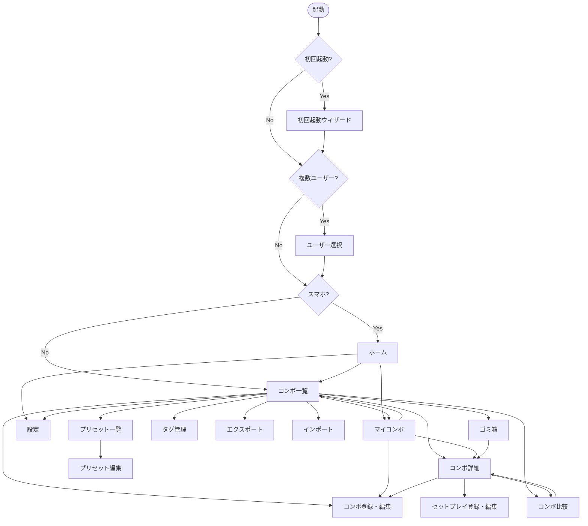

# 画面設計書

| 項目 | 内容 |
|------|------|
| 文書ID | DES-005 |
| バージョン | **2.125.0** |
| 作成日 | 2026-04-10 |
| ステータス | **★★2026-09-19 改訂（`CHANGE-219` 反映・`D-897`）**：**★★★§5.7 の `opponent_size` 行へ「先頭に不問の選択肢を持ち、保存値は `NULL`」を明記した。⇒ 値域の正本は `SUPP-001` §3.2 である。★実装は 1 行も変えていない。** **★★★あわせてボタン化の線引きの数え方を「不問込みのボタン数」へ統一した**〔始動位置 8 ／ 相手の状態 4〔不問は列挙値 `any` で 4 値の内側〕／ ヒット種別 8〔不問を持たない〕／ 相手の大きさ 5〕**。⇒ 「相手の大きさ 4 だが実装は 5」の非対称は解消した。★4 軸とも上限 10 の内側である。** 以下は前版の記述： **★★★2026-09-18 改訂②（`CHANGE-217` 反映・`M38-01`・`D-896`）**：**★★★§5.7 の as-built を 6 点差し替えた**〔(1) 必須の印は先頭 2 欄だけ・「上にあるものが必須」は成立しない ／ (2)「不問」は空欄そのもの・トグルは撤回 ／ (3) 運び量を相手の大きさの下へ・始動技の表示を削除 ／ (4) `hit_type` の既定は「通常」・中立の選択肢は新規では出ない ／ (5) 矢印キーはフォーカス移動・適用範囲はスピナー撤去より狭い ／ (6) ヒット種別のボタン数 8 が実装と一致した〕**。★保存される値は始動技も含めて 1 バイトも変わっていない。** 以下は前版の記述： **★★★2026-09-18 改訂（`CHANGE-214` ＋ `CHANGE-215` 反映・`M38-02`・`D-895`）**：**★★★`CHANGE-214`＝技編集**〔§5.18・画面18〕**の導線を除去した。⇒ どこにも導線を持たず、URL 直打ちでのみ到達する。★あわせて §3 の注記から「設定配下へ配置する」を撤回し、「主要ナビに含めない」だけを残した**〔**★as-built ＝ 設定配下への配置は一度も実装されていなかった**〕**。★§5.16 へ as-built を明記。** **★★★`CHANGE-215`＝「引っ越し取込」→「他から引っ越し」の 2 度目の改名。⇒ §2 行19 ／ §5.14 連携口 ／ §5.19 節見出し ／ §5.19 性質欄 ／ 「入力面」の定義の 5 面。★`DES-003` `setup_only` 列の説明も同時に直した。★★あわせて §5.19 へ「表示語の正本はコードである」を明文化した**〔**`ja.json` にキーが 0 件であり、改名担当が空振りした**〕**。** 以下は前版の記述： **★★2026-09-15 改訂（`CHANGE-210` ＋ `CHANGE-211` 反映・`M32-02`・`D-885`）**：**★★§5.14 の節名を「インポート」→「取込(CSV)」へ**〔**`M24-07` で退けた語が設計書にだけ残っていた。★§2 の画面一覧は `CHANGE-147` で改名済みであり片側だけが古かった**〕**。★★★機械で捕まらない＝`retired-words.test.ts` は `web/src` だけを走査し `docs/` を 1 バイトも見ない。** **★★§5.13a の `CHANGE-165` 注記へ書き足した＝〔　〕内は*省略表現*である。⇒ 上限が無いのは「セットプレイの行数」と「バイト数」であって、コンボの行数ではない。★実装は書き出しも 1000 件で打ち切る。★見落としではない根拠は同じ `CHANGE-165` の中に在る**〔`X-Export-Truncated` を同時に新設しており、切り捨てを前提にしている〕**。★同じ逐語がコード注釈にも在り、そちらの是正は実装の手番である。** **★スキーマ変更 0・マイグレ消費 0。** 以下は前版の記述： **★★2026-09-14 改訂②（`CHANGE-209` 反映・`M37-07`・`D-881`）**：**★★§5.7 の状況の欄へ「持続当て（始動技）」を追加**〔ヒット種別の隣・2 値〕**／ §5.6 の `<dl>` へ 5 項目目 ／ §5.4 のフィルタへ 1 軸**〔3 状態 `<select>`〕**。** **★★★表示語は「持続当て（始動技）」である。⇒ 設計卓案の「持続当て（始動）」ではない。★1 文字多い。** **★一覧の*列*は増えていない**〔`ColumnVisibility` は 9 のまま〕**。★step の modifier「持続当て」は 1 文字も変えていない。** **★スキーマ変更 0。** 以下は前版の記述： **★★2026-09-14 改訂②（`CHANGE-205` 反映・`M37-04`・`D-877`）**：**★★§5.20 の走査規則へ 1 段足した**〔群 B の 109 行は `startup` ではなく `first_hit_startup` で判定する〕**。★★★述語は 4 条件である**——**`startup_basis='standalone'` を落とすと `through` の 4 行まで除外され、偽陰性の歯止めが成立しない。** **★★★本画面の「発生」は*判定に使った発生*であり、技一覧の `moves.startup` とは食い違って見える。⇒ 意図した形である**〔確定反撃に要るのは初段の発生〕**。★画面*内*では食い違わない。★★2026-09-14 に 106 行が投入されたため、この食い違いは既に起きている。** **★除外を利用者へ見せる表現は持たせていない**〔一時状態であるため〕**。★API 経路の新設 0・スキーマ変更 0。** 以下は前版の記述： **★★2026-09-14 改訂（`CHANGE-203` 反映・`M37-06`・`D-876`）**：**★★§5.4 へレシピ表示の修飾のバッジ化を書いた**〔§5.6 / §5.8 / §5.7 のセットプレイ面も同じ部品を通る〕**。⇒ 描画は `[修飾] 技` の順であり、サーバ文字列 `技 {修飾}` とは逆である。** **★★★波括弧は廃止していない**（`D-867`）**——ホバー・エクスポート・コピーは生文字列のままである。** **★★追加のクエリを 1 本も発行せず `recipe_cache` の形式も変えていない。⇒ `DES-002` §4.11 には触れていない。★未知の `{…}` はバッジにしない**〔表示語の埋め忘れを隠さないため〕**。** **★★★修飾の位置は面によって違い、それは*意図した非対称*である**〔読む面は技の左 ／ 操作する面は行の右端〕**。⇒ 揃えにいかないこと。** **★API 経路の新設 0・スキーマ変更 0・マイグレ消費 0。** 以下は前版の記述： **★★2026-09-13 改訂④（`CHANGE-200` 反映・`M37-05`・`D-871`）**：**★★§5.7 へ「画面が保存より前に代表値を入れる」を書いた。⇒ サーバ側も同じ補完を行うため保存結果は同じだが、利用者には「消したのに生えてきた」と映るためである。** **★★入力部品の props の凍結を 6 → 7 へ緩めた**〔`onBlur` の口〕**。⇒ 開発者裁定済み。★ソース走査の層は 1 文字も変えていない。★★運び量の呼び出しには渡していないため、「運び量が埋まらない」ことが構造として保証される**——**緩和の前より強い。** **★API 経路の新設 0・スキーマ変更 0・マイグレ消費 0。** 以下は前版の記述： **★★2026-09-13 改訂③（`CHANGE-199` 反映・`M37-02`・`D-867`）**：**★★§6.4.3 へ告知の*表示回数*を書いた**〔初回のみ自動表示 ／ 明示操作で開く ／ 既読はブラウザ保持 ／ 2 面共有 ／ **文言は不変**〕**。⇒ 同節は表示回数の規定を持っていなかった。★型は §5.9 の「制約の告知」と同一である。** **★★§6.4 へ仮想コントローラの配置 8 点。★★★縦に最も効いたのは*寸法*ではない**——**一覧への高さ上限**（`O(件数)` → `O(1)`）**と、見出しの技名補間の撤去**〔右カラムで 4 行に折り返し見出し 2 本で約 128px〕**である。** **★上限は固定寸法で置く**〔`vh` はモバイルの URL バー開閉で伸縮し、ボタンが指の下で動く〕**。** **★§6.8 へ「走査に使う接頭辞の下へ非ボタン要素を置かない」。★API 経路の新設 0・スキーマ変更 0・マイグレ消費 0。** 以下は前版の記述： **★★2026-09-13 改訂②（`CHANGE-197` / `CHANGE-198` 反映・`M37-03`・`D-866`）**：**★★§5.15 へゴミ箱の並び順を*追記*した**〔コンボ・セットプレイとも `deleted_at` 降順・副次キー `id` 降順〕**。★着手前は並び順を一言も規定しておらず、同じ画面の 2 つの表が食い違っていた。⇒ 「書いていない」は「どちらでもよい」ではなかった。** **★★★§5.7 の `hit_type` は値の列挙をやめ、正本**（`SUPP-001` §3.2）**への参照へ落とした。⇒ 旧記述「選択肢は 4 値」は失効していた。★直すのではなく列挙をやめた**——**4 書がそれぞれ列挙している限り、追加のたびに拾い切れない**〔`CHANGE-082` と `CHANGE-151` の 2 回とも漏れた〕**。** **★表示ラベルの正典は画面設計の事実なので残す。★スキーマ変更 0・マイグレ消費 0。** 以下は前版の記述： **★★2026-09-13 改訂（`CHANGE-196` 反映・`M37-01`・`D-863`）**：**★★§5.7 へ運び量・始動位置の入力 UI の as-built を書いた＝方式を選んでから 1 欄だけ描く。★`D-730` の「3 つで連動する」を改訂した。** **★★★連動が消えたのではない**——**保存される値はマス数 1 本のままであり、方式を切り替えると同じ値が別の単位で見える。⇒ 「3 つの欄が追随する」ではなく「1 本の値が 3 通りに見える」である。** **★値域外は入力段でクランプする**〔開発者の実機確認による。**zod と `VAL-RANGE` の防衛線は残す**〕**。★入力方式は保持しない**〔保持すると台帳へのキー追加になる〕**。** **★§5.6 へ詳細の 2 か所**〔始動位置への `80 マス (50%)` の後置 ／ 運び量の行〕**。★スキーマ変更 0・マイグレ消費 0。** 以下は前版の記述： **★★2026-09-12 改訂⑥（CHANGE-189 反映・`M31-06`・`D-837`）**：**★★★§6 の 2 つの表が失効していたので是正した＝入力面の除外の適用点が `unclassified` 分岐から*母集団*へ移った。⇒ 8 タブすべてに効く。** **★「押し下げ」ではなく「引き上げ」を採った**——**押し下げると判定が 7 か所へ散り、しかもバケットを持たない 2 タブ**〔通常技・必殺技〕**には効かない。** **★★8 タブの母集団表の「（不変）」「そのもの」はすべて「その述語 ∧ 非除外（面）」である。** **★★除外の理由が 2 つになり、面を持つようになった**〔静的 code＝両面 ／ `setup_only`＝コンボ側だけ〕**。⇒ §5.9 へ「同じ部品だが同じ母集団ではない」を書いた。★機構は 1 本のまま。** 以下は前版の記述： **★★2026-09-12 改訂⑤（CHANGE-188 反映・`M30-05`・`D-835`）**：**★★★§6.1 へファミリー行の表示名から強度語を落とす規則 3 形を書いた**〔接頭 ／ 末尾 ／ **先頭装飾の直後**〕**。⇒ 装飾そのものは残す**（開発者の実機確認で確定）**。** **★★丸括弧の中は見ない。⇒ 実データでは強度語の意味が位置で割れており**〔先頭装飾の直後＝その技自身 23 行 ／ 丸括弧の中＝派生元 22 行〕**、落とすと派生元が消える。** **★残る課題 2 つ＝代表名が 1 メンバーの名前そのものになる 4 行**（`M30-06`）**／【ジャスト】の命名の揺れ**（`P-56`）**。** 以下は前版の記述： **★★2026-09-12 改訂④（CHANGE-187 反映・`M34-02`・`D-834`）**：**★§5.16 へ `/settings?qr=1` を書いた＝トレイの「設定画面をブラウザで開く」が開く URL であり、QR モーダルを初期表示する。** **★フロントのルート契約であり API 経路ではない。★LAN 共有 OFF のときは何も出ない**（非描画。`M22-06` の踏襲）**。** 以下は前版の記述： **★★2026-09-12 改訂③（CHANGE-186 反映・`M26-05`・`D-833`）**：**★★★§5.1 の「先行反映である」の但し書きを外し、as-built として確定した。** **★★Step 5 の要件へ 5 を追加＝読み上げ環境にも届くこと**（`M26-05` §2-1 を受理。**★届かない警告は「告げる」を満たしていない**）**。** **★★Step 5 / Step 7 の as-built を書いた＝同意は段内の 2 ビュー切替**（ダイアログを入れ子にしない）**／ `lanHint` は残す ／ i18n は「ON にする」を含む文面だけ共有しない。** **★同意ビューで段の「戻る」を出さないのは*本段だけの例外*であり、一般則にはしない**（n=1）**。★段数・`totalSteps` は不変。** 以下は前版の記述： **★★2026-09-12 改訂②（CHANGE-185 反映・`M26-05`・`D-826`）**：**★★★§5.1 へ「Step 5 の要件」を新設し、「Step 7 の要件」へ 6 を足した。⇒ ウィザードから LAN を有効にする経路に、警告と明示的な同意が要る。** **★★本節は先行反映である**（実装前に書いた）**。⇒ `M26-05` の完了までは「あるべき姿」であり as-built ではない。** **★★★穴の形＝`DES-002` §8 は経路を限定していないのに、本節が警告・同意を要件に持っていなかった。⇒ 設定画面だけに実装され、新規ユーザーが通るウィザードが無防備だった。** **★`D-396`**（パスワードを必須にしない）**には抵触しない——同意チェックは詰みを作らない。** **★段数・`totalSteps` は不変**（8 段 ／ LAN 無効時 6 段）**。** 以下は前版の記述： **★★2026-09-12 改訂（CHANGE-184 反映・`M30-04`・`D-825`）**：**★★★§6.1 へ必殺技ファミリー行の並び順規則 4 項を新設した**〔derived は末尾へ ／ 群内順は不変 ／ 件数保存（**372 中 178 が末尾**）／ **見た目の区別は設けない**〕**。★着手前の並びは規則ではなく副産物であった。** **★★★判定は AND である**（属する move が*すべて* true のときだけ）**。⇒ OR にすると「素が押せるのに末尾に居る」形が 5 件できる。** **★残った課題は「末尾群の*中*の順序」である**（`is_derived` は 1 ビットで優劣を持てない）**。** 以下は前版の記述： **★★第118版（2026-09-10・CHANGE-179 反映：`M30-03`・`D-813`）**：**★★★第6節へ「未分類タブの母集団から `category='special'` が消えた」を記載した**〔実測 0 件 ／ ファミリー行 342 → **372** ／ **★座標一致テスト 1 本がこの結合を守っている**〕**。★タブ構成 8 枚は不変・スキーマ変更 0・マイグレ 0。** 以下は前版の記述： **★★第117版（2026-09-10・CHANGE-176 反映：`M31-04`・`D-810`）**：**★★★§5.20 へ「走査の 4 つのふるい」と「ガード種ごとの除外」を新規記載した**〔**★「データが無いので走査に出ない」は成り立たない**〕**。★あわせて第6節へ「未分類 ＝ 裏返し ∧ 非除外」を記載した**（**`CHANGE-170` §2.4 の等式が崩れた**）**。★スキーマ変更 0・マイグレは `000109` を消費**（`M31-04`）**。** 以下は前版の記述： **★★第116版（2026-09-09・CHANGE-175 反映：`M30-02`・`D-799`）**：**★★★§5.7 へ 3 ブロックを新設した**〔**(1) 必殺技タブが「基底 × 変種 × 強度」の 3 軸になった ／ (2) OD 強度組合せに活性条件が付いた ／ (3) 通常技タブが横並びになった**〕**。** **★★`CHANGE-166` の帰結文は `A1` 186 件について失効した**（**`A2` 105 件については不変。★`M30-03` が扱う**）**。⇒ 「`_od` だけが押せる形」が 95 → 0 件。★未分類が 330 → 144。** **★★★ただし逆向きの非対称が 7 組できた**（**素は押せるが OD が押せない**）**。⇒ 入力手段は 1 つも消えていない。★`M30-03` が閉じる。** **★★★OD 強度組合せは着手時点、そのステップの move が OD かを一切見ていなかった**（**しゃがみ弱 P にも「OD(弱中)」を付けられた**）**。⇒ 是正である。★末尾の `_od` だけを見ると 37 行が入力できなくなる。** **★通常技タブはボタンの大きさ不変・縦が約半分・Tab 順が変わる。★方向ラベルは現行維持。** **★スキーマ変更 0・新規依存 0・API 契約の変更 0**（`internal/api/` / `internal/service/` / `cmd/` の差分 0 バイト）**。★マイグレ 1 本**（`000107`＝`terry` の `move_code` 是正）**。** 以下は前版の記述： **第115版（2026-09-09・CHANGE-174 反映：`M31-03`・`D-796`）**：**★★§5.4 の 6 件を是正した。⇒ いずれも「実装が変わったのに記述が旧のまま」の型であり、テストも `tsc` も緑になるため人が読む以外に検出経路が無い。** **★★★最も重いのは「始動状況」という存在しない列名である**——**`M27-03` 以降 3 列**（ヒット種別 / 始動位置 / 相手の状態）**になっているのに、設計書は 3 か所でその名を使い続けていた。⇒ 読んだ担当は無い列を探すことになる。** **★★列の並びは案 C で確定**（開発者が段 3 のモックを見て選んだ）**＝展開アイコン → ルート → ダメージ → ヒット種別 → 始動位置 → 相手の状態 → タグ → 登録状態 → 備考 → セットプレイ数。** **★★ルート列は詳細へのリンクになった。⇒ タップは遷移であり、全文はホバー**（`title`）**のみ。★アクション欄とレスポンシブ欄は同型であり、片方だけ直すと残る。** **★「ステータス」列を明記した**（**元から書かれていなかった。`M31-03` が作った差ではない**）**。** **★スキーマ変更 0・マイグレ消費 0・新規依存 0・`internal/` の差分 0 バイト。** 以下は前版の記述： **第114版（2026-09-09・CHANGE-172 反映：`M35-01`・`D-794`）**：**★★§5.12 へ 2 行を足した。** **★(1) 削除は一覧の使用件数を見て `force` を先に付けるため、`409 tag_in_use` は UI から通らない。⇒ 同エラーは API の契約としてのみ存在する。★開発者判断で現状維持**（2026-09-09）**。** **★(2) カテゴリ・色は本画面から未設定へ戻せない**（`DES-006` §5）**。⇒ 欠陥ではなく仕様である。** **★画面・文言は 1 文字も変えていない**（`M35-01` は DOM も i18n も不変）**。★スキーマ変更 0・マイグレ消費 0・新規依存 0。**  以下は前版の記述： **第113版（2026-09-08・CHANGE-170 反映：`M30-01`・`D-782`）**：**★★第6節の仮想コントローラのカテゴリタブを 8 枚の as-built へ書き換えた。⇒ 旧記述の 7 分類は失効した。** **★新設 4 枚＝ターゲットコンボ ／ 未分類 ／ キャラ固有状態 ／ 共通技**（**一番右**）**。★共通技は常設行からの移設であり、常設行は削除ボタンだけになった。** **★★「未分類」は 1 本の述語の裏返しである。⇒ 規則を 2 か所へ書かない。** **★★移動系 7 code**（217 行）**はどの面にも出ていなかった。⇒ 本サブで初めて入力可能になった。** **★`SM-100` のトグル「タブに分類済みの技を省く」を追加**（既定 OFF・永続化なし・2 面）**。★`CHANGE-166` の帰結文 1 行が失効した。** **★スキーマ変更 0・マイグレ消費 0・新規依存 0・`internal/` の差分 0 バイト。** 以下は前版の記述： **第112版（2026-09-08・CHANGE-168 反映：`M31-01`・`D-781`）**：**★★§5.21 の第 3 セクションの内側を ①反撃に転用可能 / ②再利用可能 へ割った。★骨格は壊していない**（開発者が承認した案 A）**。** **★★「PC 版が既にある」ぶんは折りたたんだ別枠へ回し、その行の「確定反撃の採用を解除」だけは押せる形にした。⇒ 開発者の逐語「そもそも出さない」からずらしてある。★理由＝丸ごと外すと、その行の唯一の解除手段が画面から消えるためである。** **★§4.3.1 の解決順を通る面が 4 面 → 6 面**（確定反撃の 2 画面が加わった。**自キャラのみ。相手は空のまま**）**。** **★§5.7 と §5.15 の断定を補正した**——**「論理削除しても紐付けは保たれる」は既定では真だが、削除ダイアログの任意チェック**（既定 OFF）**を入れたときだけ 1 操作で外れ、復元しても戻らない。** **★スキーマ変更 0・マイグレ消費 0・新規依存 0。** 以下は前版の記述： **第111版（2026-09-08・CHANGE-167 反映：`M31-02`・`D-779`）**：**★★§4.3 へ「ドラッグによる文字選択」を 1 ブロック足した。⇒ popover の中に検索欄を持つ選択部品は、マウスでのドラッグによる文字選択を支える。★タッチ・ペンの挙動は変えない。** **★★as-built の追認のみである。⇒ 実装は既にそうなっており、契約の側を追いつかせた。** **★★書いた理由＝書かないと後任が「入力種別で分岐しているのは統一漏れだ」と読んで揃えに行くためである**（先例＝`D-694` §1-1）**。** **★★部品名で書いていない**——**起票時の見立ては 1 部品だったが、開発者が実機で確認して `TagSelector` にも同じ欠陥を見つけ、射程が広がった。⇒ 部品名で書くと 3 つめが増えた日に落ちる。** **★スキーマ変更 0・マイグレ消費 0・新規依存 0・新規 test-id 0・`internal/` の差分 0 バイト。** 以下は前版の記述： **第110版（2026-09-07・CHANGE-166 反映：`M28-05`・`D-771`）**：**★★必殺技クイック入力へ「ファミリー UI に載らない必殺技が在る」を明文化した**〔強度接尾辞を持たない `move_code`。実例＝`sonic_break` / `quick_burn`〕**。★意図された設計であり退行ではない。** 以下は前版の記述： **★★第109版（2026-09-07・CHANGE-165 反映：`M29-02`〔入出力〕・`D-770`）**：**★★§5.13a へ「上限に当たったら件数を示して選ばせる」と、件数表示の出どころが `count` から `total` へ替わったことを書いた。** **★★`ノックダウン` → `有利フレーム` の追随は不要だった**——**設計書 2 冊とも残存 0 件であり、`CHANGE-161` で既に統一済みだった**（設計卓の実測）**。⇒ 製造の依頼「残っていれば追随してほしい」への答えである。** 以下は前版の記述： **★★第108版（2026-09-07・CHANGE-164 反映：`M28-02c`・`D-769`）**：**★★§5.19b と §5.6 から「未実装」を外した。★§5.19b へ 3 件＝行アクションは 詳細 / 編集 / 削除**（**コピーは出さない**）**／ 上限 1000 件と打ち切りの出し方 ／ 保存後の戻り先の限界。** 以下は前版の記述： **★第107版（2026-09-06・CHANGE-163 反映：`M28-04`・`D-759`）**：**★★§5.20 へ「飛び道具の除外は相手技側だけであり、始動技側には無い」を新設した**〔**as-built を正とする。⇒ 始動技側に除外を入れない。★理由＝除外の根拠は有利フレームを算出する側の理屈であり、始動技側が使う `startup` には当たらない**〕**。★書いておかないと次の担当が「除外し忘れ」として起票する。** 以下は前版の記述： **★★第106版（2026-09-06・CHANGE-162 反映：`M28-02b`〔影響コンボの画面・設計まで〕・`D-758`）**：**★★§5.19b を新設した**〔専用画面 `/game-update/combos`。**★未実装。`M28-02c` が作る**〕**。★既存の `ComboTable` を表そのものとして再利用し、足す 3 列は表示列カスタマイズの対象にしない。** **★★告知のマウント先は `HomePage` ＋ `ComboListPage` の 2 か所である**〔**640px 以上では `HomePage` が描画されないため、移行告知と同型にすると主動線が PC で丸ごと消える**〕**。** **★★印を出すのはコンボ詳細だけである**（開発者確定）**。★画面の語＝「更新未確認」/「問題なし」。API 名は変えていない。** **★§5.6 へ前提バージョンの 1 行**〔**出る面は 2 つ。エクスポートへは出さない**〕**。** **★§5.20 / §5.21 の「不採用」の記述を as-built へ是正した。** 以下は前版の記述： **★★第105版（2026-09-06・CHANGE-161 反映：`M29-01`〔語彙・ラベルの統一〕・`D-756`）**：**★★§5.7 の手前へ「画面に出す語の正典（4 群）」を新設した**〔**相手の状態 / 相手の大きさ ／ `SAゲージ`（詰め形）／ コピー ／ 空レシピは 2 語**〕**。★退けた語は `retired-words.test.ts` に登録済みで、戻ると赤になる。** **★SA 始動欄の注記を `(0〜3)` → `(0〜3本)` へ。⇒ 同じ SA ゲージの表記が 1 つになった。★ドライブ消費の注記は `D-582` の裁定どおり空のままであり、揃えていない**〔`REAL` で小数が入りうるため本数表記が正しくない〕**。** **★重複警告の例示 2 か所を実装へ追随**〔`消費 SA` → `SAゲージ消費` ／ `ポジション` → `始動位置`〕**。** 以下は前版の記述： **★★第104版（2026-09-06・CHANGE-159 反映：`M28-02a`〔始動位置・運び量〕・`D-748`）**：**★★§5.7 の `position` を 5 値 → 7 値へ**〔`mid_self`「自分中央寄り」／ `mid_opponent`「相手中央寄り」を挿入〕**。区分表・マス・代表値をここへ置いた。** **★★欄の呼び名を「ポジション」から「始動位置」へ**〔詳細・比較・エディタ・一覧フィルタの 4 面で揃える。**★比較画面には対象の文字列が無いため対象外**〕**。** **★★値域と表示順は別物である**〔**値域は 2 つ増えただけだが、表示順では末尾 2 値の順序も入れ替わった**＝計測点 `M-130`〕**。** **★★副作用＝数字キーの割当が動いた**〔画面中央 2 → 5 ／ 自分画面端 3 → 2 ／ 相手画面端 5 → 8。**開発者が「問題なし」と確認済み**〕**。★ボタン数は 8 で上限 10 の内側。** 以下は前版の記述： **第103版（2026-09-05・CHANGE-153 反映：M27-02b〔入力仕様の 3 状態〕・`D-704`）**：**★★§5.7 へ (1) 必須・任意の印の規則 (2)「起き攻めを調べた」トグル (3)「コンボ開始時」の注記を追加した。★§5.6 へ「調べたか」の印を追加した**〔**行の有無によらず常に出す**〕**。★§5.5（一覧）・§5.8（比較）・§5.13（出力）は不変。★`M24-12` の入力設計も不変。** 以下は前版の記述： **第102版（2026-09-03・CHANGE-152 反映：M27-02a〔届かないものを届かせる〕・`D-694`）**：**★§5.7 へタブ見出しのエラーバッジの振り分け表を新設**〔`D-593` の as-built。**`setups[*]` はレシピタブ**〕。**★★「編集モードで `setups[*]` の ERROR が出うるか」＝出ない**——**同梱セットプレイの欄は新規作成とコピーでのみ描画されるため。⇒ 前方一致の追加で足りた。** **★`tabOfIssueField` が許可リストであり、未知の入れ子 field は黙って基本情報へ落ちることを明記。** **★§5.7 へタグ欄のキーボード操作を新設**〔**★★複数選択＝`Enter` は選んで開いたまま ／ 単一選択＝選んで閉じる。同じ部品群で意味が違うことを併記した**——**書かないと「不統一」と読まれる**〕。**★スキーマ変更 0。** 以下は前版の記述： **第101版（2026-09-02・CHANGE-151 反映：M27-01〔ヒット種別 8 値化 ＋ 相手の大きさ 4 区分化〕・`D-687`）**：**★§5.7 のヒット種別（4）→（8）／相手の大きさ（3）→（4）**〔**★8 は上限 10 に対して残り 2 である。次に足すときは上限に当たるかを先に確かめること**〕**／ ★相手の大きさへ info-mark を明文化**〔「この区分で表現できない場合は、タグかメモを使ってください。」〕**／ 順送り契約の Popover 規定が基本情報タブにも掛かることと DOM 順の注意を追記 ／ 重複メッセージの例示を「中」→「標準」へ ／ ★★確定反撃 第3セクションの述語を「値の列挙」から「否定形」へ書き直した**〔**旧記述は実装（`!punishHitTypes[...]`）と食い違っており、値を足すたびに構造的に失効する形だった。★設計書の述語は実装の形に合わせて書く**〕。**★スキーマ変更 0。** 以下は前版の記述： **第100版（2026-08-31・CHANGE-148 反映：M24-08〔`queryKey` の統一 ＋ M24 の繰越 4 件〕・D-620 / D-623）**：**★★§5.16 の「レシピキャッシュ再構築ボタン（進捗表示付き、中断耐性あり）」のうち「中断耐性あり」を撤回し、「進捗表示付き」を as-built へ改めた**〔**D-620**。**再構築は冪等であり、途中で閉じてももう一度押せば足りる**〕。 **★★§5.15 へゴミ箱のキャラ選択の as-built を追記した**〔**★1 つのセレクタがコンボの表とセットプレイの表の両方を支配する**〕。 **★§5.7 へ重複警告の as-built を追記した**〔**★BE の応答は 1 バイトも増やしていない。★差が出うるのは判定に使わない 7 項目だけである**〕。 **★§5.7 の競合の表 5 行目**〔`D-415`〕**へ射程の確定を 1 行足した**（**D-622**）。 **★§5.16 の `USERS_KEY` の記述を是正した**〔`M24-08` の `queryKey` 統一で当該 const は消えた〕。 以下は前版の記述： **第99版（2026-08-30・CHANGE-147 反映：M24-07〔用語・i18n・内部値露出の最終 sweep〕・D-618）**：**★★§5.4 のトグルの軸を「省略/全文」から「1 行にまとめる ／ ステップごとに改行した縦表示」へ決め直した**〔ラベル「レシピを縦に表示」。**★旧記述は 5 面のうち 4 面でしか成立していなかった**〕。**★★画面名を 2 つ改名した**〔画面一覧 row 14「インポート」→「取込(CSV)」／ row 19・§5.19 見出し・§5.14 連携口「取込ヘルパー」→「引っ越し取込」。**★`SM-110` の語彙統一＝開発者裁定**〕。 以下は前版の記述： **第98版（2026-08-30・CHANGE-144 / CHANGE-146 反映：M24-06〔取込・出力の UX〕・D-605 / D-607）**：**★★§5.13（エクスポート画面）を廃止した**〔`SM-072` の第 2 段。**★出力の入口はダイアログ 1 本。★失われた機能 2 件と、本節にしか無かった欠陥 1 件を記録した**〕。**★★§5.13a へファイル名欄を足した**〔書式・「対象の種別」の決め方・同一秒の連番・採り直しの条件・ZIP エントリ名へ及ぼさないこと〕。**★§5.16 のデータ節へ、手動バックアップ／リストアの 2 ボタンが紐づく要件は `NFR201` であり `FR401` ではないことを明記した**（`CHANGE-146`）。 以下は前版の記述： **第97版（2026-08-30・CHANGE-140 反映：M24-05〔セットプレイ導線・紐付け UI 統合〕・D-604）**：**★★§5.6 項目11 の「候補が0件の場合は本セクション自体を非表示」を失効させた**〔**0 件でも見出しと「候補はありません」を出す**。`D-588`〕。**★★`LinkExistingSetupModal`（詳細画面の「既存から紐付け」）は撤去した。⇒ 「将来的に UI 統合を検討する余地がある」は決着済みである**〔**統合ではなく詳細側の廃止**〕。**★★§5.6「セットプレイ編集画面は実装しない」の曖昧さを是正した**〔**禁じているのは成立条件の入力面だけであり、画面そのものは存在する**〕。**★★§5.9.1 / §5.9.2 を新設した**〔**`SM-011` コピーの as-built ＋ コピー直後に無変更で保存すると `VAL-S04` で止まること ／ `SM-088` の自動命名の実測。★設計卓の暫定案とは一致しなかったため実装側を正とした**〕。**★★§5.4 へ as-built の非対称を記録した**〔**「通常は末尾省略」は 5 面のうち 4 面でしか成立していない。コンボ詳細だけ OFF でも全部読める。⇒ 語彙の決め直しは `M24-07`**〕。**★スキーマ変更 0・マイグレ消費 0・新規依存 0・`internal/` の差分 0 バイト。** 以下は前版の記述： **第96版（2026-08-29・CHANGE-139 反映：M24-13〔仮登録のレシピ必須化 ＋ `VAL-S04` の是正〕・D-593）**：**★★§5.7 へ「レシピが空のとき保存できない理由の見せ方」を新設した**〔**ボタンは消さず `disabled` ＋ 理由 ／ ★理由の側を順送りの停止点にする**——**`disabled` なボタンはフォーカスを受けないため** ／ **条件は `steps.length` だけでタブにも仮登録トグルにも依存しない**〕。 **★★仮登録トグルのラベルを改めた**——**新＝`仮登録として保存(重複コンボの登録等を許容)`。「レシピ未入力」を落とした**〔**落とさないと同じ画面の上下で正反対のことを言う**〕。**★「2 つの版で同一」は正典 1 本の規律であって文字列の凍結ではない。** **★スキーマ変更 0・マイグレ消費 0・新規依存 0。** 以下は前版の記述： **第95版（2026-08-29・CHANGE-138 反映：M24-12〔エディタの作り替え〕・D-586）**：**★★§5.7 の失効 14 か所を as-built へ改めた**〔**プルダウン 4 欄 → ボタン群 ／ `hit_type` の非活性 → ボタン全数 `disabled` ／ 起き攻め → ボタン群の複数選択 ／ 縦圧縮の前提 ／ 2 カラム（PC）の撤去 ／ レスポンシブの横並び ／ ★`CHANGE-068` のメディア欄の位置指定 ／ 仮登録トグルの編集モード末尾（撤回＝`D-582`） ／ `type=flag` の Switch（撤回＝`D-583`） ／ `step=0.5` と 0.5 刻み ／ ラベル表 2 行 ／ 「入力の作法は書く」の規則 ／ 整数ステッパー**〕。 " |
"**★★新設 4 ブロック**——**入力面は幅によらず 2 タブ ／ ボタン化の線引き（10 以下・根拠は数字キーが 10 個） ／ キーボードの順送りの契約 ／ タグ欄は順送りで到達したときだけ開く。** "
"**★★あわせて `CHANGE-137` の 3 ブロックの置き場所を是正した**——**同ブロックは §5.7 ではなく §5.6 の末尾に置かれていた**（**★同一の文字列が 2 つの節に在り、最初の出現に当たった**＝計測点 `M-92`）。 "
"**★スキーマ変更 0・マイグレ消費 0・新規依存 0・`internal/` の差分 0 バイト。** 以下は前版の記述： **第94版（2026-08-28・CHANGE-137 反映：M24-04〔エディタ操作・dirty state・入力事故の防止〕・D-579）**：**★★§5.7 へ 3 ブロックを新設した**——**(1) 入力面は「幅で役割が変わる」形である**〔**lg 未満＝2 タブ ／ lg 以上＝2 カラム ＋「メタデータを隠す」でレシピ側が全幅へ**。**★PC 幅でタブに割る形は採らなかった。理由は E2E の被害範囲である**〕 **／ (2) エラーの在り処をタブ見出しで示す**〔**リスト本体は保存ボタン直上に据え置き。★振り分けは添字付きの前方一致**——**BE は `steps[0].moveId`、FE は `steps.0.moveId` で基点も書式も違う**〕 **／ (3) 離脱ガード**〔**掛かる経路 4 つ ／ 保存の成功で dirty を落とす ／ ★★保存後の遷移も補正を通すこと ／ ★離脱の入口は「どこへ」か「戻る」かの形で受け取る**〕。 **★§5.7 項目5 のゲージ欄のラベルを as-built へ**〔**★上限をラベルに書くのは、その上限に根拠が説明できるときだけ**〕。**★レシピの区分名とトーストも as-built へ。** **★スキーマ変更 0・マイグレ消費 0・新規依存 0・`internal/` の差分 0 バイト。** 以下は前版の記述： **第93版（2026-08-27・CHANGE-134 反映：M24-03〔比較・詳細・レシピ可読性〕・D-572）**：**★★§5.4 の「ルート（レシピ文字列）」の 6 択を 1 つへ畳んだ**〔**6 番目「通常は末尾省略、トグルで全文表示モードへ切替」を採用。選択肢の列挙と「具体的な省略方式は実装フェーズで決定する」を削除した**——**残すと次に同じ不満が出たときにまた 6 つから選び直すことになる**〕。 **★★適用範囲は 5 面**〔一覧 ／ 詳細 ／ 比較 ／ 比較の追加モーダル ／ **`/mycombo`**〕——**★面の数え上げは「トグルを置いた面」ではなく「共通部品を使っている面」で行う。指示書は 4 面と定めていたが、共通部品を直した時点で 5 面目へ自動的に及んだ。** **★面ごとの既定**〔詳細のみ全文表示・他は末尾省略。開発者裁定〕**／ トグルは 1 つ ／ `localStorage` キー `recipe-full-view-v1`。** **★★「長いレシピで画面が崩れる」は再現しなかった**〔実測＝レシピ 5〜263 文字 × 画面幅 1280 / 768 / 390。**レシピを伸ばしても表の幅は変わらない**——`truncate` が効いて列幅が動かず、超過分は `overflow-x-auto` が吸収する。**⇒ 崩れの原因はレシピ長ではなく「列数 × 各列の最小幅」である**〕。 **★§5.4 へ「メモの 1 行目」と「表示項目の既定」を追加**〔**備考とセットプレイ数を既定 OFF。★列は撤去していない**——**表示列カスタマイズから戻せる。★既定は初回のみ効き、保存値を持つ環境では保存値が優先される**〕。 **★§5.6 項目6 のラベル生成規則にゲージ区分が必ず付くようになった**〔`"投げ重ね(その場受け身・ノーゲージ)"`。**正典の実体は `okiTechAndGaugeLabel()` であり、編集画面は `okiOptionLabel()` を経由しない**〕**／ §5.13 の出力にも及ぶ。** **★§5.8 へ キャラ名 ／ 詳細への導線 ／ 追加モーダルも同じ規則を通ること を追加。** **★スキーマ変更 0・マイグレ消費 0・新規依存 0・`internal/` の差分 0 バイト。** 以下は前版の記述： **第92版（2026-08-26・CHANGE-133 反映：M24-02〔フィルタ・タグ・キャラ選択〕）**：**§4.3 を全面改訂した**——**★★「コンボ一覧の絞り込みフィルタのみ native `<select>` を維持」を撤回した**〔**`CHANGE-130`・M24-01 がキャラ選択をフィルタ欄の外へ出した時点で「隣接フィルタ群との一貫性」という前提が消えていた**〕。**⇒ 全面が共通部品を通る。** **★部品の形を明記**〔`Popover` ＋ 検索 ＋ listbox の手組み。**`DropdownMenu` を使わない理由＝typeahead が検索欄の打鍵を奪う**〕。 **★★並び順を明記**——**`name_ja` 固定でロケールによって変えない。** **理由＝本部品は言語に関わらず `name_ja` を表示するためであり、表示している値と違う値で並べると利用者の目には無順序に見える**〔英語 UI で実際に起きた〕。 **★受容する挙動 2 つを不具合でないものとして固定した**〔漢字始まりは末尾 ／ ラテン文字始まりは仮名より前。**読み仮名の列が無いためであり、直すならスキーマ変更**〕。 **★「英語なら a〜z」は撤回した**〔ラベルが `ja` 固定であるあいだ目的を達成できない。`M24-07` へ送る〕。 **★§5.4 へフィルタ欄の as-built 9 点**〔タグフィルタのドロップダウン ／ 折りたたみ ／ **★閉じていても効いていることが分かるピル** ／ 書式 ／ 位置 ／ 3 分割とアクセシブル名 ／ ソートの別枠 ／ **新キー `combo-list-filters-collapsed-v1`** ／ 挙動の差分 1 件〕。 **★§5.12 へタグ管理の検索と件数**〔**0 件の 2 状態を区別する**〕。 **★スキーマ変更 0 列・マイグレ消費 1 本**〔`000079`＝キャラ表示名の是正。**DML**〕。 以下は前版の記述： **第91版（2026-08-25・CHANGE-130 反映：M24-01〔一覧・ナビ・既定キャラの配線〕）**：**§4.3.1 を新設し「対象キャラの解決順（5 段）」を 1 本にした**〔URL クエリ ＞ セッション ＞ `users.main_character_id` ＞ `config.toml [defaults]` ＞ 最終フォールバック定数。**★段 3a は未実装であり as-built 注記を併記**＝`D-545`〕。 **★★実装が決めた線を 2 つ書いた**〔**実在検査は段 3 系だけに掛ける**——段 1・段 2 に掛けると `?character=` の既存挙動が変わる ／ **キャラ一覧が未取得のあいだは検査をスキップして採用する**——**検査できないことを「不在」と読むと取得前に段 4 へ落ちて表示が飛ぶ**〕。 **★★「段 3 系の既定を書き換えたら段 2 の記憶（キャラのみ）を捨てる」を対で書いた**——**★順序を決めただけでは足りず、既定を変えても効かない穴が残っていた**〔2026-08-25 の開発者の実機確認で発見。**設定画面から既定キャラを変えたときも同じであり、実運用で普通に通る導線**〕。 **★§5.4 のヘッダ帯を改訂**〔**キャラ選択をフィルタ欄からヘッダ帯へ移し、兼務を明記する補足文を添えた。キャラ名の大見出しは撤去**。2026-08-25 開発者判断〕**＋「セットプレイ数」列を追加**〔列カスタマイズ対象・既定は表示・0 件も 0 表示・**マイコンボにも出る**〕。 **★§5.7 へ保存後の遷移先の表を新設**〔新規登録のみ一覧へ。編集・コピー・確定反撃復帰は不変〕。 **★★あわせて `INITIAL_CHARACTER_ID` の旧定義を 3 か所是正した**——**同定数は解決順の最終フォールバックであって「デフォルト表示キャラ」ではない**（§4.3 の部品表 ／ §5.7 ／ §5.9）。 **★スキーマ変更 0・マイグレ消費 0・`DES-002` §4.2 は射程外**（分岐 A＝サーバは既にセットプレイをバッチ供給していた）。 以下は前版の記述： **第90版（2026-08-24・CHANGE-141 追補反映：ダイアログ文面の逐語）**：**§5.15 の「登録の前に選ばせる」へ ja / en 11 キーの逐語を写した**〔**完了報告 §6 が正本**〕。**★キーはすべて新しい階層に置かれており、`M23-05` が置いた既存の文面には 1 文字も触れていない**〔回帰ガードと構造的に衝突しない〕。**既存階層へ足したのは名無しセットプレイの表示 1 件だけである。** **★第89版が保留にしていた 1 件が埋まった。** 以下は前版の記述： **第89版（2026-08-24・CHANGE-141 反映：M23-09〔登録前の重複ダイアログ〕）**：**§5.15 の「既知の限界」を撤去した**〔**★告げる場所を「保存の後」から「保存の前」へ移したため。`M23-05` の限界は本サブで解消した**〕**／ 「登録の前に選ばせる」を新設**〔**選択肢 3 つ** ／ **配置の規律 4 点**——**とくに「消えることを、押す前に伝える」**〔復元ボタンの直上に常時表示。**押した後ではない**〕 ／ **該当複数なら既定選択なしで選ばせ、名前が無い行も必ず出す** ／ **件数上限を掛けない**〔警告の `details` とは用途が違う〕 ／ **★WARNING でモーダルは §11.1 からの逸脱ではない**〔区別は severity ではなく「警告の表示」か「操作の分岐」か〕 ／ **仮登録では出さない** ／ **★既知の限界 1 件＝生きた重複と同居するとき「新しく作る」は `VAL-C02` で必ず落ちる**〕。**★文面の逐語（ja/en 11 キー）は完了報告 §6 の到着待ちである**（**D-532**）。**★スキーマ変更 0・マイグレ消費 0。** 以下は前版の記述： **第88版（2026-08-23・CHANGE-128 反映：M23-07〔ゴミ箱の未達の導線〕）**：**§5.15 の未達 3 件をすべて as-built へ畳んだ**〔**(c) 行クリック 404** ＝遷移先は **`/trash/combos/:id`**〔API の `GET /api/combos/{id}/deleted` とはわざと別の形である〕 ／ **`CHANGE-122` 既知の制約 3〔ゴミ箱へセットプレイを入れる導線が無い〕** ＝コンボ詳細のセットプレイカードへ「ゴミ箱へ移動」を配置 ／ **一括操作バーの置き場** ＝画面下部の sticky。**★装飾は当のコンポーネント自身に持たせる**〔`null` を返す間もラッパの枠だけが残るため〕〕**／ ★★`D-485`〔画面は参照元コンボの専用の一覧を出さない〕を撤回した**〔**拒否されたあとに紐付けを解除する導線が無く、利用者が詰んでいた**。**応答が既に持つ `details.combos` だけを使い、新しい API もデータ取得も足していない**〕**／ §5.6 項目 10 へ「ゴミ箱へ移動」を追記**〔**★コンボの削除と混ざらないための守りを 5 点、同項へ明記した**〕**／ ゴミ箱画面の日本語直書きを全数 i18n 化**〔**22 リテラル / 5 ファイル**〕。**★スキーマ変更 0・マイグレ消費 0。** 以下は前版の記述： **第87版（2026-08-23・CHANGE-127 反映：M23-06〔ゴミ箱の列と見せ方〕）**：**§5.15 へ列構成を定義した**〔**★同節が「列構成を定義していない」と記録していた箇所を埋めた**。**コンボ側 6 列 ／ セットプレイ側 4 列**〕。**★★セットプレイ表は `CHANGE-122` の 3 列を上書きして 4 列になった**〔一括選択の列を足したため〕。**★ルート列を撤去した**〔**削除済み行に出せるレシピは構造的に存在せず、列を残す限り常に定数になる**。`D-458` の残日数と同じ論理〕。**★★同じ根から出た 2 つの症状に逆の答えを出した**——**コンボのルート列は消し、セットプレイのレシピは名前列のフォールバックとして出す。軸は「技術的に出せるか」ではなく「その情報が無いと利用者が困るか」。** **★★ただし現行の登録経路では名無しセットプレイを作れない**〔`VAL-S06`〕——**本フォールバックは同検証の導入前に作られた既存データの救済である。** **★一括操作の結果は選択が空になっても残り、明示的に閉じられる。** **★スキーマ変更 0。** 以下は前版の記述： **第86版（2026-08-23・CHANGE-125 反映：M23-05〔削除済み行と再登録の衝突〕）**：**§5.15 へ登録側の重複警告の見せ方を追記**〔**★ゴミ箱にも同じものがあることを、登録の成功後にトーストで伝える**〕。**★★文面に「復元できます」「代わりに」と書かないこと**——**実機確認で「作り直すか復元するか選べる」という誤った印象を与えることが判明した。実際は新しいコンボ／セットプレイが作成されて詳細画面へ遷移する。** **★★あわせて既知の限界を明記した**——**警告は保存後に出るため、利用者は重複を作ったあとでしか気づけない。「作る前に選ばせる」導線は本 MS では未実装である。** **★スキーマ変更 0。** 以下は前版の記述： **第85版（2026-08-22・CHANGE-124 反映：M23-04〔復元時のバリデーション〕）**：**§5.15 へ復元したときの警告の見せ方を追記**〔**完了トーストと一緒に出す・モーダルにしない** ／ **一括は件数を畳んで 1 枚** ／ **文面は翻訳キー経由でサーバの `message` は表示しない**〕**／ ★未達 2 件を明記**〔**どの件に警告が付いたかを出す導線が無い**——**材料は揃っている** ／ **単件復元に完了トーストが無く、一括と見え方が揃っていない**〕。**★スキーマ変更 0。** 以下は前版の記述： **第84版（2026-08-20・CHANGE-122 反映：M23-02〔セットプレイの復元と完全削除〕）**：**§5.15 へセットプレイ側の as-built を追記**〔**独立テーブル 3 列・一括選択なし・削除日時は応答へ持たせる** ／ **共有されたセットプレイは論理削除で紐付けが壊れず、復元で全コンボへ一斉に戻る** ／ **完全削除は生きたコンボから参照中は拒否し、専用の一覧は出さないが無反応にもしない**〕**／ ★既知の制約 3 件**〔適用前に消したものは紐付けが戻らない ／ 参照元が全部ゴミ箱なら完全削除は通る ／ **★ゴミ箱へ入れる導線が画面に無く、一覧は画面操作だけでは空のままである**〕。 以下は前版の記述： **第83版（2026-08-20・CHANGE-121 反映：M23-01〔ゴミ箱の実態を仕様へ揃える〕）**：**§5.15 から「自動完全削除までの残日数」を撤回**〔**D-458**＝保持は無期限。**設計書だけでなく画面の列・計算・定数・本文の告知も撤去し 8 列 → 7 列**〕**／ `PUT` が積む旧行をゴミ箱の既定から外す旨を追記**〔**D-460**。**述語を足したのはゴミ箱の分岐だけ**〕**／ 既知の制約 3 件を明記**〔旧行への導線を持たない・マイグレ適用前の旧行は隠れない・後継の完全削除で見え方が接続依存に割れる〕**／ 本節が列構成を定義していない旨と、現状 3 件の未達・未定義を記録**〔ルート列・タグ列・行クリック 404。**`M23-06` の担当**〕。**★§6.8 の test-id 台帳は変更なし**〔撤去した列に test-id は付いていなかった〕。 以下は前版の記述： **第82版（2026-08-18・CHANGE-117 反映：M22-06〔接続用 QR コードの検証と穴埋め〕）**：**★§5.16 のネットワーク節を as-built へ全面追記した。** **★本反映の性格が他と違う**——**`M22-06` は本番コードを 1 バイトも変えていない。** **⇒ 下記は「作った仕様」ではなく「元から在った実体」であり、旧記述が実体を取り違えていた分の是正である。** **★4 点**〔**1＝QR ボタンは「無効」ではなく非描画である**〔`disabled` でもモーダル側ガードでもない。**「有効／無効」の語を残すと次の担当が `disabled` を足して二重の守りを作る**〕 ／ **2＝接続可能IP/ポート表示は在る。ただし 3 行であり、代表 IP 1 件であって候補一覧ではない**〔**起動時 stdout の案内は一覧を出しており粒度が違う**〕 ／ **3＝接続 URL のテキスト表示は 2 か所に在り別物である**〔QR モーダル内 ／ ネットワーク節。**出現条件が違うため 1 項にまとめない**。**コピーボタンは無い**〕 ／ **4＝代表 LAN IP と CORS 許可 Origin は同じ関数で決まるが値を共有せず、回数**〔起動時 1 回で凍結 vs 毎リクエスト再解決〕**と失敗時**〔起動中止 vs 警告して空〕**が非対称である**〔**稼働中に NIC が変わると画面の IP と許可 Origin が乖離しうる**〕〕。**★穴は 1 件も無かった**——**指示書が最有力とした「LAN 共有 OFF でボタンが押せてしまう」は、ボタンが非描画であるため構造的に発生しない**（**D-430**）。**★スキーマ変更 0・マイグレ消費 0・新規依存 0・新規 test-id 0・i18n キー追加 0。** 以下は前版の記述： **第81版（2026-08-16・CHANGE-119 反映：M22-08〔入場まわりの仕上げ〕）**：**★§4.1 のヘッダ表を是正**——**「ログアウト（複数ユーザー時のみ）」は as-built と 3 点で食い違っていた**〔置き場は設定画面 ／ 表示条件は `passwordRequired`〔実効値〕であって利用者の人数とは無関係 ／ **ヘッダの利用者表示は「使う人を選び直す」であって入場ゲートを出るわけではない**〕。**§5.16 へログアウトと改名の as-built** ／ **§6.8 へ入場まわりの test-id 10 件。** **★スキーマ変更 0。** 以下は前版の記述： **第80版（2026-08-16・CHANGE-115 反映：M22-04〔競合したときの利用者体験〕）**：**§5.7 へ「競合したときの振る舞い」9 項目 ＋ 404〔キー変更編集の負け側〕の 5 項目を新設**〔**入力を保持したまま自動で読み込み直さない ／ 導線 3 つ ／ 上書きの道は出さない ／ 差分の自動提示と自動マージは作らない ／ 「読み込み直す」は画面ごとの再読込 ／ 競合モーダルは共有プリミティブを通す** ／ **404 では「この内容で新しく登録する」と「コンボ一覧へ」を出す**——**これは上書きの道ではない**〕。**§5.9 へ同型 ＋ 相違 3 点**〔版不一致はトーストではなくモーダル ／ 同一レシピ重複は別の文言 ／ **404 はモーダルへ寄せない**——`setups` にキー変更編集が無いため「作り直された」は構造的に起こらない〕。**§5.11 へ「版不一致の 409 とは別物である」の相互参照。** **§6.8 へ入力面以外の test-id 9 件と、規約の射程が入力面に限られること。** **★スキーマ変更 0・マイグレ消費 0。** 以下は前版の記述： **第79版（2026-08-16・CHANGE-113 反映：M22-02〔ログイン画面・ユーザー選択・ウィザードのパスワード UI〕）**：**★§5.3 の「ユーザークリックで認証（パスワード設定ユーザーはパスワード入力→認証）」を撤回した**〔**利用者ごとのパスワードは存在しない**。パスワードは全ユーザー共通の 1 本＝`DES-002` §8〕**＋ 本画面は認証ではないことと 4 点**〔スコープの射程 ／ **選んだ利用者は保持しない** ／ 1 人ならスキップ ／ **戻る・進むで戻らない**〕。**★§5.22 ログインを新設**〔**URL を持たない条件表示**——**選択を保持しない設計と、済んだ画面へ戻さない要求を同時に満たす唯一の形だった** ／ **マスク既定と Step 7 の表示既定の非対称の理由** ／ **失敗は入力欄のそばに出す・理由を区別しない** ／ **時間切れの説明を書かない**〕。**★§2 へ画面 22〔ログイン〕と §2.1〔共通ヘッダの利用者表示〕を新設**〔**2 人以上のときだけ・押すと選び直せる・入場ゲートとは別物**。**書かないと次の担当が「常に出す」に直して 1 人運用の画面を変える**〕。**★§5.1 を 8 段（LAN 無効時 6 段）へ**〔**Step 6 ＝ LAN 接続情報は本サブ以前からの as-built** ／ **Step 7 の要件 5 点**〕**＋ Step 4 の組み込みプリセット数を 5 → 3 へ是正**〔**§5.10 が第73版で改めた時点で失効していた**〕。**★§5.16 のパスワード変更へ 3 点**〔現在のパスワードが要る ／ **変更すると自分も切れる** ／ **「分からないとき」の案内は絶対パスもコピーボタンも出さない**——**この案内が要る人はログイン画面に居て設定画面へ入れない**〕**＋ ユーザー編集の現況**〔改名は未配線 ／ **削除は作らない**〕。**★§5.13 / §5.14 / §5.19 へ「出力・取込に載るタグは操作した利用者のもの」**〔`D-402` / `D-405` の帰結。**「出力が不安定だ」と読んで揃えさせない**〕。 以下は前版の記述： **第78版（2026-08-15・CHANGE-105 反映：M21-07〔モーダル表示中の物理入力の遮断〕）**：**★§6.4.3 へ項目 4″ を追加**＝**モーダルが開いている間は物理入力を受け手へ届けない**〔**開発者の実機確認で確定した欠陥への対処**——**モーダルの裏でレシピにステップが入り、削除・保存まで効いていた**〕。**★軸は 1 本だけ置き供給元ごとに置かない。ただし軸を 1 本にすることと、読む場所が 1 つであることは別である**〔**as-built は押下集合の経路と操作の経路の 2 つから読む。操作は押下集合を通らないため**。**「1 か所」を「1 つの関数」と読むと操作の経路だけ穴が開き、しかも動作を見ても気づきにくい**〕。**★観測は止めず作用だけを止める**〔**止めると閉じたあとに「押されたまま」が残り、症状は「押していないのに入り続ける」になる**〕。**★害が出る向きの注記**〔**観測を止めた場合の害は増える方向ではなく増えなくなる方向に出る**〕。**★溜めない ＋ 開いた時点で進行中の判定窓は破棄する**〔**サンプルは入力の変化時にしか来ないため、毎サンプルの抑止だけでは間に合わない**〕。**★判定の手段は書かない**〔**D-380**〕**が、参加が要る仕組みなら網羅性は自動保証されない旨を併記**。**★§6.4.3 の点灯連動へ 1 項目**＝**モーダル中は点灯しない／閉じた瞬間に、そのとき押されているものが点灯する**〔**「観測を止めない」と「点灯を出す」は別の話である。混同すると次の担当が点灯を戻す**。**この 1 点にだけ §6.5.1 (1) の非対称が残っていた**〕。**★§6.4.4 へ項目 8**＝**モーダル中は方向列を溜めないが、モードからは抜けない。一方で前置きからは抜ける**〔**非対称の理由まで明記**〕。**★§6.5.1 へ相互参照 1 行**〔**4 つ目の守りとして足さない**＝**D-386 (6)**。**本節はキーボード経路に固有の守りであり、モーダルの遮断は供給元を問わない合流層の話である**〕。 以下は前版の記述： **第77版（2026-08-14・CHANGE-109 反映：M21-06〔コマンド技入力モード＝必殺技の方向連続入力〕）**：**★§6.4.4 を新設**＝**モードの骨格 7 点**〔**時間で切れない** ／ **モード中の入力は判定層へ届かない** ／ **抜けるとき溜めた列を読取表示へ出してから捨てる** ／ **ガードは「入るとき」にだけ掛ける＝閉じ込めを作らない** ほか〕**＋ 解決の規則 4 段**〔前方一致 → 最長一致 → **★ボタン具体度の同点判定**〔**起票時に無く、実データで必要と判明した**〕→ 同長複数なら解決しない〕**＋ モード用の索引は既存の解決表とは別物である**〔**配列であって写像ではない理由**まで書いた〕**＋ 索引に載せないもの**〔OD ／ 前後ステップ・ラッシュ ／ 一回転 ／ 連鎖・ホールド・多候補・代替表記〕**＋ ★溜め技は角括弧を外して方向として扱う**〔**保持時間は見ない**。**死守 2 に触れない理由と、許容する副作用まで設計判断として明記**〕**＋ モード外で入るのにモード中に入らない組**〔`numeric-aerial-vs-crouching-collision` と同根・現状維持〕。**§6.5 の割り当てる操作を 3 → 4**〔**コマンド技入力モードの出入り＝弱K**。**削除〔強K〕から最も遠いことが選定理由**〕**＋ 操作の種別の列挙は 1 か所だけに置く**〔`M21-06` で実際に効いた〕。**§6.3.2 のキーボードを 16 → 17 件**〔**Gamepad は 14 件のまま**——**増えたのは前置きのあとに押す後続ボタンであり、登録する前置きボタンは 1 件のまま**〕。**§6.6 を残り 0 件へ**〔**節は削除しない**〕。 以下は前版の記述： **第76版（2026-08-14・CHANGE-110 反映：M21-05〔キーボード入力〕）**：**§6.3 のキーボード行を全面差し替え**〔**既定を持たない全キー登録制**。**具体的なキー名を書かない**〕。**§6.3.1 へ「キーボードは第 1 段を持たない」＋ 帰結 4 点**〔**登録しないと 1 つも入力できない** ／ **失敗ではなく状態として出す**〕。**§6.3.2 へキーボードの登録対象 16 件を Gamepad の 14 件と併記**〔**★14 と 16 は別々の理由で決まり、一方を動かしても他方は動かない**〕**＋ 導線と保存先が別である理由**〔凍結を守った帰結〕。**§6.4.3 項目 4 へ 4′ を追加**——**★「1 個」なのは受け手・判定・配送であって供給元ではない**〔**as-built は供給元 2**〕**／複数の供給元は判定へ渡す前に合流させる**〔**各源が独立に押下集合を渡すと、片方の入力がもう片方を「離した」ことにする**〕**／方向は合流後に採り直す／切断時に最後の状態を捨てる**。**§6.5 へ「キーボードは前置きを持たず操作 3 種を直接割り当てる。種別は Gamepad と共有する」**。**★§6.5.1 を新設＝キーボード経路の 3 つの守り**〔**(1) 編集可能な要素にフォーカスがある間は発火しない**〔**性質で判定し、種類を列挙しない**〕／**(2) 登録できないキーがある**〔**無反応にしない・「除外」と「未登録」を区別する**〕／**(3) ★物理入力が担うキーの既定動作は抑止する。ただし対象は利用者が割り当てたキーに限る**〔**実機で実際に落ちた**〕〕。**§6.4.3 の読取表示の文言を「物理入力」で書く**〔**キーボードも同じ表示を通る**〕。 以下は前版の記述： **第75版（2026-08-14・CHANGE-103 反映：M20-06）**：**§5.11 の「`alias_text_en` は編集も表示もしない」へ理由を足し、as-built の記録から設計判断へ格上げした**——**★同列は組み込みプリセット専用である。** **カスタムプリセットでは `alias_text` そのものが利用者の言語であり、そこへさらに英語版を持たせる意味が無い**〔開発者判断〕。**書かないと、次の担当が「編集できないのは実装が追いついていないだけだ」と読んで導線を足す。** 以下は前版の記述： **第74版（2026-08-14・CHANGE-108 反映：M21-04〔コントローラ完結入力〕）**：**§6.5 を as-built へ全面改訂**＝**方式は前置きボタン ＋ 後続ボタンの順次入力**〔**同時押しにしない** ／ **余りボタンの多寡に依存しない** ／ **前置き中の後続ボタンをステップにしない** ／ **1 操作ごとに押し直す**〕**／割り当てる操作は 3 つ**〔削除＝強K ／ 保存＝強P ／ 修飾＝中P。**弱P は意図的に空き**〕**／★「ステップの追加確定」は自動確定に置き換わった**（**落としたのではない**）**・「並び替え」は後続へ送った**（**未実装**）**／物理ボタンが決めるのは「どの操作を起こすか」まで／割り当てられない機体がある前提**。**§6.2 を 22 種へ**（**as-built 26 メンバー**）**＋「操作用の論理ボタンは押下集合に含めない」を明文化**（**`M21-05` の前提**）。**§6.3.2 を 14 件へ**（**「操作用（技を出さない）」区分を新設・必須ではない理由を除外 5 件と書き分け**）。**§6.4.3 の項目 4 を `M21-04` については前提 → 事実へ**。**§6.6 から 4 件目を回収し残り 1 件へ。** 以下は前版の記述： **第73版（2026-08-13・CHANGE-101 反映：M20-04〔プリセット管理 UI ＋ カスタムプリセット作成〕）**：**§5.10 を as-built へ**（**組み込み 5 つ → 3 つ** ／ **「作成日」を表示項目から外した**〔`presets` にタイムスタンプ列が無く、追加はスキーマ変更〕 ／ 上限到達時の無効化と件数表示 ／ 「使用する」は既存の `PUT /api/config` を使う）。**§5.11 を as-built へ**（**キャラは選択式 ＋ 技カテゴリで束ねる**〔1 キャラ 77 行〕 ／ 編集できないものの明示 ／ **`alias_text_en` は編集も表示もしない** ／ 組み込みは読み取り専用表示だが**保護の本体はサービス層の 403** ／ **一意制約違反は 409 で衝突表記を載せる**）。 以下は前版の記述： **第72版（2026-08-13・CHANGE-111 反映：M21-03〔レシピ入力への接続・読取表示〕）**：**§6.4.3 を新設**＝**出口と対象面 6 項目**〔**物理入力が決めるのは「どの操作に当たるか」まで** ／ **対象面は 2 つ・接続層は共有部品** ／ **出口は `move_code` へ解決済みで方向を独立に持たない** ／ **★受け手は常に 1 面＝最後に触った面** 等〕**／読取表示**〔3 区画・**解決不能の理由 6 種**・**接続中だけ出す**〕**／ボタンの写像**〔同強度 P＋K は共通技・**OD は物理から出さない**〕**／点灯**〔**ニュートラルは含めない**〕**／TC の連続入力**。**§6.4.2 へ告知の出し分けを 1 行。** **§6.6 から 2 件を回収し残り 2 件へ。** 以下は前版の記述： **第71版（2026-08-13・CHANGE-107 反映：M21-02〔同時押しの判定・チャタリングの決着〕）**：**§6.4 の「将来（物理・M21）」を as-built へ改め**（**旧「時間窓（例：16ms）」は失効**）、**§6.4.2 を新設**＝**判定の骨格 9 項目**〔判定法・単位・**下限は実測最大のうち大きいほう 83.30 ms** ・起点・デジタル判定・半開区間・**方向は窓の内側で観測しつづける**・方向の位置づけ・窓が閉じた時刻〕**／誤りの非対称性**〔**silent でないことは気づかれることを保証しない**〕**／SOCD／チャタリングは対策しない／未検証の範囲**。**§6.6 から「OD 技などの同時押しの入力補助」を回収し、残り 4 件へ担当サブを明記。** 以下は前版の記述： **第70版（2026-08-13・CHANGE-106 反映：M21-01〔物理コントローラ入力の基盤〕）**：**§6.1 の M21 注記を「将来仕様として温存」→「M21-01 で実装形へ更新した」へ**。**§6.2 へ「実個数は 21。14 種と数えない」を追記**。**§6.3 へ「レイアウト名は提示ラベルであって分岐条件ではない」を追記し、§6.3.1〔標準配置の既定 ＋ キャリブレーションによる上書き・「標準を要件にしない」条件 3 点〕と §6.3.2〔登録対象 13 件・斜めは導出・除外 5 件〕を新設**。**§6.4.1 の保持対象を「種類」→「対応表」へ**（保持キー `gamepad-profiles-v1`・鍵は `browserKey::padId`）。**§6.8 を新設＝`recipe-<領域>-<識別子>` の test-id 命名規約を明文化**（**従来リポジトリのどこにも文書化されていなかった**）。 |
| 前提文書 | REQ-001 要件定義書 / DES-002 アーキテクチャ設計書 / DES-003 データモデル設計書 / DES-004 内部表現仕様書（**★版数は書かない。各文書の「バージョン」セルが正本である**＝2026-08-25 是正） |

---

## 1. 方針

本書は、Claude Codeが画面実装を行う際の指針として、画面の論理構造を定義する。具体的なビジュアルデザイン・レイアウト・色・フォント・HTMLモックアップは含まない。各画面について、表示項目・配置順序・操作アクション・レスポンシブ挙動を記述する。

---

## 2. 画面一覧

| # | 画面名 | 目的 | 備考 |
|---|--------|------|------|
| 1 | 初回起動ウィザード | 初回のみ表示。言語、デフォルト表示キャラ、LAN共有、プリセット、パスワードの初期設定 | 初回限定 |
| 2 | ホーム（スマホ専用） | スマホアクセス時のみ表示。大きなボタンで主要機能へ導線 | PC版では省略 |
| 3 | ユーザー選択 | 複数ユーザー運用時のみ表示 | 単一時はスキップ |
| 4 | コンボ一覧 | 登録済みコンボの閲覧・フィルタ・ソート | 検索機能なし |
| 5 | マイコンボ | タグで絞り込まれたコンボ一覧ビュー | 内部的には4のフィルタ済みビュー |
| 6 | コンボ詳細 | 単一コンボの全情報表示、紐づくセットプレイ展開 | - |
| 7 | コンボ登録・編集 | 新規登録、メタデータ編集、仮想コントローラでのレシピ入力 | - |
| 8 | コンボ比較 | 複数コンボの横並び比較 | キャラ絞り込みなし初期状態 |
| 9 | セットプレイ登録・編集 | 新規登録・編集、コンボとの紐付け | 独立一覧なし |
| 10 | プリセット一覧 | 組み込み・カスタムプリセットの閲覧、カスタム作成起点 | - |
| 11 | プリセット編集 | カスタムプリセットのエイリアス編集 | - |
| 12 | タグ管理 | タグの作成・編集・削除 | - |
| 13 | エクスポート | CSV/PDF/PNG/クリップボード出力 | - |
| 14 | **取込(CSV)** | CSV 取込（**★2026-08-30・CHANGE-147・M24-07 で改名**。旧「インポート」。**`SM-110` の語彙統一＝開発者裁定「取込へ統一」**） | - |
| 15 | ゴミ箱 | 論理削除の復元・完全削除 | - |
| 16 | 設定 | LAN共有、言語、デフォルト表示キャラ、パスワード、バックアップ等 | - |
| ~~17~~ | ~~moves 取込プレビュー~~ | **削除（CHANGE-055・M14-02。FR704 降格）**。取込画面・取込エンドポイント・FE 取込機能は本体から削除。配布 DB は手入力 seed 同梱（M14-03） | 旧 §5.17。CHANGE-029→削除 CHANGE-055 |
| 18 | moves 編集グリッド | 取込済み moves の手動修正（FR703）。フィールド編集・is_aerial トグル・ラッシュ版生成・notes 付記編集 | 永続データ編集（旧・画面17 取込プレビューは CHANGE-055 で削除）。CHANGE-031。**★★`CHANGE-214`・`M38-02`・`D-892`・2026-09-17 で導線を除去した。⇒ ルート `/moves/edit` は存置し、URL 直打ちでのみ到達する**〔§5.18〕 |
| 19 | **他から引っ越し(他のアプリ・メモ・表計算から)** | 自分の形式（メモ/エクセル）で管理しているコンボを AI 経由で移行する（**★2026-08-30・CHANGE-147・M24-07 で改名**。旧「取込ヘルパー」。**★開発者の逐語＝「取込ヘルパーは第三の案を模索したい」→ 3 案から「引っ越し取込」を採った。★h1 の括弧書きは旧 h1 の形を踏襲した製造の裁量であり、実機確認で承認済み**）（プロンプト生成 → 貼付 → 照合 → 人レビュー → CSV 生成 → 既存 import へ連携） | §5.19。CHANGE-071・M17-04（**本行は第60版で補完＝本文は第53版から存在**）  **★★`CHANGE-215`・`M38-02`・`D-892`・2026-09-17 で 2 度目の改名。⇒ 旧「引っ越し取込」。★括弧書きは残した**〔開発者が 3 案から選択〕**。** |
| 20 | 確定反撃サーチ（探す） | 相手技をガード／ジャストパリィした後の有利フレームから、反撃が成立する始動技とコンボをツリーで探し、検証結果を記録する（NFR406） | §5.20。CHANGE-083・M18-02。採用の正は `combo_punishes`／検証作業状態は `combo_punish_starters` |
| **22** | **ログイン** | **LAN 共有モードで入場するときのパスワード入力**（`FR501`） | **★パスワード保護が有効なときのみ表示。** **★URL を持たない条件表示である**（`CHANGE-113`・M22-02）——**選んだ利用者を保持しない設計と、戻る・進むで済んだ画面へ戻さない要求を同時に満たす唯一の形だったため。** **⇒ 他の行と性質が違う。** §5.22 |
| 21 | 確定反撃マイリスト（使う） | 採用した確定反撃を相手技ごとに見返す。隠したもの（pruning／curation）の管理と解除もここで行う | §5.21。CHANGE-088・M18-03a。**画面5「マイコンボ」とは別系統**（マイコンボは全コンボの一覧・本画面は確定反撃として採用したものだけ） |


### 2.1 共通ヘッダの利用者表示（★CHANGE-113・M22-02・2026-08-16）

**ふだん見る画面に「いま誰として操作しているか」を出す。**

| # | 内容 |
|---|---|
| 1 | **★利用者が 2 人以上のときだけ表示する。** **⇒ 1 人運用の画面はいままでと変わらない** |
| 2 | **★押すと選び直せる。** **⇒ 選択画面へ戻る** |
| 3 | **★これは入場ゲート（ログイン）とは別物である。** **あちらは「入れるかどうか」、こちらは「誰として操作するか」である** |

**★この 3 点まで書く理由**——**書かないと、次の担当が「常に出す」に直して 1 人運用の画面を変えてしまう。**

**★足した理由**——**as-built では表示が設定画面の中だけで、ふだん見る画面から誰として操作しているか分からなかった。** **⇒ 保存したあとで「別人として保存していた」と気づく形になっていた**（開発者の実機確認で判明）。

---

## 3. 画面遷移図



全画面からヘッダナビゲーション経由で主要画面（コンボ一覧、マイコンボ、設定）へ遷移可能。上記は主要な遷移のみ記載。

---

## 4. 共通UI要素

### 4.1 ヘッダ（全画面共通）

PC版では常時表示、スマホ版ではハンバーガーメニュー化。

| 要素 | 内容 | 備考 |
|------|------|------|
| アプリロゴ/名称 | クリックでコンボ一覧へ | - |
| 主要ナビゲーション | コンボ一覧、マイコンボ、プリセット、設定へのリンク | スマホはハンバーガー内に折りたたみ |
| プリセット切替 | 現在表示中のプリセットを示すプルダウン | 一覧画面・詳細画面で有効 |
| 言語切替 | 日本語/English切替 | - |
| ユーザー表示 | **現在のユーザー名表示 ＋ 「使う人を選び直す」導線**（**★2026-08-16 是正＝CHANGE-119・M22-08**） | **★ログアウトはヘッダに置かない**（設定画面＝§5.16）。**★「選び直す」と「ログアウト」は別物である**——**前者は使う人の札を替えるだけで入場ゲートを出るわけではない。** **★混同すると「切ったつもりで切れていない」状態を作る** |
| モード表示 | ローカル/LAN共有中の情報表示（小さく） | DES-002 3.4参照 |

> **nav が収まらない場合の扱い**（CHANGE-088・M18-03a）: **画面を増やすことで nav 項目が増え、幅に収まらなくなった場合は、項目を削らず nav 内の横スクロールへ degrade する。** 13 本目を追加した際に **1280px 幅でレイアウトが破綻し、1 行の nav 追加が全画面のクリックを壊して E2E が広範囲に落ちた**実績がある（followup `global-nav-item-limit`）。**共有コンポーネントへの追加は、項目の対応表だけでなくレイアウトの容量も突合対象に含めること**（playbook §4.10）。

> moves 編集グリッド（画面18、FR703）への導線は**主要ナビゲーションには含めない**（管理的補正機能のため主要ナビと分離）。〔画面17 取込プレビューの commit 後遷移は CHANGE-055・M14-02 で画面17 削除に伴い廃止。Header の「技取込」エントリ・`/import/moves` ルートも除去〕（CHANGE-033・CHANGE-055）。
>
> **★★★【`CHANGE-214`・`M38-02`・2026-09-17】「『設定』〔画面16〕配下のデータ管理導線として配置する」を撤回した。⇒ 本画面はどこにも導線を持たない**〔§5.18〕**。**
>
> **★★as-built ＝ その配置は一度も実装されていなかった**〔`M38-02` の全数実測〕**。⇒ 実装は `Header.tsx` の主要ナビに 1 件だけ持っており、設定画面には 0 件であった。★つまり本注記は「主要ナビに含めない」の側も満たしていなかった。**
>
> **★★★「主要ナビに含めない」は残す。⇒ `CHANGE-033` の判断**〔管理的補正機能は主要ナビと分離する〕**は今も生きており、`M38-02` がそれを*いま初めて*満たした。★消したのは「設定配下へ配置する」だけである。⇒ 残すと次の担当が「本来の姿へ戻す」と読んで実装しにいく。**
>
> **★★「一度も実装されていなかった」ことを歴史として残すのは、`D-895` の裁定による。⇒ 消すと `CHANGE-033` の意図と as-built の差がどこにも残らない。**

### 4.2 フッター（スマホのみ）

スマホでは下部に固定ナビゲーションを配置し、主要機能へのアクセスを容易にする。

- コンボ一覧ボタン
- マイコンボボタン
- 新規登録ボタン（中央、大きめ）
- 設定ボタン

### 4.3 共通要素

| 要素 | 用途 |
|------|------|
| エラー/警告ダイアログ | バリデーション警告、確認ダイアログ |
| トースト通知 | 保存成功、操作完了などの一時的フィードバック |
| ローディング表示 | 非同期処理中の表示 |
| キャラクター選択プルダウン | 複数画面で使用。**既定は §4.3.1 の解決順で決まる**（**★CHANGE-130・M24-01 で是正**）。ただしキャラ文脈のある遷移（一覧（ComboListPage）で選択中キャラからの新規登録、比較中コンボのキャラからのコンボ追加）では当該文脈キャラを既定選択とする（文脈が無い場合は §4.3.1）。CHANGE-039。**★★全面が共通部品 `CharacterSelector` を通る**（CHANGE-133・M24-02）。**native `<select>` を維持する面は無い。**

**★旧記述の撤回**——第90版まで「**コンボ一覧の絞り込みフィルタのみ native `<select>` を維持（隣接フィルタ群との一貫性優先）**」と書いていた。**撤回する。** **`CHANGE-130`・M24-01 がキャラ選択をフィルタ欄の外（ヘッダ帯）へ出した時点で、「隣接フィルタ群との一貫性」という前提が消えている。** **取込ヘルパー step1 の独自 `<select>` も同時に揃えた**（値が `code` だったため `id ⇄ code` の変換は呼び出し側が持つ）。**★状況フィルタの 7 項目は native `<select>` のままである**（キャラ選択ではない）。

**★★部品の形**（CHANGE-133・M24-02）:

| 論点 | 決めたこと |
|---|---|
| **形** | **`Popover` ＋ 検索 `Input` ＋ `<ul role="listbox">` の手組みコンボボックス。** **★ドロップダウンの土台に `DropdownMenu` を使わない**——**同部品の typeahead が検索欄の打鍵を奪い、抑止すると矢印キー移動も死ぬ** |
| **検索対象** | **`name_ja` / `name_en` / `code` の 3 つ** |
| **★★並べ替えのキー** | **`name_ja` 固定。ロケールで変えない**（下記「並び順」を参照） |
| **キーボード** | **`↑` `↓` での候補移動は自前実装**（`Popover` へ移すと標準の移動が無いため） |

**★★並び順**（CHANGE-133・M24-02）:

- **`name_ja` のロケール照合（`ja`）による昇順。**
- **★★ロケールで並べ替えのキーを変えない。** **理由＝本部品は言語に関わらず `name_ja` を表示するためである。** **表示している値と違う値で並べると、利用者の目には無順序に見える**（英語 UI で「日本語名のリストが、見えない英語名の順に並ぶ」状態が実際に起きた）。**⇒ 並べ替えのキーは、画面に出している値と一致させる。**
- **★受容する挙動が 2 つある**（実装が固定し、テストで守っている）——**(1) 漢字で始まる `name_ja` は末尾に来る**〔照合器が音訓を解決できないため。**該当 1 件＝`舞`**。2026-08-26 開発者判断＝「例外1件を許容して実装。漢字キャラは一番下に並べていい」〕 ／ **(2) ラテン文字で始まる `name_ja` は仮名より前に来る**〔該当 2 件＝`C.ヴァイパー` / `JP`〕。
- **★★これらは不具合ではない。** **`characters` に読み仮名の列が無いためであり、直すなら列の追加＝スキーマ変更になる。** **⇒ 読み仮名のマップを画面側へ持たせないこと。**

**★「英語なら a〜z の昇順」は適用しない**（`CHANGE-133` の起票時に置いた要件を撤回する＝`D-562`）。**本部品のラベルが `ja` 固定であるあいだ、同要件は目的（英語利用者が探しやすい順）を達成できない。** **ラベルの i18n が実現したときに、並べ替えのキーも `name_en` へ揃える**（`M24-07` の射程）。 |

**★★ドラッグによる文字選択**（CHANGE-167・M31-02）:

**popover の中に検索欄を持つ選択部品**（キャラ選択・タグ欄）**は、マウスでのドラッグによる文字選択を支える。⇒ 検索欄で押し下げて始めたドラッグは、ポインタが popover の枠外へ出ても選択が維持される。**

**★★タッチ・ペン・右クリックの挙動は変えない。⇒ 入力種別による分岐は意図したものであり、統一漏れではない。**

**★根拠＝これらの欄を持つ画面はレスポンシブであり**（§4.4・§7）**、タッチでキャプチャを張るとスクロール等の既存の挙動を変えることになる。**

**★★部品名で書いていないのは、3 つめが増えた日に落ちないためである。⇒ 実際、起票時の見立ては 1 部品だったが、2026-09-08 に開発者が実機で確認して 2 部品目が見つかった。**

**★★2 部品は統合していない**（`M27-02a` の開発者裁定。**波及の数が違う**）**。⇒ 共有したのは操作の実体だけである。**

**★機序は特定できていない。⇒ 原因ではなく回避が入っている。★4 方向を E2E で固定してあるので、Radix / Chromium の版が上がって条件が変われば赤で分かる。**

---

### 4.3.1 【CHANGE-130・M24-01】★★対象キャラの解決順（5 段）

**「いま対象にしているキャラ」を決める規則は 1 本である。** **★★通る面は 6 つである**（**2026-09-08・CHANGE-168・M31-01 で 4 面 → 6 面**）**＝一覧・マイコンボ・新規登録・比較 ＋ 確定反撃（探す）・確定反撃マイリスト。** **★確定反撃の 2 画面で通るのは自キャラのみである。⇒ 相手キャラは空のままにする**（開発者の逐語）**。** **上から順に評価し、最初に決まったものを採る。**

| 段 | 入力 | 実在検査 | as-built |
|---|---|---|---|
| **1** | **URL のクエリ**（`?character=` / `?character_id=`） | **しない** | 実装済み |
| **2** | **同一セッションで最後に選択したキャラ** | **しない** | 実装済み |
| **3a** | **`users.main_character_id`**（いま選ばれている利用者の既定キャラ） | **する** | **★未実装**（下記の as-built 注記） |
| **3b** | **`config.toml` の `[defaults] character_id`**（アプリ全体の既定。初回起動ウィザードが書く） | **する** | 実装済み |
| **4** | **最終フォールバック定数**（`INITIAL_CHARACTER_ID`） | — | 実装済み |

**★★実在検査を掛けるのは段 3 系だけである。**

- **段 1・段 2 に掛けない理由**＝`?character=` の既存挙動（正の整数なら採用）が変わり、既存の遷移を壊すため。
- **★キャラ一覧がまだ取得できていないあいだは、実在検査をスキップして採用する。** **検査できないことを「不在」と読むと、取得前に段 4 へ落ちて表示が飛ぶ。**

**★段 2 が読むのはキャラだけである。** 戻り時保持（§5.4）のセッション記憶から**対象キャラ 1 値だけ**を取り出し、タグ・状況・仮登録トグル・ソートは持ち込まない（§5.5 の除外を破らないため）。

**★★段 3 系の既定を書き換えたら、段 2 の記憶のうち「最後に選んだキャラ」だけを捨てる。**

- **対象＝初回起動ウィザードと設定画面の両方。** どちらも既定キャラを書く経路である。
- **捨てるのはキャラだけ。** 他の軸（タグ・仮登録・ソート・セットプレイ関連）は残す。**解決順そのものは変えない。**
- **★これが無いと、既定を変えても効かない。** 段 2 は段 3b より優先されるため、段 2 が残る限り新しい既定は表に出ない。**利用者には「設定を変えたのに効かない」と見える。** **★★2026-08-25 の実機確認で見つかった穴であり、順序を決めただけでは足りなかった。**
- **★段 3b を段 2 より優先させる案は採らない**——一覧でキャラを選んで詳細へ行って戻ったときの維持（§5.4 の戻り時保持）が壊れるため。

> **★as-built 注記（2026-08-25 時点）——段 3a は未実装である。**
>
> **`users.main_character_id` は「あるべき姿」として本表に載せているが、`M24-01` では配線していない**（開発者判断＝優先度は低い。**D-545**）。**単一利用者のあいだは段 3b と実質同じ値になり、複数利用者になったとき段 3a が効く。**
>
> **★解決の実装は「段を後から差し込める形」になっている**（段の列挙が 1 か所にあり、挿入位置が示してある）。**ただし解決関数へ 1 行足すだけでは足りず、材料を集める側にも 1 つ増やす必要がある。** **★設定画面から `users.main_character_id` を書く経路も別に要る**（現在ウィザードと設定画面は `config.toml` 側へ書いている）。追跡は `followup-backlog` §AF。
>
> **先例＝§5.16 の as-built 表（`CHANGE-117`）。**

### 4.4 レスポンシブブレークポイント

TailwindCSSの標準ブレークポイントを使用(`tailwind.config.js` はデフォルト設定のまま運用、`theme.screens` 拡張なし)。

- スマホ:〜639px(sm 未満)
- タブレット:640px〜1279px(sm、md、lg)
- PC:1280px〜(xl 以上)

注:本規定は CHANGE-017(2026-05-27)で Tailwind 標準値に整合化したもの。それ以前は規定値と実装の境界値に齟齬があった(タブレット範囲 641px〜1024px / PC 範囲 1025px〜と記載)。M7 期間で改訂、`tailwind.config.js` 側のカスタマイズは行わない方針を採用した(CHANGE-017 §2.1 参照、playbook §17.2 個人開発の規模感 + shadcn/ui 統一導入との整合性確保)。

---

## 5. 各画面の定義

### 5.1 初回起動ウィザード

**目的**：初回起動時のみ表示し、基本設定を対話的に行う。

**前提**：配布バイナリには全キャラクター・全技マスタが同梱された状態で配布される（scratch利用は想定しない）。ユーザーは初回起動直後からキャラクター選択・コンボ登録が可能。マスタの実体生成は実装フェーズで開発者とClaude Codeが協同で行う（DES-003 §6.1参照）。

なお、二段技で一発だけ当てる／二発当てるケースのように、公式データから機械的には取り込みにくい特殊な技は、別の技として登録する等の手動調整を開発者が行う。

**ステップ構成（上から順）**：

1. ようこそ画面（アプリ概要説明）
2. 言語選択（日本語 / English、ブラウザ言語から推定して初期選択）
3. デフォルト表示キャラ選択（characters一覧から1体選択、スキップ可能）
4. プリセット選択（**3つ**の組み込みから1つ選択、デフォルトは `official_ja_move`）（**★2026-08-16 是正＝CHANGE-113**。**旧記述「5つ」は §5.10 が第73版〔`CHANGE-101` / `M20-04` の as-built〕で「組み込み 5 つ → 3 つ」へ改めた時点で失効していた**）
5. LAN共有モード設定（有効/無効、初期値は無効）**★有効を選んだときは警告を出す**（**★2026-09-12 追記＝CHANGE-185・`M26-05`**。下の「Step 5 の要件」）
6. **LAN接続情報の表示**（**★2026-08-16 追記＝CHANGE-113**。**本サブ以前からの as-built**）
7. **パスワード設定**（任意、LAN共有有効時のみ表示）
8. 完了（コンボ一覧へ遷移）

**★LAN共有を無効にした場合は 5 → 8 へ飛ぶ**（**6 段**）。**⇒ 段数は 8 段（LAN 無効時 6 段）である**（**★2026-08-16 改訂＝CHANGE-113・M22-02**。**旧記述は 7 段で Step 6 ＝ パスワード設定だった**）。

**★★★Step 5（LAN共有モード設定）の要件**（**★2026-09-12 新設＝CHANGE-185・`M26-05`**）:

> **★★【2026-09-12・`CHANGE-186`】`M26-05` が完了したので as-built として確定した**（`D-833`）**。⇒ 起票時は先行反映**（実装前に書いた）**であったが、その但し書きは失効した。★実装は本節のとおりである。**

| # | 内容 |
|---|---|
| 1 | **★★★LAN 共有を有効にしたら、その場で警告を出す。** **⇒ 「同じ Wi-Fi につないだ機器から、コンボの追加・変更・削除ができる」ことを述べる。★「アクセスできます」では足りない**——**何をされうるかを書く** |
| 2 | **★あわせて届かない範囲も述べる**（外出先など別の回線からは開けない）**。⇒ 恐怖だけ与えて判断材料を与えないのは不親切である** |
| 3 | **★LAN 共有を無効にしたときは出さない** |
| 4 | **★視覚的な強さを、ふつうのヒントと同じにしない**（設定画面〔§5.16〕は見出しを警告色で出している） |
| **★★5** | **★★★読み上げ環境にも届くこと**（**★2026-09-12 追加＝`CHANGE-186`・`M26-05` §2-1 を受理**）**。⇒ 警告は「LAN モードを有効にする」を押した*あと*に DOM へ入るため、`role` が無いと読み上げ環境では存在しないのと同じになる。★本サブの要件は「告げること」そのものであり、届かない警告は要件を満たしていない。** **★設定画面〔§5.16〕は `AlertDialog`**（`role="alertdialog"`）**が同じ役目を担っており、要件を広げても as-built との乖離は生まれない。★実装は `role="alert"`**（`Step05Network.tsx`）**。★読み上げ環境そのものは未検証であり、確認したのは `role` の付与である** |

**★★Step 5 の as-built**（**2026-09-12・`CHANGE-186`**）:

| 項目 | 実装 |
|---|---|
| 見出し | **`settings.network.enableConfirmTitle` を設定画面と共有**（「ほかの機器から使えるようにします」） |
| 本文 | **専用キー `wizard.step5.lanWarningBody`**（**★共有しない理由＝`enableConfirmBodyNoPassword` は「いまはパスワードが設定されていません」と述べるが Step 5 では事実として早い ／ `enableConfirmBodyWithPassword` は Step 5 では偽である**） |
| **★★既存の `lanHint`** | **★残す。⇒ LAN を選ぶ前の中立な説明として両ボタンの直下に在り、警告はその下に出る。★「不足と判定された文言だから消す」と読まないこと**（**弱い重複表現が 2 段になるのは既知。文言整理は設定画面と同時に行う別の手番である**） |

> **★★★なぜ要るか＝`DES-002` §8 は「LAN共有モード有効化時には画面上で警告を表示し、意図しない公開を防止する」と定めており、経路を限定していない。⇒ にもかかわらず本節は警告を要件に持っておらず、設定画面にだけ実装されていた**（`M26-04` の `A6` 実査・2026-09-11）**。**
>
> **★実害の形＝新規ユーザーが通るのはウィザードである。⇒ Step 5 で有効にし Step 7 で「あとにする」と進むと、リスクを一度も告げられないまま LAN 公開が完了していた。**

**Step 7（パスワード設定）の要件**（**★CHANGE-113・M22-02・2026-08-16**）:

| # | 内容 |
|---|---|
| 1 | **★入力欄は表示を既定とし、マスクへ切り替えられる。** **理由は失敗の代償の非対称性である**——**初回設定でタイプミスすると設定ファイルの編集が要り、初めて使う人がそこで離脱する。** **一方ログインは間違えても打ち直せば済む**（`DES-005` §5.22 はマスクを既定とする） |
| 2 | **★確認入力（2 回打たせる）は設けない。** **表示が既定であるため** |
| 3 | **★設定せずに進める**（`DES-002` §8「必須化はしない」） |
| 4 | **★あとから設定画面で変更できる**（§5.16） |
| 5 | **★決めたら有効化まで行う**（`DES-002` §8）。**API は 2 本に分かれているが、利用者から見れば 1 操作である** |
| **★★★6** | **★★設定せずに進むとき**（「あとにする」）**は、明示的な同意を得る**（**★2026-09-12 追記＝CHANGE-185・`M26-05`**）**。** **⇒ `DES-002` §8「同意は明示的な操作で得る（チェックボックス等。押すだけで通さない）」。★チェックを入れるまで確定ボタンを押せないこと。** **★パスワードを設定して進む経路には要求しない**（**要求すると同意が儀式になり、読まれなくなる**）**。** **★段へ戻って再訪したら同意はリセットする**（設定画面〔§5.16〕と同じ）**。** **★★これは要件 3**（設定せずに進める）**と両立する**——**禁じるのではなく、告げたうえで通す。`D-396`**（パスワードを必須にしない＝詰みを原理的に消す）**には抵触しない。⇒ 同意チェックは詰みを作らない** |

**★★Step 7 の同意の as-built**（**2026-09-12・`CHANGE-186`**）:

| 項目 | 実装 |
|---|---|
| **★★★形** | **段の中を 2 ビューにする**（`form` / `consent`）**。⇒ ダイアログは使わない。★理由＝ウィザードは `LanModeConfirmDialog` の 3 段を既に段として展開した形であり、ダイアログを開くと setPassword 段が二重になる**（`D-826` の方式 (ii)） |
| 進捗表示 | **`ステップ 7 / 8` のまま。⇒ `totalSteps` を動かしていないので、利用者には段が増えたようには見えない** |
| **★★同意ビューの「戻る」** | **パスワードの段へ戻る**（段そのものへは戻らない）**。★同意ビューでは段の「戻る」を出さない**——**同じ名前のボタンが 2 つ並ぶと役割名で一意に指せなくなるため**（`M26-05` §2-2 を受理＝`D-833`。**開発者が実機で確認し問題なし**）**。⇒ 利用者は戻れなくなっていない**〔同意ビューの「戻る」→ パスワードの段 →段の「戻る」で Step 6。2 クリック〕 |

> **★★★上の「同意ビューでは段の『戻る』を出さない」は、§5.1 冒頭の「アクション：次へ・戻る・スキップ・完了」に対する*本段だけの例外*である。⇒ 一般則にはしない。★1 段の中に複数ビューを持つ段は現状ここだけであり、n=1 で規則を立てない**（`D-833`）**。**

**★★i18n の線引き**（**2026-09-12・`CHANGE-186`**）——**ウィザードの LAN 同意の文言は設定画面〔§5.16〕とキーを共有する。ただし「ON にする」を含む文面は共有しない。**

**⇒ 理由＝ウィザードのこの時点では ON にならない**（適用は Step 8 の完了処理）**。★共有 3 本**〔`settings.network.consentBody` ／ `consentCheck` ／ `enableConfirmTitle`〕**／ 新規 3 本**〔`wizard.step5.lanWarningBody` ／ `wizard.password.consentTitle` ／ `consentAction`〕**。**

> **★新ブロックは `wizard.step7.*` ではなく `wizard.password.*` である。⇒ `wizard.step7.*` は*完了画面*が使っており、パスワード段は 1 つも持っていない**（既存の off-by-one）**。★整理は別の手番。**

**アクション**：次へボタン、戻るボタン、スキップ（該当ステップのみ）、完了ボタン

**レスポンシブ**：PC・スマホとも同じフロー。縦スクロールで表示。

### 5.2 ホーム（スマホ専用）

**表示項目（上から順）**：
1. アプリロゴ/名称
2. 現在のユーザー名（複数ユーザー時）
3. 主要機能ボタン（大きめ、縦並び）
   - コンボ一覧
   - マイコンボ
   - 新規コンボ登録
   - コンボ比較
   - プリセット管理
   - 設定
4. 最近更新したコンボ（上位3件のリンク）
5. 初回オンボーディングバナー（**初回訪問時のみ**＝localStorage `onboarding-seen-v1` 未設定時。「新規コンボ登録」の位置・主要メニューへの案内文＋✕ 閉じるボタン。閉じ以後非表示。再表示は設定画面から＝§5.16。CHANGE-059/M15-06。**※ホームはスマホ専用のため自動表示はスマホのみ**＝PC/タブレットの能動的初回案内は構造的残課題〔followup〕）

**アクション**：各ボタンから対応画面へ遷移

**レスポンシブ**：スマホのみ表示。PC/タブレットではこの画面をスキップしてコンボ一覧へ直接遷移。

### 5.3 ユーザー選択

**表示項目**：登録済みユーザー一覧（名前）

**アクション**：ユーザークリックで選択し、ホームまたはコンボ一覧へ（**★2026-08-16 改訂＝CHANGE-113・M22-02**。**旧記述「ユーザークリックで認証（パスワード設定ユーザーはパスワード入力→認証）」は撤回した**）

**★本画面は認証ではない**（`DES-002` §8 の逐語「パスワードなし、単なる『誰として操作するか』の選択」）。**利用者ごとのパスワードは存在しない**——**パスワードは全ユーザー共通の 1 本であり**（同 §8）、**入場ゲートは §5.22 のログイン画面が担う。**

| # | 内容 |
|---|---|
| 1 | **選んだ利用者はタグ・プリセットのスコープを決める。** **コンボ・セットプレイのスコープは決めない**（`REQ-001` `FR013`） |
| 2 | **★選んだ利用者は保持しない。** **画面を再読み込みすると本画面へ戻る**（`DES-002` §8）。**★これは欠陥ではない** |
| 3 | **利用者が 1 人なら本画面を出さない**（`FR502`） |
| 4 | **★戻る・進むで本画面へ戻らない**——**選択が済んだあとは出さない。** **選び直しは共通ヘッダの利用者表示から行う**（§2.1） |

**レスポンシブ**：PC/スマホともグリッド表示

### 5.4 コンボ一覧

> **★★【`CHANGE-209`・`M37-07`・2026-09-14】フィルタへ 1 軸追加した**〔**指定なし / はい / いいえ の 3 状態 `<select>`**〕**。**
>
> **★★★一覧の*列*は増えていない。⇒ `ColumnVisibility` は 9 のままである。★指示書はフィルタを求めており列は求めていない**〔先例＝`M37-01` が列を足さずに詳細へ出した〕**。**
>
> **★★形をボタン群でなく `<select>` にしたのは横幅のためである。⇒ 本行は `P-21` / `M27-03`**〔一覧の横幅・列の並び〕**の面に近く、ボタン群を増やすと最も先に折り返す。★開発者の実機確認で横幅は問題なしであった。**
>
> **★「指定なし」はフィルタの状態であって列の値ではない。⇒ 列は 2 値のままである。**

> **★★★【`CHANGE-203`・`M37-06`・2026-09-14】レシピ表示の修飾はバッジで描く。**
>
> **★本節と §5.6**〔詳細〕**／ §5.8**〔比較〕**／ §5.7 のセットプレイ面は、共通の表示部品を通る。⇒ 修飾は編集画面と*同じ語・同じ見た目*のバッジで描く。**
>
> **★★★描画は `[修飾] 技` の順である**（2026-09-14 開発者裁定・逐語＝「modifier を技の左側に出すように修正できないでしょうか？ modifier の情報を見てから技を見るという順番の方が自然です」）**。⇒ サーバ生成の文字列は `技 {修飾}` のままであり、順が逆になる。★順を書かないと、次の担当が文字列の順に合わせて戻す。**
>
> **★★★波括弧は廃止していない**（`D-867`）**。⇒ 描画がバッジになるだけであり、ホバー・エクスポート・コピーは波括弧付きの生文字列のままである。★ここを取り違えると、次の担当が波括弧を消しにいく。**
>
> **★★実現の形＝サーバの `recipe_cache` は `{presetId: 表示文字列}` であり構造を持たない。⇒ *その文字列の中に既に `{表示語}` が入っている*ことを使い、描画時に解釈する。★★追加のクエリを 1 本も発行せず、`recipe_cache` の形式も 1 文字も変えていない。⇒ `DES-002` §4.11 の N+1 回避には触れていない。**
>
> **★★★未知の `{…}` はバッジにしない。⇒ 表示語の埋め忘れを隠さないためである**（`B04` が消したかった状態を、バッジで飾って「壊れているのに整って見える」形にしない）**。**
>
> **★確定反撃サーチ**（§5.20 / §5.21）**は本部品を通らず、素の文字列を直描きしている。⇒ あちらは従来どおり波括弧付きの平文である。★これは意図した現状であり、通すかは別の判断である。**
>
> ---
>
> **★★★修飾の位置は*面によって違う*。⇒ これは意図した非対称である**（2026-09-14 開発者裁定）**。**
>
> | 面 | 位置 | なぜ |
> |---|---|---|
> | 一覧 / マイコンボ / 詳細 / 比較 / セットプレイ | **技の左**〔`[目押し] 中P`〕 | **★*読む*面である。⇒ 「修飾を見てから技を見る」順が自然** |
> | 編集画面のステップ行 | **行の右端** | **★*操作する*面である。⇒ 開発者の逐語＝「編集ボタンに近いので見やすい」** |
>
> **★★★「揃え漏れ」ではない。⇒ 次の担当が揃えにいかないこと。★本サブの目的は「編集画面と*語彙と見た目*を一致させる」ことであり、*位置*まで一致させることは目的ではない。**

**表示項目（上から順）**：
1. ヘッダ（共通UI）
2. 現在選択中キャラクター情報バー（**CHANGE-130・M24-01 で構成が変わった。下記「ヘッダ帯の構成」を参照**）
3. フィルタ・ソート領域
   - ~~キャラクター選択プルダウン~~ → **CHANGE-130・M24-01 でヘッダ帯へ移した**（下記）
   - タグフィルタ（複数選択可）
   - 状況フィルタ（position、hit_type、opponent_stance等）
   - 仮登録表示トグル（仮登録のみ/全て/本登録のみ）
   - ソート：更新日時（デフォルト・降順）、始動状況、ダメージ、starter_move_id（始動技別）。昇降ラベルは項目に応じた自然な表現（例：日時→「最近/昔」、ダメージ→「大きい順/小さい順」）。始動状況順は選択肢として存続
   - **表示列のカスタマイズ**：各列の表示/非表示をユーザーが切り替え可能（Excel/スプレッドシートのようなイメージ）。設定はブラウザストレージに保存し、次回アクセス時に復元。※「コンボ開始時の◯◯ゲージ残量」（旧「始動残量」）・ゲージ消費（drive/SA）は**表示列カスタマイズに追加しない**（過密回避・現状維持＝不変。始動/消費は詳細 §5.6・比較 §5.8 で参照。CHANGE-060/061・ラベル正典化 CHANGE-066）。
   - **フィルタ/ソートの戻り時保持**：一覧以外（詳細/編集/登録）へ遷移して戻った際、フィルタ（キャラクター/タグ/状況/仮登録トグル）とソートを in-app セッション（sessionStorage、キー `combo-list-filters-v1`）で保持する。セッション跨ぎの恒久ブラウザストレージ化はしない（フェーズ3）。**コンボ一覧のみ**（マイコンボは対象外）。
   - **【CHANGE-095・M19-06】成立条件による絞り込み**：既存のフィルタ群の中に **3 項目**（成立条件／受け身種別／画面端）を置く。**新しい面を作らない。** コントロールは **native select**（M12-04 の as-built を維持）。**既存のフィルタ保持機構に相乗りし**、新規のブラウザストレージキーを作らない。「フィルタをクリア」で 3 項目とも戻る。
   - **【CHANGE-095・M19-06】★軸の無効化**：**成立条件が「全て」のあいだは、受け身種別・画面端の 2 つを `disabled` にする**（効かない指定を作れないようにする）。**挙動そのものは API の規則と同一で、見せ方のみの追加**（開発者裁定 2026-08-09）。**★成立条件を「全て」に戻したときは軸 2 つの値も戻す**——**`disabled` は「操作できない」であって「値が無い」ではない。** **値を残すと、利用者が個別に消せない値が URL とセッションに残る。**
   - **【CHANGE-095・M19-06】★3 値の意味**：**「成立」「不成立」「未検証」は排他ではない**（画面端では成立し画面中央では不成立のコンボは、成立にも不成立にも出る）。**「未検証」は「埋め残しがある」であり「手つかず」ではない**（一部のセルを記録済みのコンボも出る）。**セットプレイを 1 つも持たないコンボは 3 値のどれにも該当しない。** **判定の単位・述語の正典は `DES-002` §4.2、数える対象の定義は `DES-003` §3.19**（**論理削除された `setups` は数えない**）。
   - **【CHANGE-095・M19-06】一覧に成立条件の列は追加しない**（本変更は絞り込みだけであり、列カスタマイズに触らない）。**語彙は既存の正典を再利用する**（受け身種別のラベル／「相手が画面端」「画面中央」／3 値の表示名）。**第 3 の語彙を作らない。**
4. コンボリスト（デフォルト：更新日時ソート〔降順〕、ツリー構造）
   - 各コンボの表示項目（横並び）：
     - **★★★【2026-09-09・`CHANGE-174`・`M31-03`】並びは案 C で確定した**（開発者が段 3 のモックを見て選んだ）**。⇒ 展開アイコン → ルート → ダメージ → ヒット種別 → 始動位置 → 相手の状態 → タグ → 登録状態 → 備考 → セットプレイ数。★以下の箇条書きは旧順のまま残す**（**各項目の説明が付いているため**）**が、並びの正本は本行である。**
     - **★★★同じ手番で「ステータス」列を明記する**（`CHANGE-174` §1.6）**——コンボ一覧にもステータス列が出る**（`ComboListPage` が `onStatusChange` を渡す）**。⇒ 元から書かれていなかった。★`M31-03` が作った差ではない。**
     - **★★★実装上の注意＝列の並びの正本は 3 か所に分かれている**〔`COLUMN_DEFINITIONS`（**表示列メニューの並びと `colSpan` の計数だけ**）／ `ComboTable` の見出し JSX ／ `ComboTableRow` のセル JSX〕**。⇒ 1 つだけ直すと見出しとセルがずれるが、`tsc` もテストも検出しない。★`M31-03` が `ComboTable.test.tsx` へ「3 か所が一致する」検査と「検査の母集団が全列である」番人を置いた。**
     - 展開アイコン（セットプレイ紐付け時のみ表示、▶/▼）
     - **★★【2026-09-05・`CHANGE-155`・`M27-03`】「始動状況」1 列は無くなり、3 列になった**——**ヒット種別 ／ 始動位置 ／ 相手の状態**〔見出し ja。**★「ポジション」ではない**〕**。3 つとも既定 ON で、それぞれ表示列カスタマイズの対象である。**
       - **★★始動技は一覧に出さない**（`M27-03`。**★データ・API 応答・ソートは不変であり、消したのは表示だけである**）**。★比較・ゴミ箱・エクスポートは従来どおり始動技を出す**〔**書かないと次の担当が全面へ広げる**〕**。★ソート項目「始動状況順」は不変であり、⇒ 表示から消えた値でソートできる状態になっている。**
       - **★★相手の状態は「不問」と「-」も出す**（`M27-03`。**設計卓が受理＝`D-732`**）**。★旧記述「不問/未設定は非表示」および「表示列カスタマイズの対象外＝始動状況列に内包」は失効した。★理由＝独立した列になると、空欄が「値が無い」のか「未取得」なのか区別できない。`M24-01` のセットプレイ数列が「0 件も 0 と出す」を選んだのと同じ作法である**〔**「不問」＝値あり ／ 「-」＝未設定 と語を分けているので、`combo-list-setup-count-hides-fetch-failure` の轍は踏んでいない**〕**。**
       - **★フィルタに「始動技」が増えた**（`M27-03`。`DES-002` §4.2 の `starter_move_id`）**。★★ヒット種別フィルタだけが `SearchableSelect` であり、他 6 本は native `<select>` のままである**——**HTML の仕様上、閉じた表示は選択中 `<option>` のテキストそのものであり、「閉じたら短縮・開いたらフル」を 1 つの `<select>` では表現できない。★意図的な非対称である**（`followup` `combo-list-filter-controls-split-across-two-widgets`）**。**
       - **★波及は 2 面である**——**`ComboTable` / `ComboTableRow` はコンボ一覧とマイコンボが共有しており、マイコンボの表も 3 列になる。**
       - 以下は失効前の記述：~~**始動状況**（始動技 + カウンター種別 + ポジション をグループ表示。加えて相手スタンス〔opponent_stance〕を控えめ表示＝不問/未設定は非表示、淡色・小。表示列カスタマイズの対象外＝始動状況列に内包）~~
     - ダメージ
     - **ルート（レシピ文字列、recipe_cacheから取得）**：**【★★2026-08-27・CHANGE-134・M24-03 で確定】** **【★★2026-08-30・CHANGE-147・M24-07 で軸を決め直した】トグルの軸は「1 行にまとめる ／ ステップごとに改行した縦表示」である。ラベルは「レシピを縦に表示」**（`comboCommon.recipeView.label`。**★語は開発者の逐語**）。 **★★旧記述「通常は末尾省略、トグルで全文表示モードへ切り替える」を撤回する。理由＝5 面のうち 4 面でしか成立していなかった**〔**★コンボ詳細だけ `compactClassName` が `whitespace-pre-wrap break-words` であり、トグル OFF でも折り返して全部読める。⇒ 詳細で実際に切り替わっているのは「ステップごとに改行して連番を振るか」だった**〕。 **★開発者の逐語（2026-08-30 実機確認）＝「レシピは元から全文表示されており、これは縦に表示するボタンなので、ラベル名が実際の機能を表していない」。** **★★新しい軸は 5 面すべてで成立する**〔OFF は 1 行で幅により切られ、ON はステップごとに改行して全部見える〕。 **★案 B**〔詳細の `compactClassName` を他面へ揃えて幅で切る〕**は採らなかった**——**`SM-022`〔詳細で縦に読みたい〕と逆行するため**。 **★`localStorage` キー `recipe-full-view-v1` は改名していない**（改名すると利用者の設定が失われる。台帳＝`web/CLAUDE.md` §1）。 以下は旧記述： ~~**通常は末尾省略＋ホバー全文表示、トグルで「全文表示モード」へ切り替える**~~（旧記述が列挙していた 6 択の 6 番目「組み合わせ」を採った。**★選択肢の列挙と「具体的な省略方式は実装フェーズで決定する」は削除した**——**残すと、次に同じ不満が出たときにまた 6 つから選び直すことになる**）。
       - **★★適用範囲は 5 面である**：**コンボ一覧 `/combos` ／ コンボ詳細 `/combos/:id` ／ コンボ比較 `/compare` ／ 比較のコンボ追加モーダル ／ マイコンボ `/mycombo`**。**1 つの共通部品（`RecipeText`）を通る。面ごとに違う見せ方を作らない。**
       - **★★面の数え上げは「トグルを置いた面」ではなく「共通部品を使っている面」で行う**——**`/mycombo` は一覧と同じ表部品を共有しているため、共通部品を直した時点で自動的に及んだ**（`M24-03` の実測。**指示書は 4 面と定めていたが 5 面だった**）。
       - **全文表示の形**：**ステップごとに改行して縦に展開し、行頭に連番を振る。** 区切りは `" > "`（正典＝`internal/service/notation` の connector）。
       - **★ツールチップ**：**全文表示モードのときは `title` を出さない**（同じ情報が 2 か所に出るため）。
       - **★★面ごとの既定**（開発者裁定・2026-08-26）：**一覧・比較・追加モーダル・マイコンボ＝末尾省略のまま ／ 詳細のみ全文表示。** **判断材料＝一覧は現状すでに 1 画面 2 行しか入っておらず、既定で全文にすると 1 行になる**（実測）。
       - **★トグルは 1 つしか無い**。**「面ごとの既定」はトグルとは別の仕組みであり、利用者が一度でも切り替えれば、その値が全面を支配する。**
       - **状態の保持**：**`localStorage` キー `recipe-full-view-v1`**（`boolean | null`。`null` = 未操作 ⇒ 面ごとの既定が効く）。**台帳の正本は `web/CLAUDE.md` §1。**
       - **【★★2026-08-30・M24-05 の実機確認で判明した as-built の非対称】** **「通常は末尾省略」は 5 面のうち 4 面でしか成立していない。** **★コンボ詳細だけ `compactClassName` が `whitespace-pre-wrap break-words` であり、幅の制約が無く、トグル OFF でも折り返して全部読める**（他面は `max-w-xs` ／ 追加モーダルは `sm:max-w-[380px]` で幅により切られる）。 **⇒ 詳細ではこのトグルが実際に切り替えているのは「省略か全文か」ではなく「ステップごとに改行して連番を振るか」である。** **★開発者の逐語＝「レシピは元から全文表示されており、これは縦に表示するボタンなので、ラベル名が実際の機能を表していない」。** **★★ホバーの説明文は既に本当の軸を述べている**——`comboCommon.recipeView.hint` の括弧内＝**「(ステップごとに改行)」**。 **★★これはラベルの誤りではなく、本節のモデルと実装の非対称である。⇒ 語彙ごと決め直す**（`M24-07`。**★案＝軸を「省略/全文」から「1 行にまとめる/ステップごとに改行」へ移す。★この軸なら 4 面でも成立する**〔OFF は 1 行で幅により切られ、ON はステップごとに改行して全部見える〕）。 **★出所は `M24-03` / `CHANGE-134` であり、`M24-05` は挙動を変えていない**（`RecipeText.tsx` の差分はコメントのみ）。
       - **★★「長いレシピで画面が崩れる」は再現しなかった**（`M24-03` の実測。レシピ 5〜263 文字 × 画面幅 1280 / 768 / 390）。**⇒ レシピを伸ばしても表の幅は変わらない**——`truncate`（`white-space:nowrap` + `overflow:hidden`）が効いて**列幅が動かない**ためである。**表が容器を超える分は `overflow-x-auto` が吸収し、ページ本体は 390px 幅でも横へ溢れない。** **★崩れの原因はレシピ長ではなく「列数 × 各列の最小幅」である。**
     - タグ
     - 登録状態（本登録 / 仮登録を明示）
     - 備考（メモ、短い内容をテーブル上で確認可能）
     - **★★メモの 1 行目**（**2026-08-27・CHANGE-134・M24-03**）：**レシピの直上に控えめに出す。** **最初の改行まで**（CRLF / LF 両対応・前後の空白は落とす）、**40 文字で省略**。**メモが空のときは要素自体を出さない**（空の行を作らない）。**★`✎` 記号で識別する**——**`M15-05` の技名 1 行サマリは「レシピ由来」であってメモ由来ではないため、同じ場所に 2 種類の 1 行が並ぶ。読み分けられる形にすること。**
     - **★★表示項目の「既定」**（**2026-08-27・CHANGE-134・M24-03 で明文化**）：**★★★【2026-09-09・`CHANGE-174`・`M31-03` 是正】「始動状況」という列は `M27-03` 以降 存在しない。⇒ 3 列**（**ヒット種別 / 始動位置 / 相手の状態**）**である。★既定で出るのは ルート ／ ダメージ ／ ヒット種別 ／ 始動位置 ／ 相手の状態 ／ タグ ／ 登録状態**（**案 C の順**）**。** 以下は失効前の記述：**既定で出るのは 始動状況 ／ ダメージ ／ ルート ／ タグ ／ 登録状態。** **★既定で出さないのは 備考 ／ セットプレイ数 の 2 つである。**
       - **★備考を既定 OFF にした理由**＝**メモの 1 行目がレシピ列の直上へ出るようになり、同じ文字列が 1 画面に 2 か所並んだため**（開発者判断 2026-08-26）。
       - **★セットプレイ数を既定 OFF にした理由**＝**一覧の情報量を絞るため**（同上）。**★列そのものは撤去していない**——**`M24-01` が `SM-012` に応えて追加した列であり、表示列カスタマイズから従来どおり戻せる。**
       - **★★既定は初回のみ効く。** **`combo-list-columns-v1` に保存値を持つ環境では保存値が優先されるため、一度でも列を触った環境では備考列が出たままになる**（`useColumnVisibility` の既存のマージ仕様）。**⇒ キーのバージョン上げは行っていない。**
   - セットプレイ展開時の表示：コンボ行の直下にインデント付きでセットプレイを表示
     - 表示例：
       ```
       ▼ コンボA    [ルート/ダメージ/ヒット種別/始動位置/相手の状態/タグ/登録状態/備考]
         └ セットプレイ1  [レシピ]
         └ セットプレイ2  [レシピ]
       ▶ コンボB    [ルート/ダメージ/ヒット種別/始動位置/相手の状態/タグ/登録状態/備考]
       ```
   - 展開状態はブラウザセッション内で保持
5. 新規登録ボタン（PCは右上固定、スマホはフッター中央）。**空状態（コンボ0件・フィルタなし）時は空状態メッセージにも新規登録CTAリンクを表示**（文脈キャラ〔CHANGE-039〕付き href。1件以上登録で非表示。CHANGE-059/M15-06）
6. 「比較/エクスポート対象選択」トグル（複数選択 → 比較画面 **または エクスポートダイアログ** への導線。**可視ラベルは「比較/エクスポート対象選択」**＝旧「比較対象選択」（M15-02/CHANGE-056）＝旧々「選択モード」。**M17-05b でエクスポート導線も同じ選択状態（`selectedIds`）を共有するようになったための再改称**〔CHANGE-072〕。**この選択トグルは M15-02（選択モード → 比較対象選択）→ M17-05b（比較/エクスポート対象選択）で 2 回改称**。**ラベル文字列のみ・機能/遷移/データは不変**）
7. エクスポートボタン（**選択件数 or 現フィルタ全件を対象に「エクスポートダイアログ」を開く**＝**§5.13 画面への遷移ではなくモーダル表示**〔CHANGE-072/M17-05b〕。**「比較/エクスポート対象選択」モードの ON/OFF に関わらず常時表示**〔開発者確認なし・指示書 §11-1 の暫定案を妥当な解釈として採用〕。**選択中は「{件数} 件をエクスポート」・選択ゼロは「全 {件数} 件をエクスポート」**とラベルが変わる〔選択ゼロ＝現フィルタ全件対象〕。**§5.13 画面は温存されるが、一覧・マイコンボからの到達経路ではなくなり、§5.13 への唯一の導線は Header ナビの「エクスポート」リンクのみになる**。ダイアログの表示項目は **§5.13a**）

**アクション**：
- 展開アイコンクリック → セットプレイ展開/折りたたみ
- コンボ行クリック → コンボ詳細へ
- セットプレイ行クリック → セットプレイ編集画面へ
- **★★【2026-09-09・`CHANGE-174`・`M31-03`】ルート列は詳細へのリンクである。⇒ タップは遷移。★全文はホバー**（`title`）**のみ。** 以下は失効前の記述：~~ルートのホバー/タップ → 全文表示~~
- **★★同じ手番で行内リンクの置き場が変わった**——**`M27-03` が「始動状況」1 列を 3 列へ割った結果、詳細へのリンクがヒット種別の列に載っていた。⇒ 開発者の裁定でルート列へ移した**（2026-09-09）**。★見た目はリンク色**（青）**である。**
- **★★★置き場は「先頭の 1 セル」ではなく名前で宣言してある**（実装＝`DETAIL_LINK_COLUMN`）**。⇒ `M27-03` の規則**（先頭の 1 セルだけに置く）**は誤りではなく、誤っていたのは「先頭」が動く値だったことである。★次の並べ替えで同じ事故を起こさないための決めごとである。**
- **★★レシピのドラッグ選択は制限される**（**リンクにした帰結**）**。⇒ 開発者が実機で確認し「許容する」と裁定した**（2026-09-09）**。★選択手段はゼロではない**（**リンクの外から始めたドラッグで選択できる**）**／ 操作列の「詳細」で導線は失われない。**
- 新規登録ボタン → コンボ登録画面
- 「比較/エクスポート対象選択」+ 比較ボタン → コンボ比較画面〔ラベル追従・CHANGE-072〕
- 「比較/エクスポート対象選択」+ エクスポートボタン → **エクスポートダイアログ（§5.13a）**
- 各行の編集アイコン → コンボ登録・編集画面
- 各行のコピーアイコン → コンボ登録画面（コピー元の内容がフォームに初期値として投入された状態で開く、タイトルは「新規登録（コピー元：◯◯）」）
- 各行の削除アイコン → 論理削除（確認ダイアログあり）

**【CHANGE-130・M24-01】ヘッダ帯の構成**：

**キャラクター選択をフィルタ欄からヘッダ帯へ移した。** 並びは左から次のとおり。

```
［アイコン］ ［対象キャラ ▼ ＋ 補足文］ ［登録済み N 件］ … ［エクスポート］［選択］［新規登録］
```

- **補足文＝「一覧の絞り込みと、新規登録の対象を兼ねます」**。 **★このプルダウンが 2 つの役割を兼ねている事実は消さない**——消すと「一覧でキャラを選んでから新規登録」の流れが壊れ、戻り時保持（下記）と正面衝突する。**⇒ 見える場所へ出して役割を書く。**
- **キャラ名の大見出しは撤去した**（プルダウンが同じ名前を出しており重複していたため）。
- **移した狙いは 2 つ**——**兼務が読み取れること** ／ **キャラが増えたときプルダウン以外の選択方法へ変えられる余白を確保すること**（2026-08-25 開発者判断）。

**【CHANGE-133・M24-02】フィルタ欄の as-built**：

| 論点 | 決めたこと |
|---|---|
| **タグフィルタ** | **ドロップダウン ＋ 検索欄 ＋ 選択件数バッジ。** **★閉じた状態でも「何件選ばれているか」が見え、ドロップダウン内に解除行がある** |
| **折りたたみ** | **フィルタ欄は折りたためる。既定は開いた状態。** 部品は新規登録画面と同じものを使う |
| **★★閉じているときの表示** | **有効な軸をピルで常時表示する。** **★開閉に関わらず出る**（新しい機構を作らず、既存の要約表示を使う） |
| **★ピルの書式** | **`{軸名}: {値}`。** **★値のラベルは各選択肢と同一の式から採る**——**第 2 の語彙を作らない** |
| **★ピルの位置** | **見出し行と同じ行に置く**（2026-08-26 開発者要望＝**「少しでも縦の枠を確保するのが目的」**）。**常用域で 1 行ぶん縦が縮む** |
| **★同じ行の 3 分割** | **「見出し / 要約 / トグル」。トグル（「隠す」）は行の右端に置く。** **★見出しがボタンの外へ出るため、トグルのアクセシブル名は「見出し ＋ トグル文言」で組み立てる**——**無いと読み上げから「どの節のトグルか」が落ちる** |
| **★ソートも要約に出す** | **既定以外のときに別枠のピルで。** **★折りたたむとソートの選択肢も畳まれるため** |
| **開閉状態の保持** | **ブラウザストレージ `combo-list-filters-collapsed-v1`**（台帳＝`web/CLAUDE.md` §1）。**★既存の `combo-list-filters-v1` には相乗りしない**——**同キーの格納値は「生の URL クエリ文字列」であり、相乗りさせると開閉状態が URL に載る** |
| **★挙動の差分 1 件** | **見出し文字のクリックでは開閉しない**（押下領域はトグル部分のみ）。2026-08-26 開発者確認で現状のままと判定 |

**【CHANGE-130・M24-01】「セットプレイ数」列**：

- 各コンボに紐づくセットプレイの件数を列として出す。**表示列カスタマイズの対象**であり、**既定は表示**。
- **0 件も `0` と表示する**（空欄にすると「未取得」と区別できない）。
- **★同列はマイコンボ画面にも出る**——列カスタマイズの仕組みを一覧と共有しているためであり、**意図した挙動である**。

**レスポンシブ**：
- PC：テーブル形式、横に全項目並列。ルートは省略表示+ホバーツールチップ
- スマホ：カード形式、フィルタはボトムシート展開。**★★【2026-09-09・`CHANGE-174`・`M31-03`】ルートのタップは詳細への遷移である。** 以下は失効前の記述：~~ルートはタップで全文モーダル~~ **★★上の「アクション」欄と同型である。⇒ 片方だけ直すともう片方が残る。**

### 5.5 マイコンボ

**表示項目**：コンボ一覧とほぼ同様だが、タグフィルタが「使用中」「練習中」「頻度低下」のプリセット選択式になる。

**追加項目**：
- 現在選択中キャラクター情報バー（キャラクターアイコン+名前を目立つ形で表示）
- マイコンボステータス切替タブ（上部、3つ：使用中/練習中/頻度低下）
- キャラクター切替プルダウン（複数キャラ利用者向け、デフォルトはデフォルト表示キャラ）

**ソート対象**：コンボ一覧と同様（更新日時（デフォルト・降順）、始動状況、ダメージ、starter_move_id。共通の既定 `DEFAULT_SORT_FIELD/ORDER`）。昇降ラベルは項目に応じた自然な表現。戻り時のフィルタ/ソート保持は対象外（コンボ一覧のみ）。

**アクション**：コンボ一覧と同様。加えてステータス切替タブでタグフィルタを一括適用。

**レスポンシブ**：コンボ一覧と同様。タブはスマホではスクロール可能な横並び。

### 5.6 コンボ詳細

> **★★【`CHANGE-209`・`M37-07`・2026-09-14】状況の `<dl>` へ「持続当て（始動技）」を追加した**〔5 項目目〕**。**

> **★★【`CHANGE-196`・`M37-01`・2026-09-13】マス数の表示が 2 か所に出る。**
>
> | 箇所 | as-built |
> |---|---|
> | 状況の「始動位置」 | **`80 マス (50%)` を後置する** |
> | メタデータ | **「運び量」の行を出す** |
>
> **★パーセントは表示のための変換であり、保存されるのはマス数だけである**（`D-731`）**。**

**表示項目（上から順）**：
1. キャラクター名・始動技
2. ダメージ、**ドライブダメージ（drive_damage、相手のドライブゲージ削り量。小数許容・-6〜6＝M12-03/C-10・C-11。★★符号＝負が削り／正が回復＝`CHANGE-155`・`M27-03`。⇒ 表示は `-1 削り` / `+2.5 回復` の形で符号と語を併記する。★`0` と未入力には符号も語も付けない。★表示は詳細・ゴミ箱詳細・テキスト/画像エクスポートの 3 面が 1 本を共有する）**、**コンボ開始時のドライブゲージ残量**、**コンボ開始時のSAゲージ残量**（正典ラベル・旧「開始残量」／「始動残量」の並立を統一＝CHANGE-066）、**ゲージ消費（`drive_gauge_consumed`／`sa_gauge_consumed`。CHANGE-061／M16-02）**。消費は始動（コンボ開始時の残量）と区別してラベル表示する（始動＝コンボ開始時の残量／消費は別項目）。※画面表示ラベルは正典・BE/FE 検証エラーメッセージは簡潔な内部表現「開始残量」等のまま（register 分離・BE 不変・CHANGE-066）
3. レシピ（選択中プリセットで表示、ステップ一覧）
4. 状況（position、opponent_stance、hit_type、opponent_size）

**【★★2026-09-05・`CHANGE-155`・`M27-03`】「戻る」の挙動。** **★履歴が在れば戻り、無ければ一覧（`/combos`）へ落ちる**〔判定材料は react-router v6 が `history.state` に持つ `idx`。**★クリック時に読む**——描画時に固めると履歴が伸びたときに古くなる〕**。** **★★保存直後に来たときだけ履歴を戻らず一覧へ行く**——**保存後の遷移は編集画面を履歴に残したまま行われるため、素直に戻ると保存済みのフォームへ再入場する。⇒ 保存後の入口が `location.state` に `fromSave` を渡し、詳細の「戻る」がそれを見る**〔**掛かるのはコンボ編集の保存後とセットプレイ登録の保存後の 2 経路。セットプレイ更新の保存後は元から `go(-2)` であり不変**〕**。** **★★履歴から編集画面を消す形は採らなかった**——**離脱ガードのエントリが react-router の `idx` を複製して積むため、`history.go` を挟むとルータの位置の勘定が狂い、`M24-12` (3) が契約として押さえている「戻る 1 回で編集画面、2 回目でその前へ抜ける」を壊す。⇒ 履歴の形は 1 枚も変えていない。★帰結＝ブラウザの戻るボタンでは依然として編集画面へ着く**（`followup` `combo-detail-back-browser-button-still-hits-editor`）**。**
5. キャラ固有状態（custom_states）（CHANGE-040／M11・**int は CHANGE-067／M16-07 で 2 値化**）：`combos.situation` 内の `custom_states` キーを、対象コンボのキャラ定義に基づきデータ駆動で表示。独立カラムの「状況」とは**別セクション**。Boolean は状態名を表示。**Int（level/stock）state は①「{name}：始動時に必要な最低のストック数」／②「{name}：終了時のストック数」を明示ラベルで表示し、`show_delta=true` の state は③「{name}：ストック増減」（②−①・符号付き）を FE 自動計算で併記**（比較§5.8・出力§5.13 も同構造）。ラベルは name＋固定句で生成（総称「ストック」・SSOT）・i18n サーフェス（詳細/比較）は name_en＋en 固定句・エクスポート/入力欄は ja（M16-06 境界）。custom_states を持つコンボのみ表示し、持たないキャラ・コンボでは非表示
6. 起き攻め情報（`combo_oki_options`・CHANGE-063／M16-03）と有利フレーム。**詳細では「利用可能なオプションのラベル一覧のみ」を表示**（行が存在する＝利用可能なもののみ列挙。0 件は「設定なし」）。比較/出力の「全 12 変種を ✓/✗」とは意図的に非対称（詳細＝このコンボの情報で過密回避／比較・出力＝コンボ間の差分を列そろえ。§5.8/§5.13、A-2 で正典化）。**ラベルは `web/src/constants/oki.ts` の `okiOptionLabel()` を単一正典**とし編集/詳細/比較/出力を統一（`OKI_ATTACK_TYPE_LABELS`〔投げ重ね/シミー/打撃重ね〕・`OKI_TECH_TYPE_LABELS`〔その場受け身/後ろ受け身〕・`OKI_USES_DR_LABEL`〔**「ドライブラッシュ」**。旧 en「DR」略記は撤去〕。**【★★2026-08-27・CHANGE-134・M24-03】生成規則＝`"投げ重ね(その場受け身・ノーゲージ)"` / `"シミー(後ろ受け身・ドライブラッシュ)"`。** **★ゲージ区分は必ずどちらか一方が付く**——`uses_dr` が真なら `OKI_USES_DR_LABEL`〔「ドライブラッシュ」〕、偽なら **`OKI_NO_GAUGE_LABEL`〔「ノーゲージ」〕**。**旧記述は偽のとき空文字であり、画面に「ノーゲージ」が出なかった**（`SM-097`）。**母集合は 12 変種のまま。** **★★正典の実体は `okiTechAndGaugeLabel()` である**——**`okiOptionLabel()` を経由しない面が 1 つある**〔編集画面は攻撃種別を見出しへ出すため `okiOptionLabel` をそのまま呼べない〕。**⇒ 編集／詳細／比較／出力の 4 面が同じ 1 本を通る形へ寄せた。★第 2 の語彙を作らないこと。** **★本規則の変更は §5.13 のエクスポート出力の見出しにも及ぶ**〔呼び元 3 件のうち 1 件が出力面である〕。）。**有利フレームは `+nF` 整形で詳細/比較を統一**（M12-03 製造判断、開発者調整余地あり）
    - **【★★2026-09-05・`CHANGE-153`・`M27-02b`】「調べたか」の印を、起き攻め節の見出しの隣へ****行の有無によらず常に出す**（`combos.oki_verified`。`DES-003` §3.4）。

      | 状態 | 見出し隣の印 | 一覧が空のときに添える文 |
      |---|---|---|
      | 未検証（`oki_verified = 0`） | 「未検証」 | 「起き攻めはまだ調べていません」 |
      | **調べたが無かった**（`= 1` かつ行 0 件） | 「検証済み」 | 「調べましたが、成立する起き攻めはありません」 |
      | 調べて成立するものがあった（`= 1` かつ行あり） | 「検証済み」 | （オプションの一覧を出す） |

      - **★★「行があれば検証済みは自明」で印を省いてはならない。** **当初は「行が 1 つも無いとき」だけ読んでおり、利用者が最も普通に踏む経路**〔チェックを付けて登録した〕**でフラグが不可視だった**（2026-09-05 実機確認で発覚）**。★推論が破れる経路が実在する**〔解除の確認ダイアログを通せば「行あり ＋ 未検証」は作れる。CSV 取込も同じ〕**。**
      - **★印と文は役割が違う**（印＝調べたか ／ 文＝一覧が空である理由）**。空のときは両方出るが矛盾しない。**
      - **★一覧（§5.5）・比較（§5.8）・出力（§5.13）は変えていない。**
7. タグ一覧
8. メモ
9. **メディア（`link` / `video_path` / `image_path`。CHANGE-068／M17-01）**：**値がある項目のみ表示**（tags と同じ hidden-when-empty 流儀。3 列すべて NULL ならメディアセクション自体を出さない＝memo の「常時表示＋プレースホルダ」流儀は採らない）。**`link`** は値が `http://` または `https://` で始まる場合のみアンカー（`rel="noopener noreferrer"` ＋ `target="_blank"`）でリンク化し、それ以外は**非リンクのテキスト**として表示する（危険スキーム〔`javascript:` 等〕の無害化＝表示層のスキーム制限。DES-006 §6）。**`video_path` / `image_path`** は**常にテキスト表示**（リンク化・遷移なし＝本体はファイルを解決・再生・表示読込しない）。
10. 紐づくセットプレイ一覧（**常時展開表示**、各セットプレイのレシピを全文〔複数行折返し〕表示。行クリックでセットプレイ編集へ遷移・紐付け解除は維持。アコーディオン開閉機構は廃止＝M12-02/C-13）
    - **★★「ゴミ箱へ移動」**（**CHANGE-128・M23-07・2026-08-23**）：**各セットプレイのカード内のボタン列の右端**へ、そのセットプレイを論理削除する操作を置く。**§5.15 の既知の制約 3〔ゴミ箱へ入れる導線が画面上に存在しない〕の解消である。**
        - **★★コンボの削除と混ざらないことが最重要である**〔取り違えると利用者のコンボが消える〕。**守りは 5 点**——**(1)** 面が離れている〔コンボの削除はページ最上部の操作バー〕 ／ **(2)** 文言が違う〔「削除」対「**ゴミ箱へ移動**」〕 ／ **(3)** 確認ダイアログが対象を名指しする ／ **(4)** **削除の口は opt-in である**〔渡さない面では削除ボタンが出ない〕 ／ **(5)** **テストが通信を実観測し、コンボの削除経路を 1 本も叩かないことを主張する**。
        - **★既定では紐付け解除と別の操作である**〔解除は「このコンボから外す」、ゴミ箱へ移動は「セットプレイ自体を論理削除する」〕。**共有されたセットプレイは複数のコンボから参照されうる**ため、**既定では論理削除しても紐付けは保たれ、復元すると紐付いていた全コンボへ一斉に戻る**（§5.15）。 **★★【2026-09-08・CHANGE-168・M31-01】例外が 1 つ増えた。⇒ 削除ダイアログの任意チェック**（**既定 OFF**）**を入れたときだけ、削除と解除が 1 操作になる。★そのぶんは復元しても戻らない。** **★消えるのは「このコンボとの 1 組」だけである。⇒ 他のコンボとの紐付けは残る。** **★触らなければ上の記述は今も真である。⇒ 「常に偽になった」ではない。**。
    - **成立条件の表示・編集**（CHANGE-087・M19-03）：紐づくセットプレイごとに、**受け身種別 × 画面端の 2×2 グリッド**で成立条件を表示・編集する。
      - **操作モデル＝「セル選択 ＋ 3 択の直接指定」。** 巡回トグル（クリックのたびに 未検証 → 成立 → 不成立 と回る）**ではない**。
      - **語彙**＝受け身種別は既存 SSOT（項目6 の `OKI_TECH_TYPE_LABELS`）を再利用し、**第 3 の語彙を作らない**。画面端は **「相手が画面端」／「画面中央」**。
      - **保存はコード値、表示のみ i18n 解決**（`setups.name` で英語 UI に日本語が保存される既知の課題を再演しない）。
      - **未検証セルのメモは永続化されない。** 「未検証」は行の有無で表現するため、行が無いセルにはメモの保存先が無い。**下書きは保持し、保存を無効化して明示メッセージを出す**のが現行の対処であり、これが最善手である（永続化するには三値の表現方式そのものの変更が要る）。
11. **転用可能なセットプレイ候補**（新規機能、FR011対応）
   - 同一キャラかつ `knockdown_advantage` が等しい他コンボに紐付いているセットプレイを候補として一覧表示
   - 各候補について「このコンボにも紐付ける」ボタン。押下で `combo_setups` に関連を追加
   - **【★★2026-08-30・CHANGE-140・M24-05 で失効】** ~~候補が0件の場合は本セクション自体を非表示~~ **⇒ 0 件でもセクションを出す。見出しは「転用可能なセットプレイ候補（0 件）」、本文は「候補はありません」**（i18n キー `comboDetail.setups.candidatesHeading` / `comboDetail.setups.candidatesEmpty`。**ja / en 両方に新設**）。 **★理由＝同一面に在った「既存から紐付け」モーダルを撤去したため、0 件のときに面ごと消えると「候補を探したが無かった」のか「機能が無い」のかが区別できない**（`D-588`）。 **★見出しキーは本サブ以前、ja / en どちらにも存在せず `defaultValue` で描かれていた**（as-built）。
   - **【★★2026-08-30・CHANGE-140・M24-05 で決着】** **詳細画面の「既存から紐付け」モーダル（`LinkExistingSetupModal`）は撤去した。** **⇒ 下段の「将来的に UI 統合を検討する余地がある（現状は両方残置）」は決着済みである**（**統合ではなく、詳細側の廃止を採った**。開発者裁定＝**「詳細は消す」**）。 **★★コンボ登録・編集エディタ側の「既存のセットプレイを紐付け」（`SetupSelectorModal`）は残っている。** **★母集団が違う**——**詳細側は「同一キャラ ＋ 同一 KA ＋ 当該コンボ未紐付け」、エディタ側は「同一キャラ ＋ 同一 KA」であり未紐付けの絞りが効いていない**（`excludeComboID=0` で呼ぶため。as-built）。 **⇒ エディタ側は「KA を入力して既存セットプレイを検索する」形へ作り替える要求が出ている**（開発者・2026-08-30。**★新機能として別途起票する**。followup §AS）。 以下は撤去前の記述： **（M12-03/6.5-1）詳細画面の「既存から紐付け」モーダル（`LinkExistingSetupModal`）の候補抽出も、本「転用可能なセットプレイ候補」と同様に「同一キャラ + 同一 knockdown_advantage + 当該コンボ未紐付け」に絞り込む**（従来は同一キャラ全件で未フィルタだった）。**設計上の留意**: 本対応により「既存から紐付け」モーダルと「転用可能なセットプレイ候補」セクションがほぼ同一の候補集合を表示するため、将来的に UI 統合（一方の廃止 or 役割分担の再定義）を検討する余地がある（現状は両方残置・両方フィルタ済み＝開発者判断待ち）
12. **セットプレイ自動提案**（新規機能・CHANGE-085・M19-01）
   - **相乗り先＝本画面（コンボ詳細）の FR011 候補面（`SetupCandidateList`）**。項目11 の直下に載せる（**3 系統目の面を作らない**＝E-20 の 1 本動線）。
   - **`SetupSelectorModal` には載せない**：当該モーダルは `comboId` を持たず、採択保存（VAL-S05＝親コンボ ID 必須）が成立しないため（実装時に判明・開発者確認のうえ確定）。
   - **`selectedIds`（§5.13a の一覧複数選択）は入口にしない**：提案は本質的に**単一コンボ文脈**（当該コンボの `knockdown_advantage` が入力）であるため。
   - **提案の意味**：当該コンボの `knockdown_advantage`（KA）から、相手の起き上がりに**重なるセットプレイのレシピ**を計算して提示する。**登録済みセットプレイの転用ではない**（項目11＝FR011 とは別系統。両者は同一面に並ぶが目的が異なる）。
   - **条件パネル ＋「提案を出す」ゲート**：条件を指定して明示的に押すまで**生成しない**（候補過多と打ち切りによる有効候補の埋没を避ける）。
   - **当てたい技（target）の種別フィルタ**：`normal`（通常技）／`unique`（特殊技）／`special_projectile`（必殺技・弾）＝**既定 ON**。`special`（必殺技・非弾）／`throw`（投げ）／`normal_rush`・`unique_rush`（通常技・特殊技のラッシュ版）＝**既定 OFF**。ラッシュ種別を選んだときのみ派生技の除外を外す。
   - **ダメージ 0 の技は既定で対象外**（`damage > 0` のみ）。「ダメージ0の技も含める」トグルで opt-in できるが、**`category=system`（ドライブパリィ等）は常に対象外**。
   - **技単位の指定**：特定技ピッカーで 1 技を名指しできる。**明示指定時は種別・ダメージ・派生・空中の除外をすべてバイパス**する（逃げ道）。
   - **表示**：各提案行に **N**（起き上がりに重なる持続フレーム番号）を併記する。**発生（S）は表示しない**（内部では保持）。**ソート**＝`n`（持続が深い順）／`target`（重ねる技順）の 2 種。**手数ソートは持たない**。
   - **採用／不採用**：「**採用**」で既存機構（`setups`＋`setup_steps`＋`combo_setups`）へ保存する。**提案が自動でセットプレイになることはない**（FR014）。「**不採用**」は当該行をクライアント側で一時的に隠すだけで、**再検索でリセットされる（永続しない）**。

> **★★【2026-09-06 新設＝`CHANGE-163`・`M28-04`】飛び道具の除外は「相手技側だけ」である。始動技側には無い。**
>
> **★設計書は 4 か所で「飛び道具は自動走査から除外して手動確認へ出す」と書いているが**（本節 ／ `DES-002` §4.2 の `/api/punish-finder` 行 ／ `DES-004` §2.5 ／ `DES-003` §3.3 の `is_projectile` 列）**、いずれも相手技側の話である。**
>
> | 側 | `is_projectile` の扱い |
> |---|---|
> | **相手技側** | **★除外する。⇒ 手動確認レーン（`distance_dependent`）へ回し、有利フレームの算出に到達しない** |
> | **始動技側** | **★★見ていない。⇒ 飛び道具も始動技候補に入る** |
>
> **★★これは as-built を正とする**（2026-09-06 裁定＝`D-759`）**。⇒ 始動技側に除外を入れない。**
>
> **★理由＝`is_projectile` を除外する根拠は `DES-004` §2.5 の「着弾までが距離で変わるため `on_block` / `recovery` の単一値が有利フレームを意味しない」であり、これは相手技として有利フレームを算出する側の理屈である。⇒ 始動技側が使うのは `startup` であり、同じ理屈は当たらない。**
>
> **★実際に効いた例**——**mai の `midare_kachousen` / `flame_midare_kachousen`**（ともに `is_projectile=1`）**は、相手技側では手動確認レーンへ回るが、始動技側では候補に入る。⇒ 非対称である。**
>
> **★走査 SQL は `is_derived` / `startup_basis` / `category` を投影すらしない。⇒ 相手技と始動技で同じ行集合を取り、除外の非対称はサービス層だけで表現されている。★書いておかないと、次の担当が「除外し忘れ」として起票する。**

> **★★【2026-09-06 是正＝`CHANGE-162`・`M28-02b`】確定反撃側の「不採用」の as-built を明記する。⇒ 旧記述は「探す側＝一時非表示 ／ マイリスト側＝トグル」と読める形だったが、実物は違う。**
>
> | # | as-built | 性質 |
> |---|---|---|
> | (i) | **一時非表示** | **クライアント state。★リロードで戻る**（ボタンに「この端末のみ・画面更新で戻ります」と添えてある） |
> | (ii) | **`adopted` / `unreachable` トグル** | **DB へ書く。★再クリックで解除できる** |
>
> **★★(i) (ii) とも 探す側**（`/punish/search`）**の `PunishTree.tsx` に同居している。⇒ マイリスト側**（`/punish/list`）**が持つのは curation / pruning の永続 hide とその解除である。**
>
> **★★これを混同すると「確定反撃の不採用に近い」という指示が 2 通りに読める。⇒ `M28-02b` の「問題なし」は (i) (ii) のどちらとも違う**（DB へ書き、しかも解除できない）**。**

   - **採用済みの抑止**：同一レシピが既に登録済みなら事前照合で採用を抑止する（VAL-S04＝同一レシピはブロック・DES-006 §6）。
   - **採用パネルでの条件チェック**（CHANGE-087・M19-03／**CHANGE-096・M19-07 で実体を具体化**）：提案を**採用するパネルで「確認できた条件」をチェックできる**。UI は項目10 と**同じ 2×2 グリッド**を再利用し、新しい操作モデルを作らない。 **★「同じ」の実体**——**テーブル構造〔列＝受け身種別／行＝画面端〕・セルの状態アイコン・凡例つき。** **語彙とセルの組は項目10 の正典を参照する。** **★この 1 段の具体化には経緯がある**——**M19-03 の実装は「同じ 2×2 グリッドを再利用」と書かれながら実体はチェックボックスの横並びであり、M19-07 がそれを流用して乖離が次のサブへ伝播した**〔2026-08-10 に全 4 面を揃えた〕。**「同じ X を再利用」とだけ書くと、参照先が合っていれば満たしたと読める。** **★用語について**——**本パネルはモーダルではなくインラインで展開するパネルである。** **旧称「採用ダイアログ」は別のモーダル〔既存セットプレイの紐付け〕と取り違えられた実例があるため、呼称を「採用パネル」へ改めた**〔**「採用」という操作の語彙は変えない**〕。
   - **制約の告知**：**初回のみ自動表示**し、以降は明示操作で開く。既読フラグはブラウザに保持する（DB 列を足さない・§10.X 公認キー `setplay-notice-seen-v1`）。**告知内容**＝(1) KA が未設定のコンボでは提案できない (2) filler（つなぎ）の規則 (3) target の列挙規則 (4) フレームデータ由来の注意 3 点（多段技の持続ギャップ・残る弾・設置系）。
   - **提案結果そのものは保存しない**（localStorage にも置かない）。保存されるのは採用したセットプレイのみ。
   - **KA が未設定なら提案しない**：理由を画面に表示する（API は 400 ＋ 専用のエラーコードを返す）。
   - **【CHANGE-086・M19-02】モード切替**＝「**重ねる**」／「**汚連携**」（en: `Meaty` / `Deliberate gap`）。既定は「重ねる」。**汚連携＝あえて重ねず、起き上がりの G フレーム前に技を丸ごと空振りさせる**提案（両モードは**完全に排他**）。
   - **【M19-02】gap（汚連携）時**：**`N` を隠し、`G` の範囲コントロール**を表示する。行の文言＝「**起き上がりの {G}F 前に空振り（重ねない）**」（ja/en parity）。
   - **【M19-02】meaty（重ねる）時**：**「最小持続」「最大持続」の 2 枠**（`n_min`／`n_max`）。**`n_max < n_min` のときは押す前に注記**を出す（エラーにはしない＝空結果）。**gap 時は非表示**。
   - **【M19-02】件数表示**＝「**全 {totalFound} 件中 {n} 件**」＋「**さらに表示**」（増分 200・全件表示済みなら非表示）。
   - **【M19-02】安全上限到達と件数切りを区別する**：`truncated`（**エンジンの安全上限に到達し数え切れていない**）のときのみ「条件を絞ってください」の趣旨を表示する。`limit` で切っただけのときは表示しない。
   - **【M19-02】負の KA には専用文言**＝「**有利フレームがマイナスのためセットプレイはありません**」。**KA 未設定の文言とは別表示**とし、`data-testid` も分離する（**前者は入力を促す／後者は構造的に成立しない**という違いを利用者に伝えるため）。
   - **【M19-02】制約告知は 9 点**（#3 を全面改稿し、旧「派生技・ラッシュ版・状態変種は対象外」の記述を除去した）。**【CHANGE-094・M19-05 で文面を更新】**——**`through` の派生技が target に入るようになり、チェーン連携が繋ぎとして提案されるようになったため、対象外の範囲と連携の扱いを述べる文面を改めた**（i18n キー `setplay.limitations._marker` ／ `setplay.limitations.outOfScope` ／ `setplay.limitations.weakChain` の 3 本）。**★状態前提技〔状態変種 standalone〕は引き続き対象外である**（`M19-DESIGN-07` §9-4 の暫定ゲート継続。**ここを外すと状態前提技が一斉に target へ入る**）。**告知の点数は変えていない**。
   - **【CHANGE-094・M19-05】表記用親の前置**：`startup_basis='through'` の技を target にした提案では、**その親技を直前のステップとして表示する**（例＝「スクトゥム > エンフォールド」）。**親はフレームを消費しない**が、**画面では他のステップと視覚的に区別しない**（**開発者確定 2026-08-09**）。**理由**＝**親はプレイヤーが実際に入力する手であり、表記としては正しい。** **発生（S）は元々非表示のため、計上の有無を区別する必要が無い。**
   - **【CHANGE-094・M19-05】チェーン連携の提案**：**チェーンキャンセルで繋がる技列を、1 つの繋ぎ（filler）単位として提案する。** これにより、**実機で入力すると必ずチェーンする列**が、実機どおりのフレーム収支で提案されるようになった。
   - **【CHANGE-094・M19-05】手数の意味**：**`ステップ数 − 1`**（target 以外のステップ数）。**合成単位の構成技も表記用親も 1 手として数える**——**いずれも実際に入力する手であるため**。**ソートのタイブレーク第 3 キーであり、主キーではない。**
   - **【CHANGE-094・M19-05】★移行影響**：**表記展開により `setup_steps` に親行が入る。** したがって **M19-05 以前に採用したセットプレイは、意味が同じでもレシピの照合が一致せず「登録済み」の抑止が効かない**（**VAL-S04 の規則そのものは不変**。**照合対象のレシピが変わった**）。**既存データの移行は行わない。** **★実害は「意味が同じで表記の違うセットプレイが 2 本登録されうる」ことである**——**VAL-S04 は表記が違えば別レシピと見るため、保存時にも止めない**（通知書 §4）。**既存データは壊れない。**
   - **【CHANGE-094・M19-05】★既知の限界 2 件**：**(1)** `move_derivations` に親参照が無い技は、**親が前置されない**（実例＝`ken/thunder_kick`。**フレーム計算そのものは正しい**——通し値の `startup` を使っているため S・N・着弾は合っている）。**(2)** **別の繋ぎ単位に属するチェーン員が隣接する提案が残る**（表記どおりには入力できない場合がある）。**いずれも M19-05 以前からの挙動であり、本変更が作ったものではない**（followup `chain-adjacency-across-units`）。
13. メタデータ（作成日時、更新日時）

**保存 UI を置ける面の原則（v3）**（CHANGE-087・M19-03）

> **保存 UI を置く面は、保存先の親が確定しているか、親と同一トランザクションでコミットできること。**

M19-01 の `SetupSelectorModal` の失敗を一般化した原則である。**過去 2 版は書き方を誤っていた**ので、本項を正とする。

| 版 | 原則 | 状態 |
|---|---|---|
| v1 | セットプレイ編集画面に置かない | **撤回**（**画面名で禁止したため、性質の異なる面まで巻き込んだ**） |
| v2 | 保存先が一意に特定できない面に保存 UI を置かない | **撤回**（**親がまだ存在しない新規登録を弾いてしまう**） |
| **v3** | 上記 | **採用** |

**M19-01 で何が起きたか**: `SetupSelectorModal` はコンボエディタから呼ばれ、**新規登録の途中では `comboId` が未発番**だった。採択保存は `combo_setups` を作る＝親コンボ必須（VAL-S05）のため、**存在しない親では保存が完了しない**。失敗の本質は「あの画面が悪い」ではなく、**親が存在しない状態で即時保存しようとしたこと**である。

**v3 による判定**:

| 面 | 判定 |
|---|---|
| コンボ詳細 項目10 ／ 提案の採用パネル 項目12 | 親確定 **○**（M19-03 で実装済み） |
| **コンボ新規登録（コンボエディタ）** | 親は未発番だが**同一 Tx でコミット可 ○**（後続サブで実装）。 **実装済み（CHANGE-096・M19-07）。**〔旧記載「後続サブで実装」の後続サブが本サブである〕 |
| **セットプレイ登録画面 `/combos/:comboId/setups/new`** | **親確定 ○**（**URL に親コンボ ID がある**）。**実装済み（CHANGE-096・M19-07）。** **★編集ルートと同一コンポーネントであるため、本行が無いと「この画面は実装しない側だ」と読み違えられる** |
| セットプレイ編集画面 `/setups/:id` | 親が複数あり得る。確定させれば ○ だが**実装しない**（開発者判断 2026-07-28） |
| M19-01 の `SetupSelectorModal` | ステージング機構が無く即時保存しようとした **×** |

> **★注意**: 新規登録の入力は **`SetupSelectorModal` と同じコンボエディタ上**に載る。**v1 の書き方のままだと、後続の担当やレビューが「M19-01 の再発」と誤判定して弾く。** 判定は必ず v3 で行うこと。

**セットプレイ編集画面（`/setups/:id`）に成立条件の入力面は置かない**（開発者判断 2026-07-28）。 **【★★2026-08-30・CHANGE-140・M24-05 で是正】** **旧記述は「実装しない」であり、画面そのものを作らないと読めた。** **★実際には `/setups/:setupId` は存在し、編集モードとして動いている。★本判断が禁じているのは「成立条件（受け身種別 × 画面端の 2×2 グリッド）を編集画面へ置くこと」だけである**（§5.9-6 が同じことを別の言い方で書いている）。 **★機序＝画面名で禁止したため、性質の異なる面まで巻き込んだ**（同じ型の是正が §5.6 の表 v1 でも起きている）。 以下は旧記述： **セットプレイ編集画面（`/setups/:id`）は実装しない**（開発者判断 2026-07-28）。将来やりたくなった場合は、**セレクタではなく「親コンボごとにグリッドを並べる一覧」を推奨**する——セレクタは選択を見落とすと**別のコンボの条件を書き換え、しかもエラーにならず気づけない**。一覧なら選択という状態が無いので構造的に起きない。

**コンボのコピー時は成立条件を引き継がない**（全セル未検証で開始。開発者確定 2026-07-28）。コピーは位置や始動を変えるために作ることが多く、**引き継ぐと未検証のものが検証済みに見える**——この誤認のほうが手間より害が大きい。

**アクション**：
- 編集ボタン → コンボ登録・編集画面（編集モード、保存時に旧コンボを論理削除して新コンボで置き換える）
- コピーボタン → コンボ登録画面（新規登録モード、このコンボの内容を初期値として投入、タイトルは「新規登録（コピー元：◯◯）」。FR012対応）
- 削除ボタン → 論理削除
- 比較に追加ボタン → 比較候補に追加、コンボ比較画面へ
- セットプレイ追加ボタン → セットプレイ登録画面（コンボ紐付け済み状態）
- セットプレイ行クリック → セットプレイ編集画面

**レスポンシブ**：PCは2カラム（左：基本情報、右：レシピ・セットプレイ）、スマホは縦1カラム。

> **★★【`CHANGE-164`・`M28-02c`・2026-09-07 as-built】実装された。⇒ 「未実装」は失効した。**
>
> 以下は前回更新時の記述： **★★【`CHANGE-162`・`M28-02b`・2026-09-06 新設。★未実装】ゲーム更新の前提バージョンを 1 行出す。**
>
> **★★出る面は 2 つである**（実査）——**コンボ詳細 と ゴミ箱のコンボ詳細。⇒ `ComboDetailMetadata` を両方が呼ぶ。**
>
> **★`drive_damage` の先例が 3 面だったのは、整形関数を `combo-io/export-model.ts` からも呼んでいるからである。⇒ 本件が 2 面で止まるのは「エクスポートへ足さない」という選択の結果であり、数の違いに理由が付く。**
>
> **★★エクスポート**（CSV / テキスト / 画像）**には前提バージョンも印も出さない**（`CHANGE-159` §6＝`baseline_version` は CSV に載せない。出すと列契約に波及する）**。**
>
> **★★ゴミ箱詳細では印は出すが「問題なし」ボタンは出さず「ゴミ箱の項目は確認できません。復元すると確認できます。」と添える**——**判定式は `deleted_at` を見ないので印は載る一方、`acknowledge-version` の母集団は `deleted_at IS NULL` で 404 になる。★ボタンだけ黙って消すと「確認できないのに警告だけ出る」形になる。**
>
> **★`baselineVersion` が無いときは「不明」＋印**（`CHANGE-159` §2.1＝基準が NULL は影響可能性あり）**。★「—」にすると「不明だから出ている」という因果が画面から消える。**

### 5.7 コンボ登録・編集

> **★★★【`CHANGE-217`・`M38-01`・`D-896`・2026-09-18】本画面の as-built を 6 点まとめて差し替えた。**
>
> #### (1) ★★★必須の印が付くのは先頭 2 欄だけである
>
> **★`VAL-C15` が 4 欄 → 2 欄になった**（`CHANGE-216`）**。⇒ 印が付くのは `damage` / `knockdown_advantage` だけである。**
>
> **★★★「上にあるものが必須」という手掛かりは成立しない。** ⇒ **数値 4 欄の並び**〔ダメージ ／ 有利フレーム ／ コンボ開始時のドライブ残量 ／ コンボ開始時の SA 残量〕**は 1 つも動かしていないが、3・4 番目が任意になった。★手掛かりは節の凡例「この節では、印の無い欄は任意です。」だけが担う。**
>
> **★★欄の位置を動かさなかったのは開発者裁定である。⇒ 並べ替えて手掛かりを守る道は採らなかった。**
>
> #### (2) ★★★「不問」は*空欄そのもの*である
>
> | 項目 | as-built |
> |---|---|
> | 部品 | **素の数値欄。★トグルも `Space` のショートカットも無い** |
> | **★「不問」の表し方** | **空欄がそのまま「不問」である。⇒ 空欄＝NULL＝不問の 1 状態しか無い** |
> | placeholder | **空なら*常に*「不問」と薄く出す** |
> | 必須の印 | **出さない** |
> | 値域 | **不変**〔UI クランプ 0〜6 / 0〜3 ＋ `VAL-C04` / `VAL-C05`〕**。⇒ 必須を外すのと値域を外すのは別である** |
> | 既存行を開いたとき | NULL は**空欄**として読み込まれ、placeholder で意味が出る |
>
> **★★★採らなかった形を残す**〔次に同種の欄を足す担当が同じ検討をしないため〕**。**
>
> | 案 | なぜ採らなかったか |
> |---|---|
> | **不問トグル ＋ `Space` で切り替え** | **★実装して開発者が実機で触り、撤回された。⇒ 「空のまま」と「不問」を見分ける手段が placeholder の有無しか無く、分かりにくかった** |
> | **入力方式ピル**〔`M37-01` の始動位置と同じ形〕 | **★「不問」は値であって入力方式ではない。⇒ 始動位置のピルは同じ 1 本の値の入れ方を選ぶが、こちらは値そのものが変わる** |
> | **事後解決型**〔空のまま保存を押したら導線を出す〕 | **★保存を一度失敗させることが前提の操作になる。⇒ `ValidationDisplay` は表示専用の部品である** |
>
> **★★順送りの停止点を増やさないこと**——**トグル案は独立した停止点を持ち、数値を打つだけの利用者にも開始ドライブ・開始 SA で +2 停止を課していた。⇒ 停止点を 1 つ足すことは、その欄を使わない全員への課金である。**
>
> #### (3) ★★欄の並びを 2 件動かした
>
> | # | 内容 | 理由 |
> |---|---|---|
> | **1** | **運び量を「相手の大きさ」の直下へ移した** | **★開発者の逐語。⇒ 始動位置・相手の状態・ヒット種別・持続当て・相手の大きさ・運び量と、状況の塊が連続する** |
> | **★2** | **始動技の読み取り専用表示を削除した** | **★開発者の逐語＝「レシピの方で見れるのでわざわざ基本情報タブで見る必要がない」** |
>
> **★★★2 で保存される値は 1 バイトも変わらない。⇒ 始動技の自動推定は残っており、重複判定キーの `starter_move_id` を作り続ける**（`SUPP-001` §3.2）**。★消えたのは表示だけである。**
>
> **★★1 で失効した理屈＝運び量を状況の塊から「離して置く」ことで「運び量はキーではなく計測値である」**（`D-731` 不変条件 1）**を画面で示す、という意図。⇒ 理屈は今も正しいが、手掛かりとしては働いていなかった。★★`D-731` 不変条件 1 は*画面の並びでは示さない*。**
>
> #### (4) ★★`hit_type` の既定と選択肢
>
> | 項目 | as-built |
> |---|---|
> | **新規登録の既定** | **★「通常」**〔着手前は空＝保存時 NULL〕 |
> | **中立の選択肢** | **★新規登録では出ない。⇒ 値域 8 値ちょうどである** |
> | **後方互換** | **★読み込んだ値が空のときだけ*末尾*へ `(未指定)` を出す**〔`opponent_stance` 行と同じ形〕**。★先頭へ足さない**——**足すと 8 値の数字キー割当が 1 つずつずれ「通常」が 1 でなくなる** |
> | **呼び名** | **★「不問」ではなく `(未指定)`。⇒ 消したはずの語が既存行の編集でだけ戻ると、消し残しに見える** |
>
> #### (5) ★数値欄の矢印キー
>
> **★矢印キーは値の増減ではなくフォーカス移動になった。★あわせてスピナーを消した。**
>
> **★★★適用範囲が 2 つで違う**——**矢印の抑止は `useFieldSequence` を張った面の中だけ**であり、**スピナー撤去はそれより広い。⇒ 同じ変更として書かないこと**（`followup` の `setplay-suggestion-number-inputs-keep-spinner`）**。**
>
> #### (6) ★ボタン数の是正
>
> **★「ヒット種別（8）」は着手前の実装が 9 であり食い違っていた。⇒ 本サブで実装が 8 になり一致した。★始動位置**〔「不問込みで 8」〕**と相手の大きさ**〔「4」だが実装は 5〕**の非対称は残る**（`followup` の `opponent-size-unspecified-outside-domain` の裁定待ち）**。**


> **★★★【`CHANGE-209`・`M37-07`・2026-09-14】状況の欄へ「持続当て（始動技）」を追加した。**
>
> **★置き場＝ヒット種別の隣。★形は `OptionButtonGroup mode="single"`**〔隣接する状況欄と同じ〕**。**
>
> **★★選択肢は「はい / いいえ」の 2 値である。⇒ 「不問」を置かない**——**列が `NOT NULL DEFAULT 0` の 2 値だからである。★3 値にすると重複判定キーに意味の無い分岐が入る。**
>
> **★★★表示語は「持続当て（始動技）」である**（開発者裁定の逐語）**。⇒ 設計卓案の「持続当て（始動）」ではない。★1 文字多い。写し間違えないこと。**
>
> **★★step の modifier「持続当て」は 1 文字も変えていない**（`M37-06` の射程）**。⇒ 語に「（始動技）」を付けたのは、両者が同じ画面に出て紛れるためである。★開発者の実機確認で、この書き分けが機能することが確かめられた。**

> **★★★【`CHANGE-196`・`M37-01`・2026-09-13】運び量・始動位置の入力は「方式を選んでから 1 欄」である。**
>
> **★★`D-730` は「入力方式は 3 つで*連動する*」と定めていたが、開発者の実機確認により改訂された**（逐語＝「入力方式を選んだ後、1 項目だけ入力させる方法に変えてもらえますか？」）**。**
>
> **★★★連動が消えたのではない。⇒ 保存される値はマス数 1 本のままであり**（`D-731`）**、方式を切り替えると*同じ値が別の単位で見える*。★「3 つの欄が追随する」ではなく「1 本の値が 3 通りに見える」である。**
>
> | 画面要素 | as-built |
> |---|---|
> | 「始動位置」の**入力方式** | **3 択のピル**——「1 通常入力」／「2 パーセンテージ」／「3 マス目」。**★既定は通常入力**（`D-731`）**。★頭の数字は表示であると同時に押せるキーである** |
> | 同・値の入力 | **★選んだ方式の 1 欄だけを描く。** 通常入力＝既存の区分ボタン 8 個〔**★選ぶと代表値のマス数が入る**〕／ マス目＝`0〜160` ／ パーセンテージ＝`0〜100` |
> | 「運び量」の**入力方式** | **★2 択**〔マス目 / パーセンテージ〕**。⇒ 「通常入力」を持たない**（`D-731` 不変条件 2）**。既定はマス目** |
> | 方式ボタンの**見た目** | **丸ピル ／ 選択色 `slate-700`**〔値のボタンは従来どおり角丸長方形・`blue-600`〕**。★左に「入力方式」と言葉でも書く** |
> | 方式の**並び** | 始動位置＝**通常入力 → パーセンテージ → マス目** ／ 運び量＝**パーセンテージ → マス目**。**★★番号は並び順から導出する。⇒ ラベル文字列へ焼き込まない**〔焼き込むと、並びを変えた瞬間に「見えている番号」と「効くキー」が静かにずれる〕 |
> | ⓘ | 始動位置の方式ボタン群の hint。文面＝「トレーニングモードで、自分が画面端にいる状態を 0、相手が画面端にいる状態を 160（100%）とします。」 |
> | **値域外** | **★★入力段でクランプする**〔`161 → 160` ／ `-1 → 0` ／ パーセントは `101 → 100`〕**。⇒ 拒否ではない**（開発者の逐語＝「他の項目と同じように所定の範囲外は画面的に入力できないようにしてもらえますか？」）**。★zod と `VAL-RANGE` の防衛線は残す**——**CSV / API から入る経路は画面を通らない** |
> | **保持** | **★入力方式は画面のローカル状態である。⇒ 保存もブラウザストレージへの保持もしない**（**★保持すると `web/CLAUDE.md` §1 の台帳へのキー追加になる**＝`CLAUDE.md` §10.X） |
>
> **★★★保存されるのはマス数だけである。⇒ パーセントは表示・入力の変換であり、フォーム state にも持たせない。**
>
> **★丸めの向きは 1 か所＝表示は小数第 1 位へ四捨五入 ／ 入力は四捨五入 ＋ 0〜160 クランプ。★★小数第 1 位が往復不変の下限である**〔整数 % だと `1% = 1.6 マス` で壊れる〕**。**
>
> **★★帰結が 1 つある＝パーセント欄からは値域外を作れない。⇒ `161` / `-1` の拒否はマス欄からしか到達しない。**
>
> **★★「(b) メタデータ編集」の対象欄にマス数 2 欄が入る。⇒ 契約は `CHANGE-195`**（`DES-002` §4.2）**。**
>
> **★★★【`CHANGE-200`・`M37-05`・2026-09-13】画面が「保存より前に」代表値を入れる。**
>
> | 画面要素 | as-built |
> |---|---|
> | 始動位置の **マス目 / パーセンテージ** 欄 | **★欄から離れた時点で**、空欄かつ区分が決まっていれば**代表値が入る**。⇒ 不問なら空のまま |
> | 入力中 | **★空のままである**（**★打ち直せる**） |
> | **運び量** | **★★掛からない**（`D-731` 不変条件 2） |
>
> **★★★狙いは「保存してから値が生えてくる見え方にしない」ことである。⇒ サーバ側も同じ補完を行うため保存結果は同じだが、利用者には「消したのに生えてきた」と映る。**
>
> **★代表値の出所は区分ボタンを押したときと同じ 1 本である。⇒ 3 本目の表は作っていない。**
>
> **★★入力部品に `onBlur` の口が増えた**〔props の凍結を 6 → 7 へ〕**。⇒ 緩和を受理した**（`D-871`・**開発者裁定済み**）**。★`onChange` では打ち直せなくなるため確定の合図が要り、代表値の知識は親にしか置けない**〔ソース走査の層が同部品に区分表の識別子を禁じている〕**。**
>
> **★★★運び量の呼び出しには `onBlur` を渡していない。⇒ 「運び量が埋まらない」ことが構造として保証される。★緩和の前より強い。**

> **★★★【`CHANGE-175`・`M30-02`・2026-09-09】仮想コントローラの必殺技タブが「基底 × 変種 × 強度」の 3 軸になった。**
>
> | 軸 | 内容 |
> |---|---|
> | **★★1 基底**（ファミリー行） | **`CHANGE-166` の帰結文**（強度接尾辞を持たない `move_code` はファミリー UI に載らない）**は `A1` 186 件について失効した。⇒ `A2` 105 件**（**強度語が `code` の途中に在るもの**）**については不変であり、`M30-03` が扱う** |
> | **★★2 変種**（ファミリー行と強度行の間） | **`plain` / `holding` / `max_holding` / `perfect`。★変種が 1 つのファミリーでは行ごと出さない。★ファミリーを切り替えると変種は通常へ戻す**（**押した覚えのない変種で確定させない**） |
> | **★★3 強度** | **強度行の先頭へ「強度なし通常版」。★弱中強の行は、そのいずれかが在るときだけ描く**（**常に押せない 3 つを並べない**） |
>
> **★★規則の詳細**（照合順序・畳む条件・射程）**は `DES-004` §2.1 の注記が正本である。**
>
> **★★★実測＝「`_od` だけが押せる形」が 95 件から 0 件になった。⇒ 未分類は 330 → 144。**
>
> **★★ただし逆向きの非対称が 7 組できた**（**素は押せるが OD が押せない**）**。⇒ `A1` の素が載る一方その OD は `A2` のままだからである。★入力手段は 1 つも消えていない**（**キャラ固有状態タブ ／ 未分類タブから押せる**）**。⇒ `M30-03` が閉じる。**

> **★★★【`CHANGE-175`・`M30-02`・2026-09-09】OD 強度組合せ**（`od_lm` / `od_mh` / `od_lh`）**に活性条件が付いた。**
>
> | # | 内容 |
> |---|---|
> | **★★(a)** | **既定は非表示。⇒ 展開すると 3 つとも出す** |
> | **★★(b)** | **活性条件＝`category === "special"` かつ `code` を `_` で割ったトークンに `od` を含む。⇒ 必殺技の OD でなければ節ごと出さない** |
> | **★★★(c)** | **既存値は消さない。⇒ 既に値が入っているステップでは非適用でも節を出し、自動展開し、外せるようにする。★抑止しているのは新規付与だけである** |
>
> **★★★末尾の `_od` だけを見てはいけない。⇒ `od` が `code` の途中に在る OD 必殺技が seed 全 31 キャラで 37 行実在する**〔`mai/flame_od_kachousen` ／ `ryu/denjin_charge_od_hadoken` ／ `ingrid/od_sun_shot_light` 等〕**。★末尾だけで判定すると、着手時点にできた入力ができなくなる＝機能後退である。**
>
> **★★抑止は確定させる関数の側にも要る。⇒ 画面の `disabled` は「既存を外せるようにする」ために `checked` を除外しており、「OD 技で選ぶ → 通常技へ変える → 追加」で素通りする。★追加時にも濾すこと。**
>
> **★着手時点の状態＝仮想コントローラ側では構造的に起こらなかったが、修飾フラグ側では常に実在していた**（**しゃがみ弱 P にも「OD(弱中)」を付けられた**）**。**

> **★★【`CHANGE-175`・`M30-02`・2026-09-09 as-built】通常技タブが横並びになった。⇒ 左＝方向パッド**（3×3）**／ 右＝攻撃ボタン**（2×3）**＋ その下に空く 1 行ぶんへラッシュトグル。★縦が着手時点の約半分。**
>
> **★★ボタンの大きさは 1 つも変えていない。★狭い画面**（`sm` 未満）**は縦へ折り返す。**
>
> **★★DOM 上の順序が「方向 → ラッシュ → 攻撃」から「方向 → 攻撃 → ラッシュ」へ変わった。⇒ Tab 順が変わる。**
>
> **★方向ラベルは現行維持である**（`SM-080`。**開発者が案 3 つから選んだ**）**。⇒ `controller.direction.*.label` は ja / en とも 1 値も変えていない。**


**モード**：新規登録 / 本登録の編集（項目に応じて2種類の挙動、下記参照）/ 仮登録の編集（全項目）/ コピー元からの新規登録（FR012、コピー元の内容がフォームに投入された状態で新規登録扱い。旧コンボは変更されない）

**【CHANGE-130・M24-01】保存後の遷移先**：

| モード | 保存後の遷移先 |
|---|---|
| **新規登録** | **一覧**（`/combos?character_id=<保存したコンボのキャラ>`）。**★対象キャラは URL クエリで渡す**＝§4.3.1 の段 1。**セッション記憶（段 2）に頼らない**——一覧は URL が空のときにしか記憶から復元しないため |
| **編集** | **変えない**（詳細画面） |
| **コピー** | **変えない**（詳細画面）。**★コピーは元から値が入っている分、入力ミスに気づきにくい。まず 1 件を詳細で確かめられるようにする**（2026-08-25 開発者判断） |
| **確定反撃サーチからの復帰** | **変えない**（元の画面） |

**★保存後に警告ダイアログを出す場合、その文面の「移動先の呼び名」は実際の遷移先から導く。** 固定文言にすると、遷移先を変えたときに「詳細へ移動」と言いながら一覧へ飛ぶ状態になる。

**編集保存の動作**：FR004の方針に従い、編集対象によって保存時の挙動を2種類に分離する。

- **(a) 重複判定キー変更編集**：レシピ本体・始動技・position・opponent_stance・hit_type・opponent_size のいずれかが変更された場合、保存ボタン押下でバックエンドは「旧コンボの論理削除」と「編集後内容での新コンボ登録」をトランザクション内で実行する。これにより重複判定（FR301）と衝突せず、訂正履歴も論理削除レコードとして残る。旧コンボに紐付いていたセットプレイは原則として自動的に新コンボに引き継がれる（knockdown_advantage 変更時は下記「knockdown_advantage 変更時のセットプレイ引き継ぎ処理」に従う）。

- **(b) メタデータ編集**：ダメージ、ゲージ開始残量、起き攻め情報、knockdown_advantage、タグ、メモなどのメタデータのみが変更された場合、PATCH APIで直接該当コンボを更新する。ゴミ箱に不要なレコードが溜まらず、コンボ本体の置き換えは発生しない（knockdown_advantage 変更時は下記「knockdown_advantage 変更時のセットプレイ引き継ぎ処理」に従う）。

バックエンドは保存時に「どの項目が変更されたか」を判定し、自動的に適切な保存方式を選択する。ユーザーはこの切替を意識しなくてよい。

**knockdown_advantage 変更時のセットプレイ引き継ぎ処理（保存方式 (a)(b) 共通）**：

knockdown_advantage が変わるとセットプレイの成立条件が変わる可能性があるため、**(a)(b) どちらの保存方式でも** 紐付いているセットプレイがある場合は保存前に確認モーダルを表示する。「knockdown_advantage が変わるため、紐づくセットプレイN件が成立しなくなる可能性があります。引き継ぎますか?」とし、「すべて引き継ぐ」「紐付けを外す」「個別に選択」の選択肢を提示する。「個別に選択」の場合はセットプレイ一覧と各引き継ぎチェックボックスを表示する。

knockdown_advantage が変わらない場合の挙動は保存方式によって異なる：

- (a) 保存方式の場合：紐付いていたセットプレイは自動的に新コンボに引き継がれる。保存完了後にトースト通知で「紐づくセットプレイN件を引き継ぎました。必要に応じて内容を確認してください」と表示する。トーストからセットプレイ詳細画面への遷移リンクを含めると親切。
- (b) 保存方式の場合：コンボ本体の置き換えが発生しないため、`combo_setups` の状態は変化せず、セットプレイ引き継ぎ処理も発生しない（トースト通知も表示しない）。

**コピーモードの動作**：コンボ一覧またはコンボ詳細画面の「コピー」操作で本画面が新規登録モードで開き、コピー元コンボの全情報がフォームに初期値として投入される。ユーザーは差分を編集して保存する。コピー元コンボはそのまま残る。

**リアルタイム重複検知**：コピーモードでは特にユーザーが何も変更せずに保存しがちなため、フォーム入力中に現在の入力内容と既存コンボとの重複をリアルタイムでチェックする。重複している場合は画面上部に「現在の入力内容は既存コンボ『◯◯』と同一です。何かを変更して保存してください」と動的に警告表示する。入力内容を変更すると警告表示は消える。重複判定キー（character_id、starter_move_id、レシピ、position、opponent_stance、hit_type、opponent_size）にはインデックスがあるため処理速度に影響は出ない。デバウンス（300ms程度）で過剰なAPIコールを防ぐ。

> **【★★2026-08-31 as-built＝`CHANGE-148` / `M24-08` / `D-620`】重複を知らせるときは、何が違うのかを同じ場所で見せる。**
>
> **★出す項目は「判定に使わない 7 項目」だけである**〔メモ ／ ダメージ ／ ドライブダメージ ／ SAゲージ消費 ／ ドライブゲージ消費 ／ ダウン有利 ／ タグ数〕。**形は「既存 → 今の入力」。**
>
> **★★判定キーとレシピの差分は原理的にゼロである**——**重複は判定キー 6 項の完全一致 ＋ `recipe_hash` の完全一致で初めて成立する**（`DES-006` §2.1）。**⇒ 「キー項目の差分も出すべきだ」と読んで足さないこと。出す先が無い。**
>
> **★一致した項目には項目名を付けて 1 行に並べる**（開発者裁定・2026-08-31）。現在の形＝`一致している判定項目: キャラクター：JP / 始動技：立ち弱P / 始動位置：画面中央 / 相手の状態：立ち / ヒット種別：通常 / 相手の大きさ：標準 / レシピ`（**★2026-09-02・CHANGE-151 で「中」→「標準」**）。**★レシピにステップ数を添えない**〔完全一致した場合にしか出ない表示であるため、手数は余計な情報になる〕。
>
> **★★BE の応答は 1 バイトも増やしていない**——**既存の `GET /api/combos/:id` を引く形である。** **重複判定の応答（`POST /api/combos/check-duplicate`）へ項目を足すと契約が広がるため採らなかった**（`DES-002` §4.2）。
>
> **★本文の文言は上記「何かを変更して保存してください」の行動を促す形へ寄せた**〔着手前の実装文言が本節と一致していなかった〕。

セットプレイは引き継がず、ユーザーが新規に追加する形とする（同じセットプレイが必要な場合はコピー元コンボの転用支援FR011を使うか、手動で追加）。

**新規モードのキャラクター変更時の挙動（CHANGE-036）**：

新規登録モード（コピー元からの新規登録を含む）では、表示項目2のキャラクター選択プルダウンでキャラクターを変更できる。キャラクターを変更すると、レシピのステップ・始動技・束ねたセットプレイのレシピは選択キャラクターに属する技で構成されるため、変更前の入力内容はそのまま引き継げない。これに伴い以下の挙動とする。

- 入力済みの内容（レシピ・始動技・状況・ダメージ・タグ・メモ・束ねたセットプレイ等のいずれか）がある状態でキャラクターを変更しようとした場合、確認ダイアログを表示する。
  - 「変更して入力を破棄」を選ぶと、フォーム全体を選択した新キャラクターの新規初期状態にリセットする。
  - 「キャンセル」を選ぶと、キャラクター変更を取り消し、プルダウンの選択を変更前のキャラクターに戻す（フォーム内容は保持する）。
- フォームが初期状態（ユーザー入力なし）の場合は、確認なしでキャラクターを切り替える。
- リアルタイム重複検知（前述）は、変更後の選択キャラクターを基準に行う。
- 編集モードではキャラクターは固定表示で変更不可（前述「編集保存の動作」および表示項目2）。コピーモードはフォームに内容が投入済みのため、キャラクター変更時は上記の確認ダイアログが表示される。

ダイアログのボタンは破棄を伴う操作であることが伝わる明示ラベル（例「変更して入力を破棄」「キャンセル」）とし、既存の確認ダイアログ群（コンボ削除・本登録切替等）のUIパターンを踏襲する。

**新規モードの既定キャラクター（CHANGE-039）**：

新規登録モードの既定キャラクターは、キャラ文脈のある遷移（一覧（ComboListPage）で選択中のキャラクターからの「新規登録」）ではその選択キャラクターとする。文脈の無い遷移（フッターの汎用「新規登録」導線・ホーム等）では **§4.3.1 の解決順に従う**（**★CHANGE-130・M24-01 で是正。旧記述は「デフォルト表示キャラ（`INITIAL_CHARACTER_ID`）」だったが、`INITIAL_CHARACTER_ID` は解決順の最終フォールバック定数であって「デフォルト表示キャラ」ではない**）。**マイコンボ画面には「新規登録」導線を設けない**（新規登録導線は ホーム／フッター／一覧の3箇所。文脈追従の対象は一覧のみ）。文脈キャラは新規登録への遷移時に伝播し、ComboEditor 新規モードの初期選択に用いる（編集モードのキャラ固定表示は不変）。

**表示項目（上から順）**：
1. 現在選択中キャラクター情報（**コンパクト単一行**＝小アバター中心。CHANGE-058/M15-05。new/copy はプルダウンが名前を表示するため大名前の重複表示を除去し小アバターのみ、edit は小アバター＋名前＋「変更不可」注記の1行）
2. キャラクター選択プルダウン（新規時のみ、編集時は固定表示。上記1と同一行にコンパクト配置＝CHANGE-058）
3. 仮登録トグル（is_draft）※**新規/コピー時は最上部の「← キャンセル」導線と同一行**に配置（CHANGE-058/M15-05。従来「フォーム最上部」＝M12-02/C-15 を更新）。**★★編集モードは本位置（基本情報フィールド群の末尾）を維持**——**★2026-08-29・`CHANGE-138`・`M24-12` で撤回した**〔`D-582`。**編集モードも最上部の導線と同一行に置く**〕。 **★★撤回の理由は「開発者がそう言ったから」ではない**——**元の規則は「最上部の『← キャンセル』導線と同一行に置く」であり、編集モードにはその相手が無かったから末尾に残していた。`M24-12` のタブ化で最上部の行構成が変わり、根拠が消えた。** **★ラベルは 2 つの版で同一にする**〔正典＝`ComboDraftToggleField` の `DRAFT_TOGGLE_LABEL`〕。 **【★★2026-08-29・CHANGE-139・M24-13】文言を改めた**——**新＝`仮登録として保存(重複コンボの登録等を許容)`。** **★「レシピ未入力」を落とした**——**`VAL-C09` が仮登録でも適用されるようになり、レシピ未入力は許容されなくなったためである**（`DES-006` §2.2）。**★★落とさないと、同じ画面の下で保存ボタンが `disabled` になり「レシピを 1 つ以上入力してください」と出る状態と、上下で正反対のことを言う。** **★「重複コンボの登録等」は残す**——**`VAL-C02` が仮登録で走らないことは今も事実である。** **★★「2 つの版で同一」は正典 1 本の規律であって文字列の凍結ではない。⇒ 規律は崩れていない。** **UI 種別＝Switch**（shadcn・仮想コントローラのラッシュ版と同一部品。CHANGE-058）。共通 `ComboDraftToggleField`
4. 始動技（**★★★`CHANGE-217`・`M38-01`・2026-09-18 で読み取り専用表示を削除した。⇒ 本項目は画面に出ない。★算出は残っており `starter_move_id` は不変である。★以下は失効した記述：** **自動推定・読み取り専用表示**＝レシピ先頭 move から確定。選択プルダウンは除去＝M12-03/C-12。`starter_move_id` はレシピ先頭で確定し重複判定キー〔VAL-C02〕に使用。VAL-C03〔starter≠先頭の WARNING〕は API 直叩き等の不正リクエスト対策として BE 検証を維持＝§10-2 確定・DES-006 不変）
5. 状況入力
> **【★★2026-08-29・CHANGE-138・M24-12】単一選択の 4 欄はプルダウンではなくボタン群である**（`OptionButtonGroup`）。**1 押しで選べ、`1`〜`9` / `0` の数字キーで選べる。** **★以下の「（コード値、プルダウン）」は UI 種別としては失効しており、コード値であることだけが生きている。**

   - position（コード値、**★ボタン群**）。**★★【2026-09-06・`CHANGE-159`・`M28-02a`】5 値 → 7 値。ラベルの正典は本行である。**

     | 順 | code | ラベル | マス | 代表値 |
     |---|---|---|---|---|
     | 1 | `corner_self` | 自分画面端 | 0〜25 | 12 |
     | 2 | `corner_self_near` | 自分画面端寄り | 26〜47 | 36 |
     | 3 | **`mid_self`** | **自分中央寄り** | 48〜69 | 58 |
     | 4 | `mid_screen` | 画面中央 | 70〜90 | 80 |
     | 5 | **`mid_opponent`** | **相手中央寄り** | 91〜112 | 102 |
     | 6 | `corner_opponent_near` | 相手画面端寄り | 113〜134 | 124 |
     | 7 | `corner_opponent` | 相手画面端 | 135〜160 | 148 |

     - **★★欄の呼び名は「始動位置」である**（旧「ポジション」）。**★詳細・比較・エディタ・一覧フィルタの 4 面で揃える**——**同じ画面で列見出しが「始動位置」・絞り込みが「ポジション」に割れていた**（2026-09-06 開発者確認で是正）。
     - **★★比較画面には対象の文字列が存在しない**——`CompareTable` は軸名なしのタグであり、行見出しは「状況」である。**⇒ 比較画面は本改称の対象外である。書いておかないと次の担当が「直し漏れ」として起票する。**
     - **★★値域と表示順は別物である。⇒ 同じ数で語らないこと**（計測点 `M-130`）。**値域は 2 つ増えただけだが、表示順では末尾 2 値の順序も入れ替わった**（旧 `corner_opponent, corner_opponent_near` → 新 `corner_opponent_near, corner_opponent`）。
     - **★★副作用＝数字キーの割当が動く**（`shortcutKeyForIndex` は index+1。不問を先頭に置いた 8 個）。**画面中央 2 → 5 ／ 自分画面端 3 → 2 ／ 相手画面端 5 → 8。★開発者が「問題なし」と確認済み**（2026-09-06）。
     - **★ボタン数は 8（不問込み）で上限 10 の内側。⇒ ボタン群のままである。**
     - **英語ラベル**＝`mid_self` は `Own side of mid-screen` ／ `mid_opponent` は `Opponent side of mid-screen`。**★これは製造の造語である**（`D-733` は日本語しか確定していない）**。開発者は「問題なし」と確認済みだが、格ゲー英語圏の慣用に寄せたいなら差し替え候補である。**
   - opponent_stance（コード値、**★ボタン群**。**★★`any` の呼び名はエディタでも「不問」である**〔`M24-12` で `constants/combo-list.ts` の正典へ寄せた。**★保存値は 1 つも変わっていない**〕。 **★★空文字の選択肢は「読み込んだ値が空のときだけ」出す**——**`M24-04` 以前に保存された行を編集したときに選択が消えて見えるのを防ぐため。** **★★実 DB の実測（2026-08-29・開発者）＝旧データ 62 件はすべて `opponent_stance IS NULL` であり `= ''` は 0 件。⇒ この分岐は「まれな旧データ」ではなく、既存コンボを編集する経路の全件が通る。** **★この写しが壊れると 62 件すべてが「不問」を選んだように見え、そのまま保存すると `NULL` が `"any"` へ化ける**〔重複判定キー（`VAL-C02`）と一覧フィルタの両方で別の値になる＝`DES-006` §2.4〕）
   - hit_type（コード値、**★ボタン群**）。**★★★選択肢の値域の正本は `SUPP-001` §3.2 である。⇒ 本書は値を列挙しない**（**CHANGE-198・`M37-03`・2026-09-13**。**★旧記述「選択肢は 4 値」は失効していた**——**`CHANGE-151` の 8 値化が届いていなかった**）。**表示ラベルの正典**: `just_parry_punish_counter` → **「パニッシュカウンター(ジャストパリィ反撃)」**（半角括弧＝既存 `OD(弱中)` の表記規約に準拠。2026-07-22 開発者確定）。**内部値と表示ラベルは分離**して扱う（ラベル変更はスキーマ・CSV 写像・dup 判定へ波及しない）。ジャストパリィ確定反撃は**元来「手入力」が正典**のため、コンボエディタの選択肢にも新値を出す（materialize 済コンボの編集時に選択肢が欠落しないため）
     - **確定反撃サーチ経由で開かれた場合**（CHANGE-090・M18-03c）は、**キャラクターとヒット種別を変更不可**とする（キャラクターは固定表示、`hit_type` は **★2026-08-29・`M24-12` 以降はボタンを全数 `disabled` にし、群の下へ理由を出す**〔旧＝「選択欄を非活性」。**★「固定している理由を画面上に示す」の要求は満たしている**〕）。**固定している理由を画面上に示す。** 契約の詳細と自動採用の非対称は **§5.20「確定反撃サーチからのコンボ新規登録（登録導線の契約）」** を参照（本節に二重定義を置かない）。
   - opponent_size（コード値、**★ボタン群**）**。★★★【`CHANGE-219`・`D-897`・2026-09-19】先頭に「不問」の選択肢を持ち、保存値は `NULL` である。⇒ 値域の正本は `SUPP-001` §3.2 であり、そちらで正式に認めた。★`position` と同じ形である。** **★★着手前から UI は不問を出していたが値域の側に記述が無く、`M38-01` の実査で表に出た。⇒ 実装は 1 行も変えていない。**
   - drive_available_at_start（0〜6・数値入力〔**★`step="any"`**・非負〕。**★★2026-08-29・`CHANGE-138`・`M24-12` で `step=0.5` を外した。⇒ 「0.5 刻み」という不変条件は消滅した**〔**同不変条件は UI だけが担保しており BE は範囲しか検証していない。★開発者が承知のうえで許容と裁定した**〕。 **★★属性を消すのではなく `step="any"` にすること**——**素直に削ると既定が `1` になり `0.5` すら `stepMismatch` になる**（`M24-12` の実測）。**★「`step` を外す」と書かないこと。次の担当が属性を削って `0.5` を壊す。** 入力欄ラベルは §下記の表。CHANGE-060/M16-01）
   - **【★★2026-08-28・CHANGE-137・M24-04】ゲージ欄のラベルは 4 通りを 1 か所で組み立てる。**

     | 欄 | as-built のラベル |
     |---|---|
     | ドライブ始動 | **★`コンボ開始時のドライブゲージ残量(0〜6.0本)`**（2026-08-29・`M24-12`） |
     | SA 始動 | `SAゲージ(0〜3本)` |
     | **SA 消費** | **`SAゲージ消費(0〜6本)`** |
     | **ドライブ消費** | **★`ドライブゲージ消費`**（2026-08-29・`M24-12`。**★注記が空なら括弧ごと出さない**） |

     - **★★規則＝上限をラベルに書くのは、その上限に根拠が説明できるときだけにする。** **ドライブゲージは 6 本しかないので始動側の 6 には根拠がある。★ドライブ消費の上限 20 には根拠が薄く、ラベルが違和感を出していた**（開発者判断 2026-08-27）。**⇒ 上限を書かない。**
     - **★★【2026-08-29・CHANGE-138・M24-12】規則を差し替えた**——**小数が入ることは、上限を書ける欄では `6.0` の形で示す。上限を書けない欄では示さない。** **★先例＝`drive_damage` は「小数許容」と書かず `ドライブダメージ(-6.0〜6.0)` と範囲で示している。** **★ドライブ消費はラベルから「小数が入る」情報が完全に消えるが、同欄は範囲 VAL 非連動であり、そもそも上限を語れないためこれを許容する。** 以下は前版の記述： **★入力の作法（`0.5 刻み`）は上限ではないので書く。**（**★失効した**）
     - **★★語幹に注意**——**実装の語幹は `コンボ開始時のドライブゲージ残量(…)` / `コンボ開始時のSAゲージ残量(…)` である**（`M16-06` の正典）。**★短い語幹（`ドライブゲージ(…)`）へ書き換えないこと。`M16-06` 以前へ退行する。**
     - **★★スピナーは基本情報タブの `type="number"` 9 欄すべてで撤去した**（2026-08-29・`M24-12`）。**★`step="any"` を付けるのは小数を打てる 3 欄だけである**〔**ドライブ始動 ／ ドライブ消費 ／ ドライブダメージ**〕。**整数欄へ付けると「小数を許す」と宣言することになり意味が逆になる。** **★`drive_damage` は指示書が名指ししていなかったが `step={0.5}` を持っており、`VAL-C13`（-6〜6・小数許容）とも自身のラベル `(-6.0〜6.0)` とも食い違っていた。⇒ 開発者裁定で `any` へ揃えた。**
     - **★実際の上限（20）は変えていない**（`DES-006` §2.5 が範囲 VAL 非連動と定めているため VAL には触れていない）。
     - ~~**★SA の「本」の有無が始動側と消費側で割れている**~~ **★★【2026-09-06 解消＝`CHANGE-161`・`M29-01`】始動側を `(0〜3本)` へ揃えた**〔開発者が「本を付ける側へ寄せる」を選択〕**。⇒ 同じ SA ゲージの表記が 1 つになった。** **★★ドライブ消費の注記が空のままであることは `D-582` の裁定どおりであり、揃えていない**——**`drive_available_at_start` は `REAL` で小数が入りうるため、本数表記が意味的に正しくない。★`sa_available_at_start` は `INTEGER`（0〜3）であり、本数表記が正しい。⇒ 「揃っていない」と読んで足さないこと。**
   - sa_available_at_start（0〜3、数値入力）
   - **ゲージ消費入力（始動＝開始残量とは別項目・ラベルで判別可能に。CHANGE-061／M16-02）**：`sa_gauge_consumed`（0〜6・**★整数の数値入力**）／`drive_gauge_consumed`（0〜20・**★小数可の数値入力〔`step="any"`〕**）。**★★2026-08-29・`M24-12` でスピナーを撤去した。「整数ステッパー」は存在しない**。**上限は UI クランプで担保**（`clampNumericString`＝`<input max>` はタイプ入力を弾かないため値レベルでクランプ。F-1(a)。BE/CSV は範囲非連動＝DES-006 §2.5）。**始動入力欄も消費と対称に UI クランプ**（CHANGE-066 で F-1(a) 対称化＝入力挙動の非対称を解消・BE/CSV 範囲非連動は不変）。始動入力欄ラベルは正典「コンボ開始時の◯◯ゲージ残量」（＋既存レンジヒント併記）
6. キャラ固有状態（custom_states）入力（CHANGE-040／M11。**★★type=flag はボタン群である**〔`OptionButtonGroup`。**「はい / いいえ」**。2026-08-29・`CHANGE-138`・`M24-12`〕。 **★★off で undefined 維持は撤回していない。守っている**——**「いいえ」を選んでも `false` を書かない**（`CHANGE-040` 以来の消去意味論。**`custom_states` は VAL 非連動であり `false` が入っても BE は止めない。⇒ 黙って壊れる**）。 **★キーボードは `Space`（ネイティブ）に加え `1`＝ON / `2`＝OFF**（ボタン群の数字と読み方を揃えた）。 以下は前版の記述： **type=flag はトグル＝Switch 表記**〔shadcn。**★撤回の機序は仮登録トグルの位置と同じ＝整合の相手が本サブで変わった**〕・CHANGE-058/M15-05＝§5.7 既定「type=flag→トグル」との表記整合。複数状態は auto-fit グリッドで横並び。**type=int（level/stock）は CHANGE-067／M16-07 で①始動最低／②終了の 2 欄入力**〔min/max 尊重・整数・`-`/`e`/`.`不可＝既存 int 方式・situation に `{start_min,end}` 構造化保存〕・`show_delta=true` の state は③増減②−①を calc 表示〔入力欄でない派生値〕。VAL 非連動〔§2.4／DES-006〕）
   - 独立カラムの「状況入力」とは**別セクション**。選択キャラの `characters.custom_states` 定義（`states[]`）を読み、データ駆動で動的描画する
   - `type=flag`（Boolean）→ トグル。`type=level`／`stock`（Int）→ 数値入力（`value_definition.min`／`max` を下限/上限に尊重。`-`／`e`／`.` は入力不可＝既存の drive/sa ゲージ入力と同方式）
   - 状態を持たないキャラ（custom_states が空／NULL）では本セクションを非表示。未対応の type（composite 等）は描画しない
   - 付与値は `combos.situation` の `custom_states` キーに格納（消費はモデル化しない＝DES-006、利用者が notes 管理）
7. レシピ入力領域
   - 仮想コントローラ（**カテゴリタブ式の direct-selection＋通常技段階1**。詳細は6節。CHANGE-057/M15-03）
   - ステップ一覧表示（入力中のステップを順に表示、削除・並び替え可能）
   - 修飾情報（各ステップに「**補足（入力のコツ・状況）**」＝`modifiers.flags` 設定のポップアップ）。**技/非技ラジオは廃止**し、**区分絞り込みプルダウンに「共通システム（移動・その他）」を統合**（`nonmove:<type>` エンコードで 1 セレクタ化）。用語は「非技ステップ」→「**共通システム（移動・その他）**」、「flags」→「**補足（入力のコツ・状況）**」（RecipeBuilder/SetupRecipeEditor 両方。CHANGE-057/M15-03）
   - ステップが1件以上あるとき、レシピ入力領域（「追加」ボタン下・最初の「編集」ボタン上）に「編集ボタンについて」見出し＋info-mark を表示し、各ステップの「編集」ボタンから修飾情報を付与できる旨を説明する（**コンボ編集＝RecipeBuilder／セットプレイ編集＝SetupRecipeEditor の両方**。steps>0 でのみ表示。M15-02/CHANGE-056）
8. ダメージ値（数値入力）
9. drive_damage（数値入力・**小数許容・-6〜6**。**★★負値＝削り／正値＝回復**（2026-09-05・`CHANGE-155`・`M27-03` で反転。**旧記述「負値=回復」は失効。既存データはマイグレ `000103` で移行済み**）。小数=1本未満の増減。**★入力欄に ⓘ を置く**（`help.driveDamage`。コンボ詳細とコンボエディタの 2 面）。入力欄ラベルは「ドライブダメージ(-6.0〜6.0)」＝小数可を明示＝M12-03/C-11・6.5-2）
10. コンボ後情報
   - **【★★2026-08-29・CHANGE-138・M24-12】起き攻めはボタン群の複数選択である**（`role="checkbox"` ＋ `☑`/`☐`）。**★保持の意味論は不変**（sparse・off は行なし）。**★test-id `combo-editor-oki-<attackType>-<techType>-<dr|nogauge>` も不変。** **★★キーボードは攻撃種別ごとに 3 停止 × 各停止 `1`〜`4`**〔投げ重ね／シミー／打撃重ね。`1`＝その場受け身・ノーゲージ ／ `2`＝その場受け身・DR ／ `3`＝後ろ受け身・ノーゲージ ／ `4`＝後ろ受け身・DR〕。**★12 個を平らに並べると数字キーの上限 10 を破るため、攻撃種別で割った。** **★受け身種別ごとに行を分ける**（`columns={2}`。**列数が変わっても数字の割り当てと行の対応が崩れない形**）。**★節に「複数選択可」を 1 回だけ出す**（各グループへ繰り返さない）。**★複数選択なので数字では次の欄へ進まない。単一選択側も数字では進まない形に統一した**（挙動を 2 種類作らないため）。
   - 起き攻め＝**正規化オプション UI**（`combo_oki_options`・CHANGE-063／M16-03）。旧「6 つの BOOLEAN チェックボックス」から変更。`attack_type`（投げ重ね/シミー/打撃重ね）× `tech_type`（その場受け身/後ろ受け身）× `uses_dr`（ドライブラッシュ有無）を選択。シミーはドライブラッシュ切替を持ち、打撃重ねを追加。チェックした変種のみ行として保持（sparse＝off は行なし）。ラベルは `okiOptionLabel()` 正典（§5.6）。test-id は `combo-editor-oki-<attackType>-<techType>-<dr|nogauge>`
   - 有利フレーム（数値入力、3桁相当の幅）
11. **セットプレイ登録セクション**（新規）
    - 「このコンボに紐づくセットプレイをまとめて登録できる」見出し
    - 追加ボタンで入力行を増やせる（複数セットプレイ対応）
    - 各入力行：セットプレイ名（**必須**＝C-03/VAL-S06。空名は不可・必須インジケータ + インライン警告「セットプレイ名は必須です」。最終防衛は BE VAL-S06。M12-04/6.5-1）、説明（任意）、レシピ入力（仮想コントローラ共用＝**§6.4 の 9 方向パッド・段階2 解決もそのまま有効**。同一コンポーネントを共有する構造的帰結＝CHANGE-070／M17-03）
    - **【CHANGE-096・M19-07】成立条件の入力**：各入力行に、**受け身種別 × 画面端の 2×2 グリッド**を置く（**§5.6 項目12 と同一の操作モデル・語彙**。**新しい操作モデル・第 3 の語彙を作らない**）。**入力できるのは「成立」のみ**——**凡例も「成立／未検証」の 2 値だけ出す**（**選べない「不成立」を凡例に出すと「不成立も付けられる」と誤読される**）。**既定は全セル未チェック**（未検証で開始）。
    - **【CHANGE-096・M19-07】★即時保存しない**（**§5.6 の「保存 UI を置ける面の原則」**）。**コンボ作成の 1 リクエストにまとまる。** **`copy` モードでも入力 UI は出るが、成立条件は引き継がれない**（**引き継ぐと「元のコンボで確認した成立」が「このコンボで確認した成立」に見える**）。**`edit` モードには出ない**（既存経路＝§5.6 項目10 の 2×2 ＋ 成立条件の更新 API）。
12. タグ選択（既存タグから複数選択、新規作成も可能）
13. メモ（テキストエリア）
14. 保存ボタン / キャンセルボタン

**レイアウト再構成（CHANGE-058／M15-05・ラウンド2。全件 FE 表示層・項目温存・保存挙動不変）**:
- **その他情報グルーピング**: タグ（12）・メモ（13）・マイコンボを「**その他情報**」節へまとめる（中身不変）。
- **メディア 3 入力欄（CHANGE-068／M17-01）**: **★★2026-08-29・`CHANGE-138`・`M24-12` で位置指定が失効した**——**節内の as-built の順は リンク → 動画パス → 画像パス → マイコンボ → タグ → メモ → 「レシピへ」ボタン である**〔**メモを節の末尾（タグの下）へ移したため、メディア 3 欄はメモより*前*に来る**。開発者逐語＝**「メモ、レシピへ、は末尾。つまりタグの下にしてください。」**〕。 **★「レシピへ」ボタンを置いた理由＝メモ欄では順送りを無効にしているため、順送りの出口が要る**（`D-578`(5) の「ボタン」の実体。**★新しい「戻る」ボタンではない**）。 以下は前版の記述： 「その他情報」節の**メモの直後**に `link` / `video_path` / `image_path` の任意入力欄を置く。**空入力での保存＝クリア**（PATCH `null`）。**URL/パスの形式強制はしない**（緩検証＝DES-006 §6。長さ上限は UI のみ 2000 字＝memo と同基準）。**ラベル・プレースホルダは固定 ja**（編集欄は i18n 対象外＝M16-06 境界）。test-id: `combo-editor-link` / `combo-editor-video-path` / `combo-editor-image-path`。
- **セクション折りたたみ（既定＝全展開）**: 基本情報／キャラ固有状態／起き攻め（コンボ後情報）／その他情報／レシピ／セットプレイを折りたたみ可（初期は全展開。**★★2026-08-29・`CHANGE-138`・`M24-12` で 2 カラムを撤去したため前提が変わった。実測の伸びは +1.1% で実害は小さく、折りたたみの役割はむしろ増える。** 以下は前版の記述： 縦圧縮は 2カラム・グルーピング・コンパクト化で担保し、折りたたみは任意操作）。実体は軽量ラッパ `CollapsibleFieldset`。
- **レシピ一目サマリ（新規 UI）**: レシピ節・各セットプレイ行に**技名1行サマリを常時表示**（折りたたみ時も残る）。**現状は技名近似**（正規 notation はプリセット実装後に移行予定＝残課題・`formatRecipeLine`）。
- **★★2カラム（PC）は撤去した**（2026-08-29・`CHANGE-138`・`M24-12`。**幅による分岐＝`lg:` は 0 件**）。 以下は前版の記述： **2カラム（PC）**: §5.7 レスポンシブ既定「PC: 仮想コントローラと入力フォームを横並び配置可能」の実装（非対称2カラム。R1・CHANGE 対象外＝既定の実装）。


**アクション**：
- 保存 → バリデーション実行、警告あれば表示、本登録切替も可能。コンボとセットプレイを一括保存
- キャンセル → 確認ダイアログ後、元の画面へ
- **キャンセル導線はフォーム最上部にも併置**（M12-02/C-09。「キャンセルのためだけにフルスクロール」を不要にする。最上部導線の名称は「キャンセル」に統一〔先頭「←」は最上部の位置キュー〕、下部と挙動同一）
- 仮想コントローラからの入力 → レシピに追加
- ステップ削除・並び替え → レシピ更新
- セットプレイ追加ボタン → 入力行を1つ追加
- 既存セットプレイ紐付けボタン → 選択モーダル（候補は **同一キャラ + 同一 knockdown_advantage** のセットプレイのみに絞り込み＝M12-03/C-08。`GET /api/setups/candidates?characterId=&knockdownAdvantage=`）、選択で紐付け（登録画面のみ）

**エラー・警告**：バリデーション結果を非ブロッキングで表示（FR305）。仮登録中は警告抑制。

**下書き保存仕様**：~~編集画面を長時間開いたまま放置されるケースに備え、入力内容をブラウザのストレージに定期自動保存（数秒おき）する。再訪時にこの下書きがあれば「編集途中のデータがあります。復元しますか？」ダイアログを表示して復元可能にする。サーバー側のセッションタイムアウトは最低12時間以上に設定し、短時間の放置でセッション切れが起きないようにする。~~

※CHANGE-016 により本仕様は廃止（2026-05-23）。M6-04 で実装予定だったが、M6-02 / M6-03 までの動作確認結果から過剰と判断され仕様変更で除去。復活時は本書改訂 + REQ-001 FR603 / FR603a 復活 + 関連補足資料（CLAUDE.md §4 / §10.X / SUPP-001 §4.1 / architecture-patterns.md §5）の復活が必要（設計担当の派生作業として実施）。

**★競合したときの振る舞い**（**CHANGE-115・M22-04・2026-08-16**）——**版が古いまま保存すると 409 ＋ `version_conflict` が返る**（`DES-002` §4.2）。**画面はこう振る舞う。**

| # | 規則 |
|---|---|
| 1 | **★入力を保持したまま表示する。自動で読み込み直さない。** **⇒ 競合が起きるのは利用者が時間をかけて何かを書いたあとであり、「安全側に倒す」つもりの自動再読込がそのまま作業の消失になる** |
| 2 | **★「保存しました」を出さない**（409 を握りつぶさない） |
| 3 | **導線はモーダルで 3 つ**——**[ほかの人の内容を見る]**（**別枠で開く**。編集中の画面を離れない）／ **[読み込み直す]**（**2 段確認**。押す前に「いま入力している内容は失われます」と伝える）／ **[閉じる]** |
| 4 | **★上書きの道は出さない。** **応答本文にはエラーコードしか載らず**（`DES-002` §4.2）、**相手が何を変えたかを知る手段が弱いため、上書きの判断材料にならない** |
| 5 | **★差分の自動提示は作らない**（2026-08-16 開発者確定＝**D-415**）。**コンボは本体・ステップ・起き攻め・タグの集約であり、配列の対応付けを要するステップの部分が専用の比較 UI を要求する。** **⇒ 代わりに 3 の「ほかの人の内容を見る」で目的〔何が変わったか知る〕を満たす**。 **★★2026-08-31 に射程を確定した**（**D-622**・`CHANGE-148` / `M24-08`）——**本行が否定しているのは「ステップの配列の対応付けを要する比較 UI」であって、コンボの差分提示一般ではない。** **⇒ 重複警告（`VAL-C02`・`SM-068`）が出す非キー 7 項目のスカラー差分は本行に反しない**〔**ステップを比較していない。判定キーとレシピは一致が確定しているため、比較対象はスカラーだけである**〕。**★本行を根拠に重複警告の差分表示を消さないこと。** |
| 6 | **★自動マージは作らない。** **「どちらが正しいか」を機械が決めることになり、`FR501` の目的〔誤上書きの防止〕と正面から反する** |
| 7 | **★文言は「防いだ」と読める形にする。** **「エラー」「失敗」と書かない**——**`FR501` の目的は他の利用者の編集を誤って上書きすることを防ぐことであり、防げたのだから利用者から見ても防げたと読める形にする** |
| 8 | **★「読み込み直す」は画面ごとの再読込である**（部分的な state の再初期化ではない）。**⇒ 「入力の一部は残すべきだ」と読んで部分再初期化を作らないこと**——**初期化経路が 2 本になり必ずドリフトする** |
| 9 | **★競合モーダルは共有プリミティブ（`AlertDialogContent`）を通す。** **自作オーバーレイにすると、モーダル表示中の物理入力抑止**（§6 系・`M21-07`）**に参加せず、モーダルの裏でレシピにステップが入る** |

**★キー変更編集に負けた側は 409 ではなく 404 を受け取る**（`DES-002` §4.2 の契約の例外）。**⇒ 旧行が論理削除され新しい id で採番し直されているため、「見る」も「読み込み直す」も指す先が無い。**

| # | 404 のときの規則 |
|---|---|
| 1 | **★入力を保持する**（上記 1 と同じ） |
| 2 | **★導線を 2 つ出す**——**[この内容で新しく登録する]**（`POST /api/combos`。**2 段階**。成功したら新しいコンボへ移る）／ **[コンボ一覧へ]**（脱出路） |
| 3 | **★[この内容で新しく登録する] は「上書きの道」ではない。** **別の行を新しく作るのであって、誰の編集も壊さない。** **⇒ 上記 4 とは矛盾しない。この一文を消さないこと** |
| 4 | **★404 を一律に「ほかの人が変更しました」と読み替えない。** **404 は本当に削除された場合にも来て、サーバは両者に同じ `not_found` を返す。** **⇒ 「作り直したか、削除した可能性があります」と両方を並べる** |
| 5 | **★重複（`VAL-C02`）で弾かれたときは新しい見せ方を作らず、既存の重複の見せ方へ落とす**（`DES-006` §11.2）。**⇒ 行き止まりにはならない**——**入力は保持され、キー項目を変えて再度登録するか、コンボ一覧へ抜けられる** |

**★「導線が出ていること」ではなく「そこから利用者が保存へ進めること」を満たすこと。** **正しい消去法の結果として選択肢が 0 になる形が実際に起きた**（`M22-04` の初版）。

**レスポンシブ**：**★★幅による分岐は無い**（2026-08-29・`CHANGE-138`・`M24-12`）。**タブ 2 枚の形はどの幅でも同じである。**
- スマホ：縦スクロール。仮想コントローラは画面幅フルで大きめに表示
- 以下は前版の記述： **PC：仮想コントローラと入力フォームを横並び配置可能**（**★失効した。横並びしない**＝`M24-12`）

**【★★2026-08-29・CHANGE-138・M24-12】入力面は「幅によらず 2 タブ」である。**

| 項目 | as-built |
|---|---|
| **タブ** | **「基本情報」「レシピ」の 2 枚。★幅によらず同じ形である**（`lg:` の分岐は 0 件） |
| **タブ 1 の中身** | **基本情報 ／ キャラ固有状態 ／ 起き攻め（コンボ後情報） ／ その他情報** |
| **タブ 2 の中身** | **レシピ ／ セットプレイ** |
| **★保存ボタン** | **★★両パネルの外・最下部に 1 個。** **レシピタブに居れば「レシピ節の下」に見え、基本情報タブからも押せる**（開発者確定） |
| **★タブの切替** | **★★アンマウントしない**（1 つの DOM を CSS で出し分ける）。**⇒ 切替で入力が原理的に消えない** |
| **★「メタデータを隠す」トグル**（`SM-118`） | **★★撤去した。** **タブに分けた時点でレシピタブは全幅であり、要求は満たされる** |
| **★2 カラム** | **★撤去した**（旧＝`lg:grid-cols-[5fr_7fr]`） |

- **★★縦は伸びる。実測 +1.1% であり実害は小さい**（`M24-12` の実測）。**⇒ `M15-05` の「縦圧縮は 2カラム・グルーピング・コンパクト化で担保」は前提が変わった。折りたたみの役割はむしろ増える。**
- **★★PC 幅でタブに割ると `/combos/new` を開く既存 spec の大半が一度に赤くなる**（`M24-04` の実測）。**`M24-12` はその被害を承知のうえで踏み込んだ。**
- 以下は前版（`CHANGE-137`・`M24-04`）の記述： **入力面は「幅で役割が変わる」形であった**〔**lg 未満＝2 タブ ／ lg 以上＝2 カラム ＋「メタデータを隠す」でレシピ側が全幅へ**〕。**★トグルはメタデータ側 1 個で、広がるのはレシピ側だった**（memo の優先指定＝**「両方に着けるのが変ならコンボレシピを優先」**）。**★memo の原文は「基本情報とレシピのタブ分け**も**検討したい」であり、確定要求ではなかった。**

**【★★2026-08-28・CHANGE-137・M24-04】エラーの在り処をタブ見出しで示す。**

- **保存に失敗したとき、エラーが「今見ていないタブ」に在ることをタブ見出しのバッジ（件数）で示す。**
- **★エラーのリスト本体は保存ボタン直上に据え置く**（`DES-006` §11 の統一のまま）。**タブ見出しは「在り処の指し示し」である。**
- **★数えるのは ERROR だけ**——警告は保存を止めないため、「保存できなかった原因がどこにあるか」を指す用途に混ぜない。
- **★★振り分けは添字付きの前方一致で行う**——**バックエンドは `steps[0].moveId`、フロントの検証は `steps.0.moveId` を返し、基点も書式も違う。** **完全一致だけだと基本情報タブへ誤計上し、直す欄の無いタブへ利用者を誘導する。**
- **★`SM-067`（エラーの自動スクロール）を「変えない」と決めたのは、この指し示しがあることが前提である**（開発者裁定 2026-08-27）。

**【★★2026-08-28・CHANGE-137・M24-04】離脱ガード（dirty 確認）。**

- **保存していない変更がある状態で離れようとしたら、確認を出す。** 形式は共有プリミティブのダイアログを通す（規則9。**自作オーバーレイは物理入力抑止に参加しない**）。
- **掛かる経路は 4 つ**：**画面内リンク ／ ブラウザバック ／ リロード・タブを閉じる ／ 画面内のボタン。**
- **★保存の成功で dirty を落とす**（保存直後の遷移で確認が出ると毎回邪魔になる）。
- **★★保存後の遷移も、離脱ガードの補正を通すこと。** **素の遷移を書くと「離れたつもりで編集画面自身へ戻る」＝離れられない状態になる**——**ガードはブラウザ履歴に 1 枚積んでおり、離脱はその 1 枚ぶんの補正を要するためである。** **★この欠陥は「dirty を落とす」側だけを直しても消えず、`M24-04` では手動確認で初めて出た。**
- **★離脱の入口は「どこへ」か「戻る」かの形で受け取ること。任意の関数を預からない**——**補正の仕方が決まらなくなる。**
- **★★「編集中の画面遷移時データ保持」は満たしていない**（`REQ-001` §7 フェーズ3 の別項目）。**確認の文面も「戻ってきても復元されません」である。**

**【★★2026-09-05・`CHANGE-155`・`M27-03`】ボタン化の線引きの適用範囲＝エディタの入力面のみである。** **★一覧などのフィルタ欄には当たらない**〔**`optionButtons.ts` が「画面側から呼ばれていない＝欄ごとに人が静的に決める」と明記しており、フィルタ欄は着手前も着手後も 1 つもボタン化されていない**〕**。⇒ 書かないと `M27-03` の実装が規則違反に見える。**

**【★★2026-08-29・CHANGE-138・M24-12】ボタン化の線引き。**

- **★単一選択の欄は、選択肢が 10 以下ならボタン群にする**（`OptionButtonGroup`）。
- **★★上限 10 の根拠は「数字キーが 10 個であること」である**（`1`〜`9` と `0`。**11 個目に押すキーが無い**）。**★「10」を別の根拠で動かさないこと。**
- **適用した 5 欄**——**始動位置（★7。不問込みで 8。2026-09-06・`CHANGE-159`・`M28-02a` で 5 → 7）** ／ 相手の状態（4） ／ **ヒット種別（8）** ／ **相手の大きさ（4）** ／ マイコンボ（3）。**★★★【`CHANGE-217`・`M38-01`・2026-09-18】ヒット種別は実装も 8 になった。⇒ 着手前は中立の選択肢のぶん 9 であり、本表と食い違っていた。** **★★★【`CHANGE-219`・`D-897`・2026-09-19】相手の大きさは*不問込みで 5* である。⇒ 「4」は列挙値の数であり、ボタンの数ではなかった。★開発者裁定で不問を値域の一部として正式に認めたため、非対称は解消した。** **★★★本行の数え方を「不問込みのボタン数」に統一する。⇒ 始動位置＝不問込みで 8 ／ 相手の状態＝4**〔**不問は列挙値 `any` であり 4 値の内側である。⇒ 足さない**〕**／ ヒット種別＝8**〔**不問を持たない**〕**／ 相手の大きさ＝不問込みで 5。★4 軸とも上限 10 の内側である。** **★始動位置は上限 10 の内側であり、ボタン群のままである。★ただし順序が変わったため数字キーの割当が動いた**（上記 §5.7 の position 行）。 以下は前版の記述： ポジション（5）。（**★2026-09-02・CHANGE-151・M27-01 で 2 欄の件数が動いた**。**★★ヒット種別は 8 であり、上限 10 に対して残り 2 である。⇒ 次に値を足すときは上限に当たるかを先に確かめること**——**上限 10 の根拠は数字キーの数であり、動かせない**）
- **★★【2026-09-03・CHANGE-152・M27-02a】タブ見出しのエラーバッジの振り分け**（`D-593` の裁定の as-built）。**★振り分けの正典は `web/src/features/combo/editorTabs.ts` の `tabOfIssueField` 1 か所であり、実装に散らさない。**

| field の形 | 出所 | 振り分け先 |
|---|---|---|
| `steps` / `starterMoveId` | 完全一致 | レシピ |
| `steps[0].moveId` ／ `steps.0.moveId` | BE ／ FE zod | レシピ |
| **`setups[0].steps` ／ `setups[1]`** | **BE のみ**（**FE zod は `setups` を検証しない**） | **レシピ** |
| field 無し（`VAL-C02`） | BE | **どちらにも計上しない**（モーダルへ落ちる） |
| 上記以外 | — | 基本情報（**既定**） |

  - **★★「編集モードで `setups[*]` の ERROR が出うるか」＝出ない。** 同梱セットプレイの入力欄は `mode === "new" | "copy"` でのみ描画され、`PUT` の組み立ても新規作成のペイロードを土台にするため `setups` は常に未定義になる。**⇒ 「欄の無いタブを指す」形は起きない。**
  - **★エラーリストのフィールドラベルに「セットプレイ」を持つ**（着手前は `setups[0].steps` が生のまま画面に出ていた）。**★何件目かは出さない。★理由は `steps` とは違う**——**`steps` は BE（1 始まり）と FE zod（0 始まり）で基点が食い違うため出さないが、`setups` は FE zod が検証せず基点が 2 つ無い。出さないのは「BE が最初のエラー setup で打ち切るため同時に 2 件以上出ない」からである。**
  - **★★`tabOfIssueField` は許可リストである。⇒ 集合に無い入れ子 field は黙って基本情報へ落ちる**（followup `editor-tab-routing-is-allowlist`）。**★既定が基本情報で正しい場合もあるため床は作っていない。★BE が新しい入れ子 field を組み立てたときは、ここへ足すこと。**

- **★★【2026-09-03・CHANGE-152・M27-02a】タグ欄のキーボード操作。**

| 項目 | 内容 |
|---|---|
| 候補の公開 | `<ul role="listbox" aria-multiselectable="true">` ＋ `<button role="option" aria-selected>` |
| 矢印キー | 検索欄からの `↓` で先頭候補へ。`↑↓` で巡回（**端で回り込む**） |
| **`Enter`** | **★★複数選択（タグ欄）＝選んで開いたまま ／ 単一選択（キャラ欄等）＝選んで閉じる。★同じ部品群で意味が違う。⇒ 「不統一」ではなく仕様である** |
| 「〜を新規登録」行 | **候補列に含む**（**含めないと検索 0 件の先で `↓` の行き先が無くなり、そこだけマウスが要る**）。**★作成中は候補列から外す**——**`disabled` な要素はフォーカスを受け取れず、残すと「候補列に居るのに進んでも何も起きない場所」になる** |
| 作成後 | **★検索欄へフォーカスを戻す。★戻さないとボタンが unmount されてフォーカスが `document.body` へ落ち、キーボードが切れる** |

  - **★キーボード操作は `web/src/hooks/useListboxKeyNav.ts` として共有している**（`SearchableSelect` と `TagSelector` の両方が使う）。**★部品そのものは統合していない**——`TagSelector` の利用画面は 1 つだが `SearchableSelect` は 15 コントロールに載るため、片方の都合を持ち込まない判断である。

- **★★相手の大きさの欄には注意書き（info-mark）を置く**（**CHANGE-151・M27-01**）。文言＝**「この区分で表現できない場合は、タグかメモを使ってください。」**（翻訳キー `help.opponentSize`。ja / en の両方に置く）。置き場＝`OptionButtonGroup` の `hint` prop。**★内容は新方針ではなく `DES-003` §6 の既存方針（細かいニュアンスはタグまたは `memo` で補足する）の画面への可視化である。** **★★「タグ」は個人スコープであり共有先には見えない**（`REQ-001` `FR013`）**が、それは本注意書きの問題ではなく共有機能側の周知の問題である**——**同じ非対称はタグのあらゆる用途に等しく在る**（裁定＝`D-688`。周知は followup `tag-personal-scope-not-communicated-on-share`）。
- **適用しない欄（全数・母数つき）**——**キャラクター（19。★開発者が例外と明言）** ／ 技（9〜136・中央値 90） ／ レシピの区分フィルタ（11） ／ **タグ（上限なし＝利用者が作る。★数字を割り当てられない）** ／ 起き攻め（12。**★既にボタン形であり、到達手段だけを変えた**） ／ **始動技（★そもそも選択欄ではない**＝レシピ先頭から自動決定の読み取り専用表示）。

**【★★2026-08-29・CHANGE-138・M24-12】キーボードの順送りの契約。**

| 項目 | 確定値 |
|---|---|
| **進む / 戻る** | **進む＝`Tab` / `Enter` / `↓`。戻る＝`↑`** |
| **停止点の求め方** | **★DOM から採る**（`[data-seq-stop]` / `[data-seq-section]`）。**★手で並べた配列を持たない**——**欄を足したときに更新を忘れる形を作らないため** |
| **フォーカスを受けられない停止点** | **★数に入れない。** **★★始動技が読み取り専用表示のため、これが無いと 5 番目の欄で順送りが止まる**（E2E が実際に捕まえた） |
| **畳まれたセクション** | **★飛ばさない・止まらない——開いてから移す**（`CollapsibleFieldset` は畳むとアンマウントするため「開く → 次の描画で focus」の 2 段） |
| **ハイライト** | **`focus-within` の背景色（CSS のみ）。★React state を持たない**——**持つと「フォーカスの真実」が 2 つになりずれる** |
| **メモ欄** | **★順送りを無効**（`TEXTAREA` はキーを自分のものとして扱う）。**抜けるのは `Tab` かクリックか「レシピへ」ボタン** |
| **数値入力** | **★`↑↓` を奪わない**（`type="number"` のネイティブ増減）。**⇒ 数値欄だけ `↓` が順送りでない。★`Enter` と `Tab` では進めるため行き止まりにはならない** |
| **Popover が開いている間** | **★無効化。判定は DOM 包含（`contains`）で行う**（**★★2026-09-02・CHANGE-151 で適用面が 1 つ増えた**——**相手の大きさの info-mark により、本規定が基本情報タブにも掛かる**。**★あわせて DOM 順の注意**——`focusableIn` は `querySelector`（**単数**）で `[data-seq-stop]` 内の**最初の** focusable を拾う。**⇒ フォーカス可能な要素を欄へ足すとき、選択肢群より前に置くと順送りでフォーカスがそこに載り、数字キーのショートカットが死ぬ。★効くのは見た目の位置ではなく DOM 順である**）——**★★React の portal は「React ツリー」を伝播するため、Radix の `PopoverContent` の keydown は祖先の React ハンドラへ届く。ライブラリの内部実装に依存しない形を選んだ** |
| **`type=flag`（Boolean）** | **`Space`（ネイティブ）に加え `1`＝ON / `2`＝OFF。★off は `undefined` のまま**（`false` を書かない） |
| **編集モード** | **★順送りを強制しない** |
| **仮登録トグル** | **★本契約の対象外**（両パネルの外に在り、順送りの停止点ではない） |

> **★★物理キーボード入力（`M21-05`）との関係＝登録済みの物理キーが常に勝つ**（2026-08-29・開発者裁定）。
>
> **★`Tab` と `Enter` は `excludedKeys.ts` が登録を拒否するため奪われない。⇒ 「キーボードだけで進めなくなる」ことは起きない。**
> **★奪われうるのは `↑` `↓` と `1`〜`9` `0`。** **⇒ 数字を技へ割り当てている利用者は、ボタン群で別の選択肢へキーボードだけでは届かない**（`Tab` は選択中の 1 個にしか止まらない＝roving tabindex）。**★クリックすれば変えられる。**
> **★★エディタ側は変えない。対処はキーボードの技設定（登録）時に警告を出すことである**（followup `editor-shortcuts-warn-at-keyboard-binding`）。**★「登録できない」ではなく「登録は通すが知らせる」第 3 の状態である。**

**【★★2026-08-29・CHANGE-139・M24-13】レシピが空のとき保存できない理由の見せ方。**

| 項目 | as-built |
|---|---|
| **ボタン** | **★★消さない。`disabled` ＋ `aria-describedby`** |
| **文言** | **`レシピを 1 つ以上入力してください(仮登録でも必要です)。`** **★「技を選べ」とは言わない**——**技が未指定のステップ 1 本でも保存できるためである** |
| **置き場** | **保存ボタン行の直前**（エラー表示の直後）。**★`role="status" aria-live="polite"` の器を常設し、中身だけ差し替える**（**空の器が縦の余白を足さないよう空のときは隠す**） |
| **★★順送り** | **★★理由の側を順送りの停止点にする**（`tabIndex={0}`）。**★`disabled` なボタンはフォーカスを受けないため、ボタンに説明を持たせるとキーボードだけでは読めない** |
| **条件** | **★`steps.length` だけ。★★タブにも仮登録トグルにも依存しない** |
| **物理コントローラ** | **レシピ側の保存可否も同じ判定を見る**（**★「押せない条件の定義は 1 か所」の規律を維持**） |

> **★★「理由の側を順送りの停止点にした」は、次の担当が `disabled` なボタンへ説明を付け直す誘惑に対する歯止めである。** **★`disabled` なボタンに `aria-describedby` を付けても、フォーカスが当たらなければ読み上げられない。**

**【★★2026-08-29・CHANGE-138・M24-12】タグ欄は順送りで到達したときだけ候補を開く。**

- **★`Tab` の素通りでは開かない**（毎回開くと煩いため）。
- **★★初期フォーカスの載る場所は開き方で違う**——**クリック＝検索欄 ／ 順送り＝開くボタン。**
- **★★これは意図した差である。両立しない**——**`PopoverContent` は Portal で `<body>` 直下に描かれるため、順送りで検索欄へフォーカスするとそこから先へ進めず、タグ欄が順送りの行き止まりになる。** **⇒ 「開いた後の操作を同一にする」より「行き止まりを作らない」を優先した**（設計卓の裁定 2026-08-29・`D-586`）。
- **★見えるもの・選べるもの・閉じ方は同一である。違うのは初期フォーカスの 1 点だけである。**
- **★★候補を矢印キーで選ぶ手段は無い**（選択は `Tab` 送りになる）。**⇒ 基本情報タブでマウスが要るのはタグ欄だけである**（followup `tag-field-keyboard-unreachable`）。

**【★★2026-09-05・`CHANGE-153`・`M27-02b`】必須・任意の印（`P4M-010`）。**

- **必須の欄にだけ印を付け、節の先頭に「この節では、印の無い欄は任意です。」の凡例を 1 回だけ出す。** **★★★`CHANGE-217`・`M38-01`・2026-09-18 で必須は 2 欄になった。⇒ 凡例だけが手掛かりを担う**〔§5.7 冒頭 (1)〕**。★以下は着手前の記述：** **★両方に印を付けない**——**必須 4 欄に対し任意は 13 欄あり、任意の印が 13 個並ぶと読めなくなる。⇒ 規則は 1 つ（単一部品で描く）のままで、`optional` の描画が「凡例に委ねる」である。**
- **★印を出す経路は `Field` 部品 1 か所だけである。** ⇒ `Field` の外に在る欄〔キャラ＝画面上部 ／ レシピ＝別タブ〕には印が出ない。**★そのため凡例の文言を「この節では」と節に限定してある**——**言い切ると、その 2 つ（どちらも必須）について嘘になる。**
- **★印は `is_draft` で出し分ける。** 仮登録では必須が掛からないため出さない〔常時「必須」と出すと、保存できるのに必須と見える〕。
- **★正典は `web/src/constants/field-requirement.ts` の `REQUIRED_PUBLISHED_COMBO_FIELDS`。サーバ側の `requiredPublishedFields` と対であり、片側だけ足すと画面は通るのに保存で落ちる（またはその逆）。★必須の定義そのものは `DES-006` §2.1 `VAL-C15`。** **★★2026-09-18 現在、両側とも 2 欄である**〔`damage` / `knockdown_advantage`〕**。**
- **★印は視覚のみで `required` / `aria-required` は付いていない**〔`Field` がラベルと入力欄を `htmlFor` / `id` で結んでいない既存構造のため、属性だけ足しても関連付けが無い〕。**⇒ `followup` §BI `required-fields-visual-only`。**

**【★★2026-09-05・`CHANGE-153`・`M27-02b`】「起き攻めを調べた」トグル。**

- **トグルは起き攻め節の見出しの隣に置く**（畳んでいても状態が読める）。**新規・編集の両方に出す**〔**★当初は「新規のみ」だったが、既存コンボのフラグを後から直せなくなるため見直した**〕。
- **★チェックに触れると「調べた」が自動で就く**（付ける／外すのどちらでも。**どちらも「起き攻めを見た」ことの証拠であるため**）。**★自動で外すことはしない。**
- **★★解除には確認ダイアログを挟む**〔開発者逐語「一度検証済みにして、かつ、起き攻め状況でチェックを付けたものがある時に、検証済み解除するのは操作ミスと思われる」〕。**★チェックが 0 件のときは確認を出さない**（ミスではない）。
- **★トグルの無効化は採らない**——**外すにはチェックを全部外す必要があるが、チェックに触れると自動で就くため循環する。**
- **★★起き攻めの*入力*は `M24-12` のままである**——保持の意味論（sparse・off は行なし）／`data-testid`／「攻撃種別ごとに 3 停止 × 各停止 `1`〜`4`」の 3 つはいずれも不変。**⇒ 本 CHANGE は入力設計に手を入れていない。**
- **★トグルは順送りの停止点に含めていない**（`Tab` で到達）。**⇒ `followup` §BI `oki-verified-toggle-not-in-tab-order`（開発者判断）。**
- **★状態名と操作名は別キーにしてある**〔操作名＝「起き攻めを調べた」／ 状態名＝「検証済み」「未検証」〕。**同じ語を 2 用途へ兼ねると、片方の文言を直したとき他方が黙って変わる。**

**【★★2026-09-05・`CHANGE-153`・`M27-02b`】基本情報は「コンボ開始時」の状態を表す**（`P4M-024`）。**★節見出しの `summary` へ 1 行で出す**（起き攻め節が既に同じ形で「複数選択可」を出している。**新しい部品は作らない**）。**★語は既存の「コンボ開始時」に揃える**〔`DES-005` の始動ゲージ欄の正典ラベルが「コンボ開始時の◯◯ゲージ残量」であるため。**用語統一は `M29` の持ち物であり、ここで新語を作らない**〕。

> **★★【2026-09-06 新設＝`CHANGE-161`・`M29-01`】画面に出す語の正典（4 群）**
>
> | 群 | 確定した語 | 退けた語 |
> |---|---|---|
> | **相手の状態** | **`相手の状態`**（欄ラベル）／ **`相手の大きさ`** | ~~`相手スタンス`~~ ／ ~~`相手サイズ`~~ ／ ~~`相手の体格`~~ |
> | **ゲージ** | **`SAゲージ` / `ドライブゲージ`**（**★半角スペースを入れない詰め形**） | ~~`SA ゲージ`~~ |
> | **コピー** | **`コピー`** | ~~`コピーして作成`~~ |
> | **空レシピ** | **`（レシピなし）`**（表示のみの面）／ **`まだステップがありません。技を選んで追加してください。`**（編集できる面） | — |
>
> **★★退けた語は `web/src/locales/retired-words.test.ts` の `RETIRED` に登録してある。⇒ 戻ると赤になる**（`M24-07` が作った型）**。★ただし同検査の走査対象は `web/src` だけであり、Go 側と `migrations/` は網の外にある。**
>
> **★★空レシピが 2 語なのは、統一しなかったのではなく「別のものを指していた」からである**——**表示のみの面は「このコンボにレシピが無い」、編集できる面は「これから足す」。⇒ 1 語へ畳むと後者が案内にならない。★畳まなかった理由は `recipeDisplay.ts` のコメントに残してある。**
>
> **★★`ja.json` の `相手キャラの体格` は据え置いた**（2026-09-06 開発者判断）**——欄の呼び名ではなく、提案の制約を説明する散文の中の語であり、「相手キャラの」で限定されている。⇒ 欄ラベルの `相手の大きさ` とは指すものが違う。★`retired-words.test.ts` の `相手の体格` には部分一致しないため機械の網には掛からない。掛からないことを承知のうえで据え置いている。**

### 5.8 コンボ比較

**表示項目**：
1. 比較対象コンボ一覧（追加・削除可能）
2. 比較表（横方向：各コンボ、縦方向：全項目常時表示）
   - **★★キャラクター名**（**2026-08-27・CHANGE-134・M24-03**）：**各コンボ列の見出しに `name_ja` を出す**（`SM-061`。**★複数キャラのコンボを並べたときにどの列がどのキャラか分からなくなるため**）。**★`DES-005` §4.3 の並び順と同じ語彙である。第 2 の語彙を作らない。**
   - **★★詳細への導線**（**同上**）：**各コンボ列の見出しの最下段に「詳細を開く →」を置く**（`SM-003`）。**★「比較から外す」（`✕`・右上）とは 位置・文言・色・形 の 4 点で分離する**（`M23-07` の教訓＝**取り違えると利用者の操作が失われる**）。**★実測で分かったこと＝`✕` の `aria-label` は「削除」ではなく「比較から外す」であり、押しても比較リストから外れるだけでデータは消えない。⇒ 取り違えのリスクは当初の想定より低い。**
   - 始動状況（始動技 + カウンター種別 + ポジション）
   - ダメージ
   - **ルート（レシピ文字列）**：**★★レシピの見せ方は §5.4 の規則が正典であり、比較表と「比較のコンボ追加モーダル」の両方が同じ共通部品を通る**（**2026-08-27・CHANGE-134・M24-03**）。**★追加モーダルの器は `max-w-2xl`（672px）である**——**規則を通したうえで器を広げた。規則の適用を省いていない。** **★「コンボを追加」ボタンは廃止していない。**
   - **ゲージ 4 行（連続ブロック・CHANGE-061／M16-02）**：コンボ開始時のドライブゲージ残量 / コンボ開始時のSAゲージ残量 / ドライブゲージ消費 / SAゲージ消費。始動なし・消費ありの非対称を解消するため始動・消費を同時に比較軸へ載せる。**比較行ラベルは正典「コンボ開始時の◯◯ゲージ残量」に統一**（旧「始動残量」＝CHANGE-066）
   - **起き攻め 12 変種（CHANGE-063／M16-03）**：`attack_type`（投げ重ね/シミー/打撃重ね）× `tech_type`（その場受け身/後ろ受け身）× `uses_dr`（ドライブラッシュ無/有）の**全 12 変種を個別行で ✓/✗**（コンボ間の差分を列そろえ）。詳細（§5.6・利用可能分のみ）との表示非対称は意図的に正典化（A-2）。ラベルは `okiOptionLabel()` 正典（§5.6）
   - 有利フレーム（knockdown_advantage、起き攻めセクションから独立行）
   - セットプレイ（名称一覧。名前未設定時はレシピ先頭を表示）
   - タグ
   - 備考（メモ）
   - **メディア 3 行（`link` / `video_path` / `image_path`。CHANGE-068／M17-01）**：各コンボ列に値（無ければ空）。**比較表では 3 列とも「テキスト表示のみ」＝リンク化しない**（リンク化は §5.6 詳細のみ）。列ペアリング前提（全コンボ同一行順）を崩さない。

**アクション**：
- コンボ追加ボタン → 別窓で一覧表示、選択追加

**コンボ追加モーダルの既定キャラクター（CHANGE-039）**：コンボ比較画面はページレベルのキャラクター選択を持たないため、コンボ追加モーダルの既定キャラクターは比較リスト先頭コンボの characterId とする（比較リストが空の場合は **§4.3.1 の解決順に従う**。**★CHANGE-130・M24-01 で是正。旧記述は「デフォルト表示キャラ `INITIAL_CHARACTER_ID`」だった**）。モーダル内のキャラクター選択で手動切替も可能。

**レスポンシブ**：
- PC：表形式
- スマホ：横スクロール可能な表、または縦並びカード形式（切替可能）

### 5.9 セットプレイ登録・編集

> **★★★【2026-09-12・`CHANGE-189`・`M31-06`】レシピ入力領域は「コンボ登録と同じ仮想コントローラ」だが、*同じ母集団ではない*。**
>
> **★`setup_only` の技は、コンボ登録の入力面からは外れ、セットプレイのレシピ入力にだけ出る。⇒ ここが唯一の入り口である。**
>
> **★実体＝`isInputExcluded(move, context)` の `context` が `"setup"` のとき、`move.setupOnly` による除外は効かない**（静的な `INPUT_EXCLUDED_MOVE_CODES` は両面で効く）**。**
>
> **★★同じ部品を共有していることは、同じものが出ることを意味しない。⇒ 「コンボ登録と同じ仮想コントローラ使用」という記述だけを読むと逆に読める。**

**表示項目（上から順）**：
1. キャラクター選択（新規時のみ、または紐付け元コンボから自動設定）
2. セットプレイ名（**必須**＝M12-03/C-03。空不可・VAL-S06。create/update 両方で空クリア禁止）
3. 説明（任意）
4. レシピ入力領域（コンボ登録と同じ仮想コントローラ使用）
5. **【CHANGE-096・M19-07】成立条件（★新規登録時のみ）**：**受け身種別 × 画面端の 2×2 グリッド**（**§5.6 項目12・§5.7 と同一**）。保存は**セットプレイ作成と同一トランザクション**で書かれる（**この画面は URL に親コンボ ID を持つため、親が確定している**＝§5.6 の原則で可）。**既定は全セル未チェック。即時保存しない。**
6. **【CHANGE-096・M19-07】★編集時は出さない。** **§5.6 が `/setups/:setupId` を「実装しない」と定めているためである**（開発者判断 2026-07-28）。**★本節は登録・編集を 1 つの節で説明しているため、この一文が無いと編集画面にも出ると読める。** **さらに実装上、登録と編集は同一コンポーネントであり、ガードはモード分岐 1 本しかない**——**本記述が、後続担当がそのガードの存在理由を知る唯一の手がかりになる**（E2E で固定済み）。
7. 保存 / キャンセルボタン

**エラー・警告表示**（M12-02/C-04）：バリデーション警告（FR305 非ブロッキング）を**保存ボタンの直上**に表示（コンボ §5.7 と統一）。保存失敗時はトースト通知（409 重複/バリデーション/通信エラーで出し分け、コンボと統一）。検証内容・非ブロッキング方針は不変（位置・通知の統一のみ）。セットプレイとコンボの紐付けは、コンボ登録・編集画面（§5.7 item 10）またはコンボ詳細画面（§5.6）から行う。セットプレイ編集画面からの紐付け操作は、誤操作リスク（成立しないセットプレイの紐付け、意図しない紐付け解除）が高いため除外した。

**★競合したときの振る舞い**（**CHANGE-115・M22-04・2026-08-16**）——**§5.7 の 1〜9 と同じ**（「コンボ」を「セットプレイ」に読み替える）。**★ただし 3 点だけ異なる。**

| # | 相違 |
|---|---|
| 1 | **★版不一致ではトーストを出さない**（モーダルへ寄せる）。**⇒ 上記「保存失敗時はトースト通知」は版不一致について失効した** |
| 2 | **★同一レシピ重複（`duplicate_setup`）は版不一致と別の文言で出す。** **⇒ ステータス 409 だけで判定すると「他のタブで更新されています」と表示される**（**2026-08-16 まで実際にそうなっていた**）。**判定はエラーコードで行う**（`DES-006` §11.2） |
| 3 | **★404 は競合モーダルへ寄せない**（インライン表示のまま）。**理由——`setups` にはキー変更編集（`PUT`）が無く、404 の由来は「親コンボが見つからない」か「本当に削除された」の 2 つだけである。** **⇒ 「作り直された」は構造的に起こらない。** **★寄せると、まだ 1 件も作られていないセットプレイについて「ほかの人が作り直した」と述べる状態を作る** |

**★「ほかの人の内容を見る」先は親コンボの詳細画面である**（`/setups/:id` は編集画面であり、読み取り専用の詳細画面が存在しないため）。**親が複数あり得る編集モードでは先頭を採り、不在なら導線を出さない。**

#### 5.9.1 ★★`SM-011` セットプレイのコピー（**CHANGE-140・M24-05 の as-built・2026-08-30**）

| 論点 | as-built |
|---|---|
| 作法 | **コンボ側と同型の query 経由**＝`/combos/{parentComboId}/setups/new?copyFrom={setupId}`（**★新しい作法を作らない**） |
| 導線の位置 | `/setups/:setupId`（編集モード）のヘッダ |
| 親コンボの決め方 | **コピー元の先頭の親。不在なら導線を出さない**（**★本節の「ほかの人の内容を見る」が定めた既存規則の再利用。`VAL-S05` が親必須のため**） |
| 引き継ぐもの | **名前・説明・レシピの 3 つだけ** |
| 引き継がないもの | **成立条件**（§5.6＝**全セル未検証で開始**） |
| タイトル | `セットプレイ登録（コピー元: #N）` |
| 内部の `mode` | **3 値にしていない。** `SetupEditorPage` には `mode === "create"` の分岐が 6 か所あり、3 値化すると `M19-07` / `M22-04` / `M23-09` / `M24-04` が積んだ分岐すべてに波及するため、**フラグを 1 本足す形にした**（as-built） |

> **★★コピー直後にレシピを変えずに保存すると `VAL-S04` で止まる。これは仕様どおりの挙動である。**
>
> **機序**——**コピー先の親はコピー元の先頭の親であり、そこには同一レシピのセットプレイが既に紐付いている。`VAL-S04` は名前を見ないため、名前を変えても止まる。**
>
> **★利用者はコピー後にレシピへ手を入れることが前提である**（memo の逐語＝**「途中までレシピが同じ場合がある」**）。
>
> **★★本行を残す理由＝書かないと後任が「コピーが壊れている」と起票する。** **E2E に対照ケースとして固定してある**（`M24-05`）。

#### 5.9.2 ★★`SM-088` セットプレイ名の自動命名（**CHANGE-140・M24-05 の as-built・2026-08-30**）

> **★★設計卓の暫定案**〔`{attack_type の表示名}・{最後の技の表示名}`。例「打撃重ね・弱P」〕**は実装と一致しなかった。実装側を正とした**（`CHANGE-140` §7 確認事項 2）。

| 項目 | as-built |
|---|---|
| **★★正本** | **i18n キー `setplay.adoptNameFormat`**（**★純粋関数ではなくロケール文字列が書式の正本である**） |
| ja | **`"{{move}} 持続{{n}}F目重ね"`** |
| en | **`"{{move}} meaty on active frame {{n}}"`** |
| `{{move}}` | 提案 steps の**単純な末尾要素**の技名（`nameJa ?? code`）。**★en ロケールでも技名は日本語である**（書式だけが英語） |
| `{{n}}` | 起き上がりに重なる持続フレーム番号 |
| 区切り | **半角スペース 1 個。`・` は使わない** |
| 語彙 | **`重ね` の 1 語のみ。`attack_type` の表示語彙**〔投げ重ね / シミー / 打撃重ね〕**は使っていない** |
| **★適用経路** | **「自動提案からの採用」1 本のみ。★通常の新規登録・編集には自動生成が無い**（**開発者確定 2026-08-30＝「現状のまま」**） |
| 上書き | **しない。** `setName` は採用ボタン押下の 1 か所だけで走る（**★入力済みの名前を上書きしない**） |
| モード差 | **無し。** gap（あえて重ねない）でも同じ書式 |

> **★★正本がロケール文字列であることの帰結**——**i18n の翻訳作業が、そのまま命名規則の変更になる。**
>
> **⇒ `M24-07`（用語・i18n）で `setplay.adoptNameFormat` を触るときは、「文言の翻訳」ではなく「命名規則の変更」として扱うこと。**

**レスポンシブ**：コンボ登録画面に準ずる。

### 5.10 プリセット一覧（★CHANGE-101・M20-04 の as-built・2026-08-13）

**表示項目**：
1. **組み込みプリセット 3 つ**（名称、サンプル表記プレビュー）。**★「5 つ」は失効**（`CHANGE-098`・M20-01 で 3 種化した）。**プレビューは既定キャラの先頭 4 件のエイリアスを連結して出す**
2. カスタムプリセット一覧（名称、ベースプリセット名）
3. 新規カスタムプリセット作成ボタン。**★上限に達したら無効化し、理由を画面に出す**（`DES-006` VAL-P05＝全体 8 件）
4. **現在の件数**（`3 / 8` の形）

> **★「作成日」は表示項目から外した**（**CHANGE-101**・2026-08-13）。**`presets` にタイムスタンプ列が無い**（§3.8 にも定義が無い）。**列追加はスキーマ変更であり、本 CHANGE が非破壊であることの根拠を崩す。** **⇒ 要ると判断した時点で、列追加を含む別の CHANGE で足す。**

**アクション**：
- 組み込みプリセット行 → コピーしてカスタム作成（**コピー元は組み込みに限る**＝`DES-004` §6.1）
- カスタムプリセット行 → プリセット編集画面へ
- 各プリセット行の「使用する」ボタン → 現在のプリセットとして適用（**既存の `PUT /api/config` の既定プリセットを更新する**）。**現在適用中の行は「使用中」表示に置き換わる**

**レスポンシブ**：PCはテーブル、スマホはカード形式。

### 5.11 プリセット編集（★CHANGE-101・M20-04 の as-built・2026-08-13）

**表示項目**：
1. プリセット名（編集可能）
2. ベースプリセット名（表示のみ）
3. **エイリアス一覧**——**キャラは選択式**とし、**その中を技カテゴリでグループ化する。** **★1 キャラあたり 77 行あり、束ねないと目的の技へ辿り着けない**（`DES-005` の初版は「キャラ別にグループ化」としていたが、キャラを並べる形では成立しない）
4. 保存 / キャンセル

**アクション**：各エイリアス欄を直接編集、保存。**変更のあった行だけを送る**（全行を毎回送らない）。

**★編集できないもの**（`DES-004` §6.2）——連結子 ／ ベースプリセット名 ／ 未定義時のフォールバック挙動 ／ 技の追加・削除。

**★`alias_text_en` は編集対象にしない。表示もしない**（`DES-004` §5.4 の生成規則が入れる列であり、編集すると次の seed 波の再適用で消える）。

**★これは実装の手抜きではなく設計判断である**（**★CHANGE-103・2026-08-14 で as-built の記録から格上げした**。**開発者判断**）。**★理由＝`alias_text_en` は組み込みプリセット専用の列である。** **カスタムプリセットでは `alias_text` そのものが利用者の言語であり、そこへさらに「英語版」を持たせる意味が無い。** **⇒ カスタムプリセットは複製で英語の行を引き継ぐが、利用者がそれを書き換える導線は作らない。**

> **★書かないと、次の担当が「編集できないのは実装が追いついていないだけだ」と読んで導線を足す。**

**★組み込みプリセットを開いた場合は読み取り専用表示にする**（告知 ＋ 全入力を無効化）。**ただし保護そのものはサービス層の 403 であり、画面側は案内にすぎない**（`SUPP-001` §7.3）。

**★これは版不一致の 409 とは別物である**（**CHANGE-115・M22-04・2026-08-16**）。**⇒ 受け手はステータスで分岐せず、エラーコードで分岐すること**（`DES-006` §11.2 ／ `DES-002` §4.2）。**★ステータスだけで判定すると、本節の重複が「ほかの人が変更しました」と表示される。**

**★一意制約違反の見え方**（`DES-003` §3.9 の制約 2）——**409 で返し、どの表記が衝突したかを本文と応答の両方に載せる。** **500 にしない**（利用者の入力誤りであり、監視から見ると偽の障害になる）。

**レスポンシブ**：PCはテーブル、スマホはアコーディオン形式で展開。

> **★上限到達時の見え方と一意制約違反の見え方は、E2E で固定されているが人の目では見ていない**（2026-08-13 の実機確認の範囲外）。

### 5.12 タグ管理

**表示項目**：
1. **【CHANGE-133・M24-02】検索欄**（**タグ名のみを対象とする。クライアント側の絞り込み**）
2. **【CHANGE-133・M24-02】絞り込み結果の件数**（`N 件 / 全 M 件`）。**★0 件のとき「そもそもタグが無い」と「絞り込みで 0 件」を区別できること**
3. タグ一覧（名前、カテゴリ、色、使用コンボ数）
4. 新規作成ボタン

**アクション**：タグ作成、編集、削除（使用中のタグ削除時は警告ダイアログ）

**レスポンシブ**：PC/スマホとも一覧表示。

> **★★【`CHANGE-172`・`M35-01`・2026-09-09】削除は一覧の使用件数を見て `force` を先に付ける。⇒ `409 tag_in_use` は UI から通らない。**
>
> **★所在＝`web/src/features/tag/components/TagManagementPage.tsx:68-75`。⇒ 同エラーは API の契約としてのみ存在する**（`DES-002` §4.2）**。**
>
> **★★開発者判断**（2026-09-09）**＝現状維持。逐語＝「画面で 409 が起きないなら、API の仕様はあまり気にしません」。**
>
> **★これは「直さない」の記録であって「気づかなかった」ではない。⇒ `TagApiError.usageCount` の getter に読み手が無いことも、この判断の帰結として説明が付く。**
>
> **★★カテゴリ・色は一度設定すると本画面から未設定へ戻せない**（`DES-006` §5 ／ `CHANGE-172` §2）**。⇒ 欠陥ではなく仕様である。**

### 5.13 エクスポート（**★★2026-08-30 廃止＝`CHANGE-144` / `M24-06` / `D-605`**）

> **★★本節の画面（`/export/combo`）は廃止した。** **⇒ 出力の入口は §5.13a のエクスポートダイアログ 1 本である。**
>
> **★経緯＝`SM-072`**〔キャラ ID 入力・タグ ID 入力・コンボ ID 指定が使いにくすぎる〕**の第 2 段。** **★製造は「実態確認 → 停止 → 開発者判断 → 廃止」の順で行った**——**「そこでしかできないこと」が母数 12 のうち 4 件見つかったため停止し、開発者の逐語「廃止する (memo の方向)」を得た。**
>
> **★★廃止で失われた機能 2 件**（**★どちらも開発者が「残す価値なし」と判断したものであり欠陥ではない**）:
>
> | # | 失われたもの | 代替 |
> |---|---|---|
> | **(a)** | **キャラ横断の一括出力** | **★無い。** UI に「全キャラ」という状態が存在しない（キャラ ID は必ず 1 キャラへ解決される） |
> | **(b)** | **任意コンボ ID の直接指定** | **★無い** |
>
> **★★(a) は `FR401` の見直しの発端になった**（`D-607`）。**将来「全キャラのバックアップが要る」となったら、戻す先はダイアログではなく別の手段である**〔DB ファイルのコピー、または `NFR201` / `DES-002` §6.3 のバックアップ機能の実装〕。
>
> **★★本節にしか無かった欠陥が 1 件、廃止で消えた**——**視覚出力**〔PDF / PNG / クリップボード〕**へ `videoPath` / `imagePath` を通していた**（`CHANGE-073` の意図に反する）。**ダイアログ側は元から除去していた。★非対称の記録として残す。**
>
> **★以下は廃止前の記述である。** **§5.13a が「§5.13 の選択可能項目」等を参照しているため、仕様の正本として残す。★画面としては存在しない。**

**表示項目**：
1. エクスポート対象選択（全コンボ / フィルタ中のコンボ / 選択中コンボ / マイコンボ（タグ絞り込み結果））
2. 出力形式選択（CSV / PDF / PNG / クリップボード）
3. セットプレイの扱い（出力形式により自動的に決まるが、明示表示）
   - CSV：コンボとセットプレイは別ファイルとして出力（インポート時の別ファイル方式と対称）。コンボCSVに `local_id` を持たせ、セットプレイCSVから `parent_combo_local_id` で参照
   - PDF / PNG / クリップボード：人が見る形式のため、コンボと紐づくセットプレイを同一ファイル内にまとめて出力（コンボの下にセットプレイを並べた構造）
4. 表示項目選択（PDF/PNG/クリップボードの場合）
   - **常時出力（固定）**：キャラクター名・始動状況（始動技 + カウンター種別 + ポジション）。
   - **選択可能項目（既定 ON、CHANGE-052）**：ルート（レシピ）・ダメージ・起き攻め情報（1 トグルで §5.8 準拠の **全 12 変種〔投げ重ね/シミー/打撃重ね × その場/後ろ受け身 × ドライブラッシュ無/有〕を ✓/✗**で展開＝CHANGE-063／M16-03）・有利フレーム・状況・タグ・備考・セットプレイ・キャラ固有状態・**リンク（メディア・CHANGE-068／M17-01）**。**視覚出力（PDF/PNG/クリップボード）は `link`（URL）のみ**を出力する〔**`video_path`／`image_path` はローカルパスで共有先に無意味なため視覚出力から除外**＝CHANGE-073／M17-05c-fix〕。**CSV は 3 列すべて（link/video_path/image_path）を維持**〔BE 生成・往復インポート用途＝**CHANGE-068 の roundtrip 契約は不変**〕。**メディアは URL/パスの文字列のみ**（画像・動画の実体を埋め込まない）。**エクスポートのラベルは固定 ja**（i18n 対象外＝M16-06 境界）。
     - **【重要・数値の書き分け（CHANGE-072 で導入・CHANGE-073 で更新）】「行数」と「チェックボックス数」は別、かつ「視覚出力」と「CSV」でも別**。四者を混同しないこと（数値が独り歩きする）:
       - **CSV 出力**: チェックボックス数 **17**（`EXPORT_ITEMS`／`web/src/features/combo-io/export-items.ts`）／出力行数 **28**（media 3 列すべてを含む）。
       - **視覚出力（PDF/PNG/クリップボード）**: `video_path`／`image_path` を除外するため、**チェックボックス数 15**〔video/image を出さない・案B＝CHANGE-073〕／**出力行数 26**（28−2）。
       - **差の内訳**（行数がチェックボックス数を上回る理由）: **「起き攻め情報」1 チェックボックスが §5.8 準拠の 12 行へ展開**される（他項目は 1 チェックボックス≒1 行）。
       - **今後この数値を参照する指示書・DES は「何を数えたか（行数/チェックボックス）」と「どの出力か（視覚/CSV）」を必ず併記すること**（「28 個のチェックボックスを作る」等の誤読を避ける）。
   - **出力文書レイアウト（CHANGE-052・CHANGE-073 で改訂）**：単独コンボ = §5.6 詳細相当、複数コンボ = §5.8 比較表相当。比較表の既定項目は **§5.6 ∪ §5.8 の superset**（比較表でも詳細項目を出す）。「状況」行は position/opponent_stance/hit_type に加え **opponent_size を畳んで 1 行**にまとめる（§5.8 状況行の export 拡張）。
     - **セットプレイ（CHANGE-073 で改訂）**：視覚出力では **名称のみ**を表示（複数は `" / "` で連結）。**名称が未設定のもの（＝レシピ流用）は従来どおりレシピを表示**。〔旧 CHANGE-052 の「名称: フルレシピ」を見直し＝比較表の縦スペースを圧迫し可読性を下げていたため。**CSV は影響なし**〕。
     - **比較表の総題「コンボ比較」を削除（CHANGE-073）**：縦スペースを空けて情報量を確保する（**各コンボ列見出しは残す**）。
     - これらは画面上の §5.6/§5.8 表示そのものは変えず、人が見る出力（PDF/PNG/クリップボード）の整形に適用する。
   - **用紙寸法とページ分割（CHANGE-073／M17-05c・M17-05c-fix）**：
     - **用紙寸法を固定**する〔**内容幅ページをやめる**〕。**単独＝A4 縦**（幅 A4 短辺・高さ A4 長辺）。**比較＝横長**だが、**厳密な A4 横ではなく「幅 = A4 長辺（297mm 相当）× 高さ = A4 長辺（297mm 相当）」の正方形用紙**とする〔CHANGE-074 で明確化〕。**理由**: 是正後の比較 4 列は総高 ~1122px（下記実測）で、**厳密な A4 横の高さ（210mm≈794px）には原寸で収まらず常時 ~71% 縮小になってしまう**（下記「原寸で収まる」と矛盾する）。**原寸・可読性を優先し、高さを A4 縦相当（長辺）まで確保**する。**印刷時はプリンタが実 A4 用紙へ縮小フィット**する（画面/PDF ビューアでは原寸）。単独は A4 縦のまま（26 項目が A4 縦 1 枚に原寸で収まる実測のため矛盾しない）。
     - **PDF の実装方式**は **DOM ラスタの多重キャプチャ**（`ComboExportDocument` を意味単位で実測 → ページごとに部分 DOM を再描画 → 各ページを画像として PDF へ束ねる）。**pdf-lib のネイティブテキスト描画ではない**〔JP フォント埋込問題を避けるため＝この前提を今後の出力系指示書でも置く。M17-05c 引き継ぎ §0〕。
     - **比較表は 1 ページ 4 列（コンボ）**（`PDF_COLUMNS_PER_PAGE`＝**名前付き定数**。5 件以上は**横方向に列分割**）。**各ページに項目名列（見出し列）＋コンボ名 thead を再掲**〔再掲が無いと右ページが読めない〕。**ページ番号 `N / M` ＋範囲ラベル**（例「コンボ 1–4 / 全 12」）。単独が 1 ページに収まらない継続時はタイトルを再掲し「（続き）」を付す。
     - **行分割は廃止**〔CHANGE-073。base M17-05c の行分割〔基準高 1122px〕は撤去〕。**ページ内容が用紙を超える場合のみ縮小フィット**（**通常は原寸＝可読性維持**）。**レシピは最大 4 行まで原寸でサポート**、それを超える極端に長い行は対象外（縮小で潰れて可）。
     - **縮小フィットの下限＝70%**（開発者確定 2026-07-18）。**縮小率が 70% を下回る場合は縮小せず、原寸のままページに「用紙に収まりきらない」旨を注記して出力する**〔＝あふれても内容を切らない・人が気づける＝「静かに壊れない」〕。
     - **是正の実測根拠（2026-07-18・Chromium）**：総題削除＋セットプレイ名称のみ＋メディア除外（**視覚 26 項目**）で、**比較表 4 列がレシピ 4 行まで高さ ~1122px（＝上記「比較用紙の高さ＝A4 長辺相当」）に原寸で収まる**（改善後 1049〜1070px・従来 1243px は 90% 縮小要。**この 1122px が「比較=厳密 A4 横（794px）」と両立しないため用紙を正方形に定義した**＝CHANGE-074）／**単独も 26 項目 1053px で 1 枚に収まる**〔base の「単独 28 項目は常に 2 ページ」問題が解消〕。
   - **項目名セルの折り返し（CHANGE-074／M17-05c-fix as-built）**：**視覚出力の項目名（ラベル）セルは折り返す**（`overflow-wrap: anywhere`・`white-space: nowrap` は使わない）。**理由**：用紙固定で項目名列が固定幅（比較=150px・単独=32%）になったため、長いラベル（「コンボ開始時のドライブゲージ残量」・oki のドライブラッシュ版「投げ重ね（その場・ドライブラッシュ）」等）が nowrap だと枠外へはみ出す。**折り返しで固定幅内に収め、増えた行高は縮小フィットが吸収**する。〔**実ユーザー環境での折り返しの目視は開発者確認事項**＝製造環境に日本語フォントが無く tofu で改行不可のため目視検証できていない〕。
   - **PNG の上限対処（CHANGE-073／M17-05c）**：**PNG は 1 枚のまま**（分割しない）。canvas 幅 16384px 上限に対し、**実測で約 22 件超（`EXPORT_IMAGE_WARN_COUNT`）で PNG 選択時のみ事前警告トースト＋PDF 推奨**、**上限に実際に達したらハード例外**（＝切れる/空になるではなく明示的に失敗＝静かに壊れない）。**ExportDialog に PNG 選択時の静的な上限注意書き**（実測値ベース）。
5. エクスポート実行ボタン

> **i18n サーフェスの境界（M16-06・CHANGE-066 で正典化・CHANGE-068 で踏襲）**：**詳細（§5.6）・比較（§5.8）は i18n**（ja/en 両ロケール）／**編集欄（§5.7）・エクスポート（§5.13）のラベルは固定 ja**。メディア 3 項目もこの境界に従う（**新しい流儀を作らない**）。export／入力欄の full en 化は英語ロケール整備と連動する別マイルストーン（followup §124(b)・§151 M13-j）。

> **materialize 生成物にも別の出力規則を設けない**（CHANGE-089・M18-03b）。生成物は通常のコンボとして本節の出力正典に従う。**2026-07-27 に開発者の実出力目視で確認済み**（E-17）。

**アクション**：実行後、ファイルダウンロードまたはクリップボードコピー完了トースト。

**レスポンシブ**：PC/スマホとも縦並び。

---

> **★出力・取込に載るタグは、操作した利用者のものである**（**CHANGE-113・M22-02・2026-08-16**）。**タグは個人スコープであり**（`REQ-001` `FR013`）、**コンボに紐づくタグの読み出しは利用者で絞る**（`DES-003` §3.7）。**⇒ 同じコンボでも、操作する利用者によって載るタグが変わる。** **★これは欠陥ではない**——**タグは各人がコンボの上に貼る個人の付箋である。** **★「出力が不安定だ」と読んで揃えないこと。**

### 5.13a エクスポートダイアログ（一覧・マイコンボからの動線／CHANGE-072・M17-05b）

> **★★【`CHANGE-165`・`M29-02`・2026-09-07 as-built】上限に当たったときは、件数を示して選ばせる。**
>
> **★鳴らし方は開発者選択の (c) である**（2026-09-07）**——「上限超えは出力できない」という形は採らない。⇒ 200 で zip を返し、応答ヘッダで観測を運ぶ**（`DES-002` §4.2 の `GET /api/export/csv`）**。**
>
> **★★確認ダイアログの testid ＝ `export-truncation-confirm`**（`testid-convention.md` へ登録済み）**。**
>
> **★★件数表示の出どころが変わった**——**着手前は一覧が読み込んだ件数**（`count`）**を出していたため、一覧が既定 100 件で切れていると「全 100 件をエクスポート」と出て 100 件だけ出た。⇒ 総数**（`total`）**を出すよう替えた。**
>
> **★★あわせて 1 つ観測を足した＝`X-Export-Reimport-Blocked`**——**自分が出したファイルを自分の取込が拒否しうる**〔書出に行数・バイト上限が無いのに、取込は 1000 行 / 10MiB で弾く〕**。★上限そのものは変えていない。⇒ 観測だけを付けた。**
>
> **★★★【`CHANGE-211`・`M32-02`・2026-09-15】上の〔　〕内は*省略表現*である。⇒ 書き足す**（`D-885`）**。**
>
> **★誤読されうる形になっていた＝「書出に行数・バイト上限が無い」と読むと、書き出しが無制限であるかのように見える。⇒ 実装は書き出しも 1000 件で打ち切る**〔`internal/service/comboio/export.go` の `exportRowLimit = csvcore.DefaultMaxRows = 1000`。打ち切り時は `res.Truncated()` が立ち `export.truncation.body` の確認が出る〕**。**
>
> **★★上限が無いのは *`X-Export-Reimport-Blocked` が見ている 2 つ*である。⇒ 「セットプレイの行数」と「バイト数」であって、コンボの行数ではない。**
>
> **★★★見落としではなく省略である**——**根拠は同じ `CHANGE-165` の中に在る。⇒ `X-Export-Truncated`**〔`Total > Included` か＝上限で切り捨てたか〕**を同時に新設しており、書き出しが上限で切り捨てられることを前提にしている。★上限が無いと考えていたなら、このヘッダは意味を持たない。**
>
> **★同じ逐語が `internal/service/comboio/export.go` のコード注釈にも在る。⇒ そちらの是正は実装の手番である**（`M32-02` は実装差分 0 行）**。★片方だけ直すともう片方が残る**（`E-118` と同型）**。**

**位置づけ**：一覧（§5.4）・マイコンボ（§5.5）の「エクスポートボタン」（項目 7）で開くモーダル。**§5.13 のエクスポート画面を一覧/マイコンボへ寄せる「段階廃止案」の第 1 段**（別紙 `M17-export-import-item-inventory.md` §2）。**§5.13 画面は温存**（第 2 段＝画面除去は別途個別承認＝§5 判断点）。**出力される PDF/PNG の分割・用紙寸法・メディア除外は §5.13（CHANGE-073）に従う**（本ダイアログは「どこから・どの形式・どの項目で」だけを担い、出力文書の整形は §5.13 が正典）。

**対象**：エクスポートボタンを押した時点の **選択中コンボ（`selectedIds`）**、選択ゼロなら **現フィルタ結果の全件**（一覧・マイコンボが `useCombos(apiFilter)` で取得済みの `ComboSummary[]` の `id` を **クライアント側でそのまま `range=selected&ids=[...]` として渡す**＝**画面に見えているものと出力が一致する（WYSIWYG）ことを構造的に保証**。BE の `range=filter`/`range=mycombo` 経路は本ダイアログからは使わない〔M17-05b 判断・§5 実装注記〕）。

**表示項目**：
1. **出力形式選択（複数同時選択可・チェックボックス）**＝CSV / PDF / PNG / クリップボード〔CHANGE-072/A-2〕。**クリップボードは単独選択時のみ活性**（複数形式と同時に選ぶと最後の 1 つしか残らず無意味なため排他）。**複数形式は順次生成・順次ダウンロード**（**ZIP には束ねない**＝個別ファイル）。
2. **出力項目選択（チェックボックス・既定 ON）**＝§5.13 の選択可能項目。**選択された出力形式に応じてチェックボックスを出し分ける（案B・CHANGE-073）**:
   - **視覚形式のみ（PDF/PNG/クリップボード）を選択時＝チェックボックス 15 個**（`video_path`／`image_path` を出さない＝**視覚出力では描画されないため**。「チェック ON なのに出力に出ない」という静かな不一致を避ける）。
   - **CSV を含む選択時＝チェックボックス 17 個**（media 3 列すべて＝往復契約のため）。
   - **内容・既定は §5.13/CHANGE-052/068 のまま不変**（出し分けるのは media 2 項目の可視性だけ）。**数値の対応は §5.13 の書き分け表**（視覚 15 チェックボックス/26 行・CSV 17 チェックボックス/28 行）を参照。スマホ幅では出力項目リストは内部スクロール（縦）で提示。
3. **PDF/PNG のオプション**（§5.13 の既存オプション群に準拠。**分割の有無のオプションは持たない**＝分割は M17-05c で既定挙動として実装する前提。**本ダイアログに「分割する/しない」を設けない**）。
4. **【★★2026-08-30 追加＝`CHANGE-144` / `M24-06`】ファイル名欄**（`SM-075`）。**自動生成値を初期値とした編集可能な欄。** 
   - **書式**＝`combos_{対象の種別}_{件数}_{YYYYMMDD-HHmmss}`（`D-592`）。**★欄が持つのは拡張子を除いたベース名である**——**ダイアログは複数形式を同時に出せるため、1 つの名前に複数の拡張子が付く形にする。**
   - **★★「対象の種別」は利用者から見た対象で決める**——**選択中なら `selected`、選択ゼロ**〔＝現フィルタ結果〕**なら `filtered`。** **★ワイヤ値は §5.13a の WYSIWYG 契約により常に `range="selected"` だが、それをそのまま名前にすると「フィルタ結果を出したのに `selected`」になる**（as-built）。
   - **★★同一秒の連番**——**同じ秒に 2 回以上出したら `_2` `_3` を足す。** **★書式は秒までしか持たないため、書式だけでは連続出力が衝突する。⇒ 衝突しないことは書式ではなく払い出し口が守っている**（as-built）。
   - **★自動値を採り直す条件**＝**①ダイアログを開いたとき ②対象・件数が変わったとき ③出力を実行したとき。ただし利用者が書き換えていない間だけ**（as-built。**★採り直さないと、開いたまま 2 回出したときに同じ名前になる**）。
   - **★★ZIP の中のエントリ名**（`combos.csv` / `setups.csv`）**には及ぼさない。** **`DES-002` §7.6 の契約であり、変えると往復対称が壊れる**（`D-592`）。
5. **エクスポート実行ボタン**。

**選択上限の分界（CHANGE-072・開発者確認済み）**：一覧・マイコンボの選択状態（`selectedIds`）は **比較（M15-02）とエクスポートで共有**する。**比較は最大 5 件**（`MAX_COMPARE_COMBOS`）だが、**エクスポート選択はこの上限に縛られない**（選択トグル自体は BE の既存上限＝**1000 件**〔`exportRowLimit`〕まで許容し、**「比較」ボタンのみ選択数が 5 を超えたら非活性**にする）。**「5 件上限は比較機能固有の制約であって、選択状態そのものの上限ではない」**（内部実装＝1 つの `selectedIds` を 2 機能で共有）。

**複数形式同時ダウンロードの注記**：形式間に短い待機（現状 300ms）を挟む簡易対応。**実ブラウザで 3 形式以上を同時実行した際にブラウザのダウンロード許可ダイアログでブロックされ得る**（初回成功・2 つ目以降ブロックの可能性）は **開発者の実機確認事項**として残る〔followup・M17-05b §6〕。

**i18n サーフェス**：**ダイアログ・一覧の UI ラベルは i18n**（ja/en 両キー・parity）／**エクスポート文書内のラベルは固定 ja**（§5.13 の M16-06 境界を踏襲）。

### 5.14 取込(CSV)

> **★★【`CHANGE-210`・`M32-02`・2026-09-15】節名を「インポート」から「取込(CSV)」へ改めた**（`D-885`）**。**
>
> **★「インポート」は `M24-07`**（開発者判断 2026-08-30）**で退けた語であり、`web/src/locales/retired-words.test.ts` の `RETIRED` に `{word:"インポート", useInstead:"取込"}` として登録されている。**
>
> **★★同書 §2 の画面一覧は `CHANGE-147` で既に「取込(CSV)」へ改名済みであった。⇒ 片側だけが古い状態が残っていた。**
>
> **★★★機械で捕まらない。⇒ `retired-words.test.ts` の走査対象は `web/src` だけで `docs/` を 1 バイトも見ない**〔同ファイル自身の注記〕**。★設計書と説明書の語の統一は、構造的に人が読む以外の経路が無い。**
>
> **★実装の現物＝ナビ「取込」／ `h1`「取込(CSV)」。⇒ 本節名は `h1` に合わせた。**

> **他から引っ越しからの連携口（CHANGE-071・M17-04。★2026-08-30・CHANGE-147 で「取込ヘルパー」から改名。★★2026-09-17・CHANGE-215・M38-02 で「引っ越し取込」から再改名）**: **`/import/combo/helper`（§5.19）が生成した `combos.csv` を `navigate` の router state 経由で受け取り、開いた直後に自動でプレビューする**。**既存の検証（VAL-I01〜I10）・重複判定・取込 UI はそのまま再利用**する（**迂回しない**）。手動のファイル選択経路は不変。

**表示項目**：
1. ファイル選択ボタン（CSV）＝**入口一本化（CHANGE-075／B-1）**：入口は「**ZIP または combos.csv（setups.csv 同時可）**」。**セットプレイ単独アップロードの導線は廃止**。
   - コンボCSVファイル（必須）
   - **セットプレイCSVファイル（任意・従属化）**：**コンボ CSV 未選択時は欄を無効化**し「セットプレイのみの取込はできません」注記を出す。**送信前ガード**で `comboFile` 必須を強制（**成立しない setups 単独入力を作らせない**＝`parent_combo_local_id` が combos を指すデータ契約に整合）。紐付けは CSV 内のローカル一時 IDで管理。
2. プレビュー領域（取り込み内容の確認）
   - **チェックボックスはコンボ行単位**。インポート対象のコンボ行を選択可能（デフォルトは全行チェック済み）
   - **セットプレイは選択された親コンボに追従して取り込む**（独立した setup チェックボックスは設けない＝`parent_combo_local_id` で親コンボに従属し、親が取り込まれないセットプレイは紐付け先がないため）。セットプレイは参照表示（親解決可否を ○/× で表示）
   - **プレビューの表示名化（CHANGE-075／B-3）**：キャラ・始動技を**表示名**で出す（`useCharacters` code→nameJa ＋ per-character `GET /api/moves` の move nameJa を流用＝**新規実装しない**）。**未投入キャラ・未知 code は生 code のまま**（隠さない＝エラーの手がかり）。
   - **`local_id` を非表示（CHANGE-075／B-4）**：コンボ表の `local_id` 列を表示から除去（**CSV の列は維持**＝親参照キー）。**取込結果テーブルは「行」（行番号）列で識別**（local_id 非表示の代替トレーサビリティ）。**セットプレイ表の「親コンボ」列は解決した親コンボ名（キャラ／始動技）を表示**し、**解決不可時のみ生の親 `local_id` へフォールバック**（B-3 の「解決できないものは生を見せる」と一貫）。
   - 重複コンボや明らかにエラーとなる行は警告表示し、ユーザーが除外判断しやすくする
   - **親解決可否表示（○/×）は dupAction 非依存**＝**実行結果と乖離しうる**（既定 skip を選ぶと重複コンボが未作成となり、その配下 setup は commit で「親未作成」skip になり ○ 表示と食い違う）。恒久対応〔dupAction を preview へ渡す〕は繰越〔followup〕。
   - **VAL エラーの表示（CHANGE-075／B-2）**：行レベルの検証エラーは **FE 表示層で日本語化**（`comboImport.val.*`／`comboImport.col.*`・**BE の検証メッセージは register 分離のまま不変**）。**VAL コード原文は折りたたみで保持**（サポート/レビュー用）・**未写像は英語原文フォールバック**。重複警告は「既存コンボ(ID N)と重複」と表示し **VAL-C02 のみ畳む**（既存 ID は実用情報として残す）。**file レベル検証エラー（CSV 全体拒否）は現状 英語原文のまま**（BE が code を露出しないため写像不能＝将来 BE 小改修で日本語化・保留）。
3. 重複時の動作選択（**CHANGE-075／B-6 で改訂＝2 択**）：**「スキップ（skip・既定）」／「セットプレイのみ取込（setups_only）」**。
   - **旧「新規追加（add）」は廃止**（dup キー同一のまま挿入＝必ず再衝突＝選択肢として成立しない・CHANGE-051 の 3 択記述を改訂）。ワイヤ値 `"skip" | "setups_only"`（廃止 `"add"` を含む未知値は既定 `skip` へ倒す＝後方互換・安全側）。
   - **「セットプレイのみ取込」**＝重複コンボは skip し、その配下 setups を**既存コンボ（重複相手 id）へ親解決して取込**。**setups の重複判定＝レシピ一致で skip（名前非依存＝既存 VAL-S04 に整合）**（正典は DES-006 §6）。
   - **「上書き」（M13-i）は未実装＝繰越**。選択肢を**配列/型 union の構造で予約**（要素追加だけで 3 択化）し、**UI には出さない**（未対応機能を利用者に予告しない・3 度目の改修回避）。
4. インポート実行ボタン

**アクション**：ファイル選択 → プレビュー → 実行。NFR103に基づく検証エラーは画面上に表示。

**レスポンシブ**：PC/スマホとも縦並び。

> **★出力・取込に載るタグは、操作した利用者のものである**（**CHANGE-113・M22-02・2026-08-16**）。**タグは個人スコープであり**（`REQ-001` `FR013`）、**コンボに紐づくタグの読み出しは利用者で絞る**（`DES-003` §3.7）。**⇒ 同じコンボでも、操作する利用者によって載るタグが変わる。** **★これは欠陥ではない**——**タグは各人がコンボの上に貼る個人の付箋である。** **★「出力が不安定だ」と読んで揃えないこと。**

### 5.15 ゴミ箱

> **★★★【`CHANGE-197`・`M37-03`・2026-09-13】既定の並びは削除日時の降順である。**
>
> **★本節は着手前まで並び順を一言も規定していなかった。⇒ その結果、同じ画面の 2 つの表が食い違っていた**〔コンボは通常一覧と同じ始動状況順 ／ セットプレイは削除日時降順〕**。★「書いていない」は「どちらでもよい」ではなかった。**
>
> | 項目 | 内容 |
> |---|---|
> | **既定の並び** | **★コンボ・セットプレイとも `deleted_at` の降順。⇒ 直近に消したものから探せるようにする** |
> | **副次キー** | **`id` の降順** |
> | **★★副次キーが要る理由** | **`deleted_at` は `datetime('now')` の秒精度である。⇒ 同じ秒に消した 2 行は日時だけでは順序が決まらず、`LIMIT` / `OFFSET` のページ境界で重複・欠落が起こりうる** |
> | **並び替え UI** | **★足さない**（2026-09-13 開発者裁定）**。⇒ 既定を直すだけにする。★API 側は `sort=deleted_at` の受け口を持つため**（`DES-002` §4.2）**、後から UI を足すときサーバ側の変更は要らない** |
>
> **★★★将来ゴミ箱へ並び替え UI を足すときの落とし穴が 1 つある＝「既定へ戻す」操作に `sort=default` を使うと、削除日時降順にならず始動状況順へ戻る。⇒ `default` は「始動状況順で並べてくれ」という明示の要求だからである**（`CHANGE-197` §2.3）**。**

**表示項目**：
1. 論理削除されたコンボ・セットプレイ一覧（削除日時）
2. 一括復元・一括完全削除ボタン（**一括操作バー**）。**★置き場は画面下部の sticky**（**CHANGE-128・M23-07**）——**バーはコンボの表とセットプレイの表の両方を受け持つのに、コンボの表の上に固定されていた。** **★sticky の指定はバーのコンポーネント自身が持つ**〔ページ側でラッパを被せると、**バーが `null` を返している間も枠線だけが画面下部に貼り付く**〕。**★`CHANGE-127` が確定した規律は不変**〔操作ボタンは選択が残っている間だけ ／ 結果の表示は選択が空になっても残る〕

**アクション**：
- 行クリック → 詳細表示（読み取り専用のコンボ詳細）。**★遷移先は `/trash/combos/:id`**（**CHANGE-128・M23-07**。**サーバ側は `GET /api/combos/{id}/deleted`**＝`DES-002` §4.2）。**★画面 URL と API の形をわざと別にしてある**〔画面 URL は利用者が見るため「ゴミ箱の中のもの」と読める形を優先し、API はコンボのサブリソース群と揃えた〕。**★★この画面は生存行でも開ける**——**母集団に `deleted_at` の述語が無いためである。** **⇒ 画面は `deletedAt` を見て、生きているコンボならゴミ箱の文面と 2 ボタンを出さず通常詳細への導線へ落とす**〔到達経路＝復元した直後にブラウザバックで戻る〕
- 復元ボタン → 論理削除解除
- 完全削除ボタン → 確認ダイアログ後、物理削除

**レスポンシブ**：コンボ一覧と同様。

> **【★★2026-08-31 as-built＝`CHANGE-148` / `M24-08` / `D-620`】ゴミ箱にキャラクター選択が付いた。**
>
> **★着手前はリュウ専用だった**——`DEFAULT_CHARACTER_ID = 1` のハードコードと `TODO(M3+)` が残っており、**他キャラのコンボは削除してもゴミ箱に出てこなかった**（`D-617` で原因を確定。`DES-002` §4.2 の errata も併読すること）。
>
> **★既定値は `useResolvedCharacterId()` の解決値である**〔URL → session → config → 初期キャラ〕。**★画面から初期キャラの定数を直接参照しないこと**——**参照すると「いま対象にしているキャラ」の規則がその画面の分だけ増える。** 本画面は同 hook の 6 番目の呼び手である。**選択後は選択値が勝つ。**
>
> **★★1 つのセレクタが、コンボの表とセットプレイの表の両方を支配する**〔ページが 1 変数を両方へ渡す形〕。**⇒ 表ごとに別のキャラを選ぶことはできない。** **★これは意図である**——**一括操作バーが両方の表を受け持つため**（上記 表示項目 2）、**表ごとに母集団が割れると、バーが何を対象にしているのかが説明できなくなる。**
>
> **★★一括操作バーは、完全削除に失敗した理由を出す**（**2026-08-31。`M23-CLOSE` からの前倒し**）——**着手前は「2 件失敗: ds2 / delse1」としか出ず、参照中で拒否されたのか本当に壊れたのかが読めなかった。** **現在は理由**〔参照中である〕**と、どのコンボが掴んでいるかまでを出す。** **★紐付け解除の導線はここに置かない**（開発者裁定・2026-08-31）——**行部品と同じ解除 UI を一括バーへ置くと重複するため共通化のリファクタを伴う。** **利用者は理由を読んで行の「完全削除」へ移り、そこで解除する**〔`M23-07` が作った導線〕。

> **★「自動完全削除までの残日数」を撤回した**（**CHANGE-121・M23-01・2026-08-20**）。**保持は無期限であり、期限による自動完全削除は持たない**（**D-458** ／ `DES-003` §5）。
>
> **★撤回は設計書だけでなく画面からも行った。** **現状は「表示だけが在り、機構が無い」状態だった**——画面は削除日時から残日数を計算して「あと N 日」「期限切れ」を出し、本文にも 90 日で完全削除される旨の告知を出していたが、**サーバ側に削除する機構は無かった**（`M23-RESEARCH-01` 軸 A-2 の実測）。**⇒ 設計書だけを直すと、嘘が画面に残る。** **列・計算・定数・本文の告知をすべて撤去し、一覧は 8 列から 7 列になった。**
>
> **★代わりの告知は置かない。** **D-458** は「作らない」を確定させたのであって、新しい告知を求めていない。**残日数という概念そのものが存在しない以上、列を残して文言だけ変えると何の日数か説明できない。**

> **★`PUT`（識別キーを変える編集）が積む旧行は、ゴミ箱の既定の一覧に出さない**（**CHANGE-121**・**D-460**）。
>
> **背景**——`PUT /api/combos/{id}` は旧行を論理削除して新しい id で採番し直す（`CHANGE-114` / **D-413**）。**その旧行はゴミ箱に出ており、利用者から見て「自分で消した行」と「編集で積まれた行」が同じ見た目だった。** **⇒ ゴミ箱が編集履歴の墓場になり、本来の用途（消したものを戻す）が埋もれる。**
>
> **形**——`combos.superseded_by_combo_id`（`DES-003` §3.4）を新設し、**ゴミ箱の絞り込みへ `superseded_by_combo_id IS NULL` を足した。** **★述語を足したのはゴミ箱の分岐だけである**——通常一覧は `deleted_at IS NULL` で既に旧行を除外しており、足すと同じ事実を 2 か所で判定することになる。**★一覧・件数・一括操作の 3 つは同じ集合に揃っている**（件数専用のクエリは存在せず、一括操作も画面に出ている行の id を対象にするため。`DES-002` §4.2）。
>
> **★旧行を見る導線は持たない（既知の制約・意図である）**——**本 MS の時点で、`PUT` が積んだ旧行はどの画面からも到達できない。** 変更履歴ビューは `M23` では作らない（**D-460**）。**将来像は「ゴミ箱」ではなく詳細画面からの「変更履歴」である。** **★これを書かないと、次の担当が「到達手段が無いのは欠陥だ」と読んで導線を足す。**
>
> **★マイグレ適用前に積まれた旧行は隠れない（非対称・仕様である）**——印は遡って埋められない（旧行と新行の対応は `PUT` を処理している瞬間にしか分からない）。**⇒ 利用者に見える形は「`M23-01` 以降に編集した分から静かになる」である。**
>
> **★後継のコンボを完全削除すると、旧行がゴミ箱へ再び現れることがある**——`ON DELETE SET NULL` の発火は接続に依存する（ボード `P-04`）。**★データは壊れない。割れるのは見え方だけである**（`DES-003` §3.4）。

> **★★セットプレイのゴミ箱は、コンボとは別のテーブルとして置く**（**CHANGE-122・M23-02・2026-08-20**）。
>
> **構成**——**コンボの表の下に、見出し付きの独立したテーブルを置く**（名前 ／ 削除日時 ／ 操作 の 3 列）。**★コンボの表に列も行も足さない。**
>
> **★混ぜない理由は、前サブの撤去を守るためである。** 同表は残日数の撤回で 8 列から 7 列へ減っており、**その列数を守るテストが入っている。** **⇒ 混ぜる形は撤去を巻き戻す。**
>
> **★一括選択は持たない**（現時点）。既存の選択状態はコンボの識別子の並びであり、**セットプレイを混ぜると識別子が衝突する。** **一括操作は後続サブが扱う。**
>
> **★削除日時は本節が表示項目として挙げているため、応答へ持たせる。** コンボ側の同名の項目と同じ形にする。

> **★★共有されたセットプレイの扱い**（**CHANGE-122**・**開発者要求**）。
>
> **同一のセットプレイが複数のコンボに紐付いていることがある。** **⇒ 既定では論理削除しても紐付けは保たれ、復元すると紐付いていた全コンボへ一斉に戻る。** **★書かないと、次の担当が「紐付けを消したほうが整合する」と読んで元へ戻す。**
>
> **★★【2026-09-08・CHANGE-168・M31-01】例外が 1 つある。⇒ 削除ダイアログの任意チェック**（**既定 OFF**）**を入れたときだけ、そのコンボとの 1 組が削除と同一トランザクションで外れる。★復元しても、その 1 組は戻らない。**
>
> **★他のコンボとの紐付けは残る。⇒ 全消しではない**（`D-484` が撤回した案 P1 に戻らないため）**。★既定 OFF なので、触らなければ上の記述は真のままである。**
>
> **完全削除は、生きたコンボから参照されている間は拒否する。** **拒否された事実そのものは短い文言で伝える**——**押しても無反応だと、削除できたのか壊れたのか利用者に判別できない。**
>
> **★★【2026-08-23 更新・CHANGE-128／M23-07】画面は参照元コンボを列挙する**（**`D-485`〔専用の一覧を出さない〕を撤回した**）。
>
> - **拒否されたとき、応答の `details.combos`（`{id, memo}`）を行の直下のパネルへ列挙し、各行から紐付けを解除できる。**
> - **★撤回の理由＝拒否されたあとに紐付けを解除する導線が無く、拒否された利用者は詰んでいた。** 解除そのものは既存の経路で行えたが、**ゴミ箱の拒否からそこへ至る道が無かった。** **⇒ `D-485` は `M23-02` 時点の判断であり、`M23-07` が上書きした。**
> - **★新しい API もデータ取得も足していない**——**拒否応答が既に持っている材料だけを使う。**
> - **★解除は「そのコンボからの紐付けを外す」であって「そのコンボを消す」ではない。文言でその区別が伝わること。**
> - **★★解除した後、完全削除を自動で再実行しない。** 利用者にもう一度押させる〔解除の結果を見てから決められるようにするため〕。
>
> **★★ただし未解消が 2 件残っている**（どちらも followup。**次の担当が「もう解けた」と読まないこと**）。
>
> 1. **一括操作バーの経路では詰んだままである**——**「1 件失敗: 〈名前〉」しか出ず、理由も参照元の列挙も解除の導線も出ない**〔`trash-bulk-permanent-delete-reason-hidden`。**開発者判断＝申し送りでよい**〕。
> 2. **★列挙されたコンボを利用者が識別しにくい**〔`setup-in-use-combo-identification-weak`。**開発者が実機で発見**〕——**材料が `{id, memo}` だけであり、memo が空・雑・重複のとき区別が付かない。** **★画面の描き方だけでは解けない。応答に載る情報を増やす必要があり、`DES-002` §4.2 の契約変更である。**

> **★★既知の制約 3 件**（**CHANGE-122**）。
>
> 1. **本サブの適用前に論理削除されたセットプレイは、復元しても紐付けが戻らない。** **中間表の行が既に物理削除されており、どのコンボに紐付いていたかの情報が残っていない。** **⇒ 遡って復旧することはできない。** **★復元側に復旧処理を持たせても、参照する情報が無い。** **配布時点では対象 0 件である。**
> 2. **参照元のコンボがすべてゴミ箱に居る状態でセットプレイを完全削除すると、後でそのコンボを復元しても紐付けは戻らない。** **★これは壊れた状態ではない**——**セットプレイ自体が消えている以上、紐付けが無いのが正しい。** **失われるのは、戻したときに欠けることを事前に警告される機会だけである。**
> 3. **★【2026-08-23 解消・CHANGE-128／M23-07】~~ゴミ箱へセットプレイを入れる導線が、画面上に存在しない。~~** **⇒ コンボ詳細（`/combos/:id`）の各セットプレイのカード内のボタン列の右端へ「ゴミ箱へ移動」を配置した**〔§5.6 項目 10〕。**★置き場の理由＝`VAL-S05` によりセットプレイは親コンボ経由でしか画面に出ず、§5.9 も「紐付けはコンボ登録・編集画面またはコンボ詳細画面から」と定めている。当のセットプレイの隣が最も近い。** **★採らなかった案 3 件**〔セットプレイ編集画面＝§5.9 が「誤操作リスクが高い」として紐付け操作を除外しており同じ理由が削除にも当たる ／ ゴミ箱画面＝「入った後」の画面であり入口を置けない ／ コンボ一覧の子行＝読み取り専用の表示であり過密になる〕。 以下は起票時の記述： **★★ゴミ箱へセットプレイを入れる導線が、画面上に存在しない。** 論理削除の経路は実在するが、**それを呼ぶ画面が無い**（本サブ以前からの未配線）。**⇒ 本節が定めるセットプレイの一覧は、画面操作だけでは空のままである。** **★空のリストは、正しく空なのか到達不能なのか、見ただけでは区別がつかない。** **後続サブが入口を配線するまで、この状態が続く。**

> **★★登録したときの重複警告の見せ方**（**CHANGE-125・M23-05・2026-08-23**）。
>
> **コンボ／セットプレイを新しく登録したとき、ゴミ箱に同じものがあれば警告する**（`VAL-C14` / `VAL-S07`。`DES-006` §2.1 / §3）。**★登録は成功させる。止めない。**
>
> 1. **★完了トーストと一緒に出す。モーダルにしない**（`DES-006` §11.1）。
> 2. **★★文面に「復元できます」「代わりに」と書かないこと。** **★実機確認（2026-08-22）で、「作り直すか復元するか選べる」という誤った印象を与えることが判明した**——**実際は新しいコンボ／セットプレイが作成され、詳細画面へ遷移する。** **⇒ 文面は「ゴミ箱に**も**あります。重複していないか確認してください」の形にする。**
> 3. **★該当が多数のときは件数の上限で切り、総数を伝える**（`DES-002` §4.3 の `totalCount`）。
>
> **★★【2026-08-24 解消・CHANGE-141／M23-09】~~既知の限界~~**——~~警告は保存の成功後に出るため、利用者は重複を作ったあとでしか気づけない~~。**⇒ 告げる場所を「保存の後」から「保存の前」へ移した。** **下の「登録の前に選ばせる」ブロックが正本である。** **★このトースト自体は残っている**〔保存前ダイアログで「新しく作る」を選んだ後などに出る〕。**消えたのは「保存後にしか出ない」という限界のほうである。**
>
> **★★【2026-08-24 解消】~~「作る前に選ばせる」導線は本 MS では未実装である~~。** **`M23-09` で実装した**（followup `save-time-duplicate-choice-missing` は解消）。 以下は起票時の記述： **★これは実装の漏れではなく、`M23-05` の手段が「保存後の応答に載せる」であったことの構造的な帰結である。**

> **★★登録の前に選ばせる**（**CHANGE-141・M23-09・2026-08-24**）。**★これが「登録したときの重複警告」の上位に立つ規律である。**

> **コンボ／セットプレイを登録しようとしたとき、ゴミ箱に同じものがあれば、保存する前にダイアログで選ばせる。**
>
> **★★進む道は 2 つ ＋ 戻る**——**「ゴミ箱から復元する」／「新しく作る」／「戻って編集を続ける」。** **★「両方入れる」は出さない**（**D-519**）。
>
> **★★文面の逐語**（**CHANGE-141 追補・2026-08-24**）。**キーはすべて保存前ダイアログ専用の階層に置く**——**`M23-05` が置いた既存の警告文面には 1 文字も触れない**〔同サブの回帰ガードと構造的に衝突しないため〕。
>
> | 用途 | ja | en |
> |---|---|---|
> | 見出し | ゴミ箱に同じものがあります | The same item is in the trash |
> | 本文（コンボ） | 同じ内容のコンボが {{count}} 件ゴミ箱にあります。ゴミ箱から戻すか、新しく作るかを選んでください。 | {{count}} identical combo(s) are in the trash. Choose whether to bring one back or create a new one. |
> | 本文（セットプレイ） | 同じレシピのセットプレイが {{count}} 件このコンボのゴミ箱にあります。ゴミ箱から戻すか、新しく作るかを選んでください。 | {{count}} setup(s) with the same recipe are in this combo's trash. Choose whether to bring one back or create a new one. |
> | 複数のときの促し | 戻すものを選んでください | Choose which one to bring back |
> | 復元ボタン | ゴミ箱から復元する | Restore from trash |
> | **★復元の注意** | **復元すると、いま入力した内容は保存されません。** | **Restoring will not save what you have just entered.** |
> | 新規作成ボタン | 新しく作る | Create a new one |
> | 新規作成の注意 | ゴミ箱の行はそのまま残ります。 | The item in the trash stays there. |
> | 戻る | 戻って編集を続ける | Go back and keep editing |
> | **★復元に失敗したとき** | **復元できませんでした。入力した内容はこのまま残っています。** | **Could not restore. What you entered is still here.** |
> | 名無しセットプレイの表示（**既存階層へ追加**） | セットプレイ {{id}} | Setup {{id}} |
>
> **★名無しコンボの表示は既存のキーを再利用する**（「コンボ {{id}}」）。**セットプレイ用だけが無かったので足した。**
>
> **★★「復元できませんでした」の文面が「入力した内容はこのまま残っています」を併記していることは規律 1 の帰結である**——**失敗しても入力は消えない、と利用者に分かる形にする。**
>
> **配置の規律 4 点**（`DES-006` §11.2 に揃える）。
>
> 1. **★入力を保持したまま表示する。** ダイアログはフォームの状態に一切触らない。
> 2. **進む道を示す。** 上の 3 択がそれである。
> 3. **★★消えることを、押す前に伝える。** 「復元すると、いま入力した内容は保存されません」を**復元ボタンの直上に常時表示する**——**開いた瞬間から見えていること。押した後ではない。**
> 4. **★「失敗」と書かない。** ダイアログ内に「失敗」「エラー」の語を使わない。**重複が在ることは失敗ではない。**
>
> **見せ方**——**該当が 1 件のときはそのまま、複数のときは一覧から選ばせる（既定選択なし）。** **★「1 件目を復元」にしない。** **★名前が無い行も必ず選択肢に出す**〔落とすと、その行は二度と復元できなくなる〕。
>
> **★該当件数に上限を掛けない**（`DES-002` §4.3 規則 1′）——**警告の `details` とは用途が違う。切ると選べない行が生まれる。**
>
> **★★これは WARNING でモーダルを出す形であり、§11.1 からの逸脱ではない**（`DES-006` §11）。**区別は severity ではなく「警告の表示」か「操作の分岐」かである。** **選ばないと次へ進めないものはモーダルが正しい。** 先例＝`VAL-N02`。
>
> **★仮登録ではダイアログを出さない**——**`VAL-C14` / `VAL-S07` が仮登録では走らないためである**（`DES-006` §2.3）。**出す側に倒すと「保存後には出ない警告が、保存前だけ出る」非対称が生まれる。**
>
> **★復元を選んだ後の遷移は、登録が成功したときと同じ先へ送る**〔セットプレイなら親コンボの詳細画面〕。**★セットプレイの編集画面へは送らない**（§5.9 が同画面からの操作を除外している）。**新しい遷移規則を作らない。**
>
> **★復元を選んだときは、既存の復元導線と同じ形で復元の警告を出す**（`VAL-R03` / `VAL-R04` はこの経路で実際に起きうる）。**★保存後トーストの抑制は、復元の警告には掛けない。別物である。**
>
> **★★既知の限界が 1 件ある**——**生きた重複と削除済み重複が同居するとき、「新しく作る」は `VAL-C02`（同一キーの重複）で必ず落ちる。** **★材料は既に応答に在る**〔生きた側の重複も返っている〕**ため、「新しく作るを出さない」か「注記を添える」かを後で判断できる。** **本 MS では手を広げない。**

> **★★復元したときの警告の見せ方**（**CHANGE-124・M23-04・2026-08-22**）。
>
> **復元は検証結果によらず成功する**（`DES-006` §13.1）。**⇒ 画面が伝えるのは「失敗」ではなく「戻ったが、戻りきっていない部分がある」である。**
>
> 1. **★完了トーストと一緒に出す**（`DES-006` §11.1 の WARNING の見せ方）。**★モーダルにしない**——**§11.2 は ERROR の見せ方であり、本件は ERROR ではない。**
> 2. **★一括復元で複数件に警告が付いた場合は、件数を畳んで 1 枚にまとめる**（「3 件を復元しました。うち 2 件に注意があります」の形）。**★1 件ずつトーストを積み上げない**——**選択が 20 件のときトーストが 20 枚出る。**
> 3. **文面は翻訳キー経由で組み立てる**（`DES-006` §11.3）。**★サーバが返す `message` は診断用であり、画面は表示しない。**
>
> **★★未達 2 件**（**2026-08-22 実測。どちらも `M23-06` / `M23-07` が引き継ぐ**）。
>
> - **一括復元で「どの件に警告が付いたか」を出す導線が無い**（畳んだ 1 枚のみ）。**★材料は揃っている**——`VAL-R01` の `details.setups` は `{id, name}`、`VAL-R02` の `details.combos` は `{id, memo}` であり、**どちらも人が読める文字列を持つ**（`DES-002` §4.2）。
> - **単件復元に完了トーストが無い**（警告があるときだけ出る）。**一括復元は警告 0 件でも完了トーストを出すため、単件と一括で見え方が揃っていない。** **⇒ `DES-006` §11.1 の「保存完了トーストと一緒に表示」を単件でも成立させるかは、ゴミ箱画面の作り込みで決める。**

> **★★ゴミ箱の列構成**（**CHANGE-127・M23-06・2026-08-23**）。**★本節はこれ以前、列構成を定義していなかった。** **以下が正本である。**
>
> **コンボ側のテーブル（6 列）**
>
> | # | 見出し | 中身 | 空になりうる条件 |
> |---|---|---|---|
> | 1 | （見出しなし・チェックボックス） | 選択。`aria-label` は全選択が「全選択」、行が「コンボ {id} を選択」 | 空にならない |
> | 2 | 始動状況 | 始動技コード / ヒット種別 / 位置を ` / ` で連結。詳細画面へのリンク | 空にならない（始動技が無ければ「始動技?」を出す） |
> | 3 | ダメージ | ダメージ値 | `damage` 未設定のとき |
> | 4 | タグ | 一覧画面と同じタグバッジ（マイコンボ状態タグは除外・最大 3 件 ＋ `+N`） | **タグ 0 件、またはマイコンボ状態タグしか無いとき**（一覧画面と同じ挙動） |
> | 5 | 削除日時 | `YYYY-MM-DD HH:mm`（ローカル時刻） | `deletedAt` が無いとき `-`（ゴミ箱の行では通常起きない） |
> | 6 | 操作 | 「復元」「完全削除」 | 空にならない |
>
> **セットプレイ側のテーブル（4 列）**
>
> **★★`CHANGE-122` が定めた「名前 / 削除日時 / 操作」の 3 列を上書きする**——**一括操作をセットプレイへ広げるために選択列を足したためである。**
>
> | # | 見出し | 中身 | 空になりうる条件 |
> |---|---|---|---|
> | 1 | （見出しなし・チェックボックス） | 選択 | 空にならない |
> | 2 | 名前 | **`name` → レシピ文字列 → `(名称未設定)` の順で落とす** | **空にならない**（最終フォールバックがある）。**レシピ文字列は `setup_steps` が 0 件のとき空になり、そのときだけ `(名称未設定)` へ落ちる** |
> | 3 | 削除日時 | コンボ側と同じ書式 | `deletedAt` が無いとき `-` |
> | 4 | 操作 | 「復元」「完全削除」＋ 拒否時の短い文言 | 空にならない |
>
> **★消した列**
>
> | 消した列 | 理由 |
> |---|---|
> | **ルート** | **論理削除の時点で `combos.recipe_cache` が NULL になるため、削除済み行に出せるレシピは構造的に存在しない。列を残す限り常に定数になる**（**D-458** の残日数と同じ「存在しない概念の列を残さない」）。**★コンボは `memo` と始動状況で行を識別できるため、無くても困らない** |
> | ~~残日数~~ | **`CHANGE-121` / `M23-01` で撤去済み。再掲のみ** |
>
> **★★セットプレイのレシピ文字列を出す判断の但し書き**（**2026-08-23 実測**）。
>
> **現行の登録・更新経路では、名前が空のセットプレイを 1 件も作れない**（`VAL-S06`＝`DES-006` §3。create / update の両方で空文字・空白のみを弾く）。**開発者の dev DB 実査でも 0 件だった。**
>
> **⇒ ゴミ箱に並ぶ名無しの行は、`VAL-S06` 導入前に作られた既存データだけである。** **★本フォールバックはその救済であり、「名前が空になりうる将来」への備えでもある。** **★「名無しセットプレイは識別手段がゼロ」という症状は、クリーンな DB では発生しない。**
>
> **★★一括操作の結果表示の寿命**（**CHANGE-127**）。
>
> - **一括操作の結果**（警告の内訳・失敗一覧）**は、選択が空になっても残る。** **★一括操作の完了時に選択状態が空になるため、選択の有無だけで表示を制御すると、結果が利用者の目に入る前に消える。**
> - **明示的に閉じられる**（「結果を閉じる」）。
> - **★操作ボタンは選択が残っている間だけ出す。** 選択が空なのに「選択を復元」が押せる状態は作らない。

> **★【2026-08-23 解消】本節は列構成を定義していない**（2026-08-20 記録。**★`CHANGE-127` で上に定義した**）。**上の「表示項目」は 2 行だけであり、実装が持っている「ルート」「タグ」といった列は本節に根拠が無い。** **⇒ それらの列が正しいかどうかを本節で判定することはできない。** **列定義を起こすのは `M23-06`（ゴミ箱の利用者体験）の担当である。** **★あわせて、現状 3 件の未達・未定義が記録されている**——**(a)** ルート列が常に空である〔**論理削除の時点で `recipe_cache` が NULL になるため、削除済み行に出せるレシピは構造的に存在しない**。**⇒ 残日数と同じ「存在しない概念の列」であり、消す側の候補**〕 ／ **(b)** タグ列が常に `-` である〔**データは応答に届いており描画していないだけ**。**⇒ (a) とは逆に出す側であり、一緒に消さないこと**〕 ／ **(c)【2026-08-23 解消・CHANGE-128／M23-07】** ~~上の**アクション**「行クリック → 詳細表示」が機能していない〔404〕~~ **⇒ 新設した `GET /api/combos/{id}/deleted` を `/trash/combos/:id` から呼ぶ形で解消した。** **★遷移リンクは 2 件在った**〔行全体の `onClick` と 2 列目のリンク〕**が、波及はそこで終わらなかった**——**`href` に依存する E2E の行ロケータが 6 spec・12 か所で壊れた**〔教訓＝ボード §7 (8)〕。

### 5.16 設定

> **★★★【`CHANGE-214`・`M38-02`・2026-09-17】as-built ＝ 本画面の項目一覧に技編集**〔§5.18〕**への導線は*元から無い*。⇒ `M38-02` が新たに消したのではない。**
>
> **★実測＝画面外への `Link` は `/presets` の 1 件のみであった**〔`M38-02` の全数走査〕**。★§3 の注記が「設定配下へ配置する」と書いていたのは一度も実装されていない。⇒ 同注記を参照。**

> **★★【2026-09-12・`CHANGE-187`・`M34-02`】`/settings?qr=1` で QR モーダルを初期表示する。**
>
> **★トレイの「設定画面をブラウザで開く」がこの URL を開く。⇒ フロントのルート契約であり、API 経路ではない**（新設 API・DTO・エラー契約はいずれも 0 件）**。**
>
> **★クエリが無いときの挙動は従来と同一である。★LAN 共有が OFF のときは何も出ない**（QR ボタンは「無効」ではなく**非描画**という `M22-06` の仕様をそのまま踏襲し、出し分けを作っていない）**。**
>
> **★クエリは URL から落としていない。⇒ リロードで同じ画面へ戻る。**

**表示項目（セクション別）**：

1. 基本
   - 言語選択
   - デフォルト表示キャラ変更
   - デフォルトプリセット
2. ユーザー
   - ユーザー追加・編集（複数ユーザー運用時）（**★2026-08-16 as-built＝CHANGE-119・M22-08**。**追加・改名とも実装済み。** **★選択中の利用者を改名するとヘッダの表示が追随する**〔利用者一覧のクエリを無効化して導出し直す形であり、明示的な同期コードは持たない。**⇒ 配線が偶然壊れても改名そのものは成功し、ヘッダだけ古い名前が残る**。**★2026-08-31 是正＝`CHANGE-148` / `M24-08`**：**旧記述は `USERS_KEY` という const を名指ししていたが、`queryKey` の統一で同 const は消えた**〔正本は `web/src/lib/query-keys.ts` のファクトリである。**★本書は実装の識別子を名指ししない**＝`D-380`〕〕）（旧記述＝**CHANGE-113・M22-02**。**改名は API〔`PATCH /api/users/:id`〕が在るが画面から呼んでいない**＝followup `user-rename-ui-not-wired`。**★削除は作らない**——**`tags` / `presets` が `ON DELETE CASCADE` で `users` を参照しており、消すとその人のタグ・プリセットが一括で消えるため、何が消えるかを見せる設計から要る**）
   - パスワード変更（**★CHANGE-113・M22-02・2026-08-16 で 3 点を明記**。下記）
   - **★ログアウト**（**CHANGE-119・M22-08・2026-08-16**）——**表示条件は `GET /api/auth/status` の `passwordRequired`（実効値）である。** **★`passwordSet` で出し分けないこと**——**検証子が在っても `password_enabled = false` ならゲートは効いておらず、「一度掛けて外したあと」に押しても何も起きない導線が出る**（`DES-002` §8.1 の 17）。**★この 2 つは通常の操作では割れないため、独立したテストでしか押さえられない。** **★「使う人を選び直す」とは別のまとまりへ置くこと**——**隣り合わせると混同し、「切ったつもりで切れていない」状態を作る。**
3. ネットワーク（**★2026-08-18 as-built を全面追記＝CHANGE-117・M22-06**。下記の「ネットワーク節の as-built」を併読すること）
   - LAN共有モード切替（切替時は確認ダイアログ、DES-002 3.4参照）
   - 接続可能IP/ポート表示（**★実体は 3 行**。**代表 IP は 1 件であり候補一覧ではない**）
   - 接続用QRコード表示ボタン（FR407、押下でモーダル表示。**★LAN共有モードOFF時は「無効」ではなく描画されない**。QRコードには接続URLのみを含めパスワードは含めない）
   - **接続 URL のテキスト表示**（**★QR モーダル内とネットワーク節の 2 か所に在り、出現条件が違う**）
4. データ
   - DBファイルパス表示
   - 手動バックアップボタン
   - リストアボタン
   > **【★★2026-08-30 追記＝`CHANGE-146` / `D-607`】上記 2 ボタンが紐づく要件は `NFR201` であり、実現方式の正本は `DES-002` §6.3 である。**
   >
   > **★`FR401` ではない**——**同 FR は `CHANGE-146` で「全データの保全は射程ではない」と明記した。**
   >
   > **★★2 ボタンは未実装のまま `disabled` で画面に出ている**（`M24-06` の実測。ツールチップ「今後実装予定」）。**★機能要件を新設せず `NFR201` のままとしたのは、設定画面に出ているボタンを「未達の機能要件」にしないためでもある**（`D-607`）。
   - **レシピキャッシュ再構築ボタン**（**★2026-08-31 as-built＝`CHANGE-148` / `M24-08` / `D-620`**。下記）
   > **★★着手前は `disabled` のプレースホルダであり、対応する API すら無かった。** **⇒ 本節に記述が在ったことは、機構が在ることの証拠ではなかった**（計測点 `M-104`）。
   >
   > **★形**——**設定画面のボタンは全プリセットを直列で回し**〔`POST /api/presets/{id}/recipe-cache/rebuild` を枚数分〕、**プリセット編集画面のボタンはその 1 枚を回す。** **一括で回す API は無い**（`DES-002` §4.2）。
   >
   > **★★「中断耐性あり」は撤回した**（**D-620**）。**再構築は冪等であり**〔真実である `preset_aliases` から表示文字列を作り直すだけで、中身を 1 バイトも変えない〕、**途中で閉じてももう一度押せば足りる。** **⇒ 中断からの再開を覚えておく機構を別に持つ必要が無い。**
   >
   > **★「進捗表示付き」は枚数の進捗である**〔`N / M 件`〕。**何枚目のどこを処理中かのリアルタイム表示は求めない。** **★部分失敗は扱う**——**1 枚落ちても残りを試し、落ちた枚の名前を出す。**
   >
   > **★★自動テストがここへ届かない**——**E2E は使い捨て DB のため古いキャッシュがそもそも発生せず、Go テストは「古いまま残ること」までしか見ない。** **⇒ 本ボタンの目的**〔既存 DB の古い表記が直ること〕**は実機確認でしか確かめられない**（2026-08-31 に開発者が確認済み）。
5. プリセット管理へのリンク
6. 詳細
   - 「初回ガイドを見る」ボタン（押下でオンボーディング内容をダイアログ表示＝いつでも呼び出し可。`onboarding-seen-v1` フラグとは独立＝Home 初回自動表示と責務分離。CHANGE-059/M15-06）
   - ログファイルパス表示
   - バージョン情報

**アクション**：各項目の編集・実行

**ネットワーク節の as-built**（**★CHANGE-117・M22-06・2026-08-18**）:

> **★本表は `M22-06` の実査で確定したものである。** **同サブは本番コードを 1 バイトも変えていない**——**したがって下記は「作った仕様」ではなく「元から在った実体」であり、`M22-06` 以前の記述が実体を取り違えていた分を是正したものである。**

| # | 項目 | as-built |
|---|---|---|
| 1 | **QR ボタンの表示条件** | **★「非描画」である。** `disabled` 属性を持つのでも、モーダル側のガードだけで守るのでもない。**LAN 共有モードが OFF のとき、ボタンは DOM に存在しない**（条件レンダリングが二重に掛かっており、モーダル側のガードは**ボタンより内側**にある。**⇒ ボタンが無いときには到達しない**）。**★「有効／無効」という語で書かないこと**——**次の担当が「押せてしまうのは欠陥だ」と読んで `disabled` を足し、二重の守りを作る**（`CHANGE-117` §5 リスク 2）。**★OFF のとき画面が空になるわけではない**——**同じ節に接続モードの表示と LAN 共有トグルが出ており、利用者が次に取る行動は同じ画面上に見えている。** **⇒ 行き止まりではないため、理由を説明する追加の 1 行は要らない**（**D-430**） |
| 2 | **接続可能IP/ポート表示** | **★在る。3 行である**——**ポート**（常時。ローカルモード時は `127.0.0.1` 表記）／ **代表 LAN IP**（LAN 共有モード時。取得できないときは「LAN IP を取得できませんでした」へフォールバック）／ **接続 URL**（LAN 共有モード時かつ URL が非空）。**★★代表 IP 1 件であり、接続可能な IP の一覧ではない。** **⇒ スマートフォンが別セグメントに居て繋がらないとき、画面には他の候補を出す手段が無い**（`SUPP-001` §2.6.2 の「手動IP指定機能＝フェーズ3検討事項」がここに効く）。**★起動時の stdout 案内は一覧を出しており、粒度が違う**（`SUPP-001` §5.6）。**画面へ一覧を出すにはサーバ側の新設が要る** |
| 3 | **接続 URL のテキスト表示** | **★2 か所に在り、別物である**（**1 項にまとめないこと**）。**(a) QR モーダルの中**（QR の直下。**ボタンを押さないと出ない**）／ **(b) ネットワーク節**（**LAN 共有モード時は常に見える**）。**どちらも通常の DOM テキストであり選択できるが、コピー用のボタンは無い。** **★本節はコピーできることを要求していない**（乖離ではない）。**★1 項にまとめると、次の担当が「もう 1 つ足りない」と読むか、逆に「モーダルにも出ているから節の行は要らない」と消す** |
| 4 | **代表 LAN IP と CORS 許可 Origin の関係** | **★同じ関数で決まるが、値は共有しない。** **⇒ 片方だけを変えると他方が壊れる**（`SUPP-001` §2.6.2 ／ `DES-002` §4.4）。**★さらに 2 つの非対称がある**——**(a) 回数**：CORS は**起動時 1 回で凍結**する（`SUPP-001` §2.6.1 の 4）が、本節の表示は**設定 API を呼ぶたびに再解決**する。**(b) 失敗時**：CORS は代表 IP が見つからなければ**起動を中止**するが、本節の表示は**警告を出して空を返すだけ**である。**★★帰結**——**稼働中に NIC が変わると、画面に出る IP が、凍結済みの CORS 許可 Origin から乖離しうる。** **新しい IP が画面に出るが、その Origin は許可されていない。** **⇒ 「同じ関数だ」とだけ書くと、この乖離が見えない** |


**パスワード変更の要件**（**★CHANGE-113・M22-02・2026-08-16**）:

| # | 内容 |
|---|---|
| 1 | **変更には現在のパスワードが要る。** **未設定からの初回設定では要らない**（`DES-002` §8.1 の 13） |
| 2 | **★変更が通ると、いま開いている機器はすべて再入力が要る。変更した端末自身も含む**（同 14）。**⇒ 「もう一度ログインしてください」と伝え、ログインへ戻す導線を置く。** **★黙って 401 が出るだけにしない** |
| 3 | **★「パスワードが分からないとき」の案内をここへ置く。** **アプリからの復旧手段は作らない**（`CHANGE-112`）——**作ると LAN 上の誰でも叩ける経路になり、パスワードの意味が消える。** **★案内には `config.toml` の `[security]` から有効化フラグと検証子の 2 行とも消す旨を書く**——**フラグを戻すだけでは新しいパスワードを決められない**（`DES-002` §8）。**★絶対パスもコピーボタンも出さない**——**この案内が要る人はログイン画面に居て、設定画面へ入れないためである** |

**レスポンシブ**：PCはセクション横並び、スマホはアコーディオン折りたたみ。

### 5.17 moves 取込プレビュー（削除：CHANGE-055・M14-02）

> **【削除（CHANGE-055・M14-02。FR704 降格）】** 本画面（moves 取込プレビュー）は本体から削除した。取込画面・取込エンドポイント（`/api/import/moves`・`/preview`）・FE 取込機能（`features/import`・`ImportMovesPage`）・Header「技取込」導線・`/import/moves` ルートはいずれも除去済み。配布 DB は開発者の手入力データを SQL マイグレ経路で同梱する（M14-03・取込非依存）。公式データの CSV 化は別ツール（FR701）の責務。取込済み moves の手動是正は技編集（§5.18・画面18・FR703）で行う（温存）。旧仕様（CHANGE-029/030 のプレビュー・行選択・要確認強調 `recovery_word`/`unknown_*` 等）は本削除により無効。

### 5.18 moves 編集グリッド（CHANGE-031。**★`CHANGE-214`・`M38-02`・`D-892`・2026-09-17 で導線を除去**）

> **★★★【`CHANGE-214`・`M38-02`・`D-892`・2026-09-17】本画面は導線を持たない。**
>
> | # | 確定事項 |
> |---|---|
> | **★★1** | **外した理由＝利用者に触らせないため。★★技データの是正はマイグレーションで行うのであり、本画面はその手段ではない** |
> | **★★★2** | **コード・ルート・テストを温存した理由＝*消すコストが高かったから*である。⇒ 積極的に活かす予定があるからではない** |
> | **★★3** | **URL 直打ち**〔`/moves/edit`〕**での到達は残す。⇒ ルートは存置してある** |
>
> **★★★2 の理由は 2026-09-17 の開発者の訂正による**〔`D-895`〕**。⇒ `M38-02` 指示書 v1.0.0 §0.1 / §0.2 と `M38-overview` v1.0.0 §2 は、これと違う理由を「逐語」として記録している。★それらは失効しており、本節が正本である。**
>
> **★★「将来 setplay only の技だけを作る画面へリメイクする」は本節に書かない。⇒ 形が未確定になったためである**〔`followup` の `setup-only-column-has-no-input-path` は生きているが、それが本画面のリメイクという形を取るとは限らない〕**。**

取込済み（commit 済み）moves を手動修正するための画面（FR703）。〔旧・取込プレビュー（§5.17、画面17、FR704）は CHANGE-055・M14-02 で削除〕。本画面は永続データの編集で、配布 DB（手入力 seed・M14-03）の是正手段として温存する。

**表示項目**：
1. キャラ選択（§5 共通要素 L125 の**共通キャラクター選択プルダウン**〔`CharacterSelector`、pick モード=未選択 placeholder「キャラクターを選択」→選択先行〕に統一＝M12-04/N-29。URL `?character=<code>` 文脈追従を温存）→ 当該キャラの moves をグリッド表示。要確認行は `GET /api/moves` 応答の `warnings`（読取時再導出の WarningCode、§4.2）に基づき、**total_null / extra_throw** を強調する（`unknown_properties` / `unknown_combo_scaling_key` は properties/combo_scaling 列削除に伴い撤去＝CHANGE-054・M14-01）。
   - 表示順の並び替え（列ソート等）を提供してよい。**表示のみで DB の並び順・主キーは変更しない**（CHANGE-034）。
2. 各行：フィールドのインライン編集（total・各フレーム・**recovery〔列ラベル「硬直」・整数手入力〕**）、is_aerial トグル、ラッシュ版生成ボタン（`category ∈ {normal, unique}` ∧ `is_aerial=false` の行のみ活性）、notes 付記編集（raw_data `notes_tool`。原文 `notes` は表示のみ）。**name_ja（official_ja_move エイリアス）は表示のみ**（編集不可。official_ja_move は組み込みプリセットで DES-004 §2.1 上 read-only のため、エイリアス編集＝通常投げ命名補正等は M9-03 スコープ外。CHANGE-032）。**編集時のフル項目（raw_data 等、narrow 一覧が返さない列）は `GET /api/moves/:id`（§4.2）で行単位に取得**する（properties・combo_scaling は CHANGE-054 で削除）
3. 保存（`PATCH /api/moves/:id`）／ラッシュ版生成（`POST /api/moves/:id/rush-variant`）

**アクション**：キャラ選択 → 行編集／トグル／ラッシュ生成 → 保存。要確認状態（total NULL 等）のまま保存可（手動補正は段階的）だが、enum 値域・FK・NOT NULL 違反は拒否（DES-006）。

**無害化**：セル値を式・コマンドとして解釈・実行せず、描画時にエスケープする（DES-002 §7.5）。

**レスポンシブ**：PC/スマホとも縦並び。大量行（数百行）はテーブル横スクロールで対応（§5.14 / §5.17 と同方針）。

---

### 5.19 他から引っ越し（`/import/combo/helper`。CHANGE-071・M17-04）

> **★★★改名履歴は 2 段である。**
>
> | 段 | いつ | 何から何へ |
> |---|---|---|
> | **1** | **2026-08-30**（`CHANGE-147`・`M24-07`） | **「取込ヘルパー」→「引っ越し取込」** |
> | **★2** | **2026-09-17**（`CHANGE-215`・`M38-02`・`D-892`） | **「引っ越し取込」→「他から引っ越し」** |
>
> **★2 度目の理由＝開発者の逐語「取込の隣にいるとややこしいので、『他から引っ越し』に名前を変えたい」。⇒ ナビ上で「取込(CSV)」と隣接しており、語頭が同じであった。**
>
> **★★ルート `/import/combo/helper` は 2 度とも変えていない。⇒ ブックマークが切れるためである。**

**目的**：**発信者が自分の形式（メモ・エクセル・テキスト）で管理している「コンボ」を移行する**（**moves の移行ではない**＝moves は配布 seed で入る。照合先として参照するだけ）。**新画面**（Header ナビに導線）。

**二段の役割分担**（phase3-overview §M17 ④・**外さない**）：

| 段 | 誰が | 何を |
|----|------|------|
| **①** | **アプリ外プロンプト（AI）** | **自由表記 → 候補トークン列**（曖昧＝AI が得意） |
| **②** | **本アプリ**（本画面 ＋ DES-002 §4.2 の `POST /api/intake/resolve`） | **候補トークン列 → move マスタへの厳密照合 → `move_code` 確定**（確実＝決定論） |

**AI に `move_code` を生成・確定させない**。**本体から LLM を呼ばない**（① はユーザーが自分の AI で実行する）。

**表示項目・動線**：

**ステップ1（プロンプト作成）＝上から順に入力してコピーする動線**（CHANGE-076／M17-05d で再構成＝入力欄が「プロンプトをコピー」ボタンの上に来る自然な順序）:

1. **キャラ選択**（**1 キャラずつ取り込む**運用）。
2. **コンボのメモ入力欄（(d)・CHANGE-076／M17-05d）**：**取り込みたいコンボ（自分の表記）をこの欄に入力**すると、「プロンプトをコピー」時に**プロンプト本文のコンボ差し込み位置（`{{COMBOS}}`）へ埋め込まれる**。**空なら従来どおり「AI 側で貼り付ける」案内プレースホルダを残す**（コピー後に AI 側で貼る旧動線も維持）。**このメモは保存しない**（**揮発 state**＝コンボ本体は本来 DB に永続化すべきユーザー入力データで、ブラウザストレージ保管は不可＝CLAUDE.md §10.X。(c) 独自ルールとの非対称は意図的）。
3. **ユーザー独自ルールの自由入力欄（(c)・CHANGE-076／M17-05d）**：**開発者のプロンプトをそのまま使わず、ユーザー固有の別名・表記のクセを AI へ伝えるための欄**。「プロンプトをコピー」時に**本文末尾へ結合**（`{{USER_RULES}}`）。**空（空白のみ含む）なら結合しない**。**localStorage に保存**（キー `intake-helper-user-rules-v1`・入力のたびに保存）。**端末×ブラウザ単位**＝**別端末・別ブラウザでは引き継がれない**（個人の入力癖のため端末ローカルで妥当。**サーバ保存を望む場合のみ承認ゲート**）。
4. **書き方のコツ（(b)・折りたたみ・CHANGE-076／M17-05d）**：入力整形の 3 つのお願いを提示（**プロンプト本文と画面の両経路**に掲出）。**(i) 回数表記の展開**（`中足×2〜3` → `中足 > 中足 > 中足`）・**(ii) コンボの切れ目を明示**（1 コンボ 1 行・行頭に番号）・**(iii) 分岐記法の行単位化**（1 本の始動から複数の締めへ枝分かれする書き方は分岐ごとに独立行へ戻す）。**分岐の具体例**（開発者の実コンボ・CHANGE-076）＝始動「中足ラッシュ」からの 4 分岐を行単位に戻すと各行頭に始動が付く:
   - `中足ラッシュ > 強P > 強波掌撃 > 中竜巻`
   - `中足ラッシュ > 強P > 引き強P > 強昇竜`
   - `中足ラッシュ > 強P > 引き強P > 強K > 強P > 強昇竜 > SA3`
   - `[端が近いと] 中足ラッシュ > 強P > 引き強P > 中昇竜 > SA3`
5. **「プロンプトをコピー」ボタン**（**全入力欄の下**）：**① プロンプト本文 ＋ 選択中キャラの moves 一覧 ＋ カスタムプリセットのエイリアス（あれば）＋ (d) コンボメモ ＋ (c) 独自ルール**を結合してクリップボードへ。**選択中キャラの分だけ**入るため**キャラの取り違えが構造的に起きない**。※**プロンプト本文の正はコード**（`web/src/features/intake/prompt.ts`）。`docs/human-notes/combo-intake-normalize-prompt.md` は起源記録。**トークン語彙は TOOL-002 §9.9 の 24 種**（DES-004 §2.4.3 の索引正規化と一体）。**① の出力形式は Markdown のパイプ表**（**TSV は AI チャットのコピーでタブが空白へ潰れ、境界復元不能になるため不可**）・**1 行 1 ステップ**・列順固定。
6. **複数の AI サービスを試す旨の注記（(a)・CHANGE-076／M17-05d）**：**1 つの AI で上手くいかない場合、別の AI サービスでも試す**ことを促す。**特定モデルを単一指名しない**（出力の安定度は AI やコンボの書き方で変わり、投入フォーマットは実運用で無数＝**100% は保証しない**。§G-14a・下記「運用前提」も参照）。

**ステップ2（AI 出力の取込）**:

7. **AI 出力の貼り付け**（テキスト）→ **照合**（`POST /api/intake/resolve`）。**貼付欄の下に「取り込める形式の例」ヒント（折りたたみ・(②側 UI)・CHANGE-076／M17-05d）**：**(i) 取り込める形式の要件**（1 行 1 ステップ・行頭がコンボ番号・パイプ/タブ区切り・**改行が残っていること**）、**(ii) 1 行に潰れた場合の対処**（Gemini 等で AI 出力をコピーすると**改行が消えて 1 行に潰れ**〔GUI では表に見えるがパーサ `intake.ParseInput` が拾えない〕→ コピーし直す／プレーンなパイプ表を頼む／改行確認）、**(iii) パイプ表の実例**（開発者の取込サンプル）、**(iv) ラッシュ始動行**（トークン `?`）は照合後「未解決」になるので技指定 or 除外、を掲示する。**表示のみ＝パーサ（`ParseInput`）は変更しない**（1 行に潰れた入力の後段復元は ② に手が入り差分ゼロ原則を破るため、ヒント掲出＝ユーザー前処理で回避）。
8. **人レビュー表**：解決結果を行単位で提示。**確信度・備考を露出**する（**`低`/`?` の多寡＝AI が推測で埋めている疑いの検出材料**）。
   - **未解決行の解決手段**＝**当該キャラの全 move セレクタ ＋ 索引候補**（`LookupAll`）。
   - **「除外」列**：**未解決ステップを落として取り込む**。除外行は CSV から落とし、未解決に数えない（**解決 or 除外で「取込プレビューへ進む」が有効化**）。**除外ステップを含むコンボには「レシピから外れる（手数が減る）」警告**を表示し、**レシピ破壊のリスクを人に判断させる**。
9. **CSV 生成**（`POST /api/intake/csv`）→ **§5.14 インポートへ `navigate` の router state 経由で渡し、開いた直後に自動プレビュー**（**既存の検証・重複判定・取込 UI を再利用＝迂回しない**）。

**性質**：

- **`combos.csv` のみ生成**（**`setups.csv` は対象外**＝① プロンプトはコンボのレシピだけを産出する）。生成コンボの既定＝`is_draft=false`・`memo=元の表記を " > " で連結`・タグ/状況等は空（**検証・重複判定は下流の既存 import に委ねる**）。
- **未解決は正常な結果**（DES-006 §2.6）＝**エラーにしない**。**フォールバックしない**（**段階2〔DES-004 §2.4.5〕は通常技へ落とすが、取込側は落とさない**）。
- **未投入キャラ・キャラ不明は同一扱い**（ともに全行未解決・エラーなし）。
- **`moves` への書き込みはゼロ**（read only）。
- **i18n キーは追加しない**（import/export 系の**固定 ja** 流儀＝§5.13 の i18n 境界注記）。
- **★★★その帰結＝本画面の表示語の正本はコードである**〔`CHANGE-215`・`M38-02`・2026-09-17 で明文化〕**。⇒ ナビの語は `web/src/components/Header.tsx` の `NAV_LINKS`、`h1` は `web/src/pages/IntakeHelperPage.tsx` に直書きされている。★`ja.json` / `en.json` に本画面のキーは 0 件である。**
- **★★改名するときは `ja.json` を探さないこと。⇒ 空振りする**〔`M38-02` 指示書 v1.0.0 §2.3-2 が実際に `ja.json` を引けと書き、実行不能であった〕**。★設計書の節名を写すのも誤りである。⇒ 引くのは上記 2 箇所のコードである。**
- **【運用前提】複数の AI サービスを試す（CHANGE-076／M17-05d で更新）**：出力の完全な安定はどの AI でも望めず、**投入フォーマットは実運用で無数に存在する**ため **100% は保証しない**。**特定モデルを単一指名せず「複数の AI サービスで試す」ことをユーザーへ促す**。〔観察の履歴: GPT は安定してパイプ表を生成／Gemini 無料版は改行が潰れてパース不能な出力になることがある〔実測 2026-07-17〕が、**その後 Gemini でも動く場合があると判明**〔2026-07-18〕＝「Gemini は不可」ではない。ゆえに当初の「高性能モデルを推奨」という単一指名は撤回し、複数併用の明示へ寄せた。**②側の貼付ヒント**（上記 7）で「1 行に潰れた場合の対処」を案内する。〕

**既知の限界**（followup §G-14）：**① の表現力が SF6 のモダン表記に不足**。**ドライブラッシュ（DR/CR./R.）・OD・SA1〜3・DI・パニッシュカウンター・回数（×2〜3）・選択（/）・条件**は**トークン語彙 24 種で原理的に表現できない**。**必殺技・SA は「技名候補 → 別名照合」で解決余地がある**（実測＝アプリ経由で **54/67＝約 81% 解決**）。

---

> **★出力・取込に載るタグは、操作した利用者のものである**（**CHANGE-113・M22-02・2026-08-16**）。**タグは個人スコープであり**（`REQ-001` `FR013`）、**コンボに紐づくタグの読み出しは利用者で絞る**（`DES-003` §3.7）。**⇒ 同じコンボでも、操作する利用者によって載るタグが変わる。** **★これは欠陥ではない**——**タグは各人がコンボの上に貼る個人の付箋である。** **★「出力が不安定だ」と読んで揃えないこと。**

### 5.19b ★★ゲーム更新の影響コンボ（`/game-update/combos`。**CHANGE-162・M28-02b・2026-09-06 新設 ／ CHANGE-164・M28-02c・2026-09-07 実装**）

> **★★【`CHANGE-164`・`M28-02c`・2026-09-07 as-built】実装された。⇒ 「本節は設計であり、実装はまだ無い」は失効した。**
>
> **【★★行アクションは ［詳細 / 編集 / 削除］。⇒ コピーは出さない】**（2026-09-07 開発者確定。逐語＝「専用画面でコピーをするのはあまり良く分からない運用」）
>
> **★★理由＝コピーで生まれる行は基準が登録時の現在版で埋まる。⇒ コピーは「影響なし」として生まれ、元の行は影響ありのまま残る。★「変わった技を確認して直す」という画面の目的に対して、何も進まない操作である。**
>
> **★［削除］を出すのは、直す代わりに捨てる、が自然な選択肢だからである。★既存 4 面の行アクションは不変である**〔専用画面だけがコピーを外す〕**。**
>
> **【★★上限 1000 件。件数の正本は告知 API】**
>
> **★一覧 API の `limit` は BE 側で 1000 に丸められる。⇒ 専用画面は 1000 を渡す。★バナー・ボタンが出す件数の正本は告知 API の `affectedCount` である**（一覧の応答は打ち切られている）**。**
>
> **★★打ち切りの注記を出す条件は「行数が上限に達したこと」である。⇒ 総数と行数の差だけで判定しない。**
>
> **★★理由＝総数**（告知 API）**と行数**（一覧 API）**は別のクエリであり、片方だけ先に更新される瞬間が実在する**〔削除した直後など〕**。⇒ 差だけを見ると、その瞬間に「1 件中 0 件を表示しています」と嘘を言う。**
>
> **【★★保存後の戻り先には限界がある】**（実測）
>
> **★専用画面の行の［編集］からは `/game-update/combos` へ戻る。★★専用画面 →［詳細］→［編集］は戻らない**〔詳細の編集リンクに戻り先を積んでいない〕**。**
>
> **★`CHANGE-162` §7 の文面は「専用画面から［編集］へ入った場合」なので、契約としては満たしている。★★ただし実運用では踏まれる経路である**（`followup` `game-update-return-to-lost-via-detail`）**。**
>
> **★採った形＝既存の `punishReturn` と同じ仕組みに 1 値足しただけである。⇒ 新しい戻り方を作っておらず、履歴の形は 1 枚も変えていない。**

#### 目的

**ゲームの更新で変わった技を使っているコンボを指し示し、利用者が直せるようにする**（`FR702`）。**★「影響がある」と言うだけでは足りない。⇒ 「どの技が変わったか」を出すことが目的そのものである。**

#### 画面の作り

| # | 内容 |
|---|---|
| 1 | **ルート＝`/game-update/combos`**（先例＝`/trash/combos/:id` ／ `/punish/list` ／ `/import/combo/helper`） |
| **2** | **★`/combos/affected` を採らない。⇒ この画面はコンボ一覧の別名ではなく独立した面である**（`/combos/*` の下はコンボ 1 件を操作する経路で埋まっている） |
| **★★3** | **既存の `ComboTable` / `ComboTableRow` を「表そのものとして」再利用する。⇒ 新しい一覧の仕組みを作らない** |
| **★★4** | **足す 3 列**〔変わった技 ／ 前提バージョン ／ 問題なし〕**は、専用画面のときだけ渡す列とし、表示列カスタマイズの対象にしない。⇒ `COLUMN_DEFINITIONS` ／ `ColumnVisibility` 型 ／ 保存キー `combo-list-columns-v1` に触れない**（触るとコンボ一覧とマイコンボの列設定にまで影響が出る） |
| 5 | **キャラは「見出し ＋ 表」をキャラの数だけ縦に並べる**（表の中にキャラ列を足さない ／ グループ見出し行という新概念を表部品へ持ち込まない） |
| 6 | **既存の一覧にフィルタ軸を足さない**（開発者の逐語＝「一覧に常に 1 軸増えると邪魔」）**。⇒ 一覧に増えるのはボタン 1 個だけである** |
| 7 | **告知・ボタン・専用画面をすべてキャラ横断で統一する。★ボタン文面に「全キャラ」を明記する** |
| **★★8** | **取得に失敗したときに「0 件」として扱わない。⇒ バナーの位置にも、一覧のボタンの位置にも、失敗として出す**（先例＝`combo-list-setup-count-hides-fetch-failure`）**。★「一覧のボタン位置にだけ出す」にするとスマホで黙る**（入口がホーム画面しか無いため） |

#### ★★告知のマウント先は 2 か所である

**★実査で出た事実＝`App.tsx` のデスクトップ・リダイレクトにより、640px 以上では `HomePage` が一度も描画されない。⇒ 既存の移行告知バナーの唯一のマウント先はそこである。**

| 案 | 判定 |
|---|---|
| (i) `AppRouter` の外（全画面） | **採らない**（「しょっちゅう使う機能ではない」に対してうるさすぎる） |
| **(ii) `HomePage` ＋ `ComboListPage`** | **★★採る。** PC の実質的な入口は `/combos` である |
| (iii) `ComboListPage` だけ | **採らない**（一覧を開かないと告知が来ない。**`M28-01` の告知が解こうとした「開かなければ誰にも伝わらない」が再発する**） |

**★★バナーとボタンは同時に出す。⇒ 「バナーが出ている間はボタンを隠す」は採らない**——**延期した瞬間にボタンが現れる形になり「消したのに別のものが出てきた」と読まれる。**

#### ★★印を出す面は 1 つだけである

**2026-09-06 開発者確定**（逐語＝「専用画面なのだから、そもそもバッジも状態列もいらないと思うがどう思いますか？」）**。**

| 面 | 印 | 理由 |
|---|---|---|
| 専用画面 | **出さない** | **全行が該当するので冗長。** 要るのは「どの技が変わったか」であり専用の列で出す |
| コンボ一覧・マイコンボ | **出さない** | **気づく経路はバナーとボタンで足りる**（それが別画面を立てた理由そのもの） |
| **コンボ詳細** | **★出す（ここだけ）** | **1 件だけを見ている画面であり、バナーもボタンも無い** |

**★受け入れた代償＝一覧を眺めていて個々のコンボの状態は分からない。⇒ 知りたければ詳細を開けばよく、「何件あるか」はボタンが常に出している。**

**★例外が 1 つ＝「✓ 問題なしにしました」。これは状態の印ではなく操作結果の表示である。**

#### 画面に出す語

| 用途 | 語 | 退けた語と理由 |
|---|---|---|
| **状態** | **「更新未確認」** | ~~「要確認」~~——**既に別の意味で使われている**〔CSV 取込の列見出し ／ `moves` の要確認コード〕**。あちらは「行のデータそのものが怪しい」、こちらは「データは正しいがゲームが変わった」** |
| **操作** | **「問題なし」** | ~~「確認した」~~（2026-09-06 開発者確定）**。★誰が何を判断したのかがはっきりする。判断するのは利用者でありアプリではない**（`FR307` の裏返し）**。★ヒント文＝「このコンボはゲームの更新後も問題ないと記録します」** |

**★★API 名は変えていない**（`POST /api/combos/:id/acknowledge-version`）**。⇒ 画面のラベルと経路名がずれることを承知のうえで併記している。**

#### 「問題なし」は 1 件ずつだけ

**★一括を出さない。⇒ `M28-02a` は 1 件ずつの経路しか作っていない**（`CHANGE-159` §1.1）**。★一括を採るなら経路の追加請求が要る。**

**★★この論点の中身は「一括で誤爆したときに戻せないこと」である**（基準を進めると前の値がどこにも残らない）**。⇒ 一括を出さなければ論点そのものが消える。**

**★取り消しは持たない。★★ただし「押しやすさの実害」は別軸として認める**——**マーカーは技単位であり、1 回のバランス調整で 1 キャラのコンボが数十件まとめて当たる形は普通に起きる。⇒ 実運用で耐えられない件数が出たら一括経路の追加を請求する。**

#### 保存後の戻り先

**専用画面から［編集］へ入った場合、保存後は専用画面へ戻す**（2026-09-06 開発者確定）。

**★出発点を `location.state` で編集画面へ渡す**（既存の `fromSave` と同じ仕組みに 1 値足す形）**。**

**★★履歴の形は 1 枚も変えない**——**`M24-12` (3) が「戻る 1 回で編集画面、2 回目でその前へ抜ける」を契約として押さえている。⇒ 触るのは「どこへ navigate するか」だけである。**

**★副次的な利点＝`PUT` は 201 Created で id が変わる。⇒ 「元のコンボの詳細へ戻る」形だと id の差し替えが要るが、専用画面へ戻す形ならその問題が起きない。**

---

### 5.20 確定反撃サーチ（探す）（`/punish/search`。CHANGE-083・M18-02）

> **★★★【`CHANGE-205`・`M37-04`・2026-09-14】始動候補の発生に 1 段追加された。**
>
> | 層 | 何をするか |
> |---|---|
> | **サービス（始動候補の発生）** | **`category='target_combo'` ∧ `is_derived` ∧ `startup_basis='standalone'` の行は、`startup` ではなく `first_hit_startup` で判定する。★同列が NULL の行は候補にしない**〔判定する材料が無いため〕 |
>
> **★★★述語は 4 条件である。⇒ 3 条件ではない**——**`startup_basis='standalone'` を落とすと `through` の 4 行まで除外され、偽陰性の歯止めが成立しなくなる。**
>
> | 群 | 定義 | 実測 | 扱い |
> |---|---|---:|---|
> | A | `target_combo` ∧ 非 derived | 9 | **外さない。`startup` のまま** |
> | **B** | `target_combo` ∧ `is_derived` ∧ **`standalone`** | **109** | **`first_hit_startup` で判定。NULL の間は外す** |
> | C | `target_combo` ∧ `is_derived` ∧ `through`(4) / `unknown`(4) | 8 | **外さない。`startup` のまま** |
>
> ---
>
> **★★★本画面の「発生」は*判定に使った発生*である。⇒ 群 B の行では初段の発生であり、`moves.startup` とは違う値になる。**
>
> **★応答の `starters[].startup` は「判定に使った発生」を返す**（`DES-002` §4.2）**。⇒ 群 B では `first_hit_startup`、それ以外では `startup`。**
>
> **★★★技一覧の「発生」とは食い違って見える。⇒ 同じ技が、本画面では初段の 6F、技一覧では `moves.startup` の 5F で出る**〔実例＝`fuwa_triple_strike_2hits`〕**。★これは意図した形である**——**確定反撃に要るのは初段の発生だからである。**
>
> **★★画面内では食い違わない。⇒ 判定に使った値をそのまま表示している。★食い違うのは画面*間*である。**
>
> **★★★2026-09-14 に 106 行が投入されたため、この食い違いは*既に起きている*。⇒ 「将来そうなる」ではない。**
>
> ---
>
> **★除外されたことを利用者へ見せる表現は持たせていない。⇒ 109 行が埋まれば除外そのものが消える一時状態であり、恒久でない状態に UI 語彙を足すと外す手番が要るためである。**

相手技をガード／ジャストパリィした後の**有利フレーム中に始動できる確定反撃**を探し、**実践で距離を検証した結果を記録する**画面（NFR406）。**画面20・新画面**。Header ナビに導線「確定反撃サーチ」を置く。

**位置づけ（M18-03 との役割分担）**：本画面は**探す＝検証の作業場**であり、記録先は `combo_punish_starters`（DES-003 §3.18＝作業状態）と `combo_punishes`（同 §3.15＝採用の正）に分かれる。**採用済みの確定反撃を使う画面（マイリスト）は M18-03** で別途設ける。

**★★★走査は「述語 1 本」ではなく「述語 ＋ 4 つのふるい」である（2026-09-10・`CHANGE-176`・`M31-04`）**。**⇒ 実装を読まないと分からないため、ここへ表として置く。★次に走査へ技を足すサブが、同じ実査からやり直さないため。**

| 層 | 何をするか |
|---|---|
| **リポジトリ** | **絞っていない**（当該キャラの `moves` を全投影） |
| **サービス（除外）** | `is_aerial=1` ／ `category='system' ∧ code ∈ 移動 9 code` **の 2 条件だけ。⇒ `system` を一律には除かない** |

**★★4 つのふるい**（サービス pass 1）:

| ふるい | 落ちる先 |
|---|---|
| **`damage = 0`** | **完全除外**（画面に出ない） |
| **`damage IS NULL`** | **手動確認レーン `unknown_damage`** |
| **`is_projectile = 1`** | **手動確認レーン `distance_dependent`** |
| **`on_block IS NULL`**（block タブ） | **手動確認レーン `data_missing`** |

**★★★したがって「行を入れて `on_block` を入れる」だけでは成立レーンに出ない。⇒ `damage` を非 NULL かつ ≠ 0 にする必要がある。**

**★★★否定の記述に注意する＝「データが無いので走査に出ない」は成り立たない。⇒ NULL は「出ない」ではなく「手動確認レーンに出る」である。★`M31-04` の指示書がここを取り違え、3 案の比較が成り立っていなかった**（計測点 `M-155`）**。**

**★★ガード種ごとに走査から外す技が在りうる（同上）**。**⇒ `justParryExcludedCodes`**（現在 1 件＝`drive_reversal`）**。★成立レーンにも手動確認レーンにも出さない**（開発者の逐語＝「取り扱わなくてもいい」）**。**

**★除外は `code` 単位であり、`category='system'` を丸ごと外してはいない。⇒ `drive_parry` はジャストパリィタブに出続ける。★ブロックタブからは `drive_reversal` を外していない。**

**★★画面表現の追随は要らない**（2026-09-10 開発者の実機確認＝「消えている。気持ち悪さもなかった」）**。⇒ 除外の理由は `internal/service/punishfinder/constants.go` の注記に残っている。**

---

**入力（URL query で状態を保持）**：

| query | 内容 |
|-------|------|
| `self` | 自キャラ（反撃する側） |
| `opp` | 相手キャラ |
| `guard` | ガード種別。**既定＝ジャストパリィ**（`just_parry`）。表示ラベル＝`block`「ガード」／`just_parry`「ジャストパリィ」 |

**表示構造（3 階層ツリー ＋ 別セクション）**：

```
反撃候補
└── 相手技（有利 +NF を併記）
      └── 始動技（レーン・発生・採否）
            └── コンボ（ダメージ・手数・採用済みか）

自動判定できない相手技         ← 別セクション（フレーム判定にかけられない相手技）
```

- **第1階層＝相手技**。有利フレームを `有利 +{N}F` で併記する（算出＝ガード時 `-(on_block)`／ジャストパリィ時 `recovery`）。
- **第2階層＝始動技**。**レーン**（下表）・発生・採否（`verdict`）を持つ。
- **第3階層＝コンボ**。その始動技から成立する登録済みコンボ。
- **「自動判定できない相手技」セクション**：フレームデータの不足・距離依存等で自動判定できない相手技を**消さずに出す**（手動確認レーン）。理由ラベル＝`distance_dependent`「距離依存」／`data_missing`「データ不足」／`unknown_damage`「ダメージ不明」／`zero_recovery`「硬直データ不定」。

**確定反撃版への変換導線**（CHANGE-089・M18-03b）

孫のコンボ行に、**確定反撃版（パニッシュカウンター版）を生成する導線**を置く。

- **PC 系の `hit_type`（`punish_counter` / `just_parry_punish_counter`）のコンボには出さない**——既に確定反撃版であるため。
- 判定は `GET /api/punish-finder` の孫 `ComboNode` が返す **`hitType`** フィールドで行う（DES-002 §4.2）。本フィールドは**出力専用の追加フィールド**であり、**走査述語・フレーム／レーン判定・除外規則には関与しない**。
- **変換導線は 2 箇所**（本画面の孫ツリーと、§5.21 マイリストの第3セクション）に置く。**endpoint だけ作って UI から呼べない状態を作らない。**

**変換済みノーマル版の畳み込み**（CHANGE-090・M18-03c）

PC 版を作成済みの基底コンボは、孫で**既定非表示**とする。**単純除外は採らない**（silent に消さない）——「**変換済み (N 件)**」の折りたたみ ＋「**PC 版を作成済み**」バッジで出す。03a の第3セクションと同じイディオムであり、新しい流儀を作っていない。

- **判定＝`EXISTS(active Y: Y.materialized_from_combo_id = X.id)`＝相手技を問わない。** FR301 の dup キーに相手技が含まれないため、**1 つの基底から作れる PC 版は 1 つだけ**である。基底は PC 版を生んだ時点で「変換元」としての役目を終えている。
- **`active` の定義は `deleted_at IS NULL`。`is_draft` は問わない**（仮登録の PC 版を作った時点で変換済みとみなす）。
- **PC 版を削除すればノーマル版は自動復活する**（`EXISTS` 判定であるため）。**これは正しい挙動である。**
- **隠すのは探す画面の孫候補だけ**。コンボ一覧・マイコンボ・比較・export では通常のコンボとして扱う。

**確定反撃サーチからのコンボ新規登録（登録導線の契約）**（CHANGE-090・M18-03c）

確定反撃サーチから進むコンボ新規登録は 2 導線あり、**入力の固定は両導線に、`combo_punishes` の自動採用は手動確認レーンだけに**適用する。

| 導線 | 検索キャラクター | `hit_type` | `combo_punishes` 自動採用 |
|---|---|---|---|
| 成立ツリー「このコンボを新規登録する」 | **固定** | ガード＝`punish_counter` ／ ジャストパリィ＝`just_parry_punish_counter` に**固定** | **しない**。保存後、探す画面で利用者が明示的に採用する |
| 手動確認レーン「手動で確定反撃を登録」 | **固定** | 同上 | **する**。保存後に既存 `POST /api/combo-punishes` を呼ぶ |

**この非対称は意図的であり、揃えてはならない。**

- **手動確認レーンには採用ボタンが存在しない**（フレーム判定ができない相手技には始動技 → コンボのツリーが出ないため）。**自動採用しなければ、登録したコンボが画面のどこにも現れない**——これが本節の「既知の限界 2」そのものだった。
- **成立ツリーには採用ボタンがある。** 登録直後に他の候補と比べてから採用する余地を残すのが自然であり、自動採用すると**比較せず採用**を強制することになる。

**固定の表現**: キャラクターは選択 UI を固定表示へ置換し、`hit_type` は値を表示したまま選択欄を非活性にする。**双方に同じ固定理由を画面上で示す。**

**多層防御**: 保存要求時または保存結果のキャラクターが検索条件と異なる場合は、**コンボは保存したまま紐づけをスキップし、理由を通知する**。UI 固定を将来別経路が迂回しても、**別キャラの `combo_punishes` を作らない**ための設計である。

**レーン（内部値と表示ラベルは分離）**：

| 内部値 | 表示ラベル | 内容 |
|--------|-----------|------|
| `ground` | **その場** | その場から直接始動する |
| `dash` | **前方ステップ** | 前ダッシュを挟んで始動する（`dash_forward.total` を消費） |
| `jump` | **ジャンプ経由** | 前跳びを挟んで始動する（`jump_forward.total` を消費） |

> 内部値（`ground`／`dash`／`jump`）は不変で、**表示のみドメイン語に合わせる**（2026-07-24 開発者確定）。同様に `verdict` の内部値 `adopted`／`unreachable` に対する表示は「**採用**」／「**不採用**」。

> **【2026-07-26 errata・レーンの意味】レーンは移動方向の区分ではなく、判定式の区分である。** `dash`／`jump` は「有利フレームが移動 system move の全体フレーム（`dash_forward.total`／`jump_forward.total`）を吸収したうえで、なお始動技の発生が間に合うか」という**同一の判定式の枝**であり、「前へ移動する反撃だけを扱うレーン」ではない。**垂直ジャンプ始動の確定反撃も `jump` レーンで扱う**（`jump_neutral.total` ＝ `jump_forward.total` を前提とする。開発者裁定 2026-07-26）。

**始動技の抽出条件（as-built・M18-03c 時点）**：

| レーン | 始動技の抽出条件 |
|--------|-----------------|
| `ground` | 自キャラの技のうち `startup` が非 NULL のもの（`startup ≤ 有利フレーム` で成立判定） |
| `dash` | 同上（有利フレームから `dash_forward.total` を差し引いて判定） |
| `jump` | **`is_aerial = 1` AND `category = 'normal'` AND `code` に `jumping_heavy_` を含む（中間一致）**（有利フレームから `jump_forward.total` を差し引いて判定） |

- **接頭辞では `neutral_jumping_heavy_kick` を取り落とすため中間一致とする。** `is_aerial=1` の 70 件のうち接頭辞を持たない 9 件は、**案 C で拾う 2 件**（`juri` / `ken` の `neutral_jumping_heavy_kick`）と、**`category='normal'` の条件で自動除外される unique 系空中特殊技 7 件**（`elbow_drop`／`flying_body_press`／`flying_headbutt`／`great_spin`／`step_up_*`）に分解される（**旧記述の【要再検算】＝「9 件」と内訳 7 件の不整合は、この分解をもって解消**。E-16／E-18）。
- **案 C（`neutral_jumping_heavy_kick` を確定反撃候補に含める）は実装済み**（CHANGE-090・M18-03c）。適用により始動技候補は **21 行 → 23 行**。増分は 2 件＝`juri.neutral_jumping_heavy_kick` と `ken.neutral_jumping_heavy_kick`。**unique 系空中特殊技 7 件は `category='normal'` の条件で自動除外**される。`jump_neutral` / `jump_forward` / `jump_back` の `total` は **12 キャラ全数一致**。
  - （数えた対象＝当該抽出条件に一致した `moves` 行数。基準時点＝2026-07-29。一次源＝`docs/progress/phase3/M18-03c-completion-report.md` §1.3）

**操作**：

| # | 操作 | 挙動 |
|---|------|------|
| 1 | 始動技の採否 | `adopted`（採用）／`unreachable`（不採用）を**トグル**で記録する。**再クリックで解除**（レコードを DELETE）。保存先＝`combo_punish_starters` |
| 2 | コンボの採用 | 「**確定反撃に採用**」で `combo_punishes` へ保存する（＝採用の正） |
| 3 | 相手技を隠す（pruning） | 「**確定反撃のない技なので隠す**」で `combo_punish_prunings` へ保存し、以後この相手技を候補から外す（マッチアップ単位） |
| 4 | note 入力 | **2 系統**を持つ。(a) **始動技の note**＝不採用理由 (b) **pruning の note**＝隠す理由 |
| 5 | 「前提と限界」ヒント | **キャラ未選択時のみ**表示（2 点）。選択後は場所を占有しない |

**相手技の除外規則（走査仕様・M18-02 で拡張）**：

- **反撃対象になり得ない技は、除外規則より前で完全除外する**＝**移動 system move 9 種**と**空中攻撃（`is_aerial = 1`）**は、**成立ツリーにも「自動判定できない相手技」にも出さない**。
- これは「除外は消さず手動確認レーンに出す」という本画面の設計思想に対する**意図的な例外**である。移動 move は `damage = 0`／`damage IS NULL` により手動確認レーンへノイズとして流入していたが、**そもそもガード後の反撃対象になり得ない技は手動で確認する意味もない**ため前段で刈る。
- **空中技を完全除外する含意**：「ジャストパリィ後に相手の**空中技**を確定反撃する」場面は本画面では扱えない。空中技の着地硬直等が本 DB に未整備で、対空は別系統の判断であるため**現状は除外が妥当**。将来この用途が必要になれば要再訪。
- **飛び道具（`is_projectile = 1`）と `on_block`／`recovery` が NULL の技は自動走査から外す**が、**「自動判定できない相手技」には出す**（手動確認・DES-004 §2.5）。

**ガードタブが 0 件になるのは正常**：ダッシュ経由の成立には有利 22〜26F、ジャンプ経由には 39〜41F が要るため、ガード（`-(on_block)`）でこの帯に届く相手技はほとんど存在しない。**主戦場はジャストパリィタブ**（有利＝相手技の `recovery`）である。0 件表示は障害ではない。

**既知の限界**：

1. ~~**pruning の解除・再表示 UI が本画面に無い**~~ → **【2026-07-26 解消】M18-03a で §5.21「隠したもの管理」タブを新設**し、pruning の一覧と解除を提供した。片道操作は解消済み。
2. ~~**「自動判定できない相手技」に紐づく既登録の確定反撃の登録導線が未接続**~~ → **【解消済み（CHANGE-090・M18-03c）】** 手動確認レーンの「手動で確定反撃を登録」から `combo_punishes` まで到達できるようになった。既存 endpoint を用い、新設はしていない。**表示側は M18-03a で実装済み**（`registeredCombos` を新設し、当該相手技の配下に登録済みの `combo_punishes` を出す）であったが、登録導線が未接続のため UI からは発火しなかった——この片道が閉じた。追跡していた followup `punish-manual-registration-not-wired`（§I）は解消。
   - **表示の絞り込み規則**：登録済みの確定反撃は **curation でもタブ（ガード／ジャストパリィ）でも絞らない**（見落としを避けるため常に出す）。
3. **自技側の `startup` が NULL の始動技は、その場／前方ステップのレーンから静かに落ちる**（`startup ≤ 有利` を NULL は満たせないため）。相手技側で徹底している「消さずに手動確認へ出す」思想とは非対称であり、件数を実測のうえ自技側にも「データ不足」表示を設けるかを M18-03 で判断する。

**探す画面の追加確定（M18-03a・2026-07-26）**：

- **隠す操作のトーストは戻し先を示す**（「隠しました」だけで終わらせず、どこから戻せるかを書く）。
- **「隠す」は 3 系統が併存する**。混同すると復元先を誤るため、UI 上も区別して表示する。

| 系統 | 実体 | 粒度 | 戻す場所 |
|---|---|---|---|
| pruning | `combo_punish_prunings` | マッチアップ単位（相手技） | §5.21 隠したもの管理 |
| curation | `combo_punish_curations` | 個別コンボ単位 | §5.21 隠したもの管理 |
| ブラウザ一時非表示 | 永続しない | セッション内 | 再検索でリセット |

- 「前提と限界」ヒントから **「(偽陽性を含みます)」の表現を削除**する（**一般利用者向けの表現に揃える方針**）。
- コンボ行には**レシピ行**を持つ。ただし **`recipe_cache` が未生成のコンボでは行自体を出さない**（空文字の行を描かない）。

---

### 5.21 確定反撃マイリスト（使う）（`/punish/list`。CHANGE-088・M18-03a）

**採用した確定反撃を見返す画面**（画面21・新画面）。§5.20 が「探す＝検証の作業場」であるのに対し、本画面は「**使う＝採用済みの参照**」である。**画面5「マイコンボ」とは別系統**（マイコンボは全コンボの一覧、本画面は確定反撃として採用したものだけ）。

**構造**：

- **2 階層ツリー**＝相手技 → コンボ。
- **上位タブは 2 段構成**＝〔**マイリスト** / **隠したもの管理**〕 × 〔**ガード** / **ジャストパリィ**〕。
- **空状態 CTA**＝採用が 0 件のときは §5.20（探す）へ誘導する。

**第3セクション「区分を判定できない反撃(N 件)」**：

- **★★対象**＝**採用済みのうち、`hit_type` が「確定反撃の区分」の集合に入っていないもの**（**否定形**。`NULL` を含む）。**「確定反撃の区分」の集合の正典は実装の `punishHitTypes`**（`internal/service/punishlist/`）**であり、現在は `punish_counter` / `just_parry_punish_counter` の 2 値である。**
- **★★2026-09-02・CHANGE-151・M27-01 で述語を「値の列挙」から「否定形」へ書き直した。** **旧記述は「対象＝`hit_type` が `normal` / `counter` / NULL のもの」と値を列挙していたが、実装は否定形（`!punishHitTypes[...]`）である。⇒ 新しい値はすべて本セクションに入る。★値を足すたびに設計書の列挙が失効する形になっていた。**
- **★一般形＝設計書の述語は、実装の形（肯定形／否定形）に合わせて書く。** **実装が否定形なのに設計書が肯定形で列挙していると、列挙の失効が「更新漏れ」に見えて、実際には「構造上必ず失効する」ものである。**
- **★★`drive_impact_punish_counter`（パニッシュカウンター(インパクト)）は、名前上すでにパニッシュカウンターだが本セクションに出る。** **⇒ これは未完了ではなく、開発者が別サブへ回した部分である**（`CHANGE-151` §6-1。**逐語＝「名前だけパニッシュカウンター。確定反撃のロジックは変更が必要で始動技がインパクトの時だけ使う」／「別サブへ回す」**）。**★別サブが決めるのは (a) どのタブに置くか (b)「始動技がインパクトのときだけ使う」制約をどこで掛けるか の 2 点である。**
- **★★materialize（確定反撃版の生成）の対象外には既に入れてある**（`CHANGE-151` §3.3）。**⇒ 「パニッシュカウンター版を作る」導線は出ないが、タブ分けは触っていない。★2 つは別の関門である。**
- **両タブ共通・画面下部・折りたたみ**で置く。**3 つ目のタブにはしない**。
- **件数だけでなく中身が見える**こと、**なぜここに出ているかと次のアクションが書かれている**ことを満たす。
- **位置づけ＝M18-03b の materialize が処理する入力キュー**である（**ゴミ箱ではない**）。ここに溜まったものを 03b で「確定反撃版へ変換する／変換せず使わない」と判断する。

**★★【2026-09-08・CHANGE-168・M31-01】第 3 セクションの内側を 2 つに割った**（**開発者が承認した案 A。骨格は壊していない**）**。**

| 区分 | 対象 | 出るもの |
|---|---|---|
| **①反撃に転用可能** | **`hit_type` が確定反撃の区分に入っていないもののうち、パニッシュカウンター版がまだ作られていないもの** | **変換導線が出る** |
| **②再利用可能** | **同上のうち、`PUNISH_COUNTER_HIT_TYPES` に当たるもの** | **変換導線は出ない。⇒ `drive_impact_punish_counter` はここへ入る** |
| **★★別枠（折りたたみ）** | **パニッシュカウンター版が既に作られているもの** | **★「確定反撃の採用を解除」だけが押せる** |

**★★振り分けの述語は既存の `PUNISH_COUNTER_HIT_TYPES` を見る。⇒ 変換ボタンの出し分けと同じ 1 本である。★新しい集合を書き起こさないこと**——**書き起こすと片方だけ直って静かにずれる。**

**★★別枠を「出さない」ではなく「折りたたむ」にした理由**——**開発者の逐語は「すでにパニッシュカウンター版が作られているコンボはそもそも出さない」だが、丸ごと外すとその行の唯一の解除手段が画面から消える。★本セクションは「そこにしか現れないコンボの解除手段を残すため」に在る。⇒ 「① に出さない」は満たしつつ、解除だけを残した。★前例＝§5.20 が同じ問いに「畳む ＋ バッジ」で答えている。**

**★★判定の材料＝`GET /api/punish-list` の `ComboNode` に `hasMaterializedVersion?: boolean` が増えた。⇒ 既存の `ListMaterializedBaseComboIDs`**（§5.20 の畳み込みが使っているのと同じメソッド）**を使う。★新しい判定を書き起こしていない。**

**★取得に失敗しても一覧そのものは落とさない**（フラグを落として続行する）**。⇒ `M23-04` の「検証が壊れても復元は落とさない」と同じ扱いである。**

**★★除外は「解除手段の剥奪」を意味してはならない。⇒ 画面から要素を外すときは、その要素にしか無い操作が無いかを数えること**（一般形）**。**
- **curation（使わないので隠す）の登録導線は本セクション限定で置く**（CHANGE-090・M18-03c。**マイリスト本体には置かない**＝下記「既知の限界」を参照）。curation の**登録成功後は、行ごとのブラウザ内入力 state を破棄する**（解除後に古い理由が再表示されないため）。

**隠したもの管理**：

- **pruning（隠した相手技）** と **curation（隠したコンボ）** の一覧と解除を提供する。
- **フィルタ規則**＝`hiddenPrunings`・`hiddenCurations` とも **`opp`（相手キャラ）で絞り、`guard`（タブ）では絞らない**。ガード／ジャストパリィのどちらのタブにいても、隠したものは同じ集合が見える。
- **`hiddenCurations` は論理削除済みコンボを除外する**。`ON DELETE CASCADE` は物理削除にしか効かないため、`deleted_at` が入ったコンボの curation は**明示的に除外**しないと解除画面に幽霊行が出る。

**生成元バッジと変換導線（CHANGE-089・M18-03b）**：

- **生成元バッジ**＝コンボ行に、それが materialize による生成物であることと生成元を示す表示を出す。
- **変換導線**＝**第3セクション（区分を判定できない反撃）**から確定反撃版へ変換する。あわせて §5.20（探す）の孫ツリーにも変換導線を置く（**`hit_type` が既にパニッシュカウンター系のものには出さない**＝`GET /api/punish-finder` の孫 `ComboNode` の `hitType` で判定する）。
- **★変換すると基底コンボは第3セクションから外れる**。materialize が `combo_punishes`(基底, 相手技) と同キーの curation を削除するため（DES-003 §3.15）。**基底コンボ自体は独立フォークとして残る**（マイコンボ・一覧・比較では通常のコンボとして扱う）。
- **未採用の基底からの変換（探す画面の孫ツリー経由）では何も消えない**（冪等・no-op）。
- **既存の確定反撃版と一致した場合もエラーにしない**（FR301＝`alreadyExisted` を返し、既存コンボへ導く）。

**materialize 新規生成通知の契約**（CHANGE-090・M18-03c）

**PC 版を新規生成したときの説明にのみ**次の契約を適用する。**既存一致（FR301 で既存 PC 版を返しただけ）の経路と、他の短い通知には適用しない。**

- **自動消去しない。右上の×**で閉じるまで表示し、「**開く**」操作を併置する。
- **結果別に、計算前提から説明する**：
  - **通常加算**＝通常版の合計ダメージに**始動技ダメージの 20% を加えた**こと
  - **SA・CA や値欠損で加算なし**＝理由と、**元の値で登録した**こと
  - **counter 版からの変換**＝**加算せず元の値を使った**こと
- **全新規生成で**、多段始動は実測と異なりうるため**生成後に実測値へ調整するよう案内**する。
- **未知の `damageSkipReason` は silent にせず**、未対応の理由コードを表示する。
- **共通 `Toaster` と通常の短い通知の表示時間・閉じる位置は変更しない**（専用クラスの CSS 変数のみで上書きする）。

**連続生成時の固定 ID（永続通知は最大 2 件）**

| 種別 | 固定 ID | 挙動 |
|---|---|---|
| 通常加算・counter 版からの変換 | `materialize-result` | 同種の次の通知で置換 |
| 加算スキップ（SA／CA・値欠損・未知の理由コード） | `materialize-result-attention` | 同種の次の通知で置換。**通常結果の通知では置換されない** |

**ID を 2 つに分けた理由は、情報の回復可能性が非対称だからである。** 通常加算を見逃してもダメージ値を見れば回復できるが、**加算スキップを見逃すと回復しにくい**（「なぜ加算されていないのか」は SA／CA の補正が等倍だというドメイン知識を要し、利用者が自力で気づけない）。この通知はまさにその知識を伝えるために設けたものなので、**持続性も非対称にしている。**

**既知の限界（M18-03c で対応）**：

- ~~**materialize 済みのノーマル版が探す画面の候補に残る**~~（開発者要望 2026-07-27）→ **【解消済み（CHANGE-090・M18-03c）】** §5.20「変換済みノーマル版の畳み込み」で実装した。追跡していた followup `punish-hide-normal-after-materialize`（§I）はクローズ。**「silent に消さない」思想との緊張**は、単純除外を採らず「変換済み (N 件)」の折りたたみ ＋ バッジで出すことで解消している。

> **【2026-07-31・CHANGE-090／撤回済みの見立て】** 当初、「`EXISTS(active Y: Y.materialized_from_combo_id = X.id)` だけで判定すると**相手技を問わず全部隠れて過剰除外になる**」という懸念があった。**この見立ては撤回された。**
>
> **撤回の根拠**: FR301 の dup 判定キーを実コードで引き直したところ、キーは `(character_id, starter_move_id, position, opponent_stance, hit_type, opponent_size)` ＋ `recipe_hash` であり、**相手技を含まない**。したがって **1 つの基底から作れる PC 版は 1 つだけ**である。相手技 B のために PC 版を作り直す必要はなく、**正しい使い方は「既存の PC 版を相手技 B にも紐づける」**ことである。
>
> **よって基底は、PC 版を生んだ時点で「変換元」としての役目を終えている。相手技を問わず畳むのが正しい**（過剰除外ではない）。判定条件の as-built は §5.20 を参照。

**既知の限界（続き・M18-03c で対応）**：

- ~~**curation の登録導線が UI 上に存在しない**~~ → **【解消済み（CHANGE-090・M18-03c）】** curation の登録導線は**第3セクション「区分を判定できない反撃」限定**で実装した。**マイリスト本体（PC 系タブ）には置かない**——「マイリスト上で隠せると事故になる」という 03a の開発者裁定を維持したためである。**この結果、PC 系タブのコンボは curation で隠せないが、これは許容仕様であり欠陥ではない**（DES-003 §3.17 も参照）。

---


### 5.22 ログイン（★CHANGE-113・M22-02・2026-08-16 新設）

**目的**：LAN 共有モードで入場するときのパスワード入力（`FR501`）。

**表示条件**：**★パスワード保護が有効なときのみ。** **判定には `GET /api/auth/status` の `passwordRequired`（実効値）を使う**（`DES-002` §8.1 の 17）。**★`GET /api/config` の生値を使わない。**

**★本画面は URL を持たない条件表示である。** **理由は 2 つ**——**(1) 選んだ利用者を保持しない設計を満たすには、選択をメモリ上の状態だけで持つ必要がある** ／ **(2) URL を持たせると、戻る・進むで「済んだ画面」へ戻ってしまう。** **⇒ 両立する唯一の形だった。**

**表示項目**：

1. パスワード入力欄（**★マスクを既定とし、表示へ切り替えられる**）
2. 「パスワードが分からないとき」の案内への導線
3. 入場ボタン

**アクション**：

| # | 内容 |
|---|---|
| 1 | **★失敗は入力欄のそばに出す。画面を遷移させない**——**遷移させると入力欄が消えて理由も分からなくなる** |
| 2 | **★失敗の理由を区別しない**（`DES-002` §8.1）。**サーバが返すのは 1 種類だけである** |
| 3 | **★セッションが切れたときも本画面が出る。** **「アプリが起動し直されたか、パスワードが変更されたときに出る」と分かる文言にする。** **★時間切れの説明を書かない**——**セッションタイムアウトは設けていない**（同 §8.1） |
| 4 | **★入場したあとは本画面へ戻らない**（戻る・進むを含む） |

**★マスクを既定とする理由**（`DES-005` §5.1 の Step 7 が表示を既定とするのと非対称である）——**友人が来ているときに入力する場面と、画面を配信する利用者が使う場面があるため。** **一方 Step 7 は自宅で自分が打つ場面であり、タイプミスの代償の方が大きい。**

**レスポンシブ**：PC・スマホとも同じ。

## 6. 仮想コントローラの論理構成

### 6.1 概要

**現行（仮想＝クリック/タップ入力・CHANGE-057/M15-03）**: **カテゴリタブ式の direct-selection＋通常技段階1** を提供する。カテゴリタブ（通常技／特殊技／投げ／必殺技／SA／システム／ドライブインパクト。ラッシュはトグル）で入力面を切替え、入力された内容はステップ単位でレシピに追加される。詳細は §6.4。死守契約 3 点（公式表記のみ／モーション解析なし／出口＝`move_code`）・非スキーマ・command 非依存。

**物理コントローラ実入力（M21・FR102 / FR105〜108）**: 4 種類のコントローラレイアウト（レバーレス／アケコン／PS5 パッド／キーボード）に対応し、論理的には「方向入力 + ボタン入力」の組み合わせで扱う。**§6.2〜§6.4.1 は M21-01 で実装形へ更新した**（CHANGE-106・2026-08-13）。**§6.5 はコントローラ完結入力として M21-04 が、キーボード経路は M21-05 が持つ**（仮想側では必殺技等のモーションを実演させない＝直接指定）。

**★★★未分類タブの母集団から `category='special'` が消えた（2026-09-10・`CHANGE-179`・`M30-03`）**。**⇒ 実測 0 件である。★タブ構成 8 枚と並び順は不変。**

| 観測 | 着手時点 | 完了時点 |
|---|---:|---:|
| 必殺技タブに載らない `special` | 105（＝`A2` 全数） | **0** |
| 未分類（実 DB・実設定） | 87 | **41** |
| **ファミリー行の総数** | 342 | **★372** |

**★★`isOnSpecialTab` は `category === 'special'` の 1 条件になった。⇒ `parseSpecialCode` が全域になり `null` を返さなくなったためである。**

**★★★副作用が 1 つある＝`isOnSpecialTab` と `deriveSpecialFamilies` が同じ述語を共有しなくなった。⇒ 前者は `category` だけ、後者は `parseSpecialCode` の全域性が前提である。★両者がずれても型検査は通る。**

**⇒ 実データ規模でこの結合を守っているのは `moveSurfacing.roster.test.ts` の座標一致テスト**（キャラごとに `special` 総数 == 必殺技タブの座標総数）**だけである。★★この 1 本を消さないこと。**

---

**★★★入力面には「出さない技」が在りうる（2026-09-10・`CHANGE-176`・`M31-04`）**。**⇒ タブの母集団は「述語の結果」ではなく「述語の結果 ＋ 明示除外の差」である。**

**★★`CHANGE-170` §2.4 は「未分類タブ ＝ `isControllerSurfaced` の裏返し 1 本」と書いていた。⇒ 崩れた。**

```
未分類 ＝ isControllerSurfaced の裏返し ∧ 非除外
```

**★実体＝`web/src/features/combo/moveSurfacing.ts` の `INPUT_EXCLUDED_MOVE_CODES` / `isInputExcluded()`。**

> **★★★【2026-09-12 是正＝`CHANGE-189`・`M31-06`】適用点が `unclassified` 分岐から*母集団*へ移った。⇒ 「2 面へ効く」は失効した。★いま効くのは 8 タブすべて ＋ プルダウンである。**
>
> **★実体＝`surfaceBuckets` の先頭で 1 回だけ母集団を絞る**（`const inputMoves = moves.filter((m) => !isInputExcluded(m, context))`）**。**
>
> **★★★「押し下げ」ではなく「引き上げ」を採った理由**——**押し下げると判定が 7 か所へ散り、しかも*バケットを持たない 2 タブ***〔通常技＝押下のたびに解決 ／ 必殺技＝ファミリーへ畳む〕**には依然として効かない。**
>
> **★★判定は `isInputExcluded` の 1 本のままである**（`D-810`）**。⇒ 2 本目を作っていない。**

| 面 | 実体 |
|---|---|
| **仮想コントローラのタブ**（**★8 タブすべて**） | **`surfaceBuckets` の先頭で絞る母集団**（**★2026-09-12 是正＝`CHANGE-189`。旧記述は「`unclassified` 分岐」であった**）。**★バケットを持たない通常技・必殺技の 2 タブへは `SurfaceBuckets.inputMoves` で配る** |
| **全技一覧のプルダウン** | `useControllerInputOmission` の `selectableMoves`（**★省略トグルの状態に関係なく常に落とす。★`omittedCount` には数えない**） |

**★★共通技タブの固定 13 code はこの機構の対象外である。⇒ 1 文字も触れていない。**

**★★★「入力面」に他から引っ越しは含めない**（2026-09-10 開発者判断。逐語＝「ユーザーがあり得ないコンボを入れたりとかは考えなくていい」）**。⇒ 塞ぎ忘れではなく、対象外と決めた結果である。★同じ旨がコード 2 か所にも残っている。**

**★★★【2026-09-12 更新＝`CHANGE-189`・`M31-06`】除外の理由は 2 つになった。⇒ 機構は 1 本のままである。**

| 理由 | 由来 | 面での効き方 |
|---|---|---|
| **`INPUT_EXCLUDED_MOVE_CODES` に載る code**（`drive_reversal` 1 件） | 静的なフロント定数 | **両面で外す**（コンボ ／ セットプレイ） |
| **`move.setupOnly`** | データ駆動のフラグ | **★コンボ側だけ外す。⇒ セットプレイのレシピ入力では出す** |

**★★★除外の判定が「面」を持つようになった**——`isInputExcluded(move, context)` の `context` は `"combo"` / `"setup"`**。⇒ セットプレイのレシピ入力はコンボ登録と*同じ部品*を共有しているため、部品の中で落とすとセットプレイからも消える。**

> **★案「セットプレイ側の呼び出しでだけ除外を外す」を採らなかった理由は 1 点である**——**静的除外まで面で分かれ、`drive_reversal` がセットプレイ側へ漏れる。**

**★★実 DB の `moves.setup_only = 1` は 0 件である**（2026-09-12 時点）**。⇒ 画面の見え方はまだ 1 か所も変わっていない。★付与の口も無い**（`UpdateMoveRequest` に項目なし ／ CSV に列なし）**。⇒ フェーズ5 の射程。**

---

**★★★必殺技ファミリー行の並び順に規則ができた（2026-09-12・`CHANGE-184`・`M30-04`）**。**⇒ 着手前の並びは規則ではなく副産物であった**——`deriveSpecialFamilies` が基底ファミリーの初出順を保ち、その配列がたまたま `moves.id` 昇順（＝seed CSV の行順）だったにすぎない。

| # | 規則 |
|---|---|
| **1** | **`is_derived` のファミリーを、そのキャラの必殺技ファミリー行の末尾へ回す** |
| **2** | **群の中の相対順は変えない**（＝`moves.id` 昇順のまま）。非 derived どうしも derived どうしも動かさない |
| **3** | **1 件も落とさない。** 総数は前後で不変（**実測 372**。末尾へ回るのは **178**＝約 48%） |
| **4** | **見た目の区別は設けない。** 区切り線・淡色化は入れない（**2026-09-12 開発者の実機確認で確定**。逐語＝「いまの形だといいえ」） |

> **★★★「ファミリーが derived である」の判定は AND である**——**属する move が*すべて* `is_derived=true` のときだけ derived とする。**
>
> **★OR にしてはならない。実データに反例が 5 件ある**〔`akuma/gou_hadoken` ／ `cammy/spiral_arrow` ／ `cammy/cannon_spike` ／ `cammy/hooligan_combination` ／ `luke/flash_knuckle`。**素の弱中強・OD は false、ホールド変種だけ true**〕**。⇒ OR を採ると「素が押せるのに末尾に居る」形が 5 件できる**（`M30-02` が「素は押せるが OD が押せない」を 7 組作ったのと同じ型の事故である）**。**
>
> **★実体＝`web/src/features/combo/inputResolution.ts` の `deriveSpecialFamilies` 段 3。`sort` を使わず 2 回の `filter` を連結する**（件数保存が構造で保証される）**。**

**★★残っている課題＝「末尾群の*中*の順序」である。** `is_derived` は 1 ビットであり、群の中の優劣を表現できない。**実機確認で `jamie` の魔身の派生版が流酔拳・流酔脚より上に出ることが観測された**（2026-09-12）**。⇒ これは実装が規則どおり動いた結果であって欠陥ではない。★別サブの射程**（`followup` の `special-family-tail-order-needs-move-id-resequencing`）**。**

---

**★★★ファミリー行の表示名から強度語を落とす規則（2026-09-12・`CHANGE-188`・`M30-05`）**。**⇒ 落とすのは次の 3 形だけであり、それ以外の位置の強度語は残す。**

| # | 形 | 例 |
|---|---|---|
| 1 | **接頭形** | `弱波動拳` → `波動拳` |
| 2 | **末尾形** | `波動拳・弱` → `波動拳` |
| **3** | **先頭装飾の直後形** | `【ジャスト】弱ソニックブーム` → `【ジャスト】ソニックブーム` |

**★先頭装飾の集合は `【…】` と `[…]` の 2 形だけである**（実測・seed CSV 31 キャラ）**。⇒ 装飾そのものは残す**（2026-09-12 開発者の実機確認で確定）**。**

**★★★丸括弧の中は見ない。先頭以外の装飾も見ない。⇒ 規則に当たらない形はすべてそのまま残す**（既定は「落とさない」＝**壊すより残すほうがましである**）**。**

> **★★なぜ位置で決まるか＝実データでは強度語の意味が位置で割れている**（`M30-05` が 372 行を 1 行ずつ見た実測）**。**
>
> | 位置 | 意味 | 実測 | 扱い |
> |---|---|---:|---|
> | 先頭装飾の直後 | **その技自身の強度** | **23 行** | 落とす |
> | 丸括弧の中 | **派生元の強度** | **22 行**（**★★2026-09-12 追記＝`CHANGE-190`・`M30-06`。⇒ この 22 行は `stripStrengthLabel` の対象として数えた値であり、いまも 22 行のままである。★ファミリー行の*表示*として数えると 18 行になる**——**代表名を作る段で 4 件が畳まれるため。⇒ 数字だけを 18 へ置き換えないこと**）| **落とさない** |
> | それ以外（技名の一部） | 固有名 | 1 行 | 落とさない |
>
> **⇒ 命名規約の側は `DES-004` §2.1 が持つ。★崩れると本規則は静かに誤爆する。**

**★★残っている課題は 1 つである**（**★★2026-09-12 更新＝`CHANGE-190`・`M30-06`。⇒ 課題 (1) は解消した**）**。★【ジャスト】の `move_code` の命名が接頭形と接尾形に割れており、ガイルだけ別ファミリー 3 行として並ぶ**（保留 `P-56`。**⇒ 2026-09-12 開発者裁定で (a) seed 側へ揃えると決まり、`M30-07` として起票済み**）**。**

> **★★旧記述＝「残っている課題が 2 つある。(1) 代表名が 1 メンバーの名前そのものになる行が 4 件ある〔cammy〕⇒ `M30-06` の射程」。**
>
> **⇒ `M30-06` が着地して解消した。★下の「ファミリー行の代表名の作り方」がその成果である。**

---

**★★★ファミリー行の代表名の作り方（2026-09-12・`CHANGE-190`・`M30-06`）**。**⇒ 上の「3 形」とは別の規則である。★あちらは*表示名そのもの*から落とす規則、こちらは*代表名を作るとき*だけ働く規則である。**

| # | 規則 |
|---|---|
| **1** | **代表名を作るとき、そのファミリーに属するメンバーの表示名を突き合わせる** |
| **2** | **差が強度語**（弱 ／ 中 ／ 強 ／ OD）**だけであるときに限り、その強度語を落とす** |
| **3** | **それ以外は従来どおり優先順**（`light` → `none` → `medium` → `heavy` → `od`）**で 1 件を採る** |

**★★★丸括弧という位置を一切見ない。⇒ 見るのは「そのファミリーの中で何が変わるか」だけである。**

**★落ちるのは代表名だけであり、ステップに入る技名は不変である。⇒ 上の 3 形の規則**（`stripStrengthLabel`）**は 1 行も変わっていない。**

> **★★★なぜ位置で決めなかったか＝丸括弧の中の強度語が、行を区別する唯一の情報である場合がある。**
>
> **★実測**（`M30-06` が seed CSV 31 キャラで全数計測）**＝丸括弧の中の強度語を位置で落とすと、同一表示になるファミリーの組が 1 組から 6 組へ増え、区別できないファミリーが 2 件から 15 件へ増える。**
>
> | キャラ | 区別できなくなるファミリー |
> |---|---|
> | cammy | `cannon_strike_{light,medium,heavy}_od_hooligan_combination` |
> | cammy | `fatal_leg_twister_{light,medium,heavy}_hooligan_combination` |
> | cammy | `silent_step_{light,medium,heavy}_od_hooligan_combination` |
> | cammy | `reverse_edge_hooligan_combination` ／ `reverse_edge` |
> | elena | `lynx_whirl_spinning_scythe` ／ `lynx_whirl_od_spinning_scythe` |
>
> **★★これは `DES-004` §2.1 の命名規約**（派生元の強度は丸括弧の中）**の帰結である。⇒ 次に「丸括弧の中も落とせばよいのでは」と考える担当を、ここで止める。**
>
> **★★★「落としすぎないこと」を担保しているのは判定条件ではない。⇒ 担保は `web/src/features/combo/specialFamilyRepresentativeName.roster.test.ts` の全数の重複組テストである**（`M30-06` 完了報告 §1-4）**。★判定条件だけを見て「安全だ」と結論しないこと。**


---

### 6.2 論理ボタン一覧

内部的には以下の論理ボタン群として扱う。各物理レイアウトはこの論理ボタンへのマッピングで表現する。

> **★数え方に注意する**（CHANGE-106・2026-08-13 ／ **★CHANGE-108・2026-08-14 更新**）。**下表は 15 行だが、`direction_1〜9` の 1 行が 9 個をまとめており、かつ `direction_neutral` と `5` が重複する。** **⇒ 論理ボタンの実個数は 22 である**（**方向 9 種 ＋ 攻撃 6 ＋ システム 4 ＋ ステップ操作 2 ＋ 操作用の前置き 1**）。**「15 種」と数えないこと。**
>
> **★M21-01 の as-built は 25 メンバーで、差分 +4 は `throw_forward` / `throw_back` / `dash_forward` / `dash_back` である**（システム技の解決表が実参照する）。**★CHANGE-108・M21-04 で操作用の前置きが 1 件加わり、26 メンバーになった。** **体系は下表と同じ。**
>
> **★件数を動かすときは、本注記の 3 つの数（実個数 ／ as-built のメンバー数 ／ 下表の行数）を同じ手番で直すこと。** **片方だけ直すと、次の担当が誤って数える。**

| 論理ボタン | 意味 |
|-----------|------|
| direction_neutral | 方向入力なし（5） |
| direction_1〜9 | テンキー記法の方向入力（1〜9） |
| light_punch | 弱パンチ |
| medium_punch | 中パンチ |
| heavy_punch | 強パンチ |
| light_kick | 弱キック |
| medium_kick | 中キック |
| heavy_kick | 強キック |
| drive_impact | ドライブインパクト（強P+強K） |
| drive_parry | ドライブパリィ（中P+中K） |
| throw | 通常投げ（弱P+弱K） |
| parry_drive_rush | ラッシュ（中P+中K中に6） |
| step_commit | 現在の入力をステップとして確定 |
| step_delete | 最後のステップを削除 |
| （操作用の前置き） | **コントローラ完結入力の前置きボタン**（§6.5）。**技を出さない** |

> **★操作用の論理ボタンは押下集合に含めない**（**★CHANGE-108・M21-04 の構造上の決め・2026-08-14**）。**登録・衝突検出・取り直しの導線は技用の論理ボタンと同じ層に置く**（別の層を作ると、二重割当の検出と取り直しをもう 1 組書くことになる）。**しかし技の判定経路へは流さない。**
>
> **★流すと、前置きボタンの押下がそのまま技の入力として扱われ、操作とステップ追加が同時に起きる**（§6.5 の項目 4）。**どちらも成功するため、動作を見ても気づけない。**
>
> **★これは `M21-05`（キーボード）の前提でもある。** **キーボード経路も同じ層を通るため、書かれていないと同じ壊れ方をする。**

### 6.3 物理レイアウトマッピング

**レバーレス**：8つの方向ボタン（上下左右斜め）+ 6ボタン（P/K弱中強）。拡張ボタンは本アプリでは別ボタン扱い（要件定義書 技術前提・制約参照）。

**アーケードコントローラ**：レバー（8方向）+ 6ボタン。マッピングは上下左右をレバー操作で表現。

**PS5パッド**：Dパッド方向入力 + △□×○ + L1/R1/L2/R2をP/K弱中強に割当。

**キーボード**：**★既定を持たない全キー登録制**（**★CHANGE-110・M21-05 の as-built・2026-08-14**）。**利用者が全キーを登録する。** **具体的なキー名は本書に書かない。** **★旧記述「デフォルト設定のみ。WASD ＋ JIKLUO。SF6 のデフォルトキー割当に準拠」は失効した**（**開発者判断＝キーボードは利用者により操作設定がかなり変わるため、推測で当てた既定は多くの利用者にとって「間違った割当が黙って入っている」状態になる**）。**経路は `KeyboardEvent` であり Gamepad API ではない。**

> **★上記のレイアウト名は、利用者への提示ラベルであって実装の分岐条件ではない**（CHANGE-106・2026-08-13）。**M21-01 の as-built は機体をレイアウト名で分岐しておらず、`Gamepad.mapping` と利用者のキャリブレーションだけで解決する。** **レイアウト名で分岐を作らないこと。**

### 6.3.1 解決の方式（★標準配置の既定 ＋ キャリブレーションによる上書き）

**具体的なキー割当は、決め打ちの表ではなく次の 2 段で確定する**（CHANGE-106・M21-01）。

| 段 | 内容 |
|---|---|
| **1. 標準配置の既定** | **`Gamepad.mapping` が `standard` を名乗る機体には既定プロファイルを仮適用し、登録なしで使える。** **W3C Standard Gamepad の配置に基づく**（方向＝D-pad の button 12〜15 ／ 弱中強 P＝button 2 / 3 / 5 ／ 弱中強 K＝button 0 / 1 / 7）。**PoC の 2 機種はいずれも `standard` を返した** |
| **2. キャリブレーションによる上書き** | **利用者が各ボタンを 1 度押して覚えさせる。** **標準でない機体はここへ倒れる。** **既定が実機と合わない場合も上書きできる** |

**★「標準を要件にしない」条件 3 点**（**これが無いと後任が「標準前提でよい」と読み替える**）——

1. **正規化は `mapping` を読まない。** 機種差・ブラウザ差の吸収は `mapping` に依存しない
2. **標準でない機体を弾かない。** 「対応機種一覧」で門前払いしない
3. **既定が外れても上書きできる。** キャリブレーション導線を常に残す

**★キーボードは第 1 段を持たない**（**★CHANGE-110・M21-05・2026-08-14**）。**標準配置の既定に当たるものが無く、第 2 段の登録だけで解決する。**

| # | 帰結 |
|---|---|
| 1 | **★登録しないと 1 つも入力できない。** **Gamepad は既定があったため未登録でも動いたが、キーボードは動かない** |
| 2 | **⇒ 「登録が要る」ことを、入力面に立った時点で分かる形で出す** |
| 3 | **★これは失敗ではなく状態として出す**（§6.5 の「割り当てられない機体がある前提」と同じ流儀）。**エラー表示にしない** |
| 4 | **「対応キーボード一覧」を作らない**（下記の条件 2 と同じ理由） |

> **★「標準を要件にしない」条件 3 点は、既定が無いキーボードでは (2)(3) だけが掛かる。** **(1) の `mapping` はキーボードに存在しない。**

> **★この方式を採る理由**——**アーケードコントローラは実機検証ができず**（開発者非所有）、**Firefox も未計測である。** **持っていない機体で動かす唯一の形が、機体ごとの決め打ちをやめることだった。** **ただし全利用者へ初回登録を課すのは費用が高すぎたため、標準配置を既定として当てる形に落ち着いた。**

### 6.3.2 キャリブレーションの登録対象（14 件）

| 区分 | 内容 |
|---|---|
| **必須 10** | **上下左右の 4 方向** ＋ **攻撃 6**（弱中強 P / 弱中強 K） |
| **任意 3** | ドライブインパクト（強P+強K）／ ドライブパリィ（中P+中K）／ 投げ（弱P+弱K） |
| **★操作用（技を出さない）1** | **コントローラ完結入力の前置きボタン**（§6.5。**★CHANGE-108・M21-04 で追加**）。**★必須ではない**——**登録しなくても入力そのものは壊れず、画面側の操作が残る** |

**★斜めは登録しない。導出する。** **実機のレバー・レバーレスは上下左右の 4 入力しか持たず、斜めは 2 入力の同時状態で表現される。** **1 スナップショット内の状態合成であり、時間窓の判定ではない。**

**★次の 5 件は登録対象から除外する**——**前投げ / 後ろ投げ / 前ステップ / 後ステップ / ラッシュ。** **1 ボタンでは出せず、設定に出すこと自体が無意味であるため**（空きボタンがほぼ無い実機で専用マクロを充てる余地も無い）。**論理ボタン自体は §6.2 に残り、方向 ＋ ボタンの組から生成する。**

**★マクロ 3 件を既定に含めない。** **コントローラ側・ゲーム側で利用者が任意に割り当てるものであり、推測で当てると誤った割当が黙って入る。**

**★操作用 1 件が必須でない理由は、上記 5 件を除外した理由とは別である**（**★CHANGE-108・2026-08-14**）。**5 件は「1 ボタンでは出せない」ため設定に出すこと自体が無意味だった。** **操作用 1 件は 1 ボタンで出せるが、登録しなくても画面側の操作が残るため必須にしない。** **⇒ 同じ「必須ではない」でも、片方は出せず、片方は出せる。** **書き分けないと、次の担当が 5 件と同じ扱いにして登録導線ごと落とす。**

**★前置き中に押した後続ボタンをステップにしない**（**★CHANGE-108・M21-04**）。**これは登録の話ではなく判定の話である。** **順次入力であり、§6.4.2 の同時押しの判定窓には乗せない。** **詳細は §6.5 の項目 4 と §6.2 の押下集合の注記。**

**★キーボードの登録対象は 17 件である**（**★CHANGE-109・M21-06 の as-built・2026-08-14**）——**必須 10**（上表と同じ）＋ **任意 7**（マクロ 3 ＋ **操作 4＝削除・保存・修飾・コマンド技入力モード**）。

**★Gamepad の 14 件との差 +3 の内訳**——**キーボードは前置きボタン 1 件を持たない代わりに、操作 4 件を直接持つ**（`-1 + 4 = +3`）。

**★★Gamepad 側は操作が 4 つに増えても 14 件のままである**（**2026-08-14**）。**増えたのは「前置きのあとに押す後続ボタン」であって、登録する前置きボタンは 1 件のままだからである。** **⇒ 「操作が 1 つ増えたから両方 +1」ではない。**

**★★14 と 17 は別々の理由で決まっており、一方を動かしても他方は動かない。** **片方を見て他方を「合わせて」直さないこと。**

**★登録導線も保存先も Gamepad とは別である**（**M21-05 の as-built**）。**★これは重複ではなく、Gamepad 側の登録導線を凍結したことの帰結である**——**共有するには Gamepad 側の型を一般化する必要があり、それは凍結に正面から触れる。**

**斜めを登録しない点は Gamepad と同じ。** **4 方向の同時状態から導出する。**

> **★§6.2 の論理ボタン一覧（22 種）と、本節の登録対象（14 件）は別物である。** **混ぜると「22 個を押させる」という読みになる。**

### 6.4 入力方式

> **★★★【`CHANGE-199`・`M37-02`・2026-09-13】仮想コントローラの配置の as-built。**
>
> | # | 確定した形 |
> |---|---|
> | **1** | **`sm` 以上で左右 2 カラム**〔左＝ファミリー一覧 ／ 右＝種類・強度・OD 組合せ〕 |
> | **2** | **★★ファミリー一覧に高さ上限と局所スクロール。⇒ 上限は*固定寸法*（`rem`）で置く** |
> | **3** | **同じ扱いを直接指定系の 5 タブ**〔特殊技 / ターゲットコンボ / SA・CA / 未掲載 / キャラ固有状態〕**へも及ぼす** |
> | **4** | **強度は「なし・弱・中・強・OD」が 1 行** |
> | **5** | **ラッシュ版トグルは枠の中・末尾**〔通常技・特殊技で統一〕 |
> | **6** | **レシピのサマリ行は sticky であり、明示操作で全文を縦に展開できる** |
> | **7** | **★★★見出しは技名を補間しない。⇒ 技名は上に 1 回だけ `truncate` で出し、見出しは静的な短ラベル**〔「種類」「強度」〕 |
> | **8** | **強度色は維持する**〔弱＝水色 / 中＝黄 / 強＝赤 / OD＝灰。**★開発者の指示**〕 |
>
> **★★★上限をビューポート相対**（`vh`）**にしない。⇒ モバイルでは URL バーの開閉に合わせて `vh` が変わり、操作中にパネルが伸縮してボタンが指の下で動く。★要求の逐語は「区画を*固定*して」であり、ビューポート相対は固定ではない。**
>
> **★★★見出しの技名補間を外した理由**——**右カラム幅**〔192px 級〕**では「【ライトニングビースト】ローリングアタック の強度」が 4 行に折り返し、見出し 2 本だけで約 128px を消費する。⇒ 左右分割の利得を単独で食い潰していた。**
>
> **★★縦を縮める要望に対し最も効いたのは*寸法*ではない。⇒ (a) 一覧への高さ上限**（`O(件数)` → `O(1)`）**と (b) この補間の撤去である。★「小さくする」を寸法の話として受け取ると、桁が 1 つ小さい改善で終わる。**

**現行（仮想・CHANGE-057/M15-03 → CHANGE-070/M17-03 で段階2 を追加）**:

- **カテゴリタブ**で入力面を切替。**★★【2026-09-08・CHANGE-170・M30-01】タブは 8 枚である。⇒ 旧記述「通常技／特殊技／投げ／必殺技／SA／システム／ドライブインパクト」は失効した。**

> **★★★【2026-09-12 是正＝`CHANGE-189`・`M31-06`】下表の「（不変）」「そのもの」はいずれも不正確になった。⇒ どのタブの母集団も「**その述語 ∧ 非除外（面）**」である。★除外は `surfaceBuckets` の先頭で 1 回だけ効く。**

| # | タブ | `data-testid` | 母集団（述語の逐語。**★すべて `∧ 非除外（面）` が掛かる**） |
|---|---|---|---|
| 1 | 通常技 | `recipe-tab-normal` | 段階2 解決表 → 段階1 構造引き（**不変**） |
| 2 | 特殊技 | `recipe-tab-unique` | `category === "unique"`（**不変**） |
| **3** | **ターゲットコンボ** | `recipe-tab-target-combo` | **`category === "target_combo"` の全行。★`is_derived` で絞らない** |
| 4 | 必殺技 | `recipe-tab-special` | `category==="special"` ∧ `parseSpecialCode(code) !== null`（**不変**） |
| 5 | SA | `recipe-tab-super-art` | `category ∈ {super_art, critical_art}`（**不変**） |
| **6** | **未分類** | `recipe-tab-unclassified` | **`isControllerSurfaced()` が false を返す行そのもの** |
| **7** | **キャラ固有状態** | `recipe-tab-character-state` | **`custom_states[].code`（＋語幹）を `move_code` が含む行** |
| **8** | **共通技** | `recipe-tab-common` | **固定 13 code。★一番右**（開発者指示） |

**★★ターゲットコンボタブが `is_derived` で絞らない理由**——**`M19-DESIGN-08` §0 の述語は filler 候補から除く側のものであり、入力面は「出す」側である。⇒ 裏返すと 126 行中 117 行が入力できず、`SM-135`「ターゲットコンボも入力に欲しい」と真逆になる。**

**★★共通技タブの母集団は固定 13 code である**＝`forward` / `back` / `micro_forward` / `micro_back` / `jump_neutral` / `jump_forward` / `jump_back` / `drive_impact` / `drive_parry` / `throw_forward` / `throw_back` / `dash_forward` / `dash_back`**。⇒ 13 code すべてが実 DB に 31 キャラぶん在り、ラベルは `nameJa` をそのまま使う。**

**★★生ラッシュ**（`parry_drive_rush`）**はこの 13 に入れない。⇒ move ではなく `modifiers.type` だからである**（`DES-004` §2.1）**。★タブ内に別ボタンとして置く。**

**★★移設前の常設行が引いていたのは 6 code だけで、移動系 7 code はどの面にも出ていなかった**——**実 DB で 217 行**（7 × 31）**。⇒ `M30-01` で初めて入力可能になった。**

**★★常設行は削除ボタンだけになった。⇒ 削除はタブへ入れない**（どのタブに居ても直前のステップを消せる必要があるため）**。**

**★★「未分類」は 1 本の述語の裏返しである。⇒ `isControllerSurfaced()` が 通常技 ∨ 特殊技 ∨ 必殺技 ∨ SA ∨ ターゲットコンボ ∨ 共通技 ∨ キャラ固有状態 の論理和であり、未分類タブはその否定である。★規則を 2 か所へ書かない。**

**★キャラ固有状態タブを「掲載済み」に数える**（2026-09-08 開発者判断・案 C）**。⇒ 未分類との重なり 45 件 / 5 キャラが消えた。**

**★キャラ固有状態タブの判定軸は「状態 code ＋ その語幹」である**（後置語 `_stock` / `_mode` / `_is_set` / `_crest` / `_charge` を落とした形）**。★新しい列も新しい API も足していない。**

**★★`SM-100` のトグル「タブに分類済みの技を省く」が付いた**（**既定 OFF・永続化なし・2 面**〔コンボのレシピ入力・セットプレイのレシピ入力〕）**。⇒ ON にしても入力手段が消える技は 1 件も無い**（残る集合＝未分類タブの母集団と完全に一致）**。**

**★★`CHANGE-166` の帰結文 1 行が失効した**——**「強度接尾辞を持たない `move_code` は⇒『全技一覧から選ぶ』プルダウンからの入力になる」。⇒ 未分類タブができたため、入力経路はプルダウンだけではなくなった。★ファミリー UI に載らないという規則そのものは不変である。**

- **方向入力＝9 方向（テンキー配列 `1`〜`9`）**（CHANGE-070／M17-03。従来は 3 ゾーン〔立ち`5`/しゃがみ`2`/ジャンプ`8`〕）。**行順は見た目どおり `7 8 9` / `4 5 6` / `1 2 3`**（テンキー物理配列と同じ空間対応）。**1P 右向き基準**（`6`＝前）。**左右反転（2P 側）は非対応**（現行流儀）。**初期方向は `5`（立ち）**・**キャラ切替時に方向をリセットしない**。副ラベル＝テンキー数字。**矢印記号は不使用**（M15-03「記号除去」の踏襲）。
- **通常技タブの引き当て＝一様フォールバック**（DES-004 §2.4.5）: **① 解決表（`token_key` → `move_code`）を先に引く** → **② ミスなら段階1 の構造引きへ**（**9 方向を 3 ゾーンへ縮約**＝上系 `7`/`8`/`9` → `jumping_` ／ 下系 `1`/`2`/`3` → `crouching_` ／ 中段 `4`/`5`/`6` → `standing_`）。**方向ゾーンで経路を分けない**。
  - **段階1**（`standing_/crouching_/jumping_<強度>_<ボタン>`・DES-004 §2.1）は**索引に依存しない**＝**未 seed キャラでも動く**（**フォールバック先として機能する**）。
  - **段階2**（単方向＋ボタンの特殊技）は**解決表**（DES-002 §4.2＝`GET /api/characters/{id}/command-index`）を引く。**解決表はキャラ選択時に 1 回取得**（**入力ごとに呼ばない**）。**空 entries（未 seed キャラ）・取得失敗でも段階1 だけで動く**（**壊れない**）。**解決表に載る規則の正は DES-004 §2.4.4**（FE は畳み済みの表を引くだけ＝**規則を持たない**）。
- **特殊技＝ワンプッシュ直接指定**。**必殺技＝2 段**（ファミリー→弱/中/強＋OD。OD は「プレーン OD」＋「OD(弱中)/OD(中強)/OD(弱強)」を並置＝非プレーンは `modifiers.flags`〔DES-004 §2.3〕）。**モーション実演 UI は不在**（死守2）。

  > **★★【`CHANGE-166`・`M28-05`・2026-09-07 as-built】ファミリー UI に載らない必殺技が在る。**
  >
  > **★強度接尾辞**（`_light` / `_medium` / `_heavy` / `_od`）**を持たない `move_code` は、ファミリーと強度に分解されない。⇒ 必殺技クイック入力パネルのファミリー UI の対象外であり、「全技一覧から選ぶ」プルダウンから入力する。**
  >
  > **★★これは意図された設計である**（実装側に逐語のコメントが在る）**。⇒ 退行ではない。**
  >
  > **★実例は 2 件＝`guile` の `sonic_break` ／ `terry` の `quick_burn`。★どちらも `_od` 版だけが別行で在り、ファミリーの［弱］は非活性・［OD］は活性になる。★ファミリー名は「ソニックブレイク」「クイックバーン」のまま出る。**
  >
  > **★★命名の側は `DES-004` §2.1 が持つ**（「強度の区別が無い必殺技 ＝ `<技名>` 単体」の行）**。**
- **ラッシュ版トグル**（通常技・特殊技の**単発・非空中技のみ**＝`category∈{normal,unique}∧is_aerial=false`）→ `rush_<元技>`。shadcn `Switch`（iOS 風）。**CHANGE-070／M17-03 で一般化**＝**一様解決した `move_code` に `rush_<code>` を引く**ため、**段階2 で確定した単方向特殊技にもラッシュが効く**（例: `6MP`＝鎖骨割り＋ラッシュ ON → `rush_collarbone_breaker`。**従来は特殊技タブのトグル経由のみ**＝**通常技タブから単方向特殊技のラッシュ版が出せるようになった**）。**ラッシュ ON 中は上系方向（`7`/`8`/`9`）を非活性**（旧「up ゾーン無効」の一般化）。**斜め下（`1`/`3`）はラッシュ可**（縮約先＝`crouching_` のラッシュを引く＝従来の `down` と同じ）。**特殊技タブの Switch も通常技タブと同一経路**＝**ラッシュ ON 時に方向が `7`/`8`/`9` なら `5` に戻る**。
- **共通技エリア（SystemRow・タブ外常設）**: `drive_impact`／`drive_parry`／`throw_forward`・`throw_back`／`dash_forward`・`dash_back`（前方/後方ステップ＝**system move**）／`parry_drive_rush`（`modifiers.type`）。いずれも既存 seed の move_code / modifier type を使用（新規データなし）。表示ラベルは短縮（aria は正式名）。
- **強度色**（弱=水色/中=黄/強=赤/OD=灰）・ボタン副ラベル（LP 下に「弱P」）・技/共通技のサイズ体系・パネル枠。
- **段階2 で解決できない技は既存の直接指定で入力する**（**段階2 は代替でなく追加**）: **必殺技・SA・投げ・空中特殊技・溜め・一回転**は**解決表に載らない**（DES-004 §2.4.4 の形状フィルタ・category ガード・`is_aerial` 除外）ため、**各タブの既存 UI（ワンプッシュ直接指定・2 段選択）が入力手段**として不可欠。
- **test-id**（CHANGE-070／M17-03）: 方向は **`recipe-dir-{1..9}`**（**旧 `recipe-zone-{neutral|down|up}` は廃止**）。アクセシブル名は `5`/`2`/`8` の既存値（ニュートラル/下/上）を維持し、新方向は「上後ろ」「下前」等。
- **全技プルダウン（網羅フォールバック）を既定折りたたみ**とし、展開ボタン＋説明文を付す。**区分絞り込み**に「共通システム（移動・その他）」擬似区分を統合（`nonmove:<type>` エンコード）。キャラ固有別技（ホールド/Lv/ジャスト等）は**このプルダウンで網羅入力**（別技をボタンで速出しする面は M14-03b 後・データ駆動）。

**物理入力（M21）**:

- 画面上のボタンをクリック/タップして入力
- 物理コントローラ接続時は直接入力（**M21-01 で基盤を実装済み**＝§6.3.1・§6.3.2・§6.4.1。**キーボード経路は M21-05**）
- 入力内容はステップリストに順次追加（**as-built は §6.4.3**）
- **同時押しの判定とチャタリングの扱いは §6.4.2**（**CHANGE-107・M21-02 の as-built**）

### 6.4.3 物理入力からレシピへの接続と読取表示（★CHANGE-111・M21-03 の as-built・2026-08-13）

> **★★★【`CHANGE-199`・`M37-02`・2026-09-13】告知は「初回のみ自動表示」になった。**
>
> **★本節は着手前まで「機体を観測できているときだけ出す」までしか書いておらず、*表示回数*の規定を持たなかった。⇒ 常時表示が縦を消費していた**（`P-59`）**。**
>
> | 項目 | as-built |
> |---|---|
> | **回数** | **★初回のみ自動表示する。⇒ 以降は畳み、明示操作で開く** |
> | **既読フラグ** | **ブラウザ保持**〔`gamepad-input-notice-seen-v1`。**★DB 列を足さない**〕 |
> | **★★文言** | **告知の 3 点は 1 文字も変えない**（`D-347`） |
> | **★2 面** | **コンボ / セットプレイで既読と開閉を共有する。⇒ 面ごとに 2 個目のキーを作らない** |
> | **畳んだ形** | **★2 通りを 1 行で切り替えられる**（`P-59` (2)＝開発者が実物を見て決める）**。⇒ どちらの形でも「明示操作で開ける」が成り立つ** |
>
> **★型は §5.9 の「制約の告知」と同一である。★2 面共有になる理由は本節の項目 4 に既に在る**〔入力面は同時に複数マウントされうる〕**。**
>
> **★★★保存できない環境では初回から畳まれる。⇒ 意図したトレードオフである**——**既読を書けないまま自動表示すると毎回出ることになり、常時表示をやめる目的を満たさない。★`D-347` が要求したのは「事前に伝える場所を決める」ことであり、明示操作の導線が残る限り満たされる。**

#### 出口と対象面

| # | 項目 | 内容 |
|---|------|------|
| 1 | **★出口** | **物理入力が決めるのは「仮想コントローラのどの操作に当たるか」までである。** **操作 → `move_code` は既存の決定論ルックアップが持つ**（§6.4 の一様フォールバック＝解決表 → 段階1 の構造引き）。**★物理側に独自の解決経路を作らない**——**作ると、段階2 の解決表・ラッシュ版・9 方向の縮約が二重管理になり、規則の更新時に片方だけ取り残されても**エラーにならない |
| 2 | **★対象面は 2 つ** | **コンボのレシピ入力面 ＋ セットプレイの入力面。** **接続層は描画を持たない共有部品であり、面ごとのステップ型への写し替えは呼び出し元が行う** |
| 3 | **★部品の出口の形** | **面に依存しない中立形＝当該キャラの `move_code` に解決済みのステップ**（仮想コントローラが既に使っている形と同一）。**方向を独立したフィールドとして持たない**——**方向は解決の時点で `move_code` へ畳み込まれており**（`standing_` / `crouching_` / `jumping_` の接頭辞 ／ 方向込みの `token_key`）、**別に持つと同じ情報が 2 か所になる。** **しかも `move_code` が正であるため、方向フィールドは誰も検証しない** |
| 4 | **★受け手は常に 1 面である** | **入力面は同時に複数マウントされうる**（コンボ編集画面はレシピ節とセットプレイ節を同時に開く）。**⇒ 確定したステップ候補は受け手 1 面にだけ配送する。** **最後に触った入力面が受け手になる。** **★受け手であることは画面に明示する**（受け手でない面にもその旨を出す） |
| **4′** | **★「1 個」が何にかかるかを書き分ける**（**★CHANGE-110・M21-05・2026-08-14**） | **旧記述「供給元はアプリ全体で 1 個であり、ポーリングも判定も 1 組だけ持つ」は Gamepad だけがあった時点の記述であり、失効した。** **★as-built は「供給元 2・受け手 1・判定 1・配送チャネル 1」である**（Gamepad ＋ キーボード）。**⇒ 1 個なのは受け手・判定・配送であって、供給元ではない。** **★複数の供給元は、判定へ渡す前に合流させる**——**判定は 1 本の押下集合の差分で立ち上がりを採るため、各源が独立に押下集合を渡すと、片方の入力がもう片方を「離した」ことにしてしまい、押していないステップが増える**（M21-05 の実測）。**★合流は 1 か所に置く。方向は合流後の上下左右から採り直す**（各源の方向を比べて選ぶのではない——**片方が前・もう片方が下なら、正しい答えは「下前」であってどちらでもない**）。**★供給元が切断されたら、その源の最後の状態を捨てる。** 捨てないと、切断時に押されていたボタンが合流に残り続ける |
| **4″** | **★モーダルが開いている間は、物理入力を受け手へ届けない**（**★CHANGE-105・M21-07・2026-08-15**） | **モーダル〔ダイアログ〕が開いている間、物理入力からのステップ確定も操作も、裏の入力面へ届かない。** **★開発者の実機確認で確定した欠陥への対処である**——**モーダルの裏でレシピにステップが入り、削除・保存まで効いていた。** **★「モーダルが開いているか」の軸は 1 本だけ置き、供給元ごとに置かない**——**供給元ごとに置くと、次に供給元が増えたときに片方だけ抜ける。** **★ただし軸を 1 本にすることと、それを読む場所が 1 つであることは別である**（**★as-built・M21-07**）。**押下集合の経路と操作の経路の 2 つから読む**——**操作は押下集合を通らないためである**〔§6.5 が「操作用のキーが押下集合へ混ざらない」ことを要件として持つ〕。**★「1 か所」を「1 つの関数」と読むと、操作の経路だけ穴が開く。** **しかも操作の穴は動作を見ても気づきにくい**〔削除・保存が「たまに効く」形になる〕。 **★観測は止めない。作用だけを止める**——**止めると、閉じたあとに「押されたまま」の状態が残り、症状は「押していないのに入り続ける」になる。** **原因がモーダルにあるとは誰も分からない。** **★害が出る向きに注意する**（**★as-built・M21-07**）——**観測を止めた場合の害はステップが増える方向ではなく増えなくなる方向に出る**〔開く前から押していたボタンを開いている間に離すと、閉じたあとの押し直しが黙って消える〕。 **★開いている間の入力を溜めて、閉じた瞬間にまとめて流さない。** **あわせて、開いた時点で進行中の判定窓は破棄する**（**★as-built・M21-07**）——**サンプルは入力の変化時にしか来ないため、マウスでモーダルを開いただけでは 1 サンプルも来ず、毎サンプルの抑止分岐だけでは間に合わない。** **★判定の手段〔どの要素をモーダルと見なすかの具体〕は本書に書かない**（**D-380**）。**書くと実装の識別子が契約になる。** **★ただし、手段が「参加が要る仕組み」である場合、網羅性は自動では保証されない**（**★as-built・M21-07**）——**共通の部品を通らない自作の重なりは、自分で申告しない限り数えられない。** **⇒ 参加漏れを検出する仕組みまで含めて 1 組と考える** |
| 5 | **入力面が 1 つも表示されていない間はポーリングを回さない** | M21-01 の方針を維持する |
| 6 | **既存の仮想コントローラからの入力と混在できる** | どちらか一方のモードに閉じない |

> **★項目 4 は `M21-05`（キーボード）の前提である。** **「どの面へ効くか」を決める必要があり、別の調停を作ると 2 通りの答えが並ぶ。**
>
> **★`M21-04`（コントローラ完結入力）については前提ではなく事実になった**（**★CHANGE-108・2026-08-14**）。**確定したステップ候補だけでなく、コントローラからの操作も同じ調停で受け手 1 面へ配送する。** **⇒ 削除・保存・修飾は、最後に触った入力面に対してだけ起きる。**

#### 読取表示（`FR106`）

**3 つを出す**——**いま押されている入力** ／ **確定したステップ** ／ **★解決できなかった入力。**

- **★3 つ目が要件である。** **黙って捨てると、利用者は「入力されなかった」と「解決できなかった」を区別できない。**
- **★「なぜ入らなかったか」が分かる粒度で出す。** as-built の理由は **6 種**——**OD は物理から出せない** ／ **強度をまたぐ P＋K** ／ **3 ボタン以上** ／ **対応する操作が無い** ／ **当該キャラに技が無い** ／ **ラッシュ版は空中では出せない**。**★最後の 1 つを「技が無い」へ丸めないこと**——**理由を取り違えた表示になる**（ラッシュ版トグル ON ＋ 上系方向は、仕様どおり出せない）。
- **★理由の文言は「物理入力」で書く。「物理コントローラ」と書かない**（**★CHANGE-110・M21-05・2026-08-14**）。**キーボードも同じ読取表示を通るため、「コントローラ」と書くとキーボード利用者に嘘になる。**
- **★告知と読取表示は、機体を観測できているときだけ出す**（§6.4.2 の告知も同じ）。**物理コントローラを使わない利用者に出す理由が無い。** **接続状態の表示そのものは常に出す**（M21-01 の導線）。

#### ボタンの写像

| 入力 | 写る先 |
|---|---|
| 1 ボタン | 通常の強度（弱P/中P/強P/弱K/中K/強K） |
| **同じ強度の P＋K** | **既存の共通技**——**強P＋強K → ドライブインパクト ／ 中P＋中K → ドライブパリィ ／ 弱P＋弱K → 投げ**（**方向の後方成分で前投げ／後ろ投げが分かれる**） |
| **★OD 技** | **物理からは出さない。** **理由＝OD の `move_code` は `<family>_od` であり、family を決める写像は「入力から技を選ぶ」新しい解決規則になる。** **⇒ 既存の必殺技パネル（仮想）で入れる。物理からの確定は `M21-06`** |
| PP・KK・強度をまたぐ組み合わせ・3 ボタン以上 | **解決できない入力**（上記の読取表示へ） |

> **★同じ理由で、`dash_forward` / `dash_back` / `parry_drive_rush` も物理からは出せない**（**ステップは方向の 2 回入力、ラッシュは中P＋中K のあと 6 であり、いずれもモーション解析にあたる**）。**M21-06 の領分である。**

#### 画面上ボタンの点灯連動（§6.6-5 の回収）

- **押している間ずっと光り、離すと消える。** **状態源は論理ボタン層であって、確定したステップではない。**
- **表示だけの効果であり、解決には関与しない。**
- **★方向はニュートラルを点灯対象に含めない。** **方向は「イベントではなく状態」であり未入力でも値が入っているため、素朴に流すと何も押していないのにテンキー `5` が光る。**
- **★モーダルが開いている間は点灯しない。閉じた瞬間に、そのとき押されているものが点灯する**（**★CHANGE-105・M21-07・2026-08-15**）。
  - **★「観測を止めない」と「点灯を出す」は別の話である。** **前者は §6.4.3 項目 4″ の要件であり、後者は本項の表示の話である。** **混同すると、「観測を止めるな」を根拠に点灯を戻すことになる。**
  - **★伏せるのは出口の見せ方だけである。** **押下の観測そのものは抑止中も動いており、だからこそ閉じた瞬間に正しい状態が出る。**
  - **★この 1 点にだけ、§6.5.1 (1) の非対称が残っていた**（**開発者の実機確認・2026-08-15 で発見**）——**編集可能ガードは DOM のフォーカスを見るため、キーボードにしか効かない。** **⇒ キーボードはメモ欄にフォーカスがあれば光らないが、コントローラは光っていた。** **★元の欠陥とまったく同じ形が、規模を縮めて残る。** **⇒ 入力に連動する出力〔表示・音・触覚〕を列挙して当たること。**

#### TC の連続入力（§6.6-2 の回収）

- **判定窓の外に出た入力は別ステップである**（§6.4.2 で決着済み）。**⇒ 本項が決めるのは見せ方だけである。**
- **★「連続入力中」を画面側で独自に判定しない**——**判定を 2 か所に持つことになる。**
- **TC としてまとめるデータ構造を作らない**（レシピは 1 ステップ 1 行）。

---

### 6.4.1 仮想コントローラの選択保持

コンボ自体は入力デバイス非依存で、同じコンボをどのデバイスのユーザーでも等しく参照できる（レシピは内部表現→プリセットの変換結果で表示される）。

**保持するのは「コントローラの種類」ではなく「その機体のボタン対応表」である**（CHANGE-106・M21-01 の as-built・2026-08-13）。

| 項目 | 内容 |
|---|---|
| **保持キー** | **`gamepad-profiles-v1`**（localStorage。**台帳は `web/CLAUDE.md` §1 の #8**） |
| **保持単位** | `Record<profileKey, GamepadProfile>` |
| **鍵** | **`profileKey = "${browserKey}::${padId}"`**。**`Gamepad.id` だけを鍵にしない**——**同じ機体でもブラウザで `id` が異なるため。** `browserKey` は UA から `chromium` / `firefox` / `edge` / `opera` / `safari` / `unknown` の粒度で導出する |
| **保持内容** | **物理 index とその読み取り方のみ**（`{kind:"button",index}` ／ `{kind:"axis",index,sign,threshold}`）。**DB 永続化対象のデータは含まない** |

**前回登録した対応表は次回起動時も維持される。** **DB には保持しない**（`CLAUDE.md` §10.X）。

> **★「レイアウト種別の選択」を保持する枠は別に用意してある**（台帳 #2 `virtual-controller-layout-v1`）。**M21-01 は使っていない**——**用途が「種類選択の値 1 個」で別物であるため。** **§6.5 のコントローラ完結入力（M21-04）やキーボード経路（M21-05）が種別選択を実装する際に使う。**

### 6.4.2 同時押しの判定とチャタリングの扱い（★CHANGE-107・M21-02 の as-built・2026-08-13）

**旧記述は失効した**——「同時押し判定は時間窓（例：16ms）内の入力を1ステップにまとめる」。**実測と合わない**（`M21-RESEARCH-01` の押し始めのズレは p95 で既に 20.90 ms ／ 33.30 ms）。

**★本節は値そのものではなく、値の導出の根拠と下限を持つ。** 実装の定数 1 か所が実値の正であり、**本書へ固定値を写さない**（写すと、次の担当が根拠を失ったまま数値だけを引き継ぐ。**`DES-004` §3.4 のサンプル表が現に固定点として引かれた前例がある**）。

#### 判定の骨格

| # | 項目 | 内容 |
|---|------|------|
| 1 | **判定法** | **単一の広い時間窓へ集約する。** **実行時の自己校正は採らない**——`Gamepad.timestamp` の更新率が実測で 2.2% ／ 4.2% であり、**校正の材料そのものが得られない**（M21-02 の実査） |
| 2 | **単位** | **ミリ秒が一次。フレーム数で持たない。** 計測環境は約 238 Hz であり、**60 Hz 環境では同じ実時間が約 1/4 のフレーム数になる** |
| 3 | **窓の下限** | **実測の最大値のうち、大きいほうを下回らせない。** **★押し始め 45.80 ms と離し始め 83.30 ms のうち、下限は 83.30 ms である**（**小さいほうを下限と読まないこと**。押し始めで判定するからといって押し始めの最大値を採ると、窓が約半分になる） |
| 4 | **窓の起点** | **最初の立ち上がり**（押し始め）。**離し始めは判定に使わない** |
| 5 | **判定する量** | **デジタル**（`pressed`）。**アナログ値は判定に使わない**——**使うと「どこから押下とみなすか」という第 2 の閾値が要る**。アナログ量は論理ボタンの状態として保持され、必要になった面が読める |
| 6 | **境界** | **半開区間**。窓の開始時刻を `t0`・窓長を `W` として `[t0, t0 + W)` とする。**ちょうど `t0 + W` の立ち上がりは新しいステップになる** |
| 7 | **方向の採取時点** | **窓の内側で観測しつづけ、最後の非ニュートラルを採る**（**窓の起点の 1 点で固定しない**）。**★理由**——**押し始めのズレは方向にも等しく効き、レバーレスでは方向も物理ボタンである。** 起点固定にすると、`6` と強Pを同時に押して `6` が数 ms 遅れた場合に「ニュートラル ＋ 強P」として確定する |
| 8 | **方向の位置づけ** | **方向は状態であってイベントではない。まとめる対象ではない。** **まとまったボタン集合には加えない。** **方向の変化だけではステップは生まれない** |
| 9 | **窓が閉じた時刻** | **「窓が閉じた時刻」であって「閉じたことに気づいた時刻」ではない。** 時間経過で閉じた場合は**窓の開始時刻 ＋ 窓長ちょうど**。後続の面がステップ間隔の算出に使うため、実装側の気づきの遅れを混ぜない |

> **★項目 7・8・9 は、いずれも「時点を指す語」の定義である。** **時間窓を持つ仕様は、窓の長さ・起点・境界の 3 点は書かれやすいが、窓内で変化する状態をどの時点で採るかが落ちやすい。**

#### 誤りの非対称性（★窓を広く置いてよい根拠）

- **窓が広すぎる誤り**（別々に入れたつもりの 2 入力が 1 ステップにまとまる）**も、狭すぎる誤り**（同時押しが 2 ステップに割れる）**も、読取表示**（`FR106`）**があるかぎり画面に出る。** **⇒ 判定を保守的に広く置いてよい。**
- **★告知は、機体を観測できている入力面にだけ出す**（§6.4.3）。**物理コントローラを使わない利用者には出す理由が無い。**
- **★ただし、silent でないことは、気づかれることを保証しない。** **実機で「素早く入力すると意図せず 1 ステップにまとまる」が確認された**（2026-08-13）。**画面には出ているが、まとまりうること自体を事前に知らない利用者は、その表示を「そういうものだ」としか読めない。** **⇒ 入力面には、まとまりうること・ゆっくり正確に入力すること・不具合ではなく取りこぼしを防ぐための意図的な設定であることを告知する**（**M21-03 が持つ**）。
- **★唯一 silent な失敗は「窓が狭すぎること」である**——**利用者の入力が黙って落ちる。** ⇒ **実測の最大値を下回らせない条件をテストで固定する。**

#### SOCD（相反する方向の同時入力）

- **左右の同時入力は相殺してニュートラル。上下の同時入力は上を優先する。**
- **★1 スナップショット内の状態合成であり、時間窓を通さない。**
- **★実測は無い**——**PoC は SOCD を課題に含めておらず、「観測されなかった」ではなく「未計測」である。** 実機は多くの場合ハードウェア側で解決済みだが、**未知の機体では起こりうるため規則自体は残す。**

#### チャタリング（`FR108`）

- **対策しない。** **★「対策不要」も正当な決着である。**
- **根拠＝2 機種・USB・Chrome の実測で観測されなかった**（立ち上がり総数・指示回数・画面カウンタの 3 指標が一致し、短間隔の再立ち上がりは 0 件）。**★この根拠は一般化しない**——**未計測の環境で起きないことの根拠にはならない。**

#### 未検証の範囲

**Bluetooth ／ 60 Hz 環境 ／ Firefox ／ アーケードスティック**——**いずれも未検証である。**

**★とくに Bluetooth は、計測も実行時の分岐もできない**——**開発者が BT 接続の機体を所有しておらず計測できず、かつ Gamepad API に接続方式を示すフィールドが存在しないため実行時に判別もできない。** **⇒ 「BT でも動く」と書かない。**

---

### 6.4.4 コマンド技入力モード（★CHANGE-109・M21-06 の as-built・2026-08-14）

**必殺技のように方向を連続入力して出す技を、物理入力から入れるためのモードである。** **通常の入力面は「押した瞬間の同時押し」を 1 ステップとして採る**（§6.4.2）**ため、`236` のように時間をかけて並ぶ方向列を表現できない。** **⇒ 専用のモードを設ける。**

#### モードの骨格

| # | 仕様 | 理由 |
|---|---|---|
| 1 | **操作の再入力で出入りするトグルである**（§6.5 の操作 4 つ目） | — |
| 2 | **★時間で切れない**（開発者判断・2026-08-14）。**モードにタイマーを 1 つも置かない** | **インゲームと違い、非常にゆっくりした入力でも技が解決される形にする** |
| 3 | **★モード中の入力は判定層へ届かない**（通常のステップ確定が走らない） | **届くと、方向を溜めている最中にステップが増える** |
| 4 | **★モードを抜けるとき、溜まっていた列を読取表示へ「確定していない」と出してから捨てる。黙って消さない** | `E-84` |
| 5 | **★索引が使えなくなったらモードを畳む** | **閉じ込めを作らない。** **ガードは「入るとき」にだけ掛ける**——**入退室の両方に掛けると、索引が失われた瞬間に出られなくなる** |
| 6 | **★モード中も削除・保存・修飾は通常どおり効き、溜めた列は消えない** | — |
| **8** | **★モーダルが開いている間は方向列を溜めない。ただしモードからは抜けない**（**★CHANGE-105・M21-07・2026-08-15**） | **溜めると、閉じたあとに身に覚えのない列が残る。** **★一方でモードから抜けさせない**——**「入る条件」と「出る条件」は別物であり、可用性の条件を出口へ掛けると利用者が意図せずモードを失う**（項目 5 と同じ考え方）。 **★前置き〔ショートカット〕は逆に抜ける**（**★as-built・M21-07**）——**もともと時間経過で自動解除される保留状態である**（§6.5 の項目 7）。**放置すると保留が古いまま残り、閉じた直後の後続ボタンが誤って操作として成立しうる。** **★この非対称を書かないと、「モードは残す」だけを読んで前置きも残すのが正しいと解釈される** |
| 7 | **★1 技を確定したあと、押しっぱなしの方向を新しい列へ再投入しない** | **再投入すると、波動拳のあと前を握ったまま次の `236` を入れた列が `6236` になり、`623`〔昇龍拳〕が前方一致して意図と違う技になる。** **⇒ 同じ技を連続で入れるときは方向を入れ直す** |

#### 解決の規則（★4 段）

**確定の契機は攻撃ボタン 1 つの押下である。** **その時点で溜まっている方向列と、押されたボタンで解決する。**

| 段 | 規則 |
|---|---|
| 1 | **前方一致**——**溜まった列の末尾が索引の方向列と一致する候補を採る**（**入力ミスは直さない。前方一致は「途中まで入っていれば拾う」であって補正ではない**） |
| 2 | **最長一致**——**複数一致したら方向列が最も長いものを採る**（**SA のコマンドは必殺技のコマンドを先頭に含むため、前方一致だけでは短いほうへ解決される**） |
| **2.5** | **★ボタン具体度の同点判定**（**★CHANGE-109 の起票時には無かった。2026-08-14 の実データで必要と判明し、開発者判断で追加した**）——**方向列が同じ長さで残った候補のうち、押されたボタンの強度まで一致する候補があれば、それだけを残す。強度まで一致する候補が 1 つも無ければ全候補を残す** |
| 3 | **★同長で複数残るなら解決しない**（**勝手に選ばない**） |

> **★2.5 段を落とすと何が起きるか**——**竜巻旋風脚がモードから入らない。** **索引は `214K`〔強度不問・空中版〕と `214LK`〔強度指定・地上版〕を同じ方向列で持つため、`214` ＋ 弱K が同長 2 候補になり第 3 段へ落ちる。** **実データで 21 通りの主力技が同じ形で落ちていた。**
>
> **★これは曖昧一致・編集距離ではない。決定論的なタイブレークである**（第 2 段の最長一致と同じ種類）。**入力を「直して」いない。**
>
> **★第 3 段は生きている。** **2.5 段で絞ったあとに複数残れば解決しない。** **Critical Art と SA3 はどちらも強度不問であるため絞れず、引き続き解決しない**（`DES-004` §5.6.1 の同型が別の層でも成立している）。
>
> **★副作用を受け入れている**——**強度を問わないコマンドの技は、同じ方向列に強度指定の技があると常に負け、モードから出せない。** **★2.5 段の前は「どちらも出せない」状態であり、悪化した技は 1 つも無い。** **いずれも仮想側から入力できる。**

#### モード用の索引は、既存の解決表とは別物である

**★段階2 の解決表**（`DES-004` §2.4.4）**を広げてモードに使わない。** **同表は単方向 ＋ ボタンに絞り込んであり、広げると仮想側の一様フォールバックが変わる。** **⇒ モード用は別経路で、絞り込みも畳み込みもしない素通しの表を返す**（`DES-002` §4.2）。

**★表は「配列」であって「方向列をキーにした写像」ではない。** **同じ方向列を複数の技が持つ組が実在するため、写像にすると上記第 3 段〔同長複数なら解決しない〕がそもそも実装できなくなる。** **⇒ 「重複しているから畳もう」としないこと。**

#### 索引に載せないもの・入らないもの

| 対象 | 扱い |
|---|---|
| **OD 技** | **入らない**（物理からは OD が出ない＝§6.4.3 の写像と一致） |
| **前ステップ・後ステップ・ラッシュ** | **入らない**（記法上のコマンドを持たないため、索引に 1 行も載らない） |
| **一回転** | **入らない**（「押された方向の列」として再現できない） |
| **連鎖・ホールド・多候補・代替表記** | **入らない**（同上） |
| **★溜め技** | **★入る。角括弧を外して方向 1 つとして扱う**（下記） |

**★溜め技の扱いを設計判断として確定する**（**2026-08-14**）。**`[4]6HP` は `4` → `6` の 2 方向として受ける。保持時間は一切見ない。**

- **★これは `DES-004` §2.4.1 の死守 2〔モーション解析はしない〕に触れない。** **記法の字句を方向へ写しているだけであり、時間軸の解釈を 1 つもしていない。**
- **★帰結として、後ろへ溜めずに 4 → 6 と入れても溜め技が入る。これを許容する。** **理由＝本アプリはレシピの入力器であって入力練習器ではない。** **利用者が「どの技か」を指せれば足りる。** **ゲームの成立判定を再現する必要はない。**
- **★次の担当が「溜め時間を見るべきだ」と足さないこと。** **足すと死守 2 に正面から触れる。**
- **★角括弧を外さない形は採らない。** **外さないと溜めキャラの必殺技がほぼ全滅する。**

#### モード外で入るのにモード中に入らない組がある

**★空中技としゃがみ通常技が同じ方向列 ＋ 同じボタンになる組が実在する。** **モード外では入り、モード中は入らない。** **⇒ 同じ入力の結果が状態で変わる。**

**★これは `numeric` 記法が「空中で押した」ことを表現できないことの別の顔である**（§`DES-004` §5.5 の実測と同じ組）。**⇒ 恒久対応は「通常技全体に一貫した規則で空中を示す」であり、モード用の索引だけを細工することではない**（followup `numeric-aerial-vs-crouching-collision`）。**現状維持とする。**

> **★一般化**: **同じ表現力を持つ入力経路を 2 つ並べると、「片方でしか入らないもの」が必ず出る。** **⇒ 新しい入力経路を足すサブは、「既存経路で入るものが新経路で入らなくなる組」を実データで数えて報告すること。**

### 6.5 コントローラ完結入力の方針

レシピ入力は、キーボードやマウスに持ち替えることなく、コントローラ操作だけで完結できる形を目指す。**★CHANGE-108・M21-04 で as-built が確定した**（2026-08-14）。

#### 方式＝前置きボタン ＋ 後続ボタンの順次入力（★同時押しにしない）

**「余ったボタンへ 1 操作ずつ割り当てる」形は採らない。** **前置きボタンを 1 つ押してから、続けて技ボタンを押すことで操作が起きる。**

| # | 項目 | 内容 |
|---|------|------|
| 1 | **★同時押しにしない** | **開始ボタン等は他のボタンに比べて固いことが多く、押し切りの遅れが同時押しの判定へそのまま出る**（§6.4.2 の実測＝押し始めのズレは中央値 8.30 ms・最大 45.80 ms）。**順次入力にすればこの影響を受けない** |
| 2 | **★余りボタンの多寡に依存しない** | **開始ボタン等はどのデバイスにも在る。** **前置き 1 個を登録すれば、後続は既に登録済みの技ボタンで足りる**（§6.3.2 の増分は 1 件）。**⇒ 余りが尽きる機体でも成立する** |
| 3 | **★2 段階入力それ自体が誤爆への防御になる** | **削除は誤爆の被害が最も大きい操作である。** 単独ボタンだと押し間違いがそのまま削除になる |
| 4 | **★前置き中に押した後続ボタンは、ステップにしない** | **書かないと、前置き ＋ 技ボタンで「操作が起きる」と「ステップが入る」が同時に起きる。** **どちらも成功するため、動作を見ても気づけない**（§6.3.2 の注記も参照） |
| 5 | **★1 操作ごとに前置きを押し直す** | **押しっぱなしのまま連続して操作する形は採らない**——**前置きボタンが張り付いた機体で、後続ボタンがすべて操作として吸われ、削除・保存が繰り返し発火するため。** 現在の形なら張り付いても 1 度しか成立せず、時間で解除されて通常入力へ戻る |
| 6 | **前置き中であることを画面に出す** | 出さないと、利用者からは「押したあとの入力が消えた」ように見える |
| 7 | **前置き状態から抜けられる** | 操作の実行 ／ 再押下 ／ 時間経過の 3 経路（**時間の値は判定窓とは無関係の別値である**。同値にすると前置きが実質使えない） |

#### 割り当てる操作（★4 つ）

| 操作 | 後続ボタン | 備考 |
|---|---|---|
| **最後のステップの削除** | **強K** | **★誤爆の被害が最大であるため、他をパンチ段に固めてキック段の対角へ離した** |
| **レシピ全体の保存** | **強P** | |
| **修飾情報のトグル** | **中P** | **★「既存の編集ダイアログを開く」形である**（特定の修飾を 1 ボタンで付け外しする形は採らない——**物理側が `DES-003` §3.5 の固定選択式から 1 つを選ぶことになる**） |
| **★コマンド技入力モードの出入り** | **弱K** | **★CHANGE-109・M21-06 で追加**（2026-08-14）。**モードの詳細は §6.4.4。** **★弱K を選んだ理由＝削除〔強K〕から最も遠いこと**——**モードの出入りは頻繁に行う操作であり、削除の隣に置くと誤爆時の損失が「ステップの削除」になる** |
| ~~ステップの追加確定~~ | **弱P は意図的に空き** | **★自動確定に置き換わった**（下記） |
| ~~ステップの並び替え~~ | — | **★後続へ送った**（下記） |

**★操作の種別の列挙は 1 か所だけに置く**（**2026-08-14 に実際に効いた**）。**Gamepad とキーボードで共有し、キーボード用の列挙を新しく作らない。** **⇒ `M21-06` で 4 つ目を足したとき、1 か所の変更が両側へ効いた。** **★2 か所に分けていれば、片方だけ 3 値のまま古くなっていた**（`E-76`）。

**★「ステップの追加確定」は自動確定に置き換わった**（**CHANGE-108・D-364**）。**本節が書かれた時点には、窓が閉じた時点で確定する形が無かった。** **現在は §6.4.2 / §6.4.3 がそれを持つ。** **⇒ 物理からの明示的な確定は置かない。** **実機確認では 10 回とも「確定する対象がありません」となり、押しっぱなしでも変わらなかった**（**利用者が前置き ＋ 後続を押し終える前に窓が閉じるため**）。**★機能が失われたのではなく、より良い形で既に実現されている。**

**★「ステップの並び替え」は後続へ送った**（**D-358**。followup `controller-complete-input-reorder`）。**★上記とは理由が違う**——**こちらは未実装であり、実現されていない。**

**★弱P は空けたままにする。** 「空きがあるから何か入れる」形にしない。

#### キーボードでは前置きを持たず、操作 3 種を直接割り当てる（★CHANGE-110・M21-05・2026-08-14）

**前置き方式は「余りボタンが尽きる機体がある」という Gamepad の制約ゆえの形であり、キーボードには当てはまらない。** **⇒ 削除・保存・修飾の 3 操作を、それぞれ 1 つのキーへ直接割り当てる。**

**★操作の種別そのものは Gamepad と共有する。** **キーボード用の操作の列挙を新しく作らない**——**作ると、操作を 1 つ足すたびに 2 か所を直すことになり、片方だけ古くなる。**

**★操作用のキーが押下集合へ混ざらないことは、Gamepad と同じ要件である**（§6.2）。

#### 物理ボタンが決めるのは「どの操作を起こすか」までである

**操作の中身は既存の導線が持つ**（§6.4.3 の項目 1 が `move_code` の解決について引いたのと同じ線）。**⇒ 保存の検証・エラー表示・遷移も、削除の副作用も、修飾の選択肢も、物理側は 1 つも持たない。** **書き直すと同じものが 2 か所になる。**

#### 割り当てられない機体がある前提で作る

**前置き方式により余りボタンへの依存は大きく縮んだが、「デバイスにボタンが在る」ことと「ブラウザから観測できる」ことは別である。** **⇒ 物理からの操作は画面側の操作を置き換えるのではなく足す。** **割当が 1 つも無くても入力は壊れない。** **「対応機種一覧」を作らない**（§6.3.1 の条件 2 と同じ理由）。

> **★実機で成立を確認した**（2026-08-14・レバーレス / パッドの 2 機種）。**アーケードコントローラは非所有であり未検証である**（`D-328`。**「未検証」と書き「対応」と書かない**）。

### 6.5.1 キーボード経路の 3 つの守り（★CHANGE-110・M21-05 の as-built・2026-08-14）

**★いずれも「書かないと落ちる」種類の要件である。** **3 つ目は実際に落ちた。**

#### (1) 編集可能な要素にフォーカスがある間は発火しない

| # | 内容 |
|---|---|
| 1 | **技入力も操作も発火しない。** **メモ欄を打っている最中に保存キーの文字を打っても、保存が走らない** |
| 2 | **★判定は「その要素を利用者が編集できるか」という性質で行う。** **要素の種類を列挙して分岐しない**——**列挙は必ず取りこぼす** |
| 3 | **★解放のイベントはガードを通さない。** **通すと、押下中にフォーカスが編集欄へ移ったとき解放が捨てられ、そのキーが恒久的に「押されたまま」になる** |

> **★落とすと何が起きるか**——**文字を打つたびにステップが入り、しかも文字は正しく入る。** **⇒ 動作を見ても原因が分からず、利用者は「勝手にステップが増える」としか言えない。**

#### (2) 登録できないキーがある

**OS やブラウザがより高い優先度の動作を持つキーは、登録対象から除外する**（ファンクション・システムキー等）。

| # | 内容 |
|---|---|
| 1 | **除外したキーは登録導線で選べない**（押しても登録が完了しない） |
| 2 | **★除外の理由を利用者へ出す。無反応にしない**——**利用者は自分の押し方が悪いと思い、何度も押す** |
| 3 | **★「除外」と「未登録」を区別して出す**（**「使えないキー」と「まだ登録していないキー」が同じ顔で出てはならない**） |
| 4 | **★具体的な除外集合は本書に書かない**——**OS・ブラウザ・キーボード配列で差があり、書くと「対応キーボード一覧」として機能する**（§6.3.1 の条件 2） |

> **★「登録できたのに動かない」が最悪の形である。** **OS 側が先に横取りするキーを登録させると、利用者からは本アプリの不具合に見え、しかもログには何も残らない**（イベントが届かないため）。

#### (3) ★物理入力が担うキーの既定動作は抑止する。ただし抑止の対象は利用者が割り当てたキーに限る

| # | 内容 |
|---|---|
| 1 | **利用者が登録したキーは、リピート中も含めて既定動作を抑止する**（**★キー名を列挙しない**。**登録済みであることだけを条件にする**） |
| 2 | **★登録されていないキーには一切触らない。** **触ると、利用者が割り当てていないキーでのスクロールやブラウザのショートカットまで殺す** |
| 3 | **★押し始めだけでは足りない。解放の側でも抑止する**——**ネイティブのボタンは活性化を解放の側で行うものがあるため** |
| 4 | **編集可能な要素にフォーカスがある間は抑止しない**（(1) のガードが先に効く）。**⇒ テキスト欄では従来どおり空白も矢印も使える** |

> **★これは `M21-05` の実機確認で実際に落ちた**（**矢印キーを方向に割り当てるとブラウザがスクロールした**）。**★`M21-06`〔必殺技の方向キー連続入力〕は方向キーを更に多用するため、書かれていないと同じ壊れ方をする。**
>
> **★「押し始めの 1 回だけ抑止する」形では足りない**——**押しっぱなしが普通の使い方である方向入力では、リピートが素通りして実質ほぼ毎回漏れる。**
>
> **★検証には対照実験が要る**——**「割り当てたキーが抑止されること」だけを見ると、全キーの既定動作を殺していても成立する。** **同じキー・同じ画面で「割り当てていなければ従来どおり動く」ことまで確かめる。**

> **★モーダルが開いている間の遮断は、本節の守りではない**（**★CHANGE-105・M21-07・2026-08-15**）。**置き場は §6.4.3 の項目 4″ である。** **⇒ 本節へ「4 つ目の守り」として足さないこと**（**D-386 (6)**）——**本節はキーボード経路に固有の守りを集めた節であり、モーダルの遮断は供給元を問わない合流層の話である。** **★混ぜると、次の担当が「キーボードだけの話」と読んでコントローラ側に穴を開ける。**
>
> **★逆向きの注意もある**——**(1) の編集可能ガードは DOM のフォーカスを見るためキーボードにしか効かない。** **モーダルの遮断が入ったあとも、入力に連動する出力にはこの非対称が残りうる**（実際に点灯で残っていた＝§6.4.3 の点灯連動）。

### 6.6 実装フェーズで決定する事項（★残り 0 件）

仮想コントローラの細部のうち、本書では決定せず実装フェーズで開発者がClaude Codeと協同して使い勝手を見ながら決定するとしていた項目は、**★2026-08-14 にすべて決着した**（**CHANGE-109・M21-06**）。**⇒ 残りは 0 件である。**

**★本節を「空になった節」として残す。** **削除しない**——**どの項目が、いつ、どのサブで、どこへ決着したかを追える形が消える。**

> **★「OD技（弱中強同時2ボタン）などの同時押しの入力補助」は本節から回収した**（**CHANGE-107・M21-02**）。**決着した内容は §6.4.2 が持つ。**
>
> **★「TC のような2つ以上の通常技ボタンを連続入力する際のUI挙動」と「物理コントローラ接続時の入力検出と画面上ボタン点灯の連動」も本節から回収した**（**CHANGE-111・M21-03**）。**決着した内容は §6.4.3 が持つ。**
>
> **★「コントローラ完結入力における具体的なボタン割当」も本節から回収した**（**CHANGE-108・M21-04**）。**決着した内容は §6.5 が持つ。**
>
> **★「必殺技〔波動拳のような↓↘→入力〕の方向キー連続入力の UI 表現」も本節から回収した**（**CHANGE-109・M21-06・2026-08-14**）。**決着した内容は §6.4.4 が持つ。** **⇒ 残りは 0 件である。**
>
> **★あわせて「入らないもの」まで決着させた**（§6.4.4）。**★「入るものを決めた」だけでは終わっていない**——**書かないと、次の担当が「なぜ OD が入らないのか」を実装から読み取ることになる。**

### 6.7 修飾情報の入力

各ステップに対して、ポップアップまたはドロワーで修飾情報（ジャスト、ディレイ、微歩き等）を付与できる。修飾情報は固定選択式で、自由入力は許可しない（DES-003 3.5 modifiers参照）。修飾情報の編集ダイアログ（ステップ編集）のタイトル横にも info-mark を配置し、修飾情報が各ステップの補足設定である旨を説明する（クリック/タップで開く Popover・日本語説明。M15-02/CHANGE-056）。

---

### 6.8 test-id の命名規約（★CHANGE-106・2026-08-13 明文化）

**入力面の test-id は `recipe-<領域>-<識別子>` のケバブケースとする。**

**★★★【`CHANGE-199`・`M37-02`・2026-09-13】走査に使う接頭辞の下へ非ボタン要素を置かない。**

**★テストは `[data-testid^="recipe-common-"]` のような*接頭辞走査*でボタンを数える。⇒ 同じ接頭辞を持つ非ボタン要素**〔スクロール容器など〕**を足すと、床は静かに 1 件多く数える。★実測＝`M37-02` がスクロール容器へ `<接頭辞>-scroll` を付け、並び順の床が落ちた。同型の走査はリポジトリに 5 か所在る。**

**⇒ 計測用・構造用の test-id は別の名前空間**〔`recipe-scroll-*` 等〕**へ置く。**

**★本規約はこれまでリポジトリのどこにも文書化されておらず、実装上の慣行のみだった**（`M21-01` の実査で判明）。**⇒ 次に入力面を触る担当が別流儀を持ち込める状態だったため、ここで明文化する。**

| 領域 | 例 |
|---|---|
| 仮想コントローラの方向 | `recipe-dir-{1..9}`（M17-03。**旧 `recipe-zone-*` は廃止済み**） |
| 物理コントローラ（M21-01） | `recipe-gamepad-status` ／ `-calibrate` ／ `-dialog` ／ `-step-{target}` ／ `-retake-{target}` ／ `-skip` ／ `-conflict`（`-confirm` / `-cancel`） ／ `-save` ／ `-abort` ／ `-save-failed` ／ `-recalibrate-all` ／ `-reset` ／ `-retaken-notice` ／ `-finished` |

**★入力面以外の test-id**（**CHANGE-115・M22-04・2026-08-16**）——**`recipe-<領域>-<識別子>` の規約は入力面に対するものであり、それ以外の画面には射程が及ばない。** **⇒ 適用されるのは「ケバブケース ／ `<領域>-<識別子>` ／ 既存を改名しない」の部分だけである。**

| 領域 | test-id |
|---|---|
| **入場まわり**（`M22-08`） | `auth-set-password-rule` ／ `-rule-error` ／ `auth-change-password-rule` ／ `-rule-error` ／ `settings-user-logout` ／ `settings-user-rename` ／ `-form` ／ `-name` ／ `-submit` ／ `-error` |
| **競合モーダル**（`M22-04`） | `conflict-dialog` ／ `-input-kept` ／ `-view-theirs` ／ `-reload` ／ `-close` ／ `-reload-confirm` ／ `-reload-execute` ／ `-reload-cancel` |
| **セットプレイ編集の重複表示**（同） | `setup-editor-duplicate-setup` |

**★既存の test-id を変更・削除しない。** **E2E とコンポーネントテストが名前で固定しているため、改名は回帰になる。** **追加は自由。**

---

## 7. スマホUIの設計メモ

記憶事項として、スマホでの操作性を重視した以下の設計パターンを採用する。

- フィルタ・ソートはボトムシート型（画面下から引き出す）UIで表示
- 新規登録ボタンはフッター中央に大きく固定配置
- 長いリストはカード形式で見やすく、スワイプ操作でアクション（削除・編集など）を提供
- 仮想コントローラはスマホでは画面幅フルで大きく表示
- 比較表は横スクロール対応、またはカード形式への切替可能

---

## 8. 実装時に決定する項目

- 具体的なビジュアルデザイン、色、フォント、余白
- Reactコンポーネントの構造と粒度
- 各画面のフォームバリデーション詳細（バリデーション設計書で方針決定後）
- スマホ版の具体的なUI細部（ボトムシートの挙動、スワイプ操作の範囲等）
- 仮想コントローラのキー割当詳細（SF6デフォルト準拠）
- アイコン（公式アイコンの代替、アプリ独自のUIアイコン）

---

*以上*
