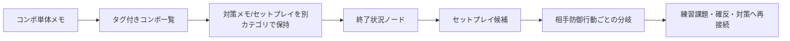
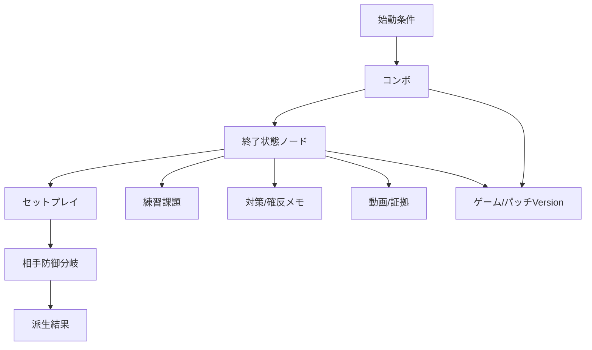

# 格闘ゲーム攻略・練習支援アプリ競合調査

## エグゼクティブサマリー

本調査の結論を先に述べると、現在の格闘ゲーム向け支援ツール市場は、**コンボの記録**、**対戦ログの集計**、**キャラ対策メモ**、**コミュニティ共有型のコンボ閲覧**といった領域では、すでに一定の成熟が見られます。Street Fighter 6自体が世界累計700万本超まで伸びており、ゲーム内でもコンボトライアルやトレーニング導線が強化されているため、単なる「コンボを保存するアプリ」だけでは差別化が難しくなっています。さらに、GUILTY GEAR -STRIVE- にはプレイヤー投稿型の Combo Maker が公式実装されており、**“コンボを探す・覚える” だけの体験**は、ゲーム内機能やコミュニティDBにかなり吸収されつつあります。citeturn32search0turn31search0turn31search18

その一方で、**「コンボの終了状況」と「その終了後に成立するセットプレイ」を構造化して接続し、さらに相手の防御行動・受け身・暴れ・無敵技・バクステ・投げ抜けなどに対する派生まで管理する**という要件は、今回採用した主要競合の中で、ほぼ未解決です。最も近いのは Fighter’s Log の **Route Lab** で、公開説明上は「状況判断をフローチャート形式で可視化」する思想を持っていますが、公開情報だけでは実際のデータ構造や可搬性、アカウント削除UX、エクスポート仕様までは十分に確認できませんでした。逆に言えば、**構造化された“終了状態ノード中心”の攻略DB** には明確な空白があります。citeturn51view0turn5view0

主要競合を実務的に見ると、**FightNote** は日本語圏で最も実績が強く、iOS専業ながら評価件数・更新頻度・開発者応答の継続性が高い一方で、ユーザーレビューと開発者回答の双方から、**分岐表現やコンボ→セットプレイ接続の弱さ**がはっきり確認できます。**FGNote** はまだ若いものの、コンボ・対策・セットプレイ・対戦ログを並列モジュールで揃え、JSONバックアップまで備えているため、初期段階としては設計が堅実です。ただし、現時点では**並列カテゴリの管理**に留まり、関係グラフとしての表現力はまだ限定的です。**Combolab** と **ComboTier** は共有・探索・複数ゲーム対応の面で有力ですが、コンボ中心で、セットプレイや分岐の管理は弱いです。**BurstMate** はスマブラ領域で対戦ログ／統計の完成度が高く、練習管理の参考価値が大きい一方、コンボ構造化の競合ではありません。**格ゲーのコンボ帳**は歴史的には重要ですが、更新停止が長く、現在の競争脅威は低いと判断できます。citeturn10view0turn11view0turn16view0turn17view0turn47view0turn45view0turn29view0turn28search0

したがって、開発中アプリの最有力な差別化軸は、**「1件のコンボ」ではなく「終了状態ノード」を中核エンティティにすること**です。具体的には、始動条件、CH/PC、位置、消費ゲージ、ダメージ、終了時有利F、ダウン状況、距離、相手の受け身種別を持つ **終了状態ノード** を作り、そのノードから **セットプレイ候補**、さらに **相手の防御行動ごとの分岐** を張る設計が有効です。これは既存競合の多くが採らないモデルであり、将来的に**確定反撃、キャラ対策、練習課題、動画クリップ、パッチ差分**まで同一グラフ上に接続しやすいという拡張優位もあります。citeturn10view0turn16view0turn51view0turn47view0

## 調査方法と対象範囲

本調査は、公開情報のみを対象に行いました。具体的には、各サービスの **公式サイト、App Store / Google Play の掲載情報、公開されているプライバシーポリシー、更新履歴、公開レビュー、開発者の公開SNS、Reddit などの外部コミュニティ言及**を突き合わせています。ユーザー要件に従い、**アカウントの新規作成、利用規約への同意、有料契約、ログイン必須機能の内部閲覧**は行っていません。そのため、ログイン後にしか見えない仕様は「不明」としました。公開情報が薄いサービスほど、評価の確度も意図的に下げています。citeturn10view0turn16view0turn51view0turn47view0turn45view0

対象範囲は、Street Fighter シリーズ、鉄拳、Guilty Gear、GBVS/GBVSR、Mortal Kombat、KOF、Virtua Fighter、Smash Bros. およびそれら周辺の **コンボ・対策・練習管理** サービスです。静的なフレーム表・技表中心のサービス、Wiki整形表示だけのサービス、実利用がほぼ確認できない新規MVP、AI／ノーコード由来に見えるが継続実績が乏しいサービスは、本編の主要競合から外しました。逆に、用途が完全一致しなくても、**対戦ログ、対策ノート、共有、データ可搬性、練習継続**の観点で参考価値が高いものは、隣接ベンチマークとして採用しています。citeturn29view0turn41view0turn44search0turn48search0

採用判定では、公開レビュー件数、更新履歴、外部コミュニティ言及、運営者情報の明確さ、プライバシー文書の有無、継続的アップデートの兆候を重視しました。たとえば FightNote は App Store で 142件・4.5、FGNote は 2件・3.5、Combolab は iOS 9件・3.4 / Android 100+ DL、BurstMate は 475件・4.8、Smash Notes は 5K+ DL・118 reviews といった公開指標があり、相対的な利用実績差を比較できます。一方、Fighter’s Log は 100+ DL は公開されているものの、レビューや機能内部の可視性が限定的であり、その分だけ不確実性を残しています。citeturn10view0turn16view0turn47view0turn29view0turn42search0turn51view0

## 主要競合の詳細分析

### FightNote

**事実として確認できること**は、FightNote が iPhone / iPad 向けの無料アプリであり、複数ゲーム対応、ゲーム／キャラクター／システム／コンボの整理、タップ式コマンド入力、動画保存とフレーム送り、キャラ対策メモ、検索、エクスポート／インポートを備えていることです。App Store では 142件・4.5評価、2024年から2026年にかけて継続的にバージョン更新があり、2026年には QuickNote、メモのページ表示、ウィジェット、簡易反応チェックなど、攻略記録以外の練習補助にも広げています。プライバシー表示では利用状況データのトラッキング／広告利用が示され、開発者プライバシーポリシーでは、個人情報は基本的に端末保持としつつ、AdMob 等の第三者サービス利用を明記しています。citeturn10view0turn11view0turn12view0turn13view0turn13view1turn14view0

**開発者自身の主張**としては、「格闘ゲームの知識を、勝つための形で残す」ことを掲げ、コンボ、動画、メモ、Webサイトをゲームごと・キャラごとに集約できること、対戦前に素早く見返せることを強く訴求しています。公開ランディングページでも、スト6、GG、KOF15、GBVSR、2XKO、鉄拳7など複数タイトル対応を打ち出しています。citeturn13view1turn14view0

**ユーザー意見**で重要なのは、App Store レビューにおいて「出来が良い一方、1コンボに1ルートしか書けず、中央・端・ゲージ有無・リーサル等で派生が変わる場合に複数登録が必要」という不満が具体的に出ている点です。これに対し開発者は、分岐機能の実装はデザイン設計やデータ管理、エクスポート修正の都合から厳しいと回答し、代替として角括弧等による**擬似的な分岐記述**を案内しています。これは、まさに今回の開発中アプリが狙う「構造化された分岐接続」が FightNote の弱点であることを、ユーザー／開発者の双方が明示している証拠です。citeturn10view0turn11view0

**調査者評価**としては、FightNote は現状もっとも手堅い日本語圏の直接競合です。脅威は高いです。ただし、データモデルの中心が依然として「コンボ」や「メモ」であり、**終了状態をノード化してそこからセットプレイが伸びる**設計には見えません。したがって、競合脅威は「総合ノートアプリ」としては強い一方、**“終了状況→セットプレイ→防御分岐” を厳密に扱う構造化攻略アプリ**としては、明確に差別化余地があります。citeturn10view0turn11view0turn13view1

### FGNote

**事実として確認できること**は、FGNote が iPhone 向け無料アプリで、コンボレシピ、キャラ対策、セットプレイ、フリーメモ、対戦ログ、マルチタイトル対応、コマンドプリセット、タグ管理、JSONバックアップ／復元を備えていることです。App Store では 2件・3.5評価、2026年3月リリース後に 1.0.1、1.1.0、1.2.0 と短期間で更新されており、ドラッグ＆ドロップ並べ替え、相手キャラ候補、ゲームごとのコマンドプリセット紐づけなどが追加されています。プライバシー表示では ID と使用状況データのトラッキング／広告利用が示され、広告削除の買い切り課金は 500円です。公式サイト側では個人開発であることと、Unity / Blender を用いた他作品開発が記載されています。citeturn16view0turn17view0turn17view1turn18view0turn19search5turn19search6

**開発者主張**として特筆すべきなのは、「コンボ・対策・対戦ログを一括管理」という明確なパッケージングです。FightNote が多機能ノート的なのに対し、FGNote はより最初から**用途別の情報カテゴリ**を立てているため、初期オンボーディングのわかりやすさがあります。特に、対戦ログの勝率集計や相手キャラ別分析は、格ゲー専用支援ツールとして自然な拡張です。citeturn16view0turn33search1turn33search3

**ユーザー意見**では、デザインの良さを評価する一方で、GGST文脈で「ジャンプキャンセル、壁バウンド、微ダッシュなど、もっと細かく書ける表現やカスタムボタン追加が欲しい」という要望が出ています。これは、FGNote が現状すでに基礎的な専用UIを持ちながらも、**コンボ表記の語彙と構造がまだ足りない**ことを示しています。citeturn17view0turn18view0

**調査者評価**では、FGNote はまだ利用実績が少ないため過大評価は禁物ですが、**データの可搬性**と**カテゴリ設計**は好印象です。JSONバックアップ／復元が公開説明に含まれている点は、個人開発アプリとしてかなり重要です。その一方で、コンボとセットプレイは依然として別モジュールに近く、公開情報からは **両者を構造的にリンクするモデル**は確認できません。このため、将来の強力競合になりうるものの、現時点では「設計が近いが、接続モデルがない」競合と位置付けるのが妥当です。citeturn16view0turn17view0turn18view0

### Fighter’s Log

**事実として確認できること**は、Fighter’s Log が Street Fighter 6 向けの Google Play アプリ / Web サービスで、公開情報上は **My Memo、Character Countermeasure Notes、Route Lab** の三本柱を持ち、Route Lab は「起き攻めや状況判断をフローチャートで可視化」する機能だと説明されていることです。Google Play では 100+ ダウンロード、2026年5月30日更新、データ安全性では個人情報の収集可能性、通信時暗号化、削除リクエスト可能が示されています。運営主体としては、Google Play 上で開発者名「三島佳祐」、サポートメール、Web サイト、プライバシーポリシーが公開されています。citeturn51view0turn50search1turn34search16

**プライバシーと透明性**については、公開ポリシーに比較的具体性があります。取得する情報としてメールアドレス、Google アカウント連携時の識別情報、Cookie、フォーム入力情報を挙げ、Supabase を利用したクラウドデータベースに、**日本リージョンでユーザーデータを保存する**としています。また、本人確認後の開示・訂正・削除請求を受け付けると明記しています。これは、少なくとも「どこに保存するのかが全く不明」な状態ではありません。citeturn5view0

ただし、**ユーザーが安心して攻略データを預けられるか**という観点では、まだ弱い点もあります。公開情報だけでは、アカウント削除の**具体的操作手順**、エクスポート仕様、バックアップ設計、利用規約の網羅的説明、運営者の住所表記や法人情報、障害時のサポートSLAまでは見えません。また、Route Labの実際の入力UI・データ構造も、ログイン前公開情報からは「フローチャート形式」という説明レベルに留まります。よって、**透明性は“最低限はあるが、データ預託サービスとしてはまだ不足”**と評価します。citeturn51view0turn5view0

**調査者評価**としては、Fighter’s Log は今回の調査対象の中で、開発中アプリの思想にもっとも近い競合です。理由は、公開説明においてすでに「状況ごとの選択肢を可視化」「起き攻めの分岐」「ガード・ヒット・防御行動ごとの枝分かれ」が示されているからです。したがって、**脅威度は高い**です。ただし、その強みは現状「思想」と「UIコンセプト」のレベルである可能性があり、可搬性・透明性・他機能接続の面ではまだ不明点が多い。ここが攻めどころです。つまり、開発中アプリは **Route Lab 的な分岐可視化** を取り込みつつ、さらに **JSON/CSVエクスポート、終了状態ノード、パッチ差分管理、練習課題接続** まで出せれば、Fighter’s Log より一段上の“攻略データ基盤”へ行けます。citeturn51view0turn5view0turn50search1

### Combolab

**事実として確認できること**は、Combolab が iOS / Android / Web で提供され、Street Fighter 6 と 2XKO を中心に、コンボ作成・リスト管理・タグ・メモ・進捗・公開URL共有・オフライン閲覧・多言語対応を備えることです。App Store では 9件・3.4評価、Google Play では 100+ DL、2026年1月更新、Web では 2024〜2026に作成された公開コンボが確認できます。運営会社は Four Rays AB で、Google Play には法人名、メール、スウェーデン住所、電話番号が掲載されています。citeturn47view0turn24view0turn24view2turn48search0turn25search3turn25search10

**開発者主張**としては、「格闘ゲームのコンボや攻略ノートを手のひらに」「コンボのまとめから共有まで、これひとつで完結」が中核です。Web 公開ページでは、直感的コンボ入力、リンク共有、テキスト／絵文字表記コピー、画像生成、テーマ別リスト整理、SNS共有を前面に出しています。これは **“個人ノート” と “公開コンボ共有” の橋渡し** としてよく整理されています。citeturn48search0turn24view4

**ユーザー意見**は、主に技名誤りやDLC更新遅延への不満と、修正対応への評価に分かれます。2024年には新キャラ更新が止まっているとの不満がありましたが、その後 2024年7月、9月、2025年12月、2026年1月と更新が続いています。つまり、**一時的な更新遅延はあったが、開発停止ではない**と見るのが妥当です。citeturn47view0turn24view0

**調査者評価**としては、Combolab はコンボ管理・共有では完成度が高い一方、**セットプレイ管理とコンボ後状況の接続**は弱いです。データ構造はリスト型で、タグやメモはあるものの、分岐グラフではありません。加えて、Android の申告では「データ収集なし」、iOS のプライバシー表示では「非連携のユーザコンテンツ・デバイスIDをアプリ機能目的で扱う可能性あり」と出ており、**プラットフォーム間でプライバシー表示の粒度が揃っていない**点は留意が必要です。とはいえ、運営主体の透明性は本調査対象の中では相対的に高い部類です。citeturn24view1turn47view0turn48search3

### 主要競合以外の補助ベンチマーク

**ComboTier** は、5ゲーム・1000+コンボ・50+ファイターを掲げるコミュニティ型コンボハブで、Street Fighter 6、Tekken 8、Guilty Gear Strive、2XKO、Marvel Tokonに対応しています。Reddit や Steam ガイド、YouTube での外部導線も確認でき、**“共有可能なコンボDB” 市場**の有力プレイヤーです。ただし、セットプレイ管理や分岐の構造化は見えません。citeturn45view0turn44search2turn44search3turn44search7turn44search8

**BurstMate** はスマブラ向けですが、475件・4.8、2026年6月更新、対戦ログ、勝率推移、相性表、ノート公開、期間フィルタなどを備え、**練習継続・ログ分析の完成度**が高いです。いわゆる“コンボ帳”ではありませんが、攻略アプリが「蓄積したデータをどう振り返らせるか」の参考として価値があります。citeturn29view0

**格ゲーのコンボ帳** は 2015〜2016年頃の iOS アプリで、始動ごとの自動並び替え、Twitter / LINE / Evernote 連携など、当時としては先進的でした。ただし最新更新は 2016年で、現在の競争脅威は低い一方、**“なぜ専用コンボ帳需要が昔から存在したか” を示す歴史的証拠**としては有用です。citeturn21search5turn28search0

**Smash Notes** は 5K+ DL・118 reviews の Android アプリで、対キャラごとのメモとコンボ記録、PCで作成したノートを QR 経由でモバイルへ渡す仕組みを持ちます。更新は 2023年で止まっているため現役競争力は低いですが、**軽量なクロスデバイス同期**の実装例として参考になります。citeturn41view0turn42search0

## 競合比較表とスコアリング

### 競合比較表

| サービス | URL | 対応ゲーム | 形態 | 中核機能 | コンボ管理 | セットプレイ管理 | コンボ↔セットプレイ接続 | 分岐・条件の構造化 | 共有 / 可搬性 | アカウント | 料金 | 最終更新 / 観測 | 利用規模の公開指標 | 総評 |
|---|---|---|---|---|---|---|---|---|---|---|---|---|---|---|
| FightNote | App Store / 公式LP | SF6, GG, KOF15, GBVSR, 2XKO, 鉄拳7 など | iOS | コンボ、動画、メモ、対策、検索、エクスポート | 強い | 中程度 | 弱い | 弱い。1コンボ1ルートが基本 | Export / Import あり | 公開説明では不要 | 無料 | 2026-06-12、2025〜2026に高頻度更新 citeturn14view0turn11view0turn10view0 | 142件・4.5 citeturn10view0 | 直接競合として最も強いが、構造化分岐は弱い。citeturn10view0turn11view0 |
| FGNote | App Store | SF6, GGST, 鉄拳8, 餓狼伝説CotW, VF5 など | iOS | コンボ、対策、セットプレイ、対戦ログ、フリーメモ、JSONバックアップ | 強い | 中程度 | 弱い | 中程度。タグ・並び替えまで | JSONバックアップ / 復元 | 公開説明では不要 | 無料＋広告削除500円 | 2026-04-07、3月から連続更新 citeturn17view0turn18view0 | 2件・3.5 citeturn16view0 | 設計は良いが、接続モデルと実績はまだ弱い。citeturn16view0turn17view0 |
| Fighter’s Log | 公式サイト / Google Play | SF6中心 | Web / Android | マイメモ、キャラ対策、Route Lab、状況判断可視化 | 中程度 | 強い | 強い | 強い。公開説明ではフローチャート型 | 公開情報では不明 | 必須と思われる | 公開情報上は無料 | 2026-05-30 citeturn51view0 | 100+ DL citeturn51view0 | 思想は最も近い。透明性と可搬性の公開情報が弱い。citeturn51view0turn5view0 |
| Combolab | 公式サイト / App Store / Google Play | SF6, 2XKO | Web / iOS / Android | コンボ作成、タグ、ノート、公開URL、画像生成、共有 | 非常に強い | 弱い | 弱い | リスト整理中心 | バックアップ / 共有 / 公開URL | 投稿には必要 | 無料 | iOS 2025-12-17、Android 2026-01-22 citeturn47view0turn24view0 | iOS 9件・3.4、Android 100+ DL citeturn47view0turn24view2 | コンボ共有基盤として有力だが、セットプレイ接続は弱い。citeturn47view0turn48search0 |
| ComboTier | 公式サイト | SF6, Tekken 8, GGST, 2XKO, Marvel Tokon | Web | コミュニティ型コンボDB、動画導線、投稿 | 非常に強い | 弱い | 弱い | 低い | 共有は強いがインポート/バックアップ不明 | 投稿には必要 | 公開情報上は無料 | 2026年時点で複数ゲーム拡張確認 citeturn45view0turn44search10 | 1000+ combos / 5 games / 外部言及あり citeturn45view0turn44search3turn44search8 | 探索・共有市場のベンチマーク。構造化攻略DBではない。citeturn45view0 |
| BurstMate | App Store | Smash Bros. | iOS | 対戦ログ、勝率推移、相性表、ノート、公開プロフィール | 弱い | 弱い | なし | 低い | 共有あり、CSV希望レビューあり | ログイン導線あり | 無料 | 2026-06-29 citeturn29view0 | 475件・4.8 citeturn29view0 | 練習継続・分析UIの参考価値が非常に高い。citeturn29view0 |
| 格ゲーのコンボ帳 | App Store | BBCF, GGXrd, ストV, UNI など旧作 | iOS | コンボ作成、始動別ソート、SNS / Evernote 連携 | 強い | 弱い | なし | 低い | Twitter / LINE / Evernote | 不要 | 無料 | 2016-10-23 citeturn28search0 | 56件・4.5（履歴上） citeturn21search5turn28search0 | 歴史的には重要だが、現在の競争脅威は低い。citeturn28search0 |
| Smash Notes | Google Play | Smash Bros. | Android / Web補助 | 対戦メモ、対キャラメモ、コンボ記録、QR経由同期 | 低〜中 | 弱い | なし | 低い | PC→モバイルQR同期 | 不要 | 無料 | 2023-04-24 citeturn41view0 | 5K+ DL・118 reviews citeturn42search0 | 軽量同期の参考になるが、現在は保守停滞気味。citeturn41view0turn42search0 |

### スコアリング表

評価基準は、**5 = 公開根拠が強く高水準、3 = 中位、1 = 弱い、判 = 判定不能**です。点数は事実と公開情報に基づく調査者評価であり、開発者の心理状態や内部事情は推測していません。citeturn10view0turn16view0turn51view0turn47view0

| サービス | 利用実績 | 開発継続性 | 製品完成度 | 構造化能力 | コンボ | セットプレイ | 接続能力 | 練習支援 | 可搬性 | 透明性 | 脅威度 | 参考価値 | 根拠要約 |
|---|---:|---:|---:|---:|---:|---:|---:|---:|---:|---:|---:|---:|---|
| FightNote | 4 | 5 | 4 | 2 | 4 | 2 | 1 | 4 | 4 | 4 | 4 | 5 | 高評価・高更新頻度・出力機能あり。ただし分岐は未実装で擬似表現対応。citeturn10view0turn11view0turn12view0turn13view0 |
| FGNote | 2 | 4 | 3 | 3 | 4 | 3 | 1 | 3 | 4 | 4 | 3 | 4 | 新しく実績は小さいが、カテゴリ設計・対戦ログ・JSONバックアップは優秀。citeturn16view0turn17view0turn18view0turn19search5 |
| Fighter’s Log | 2 | 4 | 3 | 5 | 3 | 5 | 5 | 3 | 判 | 2 | 5 | 5 | Route Lab の思想は最重要。だが可搬性・削除手順・運営情報公開は不足。citeturn51view0turn5view0turn50search1 |
| Combolab | 3 | 4 | 4 | 3 | 5 | 1 | 1 | 3 | 4 | 4 | 4 | 4 | 共有付きコンボ管理は強い。タグ/リストはあるが分岐グラフではない。citeturn47view0turn24view0turn48search0turn48search3 |
| ComboTier | 3 | 4 | 3 | 2 | 5 | 1 | 1 | 2 | 2 | 3 | 3 | 3 | 多ゲーム・大量コンボ・外部言及あり。だが攻略DBというより公開ハブ。citeturn45view0turn44search3turn44search7turn44search8 |
| BurstMate | 5 | 4 | 4 | 2 | 1 | 1 | 1 | 5 | 2 | 3 | 2 | 4 | 対戦ログと振り返りは非常に強い。コンボ/セットプレイ競合ではない。citeturn29view0 |
| 格ゲーのコンボ帳 | 4 | 1 | 3 | 2 | 4 | 1 | 1 | 1 | 4 | 2 | 1 | 3 | 歴史的実績はあるが、更新停止が長く現役脅威は低い。citeturn21search5turn28search0 |
| Smash Notes | 4 | 1 | 3 | 2 | 2 | 1 | 1 | 2 | 4 | 3 | 1 | 3 | DLとレビューは多いが、更新が2023年で止まる。QR同期は参考。citeturn41view0turn42search0 |

## 市場成熟度と未充足領域

### 活発なサービス、保守段階、停止疑いの分類

**活発**と見てよいのは、FightNote、FGNote、Fighter’s Log、Combolab、ComboTierです。FightNote は 2025〜2026 に細かい機能追加が継続し、レビュー返信も具体的です。FGNote は 2026年3〜4月に連続更新。Fighter’s Log は 2026年5月更新と直近の告知があり、Fighter’s Log 用公開サイトや X アカウントも存在します。Combolab は 2025年末〜2026年初頭まで更新があり、Web 側も 2026年ゲーム対応が見えます。ComboTier も 2026年時点で複数ゲームへ拡大しています。citeturn11view0turn17view0turn51view0turn34search10turn24view0turn45view0

**保守段階**に近いのは BurstMate です。2026年6月にも更新はあるので停止ではありませんが、直近の App Store 履歴は細かな不具合修正が中心で、機能的にはかなり成熟した状態に見えます。ただし、対戦ログという切り口では完成度が高く、むしろ“守りに入った成熟サービス”と見た方が適切です。citeturn29view0

**停止疑い**が濃いのは、格ゲーのコンボ帳と Smash Notes です。前者は 2016年更新、後者は 2023年更新で止まっており、現行タイトルやOS追従の観点では競争力が落ちています。ただし、どちらも「その領域にユーザー需要があった」証拠としては有益です。citeturn28search0turn41view0turn42search0

### 市場が成熟している領域

市場が成熟しているのは、第一に **コンボの発見・保存・共有** です。公式のゲーム内機能としても、Street Fighter 6 はコンボトライアルを用意し、GUILTY GEAR -STRIVE- はプレイヤー投稿型 Combo Maker を備えています。外部サービス側でも、Combolab や ComboTier がコンボ共有・タグ整理・公開URL・動画導線の役割を担っています。つまり、**“何のコンボがあるか知る”** という用途は、かなり埋まっています。citeturn31search0turn31search18turn47view0turn45view0

第二に、**キャラ対策メモ** も比較的成熟しています。FightNote、FGNote、Fighter’s Log、BurstMate、Smash Notes いずれも、相手キャラごとにノートを残す発想を採っています。ここでは差は「書きやすさ」「検索・絞り込み」「モバイル向けUI」に寄っています。裏を返すと、対キャラメモ機能だけでは新規参入の差別化は難しいです。citeturn14view0turn16view0turn51view0turn29view0turn41view0

第三に、**対戦ログと統計** は BurstMate が先行し、FGNote もその方向に寄っています。勝率推移、キャラ別苦手分析、期間フィルタ、負けパターンの記録は、少なくとも“できること”としては珍しくなくなっています。したがって、将来の総合攻略アプリに対戦ログを入れること自体は有効ですが、それだけでは武器になりません。citeturn29view0turn16view0

### 市場で十分に解決されていない領域

未充足領域は、**攻略情報の「関係性」を構造化すること**です。既存アプリの多くは、コンボ、メモ、対策、セットプレイ、ログを「別カテゴリ」で持ちます。しかし、試合中に必要なのはカテゴリではなく、**ある終了状態から次に何が成立するか**という問いです。公開レビューでも FightNote に対して「中央なら〜、ゲージがあれば〜、端なら〜、リーサルなら〜のような選択肢が綺麗に書けない」と明言されており、これは市場の生々しい未解決課題です。citeturn10view0

また、**条件付き検索**も未解決です。たとえば「パニッシュカウンター始動」「画面端」「ドライブ1本使用」「+42 ダウン」「受け身前歩き一回分の距離」という条件から、成立するセットプレイ候補と、その後の防御分岐まで引けるサービスは見当たりません。Fighter’s Log は近い可能性がありますが、公開確認できる範囲ではフローチャート思想までで、条件付きクエリエンジンや型付きデータモデルまでは断定できません。citeturn51view0turn50search1

さらに、**パッチ更新に対する知識の失効管理**も弱いです。Combolab や FightNote ではDLC・技データ更新が重視されていますが、ユーザー固有ノート側で「どのパッチで成立確認したルートか」「今のパッチで疑わしいか」を追う設計は見えません。これは SF6 のような継続運用タイトルでは相当重要で、将来の総合攻略DBでは価値が高いです。citeturn47view0turn11view0

### 構造化需要の位置づけ

以下は、現状の市場と開発中アプリの狙いを単純化した図です。既存競合は左側に寄りがちで、開発中アプリは右側に明確な空白を見ています。これは本調査の総合所見です。citeturn10view0turn16view0turn51view0turn47view0

## 開発中アプリへの示唆

### 開発中アプリと競合する機能

競合と直接ぶつかるのは、**コンボ入力UI、タグ整理、キャラ対策メモ、検索、共有、バックアップ**です。FightNote と FGNote はいずれもモバイル最適化された入力UIを持ち、Combolab と ComboTier は共有URLや公開閲覧に強いです。したがって、これらを最低限満たさないと、“構造がすごいが普段使いしにくい” アプリとして負けます。まず土台として、**軽快な入力体験** と **最低限の共有／バックアップ** は必須です。citeturn10view0turn16view0turn47view0turn45view0

また、練習支援の観点では BurstMate や FightNote が示すように、攻略情報は「保存」だけでなく「見返せる」「継続できる」「今日やることがわかる」ことが重要です。あなたのアプリが総合攻略アプリへ拡張するなら、単なるデータベースではなく、**次に練習すべき未習熟ルートを提示する機能**まで視野に入れるべきです。citeturn29view0turn11view0

### 開発中アプリ独自の差別化候補

最も強い差別化候補は、**終了状態の型付け**です。コンボの最終ヒット後に、`有利F / ダウン種別 / 受け身可否 / 距離 / 画面位置 / 残ゲージ / 相手の状態 / パッチVersion` を保持し、そこからセットプレイをぶら下げます。そのセットプレイ側にも `起点タイミング / 選択肢 / 相手防御 / 成功時派生 / 失敗時リスク / 期待値` を持たせれば、単なるメモではなく、**ゲーム知識グラフ**に近づきます。これは FightNote と FGNote の “カテゴリ管理”、Combolab と ComboTier の “公開コンボDB”、BurstMate の “ログ集計” とは別次元の強みです。citeturn10view0turn16view0turn47view0turn29view0

そのデータ構造は、将来的に **確定反撃、キャラ対策、動画クリップ、練習課題、試合ログ** を同じノードに繋げやすくします。たとえば、あるコンボ終了状態ノードから「この状況で投げ重ねA / シミーB / 打撃重ねC」、さらに「相手後ろ受け身時だけ成立」「無敵技には負ける」「投げ抜けには下がり強Pで分岐」といった枝を張れれば、既存アプリでは困難な照会が可能になります。**“コンボを覚えるアプリ” ではなく “状況判断を再現するアプリ”** として位置付けるのが有効です。citeturn51view0turn50search1

### 参考にすべきUI・データ構造・運営方法

参考にすべき UI は、FightNote の **入力のしやすさ**、FGNote の **用途別カテゴリ設計**、BurstMate の **振り返り導線**、Combolab の **共有の軽さ** です。この4つはかなり相補的です。とくに BurstMate のように、「保存した情報が増えるほど試合前に何を見るか迷う」問題に対して、グラフや期間フィルタで焦点化する発想は、格ゲー総合攻略アプリにも移植価値があります。citeturn10view0turn16view0turn29view0turn47view0

データ構造は、下図のような **終了状態中心モデル** を推奨します。これなら、将来的に対策・確反・練習課題・動画・パッチ差分まで自然に拡張できます。これは本調査から導いた設計提案です。citeturn10view0turn16view0turn51view0turn47view0

運営面では、Fighter’s Log の事例が示すように、**ログイン必須型にするなら透明性を先回りで出す**必要があります。運営者情報、保存先、バックアップ、エクスポート、削除方法、問い合わせ窓口、障害時告知の場所を、ログイン前に明示した方が信頼を得やすいです。逆に FightNote や FGNote のようなローカル中心アプリは、その点で心理的障壁が低い。どちらを採るにしても、**なぜその設計なのか**を明文化することが重要です。citeturn5view0turn13view0turn16view0

### 参考にすべきでない失敗パターン

最も避けるべきなのは、**構造化したいのに最終的に自由メモへ逃げる**設計です。FightNote の分岐問題はその典型で、構造を持てない部分をユーザーに擬似記法で埋めてもらうと、長期的には検索性・再利用性・可搬性が失われます。せっかくの差別化要件を、自作の記法メモへ後退させるべきではありません。citeturn10view0turn11view0

次に避けるべきは、**共有だけ強くて個人知識の蓄積が弱い**設計です。Combolab や ComboTier は共有導線が優秀ですが、共有に最適化しすぎると、個々人の攻略ノートとしての深さや分岐の密度が削られやすい。開発中アプリは共有を“結果の配布”として持ちつつ、内部モデルはもっと濃い構造を持つべきです。citeturn47view0turn45view0

さらに、**可搬性の後回し**も危険です。FGNote の JSON バックアップや FightNote の Export / Import は、規模が小さいうちから導入されているからこそ価値があります。総合攻略DBに育てるなら、初期からスキーマ版管理を入れないと、将来の移行が詰みます。citeturn16view0turn10view0

### 初回リリース後に検討すべき機能

初回リリース後の優先機能は、第一に **練習課題との接続**です。終了状態ノードやセットプレイルートから、未達成率・成功回数・最終成功日を持つタスクを自動生成できると、BurstMate 的な継続支援に繋がります。第二に **パッチ差分管理**、第三に **動画証拠との接続**、第四に **キャラ対策・確反ノードとの統合**です。こうすると、単なる“メモ”ではなく、“研究と練習の往復”が回ります。citeturn29view0turn11view0turn51view0

実装順としては、まず **終了状態ノード + セットプレイ分岐 + 手動タグ検索** をMVPにし、その後 **練習課題・動画・共有・共同編集** を足すのが現実的です。いきなりコミュニティ投稿へ広げるより、最初は **個人用データモデルの完成度** を優先すべきです。Combolab や ComboTier がすでに共有市場を押さえているため、初期フェーズで共有面を戦場にしても勝ちにくいからです。citeturn47view0turn45view0

## 参考外候補と出典一覧

### 参考外とした候補

**Fighter Lab** は Street Fighter 6 向けコンボ備忘録として方向性は近いものの、公開時期が 2026年、評価 1件で、継続実績・外部言及・完成度の判断材料が不足しているため、本編の主要競合一覧からは外しました。citeturn20search1turn20search5

**コンメモ！** はキャラごとのコンボ管理とオフライン保存という明確な用途がありますが、コンボ中心で構造化・分岐・対策・練習管理の広がりが薄く、公開レビュー・継続的外部言及の厚みも限られるため、主要競合からは除外しました。citeturn20search4

**sf6-combo-editor** は状況メモ付きコンボエディタとして発想が面白く、GitHub も公開されていますが、2026年3月時点では保存一覧・ダメージ計算などがロードマップ段階で、GitHub star も極小です。独自性はあるものの、利用実績・継続運営実績がまだ弱いため、参考外です。citeturn22view0turn43search1turn43search8

**ComboMaster overlay** や **2XKOMBO / Comboforge** などの新規ツール群は、コンボオーバーレイ、共有、ビジュアル記法など独自性がありますが、今回の主対象である SF6 中心の既存競合としては新しすぎ、利用規模・運営継続年数・透明性の面で評価を安定させにくいため、主要一覧には入れていません。citeturn27search2turn27search4turn46search0turn46search1turn46search4

### 出典一覧

主要な一次・公式ソースは、Capcom の IR と公式マニュアル、Arc System Works の公式 HOWTO、各アプリの App Store / Google Play 掲載情報、各サービスの公式サイトおよび公開プライバシーポリシーです。市場成熟度の根拠としては、Street Fighter 6 の累計販売本数、Street Fighter 6 公式マニュアルの Practice / Combo Trial、GUILTY GEAR -STRIVE- の Combo Maker 公式説明を重視しました。citeturn32search0turn31search0turn31search18

主要競合の直接根拠としては、FightNote の App Store と公式LP、FGNote の App Store と開発者サイト、Fighter’s Log の Google Play とプライバシーポリシー、Combolab の App Store / Google Play / 公式サイト、BurstMate の App Store、ComboTier の公式サイトと外部コミュニティ導線、格ゲーのコンボ帳の App Store 履歴、Smash Notes の Google Play を優先しました。citeturn10view0turn13view1turn16view0turn19search5turn51view0turn5view0turn47view0turn48search3turn29view0turn45view0turn28search0turn41view0turn42search0

外部コミュニティの補助根拠としては、ComboTier の Reddit / Steam Guide / YouTube、Fighter’s Log / FGNote / Combolab の X 上の告知、2XKO 領域の Reddit での検索ニーズなどを参照しました。これらは**開発者主張やユーザー需要の傍証**としては有効ですが、一次ソースより優先度は下げて扱っています。citeturn44search3turn44search7turn44search8turn34search10turn33search3turn48search2turn46search2

以上を踏まえると、開発中アプリが本当に狙うべきポジションは、**FightNote / FGNote の “専用ノート性” と、Fighter’s Log の “分岐可視化思想” を取り込みつつ、Combolab / ComboTier が持たない “終了状態中心の構造モデル” と “長期可搬性” を実装すること**です。そこまで踏み込めれば、単なる競合追随ではなく、**格闘ゲーム攻略データの新しい標準UI** を狙える余地があります。citeturn10view0turn16view0turn51view0turn47view0turn45view0