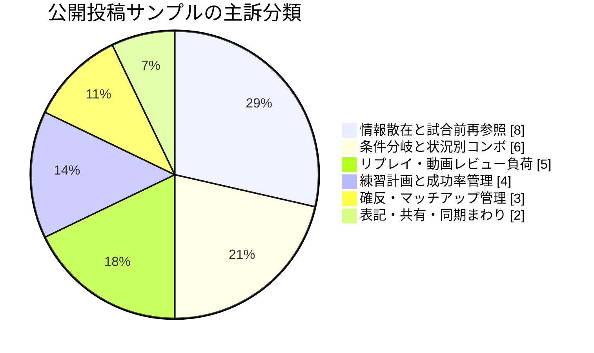
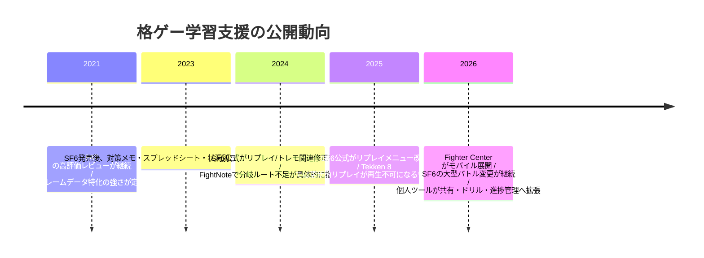
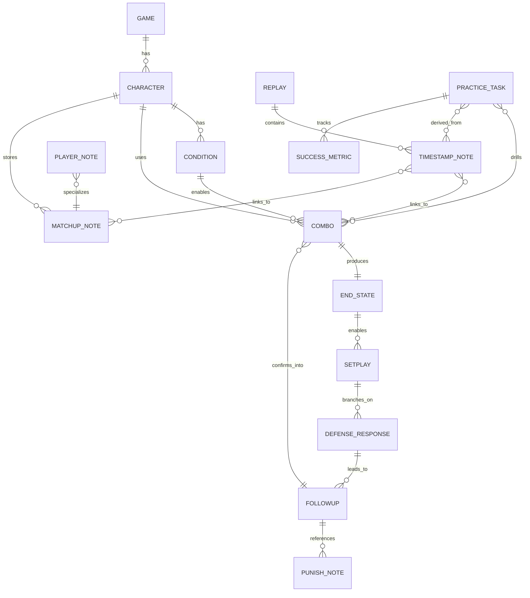

# 格闘ゲームプレイヤーの未充足ニーズ調査

## エグゼクティブサマリー

今回の調査では、日本語圏と英語圏の公開投稿を横断し、格闘ゲームプレイヤーが「攻略情報をどう集め、どう思い出し、どう実戦に戻すか」で継続的に詰まっていることが確認できました。とくに強かったのは、**情報が散らばって対戦前に引けないこと**、**コンボが状況依存で枝分かれし、スプレッドシートや通常メモでは処理しきれないこと**、**リプレイや動画の見返しが重労働で、学習が次の練習に変換されにくいこと**の三点です。日本語圏では「試合前に必要箇所を探しているうちに試合が始まる」「スプシでメモしていたが不便」という具体的な言い方が多く、英語圏では「notes were scattered across docs, Discord messages, and memory」「replay study feels like homework」といった表現が繰り返し見られました。 citeturn37view0turn26view1turn17view0turn14view1

Street Fighter 6 向けの構造化攻略アプリという前提に照らすと、最も有望なのは **条件付きコンボ管理** と **コンボ終了状態からのセットプレイ接続** です。既存アプリのレビューでも、「一つのコンボに一つのルートしか記載できず、中央・端・ゲージ・リーサルなど状況別の派生を複数登録する必要があって不便」という不満が明示されており、これはご提示の「始動条件 → コンボ → 終了状況 → 起き攻め/分岐 → 次コンボ/確反/対策」という設計思想と非常に高い一致を示しています。さらに、Reddit でも「Have a combo for every situation」という発想が支持される一方、コメントではそこから条件の組合せ爆発が起きることが指摘されており、**まさに“表に載せるには多すぎる構造”が未充足ニーズ**だと読めます。 citeturn14view1turn18view2

一方で、見た目は魅力的でも、公開需要の根拠がまだ弱い機能もあります。たとえば **今日の練習メニュー自動提案**、**苦手状況の自動抽出**、**パッチ変更で影響を受けるコンボの自動検出**、**コントローラー入力からの自動コンボ登録** には、関連する実験やツール案、技術的な前例は確認できたものの、実利用者による反復的な要求は限定的でした。逆に、**対戦前クイック確認モード**、**確反/キャラ対メモ**、**リプレイ・動画の時刻付きメモ**、**コンボ練習の成功率記録**は、複数ソースにまたがって需要の痕跡が見つかりました。 citeturn37view0turn37view1turn17view4turn34view0turn17view3turn22view2

今回の主要サンプル二十八件を主訴ベースで一件一分類したところ、もっとも多かったのは「情報散在と試合前再参照」、次いで「条件分岐と状況別コンボ」、その次が「リプレイ・動画レビュー負荷」でした。これは市場統計ではなく、**今回確認できた公開投稿の範囲**に限る集計です。 citeturn37view0turn26view1turn17view0turn18view2turn34view0

結論として、初回リリースで最優先にすべきなのは、**分岐を持てる状況ベースのコンボ/セットプレイ管理**、**対戦前の短時間確認**、**確反/キャラ対の一元化**、**動画・リプレイとメモの接続**です。これらは需要の確認度が高く、開発中アプリの差別化ポイントとも最も強く噛み合っています。 citeturn14view1turn18view2turn37view0turn37view1turn26view1turn17view4

## 調査方法と制約

調査期間は主として直近三年を優先しつつ、現在も未解決と見られる問題を示す古い投稿は補助的に採用しました。調査対象は X の公開検索で取得できた投稿、Reddit、Steam コミュニティ、App Store、Google Play、GitHub、note、個人ブログ、ゲーム別学習サイト、公式アップデートページです。日本語では「コンボを忘れる」「確反メモ」「試合前に確認」「スプレッドシート」「Notion」など、英語では「matchup notes」「replay review」「remembering combos」「practice routine」「fighting game tracker」などから検索語を拡張しました。 citeturn37view0turn26view1turn17view4turn18view2turn34view0

分析では、個別の投稿をそのまま機能要望に変換せず、**複数投稿が指している共通問題**に統合しました。評価では、事実、投稿者の意見、開発者の主張、調査者の推測を分けて扱いました。たとえば App Store の機能説明や GitHub README は「開発者の主張」、Reddit や note の体験談は「投稿者の意見」、アップデート日や評価件数は「事実」、その上での優先順位付けは「調査者の推測」です。 citeturn13view1turn14view1turn22view2turn25search10

制約も明記しておく必要があります。X は公開投稿でも検索エンジン経由で取得できるものに偏りがあり、検索結果スニペットだけ確認できて本文を安定的に開けないケースがありました。そのため、**X 上の件数は過少把握の可能性が高い**です。Discord も、公開ログや検索可能ページに限られ、招待制サーバー内の会話は含めていません。YouTube コメントもウェブ検索では索引されにくく、今回のレポートでは補助的にしか扱えていません。したがって、本レポートの件数は**完全な市場統計ではなく、今回確認できた公開投稿の範囲**です。  

ノイズ除外は、単なるフレームデータ閲覧要望、特定技の性能質問だけの投稿、ゲームバランス批判、DL C 要望、自己宣伝だけの新規アプリ、冗談・皮肉の可能性が高いものを優先度低で処理しました。反対に、既存ツールのレビューや、具体的な困りごとが語られている投稿、実用中のメモ運用の話は優先しました。 citeturn14view1turn26view0turn20search12turn20search16

情報種別の区別は以下の通りです。

| 区分 | 例 | このレポートでの扱い |
|---|---|---|
| 事実 | App Store の評価件数、公式アップデート日、GitHub の星数 | 数値・日付の根拠として採用 |
| 投稿者の意見 | 「試合前に探しているうちに試合が始まる」「リプレイを見るのが宿題みたい」 | 困りごとの直接証拠として重視 |
| 開発者の主張 | 「試合前にすぐ見返せる」「ノート、ドリル、リプレイレビューを一箇所で」 | 解決方向の参考扱い。単独では需要の証拠にしない |
| 調査者の推測 | MVP 優先度、構造化モデル、ロードマップ | 必ず上の三種を踏まえた推論として明示 |

## 情報源別の傾向

日本語圏の投稿では、**日常運用の不便さ**が非常に具体的です。note では、iPhone のメモにキャラ対策を書いていたが目次機能がなく、対戦相手の項目を探しているうちに試合が始まる、という典型例が見つかりました。また App Store の FightNote レビューでは、状況別の派生コンボや起き攻め分岐を一つのまとまりとして持てず、中央・端・ゲージ・リーサル別に複数登録が必要だという不満が挙がっています。X でも「今までスプシでコンボとか対策メモってた」「ストック別のコンボ忘れる」「メモする手間を減らしたい」といった断片が確認でき、**“記録している人ほど構造の限界にぶつかる”** 傾向が見えます。 citeturn37view0turn14view1turn19search1turn19search7turn19search16

英語圏では、**学習フロー全体の重さ**が強く語られます。Reddit では、ノートを取るべきだと言われるが何をどう書けばよいか分からない、リプレイ研究は効率的だが宿題のようで気が重い、四試合の負けリプレイに二時間かかった、という声がありました。また、「notes were scattered across docs, Discord messages, and memory」という投稿は、まさに情報散在が新しいツール企画の出発点になっている例です。つまり英語圏では、単なるメモ置き場よりも、**メモ→リプレイ→練習計画→再実戦**の流れをどう繋ぐかに関心が寄っています。 citeturn17view0turn17view1turn17view4turn26view1turn32view0

App Store と Google Play は、**不満が最も具体的に出やすい一次情報**でした。FightNote のレビューは、既存ユーザーが「もっと欲しい」と感じた不足を具体的に書いており、とくにボタン表記数、同時押し表記、分岐コンボの扱いが弱点として挙がっています。FAT は非常に高評価ですが、主軸はフレームデータと比較・検索であり、知識の構造化や分岐記録の中心ツールではありません。Fighter Center はノート、ドリル、リプレイレビュー、進捗管理をまとめる方向を掲げていますが、コミュニティでは「リンク集に見える」「テキスト形式を好む」という反応もあり、**一元化だけでは足りず、情報の“料理の仕方”が重要**だと分かります。 citeturn14view1turn13view1turn25search10turn26view0

Wiki・学習サイトは、**基礎知識の公開・共有**には強い一方、個人化・状況化・再利用には弱いです。SuperCombo は Street Fighter 6 の大規模 Wiki を提供していますが、サイト自体が「多くのキャラ下位ページ、とくに matchup ページはより完全で最新の内容が必要」と認めています。Dustloop も Arc System Works 系では強力ですが、タイトル横断の個人学習ワークスペースではありません。Tekkendocs は独立したフレームデータ/学習サイトとして整っているものの、やはり Tekken 特化です。つまり、**公開知識ベースはあるが、自分の文脈に沿って枝分かれさせる個人ツールが別途必要**という構図です。 citeturn25search1turn25search9turn25search0turn25search3

代表的な投稿・ページを、証拠の種類を分けて抜粋すると次の通りです。

| 日付 | 情報源 | ゲーム | 区分 | 要旨 | 含意 |
|---|---|---|---|---|---|
| 2023-08-05 | note「スト6 キャラ対策メモ」 | SF6 | 投稿者の意見 | メモアプリでは目次がなく、対戦前に必要項目を探している間に試合が始まる。 | 対戦前クイック確認需要が強い。 citeturn37view0 |
| 2024-10-18 | FightNote App Store レビュー | 複数FG | 投稿者の意見 | 一つのコンボに一つのルートしか持てず、中央/端/ゲージ/リーサル別の派生が不便。 | 条件分岐・コンボ→起き攻め接続の需要。 citeturn14view1 |
| 2024頃 | r/StreetFighter「Have a combo for every situation」 | SF6 | 投稿者の意見 | 状況別コンボをスプレッドシートで管理。だが条件が増えると組合せ爆発。 | 条件付きコンボ比較の需要とスプレッドシート限界。 citeturn18view2 |
| 2024頃 | r/Fighters「how to take notes effectively」 | GGST | 投稿者の意見 | ノート術が分からず、タイムスタンプやクリップ化を勧めるレスが付く。 | 動画の時刻付きメモ需要。 citeturn17view4 |
| 2023頃 | r/Fighters「How do you make watching/studying replays more fun?」 | 横断 | 投稿者の意見 | リプレイ研究は効率的だが宿題のようで辛い。 | リプレイ→練習の橋渡し不足。 citeturn17view0 |
| 2026-07頃 | r/Fighters「free matchup notes app」 | 横断 | 投稿者の意見 | ノートが docs/Discord/記憶に散っていたためツールを作った。 | 情報散在は現在進行形。 citeturn26view1 |
| 2026-07-14 | Google Play「Fighter Center」 | 複数FG | 開発者の主張 | ノート、ドリル、リプレイレビュー、進捗管理を一箇所にまとめる。 | 市場は“統合ワークスペース”方向に向かっている。 citeturn25search10 |
| 2026-03-17 / 2026-05-28 | Capcom 公式更新情報 | SF6 | 事実 | 2026年も大規模バトル変更が継続。リプレイ関連やトレモ関連の更新も実施。 | パッチ後更新負荷は継続する。 citeturn23search10turn23search2turn23search9 |

公開動向を時系列で整理すると、最近五年の変化は次のように読めます。なお、これは市場史ではなく、今回確認した公開ページから見た学習支援ツール周辺の動向です。 citeturn13view1turn23search1turn23search21turn23search3turn25search10

## 頻出する困りごとと潜在需要

今回、公開需要が一定以上確認できたものを、七つの問題単位に統合しました。件数は**今回確認できた公開投稿の範囲**であり、市場規模の推計ではありません。

| ニーズ名 | 需要プロファイル | 出典 |
|---|---|---|
| 試合前に必要情報をすぐ引けない | **困りごと**: メモが分散し、対戦前やランクマ前に必要箇所へ到達できない。 **代表要旨**: 「項目を探しているうちに試合開始」「試合前にすぐ見返せる形が必要」。 **投稿ゲーム**: SF6中心、複数FG。 **層**: 初中級中心、一部大会・対戦会参加者。 **言語圏**: 日英両方。 **確認件数**: 6。 **新しさ**: 2023–2026中心。 **深刻度**: 5。 **発生頻度**: 5。 **現在の代替**: iPhoneメモ、Google Docs、Discord、Wiki、Notion。 **代替不満**: 検索しづらい、一覧性がない、文脈別に切れない。 **既存解決**: FightNote、FighterCenter が部分解決。 **残る不満**: 情報は集まっても、実戦直前用に圧縮されていない。 **実現案**: 30秒で見返せる対戦前モード、キャラ別・状況別ハイライト。 **相性**: 極めて高い。 **実装負荷**: 中。 **継続利用**: 高。 **フェーズ**: MVP 向け。 | citeturn37view0turn37view1turn26view1turn25search14 |
| 条件に応じたコンボルート比較が難しい | **困りごと**: 距離、ゲージ、本数、始動、リーサル、画面端などでルートが変わり、表形式で持つと爆発する。 **代表要旨**: 「状況ごとに複数登録が必要」「every situation を書き出すと条件が増えすぎる」。 **投稿ゲーム**: SF6、Tekken 系の学習文脈。 **層**: 中級以上がやや多いが初心者の基礎整理にも波及。 **言語圏**: 日英両方。 **確認件数**: 5。 **新しさ**: 2023–2026。 **深刻度**: 5。 **発生頻度**: 5。 **現在の代替**: スプレッドシート、手書き、テキストメモ。 **代替不満**: 条件追加で表が崩壊、比較はできても検索しづらい。 **既存解決**: FAT は比較、FightNote は記録、ComboMaster/notation.LABS は表記支援。 **残る不満**: “どの状況でどれを使うか” が中心にない。 **実現案**: 条件タグ付きルート比較、優先ルート推奨、安定度と期待値の併記。 **相性**: 極めて高い。 **実装負荷**: 中。 **継続利用**: 高。 **フェーズ**: MVP 向け。 | citeturn18view2turn14view1turn32view1turn13view1 |
| コンボ終了状態から起き攻めや分岐へ繋げられない | **困りごと**: コンボとセットプレイが別管理になり、どの〆から何が成立するか、相手の防御行動でどう分岐するかを一続きに持てない。 **代表要旨**: FightNote レビューで、投げ後起き攻めの中央/端/ゲージ/リーサル分岐を一つのルートに書けず不便と明示。 **投稿ゲーム**: SF6中心。 **層**: 中級〜上級寄り。 **言語圏**: 主に日本語、英語は類似問題として状況別管理。 **確認件数**: 4。 **新しさ**: 2024–2026。 **深刻度**: 5。 **発生頻度**: 4。 **現在の代替**: 別メモ、表記の工夫、動画連結。 **代替不満**: 参照遷移が手作業、複数登録で冗長、更新漏れが起こる。 **既存解決**: 軽微な擬似分岐のみ。 **残る不満**: 真の状態遷移モデルがない。 **実現案**: 終了状況エンティティ、分岐ノード、被防御行動ごとの次ノード接続。 **相性**: 極めて高い。 **実装負荷**: 中〜高。 **継続利用**: 非常に高い。 **フェーズ**: MVP 差別化の中核。 | citeturn14view1turn18view2turn37view2 |
| 確反・キャラ対・相手癖の知識が一元化できない | **困りごと**: 苦手技、確定反撃、相手キャラ対策、相手プレイヤーの癖が別々の場所にある。 **代表要旨**: 「苦手キャラ用の注意点を探せない」「problematic moves をリプレイからメモしてラボに持ち込む」。 **投稿ゲーム**: SF6、Tekken、GGST。 **層**: 全層。 **言語圏**: 日英両方。 **確認件数**: 7。 **新しさ**: 2021–2026。 **深刻度**: 4。 **発生頻度**: 5。 **現在の代替**: Wiki、Discord、手書き、Steam ガイド、メモ。 **代替不満**: 汎用情報と自分用情報が混ざる、対人格差に弱い。 **既存解決**: FightNote／FighterCenter／Tekkendocs／Steam の matchup notes。 **残る不満**: 自分用のタグ付け、優先順、相手別メモの接続が弱い。 **実現案**: キャラ別対策ノート + プレイヤー別癖ノート + 確反表を同一レコード系で持つ。 **相性**: 高い。 **実装負荷**: 低〜中。 **継続利用**: 高い。 **フェーズ**: MVP 向け。 | citeturn37view0turn37view2turn20search2turn20search6turn28search10turn26view1 |
| リプレイや動画を見返しても次の練習に落ちない | **困りごと**: リプレイ研究が面倒で、何を見るべきか分からず、メモが細かくなりすぎる。必要箇所へ素早く飛べない。 **代表要旨**: 「宿題みたい」「4試合に2時間」「timestamp stuff, clip stuff」。 **投稿ゲーム**: 横断。 **層**: 初中級が中心、上級者文脈もあり。 **言語圏**: 英語中心、日本語でも動画とメモを一緒に保ちたい需要あり。 **確認件数**: 7。 **新しさ**: 2021–2026。 **深刻度**: 4。 **発生頻度**: 4。 **現在の代替**: ゲーム内リプレイ、動画プレイヤー、手書きメモ。 **代替不満**: 跳び先が残らない、メモと動画が別、旧リプレイがパッチで見られなくなる。 **既存解決**: FightNote のローカル動画、FighterCenter の replay review、ゲーム公式の replay 機能。 **残る不満**: 時刻・場面・学習項目を結ぶ導線が弱い。 **実現案**: 時刻付きメモ、リプレイコード/動画URL紐付け、失敗→練習項目変換。 **相性**: 高い。 **実装負荷**: 中。 **継続利用**: 高い。 **フェーズ**: MVP 直後。 | citeturn17view0turn17view1turn17view4turn37view1turn23search21turn23search3turn23search11 |
| 何を練習すべきか分からず、上達を定量化できない | **困りごと**: 練習項目の優先順位が曖昧で、勝敗では成長が見えない。 **代表要旨**: 「lack of direction」「勝っても負けても improvement をどう測るか」。 **投稿ゲーム**: 横断、SF6。 **層**: 初中級中心。 **言語圏**: 英語中心、日本語では日報/練習記録の実験。 **確認件数**: 6。 **新しさ**: 2020–2026。 **深刻度**: 4。 **発生頻度**: 4。 **現在の代替**: 紙・スプシ・自分ルール。 **代替不満**: 面倒、継続しにくい、勝敗と切り離した評価が困難。 **既存解決**: FighterCenter の progress、コミュニティ助言、手動記録。 **残る不満**: 自動で練習キューにならない。 **実現案**: 成功率トラッカー、今日の重点1–3点、反復回数・成功率・前回比を表示。 **相性**: 高い。 **実装負荷**: 中。 **継続利用**: 非常に高い。 **フェーズ**: MVP 直後。 | citeturn32view0turn34view0turn34view1turn17view3turn25search10turn7search4 |
| 表記入力・正規化・共有は欲しいが一次需要としてはやや弱い | **困りごと**: 同時押し、記号、ゲーム別表記差、見づらい入力表記、共有やバックアップの手間。 **代表要旨**: ボタン数不足で同時押し表記が崩れる、見やすいアイコン化が欲しい、import/export/offline があると助かる。 **投稿ゲーム**: 横断。 **層**: 中級以上とツール好き層が中心。 **言語圏**: 日英両方。 **確認件数**: 4。 **新しさ**: 2019–2026。 **深刻度**: 3。 **発生頻度**: 3。 **現在の代替**: テキスト、画像書き出し、JSON、オフラインツール。 **代替不満**: 表記揺れ、ツール間互換性が弱い。 **既存解決**: FightNote の touch入力/ export、Obsidian Fight Note、fgc-combo-companion、notation.LABS。 **残る不満**: これ自体が“勝つための中心”ではない。 **実現案**: 自動正規化、記法変換、共有用エクスポート。 **相性**: 中。 **実装負荷**: 中。 **継続利用**: 中。 **フェーズ**: MVP 後の体験強化。 | citeturn14view1turn37view3turn22view0turn22view1turn36search2turn28search15 |

ご提示の「特に探してほしいテーマ」について、肯定・否定の両方を含めて整理すると次の通りです。

| テーマ | 判定 | コメント | 根拠 |
|---|---|---|---|
| コンボとセットプレイの関連付け | 肯定 | 既存アプリの不満として直接確認。強い根拠。 | citeturn14view1 |
| コンボ終了状況からのセットプレイ提案 | 部分的に確認 | “終了状況→起き攻め候補”の困りごとは確認できたが、自動提案までの強い需要は弱い。 | citeturn14view1turn18view2 |
| 条件に応じたコンボルート比較 | 肯定 | 状況別 spreadsheet と条件爆発の不満が明確。 | citeturn18view2turn14view1 |
| 起き攻めの分岐表示 | 部分的に確認 | 起き攻め分岐そのものは強いが、UI としての「分岐表示」要求は中程度。 | citeturn14view1turn7search11 |
| 確定反撃の管理 | 肯定 | 確反メモ、苦手技対策、マッチアップノート需要が多い。 | citeturn37view2turn20search6turn28search10 |
| 対戦前の短時間確認モード | 肯定 | 日本語圏で非常に強い。既存メモでは探しているうちに試合開始。 | citeturn37view0turn37view1 |
| キャラクター別対策 | 肯定 | 既存メモ・Wiki・学習サイトの中心用途。 | citeturn37view0turn25search5turn25search23 |
| 特定プレイヤー別の癖メモ | 部分的に確認 | 相手の癖を読む議論は多いが、アプリ機能としての反復需要はまだ弱め。 | citeturn28search0turn28search4turn28search11 |
| 動画の時刻付きメモ | 部分的に確認 | “timestamp stuff” 需要は確認。だが件数は中程度。 | citeturn17view4turn36search3 |
| リプレイと攻略情報の関連付け | 部分的に確認 | リプレイから学びたい需要は強い。攻略メモとの完全リンク需要は中程度。 | citeturn17view0turn17view1turn25search14 |
| コンボ練習の成功率記録 | 肯定 | 成功率を紙や replay review で定量化する助言が複数。 | citeturn34view0turn34view1 |
| 今日の練習メニュー提案 | 公開需要を十分に確認できず | 関連実験はあるが、反復的な公開需要は薄い。 | citeturn17view3turn7search4 |
| 苦手状況の自動抽出 | 公開需要を十分に確認できず | “smart replay takeovers” のような構想はあるが、実需の反復は弱い。 | citeturn17view3 |
| 対戦ログと攻略メモの接続 | 部分的に確認 | tracker app や Buckler の対戦履歴参照はある。未充足感は中程度。 | citeturn26view3turn30search12 |
| パッチ変更で影響を受けるコンボの検出 | 公開需要を十分に確認できず | パッチ負荷は現実だが、自動検出を求める投稿は少ない。 | citeturn23search2turn23search10turn23search3turn35search1 |
| 攻略データのバージョン管理 | 公開需要を十分に確認できず | リプレイの version mismatch 問題は強いが、ノートの version 管理需要は弱い。 | citeturn35search1turn23search11 |
| コントローラー入力からのコンボ登録 | 公開需要を十分に確認できず | 技術前例はあるが、ユーザーの明示需要は限定的。 | citeturn22view2turn22view3 |
| コンボ表記の自動正規化 | 部分的に確認 | 見やすいアイコン化・複数表記対応の需要は確認。 | citeturn28search15turn22view0turn22view1 |
| 攻略情報の共有 | 部分的に確認 | community notes や export/import の需要はあるが、一次需要ではない。 | citeturn26view1turn37view3turn36search2 |
| 他人の攻略情報を自分用に派生・編集 | 公開需要を十分に確認できず | 可能性は高いが、公開投稿では明示要求が少ない。 | citeturn26view1turn32view1 |
| オフライン利用 | 公開需要を十分に確認できず | 一部ツールは訴求しているが、ユーザーの切迫した要求は薄い。 | citeturn36search2 |
| バックアップ・エクスポート | 部分的に確認 | 既存アプリで機能訴求あり。要求は衛生要件として存在。 | citeturn37view3turn36search2 |
| スマートフォンとPC間の同期 | 公開需要を十分に確認できず | 便利さは高いが、今回の公開サンプルでは主訴として弱い。 | citeturn25search10turn37view3 |

上の需要を、開発中アプリの前提に合わせて関係図にすると、最も自然なのは以下のような構造です。これは**調査者による概念モデル**であり、ユーザー投稿そのものではありません。ただし、状態依存分岐・対戦前参照・リプレイ接続という需要を同時に満たすには、この程度の構造化が必要だという推論です。 citeturn14view1turn18view2turn17view4turn37view1

## 既存手段の到達点と不足

既存手段を見比べると、未充足ニーズの輪郭がかなりはっきりします。比較対象は、実利用が確認できるか、少なくとも継続更新・実績があるものを優先しました。

| 名称 | 種別 | 主な出典/更新 | 主要指標 | 長所 | 限界 |
|---|---|---|---|---|---|
| FAT | フレームデータ/比較アプリ | App Store / 2025–2026も更新継続 | 4.9/5、130件評価。複数タイトル対応。 frame data / move search / combos / calculators を提供。 citeturn13view1 | フレーム確認と比較は非常に強い。既存評価も高い。 | ナレッジの“構造化”より“参照”が中心。コンボ→状態→セットプレイ分岐の本体ではない。 |
| FightNote | 格ゲー専用メモアプリ | App Store / 2024レビュー時点で142件評価、4.5/5 | コンボ、動画、対策、検索、 export/import、ローカル動画フレームスキップ。 citeturn13view0turn37view3 | 情報散在を減らし、試合前確認・動画併記・共有/バックアップまで持つ。日本語圏ニーズに近い。 | 分岐コンボと終了状態管理が弱い。ユーザーレビューでもそこが最重要不満。 citeturn14view1 |
| Fighter Center | 総合学習ワークスペース | 公式サイト / Google Play 2026-07-14 | notes, drills, replay review, matchup prep, progress tracking を訴求。 citeturn25search2turn25search10turn25search14 | 学習ループ全体をまとめる方向性が強い。 | コミュニティでは「リンク集っぽい」「テキスト情報を好む」との反応もあり、統合だけでは不十分。 citeturn26view0 |
| SuperCombo Wiki | 公開Wiki | 2026時点で SF6 Wiki 稼働中 | Street Fighter 6 全体 Wiki。 matchups を含むが、サイト自体が多くのページでより完全・最新情報が必要と示す。 citeturn25search1turn25search9 | 公開共有知識の基盤として強い。 | 自分用メモ、分岐、優先順、試合前圧縮表示には向かない。更新の粒度も一様でない。 |
| Tekkendocs | 学習サイト | 独立サイト / 2026も更新 | frame data と learning resources、feature request / bug report 窓口あり。 citeturn25search3turn25search7turn25search25 | frame data と学習導線が整理されている。 | Tekken 特化。タイトル横断や個人の対戦メモ構造化には直接は寄与しない。 |

この比較から、**既存手段でかなり解決済みのニーズ**は、フレームデータ閲覧、公開 Wiki の参照、基本的なキャラ別メモ、手動の export/import です。FAT、SuperCombo、Tekkendocs、FightNote がそれぞれ別方向でカバーしています。 citeturn13view1turn25search1turn25search3turn37view3

他方で、**既存手段では不十分なニーズ**はかなり明確です。第一に、**状態遷移を扱う構造**が薄いことです。FightNote のレビューが示す通り、「コンボAの終わりから、中央ならセットプレイX、端ならY、リーサルならZ」というのは現行のメモ単位では表現しにくいです。第二に、**対戦前に必要情報だけを抜き出す“短時間確認モード”**が不十分です。第三に、**リプレイとメモを再生位置付きで強く結びつける機能**が弱いです。第四に、**パッチ更新後に何が古くなったかを見つける保守支援**が不足しています。公式側でも SF6 と Tekken 8 はアップデート後の replay 互換性に影響が出ることを告知しており、ユーザー学習側のノート保守も無視できません。 citeturn14view1turn37view0turn17view4turn23search3turn23search11turn23search21

開発中アプリと特に相性がよいのは、もちろん **「コンボ」と「セットプレイ」を別メモにしない** 点です。既存ツールの多くは「情報の保存」はできても、「終端状態をノード化し、その先で成立する行動へ接続する」ことはできません。ここは技術的には少し重くても、ユーザー価値としてはもっとも鮮明な差別化ポイントです。 citeturn14view1turn18view2

## 機能候補の評価とロードマップ

以下の表では、抽出した機能候補を五段階で評価しました。**需要・深刻度・頻度・既存手段の不十分さ・適合度・差別化・継続利用・優先度は 5 が高い**、**実装負荷・データ維持負荷・誤情報リスクは 5 が重い/高い** としています。数値は市場調査の統計ではなく、上記公開証拠に基づく調査者評価です。

| 機能候補 | 需要 | 深刻 | 頻度 | 既存手段不足 | 適合 | 差別化 | 継続利用 | 実装負荷 | 維持負荷 | 誤情報リスク | 優先 | 評価根拠 |
|---|---:|---:|---:|---:|---:|---:|---:|---:|---:|---:|---:|---|
| 対戦前クイック確認モード | 5 | 5 | 5 | 4 | 5 | 4 | 4 | 2 | 2 | 2 | 5 | 試合前に探しているうちに試合開始、FightNote も「試合前に見返せる」を強く訴求。 citeturn37view0turn37view1 |
| 条件付きコンボルート比較 | 5 | 5 | 5 | 5 | 5 | 5 | 5 | 3 | 3 | 3 | 5 | 「every situation」の組合せ爆発、既存アプリの分岐不足レビュー。 citeturn18view2turn14view1 |
| コンボ終了状態からセットプレイ分岐 | 4 | 5 | 4 | 5 | 5 | 5 | 5 | 4 | 4 | 4 | 5 | 直接需要はやや限定的だが、開発中アプリの核であり、既存手段の弱点が明確。 citeturn14view1turn37view2 |
| 確反/キャラ対ライブラリ | 5 | 4 | 5 | 3 | 4 | 3 | 4 | 2 | 3 | 3 | 4 | note、Steam、Tekkendocs、Wiki など複数資源があるが個人化不足。 citeturn37view0turn20search2turn25search3 |
| リプレイ・動画の時刻付きメモ | 4 | 4 | 3 | 4 | 4 | 4 | 4 | 3 | 3 | 3 | 4 | replay study の苦痛と timestamp need が確認。 citeturn17view0turn17view1turn17view4 |
| コンボ練習の成功率記録 | 4 | 4 | 3 | 4 | 4 | 4 | 5 | 3 | 2 | 2 | 4 | success rate を取る助言が複数、継続学習に効く。 citeturn34view0turn34view1 |
| 対戦ログと攻略メモの接続 | 3 | 4 | 3 | 4 | 4 | 4 | 4 | 3 | 3 | 3 | 3 | tracker app、Buckler 対戦履歴、FighterCenter progress。 citeturn26view3turn30search12turn25search10 |
| 表記正規化/入力支援 | 3 | 3 | 4 | 4 | 5 | 4 | 4 | 3 | 2 | 2 | 4 | 同時押し表記不満、視認性支援ツールの存在。 citeturn14view1turn22view0turn22view1 |
| 今日の練習メニュー提案 | 2 | 3 | 3 | 4 | 3 | 5 | 4 | 4 | 3 | 3 | 2 | 面白いが公開需要の反復は弱い。主に構想段階。 citeturn17view3turn7search4 |
| 苦手状況の自動抽出 | 2 | 4 | 3 | 5 | 4 | 5 | 5 | 5 | 5 | 4 | 2 | “smart replay takeovers” 構想はあるが、証拠はまだ薄い。 citeturn17view3 |
| パッチ影響コンボ検出 | 2 | 4 | 2 | 5 | 4 | 5 | 3 | 5 | 5 | 4 | 2 | パッチ負荷は現実だが、直接需要の反復確認は弱い。 citeturn23search2turn23search10turn23search3 |
| 攻略情報の共有・派生編集 | 3 | 2 | 3 | 3 | 3 | 3 | 4 | 3 | 3 | 3 | 3 | community notes や export/import は存在。一次需要ではなく衛生要件寄り。 citeturn26view1turn37view3turn36search2 |

この評価に基づくと、**優先度上位の機能候補**は次の順です。  
第一群は、**条件付きコンボルート比較**、**コンボ終了状態からのセットプレイ分岐**、**対戦前クイック確認モード**、**確反/キャラ対ライブラリ**です。これは需要の強さだけでなく、開発中アプリの差別化コアと一致します。第二群は、**リプレイ・動画の時刻付きメモ** と **コンボ練習の成功率記録** です。これは継続利用を押し上げるが、MVP から一歩先でも成立します。 citeturn14view1turn18view2turn37view0turn17view4turn34view0

**魅力的に見えるが需要根拠が弱い機能**もはっきりしています。  
代表的なのは、**今日の練習メニュー提案**、**苦手状況の自動抽出**、**パッチ差分影響検出**、**コントローラー入力からの自動登録** です。どれも将来のデモ機能としては強いのですが、今回の公開投稿では「これがないと困る」という反復証拠がまだ不足しています。まずは**人が整理した知識を、使える状態で取り出せること**の方が優先です。 citeturn17view3turn22view2turn22view3turn23search3

**実装しない方がよい可能性のある機能**としては、初回リリース時点の **全面的なコミュニティ共有** と **自動推論型の高度AI機能** を挙げます。前者は moderation と誤情報、コピー文化、更新責任の問題が重いです。後者は誤答リスクが高く、格ゲーの文脈依存性を考えると、ユーザー信頼を壊しやすいです。初回は「自分のノートを強くする」ことに絞った方が賢明です。 citeturn26view1turn23search2turn23search10

**初回リリース後の提案ロードマップ**は次のように考えるのが自然です。  
**MVP** は、ゲーム/キャラ/状況/始動/ゲージ/距離/画面位置で絞れる構造化ノート、分岐可能なコンボ比較、終了状態からのセットプレイ接続、対戦前クイック確認、確反/キャラ対、検索、 export/import。  
**次の段階** は、動画・リプレイの時刻付きメモ、練習タスク化、成功率トラッカー。  
**将来機能** は、 community/fork、スマホ-PC 同期、半自動のパッチ差分支援、表記正規化の高度化。  
**研究開発枠** は、練習メニュー自動提案、苦手状況自動抽出、入力キャプチャ登録です。 citeturn37view3turn17view4turn34view0turn22view1turn22view2

## 追加インタビュー質問と出典

追加インタビューでは、機能の有無より **使う瞬間** と **更新コスト** を深掘りした方が有効です。次の質問が特に重要です。

| 質問 | 何を検証できるか |
|---|---|
| 対戦前に見返す時間は何秒〜何分か | クイック確認モードのUI要件 |
| コンボを選ぶとき、何を最優先に見ているか | 条件タグの優先設計 |
| コンボの後に知りたいのは、有利F・距離・受け身・起き攻めのどれか | 終了状態モデルの必須属性 |
| セットプレイは「一覧」で見たいか「分岐図」で見たいか | 視覚化方式の意思決定 |
| メモは自分だけで使うか、友人と共有したいか | 共有機能の優先度 |
| 対戦ログや replay code をどの頻度で見返すか | ログ接続機能の価値 |
| 練習の成果は勝率以外に何で測りたいか | 成功率トラッカーの指標設計 |
| パッチ後に何が一番つらいか | 差分支援の対象設定 |
| 動画を見るとき、必要なのはクリップ保存か時刻メモか、両方か | 動画連携のMVP範囲 |
| メイン端末はスマホかPCか、トレモ中はどちらを見るか | 同期・入力導線・画面設計 |

最後に、本文で頻繁に参照した主要出典を、確認しやすいように再掲します。

**公式・一次資料**  
Capcom Buckler’s Boot Camp のバトル変更/更新告知、FightNote App Store ページ、FAT App Store ページ、Fighter Center 公式サイトと Google Play、Tekkendocs、SuperCombo Wiki、Dustloop Wiki、GitHub の Obsidian Fight Note / fgc-combo-companion / BlueAbs Urien Lab / Eddienput。 citeturn23search1turn23search2turn23search9turn23search10turn23search21turn13view1turn13view0turn25search2turn25search10turn25search3turn25search1turn25search0turn22view0turn22view1turn22view2turn22view3

**日本語圏の投稿・記事**  
note「スト6 キャラ対策メモ」、FightNote 紹介記事、FightNote App Store レビュー、X 上の「スプシでメモしていた」「ストック別コンボを忘れる」「メモの手間を減らしたい」断片投稿。 citeturn37view0turn37view1turn14view1turn19search1turn19search7turn19search16

**英語圏コミュニティ**  
Reddit の note-taking、replay study、matchup notes、practice routine、tracker app、smart replay takeovers、opponent habit 読み、specific player/match notes に関するスレッド。 citeturn17view0turn17view1turn17view3turn17view4turn26view1turn26view3turn28search0turn28search10turn28search11turn32view0turn34view0turn34view1

**Steam・学習サイト**  
Tekken 8 matchup notes、Street Fighter 6 の spreadsheet/cheatsheet 参照、Steam 上のリソース集約ガイド。 citeturn20search2turn20search6turn20search8turn20search20

総括すると、今回の公開証拠が最も強く示しているのは、「もっと多くの情報が欲しい」ではなく、**“状況に応じて、すぐ引けて、次に繋がる形で整理したい”** という需要です。Street Fighter 6 向けに開発中の構造化攻略アプリは、この需要にかなり正面から刺さる可能性があります。ただし、刺さるのは **AIで全部自動化すること** ではなく、まず **ユーザーが既に持っている攻略知識を、分岐可能で、試合前に使える構造へ変えること** です。そこが初回リリースの勝ち筋だと判断します。 citeturn14view1turn18view2turn37view0turn17view4turn34view0